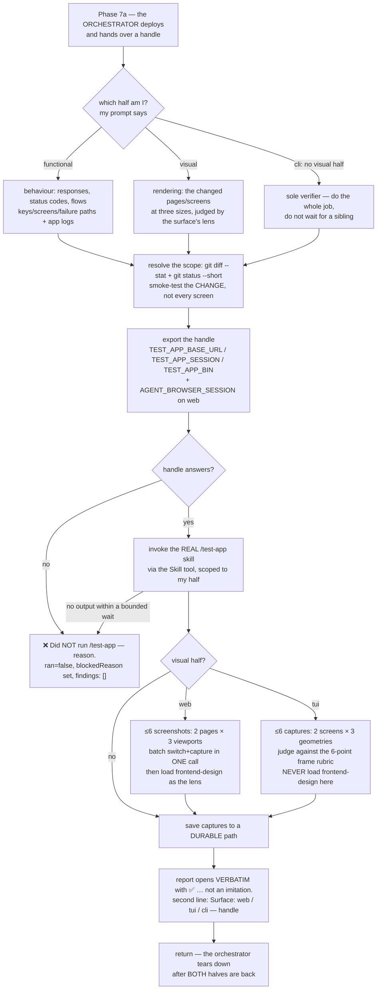

# `r:bug-hunter-ui` — behaviour register

The bundled **UI / runtime verifier** for the `/r:task-review` pipeline. The static reviewers read
the code; this one **exercises the running app** and reports what breaks for a real user, plus
genuine rendering-quality regressions. It runs as **ONE HALF of a parallel pair** (a command-line
app has no visual half, so there it runs alone), it **never deploys and never tears down**, and it
is report-only.

Format, ID scheme and the meaning of the three trailing fields: [`README.md`](README.md).

## Flow

## Entries

- **SB-agent-bug-hunter-ui-001** — It is the UI / runtime verifier in the `/r:task-review`
  pipeline: it **exercises the running app** and reports what breaks for a real user — a wrong
  redirect, a 500 on a valid form, a broken or unstyled page, a JS console error, a key that does
  nothing, a pane that never redraws, a flow that no longer works end to end — plus genuine
  rendering-quality regressions. It runs **last**, against the final fixed-and-built code.
  *States it:* `agents/bug-hunter-ui.md`
  *Enforced by:* `skills/task-review/task-review.workflow.js`
  *Tested by:* `skills/task-review/tests/control-flow.test.mjs`

- **SB-agent-bug-hunter-ui-002** — **Its prompt names its SURFACE as well as its half**, and the
  surface decides the **instrument, not the job**: a web app is driven through a browser at a base
  URL, a terminal app through a real terminal at a session handle, a command-line app is invoked
  directly. It reads only the *Web surface only* or *Terminal surface only* sections that match its
  own surface.
  *States it:* `agents/bug-hunter-ui.md`
  *Enforced by:* `skills/task-review/task-review.workflow.js`
  *Tested by:* —

- **SB-agent-bug-hunter-ui-003** — **Phase 7 is `deploy → (functional half ‖ visual half) →
  teardown`, and the agent is one half of the middle step.** The **functional half** owns behaviour
  — responses, status codes and flows on the web; keys, screens and failure paths in a terminal;
  plus the app logs either way. The **visual half** owns rendering — the changed pages at three
  viewports, or the changed screens at three terminal geometries, judged against the lens that fits
  the surface.
  *States it:* `agents/bug-hunter-ui.md`
  *Enforced by:* `skills/task-review/task-review.workflow.js`
  *Tested by:* `skills/task-review/tests/control-flow.test.mjs`

- **SB-agent-bug-hunter-ui-004** — **A command-line app has no visual half, so there the agent runs
  alone.** Nothing renders, so there is no frame to judge; its prompt says so, and it does the whole
  job rather than waiting for a sibling that was never dispatched. Dispatching an empty second half
  would spend a whole agent to produce "nothing to check".
  *States it:* `agents/bug-hunter-ui.md`
  *Enforced by:* `skills/task-review/task-review.workflow.js`
  *Tested by:* `skills/task-review/tests/control-flow.test.mjs`

- **SB-agent-bug-hunter-ui-005** — **Why the split exists at all.** `/test-app` is *designed* to fan
  out across parallel subagents ("one subagent for one focused area… spawn them in parallel") and
  **cannot** — since Claude Code 2.1.217 subagents have no `Agent` tool; only the main thread, and a
  `Workflow` script that runs there, can spawn. So the orchestrator does the fan-out, exactly as it
  does for `/r:code-bugs`' hunters. Measured over **59 stored runs of the single-agent shape: median
  542s, two thirds of it model time across ~86 serial turns (p90 144 turns, p90 1150s), and not one
  ever spawned a nested agent** — one agent doing four jobs end to end, and the largest serial block
  in the pipeline.
  *States it:* `agents/bug-hunter-ui.md`
  *Enforced by:* `skills/task-review/task-review.workflow.js`
  *Tested by:* —

- **SB-agent-bug-hunter-ui-006** — **It does only the half it was given.** The other half is
  already running; duplicating it is the cost the split removes.
  *States it:* `agents/bug-hunter-ui.md`
  *Enforced by:* `skills/task-review/task-review.workflow.js`
  *Tested by:* —

- **SB-agent-bug-hunter-ui-007** — **Step 1 — resolve the scope.** It verifies the **added/changed
  functionality, not the whole app**, confirming the diff with `git diff --stat` and
  `git status --short` (it runs from the repo root, so `git` works directly) and smoke-testing the
  change rather than every screen.
  *States it:* `agents/bug-hunter-ui.md`
  *Enforced by:* `skills/task-review/task-review.workflow.js`
  *Tested by:* —

- **SB-agent-bug-hunter-ui-008** — **Step 2 — the app is already running, and the agent does NOT
  deploy.** The orchestrator brought it up and passes the handle. It never starts its own: a second
  instance collides with the one the sibling half is using.
  *States it:* `agents/bug-hunter-ui.md`
  *Enforced by:* `skills/task-review/task-review.workflow.js`
  *Tested by:* `skills/task-review/tests/control-flow.test.mjs`

- **SB-agent-bug-hunter-ui-009** — **Web surface — the handle is a live `BASE_URL`**, exported as
  `TEST_APP_BASE_URL` before anything else. That also tells a worktree-aware `/test-app` the stack
  is up, so it tests that URL instead of starting a competing one. **If the URL does not answer, it
  stops and reports that** — it never tests stale code and never reports a pass it did not observe.
  *States it:* `agents/bug-hunter-ui.md`
  *Enforced by:* `skills/task-review/task-review.workflow.js`
  *Tested by:* —

- **SB-agent-bug-hunter-ui-010** — **Web surface — an isolated browser session is mandatory.** The
  prompt names one and it is exported as `AGENT_BROWSER_SESSION` (the pipeline uses `ptr-func` for
  the functional half and `ptr-visual` for the visual one) before the first `agent-browser` call.
  Both halves drive `agent-browser` at the same time; without its own session — its own browser
  instance, cookies and storage — the two share a page and a viewport, and the visual half's switch
  to iPhone 14 **silently reshapes what the other half is looking at**.
  *States it:* `agents/bug-hunter-ui.md`
  *Enforced by:* `skills/task-review/task-review.workflow.js`
  *Tested by:* —

- **SB-agent-bug-hunter-ui-011** — **Terminal surface — the handle is a tmux session (a TUI) or the
  built binary (a command-line app)**, exported as `TEST_APP_SESSION` or `TEST_APP_BIN`.
  *States it:* `agents/bug-hunter-ui.md`
  *Enforced by:* `skills/task-review/task-review.workflow.js`
  *Tested by:* —

- **SB-agent-bug-hunter-ui-012** — **Terminal session isolation is stricter than the web's.** Two
  browser sessions are two browsers over one server; **two tmux sessions are two app processes**.
  The prompt names the session started *for* this agent: it attaches only to that one, **never
  `start`s another and never `stop`s one**. A second instance is the collision the web path's
  no-second-stack rule prevents; stopping one takes the app away from the sibling half. Each TUI
  half therefore gets its own session, because two agents driving one pane interleave their
  keystrokes and both then report nonsense.
  *States it:* `agents/bug-hunter-ui.md`
  *Enforced by:* `skills/task-review/task-review.workflow.js`
  *Tested by:* —

- **SB-agent-bug-hunter-ui-013** — **Terminal surface — drive only through the driver the prompt
  names (`tui-session.sh`), never bare `tmux` and never a hand-rolled `expect` wrapper**, and
  **read its exit codes**: each one names something the agent was *unable to observe*, and reading
  a non-zero as "passed anyway" produces a clean report about a screen nobody saw. **`5` means the
  capture came back empty** — a pane that painted nothing is not a clean screen. **`127` means tmux
  is not installed** — stop and report it with the ❌ line.
  *States it:* `agents/bug-hunter-ui.md`
  *Enforced by:* `skills/task-review/task-review.workflow.js`
  *Tested by:* `skills/test-app-create/tests/tui-session.test.sh`

- **SB-agent-bug-hunter-ui-014** — **Step 3 — run the REAL `/test-app` skill via the `Skill` tool**,
  passing this half's scope as its argument, and **never hand-roll curl / `agent-browser` checks in
  its place**. If `/test-app` cannot run (no such skill, tool unavailable) it says so plainly and
  stops — it does not fabricate results.
  *States it:* `agents/bug-hunter-ui.md`
  *Enforced by:* `skills/task-review/task-review.workflow.js`
  *Tested by:* `skills/task-review/tests/control-flow.test.mjs`

- **SB-agent-bug-hunter-ui-015** — **Bounded waits, every time.** If `/test-app` produces no output
  within a bounded time — it hangs, it never returns — the agent **stops waiting**, opens its report
  with the `❌ Did NOT run …` line and the reason *"/test-app stalled — no output within the wait"*,
  and returns. The same rule covers `frontend-design`, and on a terminal surface the driver's
  `wait-for` deadline, which is **the floor, not a suggestion**. Never wait forever on a stalled
  skill.
  *States it:* `agents/bug-hunter-ui.md`
  *Enforced by:* `skills/task-review/task-review.workflow.js`
  *Tested by:* —

- **SB-agent-bug-hunter-ui-016** — **Step 4, visual half, web — three viewports per changed page**,
  because responsive breakage hides behind a layout that looks fine wide: **desktop**
  `agent-browser set viewport 1280 800`, **tablet** `agent-browser set viewport 768 1024` (iPad
  portrait), **mobile** `agent-browser set device "iPhone 14"` (~390×844). It **resets to
  `1280 800`** when finished so later default screenshots are not skewed.
  *States it:* `agents/bug-hunter-ui.md`
  *Enforced by:* `skills/task-review/task-review.workflow.js`
  *Tested by:* —

- **SB-agent-bug-hunter-ui-017** — **The screenshot budget is at most 6**: the **two** pages this
  diff changed most, each at all three widths; one changed page means three shots. **Measured runs
  took a median of 7 and as many as 35** — beyond about six the extra shots re-show what the first
  ones showed, **and each is an image that then has to be read**. The number is restated in the
  agent because the agent is loaded without the pipeline prompt that also carries it.
  *States it:* `agents/bug-hunter-ui.md`
  *Enforced by:* `skills/task-review/task-review.workflow.js`
  *Tested by:* —

- **SB-agent-bug-hunter-ui-018** — **The viewport switch and the capture are batched into ONE
  call** — `agent-browser batch 'set viewport 768 1024' 'open <url>' 'screenshot <durable path>'` —
  rather than spending a model turn per screenshot.
  *States it:* `agents/bug-hunter-ui.md`
  *Enforced by:* `skills/task-review/task-review.workflow.js`
  *Tested by:* —

- **SB-agent-bug-hunter-ui-019** — **The responsive-correctness checklist applies to the tablet and
  mobile shots**: no horizontal scroll or overflow at narrow widths; nav/menu collapses correctly
  (e.g. to a hamburger) instead of clipping or spilling; content reflows to a single column rather
  than being cut off; tap targets not cramped or overlapping; modals, tables and forms stay usable.
  Same high-confidence bar — **a slightly tight margin on a phone is not a defect; content you
  cannot reach or read is.**
  *States it:* `agents/bug-hunter-ui.md`
  *Enforced by:* `skills/task-review/task-review.workflow.js`
  *Tested by:* —

- **SB-agent-bug-hunter-ui-020** — **Then the design lens, and it is not optional.** The visual half
  loads the **`frontend-design` skill via the `Skill` tool** and uses its aesthetics guidelines —
  typography, colour/theme cohesion, spatial composition, motion, atmosphere/depth, and the "never
  generic AI-slop" rules — as the rubric over the screenshots it captured. It is a **second lens**:
  `/test-app` catches *broken* UI, this judges whether the changed pages are *well-designed*.
  **Measured across 59 verifications it ran in only 11**, which makes it the part most likely to be
  quietly skipped — that number is why the rule is stated as mandatory rather than suggested. Only
  high-confidence design defects are flagged; style preference is skipped. **If `frontend-design`
  hangs**, the design lens is reported as not run with that reason, the findings already gathered
  are kept, and the agent returns rather than blocking.
  *States it:* `agents/bug-hunter-ui.md`
  *Enforced by:* `skills/task-review/task-review.workflow.js`
  *Tested by:* —

- **SB-agent-bug-hunter-ui-021** — **Step 4b, visual half, terminal — three geometries per changed
  screen**, each `resize` → let it redraw → `capture`: **wide `160x50`**, **the app's own default**
  (whatever the skill names), and **`80x24`** — the size every terminal guarantees and where a
  layout that assumes width falls apart. `80x24` **plays the mobile viewport's role**. It resets to
  the wide size before returning.
  *States it:* `agents/bug-hunter-ui.md`
  *Enforced by:* `skills/task-review/task-review.workflow.js`
  *Tested by:* —

- **SB-agent-bug-hunter-ui-022** — **The terminal budget is also at most 6 captures, but for a
  different reason than the web's.** A capture is text and costs nothing to read; the cap here is
  **scope discipline** — the two screens this diff changed most, each at three sizes — and a
  capture of a screen the diff never touched is not pasted at all.
  *States it:* `agents/bug-hunter-ui.md`
  *Enforced by:* `skills/task-review/task-review.workflow.js`
  *Tested by:* —

- **SB-agent-bug-hunter-ui-023** — **The six-point frame rubric**, all of it readable from the
  captured text: (1) **it fits the box** — nothing truncated at the right edge or scrolled off the
  bottom at 80x24, no wrapped line breaking a table row or a border; (2) **columns and borders line
  up** — headers over their data, boxes closed, padding even, with wide characters and emoji the
  usual culprit; (3) **colour is never the only signal** — a state distinguished only by colour is
  invisible on a monochrome terminal, so there must be a glyph or a word too, and no raw escape
  sequences showing as literal text; (4) **focus and affordance** — the focused element is visibly
  focused and the keys that work *here* are shown or one keypress away; (5) **empty and error
  states read as intended** — an empty list says it is empty rather than showing a blank pane, an
  error is a legible message rather than a raw panic in the frame; (6) **redraw is clean** — after a
  resize the frame redraws whole, with no leftovers, doubled borders or stale half-rows.
  *States it:* `agents/bug-hunter-ui.md`
  *Enforced by:* `skills/task-review/task-review.workflow.js`
  *Tested by:* —

- **SB-agent-bug-hunter-ui-024** — **`frontend-design` is NOT loaded on a terminal surface.** Asked
  to grade an 80×24 text frame it produces findings that are not about anything, and they would
  land in **this track's precision**. The six-point rubric is its **replacement** here, not a
  lighter version of it.
  *States it:* `agents/bug-hunter-ui.md`
  *Enforced by:* `skills/task-review/task-review.workflow.js`
  *Tested by:* —

- **SB-agent-bug-hunter-ui-025** — **Step 5 — it never tears anything down.** The orchestrator tears
  the stack down unconditionally after **both** halves return, which is the only safe place for it.
  Running `worktree-deploy.sh teardown` itself deletes the containers **out from under the other
  half, mid-run**; the terminal equivalent is `stop` on a session it did not start.
  *States it:* `agents/bug-hunter-ui.md`
  *Enforced by:* `skills/task-review/task-review.workflow.js`
  *Tested by:* `skills/task-review/tests/worktree-deploy.test.sh`

- **SB-agent-bug-hunter-ui-026** — **Captures are saved to a DURABLE path before the agent
  returns** — never an ephemeral temp dir that gets wiped — because **the app goes away and the
  evidence must not**, and the orchestrator embeds them in a `docs/bugs/` HTML report after the
  stack is gone. On a terminal surface it also resets the geometry to the wide default.
  *States it:* `agents/bug-hunter-ui.md`
  *Enforced by:* `skills/task-review/task-review.workflow.js`
  *Tested by:* —

- **SB-agent-bug-hunter-ui-027** — **Findings are returned in the `/r:code-bugs` finding format** so
  they merge with the rest of the pipeline: **File & line** (the changed code or template the defect
  maps back to, when identifiable from the `/test-app` output; otherwise the affected route/page,
  or — on a terminal surface — the screen and the keystroke that reached it), **What it does** (the
  broken runtime behaviour or design defect, as observed, with evidence), **What it should do**, and
  **Production impact** (what the user sees or loses; for a design defect, the user-facing quality
  cost).
  *States it:* `agents/bug-hunter-ui.md`
  *Enforced by:* `skills/task-review/task-review.workflow.js`
  *Tested by:* —

- **SB-agent-bug-hunter-ui-028** — **Concrete evidence is attached**: a status or exit code, a log
  line, and the screenshot or frame capture. **A frame is text, and that is the advantage** — it
  quotes the three broken lines rather than attaching an image nobody can search, and two
  geometries can be diffed directly.
  *States it:* `agents/bug-hunter-ui.md`
  *Enforced by:* `skills/task-review/task-review.workflow.js`
  *Tested by:* —

- **SB-agent-bug-hunter-ui-029** — **As the visual half it groups its findings in three**:
  design-quality findings separately from broken-layout ones, and responsive findings as their own
  third group, each **tagged with the viewport (or terminal geometry) it failed at** and the capture
  that shows it.
  *States it:* `agents/bug-hunter-ui.md`
  *Enforced by:* `skills/task-review/task-review.workflow.js`
  *Tested by:* —

- **SB-agent-bug-hunter-ui-030** — **The final message OPENS with the confirmation line, verbatim,
  with no preamble and no process narration**:
  `✅ Invoked the real /test-app skill (Skill tool, skill="test-app") over <changed functionality>,
  as the <functional|visual> half against the already-running app — not an imitation.`
  The orchestrator and a human triager **match that line verbatim, without reading the transcript**,
  to trust that a real run happened rather than an LLM imitation — **so its shape does not change
  with the surface**.
  *States it:* `agents/bug-hunter-ui.md`
  *Enforced by:* `skills/task-review/task-review.workflow.js`
  *Tested by:* —

- **SB-agent-bug-hunter-ui-031** — **The provenance goes on a second line, immediately after**:
  `Surface: <web|tui|cli> — <the base URL | the tmux session | the binary path>.` The surface and
  the handle are what let a reader tell which instrument produced the report.
  *States it:* `agents/bug-hunter-ui.md`
  *Enforced by:* `skills/task-review/task-review.workflow.js`
  *Tested by:* —

- **SB-agent-bug-hunter-ui-032** — **When the verification did not run, the report opens with the
  ❌ line instead** — `❌ Did NOT run /test-app — <reason>. No UI verification was performed.` — and
  the named reasons are concrete: no test-app skill, the app not reachable at `BASE_URL`, tmux not
  installed / the driver exited 127 / the session is gone, the app exited at startup / the screen
  stayed empty past the bounded wait / the driver is not on disk / a tool error. **One of the two
  lines leads the report every time**, and findings follow it.
  *States it:* `agents/bug-hunter-ui.md`
  *Enforced by:* `skills/task-review/task-review.workflow.js`
  *Tested by:* `skills/task-review/tests/control-flow.test.mjs`

- **SB-agent-bug-hunter-ui-033** — **A blockage is not a finding.** When it sets `ran=false`, the
  reason goes in **`blockedReason`** and **`findings` comes back empty**: no `fixSize` tag, no
  defect phrasing, and the missing tool, dead stack or absent skill never goes in `where`.
  Everything in `findings` is dispatched to a fixer as work and stored as an adjudicated result, so
  a blockage arriving as a finding is **recorded as a defect somebody found and fixed** — which is
  how the store's only `ui-functional` row reads as 100% precision. Findings it genuinely observed
  still belong in `findings` even when `ran=false`, for a half that fell back to another route and
  saw something real.
  *States it:* `skills/task-review/task-review.workflow.js`
  *Enforced by:* `skills/task-review/task-review.workflow.js`
  *Tested by:* `skills/task-review/tests/control-flow.test.mjs`

- **SB-agent-bug-hunter-ui-034** — **Each finding is tagged `fixSize=minor|major` BY THE SIZE AND
  RISK OF ITS FIX, never by severity** — a one-line fix for a serious bug is still minor. That tag,
  not the severity, is what decides whether the orchestrator fixes it inline or files it.
  *States it:* `skills/task-review/task-review.workflow.js`
  *Enforced by:* `skills/task-review/task-review.workflow.js`
  *Tested by:* `skills/task-review/tests/control-flow.test.mjs`

- **SB-agent-bug-hunter-ui-035** — **Report-only: no fixes, no reproducing tests, no plan mode.**
  The orchestrator (`/r:task-review` Step 8) owns triage — fixing minor findings inline and filing
  the ones that need a bigger change into the project's `issues/` backlog. The frontmatter backs
  it: `tools` is **`Bash, Glob, Grep, Read, Skill`** — `Skill` is there for the two real skills it
  must invoke, and there is **no `Edit` and no `Write`**, so it cannot fix even if a prompt asked it
  to.
  *States it:* `agents/bug-hunter-ui.md`
  *Enforced by:* `tools/validate.py`
  *Tested by:* `validate.sh`

- **SB-agent-bug-hunter-ui-036** — **Only high-confidence defects are reported.** If something is
  likely intentional, or the agent is unsure, it is skipped; if everything passed it says so rather
  than inventing findings. Where the pipeline knows what the change **set out to do**, that intent
  is passed in and an intentional design choice is treated as a feature, not a defect.
  *States it:* `agents/bug-hunter-ui.md`
  *Enforced by:* `skills/task-review/task-review.workflow.js`
  *Tested by:* —

- **SB-agent-bug-hunter-ui-037** — **Diff-scoped, one half only, real tools only.** The three
  constraints restate the rules above as a closing checklist because they are the ones a prompt
  variation most easily loosens: verify the changed functionality not the whole app; the other half
  is running right now; and the actual `/test-app` and `frontend-design` skills via the `Skill`
  tool, **never an imitation of them**.
  *States it:* `agents/bug-hunter-ui.md`
  *Enforced by:* —
  *Tested by:* —

- **SB-agent-bug-hunter-ui-038** — **Independent tool calls are batched into ONE block**, with only
  genuinely dependent calls left serial. Cost is turns × context and every turn re-reads the whole
  accumulated context, **a median of ~77k tokens**. The bullet is one of six identical copies
  across the bundled agents — **deliberate cross-context restatement**, since an agent file loads
  alone, without its siblings and without its calling pipeline.
  *States it:* `agents/bug-hunter-ui.md`
  *Enforced by:* —
  *Tested by:* —

- **SB-agent-bug-hunter-ui-039** — It writes in **simplified (B2 level) English**.
  *States it:* `agents/bug-hunter-ui.md`
  *Enforced by:* —
  *Tested by:* —

- **SB-agent-bug-hunter-ui-040** — Its frontmatter is `model: opus`, `effort: high`, and
  `/r:task-review` pins `effort: 'high'` on the dispatch. **It is a JUDGING track that must not be
  pushed deeper**: measured over 59 stored transcripts, **66% of wall time was model time across a
  median of 86 turns (p90 144) at ~4.2s of thinking each**, and the large majority of those turns
  drive a browser or read a page rather than adjudicate a defect — so every extra second of thinking
  is paid mostly on the mechanical majority. `high` keeps the one judgement that matters: **is this
  a real problem or an intentional design choice.**
  *States it:* `skills/task-review/task-review.workflow.js`
  *Enforced by:* `skills/task-review/task-review.workflow.js`
  *Tested by:* `skills/task-review/tests/control-flow.test.mjs`

## Prose-only behaviours

Held up by wording alone — no *Enforced by:* and no *Tested by:*. Nothing fails if one quietly
stops being true, which is the class a rewrite can lose in silence. This agent is unusually well
covered because `/r:task-review` restates most of its rules in the half prompts it dispatches, so
only 3 of 40 entries are prose alone:

SB-agent-bug-hunter-ui-037, SB-agent-bug-hunter-ui-038, SB-agent-bug-hunter-ui-039.

A larger group is *enforced* by the pipeline prompt but has no suite that fails on it — the
viewports and geometries (**-016**, **-021**), both capture budgets (**-017**, **-022**), the
design lens and its exclusion (**-020**, **-024**), the frame rubric (**-023**), the durable-path
rule (**-026**), the report format and its two lead lines (**-027** through **-031**), and the
session-isolation rules (**-009** through **-012**). A prompt reworded without them changes the
agent's behaviour and nothing goes red.
