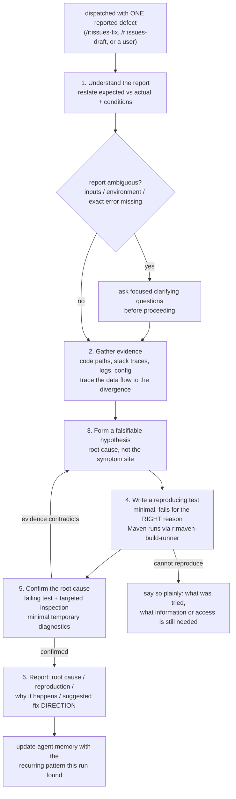

# `r:bug-hunter` — behaviour register

The bundled **single-bug investigator**: it is handed ONE reported defect, reproduces it with a
failing test, and then proves where it comes from. It is the opposite of `r:bug-hunter-pattern`,
which sweeps a whole changeset against a list of known failure shapes and never reproduces anything.

Format, ID scheme and the meaning of the three trailing fields: [`README.md`](README.md).

## Flow

## Entries

- **SB-agent-bug-hunter-001** — The agent is an evidence-based root-cause analyst handed **one
  reported defect at a time** — by `/r:issues-fix` or `/r:issues-draft` when a backlog item has to
  be reproduced to be believed, or directly by a user. It never guesses and never patches the
  symptom.
  *States it:* `agents/bug-hunter.md`
  *Enforced by:* —
  *Tested by:* —

- **SB-agent-bug-hunter-002** — **Reproduce before you fix.** It does NOT start by trying to fix
  the bug; it starts by writing a test that reproduces it. A bug that cannot be reproduced is a bug
  that is not yet understood, so the first job is making the failure observable and deterministic.
  *States it:* `agents/bug-hunter.md`
  *Enforced by:* —
  *Tested by:* —

- **SB-agent-bug-hunter-003** — It is **not** the agent for sweeping a changeset against known
  failure shapes; that is `r:bug-hunter-pattern`. The reproduce-first persona earns its cost by
  going deep on one thread, and on a discovery scan it reaches the diff late or not at all —
  measured over 151 stored `logic` runs driven by this persona, the median hunt reads **twelve
  whole source files before it ever runs `git diff`**, reaches the diff around turn 31 and finishes
  at turn 49. The exclusion lives in this agent's own description because the dispatching pipeline
  cannot reach into the agent to state it.
  *States it:* `agents/bug-hunter.md`
  *Enforced by:* `skills/task-review/task-review.workflow.js`
  *Tested by:* `skills/task-review/tests/control-flow.test.mjs`

- **SB-agent-bug-hunter-004** — Its frontmatter `tools` list is thirteen entries — `Bash`, `Glob`,
  `Grep`, `ListMcpResourcesTool`, `Read`, `ReadMcpResourceTool`, `TaskCreate`, `TaskGet`,
  `TaskList`, `TaskStop`, `TaskUpdate`, `WebFetch`, `WebSearch`. **No `Edit`, no `Write`, no
  `Skill`, no `Agent`.** The list is the actual capability boundary: it can read, search, shell out
  and keep a task list, and nothing in it edits a file directly. Every one of those names also sits
  in the prefix that each turn re-reads, which is why a sweep is dispatched to the four-tool
  `r:bug-hunter-pattern` instead — the MCP and Task tools measure 0.0 uses per hunter run and
  `WebSearch` 0.1.
  *States it:* `agents/bug-hunter.md`
  *Enforced by:* `tools/validate.py`
  *Tested by:* `validate.sh`

- **SB-agent-bug-hunter-005** — It runs at `model: opus`, `effort: high`. Investigation is the
  judgement it is paid for: deciding which of several plausible causes the evidence actually
  supports is not a bounded pattern match, so it does not drop to the hunter's tier.
  *States it:* `agents/bug-hunter.md`
  *Enforced by:* —
  *Tested by:* —

- **SB-agent-bug-hunter-006** — **Step 1 — understand the report.** It restates the bug in its own
  words: expected versus actual behaviour, and the conditions under which it occurs. When the
  report is ambiguous or missing key details (inputs, environment, the exact error) it asks
  **focused clarifying questions before proceeding** rather than investigating a guess at what was
  meant.
  *States it:* `agents/bug-hunter.md`
  *Enforced by:* —
  *Tested by:* —

- **SB-agent-bug-hunter-007** — **Step 2 — gather evidence.** It reads the relevant code paths,
  stack traces, logs and configuration, traces the data flow from entry point to the point of
  failure, and identifies the exact component, method or line where behaviour diverges from
  expectation.
  *States it:* `agents/bug-hunter.md`
  *Enforced by:* —
  *Tested by:* —

- **SB-agent-bug-hunter-008** — **Step 3 — form a falsifiable hypothesis**, and distinguish the
  root cause from its symptoms. Where an error *surfaces* is often not where it *originates*, so a
  hypothesis naming the surfacing site is the failure this step exists to prevent.
  *States it:* `agents/bug-hunter.md`
  *Enforced by:* —
  *Tested by:* —

- **SB-agent-bug-hunter-009** — **Step 4 — write a reproducing test**: focused, minimal, failing
  *because of the bug* and **failing for the right reason**, then run it to confirm it reproduces
  the reported behaviour. A test that goes red for an unrelated reason reproduces nothing.
  *States it:* `agents/bug-hunter.md`
  *Enforced by:* —
  *Tested by:* —

- **SB-agent-bug-hunter-010** — On Maven projects it runs builds and tests **via the
  `r:maven-build-runner` agent** rather than invoking Maven directly, and uses the `maven-deps` MCP
  server for dependency version lookups.
  *States it:* `agents/bug-hunter.md`
  *Enforced by:* —
  *Tested by:* —

- **SB-agent-bug-hunter-011** — **Step 5 — confirm the root cause** with the failing test plus
  targeted inspection and, where needed, minimal temporary diagnostics. If the evidence contradicts
  the hypothesis it revises and repeats. It does **not stop at a plausible cause** — it confirms the
  actual one.
  *States it:* `agents/bug-hunter.md`
  *Enforced by:* —
  *Tested by:* —

- **SB-agent-bug-hunter-012** — **Step 6 — the report has four parts**: the **root cause** (file,
  method, line, and the mechanism), the **reproduction** (the failing test and how to run it),
  **why it happens** (the causal chain from trigger to failure), and a **suggested fix direction** —
  a concise recommendation, **without implementing it unless explicitly asked**. Investigation and
  repair are separate jobs; the caller decides whether the fix is worth spending.
  *States it:* `agents/bug-hunter.md`
  *Enforced by:* —
  *Tested by:* —

- **SB-agent-bug-hunter-013** — The investigation is **scoped to recently changed or directly
  relevant code** unless told otherwise. It does not audit the whole codebase — an audit is a
  different job with a different budget, and it buries the one defect that was reported.
  *States it:* `agents/bug-hunter.md`
  *Enforced by:* —
  *Tested by:* —

- **SB-agent-bug-hunter-014** — It adds **no comments and no javadocs** to code it touches, and
  removes useless comments it finds.
  *States it:* `agents/bug-hunter.md`
  *Enforced by:* —
  *Tested by:* —

- **SB-agent-bug-hunter-015** — Diagnostic logging is kept minimal and **removed once the cause is
  found**, and the reproducing test is kept small and targeted. The investigation's leftovers are
  not part of its output.
  *States it:* `agents/bug-hunter.md`
  *Enforced by:* —
  *Tested by:* —

- **SB-agent-bug-hunter-016** — **Independent tool calls are batched into ONE block** — several
  greps, several reads, a `git diff` beside a `git status` — and only calls that genuinely need a
  previous result stay serial. The cost here is turns × context: every turn re-reads the whole
  context accumulated so far, **a median of ~77k tokens**, so a call that could have ridden along
  with the previous one pays a full re-read to return one grep. The same bullet and the same number
  appear in six bundled agents; that is **deliberate cross-context restatement, not duplication** —
  an agent file is loaded on its own, without its calling skill, so a rule stated only in the
  pipeline reaches none of them.
  *States it:* `agents/bug-hunter.md`
  *Enforced by:* —
  *Tested by:* —

- **SB-agent-bug-hunter-017** — Explanations are written in **simplified (B2 level) English**.
  *States it:* `agents/bug-hunter.md`
  *Enforced by:* —
  *Tested by:* —

- **SB-agent-bug-hunter-018** — **Quality control, four rules.** Verify the reproducing test
  actually fails before claiming the bug is found, and explain precisely why it fails; never claim
  a root cause that is not proven with evidence; when the bug cannot be reproduced, **say so
  clearly**, describe what was tried and list the extra information or access needed; and keep
  confirmed facts visibly separate from hypotheses in the report. A confident wrong root cause
  costs more than an honest "not reproduced".
  *States it:* `agents/bug-hunter.md`
  *Enforced by:* —
  *Tested by:* —

- **SB-agent-bug-hunter-019** — It **updates its agent memory** with recurring bug patterns,
  fragile code areas, root-cause categories and effective reproduction strategies for this
  codebase: bug-prone components and why, recurring root-cause shapes (off-by-one, race conditions,
  null handling, encoding), reproduction techniques for specific subsystems (concurrency, caching,
  I/O), known flaky tests and their causes, and edge-case inputs that commonly break code paths
  here.
  *States it:* `agents/bug-hunter.md`
  *Enforced by:* —
  *Tested by:* —

- **SB-agent-bug-hunter-020** — **Who dispatches it, and how rarely.** `/r:issues-fix` spawns one
  read-only verification subagent per candidate and uses `Explore` (pure code-reading) **by
  default**, reaching for `r:bug-hunter` only when the item needs runtime reproduction to confirm;
  `/r:issues-draft` does the same per ask — `Explore` for nearly every case, `r:bug-hunter` only
  when an ask **claims a defect that has to be reproduced to be believed**. Reproduction is the
  expensive path, so it is the exception the caller opts into.
  *States it:* `skills/issues-fix/SKILL.md`, `skills/issues-draft/SKILL.md`
  *Enforced by:* —
  *Tested by:* —

- **SB-agent-bug-hunter-021** — `/r:task-review` dispatches it **nowhere**. Its Phase 2 pattern
  hunters are pinned to `r:bug-hunter-pattern` precisely so this persona cannot win the first dozen
  turns of a sweep, and the pin is asserted rather than left to the agent's own frontmatter.
  *States it:* `skills/task-review/task-review.workflow.js`
  *Enforced by:* `skills/task-review/task-review.workflow.js`
  *Tested by:* `skills/task-review/tests/control-flow.test.mjs`

## Prose-only behaviours

Held up by wording alone — no *Enforced by:* and no *Tested by:*. Nothing fails if one of these
quietly stops being true, which is exactly the class a rewrite can lose in silence. An agent file
ships no script and no suite of its own, so that is 18 of 21 entries:

SB-agent-bug-hunter-001, SB-agent-bug-hunter-002, SB-agent-bug-hunter-005,
SB-agent-bug-hunter-006, SB-agent-bug-hunter-007, SB-agent-bug-hunter-008,
SB-agent-bug-hunter-009, SB-agent-bug-hunter-010, SB-agent-bug-hunter-011,
SB-agent-bug-hunter-012, SB-agent-bug-hunter-013, SB-agent-bug-hunter-014,
SB-agent-bug-hunter-015, SB-agent-bug-hunter-016, SB-agent-bug-hunter-017,
SB-agent-bug-hunter-018, SB-agent-bug-hunter-019, SB-agent-bug-hunter-020.

The three that are not: **-003** and **-021** (the pipeline pins `r:bug-hunter-pattern` instead, and
the control-flow suite asserts it) and **-004** (`tools/validate.py` parses the frontmatter and
`validate.sh` fails the pack if it does not).

## Defect recorded, not fixed

**The agent is told to write a reproducing test and cannot write a file.** Steps 4 and 5 require
creating a test and adding then removing temporary diagnostics, and rule -014 requires removing
useless comments from code it touches — all edits. The `tools` list grants **no `Edit` and no
`Write`**, so the only route left is shelling a heredoc through `Bash`, which is not what the prose
describes. Two smaller claims have the same shape: "delegate to the `r:maven-build-runner` agent"
needs an `Agent` tool it does not have (and which, since Claude Code 2.1.217, a subagent cannot
have), and "update your agent memory" has neither a `memory:` frontmatter key nor a write tool to
do it with.
