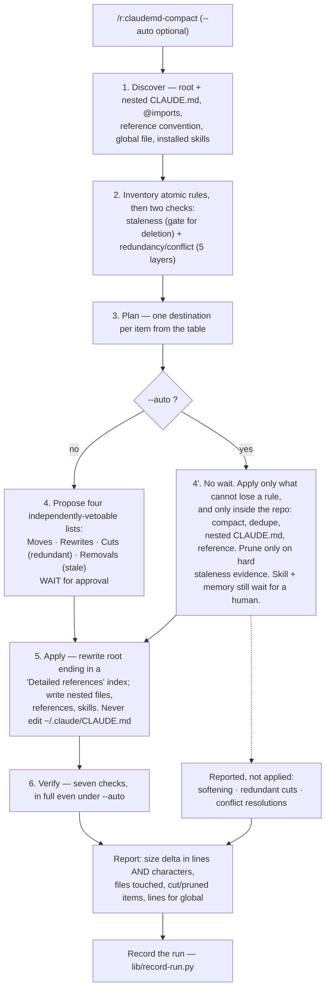

# Behaviour register — `claudemd-compact`

What `/r:claudemd-compact` does, one claim per entry. Format and ID rules: `README.md` beside
this file. IDs are stable; an entry that stops being true is marked `RETIRED` in place.

Sources frozen here: `skills/claudemd-compact/SKILL.md`,
`skills/claudemd-compact/references/patterns.md`,
`skills/claudemd-compact/references/rewrites.md`, `skills/claudemd-compact/evals/evals.json`.

## Flow

## Entries

- **SB-claudemd-compact-001** — The skill's subject is the whole CLAUDE.md infrastructure of one
  project — the root file, every nested module `CLAUDE.md`, and the reference docs extracted from
  them — reorganized so the always-on context stays lean and accurate without losing a rule that
  still matters.
  *States it:* `skills/claudemd-compact/SKILL.md`
  *Enforced by:* —
  *Tested by:* —

- **SB-claudemd-compact-002** — `CLAUDE.md` is always-on context: the root file, every nested
  `CLAUDE.md` and anything pulled in via `@imports` load on essentially every turn, so every token
  is charged every turn.
  *States it:* `skills/claudemd-compact/SKILL.md`
  *Enforced by:* —
  *Tested by:* —

- **SB-claudemd-compact-003** — The file is charged twice: **volume cost** (duplication, stale
  commands, giant inline samples, exhaustive lists, module detail in the root) and **constraint
  cost**, which does not show up as length — an accurate rule that over-constrains a decision the
  model makes well, restates the repo, or disagrees with the harness, another CLAUDE.md or a skill,
  leaving the model to work out which instruction wins.
  *States it:* `skills/claudemd-compact/SKILL.md`
  *Enforced by:* —
  *Tested by:* —

- **SB-claudemd-compact-004** — Over **80%** of Claude Code's own system prompt turned out to be
  removable with no measurable loss — the guidance was not wrong, it was in the way. That number is
  why the skill hunts constraint cost at all rather than only length.
  *States it:* `skills/claudemd-compact/SKILL.md`
  *Enforced by:* —
  *Tested by:* —

- **SB-claudemd-compact-005** — There are exactly four moves: **compact** (tighten and dedupe),
  **reorganize** (put content where it is needed — mostly progressive disclosure), **soften**
  (restate a rigid rule as the intent behind it) and **prune** (remove what the codebase
  contradicts).
  *States it:* `skills/claudemd-compact/SKILL.md`
  *Enforced by:* —
  *Tested by:* —

- **SB-claudemd-compact-006** — The keep test is **"would the model get this wrong without being
  told?"**, never "is this true?" — most bloat is true, which is why truth cannot be the filter.
  *States it:* `skills/claudemd-compact/SKILL.md`
  *Enforced by:* —
  *Tested by:* —

- **SB-claudemd-compact-007** — That test resolves three ways: readable off the file tree,
  `pom.xml` or `package.json`, or known to any competent engineer with the repo open → **cut**;
  something the model would do anyway, ordinary good practice or already instructed by the harness
  → **cut**; plausibly and expensively gettable wrong → **keep**, because gotchas are what the file
  is for.
  *States it:* `skills/claudemd-compact/SKILL.md`
  *Enforced by:* —
  *Tested by:* —

- **SB-claudemd-compact-008** — Intent is preferred over prohibition: "match the comment density of
  the surrounding code" reaches cases a list of banned constructs never anticipated, and does not
  fight the user when they ask for something different.
  *States it:* `skills/claudemd-compact/SKILL.md`
  *Enforced by:* —
  *Tested by:* —

- **SB-claudemd-compact-009** — **Progressive disclosure is the default move for anything long** —
  a one-line pointer in the always-on file, the body one hop away in a nested `CLAUDE.md`, a
  reference doc or a skill — because most root bloat is neither wrong nor redundant, only rarely
  needed.
  *States it:* `skills/claudemd-compact/SKILL.md`
  *Enforced by:* —
  *Tested by:* —

- **SB-claudemd-compact-010** — Disclosure is reached for first because **it is the only move that
  cannot lose anything, so it needs no evidence**; cutting and pruning do, because information
  leaves the project. When something is long and its place in the root is uncertain, extract it
  rather than agonize: a reference nobody opens costs one line, the same text inline costs its full
  length every turn.
  *States it:* `skills/claudemd-compact/SKILL.md`
  *Enforced by:* —
  *Tested by:* —

- **SB-claudemd-compact-011** — The root ends up as a map: the short rules that shape most edits,
  the gotchas, and an index of plain on-demand pointers.
  *States it:* `skills/claudemd-compact/SKILL.md`
  *Enforced by:* —
  *Tested by:* —

- **SB-claudemd-compact-012** — **Every pointer names when to follow it** ("read
  `.claude/docs/testing.md` before touching the integration tests"), never a bare filename — an
  extraction the model never opens is a deletion with extra steps.
  *States it:* `skills/claudemd-compact/SKILL.md`
  *Enforced by:* —
  *Tested by:* —

- **SB-claudemd-compact-013** — Every item gets one destination from a fixed table of ten: **keep**,
  **soften**, **relocate to a nested `CLAUDE.md`**, **extract to a reference**, **extract to a
  skill**, **point at code**, **move to memory**, **flag for global**, **cut**, **prune**.
  *States it:* `skills/claudemd-compact/SKILL.md`
  *Enforced by:* —
  *Tested by:* —

- **SB-claudemd-compact-014** — The three disclosure destinations are one idea at three
  granularities — a nested `CLAUDE.md` discloses by scope, a reference by task, a skill by
  invocation — and between any of them and a **cut**, the disclosure wins, because a cut has to be
  defended with evidence.
  *States it:* `skills/claudemd-compact/SKILL.md`
  *Enforced by:* —
  *Tested by:* —

- **SB-claudemd-compact-015** — A **skill** beats a reference when the content has a natural trigger
  and steps of its own, because a skill can be invoked where a reference is only read if the root
  remembers to mention it; a rule with no procedure attached is a rule, not a skill.
  *States it:* `skills/claudemd-compact/SKILL.md`
  *Enforced by:* —
  *Tested by:* —

- **SB-claudemd-compact-016** — **Pointing at code** beats prose about code: a test suite or a real
  function cannot drift the way a prose copy will, and an HTML mockup beats a description of a
  layout.
  *States it:* `skills/claudemd-compact/SKILL.md`
  *Enforced by:* —
  *Tested by:* —

- **SB-claudemd-compact-017** — Decision logs, dated notes and "we chose X because Y" move to
  **memory** — they are session memory, not instructions. The *rule* stays in CLAUDE.md if one
  exists ("cache with Caffeine, don't add a network cache"); only the *story* moves, into
  `~/.claude/projects/<project-slug>/memory/<name>.md` with a one-line pointer added to that
  directory's `MEMORY.md`.
  *States it:* `skills/claudemd-compact/references/rewrites.md`
  *Enforced by:* —
  *Tested by:* —

- **SB-claudemd-compact-018** — A rule that *should* be global — true of the user's other projects
  too, not just this one — is **flagged**, never moved: the skill suggests the lines and leaves them
  in place. A rule that already **is** in the global file is a **cut**, not a flag.
  *States it:* `skills/claudemd-compact/SKILL.md`
  *Enforced by:* —
  *Tested by:* —

- **SB-claudemd-compact-019** — `@path` is an **eager import**, recursively pulled into context at
  load time, so it saves nothing — it relocates text that still loads every turn. Extracted content
  is linked with a plain on-demand instruction, **never** with `@`, and converting an oversized
  `@import` into a plain reference is a win on its own even if nothing else moves.
  *States it:* `skills/claudemd-compact/SKILL.md`
  *Enforced by:* —
  *Tested by:* —

- **SB-claudemd-compact-020** — Facts and intent survive the pass; framing may change. Every rule
  that still reflects reality ends up somewhere — root, a nested file, a reference, a skill, memory,
  or a "suggest adding to global" note.
  *States it:* `skills/claudemd-compact/SKILL.md`
  *Enforced by:* —
  *Tested by:* —

- **SB-claudemd-compact-021** — **Three moves alter a rule rather than relocate it, and each needs
  its own evidence.** Conflating their evidence rules is how a pass deletes something it could not
  justify.
  *States it:* `skills/claudemd-compact/SKILL.md`
  *Enforced by:* —
  *Tested by:* —

- **SB-claudemd-compact-022** — **prune** (delete something false) needs **hard codebase evidence**
  of staleness: a path, script, module or symbol that does not exist, or a command the build config
  contradicts. Never delete on an impression.
  *States it:* `skills/claudemd-compact/SKILL.md`
  *Enforced by:* —
  *Tested by:* —

- **SB-claudemd-compact-023** — **cut** (delete something true) needs the *opposite* evidence —
  where it still says it: the file tree, build file, harness instruction, global rule or skill that
  carries it. If you cannot point at one, it is not redundant.
  *States it:* `skills/claudemd-compact/SKILL.md`
  *Enforced by:* —
  *Tested by:* —

- **SB-claudemd-compact-024** — **soften** (rewrite) is a judgement call, so it is always shown as a
  before/after and always needs approval. It preserves intent — a rewrite that drops the intent is a
  cut or a prune and needs that list's evidence instead.
  *States it:* `skills/claudemd-compact/SKILL.md`
  *Enforced by:* —
  *Tested by:* —

- **SB-claudemd-compact-025** — Anything that cannot be confirmed either way is **flagged and
  kept** — raised as a question, never resolved by deleting.
  *States it:* `skills/claudemd-compact/SKILL.md`
  *Enforced by:* —
  *Tested by:* —

- **SB-claudemd-compact-026** — **A deliberate preference is not over-constraint.** Where the user
  has said how they want their code to look, that is a decision, not a guardrail left over from a
  weaker model; the tell is whether the rule expresses taste ("no javadoc unless I ask") or defends
  against a failure. Such a rule is left exactly as written.
  *States it:* `skills/claudemd-compact/SKILL.md`
  *Enforced by:* —
  *Tested by:* —

- **SB-claudemd-compact-027** — **A hook and its prose rule coexist by design.**
  `r:claudemd-patch` installs both on purpose — the hook enforcing deterministically, the prose
  explaining why — so the text is never deleted because a hook covers it.
  *States it:* `skills/claudemd-compact/SKILL.md`
  *Enforced by:* —
  *Tested by:* —

- **SB-claudemd-compact-028** — Step 1 reads the root `CLAUDE.md` and globs `**/CLAUDE.md` for
  nested files, skipping `node_modules`, build output and vendored directories.
  *States it:* `skills/claudemd-compact/SKILL.md`
  *Enforced by:* —
  *Tested by:* —

- **SB-claudemd-compact-029** — Step 1 skips **git worktrees** (`.git/`, `.claude/worktrees/`,
  anything `git worktree list` reports) and checks for them **before** globbing, not after: a
  worktree holds a second copy of the hierarchy on another branch, and treating it as nested module
  files would "reconcile" the branches into each other.
  *States it:* `skills/claudemd-compact/SKILL.md`
  *Enforced by:* —
  *Tested by:* —

- **SB-claudemd-compact-030** — Step 1 follows every `@import` and notes what it pulls in and how
  big it is.
  *States it:* `skills/claudemd-compact/SKILL.md`
  *Enforced by:* —
  *Tested by:* —

- **SB-claudemd-compact-031** — Step 1 detects the project's existing reference convention — a
  `docs/` or `.claude/docs/` directory — and follows it; absent one, the default destination is
  `.claude/docs/`.
  *States it:* `skills/claudemd-compact/SKILL.md`
  *Enforced by:* —
  *Tested by:* —

- **SB-claudemd-compact-032** — Step 1 reads the global `~/.claude/CLAUDE.md` and the installed
  skills — both `~/.claude/skills/*/SKILL.md` and any project-local `.claude/skills/` — **for
  comparison only**. A name present in both shadows silently and is raised. The model's own system
  prompt is in context as a further layer, and the one projects duplicate without realizing it.
  *States it:* `skills/claudemd-compact/SKILL.md`
  *Enforced by:* —
  *Tested by:* —

- **SB-claudemd-compact-033** — Step 2 breaks the content into **atomic rules** and, for each, notes
  how often it applies, which scope owns it, and whether it is duplicated, verbose or misplaced.
  *States it:* `skills/claudemd-compact/SKILL.md`
  *Enforced by:* —
  *Tested by:* —

- **SB-claudemd-compact-034** — Step 2 then runs two checks: **staleness** (do referenced paths,
  scripts, directories, modules and symbols still exist; do the stated build/test/run commands match
  `package.json` / `pom.xml` / `build.gradle` / `Makefile`) — this is what makes pruning safe — and
  **redundancy and conflict** (does the rule restate the repo, harness, global file or a skill, and
  does anything here contradict anything there).
  *States it:* `skills/claudemd-compact/SKILL.md`
  *Enforced by:* —
  *Tested by:* —

- **SB-claudemd-compact-035** — The staleness sweep checks four things against the repo: paths,
  scripts and directories exist; commands match `package.json`, `pom.xml`, `build.gradle`,
  `Makefile`, `justfile` or a real script; named classes, functions and endpoints still exist (grep
  them); and conventions the code contradicts — the last being ambiguous, because the rule may be
  aspirational rather than dead.
  *States it:* `skills/claudemd-compact/references/patterns.md`
  *Enforced by:* —
  *Tested by:* —

- **SB-claudemd-compact-036** — A contradicted sentence splits on **describes vs prescribes**, and
  the halves get opposite treatment: a *description* the code refutes is wrong — correct it, or
  prune it if the corrected version would be redundant; a *prescription* is not disproved by
  divergent code, which may be the debt the rule exists to fix — flag and ask. The tell: if the
  divergence would be reported as a bug, the rule is being violated, not dead.
  *States it:* `skills/claudemd-compact/references/patterns.md`
  *Enforced by:* —
  *Tested by:* —

- **SB-claudemd-compact-037** — Only the objective staleness findings — a referenced path, script,
  module or symbol that does not exist, or a command the build config has renamed — are confident
  enough to prune, and **they are the only things `--auto` may delete**. A convention that only
  seems contradicted, and anything unverifiable either way, is flagged and kept.
  *States it:* `skills/claudemd-compact/references/patterns.md`
  *Enforced by:* —
  *Tested by:* —

- **SB-claudemd-compact-038** — Removal evidence is presented one line each, claim plus why, under a
  `Removed (stale):` heading.
  *States it:* `skills/claudemd-compact/references/patterns.md`
  *Enforced by:* —
  *Tested by:* —

- **SB-claudemd-compact-039** — A rule is compared against five competing sources of instruction:
  (1) the repo itself, (2) the harness / the model's own system prompt, (3) the user's global
  `~/.claude/CLAUDE.md`, (4) installed skills, (5) the project's own referenced docs
  (`ui-design.md`, `spec.md`, an architecture doc), where the worst drift lives because both copies
  are hand-edited and neither knows about the other.
  *States it:* `skills/claudemd-compact/references/patterns.md`
  *Enforced by:* —
  *Tested by:* —

- **SB-claudemd-compact-040** — **Layer 5 is the exception to cutting**: project docs do not
  auto-load, so cutting the CLAUDE.md copy of something only `ui-design.md` says would stop it
  loading at all. Where CLAUDE.md and a project doc overlap, pick an **owner**, leave the other
  pointing at it, and say which is which; where they disagree, the code decides and the loser is
  corrected rather than deleted.
  *States it:* `skills/claudemd-compact/references/patterns.md`
  *Enforced by:* —
  *Tested by:* —

- **SB-claudemd-compact-041** — Each comparison lands on one of three verdicts: **duplicated** → cut
  the project copy, but only against a layer that *also loads* (1–4); **reinforced** → keep, because
  the project's narrower, checkable version carries the information; **contradicted** → surface
  both instructions with their locations, because which one wins is the user's call.
  *States it:* `skills/claudemd-compact/references/patterns.md`
  *Enforced by:* —
  *Tested by:* —

- **SB-claudemd-compact-042** — The two guards — a stated preference is not over-constraint, and a
  hook plus its prose coexist by design — are applied **before** anything is called duplicated.
  *States it:* `skills/claudemd-compact/references/patterns.md`
  *Enforced by:* —
  *Tested by:* —

- **SB-claudemd-compact-043** — The destination rubric's rule of thumb: long *and* read only for one
  kind of task → reference; short *and* shapes most edits → root; neither → it probably should not
  exist at all.
  *States it:* `skills/claudemd-compact/references/patterns.md`
  *Enforced by:* —
  *Tested by:* —

- **SB-claudemd-compact-044** — The inventory is run against a fixed smells checklist, split in two:
  **volume smells** (duplication across root and a nested file; stale build commands, the single
  most common rot; references to deleted files; giant inline code blocks; exhaustive enumerations;
  module detail in the root; always-on `@imports`) and **constraint smells** (restating the repo,
  the harness or a skill; prohibition stacks; examples doing a spec's job; decision logs; procedures
  that want to be a skill; a second source of truth; contradictions).
  *States it:* `skills/claudemd-compact/references/patterns.md`
  *Enforced by:* —
  *Tested by:* —

- **SB-claudemd-compact-045** — Step 3 gives each item exactly one destination, using the reference
  location found in step 1; where two destinations fit, it takes the one that **keeps the rule but
  gets it off the always-on path** — the choice that never has to be justified. The sanity check is
  whether the root would read as a map with pointers, and for anything still inline, what it is
  doing on every turn.
  *States it:* `skills/claudemd-compact/SKILL.md`
  *Enforced by:* —
  *Tested by:* —

- **SB-claudemd-compact-046** — Step 4 **waits for approval before editing anything** (in `--auto`
  the step loses its wait, not its content).
  *States it:* `skills/claudemd-compact/SKILL.md`
  *Enforced by:* —
  *Tested by:* —

- **SB-claudemd-compact-047** — Step 4 presents **four separate lists**, because they carry
  different risk and the user vetoes them independently: **Moves**, **Rewrites**, **Cuts
  (redundant)** and **Removals (stale)**.
  *States it:* `skills/claudemd-compact/SKILL.md`
  *Enforced by:* —
  *Tested by:* —

- **SB-claudemd-compact-048** — The **Moves** list is grouped by destination and **marks the two
  that leave the repo** — a new skill and a memory file — because `git revert` will not undo them.
  *States it:* `skills/claudemd-compact/SKILL.md`
  *Enforced by:* —
  *Tested by:* —

- **SB-claudemd-compact-049** — The **Rewrites** list shows each softened rule as before/after, so a
  change in meaning is visible rather than buried in a diff.
  *States it:* `skills/claudemd-compact/SKILL.md`
  *Enforced by:* —
  *Tested by:* —

- **SB-claudemd-compact-050** — **Cuts (redundant)** carry as evidence *where it is already stated*
  ("module list — `settings.gradle` names all six"); **Removals (stale)** carry as evidence *the
  absence* ("`run ./scripts/build.sh` — no such file; the build is `mvn package`").
  *States it:* `skills/claudemd-compact/SKILL.md`
  *Enforced by:* —
  *Tested by:* —

- **SB-claudemd-compact-051** — Those two lists are kept apart, because **only staleness clears the
  `--auto` gate** and a true-but-redundant cut stays a judgement call.
  *States it:* `skills/claudemd-compact/SKILL.md`
  *Enforced by:* —
  *Tested by:* —

- **SB-claudemd-compact-052** — Step 4 reports the root size before → after in **both lines and
  characters**, because wrapped paragraphs can cost more than a file twice their line count.
  *States it:* `skills/claudemd-compact/SKILL.md`
  *Enforced by:* —
  *Tested by:* —

- **SB-claudemd-compact-053** — Step 4 then lists what is flagged for global **with exact lines**,
  since the skill will not move them.
  *States it:* `skills/claudemd-compact/SKILL.md`
  *Enforced by:* —
  *Tested by:* —

- **SB-claudemd-compact-054** — Conflicts are reported **as questions, not decisions**, and they run
  both ways: a project rule that contradicts a global one, and a **global rule that does not fit
  this project** ("use the maven-deps MCP" in a Gradle-only repo) — easy to miss, and it costs the
  model a decision on every turn.
  *States it:* `skills/claudemd-compact/SKILL.md`
  *Enforced by:* —
  *Tested by:* —

- **SB-claudemd-compact-055** — A conflict is resolved only once the user answers, and when the
  project rule wins it says so explicitly ("javadoc on public API here, overriding my global
  default") so the next reader does not re-open the question. The same treatment covers a project
  rule contradicting a skill, and two nested `CLAUDE.md` files disagreeing about one directory.
  *States it:* `skills/claudemd-compact/references/rewrites.md`
  *Enforced by:* —
  *Tested by:* —

- **SB-claudemd-compact-056** — Where a rule ends up somewhere non-obvious, step 4 prints one line
  per rule — `old location → new location` — so the user can confirm nothing fell out.
  *States it:* `skills/claudemd-compact/SKILL.md`
  *Enforced by:* —
  *Tested by:* —

- **SB-claudemd-compact-057** — Step 5 rewrites the root lean, reordered and deduped, **ending with
  a short "Detailed references" index** of plain on-demand pointers, each naming when to follow it.
  *States it:* `skills/claudemd-compact/SKILL.md`
  *Enforced by:* —
  *Tested by:* —

- **SB-claudemd-compact-058** — Step 5 writes the nested files, references and skills the plan
  called for, and gives a reference over **~300 lines** a short table of contents.
  *States it:* `skills/claudemd-compact/SKILL.md`
  *Enforced by:* —
  *Tested by:* —

- **SB-claudemd-compact-059** — The skill **never edits the global `~/.claude/CLAUDE.md`**; it
  prints the lines it suggests adding instead.
  *States it:* `skills/claudemd-compact/SKILL.md`
  *Enforced by:* —
  *Tested by:* —

- **SB-claudemd-compact-060** — Step 6 verifies **seven** things: every still-valid rule is present
  somewhere; every removal was approved and carried evidence; every rewrite kept the original
  intent; nothing came back as an eager `@import`; every reference link resolves to a file that now
  exists and each pointer says when to follow it; nothing in the result contradicts anything else;
  and the root is meaningfully leaner than before.
  *States it:* `skills/claudemd-compact/SKILL.md`
  *Enforced by:* —
  *Tested by:* —

- **SB-claudemd-compact-061** — The closing report names the root size delta in lines **and**
  characters, the files created or updated, the items cut and pruned, and the lines suggested for
  global. Skills carry the same two costs, and `/doctor` is offered for those.
  *States it:* `skills/claudemd-compact/SKILL.md`
  *Enforced by:* —
  *Tested by:* —

- **SB-claudemd-compact-062** — `--auto` is the non-interactive mode, invoked by `/r:task-review`'s
  keep-CLAUDE.md-lean step or whenever the user wants compaction with no confirmations. It is the
  same workflow without the wait in step 4.
  *States it:* `skills/claudemd-compact/SKILL.md`
  *Enforced by:* —
  *Tested by:* —

- **SB-claudemd-compact-063** — The governing line, because nobody is watching: **`--auto` applies
  only what cannot lose a rule, and only inside the repo.** The lossless in-repo operations —
  compact, dedupe, relocate to a nested `CLAUDE.md`, extract to a reference — always run; pruning
  runs only on hard codebase evidence of staleness, with anything unconfirmed kept.
  *States it:* `skills/claudemd-compact/SKILL.md`
  *Enforced by:* —
  *Tested by:* —

- **SB-claudemd-compact-064** — With every judgement call withheld, progressive disclosure is where
  nearly all the win comes from under `--auto`, so the pass is deliberately generous with it.
  *States it:* `skills/claudemd-compact/SKILL.md`
  *Enforced by:* —
  *Tested by:* —

- **SB-claudemd-compact-065** — Everything resting on judgement — softening, redundant cuts,
  conflict resolutions — is **reported as a suggestion and left in place** under `--auto`.
  *States it:* `skills/claudemd-compact/SKILL.md`
  *Enforced by:* —
  *Tested by:* —

- **SB-claudemd-compact-066** — **Creating a skill and moving content to memory also wait for a
  human under `--auto`** — costing nothing is not the same as needing no approval. Both are
  judgement calls, and both write outside the repo, where `git revert` does not reach.
  *States it:* `skills/claudemd-compact/SKILL.md`
  *Enforced by:* —
  *Tested by:* —

- **SB-claudemd-compact-067** — **Step 6 runs in full every time, `--auto` included** — it is the
  only remaining net, so a valid rule that did not survive is restored before finishing.
  *States it:* `skills/claudemd-compact/SKILL.md`
  *Enforced by:* —
  *Tested by:* —

- **SB-claudemd-compact-068** — After an `--auto` run the step-4 report is printed in full — root
  size before → after, what moved where, a clearly-marked **"Removed (stale)"** list with per-item
  evidence, and the **Rewrites** and **Cuts** lists. Those last two matter *more* here: `--auto`
  leaves them unapplied, so the before/after wording is the entire deliverable. Everything applied
  is in the diff, one `git revert` away.
  *States it:* `skills/claudemd-compact/SKILL.md`
  *Enforced by:* —
  *Tested by:* —

- **SB-claudemd-compact-069** — If the project's standard blocks are missing, an `--auto` run
  **notes that `/r:claudemd-patch` would refresh them rather than running it unattended**.
  *States it:* `skills/claudemd-compact/SKILL.md`
  *Enforced by:* —
  *Tested by:* —

- **SB-claudemd-compact-070** — The caller-side gate on the unattended run: `/r:task-review`
  dispatches `/r:claudemd-compact --auto` with no confirmation, but only when CLAUDE.md changed
  this turn **and** the root exceeds ~200 lines, and it may only delete a rule the codebase proves
  stale. It runs in the main agent after Step 9a (record learnings), because the gate keys off
  whether CLAUDE.md changed this turn and the 9a append is usually what makes that true.
  *States it:* `skills/task-review/SKILL.md`
  *Enforced by:* —
  *Tested by:* —

- **SB-claudemd-compact-071** — The two skills **chain, never merge**: `r:claudemd-patch` *adds* the
  user's canonical rule blocks, this skill *restructures and prunes* what is already there. Where
  those blocks (Test-Writing Policy, Code Conventions, removal of a post-task auto-run block) are
  missing or clearly stale, this skill suggests running `/r:claudemd-patch` and **does not write
  them itself**.
  *States it:* `skills/claudemd-compact/SKILL.md`
  *Enforced by:* —
  *Tested by:* —

- **SB-claudemd-compact-072** — The run is recorded with one line into the pack-wide store via
  `${CLAUDE_PLUGIN_ROOT}/lib/record-run.py`, carrying `skill`, `mode`, `filesRead`, `bytesBefore`,
  `bytesAfter`, `rulesKept`, `rulesRewritten`, `rulesMovedToReference`, `rulesMovedToSkill`,
  `rulesDropped`, `conflictsResolved`, `staleFound`, `wrote` and `blockedReason`.
  *States it:* `skills/claudemd-compact/SKILL.md`
  *Enforced by:* `lib/record-run.py`
  *Tested by:* `lib/tests/stats.test.sh`

- **SB-claudemd-compact-073** — The recorded row carries **counts and byte sizes only** — never a
  rule's text, a file path outside the project root, or anything quoted from the CLAUDE.md.
  *States it:* `skills/claudemd-compact/SKILL.md`
  *Enforced by:* —
  *Tested by:* —

- **SB-claudemd-compact-074** — `mode` is `interactive` | `auto`, because `--auto` decides without a
  gate and its `rulesDropped` therefore means something different from a number a human approved.
  *States it:* `skills/claudemd-compact/SKILL.md`
  *Enforced by:* —
  *Tested by:* —

- **SB-claudemd-compact-075** — **`bytesBefore` against `bytesAfter` is the only number that says
  whether this skill did its job** — always-on context cost is what it exists to reduce — and it is
  read **beside `rulesDropped`**, because only the pair distinguishes compaction (moved behind
  references) from deletion.
  *States it:* `skills/claudemd-compact/SKILL.md`
  *Enforced by:* —
  *Tested by:* —

- **SB-claudemd-compact-076** — **`staleFound` justifies the de-staling half.** If it stays zero
  across many runs, the pass reads every rule and catches nothing, and the skill is just a
  reorganizer.
  *States it:* `skills/claudemd-compact/SKILL.md`
  *Enforced by:* —
  *Tested by:* —

- **SB-claudemd-compact-077** — **`wrote: false` with no `blockedReason` is a decline; with one it
  is a blockage** — a CLAUDE.md that could not be read or written is an absence of judgement, not a
  judgement that nothing needed compacting.
  *States it:* `skills/claudemd-compact/SKILL.md`
  *Enforced by:* —
  *Tested by:* —

- **SB-claudemd-compact-078** — `record-run.py` always exits `0` — a lost row is a lost row, never a
  failed run — it must never change what was written, and it is **never retried**.
  *States it:* `skills/claudemd-compact/SKILL.md`
  *Enforced by:* `lib/record-run.py`
  *Tested by:* `lib/tests/stats.test.sh`

- **SB-claudemd-compact-079** — The skill is **model-invocable** (no `disable-model-invocation`
  flag), so its description is billed against the router's listing budget, and it runs at
  `effort: medium`.
  *States it:* `skills/claudemd-compact/SKILL.md`
  *Enforced by:* `tools/validate.py`
  *Tested by:* —

- **SB-claudemd-compact-080** — Routing is split against its neighbour: a prompt about an oversized
  or stale CLAUDE.md routes **here**, while "add my usual test-writing policy block" routes to
  `claudemd-patch` and must not load this skill — this one reorganizes what is there rather than
  adding standard blocks.
  *States it:* `skills/claudemd-compact/SKILL.md`
  *Enforced by:* —
  *Tested by:* —

- **SB-claudemd-compact-081** — `references/patterns.md` is read **while inventorying and deciding
  destinations**; it holds the destination rubric, the staleness heuristics, the
  redundancy-and-conflict heuristics and the smells checklist.
  *States it:* `skills/claudemd-compact/SKILL.md`
  *Enforced by:* —
  *Tested by:* —

- **SB-claudemd-compact-082** — `references/rewrites.md` holds one worked before/after per
  transformation, in nine numbered sections: rigid rule → intent, obvious fact → cut, long section →
  reference, module rule → nested `CLAUDE.md`, eager `@import` → plain reference, procedure →
  skill, prose spec → pointer at code, decision log → memory, cross-layer conflict → resolution.
  *States it:* `skills/claudemd-compact/references/rewrites.md`
  *Enforced by:* —
  *Tested by:* —

- **SB-claudemd-compact-083** — Sections 3–6 of `rewrites.md` are the **progressive-disclosure
  family** — three destinations that keep a rule while taking it off the always-on path, differing
  only in what triggers the reload (a task, a directory, an invocation), plus §5, the repair for the
  one link form that *looks* like disclosure and is not. Most of the size delta in a good compaction
  comes from this family, not from deletion.
  *States it:* `skills/claudemd-compact/references/rewrites.md`
  *Enforced by:* —
  *Tested by:* —

- **SB-claudemd-compact-084** — The one way to overdo extraction: pulling out a tiny,
  always-relevant snippet just to link it. Four lines inline beat four lines plus a hop — **"long"
  is the trigger for the move, not "could theoretically live elsewhere"** — and the everyday command
  stays inline.
  *States it:* `skills/claudemd-compact/references/rewrites.md`
  *Enforced by:* —
  *Tested by:* —

- **SB-claudemd-compact-085** — Before a rule moves down into a nested `CLAUDE.md`, the check is
  **who needs to read it**: rules about *how this module is written* move; rules about *how others
  may use it* do not. A boundary rule binds the side that would violate it — "`core` must not import
  adapter packages" is useless in `web-adapter/CLAUDE.md` and belongs in the root or in `core/`.
  *States it:* `skills/claudemd-compact/references/rewrites.md`
  *Enforced by:* —
  *Tested by:* —

- **SB-claudemd-compact-086** — A new skill is **proposed, not created, under `--auto`**: it lands
  outside the repo where `git revert` cannot reach it, so the unattended run reports that move
  instead of doing it.
  *States it:* `skills/claudemd-compact/references/rewrites.md`
  *Enforced by:* —
  *Tested by:* —

## Prose-only behaviours

Held up by wording alone — no *Enforced by:* and no *Tested by:*. Nothing fails if one of these
quietly stops being true, which is the class a rewrite can lose in silence. This skill is prose end
to end (no `scripts/`, no tests), so the exposure is nearly total: **82 of 86** entries.

SB-claudemd-compact-001, -002, -003, -004, -005, -006, -007, -008, -009, -010, -011, -012, -013,
-014, -015, -016, -017, -018, -019, -020, -021, -022, -023, -024, -025, -026, -027, -028, -029,
-030, -031, -032, -033, -034, -035, -036, -037, -038, -039, -040, -041, -042, -043, -044, -045,
-046, -047, -048, -049, -050, -051, -052, -053, -054, -055, -056, -057, -058, -059, -060, -061,
-062, -063, -064, -065, -066, -067, -068, -069, -070, -071, -073, -074, -075, -076, -077, -081,
-082, -083, -084, -085, -086

The four that are not: **-072** and **-078** (the stats sink — `lib/record-run.py`,
`lib/tests/stats.test.sh`), **-079** (`tools/validate.py` + the eval suite) and **-080** (the
neighbour-exclusion eval case).

## Notes for a future editor

- **The layer count disagrees between the two source files.** `SKILL.md` step 1 calls the model's
  own system prompt "the fourth layer" (repo, harness, global, skills — with project docs unlisted),
  `patterns.md` §3 is headed "the five layers" and lists project docs as layer 5, and that section's
  own table of contents at the top of `patterns.md` still says "the four layers". The five-layer
  list is the operative one — layer 5 carries the do-not-cut exception in
  SB-claudemd-compact-040, which nothing else states.
- **`bytesBefore` / `bytesAfter` is the load-bearing pair.** Neither number alone is readable:
  bytes without `rulesDropped` cannot tell compaction from deletion, and `rulesDropped` without
  bytes cannot tell whether anything got cheaper. A future payload trim must keep both.
- **"Outside the repo" is asserted about a destination that is inside it.** SB-claudemd-compact-048,
  -066 and -086 all rest on a new skill landing where `git revert` cannot reach — yet the worked
  example in `references/rewrites.md` §6 writes it to `.claude/skills/verify-change/SKILL.md`, a
  tracked path in the project. Only the memory file (`~/.claude/projects/<slug>/memory/`) is
  unambiguously outside. The gate itself is still right for a different reason the prose also gives
  — creating a skill is a judgement call — so fix the justification, not the gate.
