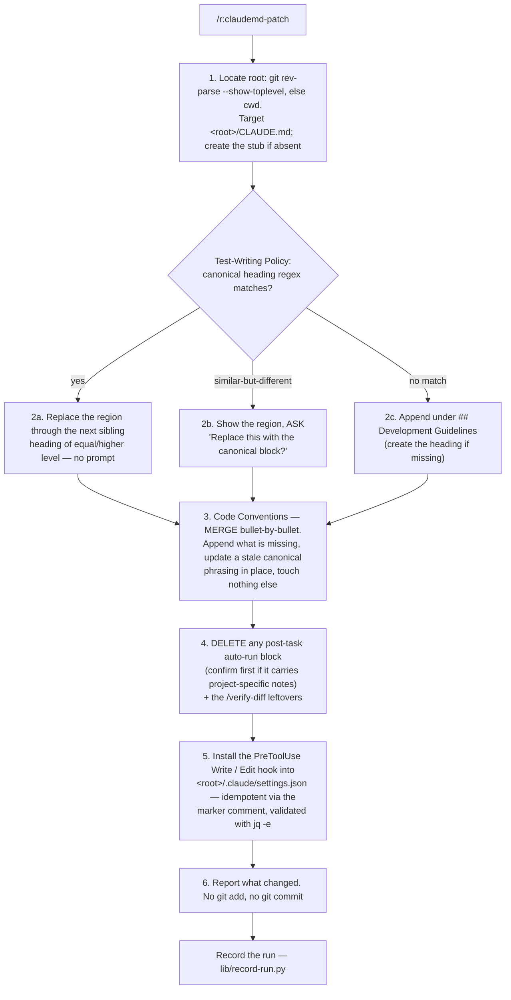

# Behaviour register — `claudemd-patch`

What `/r:claudemd-patch` does, one claim per entry. Format and ID rules: `README.md` beside this
file. IDs are stable; an entry that stops being true is marked `RETIRED` in place.

Sources frozen here: `skills/claudemd-patch/SKILL.md`, `skills/claudemd-patch/evals/evals.json`.
The skill ships no `references/`, no `scripts/` and no `tests/` — its one executable artefact is
the inline `jq` snippet in step 5.

## Flow

## Entries

- **SB-claudemd-patch-001** — The skill inserts the user's canonical reusable rule blocks into one
  project's `CLAUDE.md`, and it maintains exactly three things: two `CLAUDE.md` blocks —
  **Test-Writing Policy** and **Code Conventions** — plus one **enforcement hook** in
  `.claude/settings.json`.
  *States it:* `skills/claudemd-patch/SKILL.md`
  *Enforced by:* —
  *Tested by:* —

- **SB-claudemd-patch-002** — It is **idempotent**: a block already present — or a similar older
  version of it — is replaced, so the latest wording becomes canonical.
  *States it:* `skills/claudemd-patch/SKILL.md`
  *Enforced by:* —
  *Tested by:* —

- **SB-claudemd-patch-003** — It additionally **strips** any post-task auto-run block it finds. That
  removal is one of the three things the skill does, not a side effect.
  *States it:* `skills/claudemd-patch/SKILL.md`
  *Enforced by:* —
  *Tested by:* —

- **SB-claudemd-patch-004** — **Code Conventions is merged bullet-by-bullet, never replaced
  wholesale**, so project-specific conventions survive the patch.
  *States it:* `skills/claudemd-patch/SKILL.md`
  *Enforced by:* —
  *Tested by:* —

- **SB-claudemd-patch-005** — **Why a hook and not just text:** CLAUDE.md text — and a skill's "MUST
  be consulted automatically" description — is *advisory*; the harness runs `r:tests-write` only
  when the model chooses to, so it gets silently skipped at the end of a long turn. A hook is the
  only mechanism the harness executes *deterministically*.
  *States it:* `skills/claudemd-patch/SKILL.md`
  *Enforced by:* —
  *Tested by:* —

- **SB-claudemd-patch-006** — The hook **cannot force the `/r:tests-write` Skill tool to run**; a
  reminder in context on every test-file edit is the closest deterministic enforcement available,
  and the skill claims no more than that.
  *States it:* `skills/claudemd-patch/SKILL.md`
  *Enforced by:* —
  *Tested by:* —

- **SB-claudemd-patch-007** — **No post-task pointer is installed.** The review routine lives in
  `/r:task-review` (`${CLAUDE_PLUGIN_ROOT}/skills/task-review/`) and is **not** automatic: it fires
  only inside `/r:task-run`, which calls it as a mandatory step, or when the user explicitly invokes
  it. A static pointer in `CLAUDE.md` would make the review run on every regular session.
  *States it:* `skills/claudemd-patch/SKILL.md`
  *Enforced by:* —
  *Tested by:* —

- **SB-claudemd-patch-008** — The skill **installs no workflow files and no subagents**.
  *States it:* `skills/claudemd-patch/SKILL.md`
  *Enforced by:* —
  *Tested by:* —

- **SB-claudemd-patch-009** — Invocation is treated as **authority to make `CLAUDE.md` match the
  canonical text, without preserving older phrasings** — the user keeps these rules in sync across
  many projects.
  *States it:* `skills/claudemd-patch/SKILL.md`
  *Enforced by:* —
  *Tested by:* —

- **SB-claudemd-patch-010** — Step 1 locates the target by running `git rev-parse --show-toplevel`;
  outside a git repo it uses the current working directory. The target file is `<root>/CLAUDE.md`.
  *States it:* `skills/claudemd-patch/SKILL.md`
  *Enforced by:* —
  *Tested by:* —

- **SB-claudemd-patch-011** — If `<root>/CLAUDE.md` does not exist, step 1 **creates a stub**: an
  `# CLAUDE.md` heading plus the line "This file provides guidance to Claude Code (claude.ai/code)
  when working with code in this repository."
  *States it:* `skills/claudemd-patch/SKILL.md`
  *Enforced by:* —
  *Tested by:* —

- **SB-claudemd-patch-012** — Step 2 applies the Test-Writing Policy as a **full section**,
  replace-or-append.
  *States it:* `skills/claudemd-patch/SKILL.md`
  *Enforced by:* —
  *Tested by:* —

- **SB-claudemd-patch-013** — Step 2a: on a heading matching the block's primary regex, the region
  from that heading **through the next sibling heading of equal or higher level (or end of file)**
  is extracted and replaced with the freshly-rendered template, **with no prompt** — same block,
  updated wording.
  *States it:* `skills/claudemd-patch/SKILL.md`
  *Enforced by:* —
  *Tested by:* —

- **SB-claudemd-patch-014** — Step 2b: with no canonical heading but similar-but-different content —
  a heading from the "similar headings" column, or test guidance phrased as "write the test FIRST",
  "regression guard", "reproduce the bug" — the skill **shows the matched region with a few lines of
  context and asks "Replace this with the canonical block?" before doing anything**.
  *States it:* `skills/claudemd-patch/SKILL.md`
  *Enforced by:* —
  *Tested by:* —

- **SB-claudemd-patch-015** — Step 2c: with no match at all, the rendered block is appended at the
  end of `CLAUDE.md` under a `## Development Guidelines` heading, created first if missing.
  *States it:* `skills/claudemd-patch/SKILL.md`
  *Enforced by:* —
  *Tested by:* —

- **SB-claudemd-patch-016** — Step 3b: inside an existing Code Conventions section, each canonical
  bullet is checked for an equivalent **by intent** (a bullet already mandating `@Builder` counts);
  missing canonical bullets are appended, **every existing bullet — project-specific or otherwise —
  is left untouched**, and a stale older phrasing of a canonical bullet is updated *just in that
  bullet*.
  *States it:* `skills/claudemd-patch/SKILL.md`
  *Enforced by:* —
  *Tested by:* —

- **SB-claudemd-patch-017** — Step 3c: with no Code Conventions section found, a `## Code
  Conventions` section holding the canonical bullets is appended at the end of `CLAUDE.md`.
  *States it:* `skills/claudemd-patch/SKILL.md`
  *Enforced by:* —
  *Tested by:* —

- **SB-claudemd-patch-018** — Step 4 runs on **every** patch: any post-task auto-run block and any
  `/verify-diff` leftovers are stripped, so the review never fires automatically in regular
  sessions.
  *States it:* `skills/claudemd-patch/SKILL.md`
  *Enforced by:* —
  *Tested by:* —

- **SB-claudemd-patch-019** — The post-task block is detected by its primary heading regex **or** by
  similar-but-different content: a short pointer telling anyone to "run `/r:task-review`"; an inline
  checklist mentioning the review tooling (`r:code-bugs`, `/codex:adversarial-review`, `/sonar`,
  `/security-review`, `gradle-build-runner`, `maven-build-runner`) or chaining "run these checks in
  order"; or a reference to `/verify-diff`.
  *States it:* `skills/claudemd-patch/SKILL.md`
  *Enforced by:* —
  *Tested by:* —

- **SB-claudemd-patch-020** — The matched post-task region — heading through the next sibling
  heading of equal or higher level, or end of file — is **removed entirely, with no replacement**.
  *States it:* `skills/claudemd-patch/SKILL.md`
  *Enforced by:* —
  *Tested by:* —

- **SB-claudemd-patch-021** — If that section also carries genuinely project-specific notes (e.g. a
  custom build command), the skill **shows the region and confirms before deleting** — the one gate
  on an otherwise unprompted deletion.
  *States it:* `skills/claudemd-patch/SKILL.md`
  *Enforced by:* —
  *Tested by:* —

- **SB-claudemd-patch-022** — Step 4 deletes `<root>/.claude/workflows/verify-diff.js` **only if its
  `meta.name` is `verify-diff`**, and `<root>/.claude/agents/verify-diff-agent.md` **only if its
  frontmatter `name` is `verify-diff-agent`**. If a different owner holds either path, it is left
  alone and the user is told.
  *States it:* `skills/claudemd-patch/SKILL.md`
  *Enforced by:* —
  *Tested by:* —

- **SB-claudemd-patch-023** — Step 4's postcondition: **no `CLAUDE.md` text tells anyone to "run
  `/r:task-review`" or "run `/verify-diff`"**.
  *States it:* `skills/claudemd-patch/SKILL.md`
  *Enforced by:* —
  *Tested by:* —

- **SB-claudemd-patch-024** — `verify-diff` and `verify-diff-agent` are named in this SKILL.md
  although both are retired — the skill's job is to find and delete their leftovers, so the names
  have to appear for the search to work. The pack's dangling-reference check exempts them by name,
  and this file is exempt from the bare-agent-name rule because its detection hints quote a *user's*
  CLAUDE.md, where the flat names (`gradle-build-runner`, `maven-build-runner`) are what the search
  has to match. Prefixing them would make the search miss the very lines it exists to find.
  *States it:* `skills/claudemd-patch/SKILL.md`
  *Enforced by:* `tools/validate.py`
  *Tested by:* `validate.sh`

- **SB-claudemd-patch-025** — Step 5 installs the hook into the **project's**
  `.claude/settings.json` — the committed, team-shared settings, the same scope as `CLAUDE.md`, so
  the text rule and its enforcement ship together.
  *States it:* `skills/claudemd-patch/SKILL.md`
  *Enforced by:* —
  *Tested by:* —

- **SB-claudemd-patch-026** — The install is idempotent (keyed off a marker comment), merges into
  existing `hooks` / `permissions` / other settings, and **never clobbers unrelated hooks**.
  *States it:* `skills/claudemd-patch/SKILL.md`
  *Enforced by:* —
  *Tested by:* —

- **SB-claudemd-patch-027** — After writing, the result is validated with `jq -e` and the outcome
  printed — `✓ write-tests hook installed` or `✗ hook install failed — inspect $SETTINGS`.
  *States it:* `skills/claudemd-patch/SKILL.md`
  *Enforced by:* —
  *Tested by:* —

- **SB-claudemd-patch-028** — If `.claude/settings.json` does not exist it is **created**; if the
  project gitignores it, the user is told the hook will not be shared until they track it, and the
  skill **does not un-ignore it itself**.
  *States it:* `skills/claudemd-patch/SKILL.md`
  *Enforced by:* —
  *Tested by:* —

- **SB-claudemd-patch-029** — Step 6 prints a short per-block summary — Test-Writing Policy
  replaced/appended with the old line number, post-task block removed (or "none found"), Code
  Conventions bullets merged, hook installed, `/verify-diff` files removed if present.
  *States it:* `skills/claudemd-patch/SKILL.md`
  *Enforced by:* —
  *Tested by:* —

- **SB-claudemd-patch-030** — The skill does **not** run `git add` or `git commit` — the user
  reviews with `git diff` first.
  *States it:* `skills/claudemd-patch/SKILL.md`
  *Enforced by:* —
  *Tested by:* —

- **SB-claudemd-patch-031** — The **Block markers** table is the single place the three blocks are
  identified, each with a primary heading regex and similar-heading hints that trigger the ask:
  Test-Writing Policy →
  `^#{2,4}\s+(Always Write Tests|Test(ing)?\s+(Policy|Approach(es)?|Rules|Strategy))\b`; post-task
  auto-run →
  `^#{2,4}\s+(After Task Completion|Post[-\s]Task|Definition of Done|Quality Gates|Completion Checklist|After You Finish)\b`;
  Code Conventions → `^#{2,4}\s+Code Conventions?\b`.
  *States it:* `skills/claudemd-patch/SKILL.md`
  *Enforced by:* —
  *Tested by:* —

- **SB-claudemd-patch-032** — The table states each block's mode in its own row heading:
  Test-Writing Policy is *replace-or-append*, the post-task block is *DELETE if found, never
  install*, Code Conventions is *merge bullets, don't replace*.
  *States it:* `skills/claudemd-patch/SKILL.md`
  *Enforced by:* —
  *Tested by:* —

- **SB-claudemd-patch-033** — The canonical templates are **inserted exactly — not paraphrased — and
  there are no substitutions**.
  *States it:* `skills/claudemd-patch/SKILL.md`
  *Enforced by:* —
  *Tested by:* —

- **SB-claudemd-patch-034** — **There is no post-task template**: that block is removed if found and
  never written.
  *States it:* `skills/claudemd-patch/SKILL.md`
  *Enforced by:* —
  *Tested by:* —

- **SB-claudemd-patch-035** — The canonical Test-Writing Policy block is headed `### Always Write
  Tests`, opens with "Every code change ships with tests. Use the `r:tests-write` skill.", and
  carries five bullets: **new code** (happy path plus obvious edge cases; unit tests for pure logic,
  integration tests for anything crossing a boundary — DB, HTTP, AI, Telegram); **bug fix** (write
  the test FIRST — it must fail before the fix and pass after, because a test that already passes
  proves neither the bug nor the fix); **refactor / behavior-preserving change** (test FIRST as a
  regression guard, passing before and after); **intentional behavior change** (test FIRST encoding
  the NEW behavior — fails against the old code, passes against the new); and **skip only for
  non-behavioral edits** (formatting, renames, comments, config-only tweaks with no logic).
  *States it:* `skills/claudemd-patch/SKILL.md`
  *Enforced by:* —
  *Tested by:* —

- **SB-claudemd-patch-036** — The canonical Code Conventions content is a **single bullet**: add the
  Lombok `@Builder` annotation to data classes with more than 3 fields — it keeps construction
  readable and avoids long positional argument lists.
  *States it:* `skills/claudemd-patch/SKILL.md`
  *Enforced by:* —
  *Tested by:* —

- **SB-claudemd-patch-037** — The installed hook is a `PreToolUse` hook on `Write|Edit` whose
  **command** self-filters to JVM test files — `*Test.java`, `*Tests.java`, `*Test.kt`, `*Tests.kt`,
  and anything under `src/test/` — and, only for those, prints a
  `hookSpecificOutput.additionalContext` reminder pointing at the `r:tests-write` skill.
  *States it:* `skills/claudemd-patch/SKILL.md`
  *Enforced by:* —
  *Tested by:* —

- **SB-claudemd-patch-038** — On every other file the command is a **no-op that exits 0** — a
  non-zero exit would surface a spurious hook error on every `Write`/`Edit`. The `|| true` tail in
  the command is what guarantees it.
  *States it:* `skills/claudemd-patch/SKILL.md`
  *Enforced by:* —
  *Tested by:* —

- **SB-claudemd-patch-039** — The matcher is **only `Write|Edit`**, and path filtering happens
  inside the command, because `matcher` matches **tool names, not paths**.
  *States it:* `skills/claudemd-patch/SKILL.md`
  *Enforced by:* —
  *Tested by:* —

- **SB-claudemd-patch-040** — The command reads the target path as
  `(.tool_input.file_path // .tool_input.path) // empty` and tests it with
  `grep -qE 'Tests?\.(java|kt)$|/src/test/'`.
  *States it:* `skills/claudemd-patch/SKILL.md`
  *Enforced by:* —
  *Tested by:* —

- **SB-claudemd-patch-041** — The install is done **with `jq`**, which handles the JSON-escaping of
  the command string — the one step where hand-written JSON would silently corrupt the settings
  file.
  *States it:* `skills/claudemd-patch/SKILL.md`
  *Enforced by:* —
  *Tested by:* —

- **SB-claudemd-patch-042** — The marker comment **`# claudemd-patch:write-tests`** is appended to
  the command string, and the `jq` merge drops every existing `PreToolUse` entry containing it
  before appending the new one — so a re-run **replaces** the prior copy instead of stacking
  duplicates.
  *States it:* `skills/claudemd-patch/SKILL.md`
  *Enforced by:* —
  *Tested by:* —

- **SB-claudemd-patch-043** — The hook is **a fast local shell pipe — `jq` plus `grep` — not an
  extra LLM call**: it runs in milliseconds, spawns no model, and emits text into the *next* turn's
  context only when a test file is touched.
  *States it:* `skills/claudemd-patch/SKILL.md`
  *Enforced by:* —
  *Tested by:* —

- **SB-claudemd-patch-044** — The `additionalContext` is deliberately one sentence, kept terse so
  the per-edit context cost stays negligible.
  *States it:* `skills/claudemd-patch/SKILL.md`
  *Enforced by:* —
  *Tested by:* —

- **SB-claudemd-patch-045** — On a non-JVM project the filter never matches and the hook stays
  silent — harmless. The regex is adjusted **only if the user asks**.
  *States it:* `skills/claudemd-patch/SKILL.md`
  *Enforced by:* —
  *Tested by:* —

- **SB-claudemd-patch-046** — The settings watcher picks up `.claude/settings.json` changes
  mid-session **only if a settings file existed there at session start**, so when the skill creates
  one fresh it tells the user to open `/hooks` once, or restart, to load it.
  *States it:* `skills/claudemd-patch/SKILL.md`
  *Enforced by:* —
  *Tested by:* —

- **SB-claudemd-patch-047** — Re-running on an already-canonical file changes nothing: the skill
  reports "no changes needed" for those blocks and exits.
  *States it:* `skills/claudemd-patch/SKILL.md`
  *Enforced by:* —
  *Tested by:* —

- **SB-claudemd-patch-048** — The run is recorded with one line into the pack-wide store via
  `${CLAUDE_PLUGIN_ROOT}/lib/record-run.py`, carrying `skill`, `blocksInserted`, `blocksReplaced`,
  `blocksAlreadyCurrent`, `autoRunBlocksRemoved`, `createdFile`, `wrote` and `blockedReason`.
  *States it:* `skills/claudemd-patch/SKILL.md`
  *Enforced by:* `lib/record-run.py`
  *Tested by:* `lib/tests/stats.test.sh`

- **SB-claudemd-patch-049** — The recorded row carries **counts only** — never a rule's text or the
  project's own content.
  *States it:* `skills/claudemd-patch/SKILL.md`
  *Enforced by:* —
  *Tested by:* —

- **SB-claudemd-patch-050** — **`blocksAlreadyCurrent` says whether this skill is still needed on a
  project**: a project where a run replaces and inserts nothing does not need patching again, while
  a run that keeps replacing the same block means something else keeps reverting it.
  *States it:* `skills/claudemd-patch/SKILL.md`
  *Enforced by:* —
  *Tested by:* —

- **SB-claudemd-patch-051** — **`autoRunBlocksRemoved` must not quietly go to zero.** Removing a
  post-task auto-run block is a correctness fix, not tidying: `/r:task-review` is not wired to run
  automatically, and a block that says it is makes every session pay for a review nobody asked for.
  *States it:* `skills/claudemd-patch/SKILL.md`
  *Enforced by:* —
  *Tested by:* —

- **SB-claudemd-patch-052** — `record-run.py` always exits `0` — a lost row is a lost row, never a
  failed run — it must never change what was written, and it is **never retried**.
  *States it:* `skills/claudemd-patch/SKILL.md`
  *Enforced by:* `lib/record-run.py`
  *Tested by:* `lib/tests/stats.test.sh`

- **SB-claudemd-patch-053** — The skill **never runs git commands beyond the read-only `git
  rev-parse --show-toplevel`** — reviewing and committing is the user's call.
  *States it:* `skills/claudemd-patch/SKILL.md`
  *Enforced by:* —
  *Tested by:* —

- **SB-claudemd-patch-054** — Blocks are inserted as `###` (h3) headings; nesting under a non-`##`
  parent is acceptable, and reorganizing headings is left to the user.
  *States it:* `skills/claudemd-patch/SKILL.md`
  *Enforced by:* —
  *Tested by:* —

- **SB-claudemd-patch-055** — The maintained surface is two `CLAUDE.md` blocks **and one
  `.claude/settings.json` hook** — no workflow files, subagents or separate script files; the hook
  command is inline in settings.json. Extending the `CLAUDE.md` side means a row in the "Block
  markers" table plus a new "Canonical block templates" subsection; the hook side is a single
  idempotent `jq` merge.
  *States it:* `skills/claudemd-patch/SKILL.md`
  *Enforced by:* —
  *Tested by:* —

- **SB-claudemd-patch-056** — The three modes are non-negotiable and asymmetric: Test-Writing Policy
  is a **full-section replacement**, Code Conventions a **bullet-level merge**, and a post-task
  auto-run block is **deleted, never installed**.
  *States it:* `skills/claudemd-patch/SKILL.md`
  *Enforced by:* —
  *Tested by:* —

- **SB-claudemd-patch-057** — **The review routine itself lives in `/r:task-review`, not in
  `CLAUDE.md`** — its pipeline is documented and maintained in
  `${CLAUDE_PLUGIN_ROOT}/skills/task-review/SKILL.md`.
  *States it:* `skills/claudemd-patch/SKILL.md`
  *Enforced by:* —
  *Tested by:* —

- **SB-claudemd-patch-058** — The skill is **model-invocable** (no `disable-model-invocation` flag),
  so its description is billed against the router's listing budget, and it runs at `effort: low`.
  *States it:* `skills/claudemd-patch/SKILL.md`
  *Enforced by:* `tools/validate.py`
  *Tested by:* —

- **SB-claudemd-patch-059** — Routing is deliberately wide on this side of the pair: because the
  user keeps these blocks consistent across many projects, even vague asks ("fix up claude.md",
  "make claude.md match my usual setup") come here — while "this CLAUDE.md is way too long, trim it
  down" routes to `claudemd-compact` and must **not** load this skill, which adds fixed blocks
  rather than compacting.
  *States it:* `skills/claudemd-patch/SKILL.md`
  *Enforced by:* —
  *Tested by:* —

## Prose-only behaviours

Held up by wording alone — no *Enforced by:* and no *Tested by:*. Nothing fails if one of these
quietly stops being true, which is the class a rewrite can lose in silence. The skill bundles no
script and no suite, so the exposure is nearly total: **54 of 59** entries.

SB-claudemd-patch-001, -002, -003, -004, -005, -006, -007, -008, -009, -010, -011, -012, -013,
-014, -015, -016, -017, -018, -019, -020, -021, -022, -023, -025, -026, -027, -028, -029, -030,
-031, -032, -033, -034, -035, -036, -037, -038, -039, -040, -041, -042, -043, -044, -045, -046,
-047, -049, -050, -051, -053, -054, -055, -056, -057

The five that are not: **-024** (the retired-name exemptions in `tools/validate.py`, failed by
`validate.sh`), **-048** and **-052** (the stats sink), **-058** (`tools/validate.py` plus the eval
suite) and **-059** (the neighbour-exclusion eval case).

## Notes for a future editor

- **The whole `jq` snippet is untested.** It is the only executable thing this skill ships, and it
  edits the user's settings file — the marker-comment idempotency (SB-claudemd-patch-042), the
  `|| true` no-op (SB-claudemd-patch-038) and the unrelated-hook preservation
  (SB-claudemd-patch-026) all fail silently if broken, and there is no suite under
  `skills/claudemd-patch/` to catch it.
- **`autoRunBlocksRemoved` and the detection hints are one mechanism.** Trimming the tool names in
  SB-claudemd-patch-019 shrinks what step 4 can recognise, and the only visible symptom is the
  counter in SB-claudemd-patch-051 drifting to zero — which reads identically to "no project had
  one".
