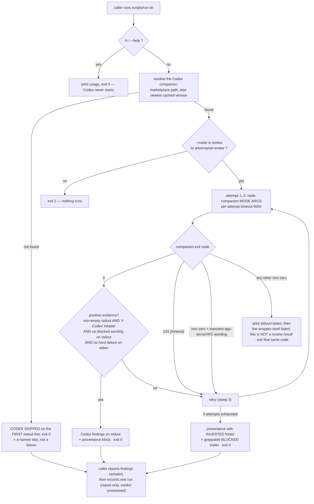

# Behaviour register — `code-adversarial`

What `/r:code-adversarial` does, stated once, with an ID. Format and ID scheme: `README.md`
beside this file. IDs are stable; an entry that stops being true is marked `RETIRED` in place
rather than renumbered.

The skill is a thin prose layer over one script. `skills/code-adversarial/scripts/run.sh` holds
the exit-code contract every caller in the pack branches on, and the prose defers to it: where
the two could disagree, the script is the behaviour and the SKILL.md is the description of it.

## Flow

## Entries

- **SB-code-adversarial-001** — The skill runs a Codex review that **challenges the
  implementation approach and design choices** over the current diff — the approach, the
  tradeoffs, the assumptions — not merely a stricter pass over implementation defects, and
  returns Codex's findings.
  *States it:* `skills/code-adversarial/SKILL.md`
  *Enforced by:* `skills/code-adversarial/scripts/run.sh`
  *Tested by:* —

- **SB-code-adversarial-002** — The skill exists as an **indirection around a user-only slash
  command**: `/codex:adversarial-review` sets `disable-model-invocation: true`, so it is
  unreachable through the Skill tool. The bundled wrapper calls the **same** Codex companion that
  slash command wraps, which is the only way the real tool runs from an automated context — a
  checklist step, a parallel review subagent, a pipeline track. Removing the indirection does not
  simplify anything; it removes the tool from every caller that is not a human typing.
  *States it:* `skills/code-adversarial/SKILL.md`
  *Enforced by:* `skills/code-adversarial/scripts/run.sh`
  *Tested by:* —

- **SB-code-adversarial-003** — It runs the **REAL Codex tool, never an LLM imitation of it**.
  A step that cannot run is reported as skipped or blocked; it is never completed by a model
  writing what a review would have said. A skip reported as a review is worse than no review.
  *States it:* `skills/code-adversarial/SKILL.md`
  *Enforced by:* `skills/code-adversarial/scripts/run.sh`
  *Tested by:* `skills/code-adversarial/tests/run.test.sh`

- **SB-code-adversarial-004** — **Report-only.** It surfaces Codex's findings and fixes nothing;
  in a post-task checklist the main agent merges them with the other reviewers and fixes the real
  ones in a separate step.
  *States it:* `skills/code-adversarial/SKILL.md`
  *Enforced by:* —
  *Tested by:* —

- **SB-code-adversarial-005** — Codex's findings are returned **verbatim** — not paraphrased,
  not summarized, not editorialized.
  *States it:* `skills/code-adversarial/SKILL.md`
  *Enforced by:* —
  *Tested by:* —

- **SB-code-adversarial-006** — The wrapper resolves the companion in a fixed order: the stable
  marketplace path
  `$HOME/.claude/plugins/marketplaces/openai-codex/plugins/codex/scripts/codex-companion.mjs`
  first, then the newest version-pinned cache install under
  `$HOME/.claude/plugins/cache/openai-codex/codex/*/` by `sort -V | tail -n1`.
  *States it:* `skills/code-adversarial/SKILL.md`
  *Enforced by:* `skills/code-adversarial/scripts/run.sh`
  *Tested by:* —

- **SB-code-adversarial-007** — `-h` / `--help` prints usage and exits 0 **before the companion is
  even resolved**, touching nothing. The companion has no help path of its own: `lib/args.mjs`
  folds an unrecognized flag into the review's positionals, so `adversarial-review --help` starts
  a REAL Codex review with the focus text `--help` and runs for minutes — observed at ~2.5 minutes
  lost to an agent that then had to be `pkill`'d. Nothing may be moved above that block.
  *States it:* `skills/code-adversarial/SKILL.md`
  *Enforced by:* `skills/code-adversarial/scripts/run.sh`
  *Tested by:* `skills/code-adversarial/tests/run.test.sh`

- **SB-code-adversarial-008** — Only the two real flags `-h`/`--help` trigger usage — **not** a
  bare `help`, which could plausibly be trailing focus text for the reviewer.
  *States it:* `skills/code-adversarial/scripts/run.sh`
  *Enforced by:* `skills/code-adversarial/scripts/run.sh`
  *Tested by:* —

- **SB-code-adversarial-009** — **Foreground `--wait` is the default and the only form a subagent,
  checklist step or automated routine may use.** The review runs in the foreground and its stdout
  is captured in one shot; the script's per-attempt timeout and retry loop apply and there is
  nothing to poll.
  *States it:* `skills/code-adversarial/SKILL.md`
  *Enforced by:* —
  *Tested by:* —

- **SB-code-adversarial-010** — **Background is opt-in and interactive-only** — never from a
  subagent or an unattended checklist. A detached `run_in_background` job is invisible to the
  harness's child-tracking, so an unattended orchestrator reads "came to rest / no live children"
  while Codex is still running and can conclude the run is parked; that false signal is how a
  working review gets killed. A foreground run stays a live `Agent` child for the whole review and
  its **return is** the completion signal.
  *States it:* `skills/code-adversarial/SKILL.md`
  *Enforced by:* —
  *Tested by:* —

- **SB-code-adversarial-011** — If the background path is used, polling is **hard-bounded to at
  most 10 polls or 10 minutes**, after which the review is treated as blocked (the exit-4 reading)
  and the caller STOPS. Never poll indefinitely.
  *States it:* `skills/code-adversarial/SKILL.md`
  *Enforced by:* —
  *Tested by:* —

- **SB-code-adversarial-012** — `--background` is **not** a companion flag: reviews always run
  foreground inside the companion, and what backgrounds a run is the harness's
  `run_in_background: true` on the Bash call. `--wait` is likewise accepted and forwarded but is a
  no-op inside the companion.
  *States it:* `skills/code-adversarial/SKILL.md`
  *Enforced by:* `skills/code-adversarial/scripts/run.sh`
  *Tested by:* —

- **SB-code-adversarial-013** — Scope flags pass straight through to Codex: `--base <ref>` to
  review against a base ref, `--scope auto|working-tree|branch` (default `auto`), and trailing free
  text as extra focus for the reviewer. `--scope staged` and `--scope unstaged` are **not**
  supported.
  *States it:* `skills/code-adversarial/SKILL.md`
  *Enforced by:* —
  *Tested by:* —

- **SB-code-adversarial-014** — `--mode` selects the reviewer and defaults to
  `adversarial-review`, the strict challenge review. `--mode review` runs Codex's lighter built-in
  reviewer — the one the user-only `/codex:review` wraps — and is for a regression-only pass, e.g.
  an end-verify that only needs to catch breaks the fixes introduced. The wrapper parses the flag
  out; everything else passes through.
  *States it:* `skills/code-adversarial/SKILL.md`
  *Enforced by:* `skills/code-adversarial/scripts/run.sh`
  *Tested by:* `skills/code-adversarial/tests/run.test.sh`

- **SB-code-adversarial-015** — `--mode` is a **per-invocation flag, never an env var**, so
  concurrent runs cannot clobber each other's mode. Both `--mode review` and `--mode=review`
  forms are accepted.
  *States it:* `skills/code-adversarial/SKILL.md`
  *Enforced by:* `skills/code-adversarial/scripts/run.sh`
  *Tested by:* `skills/code-adversarial/tests/run.test.sh`

- **SB-code-adversarial-016** — An invalid `--mode` **exits 2 before anything runs**, naming the
  valid values. It is a caller's bug, not an environment failure, so it must not be retried or
  mislabelled as a block.
  *States it:* `skills/code-adversarial/SKILL.md`
  *Enforced by:* `skills/code-adversarial/scripts/run.sh`
  *Tested by:* `skills/code-adversarial/tests/run.test.sh`

- **SB-code-adversarial-017** — The two modes are **different machines**, and the difference
  decides what Codex has in front of it. `adversarial-review` is a prompt-driven Codex session
  (read-only sandbox, structured output) whose prompt embeds the **diff text** only when the change
  is **≤2 files and ≤256 KB**; above either bound the prompt carries a file list + shortstat and
  tells Codex to inspect the diff itself with read-only git commands. So on an ordinary multi-file
  diff, whether the code got read is Codex's own call, and a fast bare `approve` on a large diff is
  worth a second look rather than trust.
  *States it:* `skills/code-adversarial/SKILL.md`
  *Enforced by:* —
  *Tested by:* —

- **SB-code-adversarial-018** — `--mode review` calls Codex's native reviewer API with a target
  (`uncommittedChanges` or a base branch): nothing is embedded, the reviewer fetches its own diff,
  and it **rejects trailing focus text with a hard error** — pass only `--base`/`--scope` with it.
  *States it:* `skills/code-adversarial/SKILL.md`
  *Enforced by:* —
  *Tested by:* —

- **SB-code-adversarial-019** — Neither mode sets a model or a reasoning effort; both run at the
  Codex CLI's configured defaults.
  *States it:* `skills/code-adversarial/SKILL.md`
  *Enforced by:* —
  *Tested by:* —

- **SB-code-adversarial-020** — A missing Codex plugin is a **named skip, not a failure**: the
  wrapper prints `CODEX SKIPPED:` as the **first stdout line** and exits **0**, because the Codex
  plugin is the pack's one optional prerequisite and a hard error would stop a caller that has
  other reviewers to run. The caller reports the step as skipped, says how to add the plugin, and
  **does not retry** — a missing plugin does not fix itself.
  *States it:* `skills/code-adversarial/SKILL.md`
  *Enforced by:* `skills/code-adversarial/scripts/run.sh`
  *Tested by:* `skills/code-adversarial/tests/run.test.sh`

- **SB-code-adversarial-021** — A skip is detected by **the marker on the first stdout line, never
  by an exit code**. The usage text therefore must not promise an exit `3` for a missing plugin:
  the script exits 0 there, and a caller branching on 3 would bank the skip as a clean review —
  the single outcome this wrapper exists to make impossible. Exit `3` is never returned at all, and
  a caller that somehow sees it treats the review as not-run.
  *States it:* `skills/code-adversarial/SKILL.md`
  *Enforced by:* `skills/code-adversarial/scripts/run.sh`
  *Tested by:* `skills/code-adversarial/tests/run.test.sh`

- **SB-code-adversarial-022** — **Exit 0 requires positive evidence that a review happened**, not
  merely the absence of error wording. Four gates must all pass: stdout is non-empty; stdout
  carries the `^# Codex ` header the companion emits on every render path; stdout carries no known
  blocked/degraded wording; stderr carries no hard-failure wording. Asking "did a review actually
  happen?" is the only check that cannot be evaded by phrasing nobody anticipated — the wording
  blacklist is the last line of defence, not the mechanism.
  *States it:* `skills/code-adversarial/SKILL.md`
  *Enforced by:* `skills/code-adversarial/scripts/run.sh`
  *Tested by:* `skills/code-adversarial/tests/run.test.sh`

- **SB-code-adversarial-023** — **Empty stdout is a block, never a clean review** — the companion
  renders a header on every path, so no output at all is the plainest proof that nothing was
  rendered.
  *States it:* `skills/code-adversarial/SKILL.md`
  *Enforced by:* `skills/code-adversarial/scripts/run.sh`
  *Tested by:* `skills/code-adversarial/tests/run.test.sh`

- **SB-code-adversarial-024** — The blocked-wording match covers Codex's phantom "Review blocked"
  shape **and the companion's own degraded-render strings** (`completed without any stdout output`,
  `Codex review failed`, `did not return valid structured JSON`, `unexpected review shape`). Each
  means "no review happened" and none of them matches the Codex-side phrasing, so dropping the
  second list reopens the phantom-clean path where Codex exits 0 having produced no review text.
  *States it:* `skills/code-adversarial/scripts/run.sh`
  *Enforced by:* `skills/code-adversarial/scripts/run.sh`
  *Tested by:* `skills/code-adversarial/tests/run.test.sh`

- **SB-code-adversarial-025** — The generic backup clause is **anchored to the review as its
  subject**: a bare `could not run` also matches "Tests could not run because the read-only sandbox
  prevented Go from creating its build directory", which is a review that DID read the diff and
  says so. Codex's sandbox denies the Go build cache on every Go repo, so that sentence is the
  normal shape of a review-mode pass there, and a bare match turns each one into three attempts and
  a BLOCKED end-verify over a diff that was in fact read. `inspect` stays unanchored — nothing but
  the review inspects anything.
  *States it:* `skills/code-adversarial/scripts/run.sh`
  *Enforced by:* `skills/code-adversarial/scripts/run.sh`
  *Tested by:* `skills/code-adversarial/tests/run.test.sh`

- **SB-code-adversarial-026** — **stderr is consulted only for hard failures, and only to downgrade
  an apparently-clean run to a retry.** Its pattern (`mktemp:`, `cannot create temp`,
  `Operation not permitted`, `Permission denied`, `EACCES`, recursion/stack limits) is deliberately
  much narrower than the stdout blacklist, because stderr carries incidental noise and a wide match
  would turn an unrelated line into a false block.
  *States it:* `skills/code-adversarial/scripts/run.sh`
  *Enforced by:* `skills/code-adversarial/scripts/run.sh`
  *Tested by:* `skills/code-adversarial/tests/run.test.sh`

- **SB-code-adversarial-027** — The wrapper **retries up to 3 attempts** with a 3-second pause
  between them, under a per-attempt timeout of `ADVERSARIAL_REVIEW_TIMEOUT` seconds (default 600).
  A timeout (rc 124) is transient and retried like any other block.
  *States it:* `skills/code-adversarial/SKILL.md`
  *Enforced by:* `skills/code-adversarial/scripts/run.sh`
  *Tested by:* `skills/code-adversarial/tests/run.test.sh`

- **SB-code-adversarial-028** — A **transient Codex app-server / IPC failure is retried even though
  it exits non-zero** (`failed to load configuration`, an app-server that exited or closed,
  `ECONNREFUSED`, a broker session/endpoint error, a truncated stream, `write EPIPE`): a fresh
  attempt brings the app-server up and the review runs, so treating it as a permanent wrapper
  failure would throw away a review that was one retry away.
  *States it:* `skills/code-adversarial/scripts/run.sh`
  *Enforced by:* `skills/code-adversarial/scripts/run.sh`
  *Tested by:* `skills/code-adversarial/tests/run.test.sh`

- **SB-code-adversarial-029** — **Any other non-zero exit is permanent and surfaces immediately
  with its own code** — a bad flag, a missing `node`, a companion that throws. The wrapper prints
  both streams and says plainly that stdout is NOT a review result, and never relabels it as exit
  4: a transient block and a permanent failure need opposite responses, and a permanent one
  repeats forever if it is retried as the environment's fault.
  *States it:* `skills/code-adversarial/SKILL.md`
  *Enforced by:* `skills/code-adversarial/scripts/run.sh`
  *Tested by:* `skills/code-adversarial/tests/run.test.sh`

- **SB-code-adversarial-030** — A failed `mktemp` is **guarded and retried**, not fatal. Unguarded
  under `set -euo pipefail` it aborts the wrapper with mktemp's exit 1 — a code outside the
  documented contract, which callers then have no rule for. A temp file that cannot be created is a
  transient environment problem, so it takes the retry path and ends at exit 4 if it persists.
  *States it:* `skills/code-adversarial/scripts/run.sh`
  *Enforced by:* `skills/code-adversarial/scripts/run.sh`
  *Tested by:* —

- **SB-code-adversarial-031** — The per-attempt timeout is a **safety net, not a correctness
  requirement**: `timeout`, else `gtimeout`, else the companion runs with no timeout at all. Stock
  macOS ships neither (both come from GNU coreutils), and a missing one must not turn into a
  phantom exit-127 "review failed".
  *States it:* `skills/code-adversarial/scripts/run.sh`
  *Enforced by:* `skills/code-adversarial/scripts/run.sh`
  *Tested by:* —

- **SB-code-adversarial-032** — **Exit 4 means Codex is installed but could not inspect the diff**
  after all 3 attempts (its tool calls were rejected by a transient Codex-runtime schema error, so
  it emitted a phantom "Review blocked" finding, or it timed out). The wrapper has already retried,
  so the caller does not retry again; it may degrade gracefully to its other reviewers or surface
  the block, and it records the track as not-run.
  *States it:* `skills/code-adversarial/SKILL.md`
  *Enforced by:* `skills/code-adversarial/scripts/run.sh`
  *Tested by:* `skills/code-adversarial/tests/run.test.sh`

- **SB-code-adversarial-033** — The `Review blocked` text is **not a finding** and is never passed
  on as one. The exit-4 path prints a greppable `CODEX-<mode>: BLOCKED` trailer saying the review
  did NOT run, so "blocked" is readable without parsing Codex's prose.
  *States it:* `skills/code-adversarial/SKILL.md`
  *Enforced by:* `skills/code-adversarial/scripts/run.sh`
  *Tested by:* `skills/code-adversarial/tests/run.test.sh`

- **SB-code-adversarial-034** — On exit 0 the wrapper appends a
  `--- adversarial-review: what this run examined ---` **provenance block**: reviewer mode, diff
  range, shortstat, whether the diff text was embedded or Codex had to fetch it, and
  attempt/elapsed/output size. A bare "approve, no material findings" is byte-identical whether
  Codex read every line or was handed a file list, so the verdict alone cannot be read as coverage.
  *States it:* `skills/code-adversarial/SKILL.md`
  *Enforced by:* `skills/code-adversarial/scripts/run.sh`
  *Tested by:* `skills/code-adversarial/tests/run.test.sh`

- **SB-code-adversarial-035** — The provenance block is **provenance, not findings**, and is never
  folded into a findings list. The caller quotes it alongside the verdict — especially a clean one,
  since "no findings" over an embedded 40-line diff and over a file list of 12 files are very
  different claims and this block is the only thing that tells them apart.
  *States it:* `skills/code-adversarial/SKILL.md`
  *Enforced by:* —
  *Tested by:* —

- **SB-code-adversarial-036** — The provenance block is printed on the **blocked path too, with its
  footer inverted** ("NOTHING WAS REVIEWED … the lines above are what went unexamined"). Present on
  both paths, its absence is never ambiguous between "the wrapper died before reporting" and "the
  wrapper tried three times and got nothing"; and emitting the normal footer there would produce
  exactly the phantom-clean reading the exit-4 trailer exists to prevent.
  *States it:* `skills/code-adversarial/scripts/run.sh`
  *Enforced by:* `skills/code-adversarial/scripts/run.sh`
  *Tested by:* `skills/code-adversarial/tests/run.test.sh`

- **SB-code-adversarial-037** — Every provenance helper tolerates failure (`git diff … || true`,
  a `0` fallback for file and byte counts) and works outside a git repo. Provenance is a courtesy:
  killing a finished review over a failed `git diff` would trade a real result for a cosmetic one.
  *States it:* `skills/code-adversarial/scripts/run.sh`
  *Enforced by:* `skills/code-adversarial/scripts/run.sh`
  *Tested by:* —

- **SB-code-adversarial-038** — After the findings are reported, the run is recorded with one
  `lib/record-run.py` line carrying `skill: "r:code-adversarial"`, `outcome`
  (`reviewed|skipped|blocked|failed`), `exit`, `diffEmbedded`, and one `findings` entry per finding
  Codex returned on `track: "codex"` with `severity` `major|minor`, `file`, `line` and a one-line
  `description` in Codex's words. Counts only — never finding bodies.
  *States it:* `skills/code-adversarial/SKILL.md`
  *Enforced by:* `lib/record-run.py`
  *Tested by:* —

- **SB-code-adversarial-039** — Every recorded finding carries **`verdict: "unresolved"`**: the
  skill is report-only, adjudicates nothing, and must not claim to. Whoever triages the findings
  later records the real verdicts.
  *States it:* `skills/code-adversarial/SKILL.md`
  *Enforced by:* `lib/record-run.py`
  *Tested by:* `lib/tests/stats.test.sh`

- **SB-code-adversarial-040** — `outcome` is the field that matters most, because **a skipped run
  and a clean run both report zero findings** and nothing else tells them apart. The skip is
  recorded.
  *States it:* `skills/code-adversarial/SKILL.md`
  *Enforced by:* —
  *Tested by:* —

- **SB-code-adversarial-041** — The recording step always exits 0, so a record that does not get
  written is a lost record, never a failed review: it is never retried and never reported as a
  failure of the review.
  *States it:* `skills/code-adversarial/SKILL.md`
  *Enforced by:* `lib/record-run.py`
  *Tested by:* `lib/tests/stats.test.sh`

- **SB-code-adversarial-042** — `scripts/run.sh` must keep its executable bit in the working tree
  **and in git's index**: every caller dispatches it as a bare quoted path, and without the exec
  bit that path exits 126 — after which the agent improvises, and on the bad day records the track
  as blocked, certifying less than it appears to.
  *States it:* `tools/validate.py`
  *Enforced by:* `tools/validate.py`
  *Tested by:* `validate.sh`

## Prose-only behaviours

Held up by wording alone — nothing fails if they quietly stop being true:

- SB-code-adversarial-004 — report-only; the caller fixes in a separate step.
- SB-code-adversarial-005 — findings returned verbatim.
- SB-code-adversarial-009 — foreground `--wait` is the default for every automated caller.
- SB-code-adversarial-010 — background is interactive-only; a detached job is invisible to
  child-tracking.
- SB-code-adversarial-011 — background polling bounded at 10 polls / 10 minutes, then STOP.
- SB-code-adversarial-013 — the pass-through scope flags and the unsupported `staged`/`unstaged`.
- SB-code-adversarial-017 — the ≤2-file / ≤256 KB embedding bound and what a large diff reaches
  Codex as.
- SB-code-adversarial-018 — `review` mode fetches its own target and rejects focus text.
- SB-code-adversarial-019 — neither mode pins a model or an effort.
- SB-code-adversarial-035 — provenance is quoted beside the verdict and never merged into findings.
- SB-code-adversarial-040 — `outcome` is what separates a skip from a clean review.
