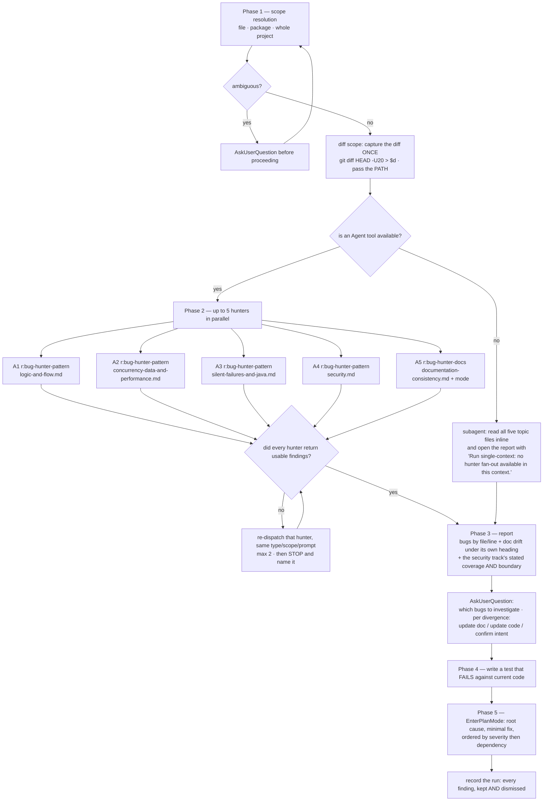

# Behaviour register — `code-bugs`

What `/r:code-bugs` does, stated once, with an ID. Format and ID scheme: `README.md` beside this
file. IDs are stable; an entry that stops being true is marked `RETIRED` in place rather than
renumbered.

The skill is prose end to end — five phases, five hunters, five reference files. It ships no
script and has no test suite, so most of what follows is held up by wording alone; the
`## Prose-only behaviours` roll-up at the bottom is the real exposure.

## Flow

## Entries

- **SB-code-bugs-001** — The skill hunts **real production bugs** — code that does not do what the
  developer intended, produces wrong results, fails in edge cases, or causes outages through severe
  performance issues (N+1 queries, unbounded fetches, pool exhaustion). It is a bug hunter, not a
  linter, not a micro-optimizer and not a fixer.
  *States it:* `skills/code-bugs/SKILL.md`
  *Enforced by:* —
  *Tested by:* —

- **SB-code-bugs-002** — **Phase 1 resolves one of three scopes** from the request: a specific
  class/file → that file and its direct dependencies; a package/module → all files in that package;
  no qualifier at all → the full source tree, excluding tests, generated code and build output.
  *States it:* `skills/code-bugs/SKILL.md`
  *Enforced by:* —
  *Tested by:* —

- **SB-code-bugs-003** — An **ambiguous scope stops the run**: `AskUserQuestion` is used before
  proceeding, never a guess. The resolved files are then found with `Glob` and `Grep`.
  *States it:* `skills/code-bugs/SKILL.md`
  *Enforced by:* —
  *Tested by:* —

- **SB-code-bugs-004** — **Phase 2 launches up to five hunters in parallel** — four
  `r:bug-hunter-pattern` agents by category plus one documentation-consistency hunter. Each owns
  exactly one topic file under `references/` and reads **only that file**, so the four pattern
  reads stay independent instead of collapsing into one generic sweep.
  *States it:* `skills/code-bugs/SKILL.md`
  *Enforced by:* —
  *Tested by:* —

- **SB-code-bugs-005** — **Agent 1** is an `r:bug-hunter-pattern` covering Wrong Business Logic,
  Implementation Mistakes and Broken Flows, and is handed
  `references/logic-and-flow.md`.
  *States it:* `skills/code-bugs/SKILL.md`
  *Enforced by:* —
  *Tested by:* —

- **SB-code-bugs-006** — **Agent 2** is an `r:bug-hunter-pattern` covering Data Corruption,
  Concurrency Issues, Resource & Connection Issues and Performance & Scalability, and is handed
  `references/concurrency-data-and-performance.md`.
  *States it:* `skills/code-bugs/SKILL.md`
  *Enforced by:* —
  *Tested by:* —

- **SB-code-bugs-007** — **Agent 3** is an `r:bug-hunter-pattern` covering Silent Failures and
  Language-Specific (Java) patterns, and is handed `references/silent-failures-and-java.md`.
  *States it:* `skills/code-bugs/SKILL.md`
  *Enforced by:* —
  *Tested by:* —

- **SB-code-bugs-008** — **Agent 4** is an `r:bug-hunter-pattern` covering Injection & Untrusted
  Input, Authentication & Authorization, Secrets & Credentials and Sensitive Data Exposure, and is
  handed `references/security.md`. Security is a **category hunter reading a pattern file like
  every other one — never a hunter with a tool of its own**, and `r:bug-hunter-security` is retired
  from the pack rather than dispatched here — `RETIRED_AGENTS` in `tools/rename_rules.py` keeps
  the name from coming back under a dispatch nothing else is looking for.
  *States it:* `skills/code-bugs/SKILL.md`
  *Enforced by:* `tools/validate.py`
  *Tested by:* `validate.sh`

- **SB-code-bugs-009** — **The bundled `/security-review` skill is never used here, and no hunter
  may reach for it.** It builds its diff from four bash commands substituted into its prompt before
  the model runs, all pinned to `git diff origin/HEAD...`, and its body carries no argument
  placeholder — so a scope handed to it is discarded, it judges the branch commits instead of the
  change under review, and it never sees uncommitted work at all. Measured over 49 dispatches
  driven that way: 47 reports, **0 findings**, and 5 of the 6 that checked reported reviewing a
  different changeset.
  *States it:* `skills/code-bugs/SKILL.md`
  *Enforced by:* —
  *Tested by:* —

- **SB-code-bugs-010** — **Agent 5** is an `r:bug-hunter-docs`, dispatched with
  `subagent_type: "r:bug-hunter-docs"`, handed `references/documentation-consistency.md`. It checks
  the change against `spec.md`/`spec.html`, `todo.md`, `docs/*`, `DESIGN.md`/`ui-design.md`, the
  `**/CLAUDE.md` hierarchy with its nested module rules, and `README.md`/`ARCHITECTURE.md`. It
  treats the docs as authoritative intent and recommends which side to move: a consistency check,
  not a bug hunt — when code and docs disagree, the fix may be to update the docs.
  *States it:* `skills/code-bugs/SKILL.md`
  *Enforced by:* —
  *Tested by:* —

- **SB-code-bugs-011** — The security track's **empty result is not a clean bill**. It hunts only
  what the change newly introduces and only what is high-confidence exploitable; denial of service,
  resource exhaustion, capacity rate limiting, missing hardening and dependency CVEs are out of its
  scope **by design** — Agent 2 and `/r:code-scan` cover those. That boundary is carried into Phase
  3 so a clean security result reads as "no exploitable issue newly introduced in the changeset
  reviewed", never as "the whole codebase is secure".
  *States it:* `skills/code-bugs/SKILL.md`, `skills/code-bugs/references/security.md`
  *Enforced by:* —
  *Tested by:* —

- **SB-code-bugs-012** — **Every hunter is diff-scoped**: on a diff it reads the changeset and
  nothing else. When the scan was whole-project but the hunters only saw a changeset, the report
  says so.
  *States it:* `skills/code-bugs/SKILL.md`
  *Enforced by:* —
  *Tested by:* —

- **SB-code-bugs-013** — **With no `Agent` tool the run is a subagent and scans inline, and says
  so.** No track is dropped: all five topic files are worked through one after another by the
  single context, and the report opens with *"Run single-context: no hunter fan-out available in
  this context."* Unlabelled, a one-context scan passes for a full one; labelled, the caller can
  dispatch the five hunters itself from a level that can spawn.
  *States it:* `skills/code-bugs/SKILL.md`
  *Enforced by:* —
  *Tested by:* —

- **SB-code-bugs-014** — Each hunter is given the Phase 1 scope (an explicit file list, a package,
  or the diff) and told to read its own topic file. Every hunter has `Bash`, `Glob` and `Grep`, so
  it can run `git diff` and search the tree itself.
  *States it:* `skills/code-bugs/SKILL.md`, `agents/bug-hunter-pattern.md`
  *Enforced by:* —
  *Tested by:* —

- **SB-code-bugs-015** — Each hunter is briefed that this is a **discovery scan** over unknown bugs
  across the scope, not an investigation of one reported bug, and that it must **not write
  reproducing tests in this phase** — findings only.
  *States it:* `skills/code-bugs/SKILL.md`
  *Enforced by:* —
  *Tested by:* —

- **SB-code-bugs-016** — **On a diff scope the diff is captured once and shared**:
  `d="$(mktemp)"; git diff HEAD -U20 > "$d"`, and every hunter is given that path and told to read
  it first rather than re-derive the change. Each hunter is a fresh context and otherwise derives
  it itself — measured at 10–17 shell calls apiece before any hunting starts, and *not to the same
  answer*: stored runs show `git diff HEAD`, `git diff` and `git diff origin/main..HEAD` inside one
  scan, which is three hunters certifying three different changesets.
  *States it:* `skills/code-bugs/SKILL.md`
  *Enforced by:* —
  *Tested by:* —

- **SB-code-bugs-017** — The **path is passed, never the diff text**: 40k characters of patch
  embedded in a brief come back lossy, and a paraphrased diff is worse than one the hunter fetched
  itself.
  *States it:* `skills/code-bugs/SKILL.md`
  *Enforced by:* —
  *Tested by:* —

- **SB-code-bugs-018** — **The hunt is bounded to about 12 tool calls.** Each hunter is briefed to
  read the change first, judge from the hunk where it can, and open surrounding source only for a
  candidate it cannot settle — `Grep` the symbol, `Read` with `offset`/`limit`, never a whole file.
  Left alone a hunter explores before it reads the change: measured over 151 runs, the median one
  reads **twelve whole source files before it ever runs `git diff`**, reaches the diff around turn
  31, and finishes at turn 49 holding ~93k tokens.
  *States it:* `skills/code-bugs/SKILL.md`
  *Enforced by:* —
  *Tested by:* —

- **SB-code-bugs-019** — The budget is **a budget, not a wall**: overrunning it on a real candidate
  is fine, and a hunter that stops with something unconfirmed must **say so** rather than dropping
  it or padding the report.
  *States it:* `skills/code-bugs/SKILL.md`
  *Enforced by:* —
  *Tested by:* —

- **SB-code-bugs-020** — **Agent 5 is given the mode as well as the scope**: diff mode by default
  (only the changed code against the docs), whole-project doc audit **only** when Phase 1 resolved
  scope to the entire project.
  *States it:* `skills/code-bugs/SKILL.md`, `skills/code-bugs/references/documentation-consistency.md`
  *Enforced by:* —
  *Tested by:* —

- **SB-code-bugs-021** — "**No documentation found to check against**" is a **valid result, not a
  failure** — Agent 5 returns it verbatim when no doc files are in scope, the report says so
  plainly, and the drift section is skipped rather than filled with invented findings.
  *States it:* `skills/code-bugs/SKILL.md`, `skills/code-bugs/references/documentation-consistency.md`
  *Enforced by:* —
  *Tested by:* —

- **SB-code-bugs-022** — Agent 5 resolves the doc set by **`Glob` over the filesystem, never via
  git**: doc files are often gitignored (a local `spec.md`, `todo.md` or scratch `docs/`), so
  `git ls-files` / `git diff` would miss exactly the documents that carry the project's intent.
  They are authoritative regardless of git status; a missing one is skipped silently.
  *States it:* `skills/code-bugs/references/documentation-consistency.md`
  *Enforced by:* —
  *Tested by:* —

- **SB-code-bugs-023** — **`DESIGN.md` and `tech-design.md` are different documents and never the
  same evidence.** `DESIGN.md` (which may carry normative tokens in YAML front matter with the
  rationale in prose) is authoritative for the **visual** identity, so a divergence against it is a
  colour, a spacing value or a component state. `tech-design.md` beside a plan's `todo.md`, written
  by `/r:spec-design` before the code existed, is authoritative for the **technical** shape, so a
  divergence against it is a column that ended up nullable, an endpoint returning the wrong status,
  a boundary a module now crosses. The names look alike and the contents have nothing in common —
  each is reported under its own category and neither is ever cited as evidence about the other.
  *States it:* `skills/code-bugs/references/documentation-consistency.md`
  *Enforced by:* —
  *Tested by:* —

- **SB-code-bugs-024** — **`CLAUDE.md` is read as rules, not as a behaviour spec** — project
  conventions and constraints, plus any reference docs it links, with a nested module's rules
  scoped to the directory it lives in. A change is flagged when it **violates a stated rule**, or
  makes a rule obsolete or self-contradictory, and only for rules the change touches — never
  unrelated ones.
  *States it:* `skills/code-bugs/references/documentation-consistency.md`
  *Enforced by:* —
  *Tested by:* —

- **SB-code-bugs-025** — A doc-drift finding must cite **both a concrete doc statement and a
  concrete code fact that contradict each other**. Prose wording, typos, formatting, stale dates
  with no behavioural meaning, internal code comments, speculative "the docs could also mention X",
  and anything where intent has to be inferred, are not reported — this is a consistency check, not
  a documentation linter.
  *States it:* `skills/code-bugs/references/documentation-consistency.md`
  *Enforced by:* —
  *Tested by:* —

- **SB-code-bugs-026** — Every divergence **says which side is stale**, reasoned from what the
  change touched: new or intended behaviour → the docs are usually stale, suggest updating the
  docs; a refactor or bugfix against a doc that encodes a deliberate spec or rule → the code may
  have drifted, suggest updating the code; genuinely ambiguous → say so and suggest confirming
  intent. Never offer both sides with no recommendation.
  *States it:* `skills/code-bugs/references/documentation-consistency.md`
  *Enforced by:* —
  *Tested by:* —

- **SB-code-bugs-027** — Performance findings are reported **only where there is real production
  impact** — pool exhaustion, timeouts, OOM, request latency that breaks an SLA. Micro-optimizations
  and "could be faster" suggestions are skipped, because a performance section that reports
  everything trains the reader to skip the section.
  *States it:* `skills/code-bugs/references/concurrency-data-and-performance.md`
  *Enforced by:* —
  *Tested by:* —

- **SB-code-bugs-028** — A security finding must **name the attacker's input**: a concrete path
  from something an attacker controls to something they should not reach. If the hunter cannot say
  what an attacker sends and what they get, it is a hardening suggestion, not a vulnerability, and
  it is dropped.
  *States it:* `skills/code-bugs/references/security.md`
  *Enforced by:* —
  *Tested by:* —

- **SB-code-bugs-029** — The security hunter reports only what **this change newly introduces**.
  A pre-existing weakness the diff merely moves past is somebody else's audit, and a clean result
  is a real result the hunter states plainly.
  *States it:* `skills/code-bugs/references/security.md`
  *Enforced by:* —
  *Tested by:* —

- **SB-code-bugs-030** — **Auth-relevant rate limiting is the one throughput concern the security
  hunter owns** — a new or newly-unprotected credential-testing surface (login, password reset, OTP
  or token issue, invite redemption) with no attempt limit, lockout or backoff — because the impact
  is credential compromise, not load. Rate limiting for capacity reasons is explicitly not this.
  *States it:* `skills/code-bugs/references/security.md`
  *Enforced by:* —
  *Tested by:* —

- **SB-code-bugs-031** — A **hardcoded credential is a finding wherever it lands in the repository**
  — code, template, checked-in config, a real key in a test resource. The exclusion for secrets
  *at rest on a deployed host* (env files, mounted config, key material on disk) is about deployed
  hosts, never about literals in the tree; likewise test **code** exercising a weak path is out of
  scope while a credential in a test **resource** still counts.
  *States it:* `skills/code-bugs/references/security.md`
  *Enforced by:* —
  *Tested by:* —

- **SB-code-bugs-032** — The security hunter also drops **theoretical timing attacks and races**
  unless it can state the concrete window and what it wins, **outdated third-party libraries and
  their CVEs** (a dependency-scanner's work, not a diff review's), and findings in documentation,
  markdown or comments.
  *States it:* `skills/code-bugs/references/security.md`
  *Enforced by:* —
  *Tested by:* —

- **SB-code-bugs-033** — Every hunter must read **actual source code, not just file names**, trace
  real execution paths, understand the intended behaviour from method names and surrounding
  context, and report file path, line number, what the code does versus what it should do, and the
  production impact.
  *States it:* `skills/code-bugs/SKILL.md`
  *Enforced by:* —
  *Tested by:* —

- **SB-code-bugs-034** — Hunters report **only high-confidence breakage**. Anything that might be
  intentional is skipped; style issues, naming suggestions and "consider using X instead" are never
  reported; enough surrounding code is read to understand context before anything is flagged.
  *States it:* `skills/code-bugs/SKILL.md`
  *Enforced by:* —
  *Tested by:* —

- **SB-code-bugs-035** — **A hunter's findings are its final message** — the value the `Agent` tool
  hands back. There is no `.done` marker, status file or output file, and none may be invented;
  `Monitor` and file-mtime polling are forbidden, because waiting on a side channel hangs the scan
  for ten minutes on a hunter that has already finished or died.
  *States it:* `skills/code-bugs/SKILL.md`
  *Enforced by:* —
  *Tested by:* —

- **SB-code-bugs-036** — **All five hunters must run and report before consolidation** — a scan
  missing the security or docs hunter is not a complete `/r:code-bugs` run.
  *States it:* `skills/code-bugs/SKILL.md`
  *Enforced by:* —
  *Tested by:* —

- **SB-code-bugs-037** — A hunter that comes to rest **without usable findings** — it errored,
  died, returned nothing, or its report lacks a required confirmation line — is **re-dispatched**
  with the same `subagent_type`, scope and prompt. Re-dispatching is the fix, not waiting. It is
  bounded to **2 re-dispatches per hunter**, after which the run **stops and tells the user which
  hunter is blocked and why** — never silently dropped from the report, never waited on, never
  faked.
  *States it:* `skills/code-bugs/SKILL.md`
  *Enforced by:* —
  *Tested by:* —

- **SB-code-bugs-038** — **Phase 3 compiles Agents 1–4, deduplicates and discards low-confidence
  items**, and presents each confirmed finding as file & line, what the code actually does now,
  what the developer likely intended, and the production impact — what breaks, what data gets
  corrupted, what fails silently.
  *States it:* `skills/code-bugs/SKILL.md`
  *Enforced by:* —
  *Tested by:* —

- **SB-code-bugs-039** — **Agent 5's doc drift gets its own heading and its own format** — Doc
  (file + section/line, quoted briefly), Code (file + line), Divergence, Suggested resolution
  (`update doc` / `update code` / `confirm intent`) with a one-line rationale — because its
  resolution is a doc-or-code decision, not a fix to verify with a test.
  *States it:* `skills/code-bugs/SKILL.md`, `skills/code-bugs/references/documentation-consistency.md`
  *Enforced by:* —
  *Tested by:* —

- **SB-code-bugs-040** — Findings are presented through `AskUserQuestion`: for production bugs the
  user selects which to investigate with failing tests; for each divergence the user chooses
  **update the doc**, **update the code**, or **confirm intent** (leave both as-is). A code-side
  resolution enters the normal fix flow; "confirm intent" changes nothing.
  *States it:* `skills/code-bugs/SKILL.md`
  *Enforced by:* —
  *Tested by:* —

- **SB-code-bugs-041** — Choosing **update doc selects the resolution, not permission to write**.
  Before any documentation file is edited, the proposed change is shown as file path plus exact
  before/after text and explicit approval is obtained for that specific edit; only then is
  `Edit`/`Write` applied. Doc files are the project's written intent and easy to clobber silently,
  so they get the same see-it-first gate code fixes get through Phase 5 plan mode.
  *States it:* `skills/code-bugs/SKILL.md`
  *Enforced by:* —
  *Tested by:* —

- **SB-code-bugs-042** — **If no real bugs were found, that is reported clearly** — findings are
  never invented to look useful.
  *States it:* `skills/code-bugs/SKILL.md`
  *Enforced by:* —
  *Tested by:* —

- **SB-code-bugs-043** — The report **states the security track's actual coverage and its
  boundary**: what the hunter says it read is quoted, and what it did not look for — denial of
  service, resource exhaustion, capacity rate limiting, missing hardening, dependency CVEs — is
  carried through, so a clean result reads as "no exploitable issue newly introduced in the
  reviewed changeset" and never as "the codebase is secure".
  *States it:* `skills/code-bugs/SKILL.md`
  *Enforced by:* —
  *Tested by:* —

- **SB-code-bugs-044** — **Phase 4 writes a test that exposes each selected bug and must FAIL
  against current code** — a passing test is not a proof, it is a retraction: the finding is
  reconsidered and the user told. Java uses JUnit 5 + Mockito following the project's existing test
  patterns; other languages use the project's detected framework; implementation goes to the
  `r:java-backend-developer` agent or the appropriate language agent.
  *States it:* `skills/code-bugs/SKILL.md`
  *Enforced by:* —
  *Tested by:* —

- **SB-code-bugs-045** — **Phase 5 plans the fixes in plan mode** (`EnterPlanMode`): per confirmed
  bug with a failing test, the root cause, the minimal fix and the affected files — ordered by
  severity (data corruption > wrong results > silent failures) and then by dependency, so a fix
  that another depends on lands first.
  *States it:* `skills/code-bugs/SKILL.md`
  *Enforced by:* —
  *Tested by:* —

- **SB-code-bugs-046** — The run is recorded last, once the report exists, as one
  `lib/record-run.py` line carrying `skill: "r:code-bugs"`, `scope` (`diff|all|explicit`),
  `hunters`, `huntersBlocked`, `testsWritten`, and a `findings` list whose entries carry `track`,
  `category`, `severity`, `file`, `line`, `verdict`, `fixed` and a one-line `description`. The
  point of recording is that a hunter can be retired on measured yield rather than on argument.
  *States it:* `skills/code-bugs/SKILL.md`
  *Enforced by:* `lib/record-run.py`
  *Tested by:* —

- **SB-code-bugs-047** — **Every finding a hunter reported is recorded, including the rejected
  ones** — `verdict: "confirmed"` for what was kept, `"dismissed"` for what Phase 3 dropped.
  Without the verdict a hunter whose findings are always rejected and one that finds nothing look
  identical in the store, and only the first should be retired. `track` is the hunter that reported
  it.
  *States it:* `skills/code-bugs/SKILL.md`
  *Enforced by:* `lib/record-run.py`
  *Tested by:* `lib/tests/stats.test.sh`

- **SB-code-bugs-048** — Each `description` stays **one line**: the store holds titles, never
  finding bodies. The recording script always exits 0, so a record that does not get written is a
  lost record rather than a failed run — it is never retried and never reported as a failure of the
  hunt.
  *States it:* `skills/code-bugs/SKILL.md`
  *Enforced by:* `lib/record-run.py`
  *Tested by:* `lib/tests/stats.test.sh`

- **SB-code-bugs-049** — Every agent this skill dispatches is named with its **`r:` prefix**
  (`r:bug-hunter-pattern`, `r:bug-hunter-docs`, `r:java-backend-developer`). Bare, the name either
  resolves to a same-named agent outside the pack — a different persona and toolset, with no error
  — or dies with "agent type not found" and takes that track of the fan-out with it. The one
  exemption is `references/documentation-consistency.md`, which quotes a *user's* flat CLAUDE.md
  wording that the doc hunter has to match on disk.
  *States it:* `skills/code-bugs/SKILL.md`
  *Enforced by:* `tools/validate.py`
  *Tested by:* `validate.sh`

## Prose-only behaviours

Held up by wording alone — nothing fails if they quietly stop being true. That is nearly the whole
skill: it ships no script and no test suite, so every phase, every hunter-to-reference mapping,
every gate and every "never do X" below is invariant only because this register says so.

- SB-code-bugs-001 — the hunt is for real production bugs, not lint or micro-optimization.
- SB-code-bugs-002 — the three scope shapes and their exclusions.
- SB-code-bugs-003 — an ambiguous scope asks before proceeding.
- SB-code-bugs-004 — five hunters in parallel, one reference file each, read exclusively.
- SB-code-bugs-005 — Agent 1 → `logic-and-flow.md`.
- SB-code-bugs-006 — Agent 2 → `concurrency-data-and-performance.md`.
- SB-code-bugs-007 — Agent 3 → `silent-failures-and-java.md`.
- SB-code-bugs-009 — `/security-review` is never used; 49 dispatches, 47 reports, 0 findings.
- SB-code-bugs-010 — Agent 5 is `r:bug-hunter-docs` on `documentation-consistency.md`.
- SB-code-bugs-011 — the security track's empty result is not a clean bill.
- SB-code-bugs-012 — hunters are diff-scoped; a whole-project scan says so.
- SB-code-bugs-013 — no `Agent` tool → inline scan, all five files, labelled in the report.
- SB-code-bugs-014 — each hunter gets the resolved scope and its own topic file.
- SB-code-bugs-015 — discovery scan, and no reproducing tests in Phase 2.
- SB-code-bugs-016 — capture the diff once; 10–17 shell calls apiece and three different answers.
- SB-code-bugs-017 — pass the path, never the diff text.
- SB-code-bugs-018 — ~12 tool calls; 151 runs, 12 files before the first `git diff`, turn 31/49.
- SB-code-bugs-019 — a budget, not a wall; an unconfirmed candidate must be named.
- SB-code-bugs-020 — Agent 5 gets the mode, and whole-project only from a whole-project scope.
- SB-code-bugs-021 — "No documentation found to check against" is a valid result.
- SB-code-bugs-022 — docs are resolved by `Glob`, never via git.
- SB-code-bugs-023 — `DESIGN.md` and `tech-design.md` are never the same evidence.
- SB-code-bugs-024 — `CLAUDE.md` is rules, and only the rules the change touches.
- SB-code-bugs-025 — a divergence needs both a doc line and a code line.
- SB-code-bugs-026 — every divergence recommends which side moves.
- SB-code-bugs-027 — performance findings need real production impact.
- SB-code-bugs-028 — name the attacker's input or drop the finding.
- SB-code-bugs-029 — newly-introduced only; a clean result is a real result.
- SB-code-bugs-030 — auth-relevant rate limiting is the one throughput concern in scope.
- SB-code-bugs-031 — a credential in the tree is a finding wherever it lands.
- SB-code-bugs-032 — no theoretical timing attacks, no dependency CVEs, no findings in prose.
- SB-code-bugs-033 — read the source, trace the path, report impact.
- SB-code-bugs-034 — high confidence only; no style, no naming, no "consider using X".
- SB-code-bugs-035 — the final message is the result; no done-markers, no polling.
- SB-code-bugs-036 — all five must report before consolidation.
- SB-code-bugs-037 — re-dispatch twice, then stop and name the blocked hunter.
- SB-code-bugs-038 — the Phase 3 bug format.
- SB-code-bugs-039 — doc drift gets its own heading and format.
- SB-code-bugs-040 — findings go through `AskUserQuestion`, per-divergence choices.
- SB-code-bugs-041 — "update doc" is not permission to write.
- SB-code-bugs-042 — an empty hunt is reported as empty.
- SB-code-bugs-043 — the report states the security track's coverage and boundary.
- SB-code-bugs-044 — the reproducing test must fail first.
- SB-code-bugs-045 — Phase 5 plan mode, ordered by severity then dependency.
