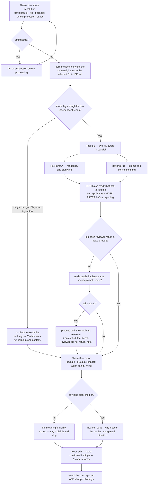

# Behaviour register — `code-quality`

What `/r:code-quality` does, stated once, with an ID. Format and ID scheme: `README.md` beside
this file. IDs are stable; an entry that stops being true is marked `RETIRED` in place rather than
renumbered.

The skill is prose end to end — a scope pass, two lenses, one report. It ships no script and no
test suite, and the half of it that matters most is a **refusal list**: what it will not flag. A
rewrite that trims the refusals turns the skill into the noisy linter it exists not to be, and
nothing fails when that happens, so the `## Prose-only behaviours` roll-up at the bottom is the
real exposure.

## Flow

## Entries

- **SB-code-quality-001** — The skill is a **report-only review of whether code is easy for the
  next human to read and change**, and whether it follows the idioms of the language/framework and
  the conventions already in this codebase. Its question — "if a teammate opened this file cold,
  would they understand it quickly, and is it written the way code in this project is normally
  written?" — needs a reader, not a linter, which is why no analyzer replaces it.
  *States it:* `skills/code-quality/SKILL.md`
  *Enforced by:* —
  *Tested by:* —

- **SB-code-quality-002** — **It only REPORTS — it never edits code.** The run stops at the report;
  applying findings is `/r:code-refactor`'s job, which locks behaviour with a test first and then
  changes form safely. The confirmed findings are handed over if the user wants them applied.
  *States it:* `skills/code-quality/SKILL.md`
  *Enforced by:* —
  *Tested by:* —

- **SB-code-quality-003** — It sits in a fixed division of labour and routes elsewhere rather than
  overlapping: `/r:code-bugs` hunts what is *broken*, `/sonar` runs a mechanical analyzer over
  compiled bytecode, `/simplify` and `/r:code-refactor` *apply* changes.
  *States it:* `skills/code-quality/SKILL.md`
  *Enforced by:* —
  *Tested by:* —

- **SB-code-quality-004** — **The bar is the senior-engineer test**: every finding must be one a
  thoughtful senior engineer would agree makes the code genuinely easier to read or maintain. Taste,
  a rule applied for its own sake, and a trade of one readable form for an equally readable one are
  all dropped. When torn, drop it — a false positive costs more than a missed nit, because it
  erodes trust in every other finding.
  *States it:* `skills/code-quality/SKILL.md`, `skills/code-quality/references/what-not-to-flag.md`
  *Enforced by:* —
  *Tested by:* —

- **SB-code-quality-005** — **What the skill refuses to flag is half the job.** "Code quality" tools
  fail by drowning the signal in dogma — splitting a clear 30-line method because methods should be
  tiny, demanding a comment on every field, rewriting a fine loop into a stream — and that noise
  trains people to ignore the tool. A short report of real clarity wins beats a long list of nits;
  length is not a measure of thoroughness here, precision is.
  *States it:* `skills/code-quality/SKILL.md`, `skills/code-quality/references/what-not-to-flag.md`
  *Enforced by:* —
  *Tested by:* —

- **SB-code-quality-006** — **Phase 1 resolves the scope.** The default in a post-task context is
  the working-tree diff (`git diff`, plus `git diff --cached` when something is staged); a named
  class/file is reviewed in full; a package is its source files; the whole project only when
  explicitly asked, excluding tests unless asked, generated code and build output.
  *States it:* `skills/code-quality/SKILL.md`
  *Enforced by:* —
  *Tested by:* —

- **SB-code-quality-007** — Inside a review routine the **full changed files** are read, not just
  the hunks, so a method's clarity is judged in context — but **findings stay on lines that
  changed**, unless a changed line makes a pre-existing problem materially worse. Without that
  second half, a one-line diff turns into a review of the whole file.
  *States it:* `skills/code-quality/SKILL.md`
  *Enforced by:* —
  *Tested by:* —

- **SB-code-quality-008** — An **ambiguous scope stops the run**: `AskUserQuestion` before
  proceeding. The actual files are then resolved with `Glob`, `Grep` and `git`.
  *States it:* `skills/code-quality/SKILL.md`
  *Enforced by:* —
  *Tested by:* —

- **SB-code-quality-009** — **Local conventions are learned before reviewing** — a few neighbouring
  files, or the relevant `CLAUDE.md` — so that "idiomatic" and "follows project style" mean *this*
  project. Code that matches the surrounding code is usually right even when it would not be the
  reviewer's first choice.
  *States it:* `skills/code-quality/SKILL.md`, `skills/code-quality/references/idioms-and-conventions.md`
  *Enforced by:* —
  *Tested by:* —

- **SB-code-quality-010** — **Phase 2 launches two reviewers in parallel**, each owning one lens
  and reading only its own reference file plus the shared guard: **Reviewer A — Readability &
  clarity** on `references/readability-and-clarity.md`, **Reviewer B — Idioms & conventions** on
  `references/idioms-and-conventions.md`. Two focused, independent reads rather than one blended
  one.
  *States it:* `skills/code-quality/SKILL.md`
  *Enforced by:* —
  *Tested by:* —

- **SB-code-quality-011** — **Both reviewers must also read
  `references/what-not-to-flag.md` and apply it as a hard filter before reporting anything.** It is
  not advisory context: it is the gate each finding passes before it is written down.
  *States it:* `skills/code-quality/SKILL.md`
  *Enforced by:* —
  *Tested by:* —

- **SB-code-quality-012** — Each reviewer is briefed to read the **actual source** — enough
  surrounding code to understand intent, not only the changed lines — and told this is a
  **discovery read for clarity**, not a bug hunt and not a fix pass: **report only, never edit**.
  *States it:* `skills/code-quality/SKILL.md`
  *Enforced by:* —
  *Tested by:* —

- **SB-code-quality-013** — Each finding comes back as `file:line`, what is unclear or
  non-idiomatic, **why it costs the reader** — concretely, e.g. "a reader has to scan the whole
  method to learn `flag` means 'already refunded'" — and a short suggested direction that is **a
  hint, not a patch**.
  *States it:* `skills/code-quality/SKILL.md`
  *Enforced by:* —
  *Tested by:* —

- **SB-code-quality-014** — **The cutoff for splitting the lenses is scope size**: a single changed
  file → run both lenses inline; use the parallel join only when the scope is large enough that two
  independent reads pay for it. The split earns its cost on modules and larger scopes, not on a
  small diff.
  *States it:* `skills/code-quality/SKILL.md`
  *Enforced by:* —
  *Tested by:* —

- **SB-code-quality-015** — **With no `Agent` tool both lenses run inline and the report says so**,
  in one line at the top: *"Both lenses run inline in one context."* Subagents cannot spawn, which
  is how `/r:task-review` drives this skill; the loss is mild (two lenses over one diff, not five
  hunters) but the reader must never assume two independent reads happened. Both reference files
  are still worked through, still with `what-not-to-flag` as the hard filter.
  *States it:* `skills/code-quality/SKILL.md`
  *Enforced by:* —
  *Tested by:* —

- **SB-code-quality-016** — **A subagent's result is the value the `Agent` tool returns, and that
  return is the completion signal.** A reviewer that has already returned is never waited on,
  re-checked or polled, and no side-channel done-marker, output file or status file is invented —
  no `Monitor`, no file-mtime polling. That is what makes a coordinator hang for minutes on a
  subagent that already finished.
  *States it:* `skills/code-quality/SKILL.md`
  *Enforced by:* —
  *Tested by:* —

- **SB-code-quality-017** — A reviewer that comes to rest **without a usable result** — it died,
  returned nothing, or stalled past a short bounded wait — is **re-dispatched with the same lens,
  scope and prompt, bounded to 2 re-dispatches**; after that the run stops and says which lens is
  blocked. It is never silently proceeded past and never waited on indefinitely.
  *States it:* `skills/code-quality/SKILL.md`
  *Enforced by:* —
  *Tested by:* —

- **SB-code-quality-018** — If a reviewer still does not return after the bounded re-dispatch, the
  run **proceeds with the surviving reviewer's findings** and adds an explicit "the &lt;lens&gt;
  reviewer did not return" note to the report, rather than blocking on the join. One lens plus a
  named gap is a usable review; a hung join is not.
  *States it:* `skills/code-quality/SKILL.md`
  *Enforced by:* —
  *Tested by:* —

- **SB-code-quality-019** — **Phase 3 collects from the reviewers that returned**, carries any
  "did not return" note into the report, **deduplicates** — the same line often surfaces under both
  lenses and is merged into one entry — and drops anything that does not clear the bar.
  *States it:* `skills/code-quality/SKILL.md`
  *Enforced by:* —
  *Tested by:* —

- **SB-code-quality-020** — Findings are **grouped by impact, not by reviewer**: **Worth fixing**
  (real clarity or maintainability wins — a misleading name in a hot path, a method that needs
  splitting along a real seam, a non-idiomatic construct that will trip up the next maintainer) and
  **Minor / optional** (small, low-stakes improvements the author can take or leave).
  *States it:* `skills/code-quality/SKILL.md`
  *Enforced by:* —
  *Tested by:* —

- **SB-code-quality-021** — Each reported finding carries **File & line**, **What** (the unclear or
  non-idiomatic code), **Why it costs the reader** — the concrete cost, never "this violates rule
  X" — and a **Suggested direction**: a brief sketch of a clearer form, not a full rewrite.
  *States it:* `skills/code-quality/SKILL.md`
  *Enforced by:* —
  *Tested by:* —

- **SB-code-quality-022** — **If the code reads well, the report says so plainly and stops** —
  "No meaningful clarity issues; the changes are readable and idiomatic." The report is never
  padded to look thorough; an honest empty report is what keeps the skill trustworthy.
  *States it:* `skills/code-quality/SKILL.md`
  *Enforced by:* —
  *Tested by:* —

- **SB-code-quality-023** — **Clean-code dogma is not enforced, and none of these is a finding on
  its own**: method or class length as a number (only a method doing several unrelated things with
  a real seam, and then the reason is the seam, never the line count); "every method must be tiny"
  (splitting one readable method into five single-use one-liners makes the reader hop between
  fragments to reconstruct one thought); "comment everything" / "add Javadoc" (the project's
  convention is no unnecessary comments and no Javadoc unless asked — if code needs a comment to be
  understood, the fix is a clearer name, not a comment); blind parameter-count rules; forcing
  functional style (a plain `for` loop is not worse than a stream, nor a stream than a loop); DRY
  taken to an extreme (a little duplication beats the wrong abstraction); "one assertion per test",
  "no magic numbers ever", Hungarian notation and similar rote rules; and asking for premature
  abstraction, config flags or extension points "for the future".
  *States it:* `skills/code-quality/references/what-not-to-flag.md`
  *Enforced by:* —
  *Tested by:* —

- **SB-code-quality-024** — Two carve-outs keep the refusal list from swallowing real findings: a
  comment that **actively lies** about what the code does **is** reported, and **existing**
  speculative generality — unused parameters, an interface with one implementation and no second
  caller in sight — is fair game as noise the reader must wade through. What is forbidden is asking
  the author to *add* abstraction or comments.
  *States it:* `skills/code-quality/references/what-not-to-flag.md`, `skills/code-quality/references/readability-and-clarity.md`
  *Enforced by:* —
  *Tested by:* —

- **SB-code-quality-025** — Whole categories are **routed elsewhere and not reported here**: bugs,
  correctness and edge cases → `/r:code-bugs` (a genuine bug spotted while reading is mentioned
  briefly as a note, but it is not this skill's deliverable); security → `/r:code-bugs`' security
  hunter; performance such as N+1 or an unbounded fetch → `/r:code-bugs`' performance category;
  anything only a compiled static analyzer should catch → `/sonar`; pure formatting, whitespace and
  import order → a formatter's job, not a review's.
  *States it:* `skills/code-quality/references/what-not-to-flag.md`
  *Enforced by:* —
  *Tested by:* —

- **SB-code-quality-026** — **The local code wins over the reviewer's preference.** A convention
  deviation is flagged only when the new code breaks *from* the project's own established pattern,
  never when it fails to meet an external ideal; a pattern used widely across the project is not
  relitigated on one new use of it; and the author is assumed competent — something that looks odd
  but plausibly intentional gets the benefit of the doubt or is phrased as a question, not a
  verdict.
  *States it:* `skills/code-quality/references/what-not-to-flag.md`, `skills/code-quality/references/idioms-and-conventions.md`
  *Enforced by:* —
  *Tested by:* —

- **SB-code-quality-027** — **Names are the highest-value clarity findings** and lens A leads with
  them: a name that says one thing while the code does another (`flag` that means "already
  refunded", `getUser()` that also mutates, `isValid` that returns a count), a name hiding a unit or
  meaning (seconds vs ms, bytes vs entries, cents vs dollars), an opaque abbreviation or single
  letter outside a tiny scope, and a boolean whose negation has to be decoded (`if (!isNotReady)`).
  A loop index `i`, a lambda `e` or a math `x` in a three-line scope is explicitly fine.
  *States it:* `skills/code-quality/references/readability-and-clarity.md`
  *Enforced by:* —
  *Tested by:* —

- **SB-code-quality-028** — Lens A also covers **control flow you have to untangle**: deep nesting
  where a guard clause would flatten it — but only when it actually reduces cognitive load, not to
  hit a nesting number; long unnamed boolean conditions that read as a sentence once extracted into
  a named local; flag/mode parameters that make one method do two things (`render(true)` tells the
  reader nothing); surprising side effects; and inconsistent return shapes for the same kind of
  "nothing", which leave the caller unable to reason.
  *States it:* `skills/code-quality/references/readability-and-clarity.md`
  *Enforced by:* —
  *Tested by:* —

- **SB-code-quality-029** — **A method doing too much is flagged only when there is a real seam.**
  The shape is mixed levels of abstraction — orchestration interleaved with low-level work — the
  finding names the natural split (parse / validate / persist), and it is skipped when splitting
  would just scatter one coherent thought. A repeated non-obvious literal becomes a named constant
  only when naming it actually aids understanding, never for "no magic numbers".
  *States it:* `skills/code-quality/references/readability-and-clarity.md`
  *Enforced by:* —
  *Tested by:* —

- **SB-code-quality-030** — Lens A's structural findings are **leaky abstractions** (a class you
  must call `init()` before `run()` on, with nothing signalling the order), **dead-but-shipped
  scaffolding**, a **comment that contradicts the code** (one of the two is wrong and the mismatch
  alone is worth a flag), and an **inconsistent shape within the same change** — two new methods
  doing parallel things in two styles, so the reader cannot pattern-match.
  *States it:* `skills/code-quality/references/readability-and-clarity.md`
  *Enforced by:* —
  *Tested by:* —

- **SB-code-quality-031** — **Lens B judges two layers and the project layer wins ties**: the
  language/framework idiom, and how *this* codebase already does it — neighbours and the relevant
  `CLAUDE.md` checked first. It covers reinventing the standard library or an **existing project
  helper** (found first, and flagged only if it genuinely exists and fits), fighting the framework,
  and introducing a second way to do something the codebase already does one way, which is a tax on
  everyone.
  *States it:* `skills/code-quality/references/idioms-and-conventions.md`
  *Enforced by:* —
  *Tested by:* —

- **SB-code-quality-032** — Lens B is explicitly **not** "rewrite loops as streams" or "make it
  more functional" (both forms are idiomatic — pick the project's prevailing one and flag only a
  real outlier), **not** importing idioms from another language, and **not** style or formatting,
  which a formatter owns. If non-idiomatic code is locally consistent and harmless, it is let go;
  an actual bug in equality or comparison belongs to `/r:code-bugs` and is noted briefly, not
  worked.
  *States it:* `skills/code-quality/references/idioms-and-conventions.md`
  *Enforced by:* —
  *Tested by:* —

- **SB-code-quality-033** — **Both lenses state a concrete cost rather than a rule.** "The codebase
  uses constructor injection everywhere; this field-injected `@Autowired` makes the class harder to
  test and breaks the pattern every other service follows" is a finding; "should use constructor
  injection — best practice" is not. If the cost to the reader cannot be articulated, the candidate
  is taste and is dropped.
  *States it:* `skills/code-quality/references/readability-and-clarity.md`, `skills/code-quality/references/idioms-and-conventions.md`
  *Enforced by:* —
  *Tested by:* —

- **SB-code-quality-034** — The run is recorded last, once the report exists, as one
  `lib/record-run.py` line carrying `skill: "r:code-quality"`, `scope` (`diff|all|explicit`),
  `reviewers`, `reviewersLost`, `worthFixing`, `minor`, and one `findings` entry per reported item
  on `track: "code-quality"` with `severity` `worth-fixing` or `minor`. Recording is what makes the
  skill's yield measured rather than assumed.
  *States it:* `skills/code-quality/SKILL.md`
  *Enforced by:* `lib/record-run.py`
  *Tested by:* —

- **SB-code-quality-035** — **Everything the reviewers raised and the report dropped is recorded
  too, as `verdict: "dismissed"`** — that is the measure of how much of this skill's output is
  noise, and it cannot be reconstructed from a report that never mentioned it. Reported items are
  `confirmed`.
  *States it:* `skills/code-quality/SKILL.md`
  *Enforced by:* `lib/record-run.py`
  *Tested by:* `lib/tests/stats.test.sh`

- **SB-code-quality-036** — **An honest empty report records no findings at all** — the store has to
  be able to show that happening, so a clean review is a real row with zero findings rather than an
  absent one.
  *States it:* `skills/code-quality/SKILL.md`
  *Enforced by:* —
  *Tested by:* —

- **SB-code-quality-037** — Each `description` stays one line, and the recording script always
  exits 0: a record that does not get written is a lost record, not a failed review, and it is
  never retried.
  *States it:* `skills/code-quality/SKILL.md`
  *Enforced by:* `lib/record-run.py`
  *Tested by:* `lib/tests/stats.test.sh`

## Prose-only behaviours

Held up by wording alone — nothing fails if they quietly stop being true. That is the whole skill
apart from the stats sink: it ships no script and no test suite, and the refusal list
(SB-code-quality-023 through SB-code-quality-026) is the part a rewrite is most likely to soften,
because every line of it reads like something a review tool ought to be doing.

- SB-code-quality-001 — report-only readability and idiom review, the judgement layer.
- SB-code-quality-002 — it never edits; applying is `/r:code-refactor`'s job.
- SB-code-quality-003 — the division of labour against `/r:code-bugs`, `/sonar`, `/simplify`.
- SB-code-quality-004 — the senior-engineer bar; when torn, drop it.
- SB-code-quality-005 — what it refuses to flag is half the job.
- SB-code-quality-006 — the four scope shapes and their exclusions.
- SB-code-quality-007 — full changed files read, findings kept to changed lines.
- SB-code-quality-008 — an ambiguous scope asks before proceeding.
- SB-code-quality-009 — local conventions are learned first.
- SB-code-quality-010 — two lenses, one reference file each.
- SB-code-quality-011 — both reviewers read `what-not-to-flag.md` as a hard filter.
- SB-code-quality-012 — read the real source; discovery read, never a fix pass.
- SB-code-quality-013 — the per-finding return shape, suggestion as a hint not a patch.
- SB-code-quality-014 — the single-file cutoff for running inline.
- SB-code-quality-015 — no `Agent` tool → inline, and the report says so.
- SB-code-quality-016 — the return is the completion signal; no polling, no done-markers.
- SB-code-quality-017 — re-dispatch twice, then name the blocked lens.
- SB-code-quality-018 — proceed with the survivor plus a named gap rather than hanging.
- SB-code-quality-019 — collect, carry the note, dedupe across lenses.
- SB-code-quality-020 — grouped by impact, not by reviewer.
- SB-code-quality-021 — the per-finding report shape, cost not rule.
- SB-code-quality-022 — say "this reads well" plainly and stop.
- SB-code-quality-023 — the clean-code dogma that is never a finding on its own.
- SB-code-quality-024 — the two carve-outs: a lying comment, existing speculative generality.
- SB-code-quality-025 — bugs, security, performance, analyzer findings and formatting route away.
- SB-code-quality-026 — match the codebase; don't relitigate; assume competence.
- SB-code-quality-027 — the name findings, and the scopes where a short name is fine.
- SB-code-quality-028 — control flow worth untangling.
- SB-code-quality-029 — a method doing too much only when there is a real seam.
- SB-code-quality-030 — leaky abstractions, dead scaffolding, lying comments, mixed shapes.
- SB-code-quality-031 — the two idiom layers and the project layer winning ties.
- SB-code-quality-032 — not streams-for-streams' sake, not foreign idioms, not formatting.
- SB-code-quality-033 — state the concrete cost or drop the finding.
- SB-code-quality-036 — an honest empty report is recorded as an empty one.
