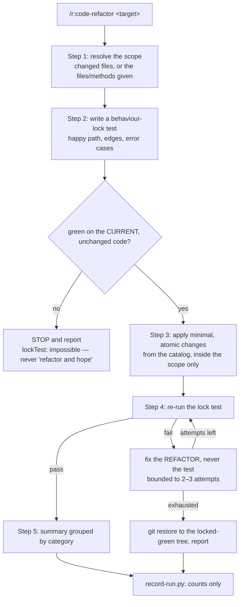

# `code-refactor` — behaviour register

`/r:code-refactor`: improve readability, maintainability or performance of existing code **without
changing behaviour** — lock the behaviour with a test that is green on the unchanged code, then
change form.

Format, ID scheme and the meaning of the three trailing fields: [`README.md`](README.md).

## Flow

## Entries

- **SB-code-refactor-001** — The skill eliminates code smells and improves readability in existing
  Java/Spring code by applying **safe, behaviour-preserving** improvements. Behaviour preservation is
  not a quality of the output to be checked afterwards; it is the contract the whole workflow is
  built to hold.
  *States it:* `skills/code-refactor/SKILL.md`
  *Enforced by:* —
  *Tested by:* —

- **SB-code-refactor-002** — It is **not** for adding features, fixing bugs, restructuring entire
  modules, or writing tests where no refactor follows. Those change behaviour, or change more than
  a lock test can cover, which is exactly what this skill's guarantee cannot stretch to.
  *States it:* `skills/code-refactor/SKILL.md`
  *Enforced by:* —
  *Tested by:* —

- **SB-code-refactor-003** — Step 1 resolves the target: the changed files when working from a git
  diff, or the specific files and methods named by the caller. Current behaviour, inputs, outputs
  and edge cases are understood before anything is written — they are what the lock test has to
  capture.
  *States it:* `skills/code-refactor/SKILL.md`
  *Enforced by:* —
  *Tested by:* —

- **SB-code-refactor-004** — Step 2 writes tests **before making ANY change**. The order is the
  safety guarantee: a test written after the edit locks the new behaviour, which is no lock at all.
  *States it:* `skills/code-refactor/SKILL.md`
  *Enforced by:* —
  *Tested by:* —

- **SB-code-refactor-005** — The lock test identifies the testable units and covers the happy path,
  edge cases (boundaries, empty inputs, nulls) and error scenarios (invalid inputs, exceptions),
  following the project's existing test patterns rather than inventing a new style.
  *States it:* `skills/code-refactor/SKILL.md`
  *Enforced by:* —
  *Tested by:* —

- **SB-code-refactor-006** — The test is run and must pass **against the current implementation**
  before the refactor starts. A lock test nobody has seen go green proves nothing about the code it
  is supposed to be locking.
  *States it:* `skills/code-refactor/SKILL.md`
  *Enforced by:* —
  *Tested by:* —

- **SB-code-refactor-007** — **The hard behaviour-lock gate.** If a behaviour-lock test cannot be
  made green on the current, unchanged code — the seam is untestable, there is no harness, or the
  test will not go green as written — the run **STOPS and reports** what blocked it, and the code is
  left alone for the user to decide. An unlocked refactor may silently change behaviour, so "refactor
  and hope" is not an available outcome.
  *States it:* `skills/code-refactor/SKILL.md`
  *Enforced by:* —
  *Tested by:* —

- **SB-code-refactor-008** — Step 3 refactors with the test as the net, changing **no** business
  logic and **no** external behaviour. Each change is minimal and atomic: many small improvements
  rather than a large rewrite, because a rewrite the lock test happens to survive is still a change
  nobody reviewed piece by piece.
  *States it:* `skills/code-refactor/SKILL.md`
  *Enforced by:* —
  *Tested by:* —

- **SB-code-refactor-009** — The refactor stays inside the scope resolved in Step 1 — the changed
  lines, the files that were asked about. Untouched code is not rewritten merely because the catalog
  lists a pattern that technically applies: that adds behaviour risk and review burden with no
  clarity gain on the actual change. The catalog is a **menu, not a checklist** — only the entries
  that make *this* code genuinely clearer, to the bar a senior engineer would agree with.
  *States it:* `skills/code-refactor/SKILL.md`
  *Enforced by:* —
  *Tested by:* —

- **SB-code-refactor-010** — Naming and structure: rename vague variables, methods and classes to
  express intent; split god classes along single responsibility; extract inner logic into well-named
  private methods **when a method does several distinct things and the split follows a real seam**;
  keep the `*Service` / `*Repository` / `*Dto` / `*Controller` convention. There is no hard
  line-count limit — a clear method is never split to hit a number.
  *States it:* `skills/code-refactor/SKILL.md`
  *Enforced by:* —
  *Tested by:* —

- **SB-code-refactor-011** — Spring-specific fixes: constructor injection in place of field
  `@Autowired`; drop `@Autowired` on a single constructor; `@RequiredArgsConstructor` with
  `private final` fields; specific `@GetMapping`/`@PostMapping` instead of `@RequestMapping`; magic
  strings and config values moved to `application.yml` behind `@Value`/`@ConfigurationProperties`;
  `@Transactional` on the service layer only, never on controllers or repositories; unused
  `@Component`/`@Service`/`@Bean` registrations removed.
  *States it:* `skills/code-refactor/SKILL.md`
  *Enforced by:* —
  *Tested by:* —

- **SB-code-refactor-012** — Code smells: `Optional<T>` or a meaningful exception in place of a
  `null` return; dead code, commented-out blocks and unused imports removed; raw types replaced with
  generics; nested if/else collapsed into guard clauses; try-with-resources for manual resource
  management; redundant `.toString()`, `.equals(true)` and boxed-type abuse dropped; repeated
  literals extracted into named constants; `instanceof` chains replaced with polymorphism where
  appropriate; mutable state eliminated in favour of immutable DTOs.
  *States it:* `skills/code-refactor/SKILL.md`
  *Enforced by:* —
  *Tested by:* —

- **SB-code-refactor-013** — Modern Java and readability: records for DTOs and value objects;
  Stream API for verbose loops **where it improves clarity, not everywhere**; `var` when the type is
  obvious from the right-hand side; switch expressions instead of if/else chains on enums; text
  blocks for multi-line SQL/JSON; `List.of()`/`Map.of()` over `Arrays.asList()` or manual init.
  *States it:* `skills/code-refactor/SKILL.md`
  *Enforced by:* —
  *Tested by:* —

- **SB-code-refactor-014** — Error handling: specific exception types in place of
  `catch (Exception e)`; domain-specific exceptions; `@RestControllerAdvice` with `@ExceptionHandler`
  for centralized handling; **never swallow an exception silently** — always log or rethrow.
  *States it:* `skills/code-refactor/SKILL.md`
  *Enforced by:* —
  *Tested by:* —

- **SB-code-refactor-015** — Logging: SLF4J (`@Slf4j`) in place of `System.out.println`, and
  parameterized logging (`log.info("Processing order id={}", orderId)`) rather than string
  concatenation.
  *States it:* `skills/code-refactor/SKILL.md`
  *Enforced by:* —
  *Tested by:* —

- **SB-code-refactor-016** — Comments: trivial comments that restate the code are removed, "why"
  comments are kept and "what" comments are not, and **Javadoc is never added unless explicitly
  requested**.
  *States it:* `skills/code-refactor/SKILL.md`
  *Enforced by:* —
  *Tested by:* —

- **SB-code-refactor-017** — Step 4 re-runs the Step 2 tests and they must all pass. A failure is
  fixed in **the refactoring** — never in the test and never by changing behaviour — and that repair
  loop is bounded to **2–3 attempts**, so a refactor that will not come right cannot consume the run.
  *States it:* `skills/code-refactor/SKILL.md`
  *Enforced by:* —
  *Tested by:* —

- **SB-code-refactor-018** — **On exhaustion, revert and report.** If the tests still fail after the
  bounded attempts, the touched files are `git restore` / `git checkout --`'d back to the
  locked-green starting point and the failure is reported. A half-refactored, test-failing tree is
  never left behind, and the lock test is never weakened to make it pass: a refactor that cannot be
  made safe is abandoned, not forced.
  *States it:* `skills/code-refactor/SKILL.md`
  *Enforced by:* —
  *Tested by:* —

- **SB-code-refactor-019** — Step 5 summarizes every change grouped by category (Naming, Spring,
  Code Smells, Modern Java, Error Handling, Logging, Comments), so the caller can see what class of
  change landed without re-reading the diff.
  *States it:* `skills/code-refactor/SKILL.md`
  *Enforced by:* —
  *Tested by:* —

- **SB-code-refactor-020** — Step 5 then records one row through `lib/record-run.py` with
  `skill: "r:code-refactor"`, `scope`, `lockTest` (`written|existing|impossible`), `refactors`,
  `skippedRisky` and `testsGreen` — counts only, never code or finding text.
  `lockTest: "impossible"` is the Step 2 gate firing: the run stopped without refactoring, which is
  a real outcome worth counting rather than an absent row. The script always exits `0`; a row that
  is not written is a lost row, never a failed refactor, so it is **never retried**.
  *States it:* `skills/code-refactor/SKILL.md`
  *Enforced by:* `lib/record-run.py`
  *Tested by:* `lib/tests/stats.test.sh`

- **SB-code-refactor-021** — The `r:java-backend-developer` agent does the work: writing the initial
  tests, performing the refactoring and running the verification tests.
  *States it:* `skills/code-refactor/SKILL.md`
  *Enforced by:* —
  *Tested by:* —

- **SB-code-refactor-022** — A refactor that is too risky without test coverage is **skipped**, and
  the skip is a reported outcome (`skippedRisky`), not a silent omission. Existing tests are
  preserved and must still pass alongside the new lock test.
  *States it:* `skills/code-refactor/SKILL.md`
  *Enforced by:* —
  *Tested by:* —

- **SB-code-refactor-023** — No over-engineering and no speculative abstraction, and no optimization
  without measurements. A refactor that adds an abstraction nobody needs has changed the code's
  shape for the worse while still passing the lock test.
  *States it:* `skills/code-refactor/SKILL.md`
  *Enforced by:* —
  *Tested by:* —

- **SB-code-refactor-024** — This skill is the **applying** half of the pack's readability stack:
  `/r:code-quality` reports and edits nothing, and hands its confirmed findings here; `/r:code-scan`
  routes method-shape smells (cognitive complexity, too many parameters, method too long) here
  rather than hand-editing them. Both rely on the behaviour-lock gate — which is also free to refuse
  a handed-over item, and a refused item is dropped and said so.
  *States it:* `skills/code-quality/SKILL.md`
  *Enforced by:* `skills/task-review/task-review.workflow.js`
  *Tested by:* —

- **SB-code-refactor-025** — `/r:task-review`'s readability step invokes this skill on the changed
  files only, and that step is deliberately **not** one of the configured fixers in `steps.fix`: a
  `provider: codex` row has nothing to hand a CLI, because what runs here is a skill, not a command.
  The refactor is also serialized after the correctness fixer — a refactorer editing the tree while
  a fixer still holds it is a silent corruption — and a refactor that dies costs polish only, never
  correctness.
  *States it:* `skills/task-review/SKILL.md`
  *Enforced by:* `skills/task-review/task-review.workflow.js`
  *Tested by:* `skills/task-review/tests/control-flow.test.mjs`

## Prose-only behaviours

Held up by wording alone — no *Enforced by:* and no *Tested by:*. The skill ships no script and no
suite of its own, so the exposure is nearly total: **22 of 25** entries.

SB-code-refactor-001, -002, -003, -004, -005, -006, -007, -008, -009, -010, -011, -012, -013,
-014, -015, -016, -017, -018, -019, -021, -022, -023

The three that are not: **-020** (the stats row, written by `lib/record-run.py` and covered by
`lib/tests/stats.test.sh`) and **-024** / **-025** (being dispatched as the applying half, which
`task-review.workflow.js` does and its control-flow suite asserts).

**The three that matter most are the three with nothing behind them.** The behaviour-lock gate
(-007), the bounded repair loop (-017) and the revert-on-exhaustion (-018) are the entire safety
guarantee of this skill, and all three are sentences. Soften any of them and "refactor" quietly
becomes "change behaviour and hope", with no green/red anywhere in the pack that turns.
