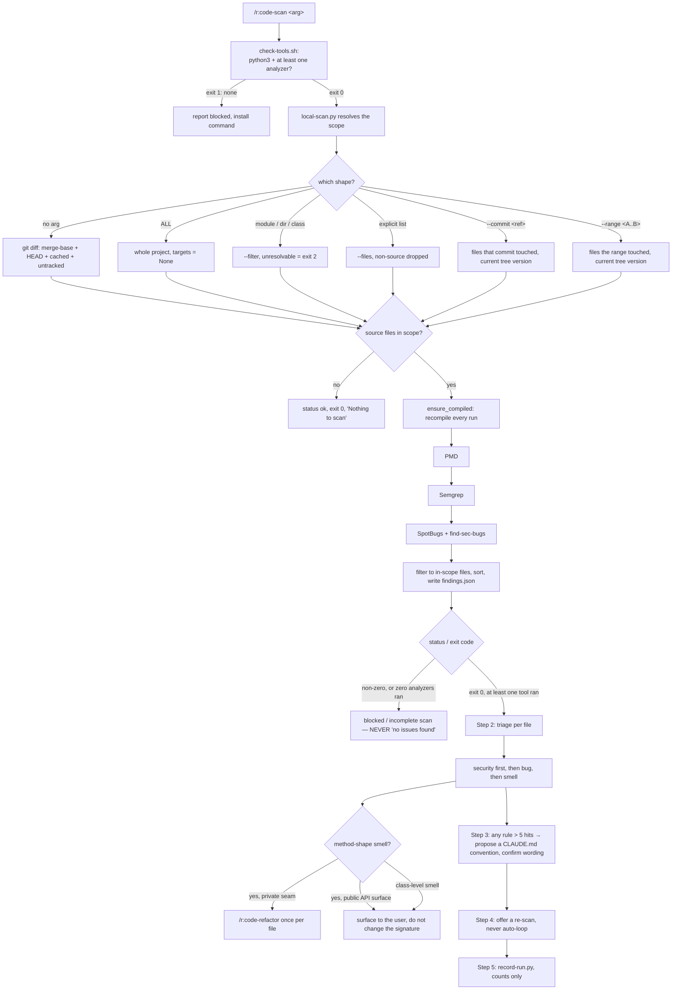

# `code-scan` — behaviour register

`/r:code-scan`: server-free static analysis over a slice of a JVM project with three local CLI
analyzers, then the same triage-and-fix loop `/sonar` runs, with no SonarQube server, no upload and
no build-file change.

Format, ID scheme and the meaning of the three trailing fields: [`README.md`](README.md).

## Flow

## Entries

- **SB-code-scan-001** — The skill runs three local analyzers over a slice of a JVM project, merges
  their output into one list, and works through the fixes with the user. The project's `pom.xml` /
  `build.gradle` are never touched, nothing is uploaded, and no server or token is needed — that
  offline, zero-infrastructure property is the whole reason it exists beside `/sonar`.
  *States it:* `skills/code-scan/SKILL.md`
  *Enforced by:* —
  *Tested by:* —

- **SB-code-scan-002** — All three analyzers run, because they cover different ground: PMD reads
  source for smells and complexity, SpotBugs + find-sec-bugs reads *bytecode* for correctness
  patterns plus a security ruleset, Semgrep reads source for registry security and anti-pattern
  rules. Dropping one silently drops its category from the result.
  *States it:* `skills/code-scan/SKILL.md`
  *Enforced by:* `skills/code-scan/scripts/local-scan.py`
  *Tested by:* —

- **SB-code-scan-003** — Each analyzer is independent: a missing binary (or SpotBugs with no
  bytecode) is skipped with a notice and the other tools' findings are still returned. Partial
  coverage beats no scan — but the gap is always named, never left implicit.
  *States it:* `skills/code-scan/SKILL.md`
  *Enforced by:* `skills/code-scan/scripts/local-scan.py`
  *Tested by:* `skills/code-scan/tests/local-scan.test.sh`

- **SB-code-scan-004** — `scripts/check-tools.sh` runs first and reports what is present, with the
  install command for anything missing (`brew install pmd spotbugs semgrep`). It exits 1 when
  `python3` is absent (the orchestrator cannot run at all) or when no analyzer is installed, and 0
  when `python3` plus at least one analyzer are present, printing "running with a subset". It draws
  the line in exactly the same place `local-scan.py` does: if it said the environment was fine and
  the scan then exited 3 for want of an analyzer, the user would be told a subset ran when nothing
  did.
  *States it:* `skills/code-scan/SKILL.md`
  *Enforced by:* `skills/code-scan/scripts/check-tools.sh`
  *Tested by:* `skills/code-scan/tests/local-scan.test.sh`

- **SB-code-scan-005** — The cwd must be a project root holding `pom.xml`, `build.gradle*`, or
  `mvnw`/`gradlew`. Nothing is needed beyond `python3`: no tokens, no env vars, and no network
  except the one-time find-sec-bugs jar download and Semgrep's first registry fetch, both cached.
  *States it:* `skills/code-scan/SKILL.md`
  *Enforced by:* —
  *Tested by:* —

- **SB-code-scan-006** — The orchestrator recompiles on **every** run (`mvn -q -DskipTests compile`
  or `gradle -q compileJava`), never only when no `.class` files exist. Compiling only on that
  condition makes a re-scan after fixes read stale bytecode and re-report issues that are already
  fixed, at their old line numbers. An incremental compile is cheap; honest findings are not
  optional.
  *States it:* `skills/code-scan/SKILL.md`
  *Enforced by:* `skills/code-scan/scripts/local-scan.py`
  *Tested by:* —

- **SB-code-scan-007** — A broken build stops the run: findings on code that does not compile are
  noise. If the compile fails while stale `.class` files exist, SpotBugs still runs against them,
  the warning "compile failed; SpotBugs ran against stale `.class` files" is recorded, `status`
  becomes `error` and the script exits 1 — so the fallback can never be mistaken for a clean scan.
  *States it:* `skills/code-scan/SKILL.md`
  *Enforced by:* `skills/code-scan/scripts/local-scan.py`
  *Tested by:* —

- **SB-code-scan-008** — Step 1 runs `python3 "${CLAUDE_SKILL_DIR}/scripts/local-scan.py"` with the
  flag matching the user's invocation. The script scopes the source set, runs each available
  analyzer, normalizes the three output formats into one, filters to the in-scope files, writes
  `findings.json` (default `-o findings.json`, beside the cwd) and prints a
  `SEVERITY TOOL CATEGORY FILE:LINE RULE MESSAGE` table, which is streamed to the user.
  *States it:* `skills/code-scan/SKILL.md`
  *Enforced by:* `skills/code-scan/scripts/local-scan.py`
  *Tested by:* —

- **SB-code-scan-009** — `findings.json` is a structured object —
  `{status, scope, tools{pmd/semgrep/spotbugs: ran|skipped|errored}, errors[], warnings[],
  findings[]}` — and the script's **exit code is the source of truth**: `0` means a real scan
  completed, non-zero means it did not. The caller reads the exit code, not the length of
  `findings[]`.
  *States it:* `skills/code-scan/SKILL.md`
  *Enforced by:* `skills/code-scan/scripts/local-scan.py`
  *Tested by:* `skills/code-scan/tests/local-scan.test.sh`

- **SB-code-scan-010** — An empty `findings[]` means "clean" only when `status` is not `error`
  **and** at least one tool's status is `ran`. A scan that read the wrong files and a scan that read
  none otherwise report the same "no issues found", which are the only two ways this script can lie.
  *States it:* `skills/code-scan/SKILL.md`
  *Enforced by:* `skills/code-scan/scripts/local-scan.py`
  *Tested by:* `skills/code-scan/tests/local-scan.test.sh`

- **SB-code-scan-011** — A non-zero exit or `status: "error"` — an analyzer `errored`, the compile
  failed against stale classes, or zero analyzers ran — is reported as a **blocked or incomplete
  scan**, naming which tool errored, exactly like the build-failed stop. "No issues found" is never
  printed for a run that errored or that never ran a single analyzer.
  *States it:* `skills/code-scan/SKILL.md`
  *Enforced by:* `skills/code-scan/scripts/local-scan.py`
  *Tested by:* `skills/code-scan/tests/local-scan.test.sh`

- **SB-code-scan-012** — Zero analyzers available or all errored is the fail-closed case: the
  script appends `no analyzers ran (none installed or all errored)` to `errors[]`, writes
  `status: "error"`, prints "✗ NO analyzers available/ran — this is NOT a clean result" and exits
  **3**.
  *States it:* `skills/code-scan/SKILL.md`
  *Enforced by:* `skills/code-scan/scripts/local-scan.py`
  *Tested by:* `skills/code-scan/tests/local-scan.test.sh`

- **SB-code-scan-013** — Every tool whose status is `skipped` or `errored` is named to the user, so
  the uncovered category (smells / security / bugs) is visible: a partial scan must not read as a
  full pass. The `warnings[]` go in the same note.
  *States it:* `skills/code-scan/SKILL.md`
  *Enforced by:* —
  *Tested by:* —

- **SB-code-scan-014** — When no diff base resolves (none of `origin/main`, `origin/master`, `main`,
  `master` exists), the scope narrows to uncommitted and untracked changes only and the script says
  so in `warnings[]`: "a narrowed scope is NOT a clean-project result".
  *States it:* `skills/code-scan/SKILL.md`
  *Enforced by:* `skills/code-scan/scripts/local-scan.py`
  *Tested by:* —

- **SB-code-scan-015** — The default scope (`/r:code-scan` with no argument, `--scope diff`) is the
  union of four sets: the merge-base diff against the first of `origin/main`, `origin/master`,
  `main`, `master` that resolves; `git diff --name-only HEAD`; `--cached`; and
  `git ls-files --others --exclude-standard`. Untracked files are included because a file a
  developer just added is part of "my changes" even though git is not tracking it yet.
  *States it:* `skills/code-scan/SKILL.md`
  *Enforced by:* `skills/code-scan/scripts/local-scan.py`
  *Tested by:* `skills/code-scan/tests/local-scan.test.sh`

- **SB-code-scan-016** — Only `.java` and `.kt` files ever enter the scope, whatever git reports as
  changed. A changed `.txt`, `.yml` or resource never reaches `findings.json`.
  *States it:* `skills/code-scan/SKILL.md`
  *Enforced by:* `skills/code-scan/scripts/local-scan.py`
  *Tested by:* `skills/code-scan/tests/local-scan.test.sh`

- **SB-code-scan-017** — Build output is never source: any path under `target`, `build`,
  `node_modules` or `.git` is excluded from resolution, and a directory holding only build output
  resolves to nothing and exits 2. A finding against compiler output points at a file the user
  cannot edit, and a fix loop aimed there silently rewrites build output.
  *States it:* `skills/code-scan/SKILL.md`
  *Enforced by:* `skills/code-scan/scripts/local-scan.py`
  *Tested by:* `skills/code-scan/tests/local-scan.test.sh`

- **SB-code-scan-018** — `/r:code-scan ALL` scans the entire project (`--scope all`), which the
  orchestrator represents as "no target list" — every file is in scope and no post-filter applies.
  The literal token `ALL` in any case is accepted, lowercase `all` included.
  *States it:* `skills/code-scan/SKILL.md`
  *Enforced by:* `skills/code-scan/scripts/local-scan.py`
  *Tested by:* —

- **SB-code-scan-019** — `/r:code-scan <module-or-class>` becomes `--filter <arg>`, which resolves a
  directory (a Maven/Gradle module — the "scan a whole module with no diff at all" case) to every
  source file under it, a file path to itself, and a bare class name to its source file by
  `rglob`. A filter that resolves to nothing **exits 2** rather than falling back to scanning
  everything: a silent widening from one class to the whole project is the expensive wrong answer.
  *States it:* `skills/code-scan/SKILL.md`
  *Enforced by:* `skills/code-scan/scripts/local-scan.py`
  *Tested by:* `skills/code-scan/tests/local-scan.test.sh`

- **SB-code-scan-020** — `/r:code-scan <class-or-file> [<class-or-file> …]` becomes
  `--files <a> <b> …`, an explicit list that drops anything without a source extension. This is the
  shape `/r:task-review` uses to clean a branch's changed classes, and it fixes **all** findings in
  each listed file, not only the ones on changed lines.
  *States it:* `skills/code-scan/SKILL.md`
  *Enforced by:* `skills/code-scan/scripts/local-scan.py`
  *Tested by:* `skills/code-scan/tests/local-scan.test.sh`

- **SB-code-scan-021** — `--commit <ref>` scopes to the files one commit touched, read with
  `git diff-tree --no-commit-id --name-only -r`, which works for merges and for the root commit. A
  ref that is not a commit is reported and **exits 2**.
  *States it:* `skills/code-scan/SKILL.md`
  *Enforced by:* `skills/code-scan/scripts/local-scan.py`
  *Tested by:* `skills/code-scan/tests/local-scan.test.sh`

- **SB-code-scan-022** — `--range <A..B>` scopes to the files changed across a range
  (`HEAD~3..HEAD`, `main...HEAD`, `v1.0..v1.1`). A spec git rejects is reported and **exits 2**.
  *States it:* `skills/code-scan/SKILL.md`
  *Enforced by:* `skills/code-scan/scripts/local-scan.py`
  *Tested by:* `skills/code-scan/tests/local-scan.test.sh`

- **SB-code-scan-023** — Both git-history scopes resolve to the **current working-tree version** of
  the files that commit or range touched, never the historical contents, because this skill scans
  *and fixes in place* and only the current version can be fixed. Files the commit touched that no
  longer exist are skipped, and SpotBugs still reads current bytecode, so the build still happens
  first.
  *States it:* `skills/code-scan/SKILL.md`
  *Enforced by:* `skills/code-scan/scripts/local-scan.py`
  *Tested by:* —

- **SB-code-scan-024** — A bare argument that could be either a class name or a commit-ish (a short
  hex string) is decided by git: `git rev-parse --verify <arg>` resolving to a commit means
  `--commit`, otherwise it is a class/module `--filter`. Genuinely ambiguous, or any shape outside
  the supported surface, is asked about rather than guessed.
  *States it:* `skills/code-scan/SKILL.md`
  *Enforced by:* —
  *Tested by:* —

- **SB-code-scan-025** — A leading `@` and any trailing `/` are stripped from path arguments, because
  Claude Code hands `@web-adapter/` over verbatim.
  *States it:* `skills/code-scan/SKILL.md`
  *Enforced by:* —
  *Tested by:* —

- **SB-code-scan-026** — A scope that resolves to zero source files is **not** a failure: the script
  prints "No source files in scope. Nothing to scan.", writes `status: "ok"` with an empty `tools`
  map and exits 0. Nothing was owed and nothing was hidden.
  *States it:* `skills/code-scan/scripts/local-scan.py`
  *Enforced by:* `skills/code-scan/scripts/local-scan.py`
  *Tested by:* `skills/code-scan/tests/local-scan.test.sh`

- **SB-code-scan-027** — In-scope filtering matches on the **resolved relative path**, never the
  basename, so two same-named classes in different modules are not confused with each other. The
  filter applies only to a bounded scan (diff / filter / explicit list / commit / range); a whole-
  project run keeps everything.
  *States it:* `skills/code-scan/scripts/local-scan.py`
  *Enforced by:* `skills/code-scan/scripts/local-scan.py`
  *Tested by:* —

- **SB-code-scan-028** — Findings from all three tools are merged into one list and sorted by
  severity (HIGH, MEDIUM, LOW), then file, then line, so the table reads top-down as a work order.
  *States it:* `skills/code-scan/scripts/local-scan.py`
  *Enforced by:* `skills/code-scan/scripts/local-scan.py`
  *Tested by:* —

- **SB-code-scan-029** — Each tool's own severity vocabulary is normalized to HIGH/MEDIUM/LOW: PMD
  priority ≤2 → HIGH, 3 → MEDIUM, else LOW; Semgrep ERROR/WARNING/INFO; SpotBugs SARIF
  error/warning/note. Whitespace in every message is collapsed so one finding is one line.
  *States it:* `skills/code-scan/scripts/local-scan.py`
  *Enforced by:* `skills/code-scan/scripts/local-scan.py`
  *Tested by:* —

- **SB-code-scan-030** — Category is assigned from the reporting tool and rule id, not left to the
  reader: every PMD finding is `smell`; a Semgrep finding whose `check_id` mentions `security` or
  `secrets` is `security`, otherwise `smell`; a SpotBugs rule id that looks like a find-sec-bugs
  rule is `security`, otherwise `bug`. Triage in Step 2 keys off this field.
  *States it:* `skills/code-scan/scripts/local-scan.py`
  *Enforced by:* `skills/code-scan/scripts/local-scan.py`
  *Tested by:* —

- **SB-code-scan-031** — PMD runs `pmd check --no-cache -f json -R rulesets/java/quickstart.xml`
  over a file list (or `-d .` for a whole-project run). Exit `0` means clean and `4` means
  violations found; **any other exit code, or a report that will not parse, marks PMD `errored`,
  never clean** — a crashed analyzer that returns no findings is indistinguishable from a clean one
  unless the exit code is read.
  *States it:* `skills/code-scan/scripts/local-scan.py`
  *Enforced by:* `skills/code-scan/scripts/local-scan.py`
  *Tested by:* —

- **SB-code-scan-032** — PMD's `AvoidUsingHardCodedIP` is muted at the rule level. It fires on RFC
  5737 documentation addresses — the TEST-NET literals a fixture is *supposed* to use — and it is
  the whole of PMD's bad reputation in the stats store: **16 findings in a single run, all
  dismissed, against 4 confirmed from every other PMD rule in the recorded history**. Mute the rule,
  never the analyzer: two of those four are `PreserveStackTrace` catching a dropped exception cause,
  exactly the silent failure this pass exists to find.
  *States it:* `skills/code-scan/scripts/local-scan.py`
  *Enforced by:* `skills/code-scan/scripts/local-scan.py`
  *Tested by:* —

- **SB-code-scan-033** — Semgrep runs `semgrep scan --quiet --json --metrics=off` with
  `p/java`, `p/secrets` and `p/security-audit`. `p/security-audit` is what brings in hardcoded
  secrets, crypto misuse and injection that `p/java` + `p/secrets` leave on the table, and
  `--metrics=off` with named packs keeps the run offline-friendly and cached, unlike `--config=auto`.
  Exit `0` (no findings) and `1` (findings) are the only clean codes; anything else, or a response
  carrying `errors`, marks Semgrep `errored` — including internal errors that still emit JSON.
  *States it:* `skills/code-scan/scripts/local-scan.py`
  *Enforced by:* `skills/code-scan/scripts/local-scan.py`
  *Tested by:* —

- **SB-code-scan-034** — SpotBugs runs `-textui -effort:max -low` with SARIF output over every
  discovered `target/classes` / `build/classes/java/main` directory, loading the find-sec-bugs
  plugin jar (version 1.13.0, fetched once from Maven Central and cached in
  `~/.cache/local-scan/`). If the jar cannot be fetched it runs core rules only, with a notice.
  SARIF that will not parse, or that carries no `runs`, marks SpotBugs `errored` rather than clean —
  an OOM or a plugin failure otherwise reads as a clean bytecode pass.
  *States it:* `skills/code-scan/scripts/local-scan.py`
  *Enforced by:* `skills/code-scan/scripts/local-scan.py`
  *Tested by:* —

- **SB-code-scan-035** — SpotBugs is launched with
  `JAVA_TOOL_OPTIONS=-Djava.awt.headless=true -Dapple.awt.UIElement=true`, because the Homebrew
  launcher adds `-Xdock:name`/`-Xdock:icon` unconditionally on macOS — even for `-textui` — which
  registers the analysis JVM as a GUI app, pops a Dock icon and steals keyboard focus from whatever
  the user is doing.
  *States it:* `skills/code-scan/scripts/local-scan.py`
  *Enforced by:* `skills/code-scan/scripts/local-scan.py`
  *Tested by:* —

- **SB-code-scan-036** — An analyzer that exceeds its timeout (PMD and SpotBugs 900s, Semgrep 600s;
  the compile 900s, git calls 60s) is caught, recorded `errored`, and the scan continues with the
  others. One stalled tool degrades the coverage; it never crashes the run — and because it is
  recorded `errored` rather than `skipped`, the run still fails closed.
  *States it:* `skills/code-scan/scripts/local-scan.py`
  *Enforced by:* `skills/code-scan/scripts/local-scan.py`
  *Tested by:* —

- **SB-code-scan-037** — Step 2 triages by file, not by tool: group `findings[]` by file, read the
  file, apply fixes for **all** of its findings in one pass, then move to the next file.
  *States it:* `skills/code-scan/SKILL.md`
  *Enforced by:* —
  *Tested by:* —

- **SB-code-scan-038** — Findings are handled by what they are, not by who reported them.
  `category: security` comes first and is read carefully — a false positive is cheap to dismiss, a
  real one expensive to miss; `category: bug` is usually a concrete correctness defect and is fixed
  directly; `category: smell` gets the simple ones fixed inline. A genuine false positive is said
  out loud to the user and left alone — the code is never contorted to silence a tool.
  *States it:* `skills/code-scan/SKILL.md`
  *Enforced by:* —
  *Tested by:* —

- **SB-code-scan-039** — A hardcoded credential, API secret or private key noticed while editing a
  file for its real findings is surfaced to the user **as the reader's own observation** — "the
  scanners didn't flag this, but…" — never silently rewritten and never dressed up as tool output.
  That is reporting a concrete thing in front of you, not inventing tool findings, and it is the
  one blind spot a pinned ruleset most often misses.
  *States it:* `skills/code-scan/SKILL.md`
  *Enforced by:* —
  *Tested by:* —

- **SB-code-scan-040** — Method-shape smells — cognitive complexity, too many parameters, method too
  long — are routed to `/r:code-refactor`, which writes a behavior-locking test first, rather than
  hand-edited. It is invoked once per file that has any of them, after that file's simple fixes are
  done.
  *States it:* `skills/code-scan/SKILL.md`
  *Enforced by:* —
  *Tested by:* —

- **SB-code-scan-041** — The refactor is **skipped and surfaced to the user instead** when the
  affected method sits on a public API surface (a `*Controller`, a cross-module `*UseCase` port, a
  public SDK export): changing that signature ripples beyond the module, so the user decides.
  *States it:* `skills/code-scan/SKILL.md`
  *Enforced by:* —
  *Tested by:* —

- **SB-code-scan-042** — Class-level smells (god class, too many methods or fields) are surfaced,
  never fixed: splitting a class changes DI wiring, callers and tests, which needs a design
  conversation rather than an edit.
  *States it:* `skills/code-scan/SKILL.md`
  *Enforced by:* —
  *Tested by:* —

- **SB-code-scan-043** — Step 3 counts findings per rule key and, **for any rule that hit more than
  5 times**, proposes a one-line convention for the project's `CLAUDE.md` under `Code Conventions`.
  It is phrased as a positive rule the author follows ("Extract repeated string literals into named
  constants"), never "don't violate rule X"; the wording is **always** confirmed with the user
  before `CLAUDE.md` is edited, and creating the section at all is asked about first. This is what
  keeps the skill off the treadmill — fix it once, write the rule, and the next round should not see
  it.
  *States it:* `skills/code-scan/SKILL.md`
  *Enforced by:* —
  *Tested by:* —

- **SB-code-scan-044** — Step 4 **offers** a re-scan so the user sees the cleared list, and never
  auto-loops: a re-scan recompiles for SpotBugs and that cost is the user's to accept.
  *States it:* `skills/code-scan/SKILL.md`
  *Enforced by:* —
  *Tested by:* —

- **SB-code-scan-045** — Step 5 records one row through `lib/record-run.py` with
  `skill: "r:code-scan"`, `scope` (`diff|all|filter|files|commit|range`), `analyzers`,
  `analyzersMissing`, `fixed`, `changedCode`, and a `findings[]` of
  `{track, category, severity, file, line, verdict, fixed, description}` — counts only, never
  finding text, each `description` one line. `track` is the analyzer that reported it, so the store
  can say which of the three earns its place. What triage rejected is recorded as
  `verdict: "dismissed"`: for a static analyzer the false-positive rate *is* the thing worth
  knowing, and a fixed-count alone hides it. `analyzersMissing` is what makes a low finding count
  readable — a scan that ran two of three tools found less because it looked less, and a store that
  cannot tell those apart gets quoted as evidence the code is clean. The script always exits `0`; a
  row that is not written is a lost row, never a failed scan, so it is **never retried**.
  *States it:* `skills/code-scan/SKILL.md`
  *Enforced by:* `lib/record-run.py`
  *Tested by:* `lib/tests/stats.test.sh`

- **SB-code-scan-046** — That row is the only place this skill's yield can be read, which is why it
  is not optional: `/r:task-review` treats `/r:code-scan` as mandatory on **every** tier and the
  skill applies its own fixes rather than handing them to the review's triage, so it can never
  appear in `fixedBySource`.
  *States it:* `skills/code-scan/SKILL.md`
  *Enforced by:* `skills/task-review/task-review.workflow.js`
  *Tested by:* `skills/task-review/tests/control-flow.test.mjs`

- **SB-code-scan-047** — Never add `// NOSONAR`, `@SuppressWarnings`, `@SuppressFBWarnings` or
  `nosemgrep` to silence a finding unless the user explicitly asks. Fix the cause, not the
  messenger.
  *States it:* `skills/code-scan/SKILL.md`
  *Enforced by:* —
  *Tested by:* —

- **SB-code-scan-048** — Never fix findings outside the scope the user asked for: the default is
  bounded to the diff, `<module-or-class>` to that path, and only `ALL` opens the whole codebase.
  *States it:* `skills/code-scan/SKILL.md`
  *Enforced by:* —
  *Tested by:* —

- **SB-code-scan-049** — Never mass-edit generated code (MapStruct implementations, generated
  clients). If the scan picks it up, exclude the generated directory instead.
  *States it:* `skills/code-scan/SKILL.md`
  *Enforced by:* —
  *Tested by:* —

- **SB-code-scan-050** — Never invent findings or "what a scanner would probably say" — only what
  the tools reported in `findings.json` is acted on. A skipped tool means its category was **not
  covered**, and that is what the user is told, rather than papering over the gap with guesses.
  *States it:* `skills/code-scan/SKILL.md`
  *Enforced by:* —
  *Tested by:* —

- **SB-code-scan-051** — The boundary with `/sonar`: this skill is for speed and no infrastructure —
  a diff-scoped pass with no server round-trip, no upload and nothing committed to the build.
  `/sonar` is for the canonical SonarQube ruleset, quality gates, coverage integration or a result
  on the shared dashboard. They share the triage-and-fix loop, so `/r:code-scan` is the inner loop
  and `/sonar` the gate before merge.
  *States it:* `skills/code-scan/SKILL.md`
  *Enforced by:* —
  *Tested by:* —

## Prose-only behaviours

Held up by wording alone — no *Enforced by:* and no *Tested by:*. Nothing fails if one of these
quietly stops being true, which is the class a rewrite can lose in silence: **18 of 51** entries.

SB-code-scan-001, -005, -013, -024, -025, -037, -038, -039, -040, -041, -042, -043, -044, -047,
-048, -049, -050, -051

They split cleanly in two. One half is the **triage-and-fix loop** — everything after the
orchestrator hands back `findings.json` (-037 through -044) plus the four "never do X" rules
(-047 through -050). The script decides the scope and whether a scan ran; nothing at all decides
what happens to a finding afterwards, so the >5-hits convention gate, the public-API refactor
exception, the class-level-smell escalation and the refusal to invent findings are wording and
nothing else. The other half is framing: the offline contract (-001), the prerequisites (-005), the
`/sonar` boundary (-051), and the two argument-shaping rules the model applies before the script is
ever called (-024, -025).

**The one to watch is -013.** `local-scan.py` writes the per-tool statuses and the warnings into
`findings.json`, and the test proves it does — but *reporting them to the user* is prose. A run
that drops that sentence still exits 0, still writes a correct file, and still reads to the user as
a full pass over a scan that covered one category of three.
