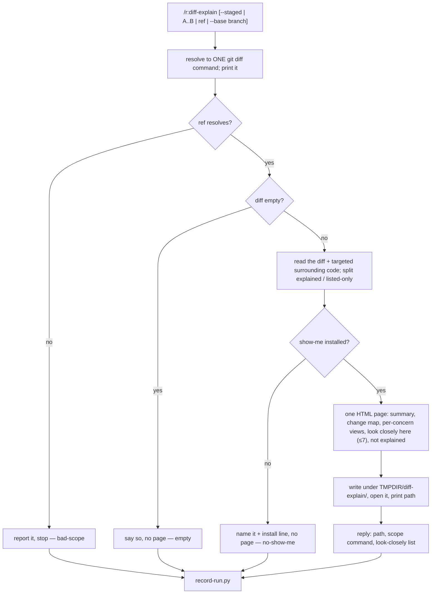

# `diff-explain` — behaviour register

`/r:diff-explain [scope]`: read one git diff and write one self-contained HTML page that draws the
shape of the change with the external `show-me` skill, plus a short list of lines a reviewer should
read carefully. Report-only; the page is written outside the repo.

Format, ID scheme and the meaning of the three trailing fields: [`README.md`](README.md).

## Flow

## Entries

- **SB-diff-explain-001** — The skill turns one git diff into one self-contained HTML page showing
  the shape of the change — summary, change map, per-concern `show-me` views beside their hunks, and
  a "look closely here" list. It is report-only: it never edits a file, never hunts bugs and never
  issues a verdict.
  *States it:* `skills/diff-explain/SKILL.md`
  *Enforced by:* —
  *Tested by:* —

- **SB-diff-explain-002** — The skill carries `disable-model-invocation: true`, so it runs only when
  typed. Its trigger and neighbour-exclusion eval cases would be untestable by design, so the gate
  requires `behaviour` cases instead.
  *States it:* `skills/diff-explain/SKILL.md`
  *Enforced by:* `tools/validate.py`
  *Tested by:* —

- **SB-diff-explain-003** — The scope resolves to exactly one `git diff` command — `HEAD` by default,
  `--cached` for `--staged`, a range as written, `<ref>^..<ref>` for one commit, the merge-base for
  `--base` — which is printed and is the only thing later steps read. A ref that does not resolve
  stops the run rather than being guessed.
  *States it:* `skills/diff-explain/SKILL.md`
  *Enforced by:* —
  *Tested by:* —

- **SB-diff-explain-004** — An empty diff stops the run with no page, and never falls back to another
  scope. Untracked files are named in the reply because `git diff HEAD` leaves them out.
  *States it:* `skills/diff-explain/SKILL.md`
  *Enforced by:* —
  *Tested by:* —

- **SB-diff-explain-005** — Every view is drawn by the `show-me` skill, loaded through the Skill tool.
  When it is absent the run stops, names it with its install line and writes no page — never a
  model-drawn substitute under this skill's name.
  *States it:* `skills/diff-explain/SKILL.md`
  *Enforced by:* —
  *Tested by:* —

- **SB-diff-explain-006** — Lockfiles, generated, vendored and binary files and pure renames are
  listed, not explained, and every one of them is named on the page; no touched file is dropped
  silently.
  *States it:* `skills/diff-explain/SKILL.md`
  *Enforced by:* —
  *Tested by:* —

- **SB-diff-explain-007** — The "look closely here" list holds at most seven `file:line` pointers,
  each worded as a reason to read carefully rather than a defect; an empty list is allowed and said
  plainly.
  *States it:* `skills/diff-explain/SKILL.md`
  *Enforced by:* —
  *Tested by:* —

- **SB-diff-explain-008** — All diff and source text is HTML-escaped before it enters the page, and
  the page is self-contained apart from Mermaid and highlight.js from cdnjs.
  *States it:* `skills/diff-explain/SKILL.md`
  *Enforced by:* —
  *Tested by:* —

- **SB-diff-explain-009** — The page is written under `${TMPDIR:-/tmp}/diff-explain/`, never inside
  the repo, then opened; `/r:page-serve` is mentioned for another device but never run.
  *States it:* `skills/diff-explain/SKILL.md`
  *Enforced by:* —
  *Tested by:* —

- **SB-diff-explain-010** — The reply carries the path, the scope command and the look-closely list
  as plain `file:line — reason` lines, and nothing else from the page.
  *States it:* `skills/diff-explain/SKILL.md`
  *Enforced by:* —
  *Tested by:* —

- **SB-diff-explain-011** — Every run records one `result` row with `outcome`
  (`written|empty|no-show-me|bad-scope`), `files`, `explained` and `flags`.
  *States it:* `skills/diff-explain/SKILL.md`
  *Enforced by:* `lib/record-run.py`
  *Tested by:* —
