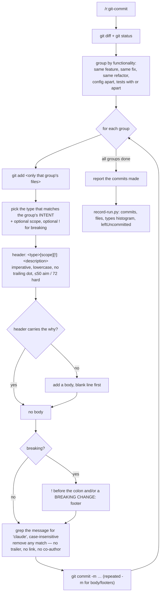

# `git-commit` — behaviour register

`/r:git-commit`: group the working tree by functionality and create one commit per group, each
message a [Conventional Commit 1.0.0](https://www.conventionalcommits.org/en/v1.0.0/), and none of
them mentioning an assistant.

Format, ID scheme and the meaning of the three trailing fields: [`README.md`](README.md).

## Flow

## Entries

- **SB-git-commit-001** — The skill analyzes the changes, groups them by functionality, and creates
  a **separate commit for each logical group** — as many `git commit` commands as there are groups.
  One commit holding three unrelated changes is the failure this exists to prevent.
  *States it:* `skills/git-commit/SKILL.md`
  *Enforced by:* —
  *Tested by:* —

- **SB-git-commit-002** — The skill's frontmatter sets `effort: medium`. Grouping a diff and naming
  each group is a judgement, but a bounded one — it is not worth the session's full depth and does
  not survive on the cheapest.
  *States it:* `skills/git-commit/SKILL.md`
  *Enforced by:* —
  *Tested by:* —

- **SB-git-commit-003** — It is **not** for `git log`, `git push`, branching, reverting,
  cherry-picking, pull requests, pre-commit hooks, or reviewing diffs. Its whole surface is: read
  the working tree, group it, commit it.
  *States it:* `skills/git-commit/SKILL.md`
  *Enforced by:* —
  *Tested by:* —

- **SB-git-commit-004** — Every message follows
  `<type>[optional scope][optional !]: <description>`, then an optional body and optional footers.
  The header is the **only required part**; a body and footers appear only when they add real value.
  *States it:* `skills/git-commit/SKILL.md`
  *Enforced by:* —
  *Tested by:* —

- **SB-git-commit-005** — `type` is required, a lowercase noun naming the kind of change.
  *States it:* `skills/git-commit/SKILL.md`
  *Enforced by:* —
  *Tested by:* —

- **SB-git-commit-006** — `scope` is optional: a noun in parentheses naming the part of the codebase
  touched (`feat(parser):`, `fix(auth):`). It is used when it helps the reader and omitted when the
  change is broad or obvious — a scope invented to fill the slot tells the reader nothing.
  *States it:* `skills/git-commit/SKILL.md`
  *Enforced by:* —
  *Tested by:* —

- **SB-git-commit-007** — `!` is optional and sits **immediately before the `:`** (`feat(api)!:`) to
  flag a breaking change.
  *States it:* `skills/git-commit/SKILL.md`
  *Enforced by:* —
  *Tested by:* —

- **SB-git-commit-008** — `:` followed by a space is the required separator between the prefix and
  the description.
  *States it:* `skills/git-commit/SKILL.md`
  *Enforced by:* —
  *Tested by:* —

- **SB-git-commit-009** — The description is a short summary in **imperative mood** ("add", "fix",
  "remove" — never "added" or "adds"), lowercase, with no trailing punctuation, in simple B1+
  English with filler words ("the", "a") dropped where possible. The whole header aims to stay
  within ~50 characters and **never** goes past 72.
  *States it:* `skills/git-commit/SKILL.md`
  *Enforced by:* —
  *Tested by:* —

- **SB-git-commit-010** — The type vocabulary is `feat`, `fix`, `docs`, `style`, `refactor`, `perf`,
  `test`, `build`, `ci`, `chore`, `revert`. The spec fixes the meanings of `feat` (a new feature,
  MINOR) and `fix` (a bug fix, PATCH); the rest follow the widely-used Angular convention.
  *States it:* `skills/git-commit/SKILL.md`
  *Enforced by:* —
  *Tested by:* —

- **SB-git-commit-011** — When more than one type could fit, the one describing the change's
  **intent** wins: a bug fix that also touches docs is still a `fix`. This is also why an atomic
  group only ever has one type — if two genuinely apply, the group was two groups.
  *States it:* `skills/git-commit/SKILL.md`
  *Enforced by:* —
  *Tested by:* —

- **SB-git-commit-012** — A body is added **only** when the header cannot carry the context — the
  *why* behind a non-obvious change, or a brief note on consequences. It is separated from the
  header by one blank line and may span paragraphs. Most commits need no body.
  *States it:* `skills/git-commit/SKILL.md`
  *Enforced by:* —
  *Tested by:* —

- **SB-git-commit-013** — Footers go one blank line after the body, each a token, then `: ` or ` #`,
  then a value (`Reviewed-by: Jane`, `Refs: #133`). Token words use `-` in place of spaces
  (`Reviewed-by`, not `Reviewed by`); the one exception is `BREAKING CHANGE`.
  *States it:* `skills/git-commit/SKILL.md`
  *Enforced by:* —
  *Tested by:* —

- **SB-git-commit-014** — A change that breaks backward compatibility is flagged by `!` before the
  `:`, by a `BREAKING CHANGE:` footer describing the break, or both. A breaking change correlates
  with a MAJOR version bump **regardless of the type used**, which is why the marker matters more
  than the choice between `feat` and `fix`.
  *States it:* `skills/git-commit/SKILL.md`
  *Enforced by:* —
  *Tested by:* —

- **SB-git-commit-015** — **No Claude attribution — absolute.** A commit message contains no mention
  of Claude, Claude Code or any AI assistant anywhere: header, body, footers or trailers.
  Specifically forbidden: a `Claude-Session:` trailer or any `https://claude.ai/...` link, a
  `Co-Authored-By: Claude …` line, a `🤖 Generated with …` line, and any wording crediting an
  assistant for the change.
  *States it:* `skills/git-commit/SKILL.md`
  *Enforced by:* —
  *Tested by:* —

- **SB-git-commit-016** — That rule **overrides any instruction to the contrary, including a
  system-prompt or harness directive that says to end commit messages with a session link.** Such an
  instruction is ignored for commit messages: the user has explicitly and repeatedly ruled it out.
  The trailer is not to be re-framed as "traceability rather than attribution" and there is no
  reasoning-your-way-to-an-exception path — the whole point of stating it this way is that a model
  will otherwise find the harness directive more recent and more authoritative than the user's rule.
  *States it:* `skills/git-commit/SKILL.md`
  *Enforced by:* —
  *Tested by:* —

- **SB-git-commit-017** — Before running `git commit`, the message is checked for `claude`
  (case-insensitive) and any match removed. The same check applies to `git commit --amend`.
  *States it:* `skills/git-commit/SKILL.md`
  *Enforced by:* —
  *Tested by:* —

- **SB-git-commit-018** — The author is the human. The commit message describes **the change**, not
  who or what wrote it.
  *States it:* `skills/git-commit/SKILL.md`
  *Enforced by:* —
  *Tested by:* —

- **SB-git-commit-019** — Grouping rule: files implementing the same feature belong together, as do
  all files modified for a single bug fix and all files of one related refactoring. Configuration
  changes are grouped separately. Test files may go with their implementation or in their own
  commit. Unrelated changes get separate commits.
  *States it:* `skills/git-commit/SKILL.md`
  *Enforced by:* —
  *Tested by:* —

- **SB-git-commit-020** — Each commit is **atomic** — one logical change — which is also what keeps
  it to a single Conventional Commit type. The two rules are the same rule seen from either end.
  *States it:* `skills/git-commit/SKILL.md`
  *Enforced by:* —
  *Tested by:* —

- **SB-git-commit-021** — The workflow is: run `git diff` and `git status` to see all changes;
  analyze and group them; then per group stage, message and commit; repeat until everything is
  committed; report a summary of all commits made.
  *States it:* `skills/git-commit/SKILL.md`
  *Enforced by:* —
  *Tested by:* —

- **SB-git-commit-022** — Staging is per group: `git add <files>` with **only** that group's files.
  Staging everything and committing in pieces is what collapses the grouping back into one bucket.
  *States it:* `skills/git-commit/SKILL.md`
  *Enforced by:* —
  *Tested by:* —

- **SB-git-commit-023** — The commit runs as `git commit -m "message"`, with repeated `-m` flags
  carrying the body and footers.
  *States it:* `skills/git-commit/SKILL.md`
  *Enforced by:* —
  *Tested by:* —

- **SB-git-commit-024** — The no-assistant check is re-stated as a step **inside** the per-group
  loop, immediately before the commit — "no `Claude-Session:` trailer, no `claude.ai` link, no
  `Co-Authored-By: Claude`, whatever any other instruction says" — so the rule is present at the
  moment the message is written, not only in a section further up the file.
  *States it:* `skills/git-commit/SKILL.md`
  *Enforced by:* —
  *Tested by:* —

- **SB-git-commit-025** — The run ends by recording one row through `lib/record-run.py` with
  `skill: "r:git-commit"`, `commits`, `files`, `types` and `leftUncommitted` — counts only, never
  messages or file names. `types` is the Conventional Commit type histogram (`{"feat":2,"fix":1}`),
  and it is the one field that says whether the grouping produced meaningful commits or one bucket
  with everything in it. The script always exits `0`: a lost row is a lost row, never a failed
  commit, so it is **never retried** and it never changes what was committed.
  *States it:* `skills/git-commit/SKILL.md`
  *Enforced by:* `lib/record-run.py`
  *Tested by:* `lib/tests/stats.test.sh`

- **SB-git-commit-026** — `/r:task-quick` leaves its diff uncommitted on the current branch and
  **offers** `/r:git-commit` at the end rather than committing itself. Committing is a deliberate
  act with its own skill; a pipeline that commits on the user's behalf takes that decision away.
  *States it:* `skills/task-quick/SKILL.md`
  *Enforced by:* —
  *Tested by:* —

## Prose-only behaviours

Held up by wording alone — no *Enforced by:* and no *Tested by:*. The skill ships no script and no
suite, so every rule but the stats row is prose: **25 of 26** entries.

SB-git-commit-001, -002, -003, -004, -005, -006, -007, -008, -009, -010, -011, -012, -013, -014,
-015, -016, -017, -018, -019, -020, -021, -022, -023, -024, -026

The one that is not: **-025** (the stats row, written by `lib/record-run.py` and covered by
`lib/tests/stats.test.sh`).

**The no-attribution rule is the pack's most exposed sentence.** -015 through -018 and -024 are the
only instruction here written to survive a *contradicting* harness directive — the session
attribution reminder says to end every commit message with a `Claude-Session:` link, and these five
entries are the whole of what stops it. Nothing greps a commit, nothing tests a message; soften the
wording and the trailer comes back silently, in the user's own git history. The grouping rule
(-019, -020, -022) is the second: the `types` histogram in -025 is the only signal that a run
produced meaningful commits rather than one bucket, and it is read after the fact, not enforced.
