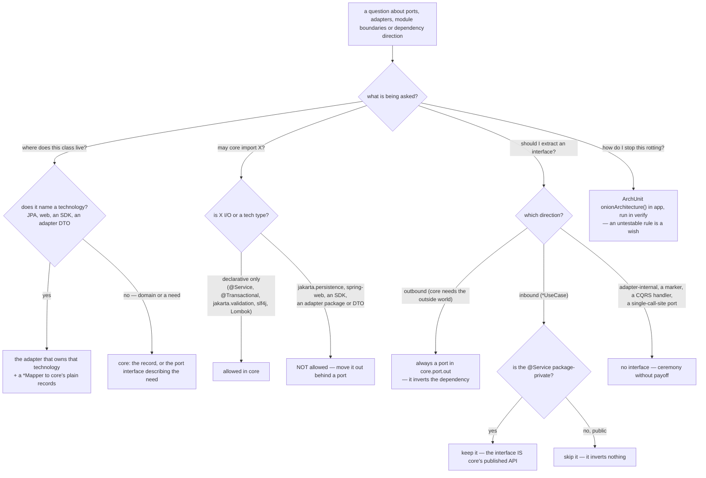

# `hexagonal-architecture` — behaviour register

`/r:hexagonal-architecture`: Hexagonal Lite — a module layout for multi-module Maven Spring Boot
projects, and the rulebook that answers *where does this class live*, *may core import X*, and
*should I extract an interface*. It is consulted inside someone else's task and changes no files of
its own.

Format, ID scheme and the meaning of the three trailing fields: [`README.md`](README.md).

## What it decides

## Entries

- **SB-hexagonal-architecture-001** — The skill is **consulted inside someone else's task** — it
  answers where a class goes and what a module may import — and therefore **writes no `result` row**
  through `lib/record-run.py`. That is correct rather than a gap to close: it has no boundary to
  report an outcome at, and whatever it influenced belongs to the run that loaded it. A fabricated
  outcome row would put a number in the store that no question can be asked of. The hook still counts
  its **invocations**, which is the honest measure available.
  *States it:* `CLAUDE.md`
  *Enforced by:* `hooks/record-skill-run.py`
  *Tested by:* `lib/tests/stats.test.sh`

- **SB-hexagonal-architecture-002** — It carries **no** `disable-model-invocation` flag: it is meant
  to be reached by inference, from any question about ports, adapters, module boundaries or
  dependency direction — "where should this class live?", "can core import X?", "should I extract a
  UseCase interface?" — so its description is in the router's listing budget and it owes the gate a
  `trigger` case and a `neighbour-exclusion` case. Restructuring code behind a behaviour-locking test
  is `code-refactor`'s job and must **not** route here.
  *States it:* `skills/hexagonal-architecture/SKILL.md`
  *Enforced by:* `skills/hexagonal-architecture/evals/evals.json`
  *Tested by:* `tools/validate.py`

- **SB-hexagonal-architecture-003** — The goal is **clean module boundaries you can enforce in CI —
  nothing more**. It layers on no DDD tactical patterns, no CQRS handler splits and no ceremonial
  interfaces: keep what pays for itself, leave the rest out. Every prohibition below carries the
  reason it exists, because a reader who cannot see the cost will reintroduce the ceremony.
  *States it:* `skills/hexagonal-architecture/SKILL.md`
  *Enforced by:* —
  *Tested by:* —

- **SB-hexagonal-architecture-004** — **Physical Maven modules are questioned before they are
  assumed.** The same boundaries are enforceable inside a *single* module with the same package
  layout, using ArchUnit's `onionArchitecture()` or Spring Modulith's
  `ApplicationModules.of(App.class).verify()`. Physical modules buy exactly two extra things: hard
  *compile-time* prevention and independent buildability. Until those are needed, package-by-feature
  plus a boundary test is lighter, and a stable boundary can be split into its own module later.
  *States it:* `skills/hexagonal-architecture/SKILL.md`
  *Enforced by:* —
  *Tested by:* —

- **SB-hexagonal-architecture-005** — The core idea: **one central module holds the domain and the
  interfaces for everything the domain needs from the outside world.** Every other module is an
  adapter that either drives the core (inbound) or implements one of those interfaces (outbound).
  Adapters never know about each other; the single Spring Boot application context wires them
  together at runtime.
  *States it:* `skills/hexagonal-architecture/SKILL.md`
  *Enforced by:* —
  *Tested by:* —

- **SB-hexagonal-architecture-006** — **Rule 1 — the star dependency graph.** Every adapter declares
  `core` in its `pom.xml`; no adapter declares another adapter; `core` declares no other project
  module.
  *States it:* `skills/hexagonal-architecture/SKILL.md`
  *Enforced by:* —
  *Tested by:* —

- **SB-hexagonal-architecture-007** — The same rule is a **boundary, not only a dependency
  direction**: `core` never imports a class from any adapter package, and no adapter imports a class
  from a sibling adapter package. Dragging an adapter's types into core — or one adapter's DTO into
  another — breaks the architecture **even if the pom still compiles**.
  *States it:* `skills/hexagonal-architecture/SKILL.md`
  *Enforced by:* —
  *Tested by:* —

- **SB-hexagonal-architecture-008** — **The moment a developer thinks "I'll just import that class
  from the other adapter" is the moment a port should be born.** That impulse is the signal the rule
  exists to catch, stated as a trigger rather than as a prohibition.
  *States it:* `skills/hexagonal-architecture/SKILL.md`
  *Enforced by:* —
  *Tested by:* —

- **SB-hexagonal-architecture-009** — **Rule 2 — cross-module calls go through ports**, in three
  steps: define a Java interface in `core.port.out` describing what the **core** needs, in domain
  terms; implement it in the adapter that owns the technology, annotated `@Component`, `@Service` or
  `@Repository`; inject the interface at the call site and let the `app` module's component scan wire
  the implementation.
  *States it:* `skills/hexagonal-architecture/SKILL.md`
  *Enforced by:* —
  *Tested by:* —

- **SB-hexagonal-architecture-010** — The split is explained by ownership: **the interface lives in
  `core` because `core` describes the need; the implementation lives in the adapter because it owns
  the technology.** The consumer of a port never knows which adapter, or which technology, fulfils
  it.
  *States it:* `skills/hexagonal-architecture/SKILL.md`
  *Enforced by:* —
  *Tested by:* —

- **SB-hexagonal-architecture-011** — **Rule 3 — enforce it in the build with ArchUnit.** Unenforced
  architecture rules rot within a quarter, so the test lives in the `app` module (which sees every
  class on the classpath) and fails Maven's `verify` phase if any boundary is broken. **If the rule
  isn't testable in the build, it isn't a rule — it's a wish.**
  *States it:* `skills/hexagonal-architecture/SKILL.md`
  *Enforced by:* —
  *Tested by:* —

- **SB-hexagonal-architecture-012** — **`onionArchitecture()` is preferred over hand-written
  per-adapter rules** — "onion" being ArchUnit's synonym for hexagonal / ports-and-adapters. One
  declarative block naming `domainModels`, `domainServices` and each `adapter` keeps the domain free
  of every adapter and bars adapters from depending on one another, replacing a pile of copies.
  *States it:* `skills/hexagonal-architecture/SKILL.md`
  *Enforced by:* —
  *Tested by:* —

- **SB-hexagonal-architecture-013** — An explicit `noClasses()` rule is used **only for a boundary the
  DSL cannot express** — for instance the framework-free check keeping `jakarta.persistence..` and
  `org.springframework.web..` out of `core`, which `onionArchitecture()` does not cover because it
  only knows the adapters it was told about.
  *States it:* `skills/hexagonal-architecture/SKILL.md`
  *Enforced by:* —
  *Tested by:* —

- **SB-hexagonal-architecture-014** — **Allowed in `core`:** the JDK; `org.slf4j.Logger`; Lombok
  annotations; `jakarta.validation` annotations, which are annotations and not I/O; `spring-context`
  (`@Service`, `@Component`, constructor injection, `ApplicationEventPublisher`); `spring-tx`'s
  `@Transactional` on a use-case `@Service`; and the project's own domain records and port
  interfaces.
  *States it:* `skills/hexagonal-architecture/SKILL.md`
  *Enforced by:* —
  *Tested by:* —

- **SB-hexagonal-architecture-015** — **NOT allowed in `core`:** `jakarta.persistence.*`;
  `org.springframework.web.*`, `HttpServletRequest`, `ResponseEntity`; third-party tech SDKs (Stripe,
  Telegram, OpenAI, Jedis, Kafka client, AWS SDK); any adapter package; and DTOs defined by adapters
  — request/response classes, JPA entities, SDK payloads. This is named as the most frequently
  violated part of the style, which is why the two lists are explicit rather than left to judgement.
  *States it:* `skills/hexagonal-architecture/SKILL.md`
  *Enforced by:* —
  *Tested by:* —

- **SB-hexagonal-architecture-016** — **How types cross the boundary:** adapters own their
  tech-specific types and each maps to and from `core`'s domain records in a `*Mapper` class **inside
  the adapter**. Core never sees a `FooEntity`, a `FooRequest` or a `FooSdkPayload`. A boundary, not
  a convention.
  *States it:* `skills/hexagonal-architecture/SKILL.md`
  *Enforced by:* —
  *Tested by:* —

- **SB-hexagonal-architecture-017** — The module layout is fixed: a root `pom.xml` with packaging
  `pom` listing `core`, the adapters and `app`; inside `core`, domain records grouped by feature,
  `port/in` for `*UseCase` interfaces, `port/out` for the outbound interfaces, and `service` for the
  `@Service` classes implementing the use cases.
  *States it:* `skills/hexagonal-architecture/SKILL.md`
  *Enforced by:* —
  *Tested by:* —

- **SB-hexagonal-architecture-018** — **`app` is the composition root**: it depends on every other
  module, carries `@SpringBootApplication`, is the **only** place `main()` lives, owns
  `application.yml` and framework-level beans, and hosts the ArchUnit and integration tests. Leaf
  modules carry no `@SpringBootApplication` and no `main()` — otherwise nothing would get wired into
  the context.
  *States it:* `skills/hexagonal-architecture/SKILL.md`
  *Enforced by:* —
  *Tested by:* —

- **SB-hexagonal-architecture-019** — Component scanning works across modules because
  `@SpringBootApplication` scans the package containing it: put `Application.java` in a parent
  package (`com.example`) and every adapter under it is picked up, with **no manual `@ComponentScan`**
  needed.
  *States it:* `skills/hexagonal-architecture/SKILL.md`
  *Enforced by:* —
  *Tested by:* —

- **SB-hexagonal-architecture-020** — **Inbound ports** are interfaces in `core.port.in` representing
  use cases the system supports, suffixed `*UseCase`, called by controllers, schedulers and CLIs, and
  implemented in `core.service` under `@Service`. A `*UseCase` is **not** a DDD application service,
  a CQRS command or query handler, or a mediator target — it is a Java interface describing what an
  inbound caller can invoke, and it stays that simple.
  *States it:* `skills/hexagonal-architecture/SKILL.md`
  *Enforced by:* —
  *Tested by:* —

- **SB-hexagonal-architecture-021** — **Outbound ports are non-negotiable**: the port lives in
  `core`, the adapter implements it, so the compile-time arrow points *inward* and `core` never sees
  the technology. That interface *inverts a dependency* and earns its place every time.
  *States it:* `skills/hexagonal-architecture/SKILL.md`
  *Enforced by:* —
  *Tested by:* —

- **SB-hexagonal-architecture-022** — **The inbound `*UseCase` interface is the one to question, and
  the answer is neither "always keep" nor "always delete".** A controller already depends inward on
  `core`, and both the interface and its implementation live in `core`, so the interface **inverts
  nothing**; its only payoffs are a named entry point and a mock seam. **The deciding factor is
  visibility:** keep it when the implementing `@Service` is package-private, because a package-private
  service cannot be referenced from the web adapter's package and the public `*UseCase` *is* core's
  published API, compiler-enforced; skip it when the service would be `public` anyway, where the
  interface buys nothing but indirection. Default to package-private service plus interface.
  *States it:* `skills/hexagonal-architecture/SKILL.md`
  *Enforced by:* —
  *Tested by:* —

- **SB-hexagonal-architecture-023** — **The use-case service is the transaction boundary**:
  `@Transactional` goes on the core `@Service`, never on the persistence adapter. One use case is one
  unit of work, and the core service is the only place that sees the whole use case — a transaction
  opened inside a single repository call in an adapter cannot wrap a use case that touches several
  ports. `@Transactional` in `core` is allowed because it is a declarative annotation, not I/O, the
  same category as `@Service` and `jakarta.validation`.
  *States it:* `skills/hexagonal-architecture/SKILL.md`
  *Enforced by:* —
  *Tested by:* —

- **SB-hexagonal-architecture-024** — **Ports are named in domain vocabulary, not tech vocabulary** —
  a reader of `core` should understand what a port is *for* without opening an adapter.
  `EmailSender.send(EmailMessage)` is a port; `EmailSender.sendSmtp(SmtpRequest)` is a leaky
  abstraction.
  *States it:* `skills/hexagonal-architecture/SKILL.md`
  *Enforced by:* —
  *Tested by:* —

- **SB-hexagonal-architecture-025** — **A port interface in `core` carries no Spring annotations** —
  no `@Component`, no `@Repository`. Annotations belong on the implementation in the adapter.
  *States it:* `skills/hexagonal-architecture/SKILL.md`
  *Enforced by:* —
  *Tested by:* —

- **SB-hexagonal-architecture-026** — Outbound ports are suffixed **by role**, and five pull their
  weight: `-Repository` (read+write persistence, CRUD-shaped), `-Provider` (read-side access, often
  non-CRUD), `-Sender` (delivery to an external channel), `-Notifier` (fire-and-forget side effect)
  and `-Service` (a capability the core delegates to infrastructure). Pick the one that says *what
  the port does for the core*, not what technology backs it.
  *States it:* `skills/hexagonal-architecture/SKILL.md`
  *Enforced by:* —
  *Tested by:* —

- **SB-hexagonal-architecture-027** — Adapter implementations are named **technology-prefixed** when
  several implementations exist or the technology matters at the call site (`TelegramMessageSender`,
  `JpaOrderRepository`), or with an **`*Impl` suffix** when there is one obvious default and naming it
  after the technology would be noise (`OrderProviderImpl`). Pick one and apply it uniformly.
  *States it:* `skills/hexagonal-architecture/SKILL.md`
  *Enforced by:* —
  *Tested by:* —

- **SB-hexagonal-architecture-028** — **The JPA adapter pattern**: `@Entity` classes stay inside the
  adapter, beside the Spring Data interface, the `@Repository` implementing core's port, and an
  `*EntityMapper`. `core` defines the port and the domain record; the adapter implements the port by
  delegating to Spring Data and mapping at the boundary. **The mapper is a concrete class, not an
  interface** — there is no seam to justify one.
  *States it:* `skills/hexagonal-architecture/SKILL.md`
  *Enforced by:* —
  *Tested by:* —

- **SB-hexagonal-architecture-029** — **The inbound web adapter** holds the controller, its request
  and response DTOs (adapter-local, never seen by core) and a concrete `*WebMapper`. The controller
  builds `ResponseEntity` and handles HTTP concerns; **none of that leaks into core**.
  *States it:* `skills/hexagonal-architecture/SKILL.md`
  *Enforced by:* —
  *Tested by:* —

- **SB-hexagonal-architecture-030** — **The registry pattern** covers one outbound port with many
  implementations chosen at runtime: a `@Component` in `core` takes a `List<SomePort>` in its
  constructor, Spring injects every implementation across all adapters, and each implementation
  declares its own key. One port, many adapters, routed at runtime — **no service locator, no
  framework magic**, just `List<T>` injection and a lookup map that throws when a key is unknown.
  *States it:* `skills/hexagonal-architecture/SKILL.md`
  *Enforced by:* —
  *Tested by:* —

- **SB-hexagonal-architecture-031** — **Three signals say to create a new port**, in order of
  urgency: an adapter wants to import another adapter; `core` is reaching for JPA, a third-party SDK,
  `@RestController`, `ResponseEntity` or similar; or a `@Service` in `core.service` has three or more
  framework-flavoured dependencies, which usually means it is doing infrastructure work that belongs
  behind a port.
  *States it:* `skills/hexagonal-architecture/SKILL.md`
  *Enforced by:* —
  *Tested by:* —

- **SB-hexagonal-architecture-032** — **When NOT to create an interface — the anti-bloat rules, each
  with its reason.** No DDD tactical markers (`AggregateRoot`, `ValueObject`, `DomainEvent`, base
  entity interfaces): a domain type is a Java `record`, and markers add ceremony without enabling
  anything the compiler or tests care about. No CQRS handler splits: command-vs-query belongs in
  method naming, not in a parallel type system with a mediator. No speculative or single-call-site
  ports: one implementation called from one place is pure indirection — wait for a real second caller
  or a real need to swap. No inbound `*UseCase` over a service you are not hiding. No
  adapter-internal interfaces: inside an adapter, call concrete classes directly, and add an
  interface only at a concrete mocking pain point that test data cannot solve. No ports for pure
  functions and value-like records. And `ApplicationEventPublisher` stays as-is for in-process
  events, since it is a standard mechanism and `@RecordApplicationEvents` tests it.
  *States it:* `skills/hexagonal-architecture/SKILL.md`
  *Enforced by:* —
  *Tested by:* —

- **SB-hexagonal-architecture-033** — **The test strategy falls out of the boundaries**, layer by
  layer: core services are plain unit tests with **fake or mock outbound ports**, so the use case
  runs with no database and no network; outbound adapters are integration-tested against the real
  technology (Testcontainers for JPA, a sandbox or WireMock for an HTTP SDK), because what is under
  test is the mapping and the query; inbound web adapters use `@WebMvcTest` with the `*UseCase` or
  service mocked, because what is under test is HTTP wiring, serialization and status codes; and the
  ArchUnit test lives in `app` and runs in `verify`.
  *States it:* `skills/hexagonal-architecture/SKILL.md`
  *Enforced by:* —
  *Tested by:* —

- **SB-hexagonal-architecture-034** — **Being able to fake the outbound port in a core unit test is
  the concrete payoff that justifies the port interface**, which is what makes the one-line test for
  "should this be a port?" usable: *will I fake it in a core unit test, or is there a genuine second
  implementation?* If neither, the interface is not added.
  *States it:* `skills/hexagonal-architecture/SKILL.md`
  *Enforced by:* —
  *Tested by:* —

- **SB-hexagonal-architecture-035** — **The anti-patterns list is part of the answer, not decoration:**
  a "common"/"shared-utils" module between adapters (a leaf-to-leaf dependency wearing a disguise); a
  port interface declared in an adapter; `@Entity` on a `core` class; `ResponseEntity`,
  `HttpServletRequest` or `@RestController` anywhere in `core`; a third-party SDK type on a `core`
  signature; `@Component`/`@Service` on a port interface; anemic ports mirroring the implementation
  1:1; DDD marker interfaces; CQRS handler hierarchies with a mediator; `@SpringBootApplication` in
  more than one module; and `ApplicationContextAware` or `@Lazy` used to break a cycle — almost
  always a signal that a port is misplaced, to be fixed in the design rather than worked around in the
  framework.
  *States it:* `skills/hexagonal-architecture/SKILL.md`
  *Enforced by:* —
  *Tested by:* —

## Prose-only behaviours

Held up by wording alone, which here is the whole rulebook bar two entries. The skill ships **no
script and no test suite** — by design, since it produces an answer rather than an artifact — so
every boundary rule, every naming convention and every anti-bloat prohibition survives only as long
as the prose keeps stating it. The two that are not prose-only are about the skill's place in the
pack, not about architecture: the absent `result` row and the routing flag.

33 of 35: SB-hexagonal-architecture-003 through SB-hexagonal-architecture-035 inclusive — every
entry except SB-hexagonal-architecture-001 and SB-hexagonal-architecture-002.

**33 of 35 entries are prose-only.**
