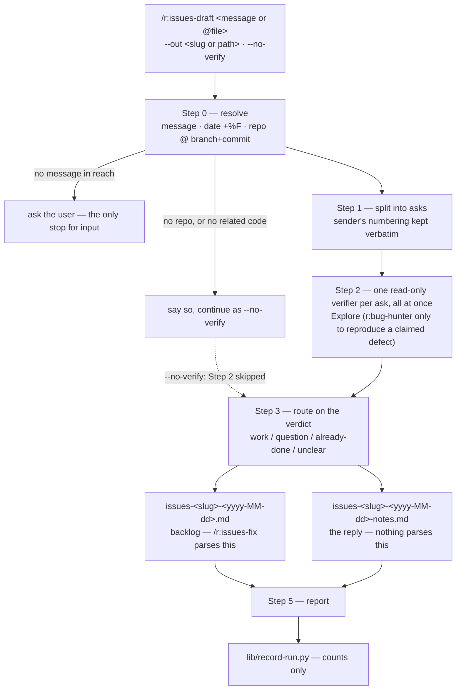

# `issues-draft` — behaviour register

What `/r:issues-draft` does, one entry per behaviour. Format contract: [README.md](README.md).

`issues-draft` turns one free-text message into two documents and nothing else. It owns no script
and no test suite, so almost every entry here is prose-only — the roll-up at the bottom is the
real exposure, not a formality.

## Flow

## Entries

- **SB-issues-draft-001** — The run produces exactly two files and changes nothing else: no
  branch, no commit, no fix, no edit to source. Handing the result to `/r:issues-fix` is the
  user's next command, not this run's last step.
  *States it:* `skills/issues-draft/SKILL.md`
  *Enforced by:* —
  *Tested by:* —

- **SB-issues-draft-002** — The two outputs are `issues-<slug>-<yyyy-MM-dd>.md` (the backlog) and
  `issues-<slug>-<yyyy-MM-dd>-notes.md` (the notes), sharing a slug and nothing else. The slug
  names the subject because that is what a reader searches for; the date only orders the folder,
  so `issues-carnet-2026-08-18.md`, never `issues-2026-08-18.md`.
  *States it:* `skills/issues-draft/SKILL.md`, `skills/issues-draft/references/output-format.md`
  *Enforced by:* —
  *Tested by:* —

- **SB-issues-draft-003** — There are two files because there are two readers: the backlog is
  machine input for `/r:issues-fix` and holds only real work in the shape that parser expects; the
  notes file is the reply to the sender. A question sitting in the backlog costs a read-only
  verifier on every future run and never becomes anything; nobody hands a client a checklist of
  internal risk ratings, and nobody implements from a discussion document.
  *States it:* `skills/issues-draft/SKILL.md`
  *Enforced by:* —
  *Tested by:* —

- **SB-issues-draft-004** — The date suffix comes from `date +%F` in Step 0, read from the shell
  and never from memory: a model's idea of today is its training cutoff, and a backlog filed under
  the wrong day sorts into the wrong place forever.
  *States it:* `skills/issues-draft/SKILL.md`, `skills/issues-draft/references/output-format.md`
  *Enforced by:* —
  *Tested by:* —

- **SB-issues-draft-005** — Invocation is
  `/r:issues-draft [<message | @file>] [--out <slug|path>] [--no-verify]`. The message is the
  pasted text, a file path (strip a leading `@` and any trailing `/`), or — the common case — the
  message already in the conversation. If no message is in reach the run asks for one; that is the
  only place it stops for input.
  *States it:* `skills/issues-draft/SKILL.md`
  *Enforced by:* —
  *Tested by:* —

- **SB-issues-draft-006** — `--out` takes either shape: a bare slug becomes the two dated
  filenames, while a path is used as given, undated, with `-notes` inserted before the extension
  for the second file — a name the user typed in full is the name they want.
  *States it:* `skills/issues-draft/SKILL.md`
  *Enforced by:* —
  *Tested by:* —

- **SB-issues-draft-007** — With no `--out`, the slug comes from the project or the message's
  subject, and every pair without an explicit path is written into `./issues/` at the repo root,
  created if it is missing: one fixed folder keeps every backlog in one place instead of scattering
  dated files across the root.
  *States it:* `skills/issues-draft/SKILL.md`
  *Enforced by:* —
  *Tested by:* —

- **SB-issues-draft-008** — `--no-verify` splits and classifies without reading any code, for a
  message that arrives before the repo does. The backlog is still written, every item is marked
  `unverified` in the notes, the report says so in its FIRST line, and the stats row carries
  `verified: false` — because an unverified backlog looks exactly like a verified one on disk.
  *States it:* `skills/issues-draft/SKILL.md`
  *Enforced by:* —
  *Tested by:* —

- **SB-issues-draft-009** — Step 0 records how many discrete asks the message announces (a numbered
  list announces its own count). That is a check on Step 1, not an instruction for it.
  *States it:* `skills/issues-draft/SKILL.md`
  *Enforced by:* —
  *Tested by:* —

- **SB-issues-draft-010** — Step 0 notes the branch and the short commit of the codebase being
  verified against and puts both in the backlog file's header: verification is a statement about
  one revision, and a month later that header is the only thing that says which.
  *States it:* `skills/issues-draft/SKILL.md`
  *Enforced by:* —
  *Tested by:* —

- **SB-issues-draft-011** — No repo, or no code that relates to the message, is declared and the
  run continues as `--no-verify`. Verification is never quietly skipped and the result never
  presented as if the code had been read — the whole value of the notes file is that somebody
  looked.
  *States it:* `skills/issues-draft/SKILL.md`
  *Enforced by:* —
  *Tested by:* —

- **SB-issues-draft-012** — Step 1 walks the message in order, one ask per item, keeping the
  sender's numbering even where it is wrong — duplicated, skipped, restarting at 1. The number is a
  pointer back to their text, not an index this skill owns, so their item 6 stays findable as
  `[#6]` in both files. A reply they cannot line up against their own message forces them to
  re-read the original, the most common way this exercise wastes their time.
  *States it:* `skills/issues-draft/SKILL.md`
  *Enforced by:* —
  *Tested by:* —

- **SB-issues-draft-013** — Splitting, not verification, is where meaning gets lost. A numbered
  message maps one-to-one. In prose, an ask plus its justification is ONE item (the second clause
  is the *why* and belongs in the body); one paragraph making two unrelated demands is TWO items,
  both carrying the same source number as `[#5a]` / `[#5b]`. Both mistakes — merging two asks to
  tidy the list, promoting a rationale into an item — produce a file that looks right and is wrong.
  *States it:* `skills/issues-draft/SKILL.md`
  *Enforced by:* —
  *Tested by:* —

- **SB-issues-draft-014** — Meta-instructions are never backlog items. "Let me know if any of this
  affects the estimate", "thanks in advance", "as we discussed" shape the *reply*, and several state
  a real requirement for the notes file; they are recorded as instructions to the run itself.
  *States it:* `skills/issues-draft/SKILL.md`
  *Enforced by:* —
  *Tested by:* —

- **SB-issues-draft-015** — A title is the sender's own wording, verbatim, in their own language —
  never translated, never tidied, never made imperative. That string is what lets them find the ask
  in their own sent mail. The acceptance criteria beneath are this skill's, in English, because the
  implementer and `/r:task-run` read them.
  *States it:* `skills/issues-draft/SKILL.md`, `skills/issues-draft/references/output-format.md`
  *Enforced by:* —
  *Tested by:* —

- **SB-issues-draft-016** — If the item count at the end of Step 1 differs from the count the
  message announced, the report says so and names which items were merged or split. It is never
  quietly reconciled.
  *States it:* `skills/issues-draft/SKILL.md`
  *Enforced by:* —
  *Tested by:* —

- **SB-issues-draft-017** — Every ask traces to text the sender wrote: never invent an ask, never
  drop one.
  *States it:* `skills/issues-draft/SKILL.md`
  *Enforced by:* —
  *Tested by:* —

- **SB-issues-draft-018** — Step 2 spawns, via the Agent tool, **one read-only verifier per ask,
  all at once**. Nothing here writes, so nothing has to be serial.
  *States it:* `skills/issues-draft/SKILL.md`
  *Enforced by:* —
  *Tested by:* —

- **SB-issues-draft-019** — The verifier is `Explore` for pure code-reading, which is nearly every
  case; `r:bug-hunter` is used only when an ask claims a defect that has to be reproduced to be
  believed.
  *States it:* `skills/issues-draft/SKILL.md`
  *Enforced by:* —
  *Tested by:* —

- **SB-issues-draft-020** — Each verifier is briefed with the ask's number, its verbatim text and
  the surrounding message context, and answers four questions from the code: does this already
  exist *now*, and where; does the sender's description of current behaviour match the code, with a
  `file:line`; what two to four testable English criteria would make it done; what does it touch
  and how deep does it cut.
  *States it:* `skills/issues-draft/SKILL.md`
  *Enforced by:* —
  *Tested by:* —

- **SB-issues-draft-021** — Verification answers the *sender's* question, not the implementer's.
  Three outcomes matter to them: not built, already built, or **built differently from what they
  assume**. The third is why the code gets read at all — "verification is still shown separately"
  states a fact about the system, and it can be out of date.
  *States it:* `skills/issues-draft/SKILL.md`
  *Enforced by:* —
  *Tested by:* —

- **SB-issues-draft-022** — Each verifier returns a compact structured verdict rather than a
  transcript, so the run's context stays a ledger: `n`, `title`, `outcome`
  (`work` | `question` | `already-done` | `unclear`), `category` (`bug` | `feature` | `chore`, when
  `outcome` is `work`), `current_state` with a `file:line`, `contradicts_sender`, `criteria`,
  `touches`, `risk` (`cosmetic` | `local` | `deep`), `impact`
  (`none` | `architecture` | `estimate` | `both`) and a short `note`.
  *States it:* `skills/issues-draft/SKILL.md`
  *Enforced by:* —
  *Tested by:* —

- **SB-issues-draft-023** — `contradicts_sender` is orthogonal to `outcome`: an ask can be good
  work *and* rest on a wrong premise, and folding the two together loses whichever was not encoded.
  *States it:* `skills/issues-draft/SKILL.md`
  *Enforced by:* —
  *Tested by:* —

- **SB-issues-draft-024** — `impact` is orthogonal to `category` and is judged from `touches` and
  `risk`, never from how big the ask sounds: a small feature can move architecture and a large one
  need not.
  *States it:* `skills/issues-draft/SKILL.md`
  *Enforced by:* —
  *Tested by:* —

- **SB-issues-draft-025** — `question` and `unclear` are different and need opposite responses: a
  `question` is an ask that is asking rather than requesting, and answering it from the code is one
  of the most valuable things this skill does; an `unclear` is a real request nobody could
  implement from what it says, and needs the sender to say more.
  *States it:* `skills/issues-draft/SKILL.md`
  *Enforced by:* —
  *Tested by:* —

- **SB-issues-draft-026** — Verifiers are strictly read-only: they never edit, never touch git, and
  never write either output file.
  *States it:* `skills/issues-draft/SKILL.md`
  *Enforced by:* —
  *Tested by:* —

- **SB-issues-draft-027** — Step 3 routing is mechanical once Step 2 is done and a verdict is never
  re-litigated there: `work` with the premise holding goes to the backlog, and to the notes only if
  `impact` is not `none`; `work` with `contradicts_sender` goes to both; `already-done`, `question`
  and `unclear` go to the notes only.
  *States it:* `skills/issues-draft/SKILL.md`
  *Enforced by:* —
  *Tested by:* —

- **SB-issues-draft-028** — An `already-done` ask whose *current* behaviour still is not what the
  sender wants is `work`, not `already-done`: "built" and "built the way they asked" are different
  claims, and only the second closes an ask.
  *States it:* `skills/issues-draft/SKILL.md`
  *Enforced by:* —
  *Tested by:* —

- **SB-issues-draft-029** — Both files are written every run, even when one holds a single entry: a
  missing notes file reads as "nothing to flag", a claim that is usually false.
  *States it:* `skills/issues-draft/SKILL.md`
  *Enforced by:* —
  *Tested by:* —

- **SB-issues-draft-030** — The backlog item carries the title and its acceptance criteria and
  nothing else — no `touches`, no `risk`, no priority, no estimate. `/r:issues-fix` re-derives scope
  and risk against the code as it stands when the fix happens, and a hint that has aged into a lie
  is worse than none.
  *States it:* `skills/issues-draft/SKILL.md`, `skills/issues-draft/references/output-format.md`
  *Enforced by:* —
  *Tested by:* —

- **SB-issues-draft-031** — The backlog's shape is the input contract of `/r:issues-fix`'s file
  adapter, which takes every unticked checklist line as one item and every line indented beneath it
  as that item's body: one `- [ ]` line per item starting with `[#n]` then the verbatim title,
  criteria indented beneath in English, a blank line between items so a long criteria block cannot
  be misread as the next item's body. Improvise and items silently merge or vanish.
  *States it:* `skills/issues-draft/references/output-format.md`, `skills/issues-fix/references/issue-sources.md`
  *Enforced by:* —
  *Tested by:* —

- **SB-issues-draft-032** — The backlog is one flat list with **no section headings**: a `##`
  heading followed by prose is itself one item to the parser, so a helpful "## UI" divider becomes a
  phantom backlog entry. The header paragraph above the first `- [ ]` is fine — nothing before the
  first item is parsed.
  *States it:* `skills/issues-draft/references/output-format.md`
  *Enforced by:* —
  *Tested by:* —

- **SB-issues-draft-033** — This skill never writes `- [x]`. It produces work to be done; ticks
  belong to `/r:issues-fix`, which writes them after a fix is reviewed and merged, and an item that
  arrives pre-ticked is never done.
  *States it:* `skills/issues-draft/references/output-format.md`
  *Enforced by:* —
  *Tested by:* —

- **SB-issues-draft-034** — Before writing, the run looks for an existing pair under this slug on
  **any** date (`issues/issues-<slug>-*.md`). A follow-up message about the same subject merges into the
  pair it finds, name and date unchanged: the suffix records the day the backlog was opened, and a
  second file would split the backlog `/r:issues-fix` reads in half.
  *States it:* `skills/issues-draft/SKILL.md`, `skills/issues-draft/references/output-format.md`
  *Enforced by:* —
  *Tested by:* —

- **SB-issues-draft-035** — On a merge, existing items — ticked or not — are left byte-identical,
  and new asks are appended at the end under the **new message's** numbering, prefixed so the two
  cannot collide (`[#2/2]` is ask 2 of the second message). Renumbering to keep one sequence breaks
  every reference in the notes file and in the sender's own mail.
  *States it:* `skills/issues-draft/references/output-format.md`
  *Enforced by:* —
  *Tested by:* —

- **SB-issues-draft-036** — A merge adds a header line naming the new message and its date, and
  states which items were checked against the new revision — only the newly appended ones were, and
  a single "verified against `<sha>`" line otherwise claims the old items were re-checked when they
  were not.
  *States it:* `skills/issues-draft/references/output-format.md`
  *Enforced by:* —
  *Tested by:* —

- **SB-issues-draft-037** — An existing output file is somebody's work: never overwritten silently,
  never un-ticked, never reordered or reflowed by a run that did not write it. The alternative to
  merging is writing beside it under a new slug, said out loud.
  *States it:* `skills/issues-draft/SKILL.md`
  *Enforced by:* —
  *Tested by:* —

- **SB-issues-draft-038** — The notes file has three sections — Questions, Already built (or built
  differently than the message assumes), and Moves architecture or the estimate — and any one of
  them that is empty **must say so**, because an absent section reads as "nothing to report", which
  is a claim.
  *States it:* `skills/issues-draft/references/output-format.md`
  *Enforced by:* —
  *Tested by:* —

- **SB-issues-draft-039** — Questions are answered from the code, not forwarded: what the code
  does, where, and what it does *not* do. A question relayed back unanswered is the one outcome the
  sender could have reached without asking.
  *States it:* `skills/issues-draft/references/output-format.md`
  *Enforced by:* —
  *Tested by:* —

- **SB-issues-draft-040** — When the sender's premise is wrong, the notes quote the code with a
  `file:line`, not a conclusion. A `file:line` is checkable; "that has already been done" is an
  assertion taken on faith, useless if it turns out to be about a different screen.
  *States it:* `skills/issues-draft/references/output-format.md`
  *Enforced by:* —
  *Tested by:* —

- **SB-issues-draft-041** — The architecture section lists asks that ARE in the backlog — it is the
  "flag anything that affects architecture or the estimate" request answered, not a second reject
  pile, and it says plainly that the item is still going to be built.
  *States it:* `skills/issues-draft/references/output-format.md`
  *Enforced by:* —
  *Tested by:* —

- **SB-issues-draft-042** — The notes file carries no risk ratings, no story points and no internal
  vocabulary: it goes to whoever wrote the message. `touches` and `risk` did their job deciding what
  belongs in that section; they are not for publication.
  *States it:* `skills/issues-draft/references/output-format.md`
  *Enforced by:* —
  *Tested by:* —

- **SB-issues-draft-043** — The report names the three things a reader cannot recover from the
  files: any ask that was split or merged with its source number, any ask that could not be verified
  and why, and whether the codebase was read at all — which a `--no-verify` run says first, not
  last.
  *States it:* `skills/issues-draft/SKILL.md`
  *Enforced by:* —
  *Tested by:* —

- **SB-issues-draft-044** — After the report, one row goes into the pack-wide store, counts only and
  never ask text: `{"skill":"r:issues-draft","asks","work","alreadyDone","questions","unclear",
  "contradicted","architecture","verified"}`. The pair worth measuring is `asks` against `work` —
  how much of an incoming message is buildable, the number that decides whether reading the code up
  front pays for itself — and `contradicted` is the only measure of what this skill catches that a
  straight transcription would not.
  *States it:* `skills/issues-draft/SKILL.md`
  *Enforced by:* —
  *Tested by:* —

- **SB-issues-draft-045** — The stats write can never fail the run: the script always exits `0`, a
  lost row is a lost row rather than a failed run, and it is never retried.
  *States it:* `skills/issues-draft/SKILL.md`
  *Enforced by:* `lib/record-run.py`
  *Tested by:* `lib/tests/stats.test.sh`

- **SB-issues-draft-046** — The skill runs at `effort: high` and carries no
  `disable-model-invocation`, so its description stays in the router's listing budget and a pasted
  message full of asks can route to it without the slash command.
  *States it:* `skills/issues-draft/SKILL.md`
  *Enforced by:* `tools/validate.py`
  *Tested by:* —

## Prose-only behaviours

Held up by wording alone — nothing fails if they quietly stop being true. This skill owns no script
and no test suite, so that is 44 of 46 entries:

SB-issues-draft-001, -002, -003, -004, -005, -006, -007, -008, -009, -010, -011, -012, -013, -014,
-015, -016, -017, -018, -019, -020, -021, -022, -023, -024, -025, -026, -027, -028, -029, -030,
-031, -032, -033, -034, -035, -036, -037, -038, -039, -040, -041, -042, -043, -044.
