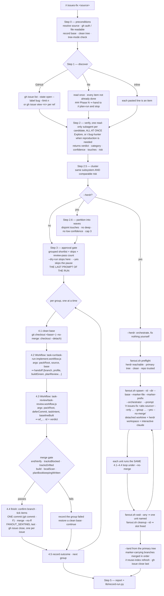

# `issues-fix` — behaviour register

What `/r:issues-fix` does, one atomic claim per entry. Format and ID rules: [README.md](README.md).

The skill is the **orchestrator of a backlog**: discover what is open, verify each item against the
code, group the items one change fixes together, gate the shortlist, then fix each approved group as
two `Workflow` calls and a finish — merge, mark done, record. It writes no code itself.

## The loop

## Entries

### Shape and scope

- **SB-issues-fix-001** — The skill carries `disable-model-invocation: true`, so no prompt can route
  to it and it runs only when the user types `/r:issues-fix`. It mutates the repo, closes issues and
  ticks a document on a scale nobody wants arrived at by inference. Consequences: its description is
  out of the router's listing budget, and its eval suite owes `behaviour` cases because `trigger`
  and `neighbour-exclusion` cases are untestable by design.
  *States it:* `skills/issues-fix/SKILL.md`
  *Enforced by:* `tools/validate.py`
  *Tested by:* —
- **SB-issues-fix-002** — The skill orchestrates; it never writes the fix. All code changes happen
  inside the two Workflows, and verification is read-only. Its job is the loop and the gate.
  *States it:* `skills/issues-fix/SKILL.md`
  *Enforced by:* —
  *Tested by:* —
- **SB-issues-fix-003** — The source is an **adapter, not the pipeline**: only four things differ
  between a tracker, a file and an inline list — how items are discovered, how they are fetched,
  what identifies one, and how one is marked done. Verification, clustering, the gate, both
  Workflows and the merge read an item's text, its `touches` and its `risk`, none of which know where
  it came from. New source handling stays inside those four seams.
  *States it:* `skills/issues-fix/references/issue-sources.md`
  *Enforced by:* —
  *Tested by:* —
- **SB-issues-fix-004** — Verification is read-only and therefore **parallelised**; fixing is serial
  in one working tree. The split is the whole design: no branch and no writes means every candidate
  can be vetted at once, while two fixes in one tree collide on the base ref.
  *States it:* `skills/issues-fix/SKILL.md`
  *Enforced by:* —
  *Tested by:* —
- **SB-issues-fix-005** — The unit of a fix is a **group**, not an item. Grouping buys cost and
  coherence — one plan/implement/review pass instead of two, one review that sees the whole change —
  and **no safety**: one tree per branch already guarantees two branches cannot race.
  *States it:* `skills/issues-fix/SKILL.md`
  *Enforced by:* —
  *Tested by:* —

### Invocation and flags

- **SB-issues-fix-006** — `<source>` is detected in a fixed order: an existing file path → the file
  source; issue numbers or URLs → the GitHub source with discovery skipped; no argument → GitHub
  discovery when a GitHub remote exists and `gh` is authenticated, otherwise the first root list file
  of `issues.md`, `bugs.md`, `todo.md`, `backlog.md`, and failing that the one backlog in
  `./issues/` — a `*.md` that is not a `*-notes.md` and still holds an unticked item, with several
  such files being a question for the user; multi-line text that reads as a list → the inline
  source.
  *States it:* `skills/issues-fix/references/issue-sources.md`
  *Enforced by:* —
  *Tested by:* —
- **SB-issues-fix-007** — A leading `@` and a trailing `/` are stripped from path arguments, because
  Claude Code delivers `@backlog.md` verbatim.
  *States it:* `skills/issues-fix/SKILL.md`
  *Enforced by:* —
  *Tested by:* —
- **SB-issues-fix-008** — A discovered list file is **named to the user before it is used**. Silently
  picking one of four files is how a run edits a document nobody meant to hand it.
  *States it:* `skills/issues-fix/references/issue-sources.md`
  *Enforced by:* —
  *Tested by:* —
- **SB-issues-fix-009** — Neither a file nor a usable tracker, or two candidates with nothing to
  choose between them: **ask**. This is the one place the run stops for input; after the gate it
  never asks again.
  *States it:* `skills/issues-fix/references/issue-sources.md`
  *Enforced by:* —
  *Tested by:* —
- **SB-issues-fix-010** — A file carrying `### Phase N` headings is a **phased plan, not a backlog**:
  say so, name `/r:plan-run <path>`, and stop. Checked before any file source is accepted, on an
  explicit argument and on discovery alike — `todo.md` is in the discovery list, so a repo holding a
  plan and no other list file lands here by default. Nothing errors if the check is skipped, which is
  why it exists: the file adapter reads a plan's `- [ ]` lines perfectly well and loses the phase
  boundary, the dependency order, and the `Files:`/`Risk:`/`Done when:` lines Step 2 then pays a
  verifier per item to re-derive. A flat checklist named `todo.md` with no `### Phase` headings is a
  perfectly good backlog — the structure decides, not the filename.
  *States it:* `skills/issues-fix/references/issue-sources.md`
  *Enforced by:* —
  *Tested by:* —
- **SB-issues-fix-011** — `--only <refs>` short-circuits discovery for **every** source: exactly
  those items, nothing else. It is how a `--herdr` unit is handed one group rather than
  re-discovering and re-verifying the whole backlog.
  *States it:* `skills/issues-fix/SKILL.md`
  *Enforced by:* —
  *Tested by:* —
- **SB-issues-fix-012** — An `--only` ref that resolves to nothing is a **hard stop**, never a
  quietly smaller run: a unit handed a group it cannot find must not report having fixed some of it.
  *States it:* `skills/issues-fix/SKILL.md`
  *Enforced by:* —
  *Tested by:* —
- **SB-issues-fix-013** — `--label <x>` overrides the `bug` label used for GitHub discovery, and is
  ignored by the other sources, which have no labels.
  *States it:* `skills/issues-fix/SKILL.md`
  *Enforced by:* —
  *Tested by:* —
- **SB-issues-fix-014** — `--limit <n>` caps how many candidates discovery pulls in; the default is
  **20**.
  *States it:* `skills/issues-fix/SKILL.md`
  *Enforced by:* —
  *Tested by:* —
- **SB-issues-fix-015** — `--group <refs>` forces a manual cluster and is repeatable; those items are
  fixed together whatever the auto-clustering would have decided, and everything else still clusters
  normally.
  *States it:* `skills/issues-fix/SKILL.md`
  *Enforced by:* —
  *Tested by:* —
- **SB-issues-fix-016** — `--no-group` disables clustering entirely: every item becomes its own fix,
  with a separate branch and commit per item.
  *States it:* `skills/issues-fix/SKILL.md`
  *Enforced by:* —
  *Tested by:* —
- **SB-issues-fix-017** — `--bugs-only` narrows acceptance to still-reproducing defects; without it
  verification takes any real, actionable, not-yet-done item, which is what a hand-written list
  needs.
  *States it:* `skills/issues-fix/SKILL.md`
  *Enforced by:* —
  *Tested by:* —
- **SB-issues-fix-018** — `--herdr` gives every group a detached worktree, a herdr workspace and a
  full interactive `claude` session, landed from the primary tree. **Without it nothing about the
  skill changes** — the loop is the serial one and no worktree is created.
  *States it:* `skills/issues-fix/SKILL.md`
  *Enforced by:* `skills/plan-run/scripts/fanout.sh`
  *Tested by:* `skills/plan-run/tests/fanout.test.sh`
- **SB-issues-fix-019** — `--herdr` combined with `--no-merge` or `--land` is a contradiction, since
  those two *are* the halves it drives: refuse and name which one clashed.
  *States it:* `skills/issues-fix/SKILL.md`
  *Enforced by:* —
  *Tested by:* —
- **SB-issues-fix-020** — `--no-merge` runs the whole loop — implement, review, merge gate, tick,
  commit — on the group branch and then stops, leaving it unmerged. It is what a concurrent unit
  runs, and it changes nothing before the merge.
  *States it:* `skills/issues-fix/SKILL.md`
  *Enforced by:* —
  *Tested by:* —
- **SB-issues-fix-021** — A group that fails the merge gate leaves its branch **without** the
  `<!-- fixed: … -->` marker, which is exactly how `--land` knows not to merge it.
  *States it:* `skills/issues-fix/SKILL.md`
  *Enforced by:* `skills/plan-run/scripts/fanout.sh`
  *Tested by:* `skills/plan-run/tests/fanout.test.sh`
- **SB-issues-fix-022** — `--land` merges the marker-carrying branches finished by concurrent units
  into the base, in order, then closes what they fixed. It runs only from the primary working tree
  and fixes nothing of its own.
  *States it:* `skills/issues-fix/SKILL.md`
  *Enforced by:* —
  *Tested by:* —
- **SB-issues-fix-023** — `--ask <session>` names a pack maintainer session watching the *tooling*.
  It changes nothing about the run: a report is never a halt and never a question.
  *States it:* `skills/issues-fix/SKILL.md`
  *Enforced by:* —
  *Tested by:* —
- **SB-issues-fix-024** — `--yes` skips the approval gate and fixes every group containing real work;
  `--dry-run` runs discovery, verification, clustering and triage, prints the plan including the
  groups, and **stops** — never touching git, the tracker or the list file.
  *States it:* `skills/issues-fix/SKILL.md`
  *Enforced by:* —
  *Tested by:* —
- **SB-issues-fix-025** — For a backlog nobody wants to babysit the recommended shape is **two
  passes**: `--dry-run` first, then `--yes`. The longest stretch of wasted wall-clock on a real
  backlog is the approval gate sitting untouched while the user is away; verification is cheap and
  read-only, so paying for it twice costs little, and a `--yes` run whose groups the user has already
  read is a different thing from one nobody looked at.
  *States it:* `skills/issues-fix/SKILL.md`
  *Enforced by:* —
  *Tested by:* —

### Step 0 — preconditions

- **SB-issues-fix-026** — The source is resolved **first**, because it decides which tools the run
  needs.
  *States it:* `skills/issues-fix/SKILL.md`
  *Enforced by:* —
  *Tested by:* —
- **SB-issues-fix-027** — The source's own tool must work: `command -v gh >/dev/null && gh auth
  status` for a GitHub backlog, an existing readable file for a file backlog. A missing tool is a
  **stop**, never a quieter substitute — never scrape the web UI.
  *States it:* `skills/issues-fix/SKILL.md`
  *Enforced by:* —
  *Tested by:* —
- **SB-issues-fix-028** — `gh` is a hard gate for the whole loop whenever any item is a GitHub issue,
  because `/r:task-run` resolves those refs through `gh` too — and a file or inline backlog is never
  gated on a tool it never calls.
  *States it:* `skills/issues-fix/SKILL.md`
  *Enforced by:* —
  *Tested by:* —
- **SB-issues-fix-029** — The current repo **is** the tracker: `gh` resolves issues against the
  current repo's remote and there is no repo override. A file source has no such tie — the list may
  live anywhere and only the fixes land in this repo.
  *States it:* `skills/issues-fix/SKILL.md`
  *Enforced by:* —
  *Tested by:* —
- **SB-issues-fix-030** — The base branch is recorded up front; every fix branches off it and merges
  back into it, always from that same clean base.
  *States it:* `skills/issues-fix/SKILL.md`
  *Enforced by:* —
  *Tested by:* —
- **SB-issues-fix-031** — A clean working tree (`git status --porcelain` empty) is required before
  anything starts, the tracked list file included. `/r:task-run` leaves work uncommitted until a
  single final commit, so pre-existing changes would be swept into a fix's commit and into its
  reviewed diff. Dirty: stop and ask the user to stash or commit.
  *States it:* `skills/issues-fix/SKILL.md`
  *Enforced by:* —
  *Tested by:* —
- **SB-issues-fix-032** — Which tree the run is in is checked whenever a mode depends on it —
  `[ "$(git rev-parse --git-dir)" != "$(git rev-parse --git-common-dir)" ]` is true in a linked
  worktree. `--no-merge` requires one; `--herdr` and `--land` require the primary tree. Each wrong
  way is a **refusal, not a warning**, because both failures are quiet: `--no-merge` in the primary
  tree strands the user's own checkout on a group branch with a finished commit and no merge, and
  `--land` from a worktree cannot check out base at all.
  *States it:* `skills/issues-fix/SKILL.md`
  *Enforced by:* `skills/plan-run/scripts/fanout.sh`
  *Tested by:* `skills/plan-run/tests/fanout.test.sh`

### Step 1 — discovery

- **SB-issues-fix-033** — GitHub discovery is `gh issue list --state open --label <label> --limit <n>
  --json number,title,url,labels,body,comments`; explicit refs skip the list and use `gh issue view
  <n> --json number,title,url,labels,body,comments` per ref.
  *States it:* `skills/issues-fix/references/issue-sources.md`
  *Enforced by:* —
  *Tested by:* —
- **SB-issues-fix-034** — A file source is read **once**, and every item not already marked done is a
  candidate. An item is a checklist or bullet line (`- [ ]`, `* [ ]`, `- `, `1. `) with its indented
  lines as its body, or a `##`/`###` heading followed by prose; a file may mix both shapes and is
  read as it is rather than forced into one.
  *States it:* `skills/issues-fix/references/issue-sources.md`
  *Enforced by:* —
  *Tested by:* —
- **SB-issues-fix-035** — Already done, and therefore never a candidate: a ticked box (`- [x]`,
  `- [X]`), `~~struck-through~~` text, a line carrying this skill's own resolution marker, or
  anything under a `Done`/`Completed`/`Fixed`/`Shipped`/`Archive` heading.
  *States it:* `skills/issues-fix/references/issue-sources.md`
  *Enforced by:* —
  *Tested by:* —
- **SB-issues-fix-036** — An ambiguous line is treated as **open** and left for verification to
  decide. The asymmetry is the reason: a spare verifier is cheap and read-only, while a silently
  skipped item never gets fixed.
  *States it:* `skills/issues-fix/references/issue-sources.md`
  *Enforced by:* —
  *Tested by:* —
- **SB-issues-fix-037** — Every candidate is normalised to one record, `{ id, title, body, labels,
  comments }`, where `id` is `#42` for an issue and `<file>:<line>` plus the item's **verbatim text**
  for a file item. The text is kept because a line number stops being true the moment the file is
  edited.
  *States it:* `skills/issues-fix/SKILL.md`
  *Enforced by:* —
  *Tested by:* —
- **SB-issues-fix-038** — An empty candidate set is reported in its own words ("no open issues
  labeled `bug`", "every item in `issues.md` is already ticked") and the run stops.
  *States it:* `skills/issues-fix/SKILL.md`
  *Enforced by:* —
  *Tested by:* —
- **SB-issues-fix-039** — The fetched title/body/labels/comments are handed to the verifiers so none
  of them re-fetches.
  *States it:* `skills/issues-fix/SKILL.md`
  *Enforced by:* —
  *Tested by:* —

### Step 2 — verification

- **SB-issues-fix-040** — One read-only verification subagent per candidate, **all spawned at once**
  through the Agent tool: `Explore` by default, `r:bug-hunter` when the item needs runtime
  reproduction to be believed. Each is briefed with the item's id, title, body, labels and relevant
  comments.
  *States it:* `skills/issues-fix/SKILL.md`
  *Enforced by:* —
  *Tested by:* —
- **SB-issues-fix-041** — Verifiers are **strictly read-only**: they never edit code, touch git, or
  mark anything done. The point is to spend a full `/r:task-run` only on items that are real and
  still worth doing.
  *States it:* `skills/issues-fix/SKILL.md`
  *Enforced by:* —
  *Tested by:* —
- **SB-issues-fix-042** — A verifier returns a compact structured verdict — `{ id, title, verdict,
  category, confidence, root_cause_or_scope, touches[], risk, skip_reason }` — so the orchestrator's
  context stays clean. `verdict` is `fix` | `skip`; `category` is `bug` | `feature` | `chore` when
  fixable and `question` | `docs` | `duplicate` | `stale` | `not-enough-info` when skipped.
  *States it:* `skills/issues-fix/SKILL.md`
  *Enforced by:* —
  *Tested by:* —
- **SB-issues-fix-043** — A **feature or a chore counts as real work**. What disqualifies an item is
  that nobody could implement it from what it says, not that it adds rather than repairs — a
  hand-kept list is mostly things that were never built, and a tracker query pointed at
  `enhancement` is a legitimate way to run this loop.
  *States it:* `skills/issues-fix/SKILL.md`
  *Enforced by:* —
  *Tested by:* —
- **SB-issues-fix-044** — `category` is recorded honestly even when the verdict is `fix`, because it
  is what `--bugs-only` filters on: a run that labels every accepted item `bug` makes that flag do
  nothing.
  *States it:* `skills/issues-fix/SKILL.md`
  *Enforced by:* —
  *Tested by:* —
- **SB-issues-fix-045** — An item the code has already overtaken is `skip: stale` — the single most
  common skip on a hand-kept list, because a file has nobody closing it when the work lands some
  other way.
  *States it:* `skills/issues-fix/SKILL.md`
  *Enforced by:* —
  *Tested by:* —
- **SB-issues-fix-046** — A duplicate of something resolved or tracked **outside** this run is
  skipped; a duplicate of **another candidate in this run** is kept as `fix`, so clustering merges
  the two and **both get marked done**. Skipping it would leave the duplicate open forever.
  *States it:* `skills/issues-fix/SKILL.md`
  *Enforced by:* —
  *Tested by:* —
- **SB-issues-fix-047** — `touches` is grouping signal 1 and must name a path or a class, never "the
  backend".
  *States it:* `skills/issues-fix/SKILL.md`
  *Enforced by:* —
  *Tested by:* —
- **SB-issues-fix-048** — `risk` is grouping signal 2 and is the judgement only the verifier can make,
  having just read the code: `cosmetic` (presentational and behaviour-preserving — CSS, copy, markup,
  a label), `deep` (plausibly reaches schema/migrations, core domain semantics, concurrency/locking,
  auth or money), `local` (an ordinary change between the two). When torn, **pick the higher tier** —
  over-rating costs at most a group of one, under-rating chains a risky change onto a trivial one. A
  feature is rated by what the change touches, not by how large it sounds.
  *States it:* `skills/issues-fix/SKILL.md`
  *Enforced by:* —
  *Tested by:* —

### Step 2.5 — clustering

- **SB-issues-fix-049** — Clustering happens **inline in the orchestrator's own context** — a handful
  of short records, not a job for a subagent.
  *States it:* `skills/issues-fix/SKILL.md`
  *Enforced by:* —
  *Tested by:* —
- **SB-issues-fix-050** — The grouping rule is **same subsystem/files AND comparable risk**, and both
  tests must pass: file overlap alone is necessary but not sufficient. Risk tiers must be equal or
  adjacent (`cosmetic`+`local`, `local`+`deep`), and `cosmetic` is **never** grouped with `deep`,
  however much the files overlap. It is a risk test, not a kind test — a feature and a bug of the
  same tier in the same place are one change.
  *States it:* `skills/issues-fix/SKILL.md`
  *Enforced by:* —
  *Tested by:* —
- **SB-issues-fix-051** — How hard to fold depends on the tier, because the tier sets the price of
  being wrong. `cosmetic` and `local` fold **generously** — same layer and same feature area is
  enough, the `touches` need not name the same file, and the cost of a wrong fold is one slightly
  wider commit. `deep` folds only on real overlap: one commit carrying two schema changes is a commit
  you cannot revert by halves.
  *States it:* `skills/issues-fix/SKILL.md`
  *Enforced by:* —
  *Tested by:* —
- **SB-issues-fix-052** — A group's blast radius is its **riskiest member, not its average**. Chaining
  a one-line CSS fix to a migration-and-locking fix goes wrong three ways at once: the cheap fix
  inherits the expensive one's gate, the review's attention is monopolised by the risky half so the
  cheap half's findings go unresolved, and they land as one commit — so reverting the migration
  reverts the CSS fix too.
  *States it:* `skills/issues-fix/SKILL.md`
  *Enforced by:* —
  *Tested by:* —
- **SB-issues-fix-053** — **A group of one is not free**: it buys its own plan, implement pass, full
  review, clean build and merge, and the review is the slow half. "When in doubt keep them apart" is
  right at `deep` and wrong for a backlog of `local` fixes in one area. A clustering pass that returns
  only singletons over several same-tier items in one area is re-read before the run moves on.
  *States it:* `skills/issues-fix/SKILL.md`
  *Enforced by:* —
  *Tested by:* —
- **SB-issues-fix-054** — Groups are emitted as `{ group_id, items[], subsystem, risk, rationale,
  confidence }`, where the group's `risk` is the **highest** tier among its members — that is its
  blast radius.
  *States it:* `skills/issues-fix/SKILL.md`
  *Enforced by:* —
  *Tested by:* —

### Step 2.6 — the concurrency partition (`--herdr` only)

- **SB-issues-fix-055** — Step 2.6 is skipped entirely unless `--herdr` was passed: without the flag
  the fix loop is serial and there is nothing to partition. It adds no new work — it re-reads the
  `touches` and `risk` the verifiers already reported.
  *States it:* `skills/issues-fix/SKILL.md`
  *Enforced by:* —
  *Tested by:* —
- **SB-issues-fix-056** — Two groups may share a wave only when the union of their members' `touches`
  is **disjoint** — no shared file, class, module or tight subsystem. Two groups editing one file
  from two clean bases means whichever lands second either conflicts or silently reverts the first,
  and the second is the dangerous one because it merges quietly.
  *States it:* `skills/issues-fix/SKILL.md`
  *Enforced by:* —
  *Tested by:* —
- **SB-issues-fix-057** — The backlog file is **excluded** from the disjointness test: every group
  ticks it, so it is shared by construction, git merges ticks in separate regions cleanly, and where
  two regions overlap the resolution is always **both sides' ticks**. Never resolve by taking one
  side wholesale — that un-ticks finished work and the next run offers it again.
  *States it:* `skills/issues-fix/SKILL.md`
  *Enforced by:* —
  *Tested by:* —
- **SB-issues-fix-058** — That exclusion holds only while the backlog file is **tracked**, and it is
  checked rather than assumed. Untracked there is no per-worktree copy and no merge at all — one
  file, N writers, last one wins, and the lost tick is silent.
  *States it:* `skills/issues-fix/SKILL.md`
  *Enforced by:* `skills/plan-run/scripts/fanout.sh`
  *Tested by:* `skills/plan-run/tests/fanout.test.sh`
- **SB-issues-fix-059** — A **`deep` group always runs alone**, in a wave of its own, landed before
  the next unit's worktree is cut. `touches` here is a verifier's *estimate*, not an edge in a graph
  somebody drew, and a `deep` change's blast radius is by definition wider than the file list anyone
  predicted for it — which is why the margin is wider than `/r:plan-run`'s, where the file list is a
  written `Files:` line the plan checker already validated. What a held-out group is denied is
  wave-mates, never a session.
  *States it:* `skills/issues-fix/SKILL.md`
  *Enforced by:* —
  *Tested by:* —
- **SB-issues-fix-060** — A group holding any member with `confidence: "low"` is held out of a shared
  wave for the same reason: a verifier unsure whether the item is even real is not one whose file
  list should be load-bearing.
  *States it:* `skills/issues-fix/SKILL.md`
  *Enforced by:* —
  *Tested by:* —
- **SB-issues-fix-061** — At most three groups run at once by default; a wider wave keeps that many
  live while the rest queue. The cap is `steps.fanout.maxUnits`, resolved by `fanout.sh` itself
  rather than by either skill, so there is one place to change it and `issues-fix` cannot drift from
  `/r:plan-run`. The script refuses to run uncapped: an empty or non-numeric value falls back to 3
  and is named, because the comparison is `-ge` and a blank cap would let every spawn through.
  *States it:* `skills/issues-fix/SKILL.md`
  *Enforced by:* `skills/plan-run/scripts/fanout.sh`, `lib/read-config.py`
  *Tested by:* `skills/plan-run/tests/fanout.test.sh`, `lib/tests/config.test.sh`
- **SB-issues-fix-062** — The partition is carried into the gate as a `wave` on each group. A wave of
  one is the honest common answer and is still a spawned unit in a workspace of its own — it runs
  alone, not inline, and is said plainly rather than dressed up as concurrency.
  *States it:* `skills/issues-fix/SKILL.md`
  *Enforced by:* —
  *Tested by:* —

### Step 3 — the approval gate

- **SB-issues-fix-063** — The triage table names the source in its heading (`issues.md`,
  `owner/repo`), because which backlog this run is about is the one thing the user cannot undo
  afterwards. It shows the `fix` verdicts **grouped**, with the skips listed below, and columns for
  Items, Subsystem/shared fix, Kind, Risk and Confidence.
  *States it:* `skills/issues-fix/SKILL.md`
  *Enforced by:* —
  *Tested by:* —
- **SB-issues-fix-064** — The `Kind` column carries the `category` and earns its place the moment
  features are in scope: "fix all eleven" reads very differently when three of them do not exist yet.
  *States it:* `skills/issues-fix/SKILL.md`
  *Enforced by:* —
  *Tested by:* —
- **SB-issues-fix-065** — `--dry-run` prints the table and stops: nothing fixed, no branch, no commit,
  and not a character of the list file.
  *States it:* `skills/issues-fix/SKILL.md`
  *Enforced by:* —
  *Tested by:* —
- **SB-issues-fix-066** — Otherwise the grouped shortlist is presented and the run **pauses for
  approval** unless `--yes`. At the gate the user may drop an item or a group, split a group that
  bundles unrelated work, or merge two groups — each fix is heavyweight, mutates the repo and marks
  every item in the group done, so a false positive is expensive to undo. A group spanning two risk
  tiers, a group mixing confidences, or any low-confidence `fix` especially deserves a human glance:
  splitting here costs one extra pass, unpicking one commit afterwards costs far more.
  *States it:* `skills/issues-fix/SKILL.md`
  *Enforced by:* —
  *Tested by:* —
- **SB-issues-fix-067** — The gate states its worth in **both directions** — two same-tier groups in
  one area are offered to merge, a mixed-tier group offered to split — and states the count plainly
  ("3 groups, ~3 review passes"), because that number is the run's cost and this is the only place
  the user can change it.
  *States it:* `skills/issues-fix/SKILL.md`
  *Enforced by:* —
  *Tested by:* —
- **SB-issues-fix-068** — The gate tells the user it is **the last prompt**: once it clears, Step 4
  runs to the end with no further questions and a failed group is recorded while the loop moves on.
  Saying so is what makes it safe for them to walk away.
  *States it:* `skills/issues-fix/SKILL.md`
  *Enforced by:* —
  *Tested by:* —
- **SB-issues-fix-069** — Under `--herdr` the table gains a `Wave` column, says how many groups will
  be fixed at once, and names which were held back and why (`deep`, low confidence, or an overlap) —
  and says that the held-back ones still each get a workspace, one at a time, since a user reading
  "wave 1" beside every row would otherwise expect nothing to be spawned.
  *States it:* `skills/issues-fix/SKILL.md`
  *Enforced by:* —
  *Tested by:* —

### Step 4 — the per-group fix loop

- **SB-issues-fix-070** — The approved shortlist is worked **one group at a time, in sequence, never
  in parallel**; a group of one is the common case. Each fix is two `Workflow` calls — implement,
  then review — followed by the finish, all in the main thread.
  *States it:* `skills/issues-fix/SKILL.md`
  *Enforced by:* —
  *Tested by:* —
- **SB-issues-fix-071** — Subagents have no `Agent` tool, so only the main thread and a `Workflow`
  script running there can spawn. This is checked rather than assumed — `ToolSearch` cannot answer it
  and only a real call is evidence, and nested spawning may return in a later release. A context that
  can reach neither `Workflow` nor `Agent` is nested inside a subagent: **stop and tell the user to
  re-run from a top-level session**, and never re-run the fan-out inline and report success.
  *States it:* `skills/issues-fix/SKILL.md`
  *Enforced by:* —
  *Tested by:* —
- **SB-issues-fix-072** — Each group starts from a **clean base**: `git checkout <base>` with
  `git status --porcelain` empty. A tree left dirty by a previous iteration is not plowed through —
  the group is recorded as failed, a clean base restored, and the loop moves on, so one bad fix does
  not contaminate the next.
  *States it:* `skills/issues-fix/SKILL.md`
  *Enforced by:* —
  *Tested by:* —
- **SB-issues-fix-073** — Under `--no-merge` the checkout is `git checkout --detach <base>` instead:
  the run is in a linked worktree, where `<base>` cannot be claimed by name while the primary tree
  holds it. Detaching gives the same clean tree at the same commit and the implement Workflow
  branches off it exactly as it would anywhere else.
  *States it:* `skills/issues-fix/SKILL.md`
  *Enforced by:* —
  *Tested by:* —
- **SB-issues-fix-074** — The implement half is dispatched as
  `Workflow({ scriptPath: "${CLAUDE_PLUGIN_ROOT}/skills/task-run/task-run-implement.workflow.js",
  args: { packRoot, source, base } })` — the canonical script for `/r:task-run`'s Steps 0–4, no
  review yet.
  *States it:* `skills/issues-fix/SKILL.md`
  *Enforced by:* `hooks/guard-workflow.py`
  *Tested by:* `hooks/tests/guard.test.sh`
- **SB-issues-fix-075** — Every item in the group is passed in the **one source string**, in the shape
  its source uses: GitHub refs space-separated (`"#42 #90"`, branch `issues-42-90-<slug>` or
  `issue-42-<slug>`); a file as `"<path> / <locator> | <locator>"` (branch `items-<slug>` or
  `item-<slug>`); an inline item as its own text.
  *States it:* `skills/issues-fix/SKILL.md`, `skills/issues-fix/references/issue-sources.md`
  *Enforced by:* —
  *Tested by:* —
- **SB-issues-fix-076** — A file locator is a short **unique prefix of the item's own text**, never
  the whole body: prefixes because an item containing a `|` — a markdown table, a shell pipe — would
  otherwise split into two locators matching nothing.
  *States it:* `skills/issues-fix/references/issue-sources.md`
  *Enforced by:* —
  *Tested by:* —
- **SB-issues-fix-077** — **References, never bodies.** The workflow re-reads the source itself and
  lifts the item and its nested bullets as `criteria[]`; a body pasted in as free text is read as
  `kind: "text"`, whose whole contract is that criteria are left empty for the planner to derive.
  That is why the inline shape is the weakest of the three.
  *States it:* `skills/issues-fix/references/issue-sources.md`
  *Enforced by:* —
  *Tested by:* —
- **SB-issues-fix-078** — The implement Workflow returns the handoff
  `{ branch, base, profile, profileReason, profileForced, uiTouched, taskIntent, criteria, planPath,
  buildGreen, planReview: { ran, reason, passes, raised, applied, dropped } }`, or `{ stopped:
  <reason>, … }` when it cannot honestly continue. `buildGreen: "n/a"` means no build tool ran — it
  is **not** a pass.
  *States it:* `skills/issues-fix/SKILL.md`
  *Enforced by:* `skills/task-run/task-run-implement.workflow.js`
  *Tested by:* `skills/task-run/tests/control-flow.test.mjs`
- **SB-issues-fix-079** — `planReview` is carried into the resolution of **every item in the group** —
  the close comment on an issue, the report line for a file item — and a plan review that dismissed
  every finding is said so rather than left silent.
  *States it:* `skills/issues-fix/SKILL.md`
  *Enforced by:* —
  *Tested by:* —
- **SB-issues-fix-080** — `planReview.ran` is read **before** the counts. `ran: false` is not a clean
  review, it is *no* review — the Codex plan challenge is full-tier only — and it is reported in those
  words with the handoff's `reason` string, never as the empty `applied`/`dropped` lists, which are
  identical to a review that ran and raised nothing. It is never a reason to hold the merge: the gate
  on this diff is the mandatory Codex end-verify in `/r:task-review`. On a run that finished it can
  never mean Codex failed quietly, because at full tier a blocked plan review stops the run outright.
  *States it:* `skills/issues-fix/SKILL.md`
  *Enforced by:* —
  *Tested by:* —
- **SB-issues-fix-081** — The implement half is a `Workflow` and never a subagent, because
  `/r:task-run` *is* its subagents — explorers, planner, Codex plan reviewer, domain implementers,
  build runner — and a subagent cannot spawn any of them, so the fix collapses into a single-context
  run and still reports success. It is equally never invoked inline through the Skill tool: that
  works, but it loads a whole run into the orchestrator's context and by the third group the loop
  would be compacting mid-run.
  *States it:* `skills/issues-fix/SKILL.md`
  *Enforced by:* —
  *Tested by:* —
- **SB-issues-fix-082** — The review half is dispatched as
  `Workflow({ scriptPath: "${CLAUDE_PLUGIN_ROOT}/skills/task-review/task-review.workflow.js",
  args: { packRoot, deferCommit: true, taskIntent, baselineBuilt } })`, invoked directly rather than
  through the Skill tool: that is what makes the review *provably* deterministic — the `Workflow`
  tool either runs the pipeline or it does not exist, with no silent prose middle-ground.
  `deferCommit` folds the review's refactor into the single final commit; `taskIntent` stops a fixer
  undoing intentional work.
  *States it:* `skills/issues-fix/SKILL.md`
  *Enforced by:* `hooks/guard-workflow.py`
  *Tested by:* `hooks/tests/guard.test.sh`
- **SB-issues-fix-083** — `baselineBuilt` is passed `true` **only** when the handoff says
  `buildGreen: true`, never on `"n/a"` or `false`. With it the review starts incremental instead of
  repeating a clean build minutes later from an empty `target/` over a diff changed only by the
  review's own fix phase — on a multi-module JVM project the most expensive step in the whole loop.
  The green bar is untouched (still a full suite) and the deleted/renamed escape hatch still forces a
  clean build. Passing it on `"n/a"` would skip the run's **only** clean build.
  *States it:* `skills/issues-fix/SKILL.md`
  *Enforced by:* —
  *Tested by:* —
- **SB-issues-fix-084** — `profile` and `uiTouched` are passed **only** when the handoff says
  `profileForced: true`. Otherwise both are left out, so the review classifies from the diff it is
  about to read rather than from the implement half's guess made off the item text before any code
  existed — a bug that read as risky but landed as four lines is reviewed as four lines, and one that
  read as trivial but grew does not slip through on the item's wording.
  *States it:* `skills/issues-fix/SKILL.md`
  *Enforced by:* —
  *Tested by:* —
- **SB-issues-fix-085** — The review **must** have run as the Workflow: a real run returns a
  `wf_…` Run ID and a structured result, and that id is recorded as proof. If the `Workflow` tool is
  unavailable, this `/r:issues-fix` is itself nested inside a subagent and `/r:task-review` would
  silently degrade to prose — so the group is stopped, the user warned loudly to re-run from a
  top-level session, the group recorded as failed and a clean base restored. **Never finish
  (merge/close) a fix whose review could not run as the Workflow.**
  *States it:* `skills/issues-fix/SKILL.md`
  *Enforced by:* —
  *Tested by:* —
- **SB-issues-fix-086** — A review Workflow that **halts** — a required tool missing, build or tests
  red, the UI verifier unable to deploy — stops that group: record the failure, restore a clean base,
  move on. Never finish a fix on a degraded or partial review.
  *States it:* `skills/issues-fix/SKILL.md`
  *Enforced by:* —
  *Tested by:* —

### The merge gate

- **SB-issues-fix-087** — **A Workflow that RETURNS is not a review that PASSED.** The `wf_…` id
  proves the pipeline ran and says nothing about what it found or which steps came back
  empty-handed; the second question is what decides whether the diff is safe to merge. This has
  happened: a group's review ran perfectly and returned `endVerify: "blocked"` because the Codex
  wrapper produced no report — the six fixes applied earlier in that same run had been reviewed by
  nothing, and only a caller noticing that `"blocked"` is not `"passed"` kept an unreviewed diff off
  `main`. The `wf_…` check would have passed it.
  *States it:* `skills/issues-fix/SKILL.md`
  *Enforced by:* —
  *Tested by:* —
- **SB-issues-fix-088** — `endVerify: "blocked"` disqualifies the merge: the mandatory Codex pass over
  the **final** diff did not run, so everything the review's own fixers changed is unreviewed —
  precisely what that step exists to catch.
  *States it:* `skills/issues-fix/SKILL.md`
  *Enforced by:* —
  *Tested by:* —
- **SB-issues-fix-089** — `endVerify: "findings-unresolved"` also disqualifies the merge: the pass ran
  and came back with findings nobody fixed. Outstanding is outstanding whether or not anyone
  attempted it, which is why the review withholds `passed` there — a gate reading only `"blocked"`
  merges the one state the pipeline went out of its way to separate from a pass.
  *States it:* `skills/issues-fix/SKILL.md`
  *Enforced by:* —
  *Tested by:* `skills/task-review/tests/control-flow.test.mjs`
- **SB-issues-fix-090** — A non-empty `tracksBlocked` disqualifies the merge: a review track died, so
  whatever it covers had no reader.
  *States it:* `skills/issues-fix/SKILL.md`
  *Enforced by:* —
  *Tested by:* —
- **SB-issues-fix-091** — A non-empty `tracksDrifted` is **exactly as disqualifying and easier to
  miss**: the track's tool ran, returned a real report, and read a *different changeset* — a hunter
  whose prepared diff capture was missing derives the change itself and can land on the branch
  commits instead of this diff. Each entry names the track and the hunter, e.g. `find-bugs
  (security)`.
  *States it:* `skills/issues-fix/SKILL.md`
  *Enforced by:* —
  *Tested by:* —
- **SB-issues-fix-092** — Blocked and drifted need **opposite responses**: a blocked tool has to be
  made to run, a drifted one has to be made to read the right thing. Re-running a drifted track
  unchanged just reproduces the same clean report about the same wrong diff.
  *States it:* `skills/issues-fix/SKILL.md`
  *Enforced by:* —
  *Tested by:* —
- **SB-issues-fix-093** — `build` or `localScan` not green disqualifies the merge, and `"n/a"` is not
  green — it is no build at all. Where the review does not detect a project's build tool nothing is
  ever red because nothing is ever run: measured, **33 recorded reviews returned `build: "n/a"`, 31
  of them over Go worktrees carrying 42k added lines reviewed without a compile or a test**. A gate
  phrased as "red" is vacuous exactly there.
  *States it:* `skills/issues-fix/SKILL.md`
  *Enforced by:* —
  *Tested by:* —
- **SB-issues-fix-094** — A non-empty `planBookkeepingWritten` is never correct here whatever the
  verdict says, and **the backlog file about to be ticked in Step 4.4 is the usual one**: a tick
  present now is a claim about work no review has passed, sitting in the diff the review just read.
  It is the one entry the review reports but cannot repair — only the caller knows which edits in
  that file were its own — so exactly those files are reverted (`git checkout -- <paths>`) and the
  verdict re-read before anything else is decided. Measured: one recorded review returned it, on a
  group whose `endVerify` was `findings-unresolved`, and the item was already ticked.
  *States it:* `skills/issues-fix/SKILL.md`
  *Enforced by:* —
  *Tested by:* —
- **SB-issues-fix-095** — Any gate failure means **do not merge**: either re-run the failed step until
  it genuinely runs, or record the group as failed and restore a clean base.
  *States it:* `skills/issues-fix/SKILL.md`
  *Enforced by:* —
  *Tested by:* —

### Step 4.4 — the finish

- **SB-issues-fix-096** — The finish first confirms the run is actually on the group branch
  (`git rev-parse --abbrev-ref HEAD`), which should never be `<base>` — a two-second check that stops
  a whole group's work being committed onto `main`.
  *States it:* `skills/issues-fix/SKILL.md`
  *Enforced by:* —
  *Tested by:* —
- **SB-issues-fix-097** — A file source's items are ticked `- [ ]` → `- [x]` with the branch appended
  on the line (`<!-- fixed: items-login-escaping -->`); an item with no checkbox gets the marker
  alone. The write is **idempotent** — an item already ticked or already carrying the marker is left
  exactly as it is — and it never restructures the document, never moves an item under a heading it
  was not under, and never reflows the file.
  *States it:* `skills/issues-fix/references/issue-sources.md`
  *Enforced by:* —
  *Tested by:* —
- **SB-issues-fix-098** — Each item is re-located by its **verbatim text**, never by a remembered line
  number. If the text is gone — someone edited the file mid-run — **do not guess**: leave the file
  alone and report the item as fixed-but-unmarked, naming it.
  *States it:* `skills/issues-fix/references/issue-sources.md`
  *Enforced by:* —
  *Tested by:* —
- **SB-issues-fix-099** — The tick happens **after the review and before staging**, and the order is
  the point: after, so the reviewer's diff is the code change and not a bookkeeping edit the
  doc-consistency hunter has to rule on; before, so "fixed" and "marked done" land in one commit and
  revert together. A tick committed separately, or not at all, is how the same item gets offered
  again next run.
  *States it:* `skills/issues-fix/SKILL.md`
  *Enforced by:* —
  *Tested by:* —
- **SB-issues-fix-100** — **One commit** per group on its branch: implementation, the review's fixes
  and the ticks staged together, referencing every item in the group.
  *States it:* `skills/issues-fix/SKILL.md`
  *Enforced by:* —
  *Tested by:* —
- **SB-issues-fix-101** — The commit message is written to a file and committed with `git commit -F
  <file>`, **never inline `-m`**. These messages carry item text, backticks and quotes straight from
  the source, and a single stray double-quote breaks the shell mid-commit — inline quoting buys
  nothing and fails on exactly the messages that matter most.
  *States it:* `skills/issues-fix/SKILL.md`
  *Enforced by:* —
  *Tested by:* —
- **SB-issues-fix-102** — The merge into base is **idempotent**: if `git merge-base --is-ancestor <gb>
  <base>` already holds it is skipped, otherwise `git checkout <base> && git merge --no-ff <gb>` and
  the branch is deleted.
  *States it:* `skills/issues-fix/SKILL.md`
  *Enforced by:* —
  *Tested by:* —
- **SB-issues-fix-103** — A merge conflict is **stopped and surfaced, never forced**; the group is
  recorded as failed.
  *States it:* `skills/issues-fix/SKILL.md`
  *Enforced by:* —
  *Tested by:* —
- **SB-issues-fix-104** — Under `--no-merge` the finish stops before the merge: no merge, no branch
  deletion, no issue closing, and the branch name is reported. Nothing earlier changes — the group is
  still reviewed, still gated, still ticked, still one commit — and `--land` merges it from the
  primary tree and closes the issues there.
  *States it:* `skills/issues-fix/SKILL.md`
  *Enforced by:* —
  *Tested by:* —
- **SB-issues-fix-105** — When `FANOUT_SENTINEL` is set in the environment, the outcome is written
  there — `status=ok` with `branch=<gb>` for a group that passed the merge gate, `status=failed` with
  a `reason=` for one that did not — **as the very last thing the run does**. That variable means the
  session is one unit of a `--herdr` fan-out and something is waiting on it: an interactive session
  never exits and yields no status, so this file is the only way the orchestrator learns the run
  ended rather than stalled, and a failure that writes nothing is indistinguishable from a session
  still thinking. It is last because a sentinel written before the commit would announce work that is
  not on the branch yet.
  *States it:* `skills/issues-fix/SKILL.md`
  *Enforced by:* `skills/plan-run/scripts/fanout.sh`
  *Tested by:* `skills/plan-run/tests/fanout.test.sh`
- **SB-issues-fix-106** — Every GitHub issue in the group is closed with **one `gh issue close <n>`
  call per issue**, looping over the group's numbers: `gh issue close` accepts exactly one issue
  (`gh issue close 42 90` fails with `accepts 1 arg(s), received 2`). Each close references the merged
  work and carries the `planReview` note.
  *States it:* `skills/issues-fix/SKILL.md`
  *Enforced by:* —
  *Tested by:* —
- **SB-issues-fix-107** — Closing comes **after** the merge because it is the one step that touches
  something outside the repo, and a closed issue cannot be un-closed by `git reset`.
  *States it:* `skills/issues-fix/SKILL.md`
  *Enforced by:* —
  *Tested by:* —
- **SB-issues-fix-108** — A list file **outside the repo, or untracked**, has no commit to ride in: it
  is ticked anyway and said so in the report, because that is the one case where reverting the fix
  leaves the backlog still claiming the work is done. An inline list has nothing to write back to at
  all, so every item it fixed is reported by name — nothing else will remember.
  *States it:* `skills/issues-fix/SKILL.md`, `skills/issues-fix/references/issue-sources.md`
  *Enforced by:* —
  *Tested by:* —
- **SB-issues-fix-109** — Per group the outcome — fixed / stopped / failed, with the reason, and per
  item within it — is recorded, a clean base restored, and the loop continues. A subagent-reported
  `stopped`, a halted review or a merge conflict is **one group's failure, never the loop's**.
  *States it:* `skills/issues-fix/SKILL.md`
  *Enforced by:* —
  *Tested by:* —
- **SB-issues-fix-110** — The implement Workflow never marks an item done. The caller owns write-back,
  because only the caller knows whether the review passed and the merge landed.
  *States it:* `skills/issues-fix/references/issue-sources.md`
  *Enforced by:* —
  *Tested by:* —

### `--herdr` — the driven form

- **SB-issues-fix-111** — Under `--herdr` the orchestrator **fixes no group itself** — not merely none
  while a wave is in flight. It holds the primary tree at `<base>` for the whole run, the only tree
  that can check out `<base>` to land what the units produce, and it stays clean throughout so
  `preflight`'s clean-tree check holds for the run rather than only between waves.
  *States it:* `skills/issues-fix/SKILL.md`
  *Enforced by:* `skills/plan-run/scripts/fanout.sh`
  *Tested by:* `skills/plan-run/tests/fanout.test.sh`
- **SB-issues-fix-112** — Each group gets a **full interactive `claude` session**, not a headless one:
  that is the point of routing through herdr at all — the work is visible in a workspace the user can
  open, read, answer a question in, or take over.
  *States it:* `skills/issues-fix/SKILL.md`
  *Enforced by:* `skills/plan-run/scripts/fanout.sh`
  *Tested by:* `skills/plan-run/tests/fanout.test.sh`
- **SB-issues-fix-113** — The mechanics are `${CLAUDE_PLUGIN_ROOT}/skills/plan-run/scripts/fanout.sh`,
  the same script `/r:plan-run` drives, because it is the same protocol. It is a script rather than
  prose because it decides two things a model must never decide by reading a screen: whether the
  tooling is there, and whether a unit is finished. Both fail by returning a confident wrong answer.
  *States it:* `skills/issues-fix/SKILL.md`
  *Enforced by:* `skills/plan-run/scripts/fanout.sh`
  *Tested by:* `skills/plan-run/tests/fanout.test.sh`
- **SB-issues-fix-114** — **Every group is spawned, a wave of one included** — there is no inline path
  under this flag. What the round trip buys: every group is reported the same way whatever its
  schedule (a sentinel **and** a marker, never one of them), every group is watchable and
  take-overable in a workspace of its own, and the orchestrator's context never holds an
  implement+review.
  *States it:* `skills/issues-fix/SKILL.md`
  *Enforced by:* —
  *Tested by:* —
- **SB-issues-fix-115** — **A solo wave lands before the next one spawns.** `git worktree add --detach
  <base>` pins a unit's tree to whatever `<base>` pointed at when the worktree was made, so a queue of
  solo spawns with no merge between them is a concurrent wave wearing a queue — exactly the collision
  Step 2.6's partition exists to prevent. Serial under this flag means **one live unit, landed before
  the next is created**, never *spawned in order*, and landing then happens per unit rather than per
  wave.
  *States it:* `skills/issues-fix/SKILL.md`
  *Enforced by:* —
  *Tested by:* —
- **SB-issues-fix-116** — `fanout.sh preflight` checks four things: herdr is reachable, this is the
  primary tree, the tree is clean, and **the repo has been trusted in Claude Code**. Workspace trust
  is per *path* and a worktree is a new path, so a session started in one opens on the trust dialog
  and never reads its prompt; `spawn` copies the repo's own trust decision onto each worktree it
  makes, which is why the repo must carry one to copy — a fan-out may inherit a judgement the user
  already made about this code, never invent one.
  *States it:* `skills/issues-fix/SKILL.md`
  *Enforced by:* `skills/plan-run/scripts/fanout.sh`
  *Tested by:* `skills/plan-run/tests/fanout.test.sh`
- **SB-issues-fix-117** — A non-zero `preflight` is a **stop**, deliberately: everywhere else in the
  pack a missing tool is a named skip and the run continues, but `--herdr` was typed on purpose and
  quietly running serially would hand back something other than what was asked for. Say what was
  missing and offer the serial run as the user's choice, not the skill's.
  *States it:* `skills/issues-fix/SKILL.md`
  *Enforced by:* `skills/plan-run/scripts/fanout.sh`
  *Tested by:* `skills/plan-run/tests/fanout.test.sh`
- **SB-issues-fix-118** — One `spawn` per group: `--id g<n>`, `--dir ../<repo>-g<n>`, `--base <base>`,
  `--marker-file <the backlog file>`, `--marker-prefix 'fixed: '`, `--orchestrator <this session's
  name>`, and `--prompt "/r:issues-fix <source> --only <the group's refs> --group <the group's refs>
  --yes --no-merge [--ask <session>]"`.
  *States it:* `skills/issues-fix/SKILL.md`
  *Enforced by:* `skills/plan-run/scripts/fanout.sh`
  *Tested by:* `skills/plan-run/tests/fanout.test.sh`
- **SB-issues-fix-119** — Every subcommand except `preflight`, `wait` and `status` takes its unit as
  `--id <u>`: a bare `cleanup g1` is a usage error, not a cleanup, and the worktree survives it.
  *States it:* `skills/issues-fix/SKILL.md`
  *Enforced by:* `skills/plan-run/scripts/fanout.sh`
  *Tested by:* `skills/plan-run/tests/fanout.test.sh`
- **SB-issues-fix-120** — `--only` and `--group` are both passed to a unit and answer different
  questions: `--only` bounds *which* items the unit sees, `--group` decides how many changes they
  become. Forcing a cluster on a single-item group is a no-op, which is why there is one recipe and
  not two.
  *States it:* `skills/issues-fix/SKILL.md`
  *Enforced by:* —
  *Tested by:* —
- **SB-issues-fix-121** — **Never `--no-group` in a unit's prompt.** It means every item is its own
  fix, so a group of two or more un-folds into a branch, a commit and a full review per item,
  throwing away the fold Step 2.5 and the gate bought. Worse, the unit's sentinel names one `branch=`
  and `wait` verifies one marker against it, so the extra branches are gated by nothing and `--land`
  still merges them by glob.
  *States it:* `skills/issues-fix/SKILL.md`
  *Enforced by:* —
  *Tested by:* `skills/plan-run/tests/fanout.test.sh`
- **SB-issues-fix-122** — The `--marker-*` pair lets `wait` check the branch itself rather than
  trusting the session's own account of how it went. On a GitHub source there is no backlog file to
  read a marker from, so the pair is omitted and the branch's own `git merge-base` check stands in —
  the gate that matters ran inside the child either way.
  *States it:* `skills/issues-fix/SKILL.md`
  *Enforced by:* `skills/plan-run/scripts/fanout.sh`
  *Tested by:* `skills/plan-run/tests/fanout.test.sh`
- **SB-issues-fix-123** — **A file source is passed to a unit as an absolute path, always.** `spawn`
  builds each tree with `git worktree add --detach`, which materialises tracked content only, so a
  backlog on an ignored or merely untracked path is not in the unit's tree and a relative `<source>`
  resolves there to nothing — and because an unresolvable `--only` ref is a hard stop, the unit halts
  with an error that reads like a bad ref rather than a missing file. A tracked backlog is unharmed
  by the same absolute path, which is why there is one rule rather than a condition to get wrong.
  *States it:* `skills/issues-fix/SKILL.md`
  *Enforced by:* —
  *Tested by:* —
- **SB-issues-fix-124** — On an **untracked backlog under `--herdr` the units tick nothing**: there is
  one physical file, every unit would read-modify-write it, and the loser's ticks vanish with no
  conflict to notice because nothing outside git mediates. Each unit reports its fixed items instead
  and the orchestrator ticks them serially from the primary tree at `--land`, the only place the
  writes can be ordered — and the report says those ticks ride in no commit.
  *States it:* `skills/issues-fix/SKILL.md`
  *Enforced by:* —
  *Tested by:* —
- **SB-issues-fix-125** — An untracked backlog **carries no marker, and that is expected rather than a
  failure**. The `--marker-*` pair is passed anyway: `spawn` checks the file against `<base>` and
  drops the pair itself when git cannot read it, naming what it did. Without that, `git show
  "<branch>":"<file>"` fails on every branch and a group that was fixed, reviewed and committed
  cleanly comes back `no-marker` — a broken fix, to anyone reading the run. Letting the script decide
  keeps the judgement in the one place that can make it deterministically.
  *States it:* `skills/issues-fix/SKILL.md`
  *Enforced by:* `skills/plan-run/scripts/fanout.sh`
  *Tested by:* `skills/plan-run/tests/fanout.test.sh`
- **SB-issues-fix-126** — The window rolls on **`wait --any`, then `cleanup` that unit and spawn the
  next — a loop, not one call**. `--any` blocks until one unit comes back and names it; a bare `wait`
  blocks until every unit in the set has reported, holding all three slots until the slowest is done
  and leaving a queued group waiting behind a unit that finished an hour ago. That is the difference
  between a rolling window and batches.
  *States it:* `skills/issues-fix/SKILL.md`
  *Enforced by:* `skills/plan-run/scripts/fanout.sh`
  *Tested by:* `skills/plan-run/tests/fanout.test.sh`
- **SB-issues-fix-127** — `cleanup` runs the moment a unit comes back ok — its workspace closes and
  its worktree is removed on the spot. Not tidiness: a stale worktree is what the next run's `spawn`
  collides with, an open workspace that finished twenty minutes ago is indistinguishable in the
  sidebar from one still working, and the freed slot is what admits the next queued group.
  *States it:* `skills/issues-fix/SKILL.md`
  *Enforced by:* `skills/plan-run/scripts/fanout.sh`
  *Tested by:* `skills/plan-run/tests/fanout.test.sh`
- **SB-issues-fix-128** — **A verdict is handed back once.** A failed group is left standing by rule,
  so it keeps its slot and stays live; without the once-only rule every later `--any` would hand back
  that same failure while its wave-mates finished unseen. The script tracks it, and `status` still
  reports everything and is how a caller that lost its place picks it up again.
  *States it:* `skills/issues-fix/SKILL.md`
  *Enforced by:* `skills/plan-run/scripts/fanout.sh`
  *Tested by:* `skills/plan-run/tests/fanout.test.sh`
- **SB-issues-fix-129** — **Never poll `status` in place of `--any`**: deciding "is it done yet" by
  re-reading a report on a timer is exactly the judgement this script exists to take off the caller.
  *States it:* `skills/issues-fix/SKILL.md`
  *Enforced by:* —
  *Tested by:* —
- **SB-issues-fix-130** — A unit that failed or stalled is **left standing** — workspace open,
  worktree in place, both named in the report. A stall is usually a question waiting for a human, and
  that state is the only thing with anything to say about the failure; tearing it down throws the
  evidence away.
  *States it:* `skills/issues-fix/SKILL.md`
  *Enforced by:* `skills/plan-run/scripts/fanout.sh`
  *Tested by:* `skills/plan-run/tests/fanout.test.sh`
- **SB-issues-fix-131** — **A failed unit is not a halt.** Groups are independent by construction
  here, so a failed group is recorded and named while its wave-mates land — the same rule the serial
  loop follows. Only a failed **preflight** stops the run, because then nothing safe can be spawned
  at all.
  *States it:* `skills/issues-fix/SKILL.md`
  *Enforced by:* —
  *Tested by:* —

### The alarm channel

- **SB-issues-fix-132** — The orchestrator reads its own session name from `ListAgents` — its first
  line names the session — and passes it to every `spawn` as `--orchestrator <name>`, which gives each
  unit `FANOUT_ORCHESTRATOR`. Only the upward direction is wired: a unit knows exactly who spawned
  it, while finding a unit from the orchestrator means prefix-matching an unpredictable session name
  against every session on the machine.
  *States it:* `skills/issues-fix/SKILL.md`
  *Enforced by:* `skills/plan-run/scripts/fanout.sh`
  *Tested by:* `skills/plan-run/tests/fanout.test.sh`
- **SB-issues-fix-133** — A unit sends in **exactly three cases**: the disjointness was wrong, it is
  blocked on something the backlog can answer, or it is halting. Progress reports turn a fan-out into
  a chat room and cost every other session a turn.
  *States it:* `skills/issues-fix/SKILL.md`
  *Enforced by:* —
  *Tested by:* —
- **SB-issues-fix-134** — "The disjointness was wrong" — the fix needs a file outside the group's
  `touches`, or one another group in this wave owns — is **a halt for the wave**: stop spawning, let
  the units in flight finish or stop them, and re-partition. Step 2.6 partitioned on a verifier's
  *estimate* and the unit is the first thing that sees the real scope; two groups editing one file
  from two clean bases is precisely what the partition exists to prevent, and the second merge is the
  dangerous one because it lands quietly. The unit names the file and stops rather than taking it.
  *States it:* `skills/issues-fix/SKILL.md`
  *Enforced by:* —
  *Tested by:* —
- **SB-issues-fix-135** — A unit blocked on something the backlog can answer — an item that reads as
  already fixed, acceptance criteria that contradict the code — is answered by the orchestrator, which
  holds every verdict and the whole shortlist, rather than left to guess or to wait on a human.
  *States it:* `skills/issues-fix/SKILL.md`
  *Enforced by:* —
  *Tested by:* —
- **SB-issues-fix-136** — A halt message carries the reason **alongside** the failure sentinel: the
  sentinel is what the wave acts on, the message is what stops its wave-mates burning an hour first.
  *States it:* `skills/issues-fix/SKILL.md`
  *Enforced by:* —
  *Tested by:* —
- **SB-issues-fix-137** — Three rules bound what the channel may do: **a message never closes a unit**
  (`wait` blocks on the sentinel, landing needs the marker — a unit's word that it is done is a claim,
  and this loop lands evidence); **ask, never drive** (a message that changes what a unit fixes makes
  its run something other than the `--no-merge` loop the merge gate assumes); and **don't poll** —
  that is what `wait` is for, and each message costs the receiving session a whole turn.
  *States it:* `skills/issues-fix/SKILL.md`
  *Enforced by:* —
  *Tested by:* —
- **SB-issues-fix-138** — A run is a **unit** when `FANOUT_ORCHESTRATOR` is set, and then it
  `SendMessage`s that name in the same three cases alongside writing its sentinel. It never messages
  about something it can simply do, and **never takes an instruction that changes what it fixes** —
  its group is its prompt, not its inbox.
  *States it:* `skills/issues-fix/SKILL.md`
  *Enforced by:* —
  *Tested by:* —

### `--ask <session>` — reporting a defect in the pack

- **SB-issues-fix-139** — `--ask` works with or without `--herdr`, because a serial run hits pack
  defects too, and it changes nothing else about the run.
  *States it:* `skills/issues-fix/SKILL.md`
  *Enforced by:* —
  *Tested by:* —
- **SB-issues-fix-140** — Three addresses, three different things, and mixing them makes each
  useless: a bug in the code this run is fixing goes to the backlog it came from; a question about
  the *work* goes to the orchestrator; a step of the *pipeline* that is wrong goes to `--ask` — a step
  that cannot run, a bundled script returning a confident wrong answer, a handoff field a caller
  cannot read, an instruction in a skill that contradicts what the tool actually does.
  *States it:* `skills/issues-fix/SKILL.md`
  *Enforced by:* —
  *Tested by:* —
- **SB-issues-fix-141** — **A report is never a halt and never a question.** Send it and carry on;
  never wait for a reply and never poll for one. A reply's workaround is applied only where it changes
  *how a pack step is run* — a flag, a command, a step to skip and name — and never what this run
  fixes. A defect that genuinely stops the work is a halt on its own terms; the report is extra, not
  instead.
  *States it:* `skills/issues-fix/SKILL.md`
  *Enforced by:* —
  *Tested by:* —
- **SB-issues-fix-142** — **Never work around a pack defect silently.** Working around it is usually
  right, but the workaround goes in this run's own report to the user as well, in the words of what
  was done instead. A workaround nobody hears about is how a defect survives twenty runs.
  *States it:* `skills/issues-fix/SKILL.md`
  *Enforced by:* —
  *Tested by:* —
- **SB-issues-fix-143** — **Send evidence, not a conclusion**: the exact error string, the run id,
  `file:line`, what was already ruled out, and what was done instead, saying plainly which parts were
  observed and which inferred. The maintainer verifies every claim against the pack, so a verdict
  with nothing under it costs more to check than the defect costs to find, and a confident wrong
  diagnosis is worse than a raw observation.
  *States it:* `skills/issues-fix/SKILL.md`
  *Enforced by:* —
  *Tested by:* —
- **SB-issues-fix-144** — **An expectation the pack contradicts is a report too.** Some of what looks
  broken is designed — a field empty because a tier does not fill it, a step that runs only at one
  profile — and "this looked like a malfunction and was not" is a real finding about the tooling's
  legibility, cheap to answer.
  *States it:* `skills/issues-fix/SKILL.md`
  *Enforced by:* —
  *Tested by:* —
- **SB-issues-fix-145** — **The maintainer does not touch this repo.** It replies with how to get past
  the defect in this run, files major ones for its user, and changes the pack only when its user says
  so — so nothing about `--ask` can change this run's diff.
  *States it:* `skills/issues-fix/SKILL.md`
  *Enforced by:* —
  *Tested by:* —
- **SB-issues-fix-146** — Under `--herdr`, `--ask <session>` is passed through **verbatim to every
  unit's own command line**, exactly as the spawn prompt carries `--only` and `--group`: the unit is
  the first thing that touches the pipeline, so it is where a pack defect is seen first, and a report
  relayed through the orchestrator loses the detail that made it actionable. `fanout.sh` needs no
  change and no new environment variable — the address rides in the child's command line, which is
  also why it works on serial runs, and `FANOUT_ORCHESTRATOR` stays a different address for a
  different kind of message.
  *States it:* `skills/issues-fix/SKILL.md`
  *Enforced by:* —
  *Tested by:* —

### `--land`

- **SB-issues-fix-147** — `--land` runs from the primary working tree only and is refused from a
  linked worktree, where `<base>` cannot be checked out at all. It fixes nothing.
  *States it:* `skills/issues-fix/SKILL.md`
  *Enforced by:* —
  *Tested by:* —
- **SB-issues-fix-148** — It finds the finished branches as `issues-*` / `items-*` branches not yet
  ancestors of base.
  *States it:* `skills/issues-fix/SKILL.md`
  *Enforced by:* —
  *Tested by:* —
- **SB-issues-fix-149** — Each branch is checked for its `<!-- fixed: <branch> -->` marker read off
  the branch without checking anything out (`git show "<branch>":"<backlog file>"`). **A branch with
  no marker is not a finished group — skip it and say so**: it is a run that halted before the gate,
  or someone else's branch matching the glob, and merging it would land work whose review never
  finished.
  *States it:* `skills/issues-fix/SKILL.md`
  *Enforced by:* `skills/plan-run/scripts/fanout.sh`
  *Tested by:* `skills/plan-run/tests/fanout.test.sh`
- **SB-issues-fix-150** — On a GitHub source the marker lives nowhere, so the branch's own gate result
  — recorded when the unit reported — stands in. **An untracked backlog is the same case**: `git show`
  cannot read a marker no commit can carry, so every branch would be skipped and a whole wave's
  reviewed work discarded; `spawn` has already dropped the marker for those units and said so, they
  are landed on their sentinel and branch, and the file is ticked here before the closing step.
  *States it:* `skills/issues-fix/SKILL.md`
  *Enforced by:* `skills/plan-run/scripts/fanout.sh`
  *Tested by:* `skills/plan-run/tests/fanout.test.sh`
- **SB-issues-fix-151** — Branches are merged **one at a time** (`git checkout <base> && git merge
  --no-ff <gb>`, then delete), and **a conflict stops and is surfaced, never forced** — that branch is
  left in place and its group recorded as failed.
  *States it:* `skills/issues-fix/SKILL.md`
  *Enforced by:* —
  *Tested by:* —
- **SB-issues-fix-152** — The reuse index is refreshed **once, here** — `/r:reuse-index` from the
  primary tree, after the last merge and before the closing step, as its own commit — when the project
  has one. The units did not write it: it is derived from the whole `.task-plans/` corpus, so a unit
  computing it from a base without its wave-mates' plans would rewrite the same rows every other unit
  rewrote and every branch would conflict on that one file with no code conflict beneath it. This
  pass is the only one that sees the landed corpus entire, which is why it is the only correct one —
  resolving those conflicts by hand would union two derivations each computed against a partial
  corpus. A project with no index is a **silent skip**: the first build is a deliberate
  `/r:reuse-index`, never something a landing invents.
  *States it:* `skills/issues-fix/SKILL.md`
  *Enforced by:* —
  *Tested by:* —
- **SB-issues-fix-153** — Closing the landed groups' GitHub issues comes **last**, one `gh issue close
  <n>` per issue, for the same reason it does in the serial finish: it is the one step outside the
  repo, and a closed issue cannot be un-closed by `git reset`.
  *States it:* `skills/issues-fix/SKILL.md`
  *Enforced by:* —
  *Tested by:* —

### Step 5 — report and stats

- **SB-issues-fix-154** — The closing report lists every group, which items each resolved, which
  branch merged into base, and the reason for every skip or failure, and points the user at anything
  that stopped and needs manual attention.
  *States it:* `skills/issues-fix/SKILL.md`
  *Enforced by:* —
  *Tested by:* —
- **SB-issues-fix-155** — Each group's **review tier** is reported — the `profile` the `/r:task-review`
  Workflow returned, which is the depth its diff actually got, not the implement half's guess. Across
  a backlog it is the one column showing where the review effort went, and both Workflows log their
  tier only to the `/workflows` view, so it never reaches the user otherwise.
  *States it:* `skills/issues-fix/SKILL.md`
  *Enforced by:* —
  *Tested by:* —
- **SB-issues-fix-156** — The report says plainly **what was written back and what was not**, naming
  every item whose source could not record it — an inline list, a file whose line had moved, a list
  outside the repo — because that is exactly the set the next run will offer all over again. A closed
  issue and a ticked line are visible in the source; an item fixed with no write-back is visible
  nowhere.
  *States it:* `skills/issues-fix/SKILL.md`
  *Enforced by:* —
  *Tested by:* —
- **SB-issues-fix-157** — One line is recorded into the pack-wide store through
  `${CLAUDE_PLUGIN_ROOT}/lib/record-run.py`, **counts only, never item titles or bodies**:
  `{"skill":"r:issues-fix","source","mode","candidates","verifiedItems","skipped","groups","merged",
  "stopped","dryRun"}`.
  *States it:* `skills/issues-fix/SKILL.md`
  *Enforced by:* `lib/record-run.py`
  *Tested by:* `lib/tests/stats.test.sh`
- **SB-issues-fix-158** — `mode` is `serial` | `herdr` | `no-merge` | `land`, and it is **what makes
  `merged` readable**: without it a `--no-merge` unit records `merged: 0` — because it is supposed not
  to merge — which is indistinguishable from a group whose merge failed.
  *States it:* `skills/issues-fix/SKILL.md`
  *Enforced by:* —
  *Tested by:* —
- **SB-issues-fix-159** — A fan-out is read **across rows, never within one**: a wave of three is three
  `no-merge` rows written by the units plus one `herdr` row from the orchestrator, and the
  orchestrator sets `merged` to what it landed while leaving `groups` at zero, since counting its wave
  and its units both would double every group in it. Under `--herdr` no group is fixed in the
  orchestrator's own tree, so there is never anything to fold into that row — a run of five solo
  groups is five `no-merge` rows and one `herdr` row, exactly as a wave of five would be.
  *States it:* `skills/issues-fix/SKILL.md`
  *Enforced by:* —
  *Tested by:* —
- **SB-issues-fix-160** — The pair worth measuring is `candidates` against `verifiedItems`: it says how
  much of a backlog is real work, which decides whether the read-only verification pass earns its
  cost. `source` (`github` | `file` | `inline`) is what lets that ratio be read per source — a
  hand-kept file and a triaged tracker are not the same population, and one ratio averaged over both
  answers neither question.
  *States it:* `skills/issues-fix/SKILL.md`
  *Enforced by:* —
  *Tested by:* —
- **SB-issues-fix-161** — The stats script always exits `0` and is **never retried**: a lost row is a
  lost row, never a failed run, and it must never change what was merged or closed.
  *States it:* `skills/issues-fix/SKILL.md`
  *Enforced by:* `lib/record-run.py`
  *Tested by:* `lib/tests/stats.test.sh`
- **SB-issues-fix-162** — Because `/r:issues-fix` drives both pipelines by `scriptPath` and forbids the
  Skill route, the invocation hook's `PostToolUse`/`Workflow` route is the *primary* path by which
  those runs are counted at all.
  *States it:* `hooks/record-skill-run.py`
  *Enforced by:* `hooks/record-skill-run.py`
  *Tested by:* —

### Non-negotiables

- **SB-issues-fix-163** — **Real tools only, the source's included.** Actually run `gh` against a
  tracker, actually read and actually write the file backing a file source, run the real `/r:task-run`
  for every fix; never simulate a triage, a fix or a write-back with a prose summary. A source that
  cannot be written back to is not a reason to skip the write-back quietly — it is a line in the
  report.
  *States it:* `skills/issues-fix/SKILL.md`
  *Enforced by:* —
  *Tested by:* —
- **SB-issues-fix-164** — **Fixing is serial in one working tree — one group at a time, never two.**
  `--herdr` is the only thing that moves the boundary, and what it moves is the *tree count*, never
  the rule: every group gets a detached worktree and a workspace of its own, Step 2.6 decides only how
  many are live at once, and merging happens only from the primary tree. What does not survive is
  running two fixes in one directory, which is still never.
  *States it:* `skills/issues-fix/SKILL.md`
  *Enforced by:* —
  *Tested by:* —
- **SB-issues-fix-165** — **A stopped fix is one group's failure, and "stopped" means the Workflow said
  so.** An awaited Workflow's returned value **is** its completion signal: there is nothing to poll,
  no output file to watch, and no reason to interrupt one still running. A long implement is checked,
  if at all, by read-only ground truth — branch exists, plan `status:`, tests — and then left to
  finish. The serial rule forbids a second fix in the *same tree*; it never justifies ending the one
  in flight.
  *States it:* `skills/issues-fix/SKILL.md`
  *Enforced by:* —
  *Tested by:* —

## Prose-only behaviours

Entries with no *Enforced by:* **and** no *Tested by:* — held up by wording alone. Nothing fails if
one quietly stops being true.

SB-issues-fix-002, SB-issues-fix-003, SB-issues-fix-004, SB-issues-fix-005, SB-issues-fix-006,
SB-issues-fix-007, SB-issues-fix-008, SB-issues-fix-009, SB-issues-fix-010, SB-issues-fix-011,
SB-issues-fix-012, SB-issues-fix-013, SB-issues-fix-014, SB-issues-fix-015, SB-issues-fix-016,
SB-issues-fix-017, SB-issues-fix-019, SB-issues-fix-020, SB-issues-fix-022, SB-issues-fix-023,
SB-issues-fix-024, SB-issues-fix-025, SB-issues-fix-026, SB-issues-fix-027, SB-issues-fix-028,
SB-issues-fix-029, SB-issues-fix-030, SB-issues-fix-031, SB-issues-fix-033, SB-issues-fix-034,
SB-issues-fix-035, SB-issues-fix-036, SB-issues-fix-037, SB-issues-fix-038, SB-issues-fix-039,
SB-issues-fix-040, SB-issues-fix-041, SB-issues-fix-042, SB-issues-fix-043, SB-issues-fix-044,
SB-issues-fix-045, SB-issues-fix-046, SB-issues-fix-047, SB-issues-fix-048, SB-issues-fix-049,
SB-issues-fix-050, SB-issues-fix-051, SB-issues-fix-052, SB-issues-fix-053, SB-issues-fix-054,
SB-issues-fix-055, SB-issues-fix-056, SB-issues-fix-057, SB-issues-fix-059, SB-issues-fix-060,
SB-issues-fix-062, SB-issues-fix-063, SB-issues-fix-064, SB-issues-fix-065, SB-issues-fix-066,
SB-issues-fix-067, SB-issues-fix-068, SB-issues-fix-069, SB-issues-fix-070, SB-issues-fix-071,
SB-issues-fix-072, SB-issues-fix-073, SB-issues-fix-075, SB-issues-fix-076, SB-issues-fix-077,
SB-issues-fix-079, SB-issues-fix-080, SB-issues-fix-081, SB-issues-fix-083, SB-issues-fix-084,
SB-issues-fix-085, SB-issues-fix-086, SB-issues-fix-087, SB-issues-fix-088, SB-issues-fix-090,
SB-issues-fix-091, SB-issues-fix-092, SB-issues-fix-093, SB-issues-fix-094, SB-issues-fix-095,
SB-issues-fix-096, SB-issues-fix-097, SB-issues-fix-098, SB-issues-fix-099, SB-issues-fix-100,
SB-issues-fix-101, SB-issues-fix-102, SB-issues-fix-103, SB-issues-fix-104, SB-issues-fix-106,
SB-issues-fix-107, SB-issues-fix-108, SB-issues-fix-109, SB-issues-fix-110, SB-issues-fix-114,
SB-issues-fix-115, SB-issues-fix-120, SB-issues-fix-123, SB-issues-fix-124, SB-issues-fix-129,
SB-issues-fix-131, SB-issues-fix-133, SB-issues-fix-134, SB-issues-fix-135, SB-issues-fix-136,
SB-issues-fix-137, SB-issues-fix-138, SB-issues-fix-139, SB-issues-fix-140, SB-issues-fix-141,
SB-issues-fix-142, SB-issues-fix-143, SB-issues-fix-144, SB-issues-fix-145, SB-issues-fix-146,
SB-issues-fix-147, SB-issues-fix-148, SB-issues-fix-151, SB-issues-fix-152, SB-issues-fix-153,
SB-issues-fix-154, SB-issues-fix-155, SB-issues-fix-156, SB-issues-fix-158, SB-issues-fix-159,
SB-issues-fix-160, SB-issues-fix-163, SB-issues-fix-164, SB-issues-fix-165

**134 of 165 entries** are prose-only. That is the shape of this skill: it is an orchestration
contract, and almost everything load-bearing in it — the source adapters, the verification
protocol, the clustering rule, the approval gate, the merge gate, the finish order, the write-back
rules — is a paragraph a rewrite could drop with nothing failing. The 31 that are backed reach only
two places: `skills/plan-run/scripts/fanout.sh` with its suite (the `--herdr` mechanics), and the
workflow guard, the config reader and the stats sink.

Notably **the merge gate is entirely prose** (SB-issues-fix-087 through SB-issues-fix-095). It is
the single most consequential judgement the skill makes — the only thing between a review that
returned and a diff that merges — and one measured instance has already shown what its absence
costs: a group whose review returned `endVerify: "blocked"` with six fixes reviewed by nothing.
