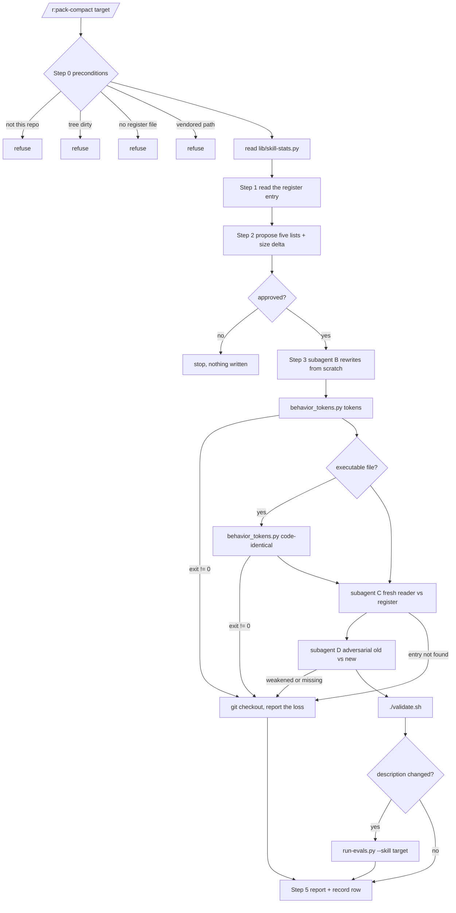

# pack-compact — behaviour register

Restructures the pack's own prose against this register. It is the register's only consumer, and
it is itself a target: the rules below are what a later sweep over `skills/pack-compact/` has to
keep saying.

## Flow

## Behaviours

- **SB-pack-compact-001** — The skill carries `disable-model-invocation: true`, so no prompt can
  route to it and its description costs nothing in the always-on listing. Both halves matter: the
  listing has about 50 characters of headroom, and a skill that rewrites the pack's own
  instructions must be invoked deliberately or not at all.
  *States it:* `skills/pack-compact/SKILL.md`
  *Enforced by:* `tools/rename_rules.py`
  *Tested by:* `tools/validate.py`
- **SB-pack-compact-002** — Because it is flagged, its eval suite carries `behaviour` cases only.
  Routing cases would be unreachable by design, and `run-evals.py` skips them — a suite of skipped
  cases is a green gate over nothing measured.
  *States it:* `skills/pack-compact/evals/evals.json`
  *Enforced by:* `tools/validate.py`
  *Tested by:* —
- **SB-pack-compact-003** — It runs only inside this pack's own repo, decided by
  `.claude-plugin/plugin.json` naming `r`. Anywhere else it would be rewriting somebody's project.
  *States it:* `skills/pack-compact/SKILL.md`
  *Enforced by:* —
  *Tested by:* —
- **SB-pack-compact-004** — It refuses to start unless `git status --porcelain` is empty. Its only
  failure response is `git checkout -- <file>`, and that is an unambiguous full undo only when the
  working tree held nothing else. It never stashes and never commits.
  *States it:* `skills/pack-compact/SKILL.md`
  *Enforced by:* —
  *Tested by:* —
- **SB-pack-compact-005** — It refuses any target with no `docs/skill-pack-repo/behaviour/` file.
  Without one there is no statement of what the prose must keep saying, and a rewrite checked
  against the file it replaces only ever proves it copied itself. It never derives a substitute
  inventory to work around the refusal.
  *States it:* `skills/pack-compact/SKILL.md`
  *Enforced by:* `tools/validate.py`
  *Tested by:* —
- **SB-pack-compact-006** — It never touches
  `skills/spec-brainstorm/references/html-effectiveness/`; that tree is vendored and its `LICENSE`
  stays byte-for-byte.
  *States it:* `skills/pack-compact/SKILL.md`
  *Enforced by:* `tools/validate.py`
  *Tested by:* —
- **SB-pack-compact-007** — **The register is invariant.** It never proposes dropping a behaviour,
  with or without approval. A behaviour that looks dead is reported and left in place, because
  retiring a rule is a decision made outside this skill.
  *States it:* `skills/pack-compact/SKILL.md`
  *Enforced by:* —
  *Tested by:* —
- **SB-pack-compact-008** — The one register field a run may change is *States it:*, when text
  legitimately moves to `references/`. That changes where a behaviour is written down, not what it
  is.
  *States it:* `skills/pack-compact/SKILL.md`
  *Enforced by:* —
  *Tested by:* —
- **SB-pack-compact-009** — Five moves, in order: re-home, say once, de-narrate, extract, refresh.
  Re-homing is the point — a rule appended wherever the last fix landed goes to the section that
  owns it — and the other four follow from it.
  *States it:* `skills/pack-compact/references/what-is-noise.md`
  *Enforced by:* —
  *Tested by:* —
- **SB-pack-compact-010** — Extraction is the default when a section is long and the call is
  unclear, because it is the only move that cannot lose anything. A pointer that does not say
  *when* to follow it is a deletion with extra steps.
  *States it:* `skills/pack-compact/references/what-is-noise.md`
  *Enforced by:* —
  *Tested by:* —
- **SB-pack-compact-011** — A measured number restated in a **separately loaded** file is not
  duplication and is never collapsed. An agent file loads without its calling skill, so its copy
  is the only one that context will ever read.
  *States it:* `skills/pack-compact/references/what-is-noise.md`
  *Enforced by:* —
  *Tested by:* —
- **SB-pack-compact-012** — "regression", "no longer" and "the old" are never pattern-matched.
  About fifty sites use them to describe what the tool does now, which makes a keyword sweep the
  biggest false-positive risk in the corpus.
  *States it:* `skills/pack-compact/references/what-is-noise.md`
  *Enforced by:* —
  *Tested by:* —
- **SB-pack-compact-013** — The forecloses-clause is never dropped. The house sentence is rule →
  mechanism → the wrong reading it forecloses → the opposite case, and the third clause is what
  stops the next editor deleting a rule they do not understand. Compaction removes a second
  statement of a reason, never the reason.
  *States it:* `skills/pack-compact/references/what-is-noise.md`
  *Enforced by:* —
  *Tested by:* —
- **SB-pack-compact-014** — In an executable file only whole comment lines are rewritten — not
  code, and not trailing comments, which the gate treats as code. The conservative direction is
  deliberate: a stripper that mistook code for a comment would stop being able to see that code
  change.
  *States it:* `skills/pack-compact/SKILL.md`
  *Enforced by:* `skills/pack-compact/scripts/behavior_tokens.py`
  *Tested by:* `skills/pack-compact/tests/behavior_tokens.test.sh`
- **SB-pack-compact-015** — Every flag, path, `r:` name, constant, payload key and measured number
  in the old file must appear somewhere in the new set of files. Several `--after` files are
  accepted so that extraction does not read as loss.
  *States it:* `skills/pack-compact/SKILL.md`
  *Enforced by:* `skills/pack-compact/scripts/behavior_tokens.py`
  *Tested by:* `skills/pack-compact/tests/behavior_tokens.test.sh`
- **SB-pack-compact-016** — Exit 2 from the token check is treated exactly like exit 1: a check
  that did not run is not a check that passed.
  *States it:* `skills/pack-compact/SKILL.md`
  *Enforced by:* `skills/pack-compact/scripts/behavior_tokens.py`
  *Tested by:* `skills/pack-compact/tests/behavior_tokens.test.sh`
- **SB-pack-compact-017** — The mechanical check runs **before** the two model readers, because it
  is the half that cannot be talked out of a verdict.
  *States it:* `skills/pack-compact/SKILL.md`
  *Enforced by:* —
  *Tested by:* —
- **SB-pack-compact-018** — The fresh reader is given only the new file and the register, never
  the original. A reader that has seen the original cannot tell "still stated" from "I remember
  it".
  *States it:* `skills/pack-compact/SKILL.md`
  *Enforced by:* —
  *Tested by:* —
- **SB-pack-compact-019** — **Any entry the fresh reader cannot find, or the adversarial reader
  flags, means the file is restored — never patched.** A patched rewrite is how a file ends up
  half-organised and short a rule, and nothing downstream re-reads the prose to catch it.
  *States it:* `skills/pack-compact/SKILL.md`
  *Enforced by:* —
  *Tested by:* —
- **SB-pack-compact-020** — The rewrite is written from scratch, not edited. An edit pass preserves
  the shape that accreted, which is the thing being fixed.
  *States it:* `skills/pack-compact/SKILL.md`
  *Enforced by:* —
  *Tested by:* —
- **SB-pack-compact-021** — The rewriter and both readers are subagents dispatched from the main
  thread. A subagent has no `Agent` tool, so a fan-out nested one level down collapses to a single
  context and still reports success. **A context that cannot reach the `Agent` tool stops and says
  so** rather than rewriting the file inline and calling it done.
  *States it:* `skills/pack-compact/SKILL.md`
  *Enforced by:* —
  *Tested by:* —
- **SB-pack-compact-022** — A frontmatter `description` change is its own proposal with its own
  yes, never bundled with a body rewrite, and it re-runs `tools/run-evals.py` for that skill. A
  description is routing, and only a model run can prove routing still works.
  *States it:* `skills/pack-compact/SKILL.md`
  *Enforced by:* —
  *Tested by:* —
- **SB-pack-compact-023** — A description change must not raise the always-on listing cost, which
  has about 50 characters of headroom across the whole pack.
  *States it:* `skills/pack-compact/SKILL.md`
  *Enforced by:* `tools/validate.py`
  *Tested by:* —
- **SB-pack-compact-024** — There is no `--auto` mode. Nothing in the pack invokes this skill, so
  an unattended path would only be a way of skipping an approval somebody has to give.
  *States it:* `skills/pack-compact/SKILL.md`
  *Enforced by:* —
  *Tested by:* —
- **SB-pack-compact-025** — `bytesBefore` against `bytesAfter`, read beside `filesReverted`, is
  the pair that says whether a run did its job: shrinking while reverting nothing is the result,
  shrinking while reverting is churn.
  *States it:* `skills/pack-compact/SKILL.md`
  *Enforced by:* `lib/record-run.py`
  *Tested by:* `lib/tests/stats.test.sh`
- **SB-pack-compact-026** — `findings` records **both sides** of the adjudication: `confirmed` for
  an entry really lost, `dismissed` for one the reader missed and the file kept. Logging only the
  losses is what makes a verifier read as never wrong.
  *States it:* `skills/pack-compact/SKILL.md`
  *Enforced by:* `lib/record-run.py`
  *Tested by:* `lib/tests/stats.test.sh`
- **SB-pack-compact-027** — A run that could not finish writes `blockedReason` and **no findings
  at all**. A blockage filed as a finding is picked up downstream as work.
  *States it:* `skills/pack-compact/SKILL.md`
  *Enforced by:* `lib/record-run.py`
  *Tested by:* `lib/tests/stats.test.sh`
- **SB-pack-compact-028** — It commits nothing. The diff is the deliverable and the user decides
  what lands.
  *States it:* `skills/pack-compact/SKILL.md`
  *Enforced by:* —
  *Tested by:* —
- **SB-pack-compact-029** — Shorter is not the goal. A rewrite that ends the same length but says
  each thing once, in the section that owns it, has done the job; one that is 40% shorter and
  vaguer has not. Bytes are reported because they are measurable, not because they are the
  objective.
  *States it:* `skills/pack-compact/references/what-is-noise.md`
  *Enforced by:* —
  *Tested by:* —
- **SB-pack-compact-030** — Anything the run is unsure about goes into the report as a question,
  never into the rewrite as a decision. `contradictions.md` is read alongside the register and
  nothing listed there is silently harmonised.
  *States it:* `skills/pack-compact/references/what-is-noise.md`
  *Enforced by:* —
  *Tested by:* —

## Prose-only behaviours

21 of 30: SB-pack-compact-003, SB-pack-compact-007, SB-pack-compact-008, SB-pack-compact-009,
SB-pack-compact-010, SB-pack-compact-011, SB-pack-compact-012, SB-pack-compact-013,
SB-pack-compact-017, SB-pack-compact-018, SB-pack-compact-019, SB-pack-compact-020,
SB-pack-compact-021, SB-pack-compact-022, SB-pack-compact-024, SB-pack-compact-028,
SB-pack-compact-029, SB-pack-compact-030, SB-pack-compact-002, SB-pack-compact-005,
SB-pack-compact-006.

The revert rule (SB-019) is the one worth staring at: it is the whole safety of the skill and
nothing but the wording holds it up.
