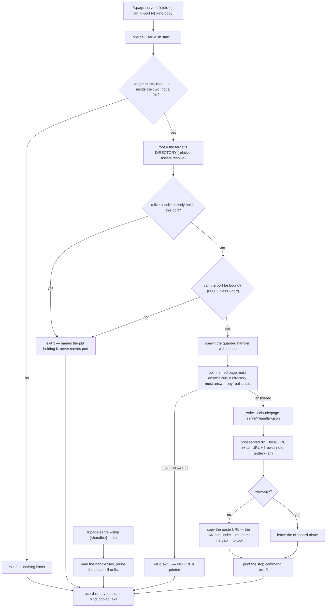

# `page-serve` — behaviour register

`/r:page-serve <file|dir> [--lan]`: put one local page on a small http server — loopback by default,
the whole LAN with `--lan` — hand back the URL, put it on the clipboard, and leave a handle that
stops it later. `scripts/serve.sh` is the contract; the prose defers to its exit codes and its
refusals.

Format, ID scheme and the meaning of the three trailing fields: [`README.md`](README.md).

## Flow

## Entries

- **SB-page-serve-001** — The skill puts one local HTML file — or the directory around it — on a
  small http server, reachable only from this machine by default or from every device on the network
  with `--lan`, then hands back the URL and a way to stop it. Nothing is uploaded and nothing leaves
  the local network.
  *States it:* `skills/page-serve/SKILL.md`
  *Enforced by:* `skills/page-serve/scripts/serve.sh`
  *Tested by:* `skills/page-serve/tests/serve.test.sh`

- **SB-page-serve-002** — The skill carries `disable-model-invocation: true`. It mutates nothing, and
  it still belongs on the flagged list because it **opens a listening socket** and `--lan` makes that
  socket reachable from every device on the network — not something anyone wants arrived at by
  inference. The frontmatter blocks the Skill tool rather than a sentence asking the model to be
  careful. It is typed, or its script is invoked directly. Its trigger and neighbour-exclusion eval
  cases would be untestable by design, so the gate requires `behaviour` cases instead.
  *States it:* `skills/page-serve/SKILL.md`
  *Enforced by:* `tools/validate.py`
  *Tested by:* —

- **SB-page-serve-003** — Three invocation forms, and **every one of them is a single call to the
  script** at `${CLAUDE_SKILL_DIR}/scripts/serve.sh`: `start <file|dir> [--lan] [--port N]
  [--no-copy]`, `stop <handle>` or `stop --all`, and `list`. The skill adds no logic of its own around
  them.
  *States it:* `skills/page-serve/SKILL.md`
  *Enforced by:* `skills/page-serve/scripts/serve.sh`
  *Tested by:* `skills/page-serve/tests/serve.test.sh`

- **SB-page-serve-004** — **The script's output is reported as it stands.** It already prints the
  served directory, the URLs and the stop command; re-describing them is how a URL that was never
  printed gets into a summary anyway.
  *States it:* `skills/page-serve/SKILL.md`
  *Enforced by:* —
  *Tested by:* —

- **SB-page-serve-005** — **`--lan` is the consent, so it is stated and not asked.** One line of fact
  before running — *"this puts the page on the local network at `http://<ip>:<port>`"* — then run.
  Asking a question the user answered by typing the flag is the behaviour `--share` already refuses
  in `/r:ui-prototype`.
  *States it:* `skills/page-serve/SKILL.md`
  *Enforced by:* —
  *Tested by:* —

- **SB-page-serve-006** — Without the flag the server binds `127.0.0.1` and nothing outside this
  machine can reach it; `--lan` binds `0.0.0.0` and is the **only** way to be reachable from another
  device. `--local` restores the default explicitly.
  *States it:* `skills/page-serve/SKILL.md`
  *Enforced by:* `skills/page-serve/scripts/serve.sh`
  *Tested by:* `skills/page-serve/tests/serve.test.sh`

- **SB-page-serve-007** — The suite asserts the bind **from the handle file, not from the printed
  message**: the printed line is what a person sees, the bind is what is true, and asserting the
  message would pass over a server that says `lan` and listens on loopback.
  *States it:* `skills/page-serve/tests/serve.test.sh`
  *Enforced by:* —
  *Tested by:* `skills/page-serve/tests/serve.test.sh`

- **SB-page-serve-008** — **The URL goes on the clipboard, and under `--lan` it is the LAN one.** A
  LAN address works from this machine as well as from the phone, so once `--lan` has been asked for
  it is strictly the more useful of the two to have copied. The run says **which** URL was copied —
  the script prints it — rather than leaving the user to guess between the two lines above it.
  *States it:* `skills/page-serve/SKILL.md`
  *Enforced by:* `skills/page-serve/scripts/serve.sh`
  *Tested by:* `skills/page-serve/tests/serve.test.sh`

- **SB-page-serve-009** — `--no-copy` leaves the clipboard alone. The clipboard tools are tried in
  the order the platforms actually ship them — `pbcopy`, `wl-copy`, `xclip`, `xsel` — and the one
  used is printed.
  *States it:* `skills/page-serve/SKILL.md`
  *Enforced by:* `skills/page-serve/scripts/serve.sh`
  *Tested by:* `skills/page-serve/tests/serve.test.sh`

- **SB-page-serve-010** — **A machine with no clipboard tool is named, and the start still
  succeeds.** The page is served either way, and failing a working server over a missing `pbcopy`
  would be the tail wagging the dog — so this one path fails open, and the run names the gap instead
  of implying a copy.
  *States it:* `skills/page-serve/SKILL.md`
  *Enforced by:* `skills/page-serve/scripts/serve.sh`
  *Tested by:* `skills/page-serve/tests/serve.test.sh`

- **SB-page-serve-011** — **The port is 8000 and it does not move.** A firewall rule names a port, so
  a server that quietly took the next free one would land outside the rule that was opened for it and
  be dropped with nothing to read — a page that does not load, from a run that reported success.
  *States it:* `skills/page-serve/SKILL.md`
  *Enforced by:* `skills/page-serve/scripts/serve.sh`
  *Tested by:* `skills/page-serve/tests/serve.test.sh`

- **SB-page-serve-012** — A busy port is therefore an **error (`3`) naming what holds it, never a
  silent move**. `--port N` overrides it deliberately, and `PAGE_SERVE_PORT` moves the default on a
  host that has allowed a different one. The suite asserts the shipped default by reading
  `PAGE_SERVE_PORT:-8000` out of the script, and runs its own server on 8399 so it never fights
  whatever the user is serving.
  *States it:* `skills/page-serve/SKILL.md`
  *Enforced by:* `skills/page-serve/scripts/serve.sh`
  *Tested by:* `skills/page-serve/tests/serve.test.sh`

- **SB-page-serve-013** — **The script's own handle registry is checked before the socket probe, and
  that is not belt-and-braces.** `SO_REUSEADDR` lets a bind on `127.0.0.1:8000` succeed while another
  server holds `0.0.0.0:8000`, so the probe alone would say the port is free — and since the handle is
  named for the port, the second start would overwrite the first one's JSON and orphan a process
  nothing can stop. A live pid in that handle is exit `3`; a dead one has its files cleaned up and
  the start continues.
  *States it:* `skills/page-serve/scripts/serve.sh`
  *Enforced by:* `skills/page-serve/scripts/serve.sh`
  *Tested by:* `skills/page-serve/tests/serve.test.sh`

- **SB-page-serve-014** — The server sets `allow_reuse_address`, and the free-port probe sets
  `SO_REUSEADDR` too and probes **the address the server will actually bind** — probing `127.0.0.1`
  for a server about to bind `0.0.0.0` answers a different question. Without it a socket still in
  `TIME_WAIT` from the previous run reads as "in use" and the common edit-stop-start loop fails on a
  port that is genuinely free. It does not let the server bind over a **live** listener; that would
  need `SO_REUSEPORT`.
  *States it:* `skills/page-serve/scripts/serve.sh`
  *Enforced by:* `skills/page-serve/scripts/serve.sh`
  *Tested by:* `skills/page-serve/tests/serve.test.sh`

- **SB-page-serve-015** — Under `--lan` the script **names the firewall it can see and never claims a
  verdict**, because that is the one check it cannot make: traffic from the host to its own address
  goes over loopback, so the server answers itself perfectly while every other device is being
  dropped, and reading the rules needs root. It prints the matching command for the macOS firewall,
  `ufw` or `firewalld` — allow the port once per host, scoped to the LAN rather than to everything.
  *States it:* `skills/page-serve/SKILL.md`
  *Enforced by:* `skills/page-serve/scripts/serve.sh`
  *Tested by:* —

- **SB-page-serve-016** — **A URL is printed only when the page answered.** After spawning, the
  script polls and exits `5` with **no URL** if nothing responds, killing the process it spawned. The
  gap is never filled in from the port the run was going to use: a URL nothing is listening on is
  indistinguishable from a working one until somebody taps it on another device, and by then they are
  looking at a browser error rather than the page.
  *States it:* `skills/page-serve/SKILL.md`
  *Enforced by:* `skills/page-serve/scripts/serve.sh`
  *Tested by:* `skills/page-serve/tests/serve.test.sh`

- **SB-page-serve-017** — The poll runs `POLL_TRIES` attempts at 0.25s (40 × 0.25s = 10s by default,
  `PAGE_SERVE_POLL_TRIES` overrides), and it also gives up as soon as the spawned pid is gone. **A
  named page must come back `200`** — that is the claim the printed URL makes. A **directory** target
  only has to produce a real status line, since with listings off there is no single response that
  means "up"; `000` is curl saying nothing answered at all, which is the case the check exists for.
  *States it:* `skills/page-serve/scripts/serve.sh`
  *Enforced by:* `skills/page-serve/scripts/serve.sh`
  *Tested by:* `skills/page-serve/tests/serve.test.sh`

- **SB-page-serve-018** — A spawned pid is **not** a served page: the bind can lose a race and the
  handler can raise on import, and either way the process is alive and answering nothing. On exit `5`
  the first five lines of the server log are printed to stderr so the cause is visible.
  *States it:* `skills/page-serve/scripts/serve.sh`
  *Enforced by:* `skills/page-serve/scripts/serve.sh`
  *Tested by:* `skills/page-serve/tests/serve.test.sh`

- **SB-page-serve-019** — **What is served is the target's directory**, so a page's relative assets
  resolve. A directory target is served as-is with no page component.
  *States it:* `skills/page-serve/SKILL.md`
  *Enforced by:* `skills/page-serve/scripts/serve.sh`
  *Tested by:* `skills/page-serve/tests/serve.test.sh`

- **SB-page-serve-020** — **The handler refuses every path segment beginning with `.`** — so `.env`,
  `.git` and anything inside a dot directory is unreachable, which on `--lan` is unreachable to
  everyone on the network. `python3 -m http.server` would hand those to whoever asks. That refusal is
  the reason this is a script and not a one-line shell-out, so the one-liner is **never** substituted
  when the script is inconvenient.
  *States it:* `skills/page-serve/SKILL.md`
  *Enforced by:* `skills/page-serve/scripts/serve.sh`
  *Tested by:* `skills/page-serve/tests/serve.test.sh`

- **SB-page-serve-021** — **The handler refuses every symlink resolving outside the served root**, and
  every `..` that climbs out of it: the path is resolved with `realpath` rather than trusted to the
  base class, which normalises but does not care about dotfiles and follows a symlink straight out of
  the root.
  *States it:* `skills/page-serve/SKILL.md`
  *Enforced by:* `skills/page-serve/scripts/serve.sh`
  *Tested by:* `skills/page-serve/tests/serve.test.sh`

- **SB-page-serve-022** — **A refusal answers `404`, not `403`.** A `403` confirms the file is there,
  which is half of what the refusal was protecting; the refused path is rewritten to one that cannot
  exist and the base class does the rest.
  *States it:* `skills/page-serve/scripts/serve.sh`
  *Enforced by:* `skills/page-serve/scripts/serve.sh`
  *Tested by:* `skills/page-serve/tests/serve.test.sh`

- **SB-page-serve-023** — **Directory listing is off** (`403`, with the reason). An index of the
  directory is a map of everything reachable, and serving one over the LAN is a different offer from
  serving the page that was asked for. Request logging is off too.
  *States it:* `skills/page-serve/scripts/serve.sh`
  *Enforced by:* `skills/page-serve/scripts/serve.sh`
  *Tested by:* `skills/page-serve/tests/serve.test.sh`

- **SB-page-serve-024** — **A target the run should not serve is refused before anything binds**, with
  exit `2`: a missing or unreadable file, a root that resolves **outside the working directory**, and
  a **dotfile named as the target**. Serving a directory the run was never pointed at is a different
  offer from serving a page, and on `--lan` it is a much larger one — so the answer is to move the
  file in, or serve from the directory that holds it, never to widen the root.
  *States it:* `skills/page-serve/SKILL.md`
  *Enforced by:* `skills/page-serve/scripts/serve.sh`
  *Tested by:* `skills/page-serve/tests/serve.test.sh`

- **SB-page-serve-025** — **The exit codes are the whole contract**: `0` serving and the page
  answered; `2` the target is missing, unreadable, a dotfile, or outside the working directory; `3`
  the port is taken — by another page-serve or by something else; `5` it started and never answered,
  so **nothing was served and no URL exists**; `64` usage.
  *States it:* `skills/page-serve/SKILL.md`
  *Enforced by:* `skills/page-serve/scripts/serve.sh`
  *Tested by:* `skills/page-serve/tests/serve.test.sh`

- **SB-page-serve-026** — **There is no skip code and no exit `4`.** `python3` is a mandatory
  prerequisite of this pack, so an absent interpreter is a broken machine rather than a coverage gap
  to name.
  *States it:* `skills/page-serve/SKILL.md`
  *Enforced by:* `skills/page-serve/scripts/serve.sh`
  *Tested by:* —

- **SB-page-serve-027** — Usage — an unknown subcommand, a `start` with no target, `-h`/`--help` —
  exits `64` and prints the script's own header block, which **is** the help. It is delimited by the
  `set -uo pipefail` line rather than by a line number, because a hardcoded range silently truncates
  the moment the header grows and the part it would cut is the exit-code contract at the bottom.
  *States it:* `skills/page-serve/scripts/serve.sh`
  *Enforced by:* `skills/page-serve/scripts/serve.sh`
  *Tested by:* `skills/page-serve/tests/serve.test.sh`

- **SB-page-serve-028** — **A start writes `~/.claude/page-serve/<handle>.json` and returns; the
  server outlives the session.** The handle is `p<port>` and the file carries pid, port, root, bind,
  page and start time — which is why `--stop` works tomorrow from a different session, and why it is
  worth offering once the page has been looked at. `PAGE_SERVE_STATE` moves that directory, so a
  suite or a second checkout never shares the user's real one where `stop --all` would kill a server
  they are actually using.
  *States it:* `skills/page-serve/SKILL.md`
  *Enforced by:* `skills/page-serve/scripts/serve.sh`
  *Tested by:* `skills/page-serve/tests/serve.test.sh`

- **SB-page-serve-029** — **`--list` prunes handles whose process is gone**, so `--stop` can never
  report a kill over something that died on its own; with nothing live it says "nothing is being
  served", and `stop` with nothing to kill says "nothing was running" rather than claiming one.
  *States it:* `skills/page-serve/SKILL.md`
  *Enforced by:* `skills/page-serve/scripts/serve.sh`
  *Tested by:* `skills/page-serve/tests/serve.test.sh`

- **SB-page-serve-030** — `--list` prints a lan-bound server at an address a browser can actually
  use, never at `0.0.0.0`: that is a bind, not a destination, and printing it hands back a URL that
  opens nowhere.
  *States it:* `skills/page-serve/scripts/serve.sh`
  *Enforced by:* `skills/page-serve/scripts/serve.sh`
  *Tested by:* —

- **SB-page-serve-031** — The LAN address printed first is **the default route's**, and the rest are
  counted rather than enumerated: a machine with a VPN, a container bridge and a few virtual
  interfaces answers on all of them, and a list of eight is not an answer. With no primary address
  found, every global address is printed; with none at all the run says so instead of inventing one.
  *States it:* `skills/page-serve/scripts/serve.sh`
  *Enforced by:* `skills/page-serve/scripts/serve.sh`
  *Tested by:* —

- **SB-page-serve-032** — One row is recorded through `${CLAUDE_PLUGIN_ROOT}/lib/record-run.py` with
  `skill: "r:page-serve"`, `outcome` (`serving|stopped|listed|dead|refused`), `bind` (`local|lan`),
  `copied` and `exit`.
  *States it:* `skills/page-serve/SKILL.md`
  *Enforced by:* `lib/record-run.py`
  *Tested by:* `lib/tests/stats.test.sh`

- **SB-page-serve-033** — **`dead` (exit 5) and `refused` (exit 2) are kept apart in the payload
  because they need opposite fixes**: one is a server that would not start, the other is a target the
  run should never have been pointed at.
  *States it:* `skills/page-serve/SKILL.md`
  *Enforced by:* —
  *Tested by:* —

- **SB-page-serve-034** — `/r:ui-prototype` Step 5 offers a LAN URL for its `compare.html` by calling
  `${CLAUDE_PLUGIN_ROOT}/skills/page-serve/scripts/serve.sh start … --lan` **directly**, because this
  skill sets `disable-model-invocation` and cannot be reached through the Skill tool. The same "state
  it in one line, do not ask" rule applies there.
  *States it:* `skills/ui-prototype/SKILL.md`
  *Enforced by:* —
  *Tested by:* —

- **SB-page-serve-035** — **NOT for:** publishing a page to claude.ai (that is `/r:ui-prototype
  --share`), running a project's own dev server or app (that is its `/test-app`), or driving a page in
  a browser (`agent-browser`).
  *States it:* `skills/page-serve/SKILL.md`
  *Enforced by:* —
  *Tested by:* —

- **SB-page-serve-036** — `serve.test.sh` is the suite for `serve.sh` **and the only one it gets**,
  and `validate.sh` names it explicitly. Two of the decisions here fail by looking exactly like
  success — a URL printed for a server that never answered, and a dotfile served over `--lan` — and
  neither shows up in a run's output, so a clean start is not evidence and the suite is. It runs with
  its own `PAGE_SERVE_STATE`, its own port and a stub `pbcopy` first on `PATH`, so it never kills a
  server the user is using or clobbers what they had copied.
  *States it:* `skills/page-serve/tests/serve.test.sh`
  *Enforced by:* `validate.sh`
  *Tested by:* `skills/page-serve/tests/serve.test.sh`

## Prose-only behaviours

Held up by wording alone. The script carries almost all of this skill, which is the point of it
existing — but the four rules about *how the run talks about what the script did* are prose: report
the output as it stands, state `--lan` rather than ask it, never reconstruct a URL, and never
substitute `python3 -m http.server`. Those are the ones a rewrite can lose while every test still
passes.

5 of 36: SB-page-serve-004, SB-page-serve-005, SB-page-serve-033, SB-page-serve-034,
SB-page-serve-035.

**5 of 36 entries are prose-only.**
