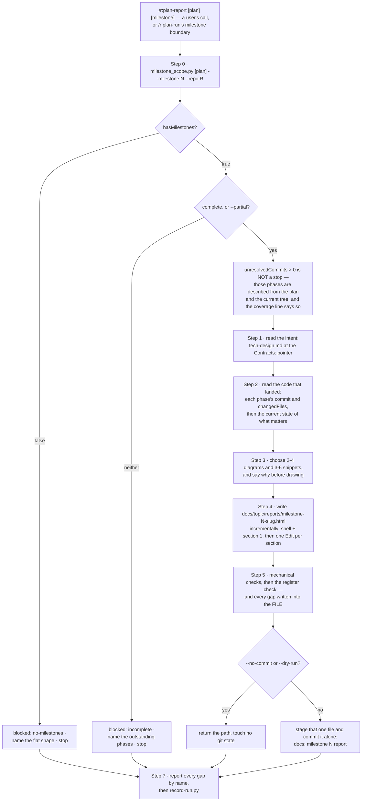

# `plan-report` — behaviour register

What `/r:plan-report` does, one claim per entry. Format and ID rules: [README.md](README.md).

One milestone, one self-contained HTML page: what it delivers, the design **as built**, the
diagrams that show its shape, and the code that carries its decisions. Its scope comes from
`milestone_scope.py`, which `/r:plan-run` also reads at its milestone boundary.

## Step flow

## Invocation and reach

- **SB-plan-report-001** — The skill never fires on its own. It runs from a user's
  `/r:plan-report`, or when `/r:plan-run` reaches a milestone boundary — not after an ordinary code
  change, not at the end of a session, not because a milestone happens to look finished.
  *States it:* `skills/plan-report/SKILL.md`
  *Enforced by:* —
  *Tested by:* —

- **SB-plan-report-002** — That rule lives in the body and the description rather than in
  frontmatter: `disable-model-invocation: true` blocks the Skill tool outright and cannot tell an
  auto-load from a deliberate call, so it would also block `/r:plan-run`'s boundary subagent, which
  reaches this skill **through** the Skill tool. Same reasoning and same resolution as
  `/r:task-review`.
  *States it:* `skills/plan-report/SKILL.md`
  *Enforced by:* —
  *Tested by:* —

- **SB-plan-report-003** — The invocation is
  `/r:plan-report [<plan>] [<milestone>] [--partial] [--no-commit] [--dry-run]`.
  *States it:* `skills/plan-report/SKILL.md`
  *Enforced by:* —
  *Tested by:* —

- **SB-plan-report-004** — With no `<plan>` argument the plan is looked for and **named before it is
  used**: `docs/*/todo.md` first, where `/r:spec-design` writes, then `todo.md`, `PLAN.md` or
  `IMPLEMENTATION.md` at the repo root.
  *States it:* `skills/plan-report/SKILL.md`
  *Enforced by:* —
  *Tested by:* —

- **SB-plan-report-005** — With no `<milestone>` argument, take the highest-numbered **complete**
  milestone that has no report yet and say which one you took. Several unreported → list them and
  ask rather than guessing which the user means.
  *States it:* `skills/plan-report/SKILL.md`
  *Enforced by:* `skills/plan-report/scripts/milestone_scope.py`
  *Tested by:* `skills/plan-report/tests/milestone_scope.test.sh`

- **SB-plan-report-006** — `--partial` writes the report over an unfinished milestone's ticked
  phases only. Without it, an incomplete milestone stops the run.
  *States it:* `skills/plan-report/SKILL.md`
  *Enforced by:* —
  *Tested by:* —

- **SB-plan-report-007** — `--no-commit` writes the file and stops, staging and committing nothing.
  `/r:plan-run` passes it, because the caller owns the repo's state and the two must not both reach
  for the index.
  *States it:* `skills/plan-report/SKILL.md`
  *Enforced by:* —
  *Tested by:* —

- **SB-plan-report-008** — `--dry-run` prints the scope, the sections and the diagrams it would
  draw, and **writes nothing, ever**.
  *States it:* `skills/plan-report/SKILL.md`
  *Enforced by:* —
  *Tested by:* —

## Step 0 — the scope comes from the script

- **SB-plan-report-009** — **Which phases a milestone contains, and whether it is finished, come
  from `milestone_scope.py` — never from reading the markdown and counting.** Both wrong answers are
  silent: a report scoped to the wrong phases still renders, and a milestone called complete one
  phase early still produces a document that reads as authoritative, with nothing downstream
  re-checking it.
  *States it:* `skills/plan-report/SKILL.md`
  *Enforced by:* `skills/plan-report/scripts/milestone_scope.py`
  *Tested by:* `skills/plan-report/tests/milestone_scope.test.sh`

- **SB-plan-report-010** — The script is called as
  `python3 "${CLAUDE_SKILL_DIR}/scripts/milestone_scope.py" <plan> --milestone <n> --repo <repo-root>`
  and returns the milestone (name, `Contracts:` pointer, phase numbers, tick counts, `reportPath`,
  `reportExists`) and, per phase, its title, checklist with ticks, `Implements:`, `Risk:`,
  `Done when:`, the plan's declared `Files:`, its **landing commit** and the files that commit
  changed.
  *States it:* `skills/plan-report/SKILL.md`
  *Enforced by:* `skills/plan-report/scripts/milestone_scope.py`
  *Tested by:* `skills/plan-report/tests/milestone_scope.test.sh`

- **SB-plan-report-011** — **Stop, without writing, when the plan has no `## Milestone N` headings**
  (`hasMilestones: false`). Say so and name the flat shape; **never invent a grouping** — one nobody
  authored would be reported as though the plan had asserted it.
  *States it:* `skills/plan-report/SKILL.md`
  *Enforced by:* `skills/plan-report/scripts/milestone_scope.py`
  *Tested by:* `skills/plan-report/tests/milestone_scope.test.sh`

- **SB-plan-report-012** — **Stop when the milestone is not complete and `--partial` was not
  passed**, naming which phases are outstanding. A report that implies completeness over unfinished
  work is the one failure here that misleads rather than merely disappoints.
  *States it:* `skills/plan-report/SKILL.md`
  *Enforced by:* `skills/plan-report/scripts/milestone_scope.py`
  *Tested by:* `skills/plan-report/tests/milestone_scope.test.sh`

- **SB-plan-report-013** — **`unresolvedCommits` above zero is NOT a stop.** Those phases are
  described from the plan and the current tree instead of from their diff, and the header's coverage
  line says so.
  *States it:* `skills/plan-report/SKILL.md`
  *Enforced by:* `skills/plan-report/scripts/milestone_scope.py`
  *Tested by:* `skills/plan-report/tests/milestone_scope.test.sh`

## What the script decides, and how

- **SB-plan-report-014** — A phase's **landing commit** is the commit that introduced its
  `<!-- built: <slug> -->` marker into the plan file, found with `git log -S "built: <slug>" -- <plan>`
  and taking the **earliest** such commit. `/r:plan-run` commits a phase once — its code, its ticks
  and that marker together, so "built" and "done" revert together — so that single commit is exactly
  the phase's changeset, and the plan file's own history names it without needing the branch, which
  is deleted at merge time.
  *States it:* `skills/plan-report/scripts/milestone_scope.py`
  *Enforced by:* `skills/plan-report/scripts/milestone_scope.py`
  *Tested by:* `skills/plan-report/tests/milestone_scope.test.sh`

- **SB-plan-report-015** — **A missing sha always carries a `commitNote`.** An untracked plan, a
  plan outside the repo and a marker nobody ever wrote are three different gaps, and a report that
  prints none of them reads as though it had the code in front of it.
  *States it:* `skills/plan-report/scripts/milestone_scope.py`
  *Enforced by:* `skills/plan-report/scripts/milestone_scope.py`
  *Tested by:* `skills/plan-report/tests/milestone_scope.test.sh`

- **SB-plan-report-016** — **A milestone with no phases under it is empty, not complete.** Calling
  it complete would fire the report boundary on a heading that built nothing.
  *States it:* `skills/plan-report/scripts/milestone_scope.py`
  *Enforced by:* `skills/plan-report/scripts/milestone_scope.py`
  *Tested by:* `skills/plan-report/tests/milestone_scope.test.sh`

- **SB-plan-report-017** — A phase with **no checkboxes at all** cannot be complete: completeness
  requires `total > 0` and `ticked == total` for every member phase. No items is not all items
  ticked.
  *States it:* `skills/plan-report/scripts/milestone_scope.py`
  *Enforced by:* `skills/plan-report/scripts/milestone_scope.py`
  *Tested by:* `skills/plan-report/tests/milestone_scope.test.sh`

- **SB-plan-report-018** — A phase before the first `## Milestone` heading — or in a plan with none
  — gets `milestone: None` and is reported in `unassignedPhases`. That is the flat plan, and it has
  to read as "no milestones", **never as milestone 0**.
  *States it:* `skills/plan-report/scripts/milestone_scope.py`
  *Enforced by:* `skills/plan-report/scripts/milestone_scope.py`
  *Tested by:* `skills/plan-report/tests/milestone_scope.test.sh`

- **SB-plan-report-019** — The milestone, phase and tick regexes accept **both dash spellings the
  plan format allows and nothing else**, and are identical to `check_todo.py`'s deliberately: a
  heading one tool locates and the other does not is a phase that silently belongs to no milestone.
  `## Milestone 1: Ledger` is not the format, and must read as absent rather than be quietly
  accepted here and rejected by the checker.
  *States it:* `skills/plan-report/scripts/milestone_scope.py`
  *Enforced by:* `skills/plan-report/scripts/milestone_scope.py`
  *Tested by:* `skills/plan-report/tests/milestone_scope.test.sh`

- **SB-plan-report-020** — Those regexes are **copied** from `check_todo.py` rather than imported.
  Importing across skills means resolving a sibling skill's directory at run time from a script with
  no `${CLAUDE_PLUGIN_ROOT}` substitution; the plan format is a written contract
  (`skills/spec-design/references/design-contracts.md`), so the shape both scripts read is pinned by
  the document, not by one of them owning it.
  *States it:* `skills/plan-report/scripts/milestone_scope.py`
  *Enforced by:* —
  *Tested by:* —

- **SB-plan-report-021** — The slug is stable across runs — the same milestone name always produces
  the same report path — so a re-run **updates** the report it wrote last time instead of minting a
  second one beside it.
  *States it:* `skills/plan-report/references/output-format.md`
  *Enforced by:* `skills/plan-report/scripts/milestone_scope.py`
  *Tested by:* `skills/plan-report/tests/milestone_scope.test.sh`

- **SB-plan-report-022** — `--complete` returns the complete milestones plus `unreported`: those
  whose report is not on disk. Derived from disk rather than from a run's memory, which is what
  makes `/r:plan-run`'s boundary idempotent — a resumed run does not rewrite a report it already
  wrote.
  *States it:* `skills/plan-run/SKILL.md`
  *Enforced by:* `skills/plan-report/scripts/milestone_scope.py`
  *Tested by:* `skills/plan-report/tests/milestone_scope.test.sh`

- **SB-plan-report-023** — The script **always prints one JSON object and exits 0 whenever it could
  answer**. A plan with no milestone headings is an answer, not an error. Exit 1 is only for a
  question it could not answer at all: no such file, no such milestone, no mode given, `--milestone`
  with no number.
  *States it:* `skills/plan-report/scripts/milestone_scope.py`
  *Enforced by:* `skills/plan-report/scripts/milestone_scope.py`
  *Tested by:* `skills/plan-report/tests/milestone_scope.test.sh`

- **SB-plan-report-024** — The plan's `Files:` line is reported as `plannedFiles` **beside** the
  commit's `changedFiles`, never instead of it: the plan's line is a claim about the footprint and
  the commit is the measurement, and both are returned so a reader can see the gap rather than being
  handed one number that looks measured.
  *States it:* `skills/plan-report/scripts/milestone_scope.py`
  *Enforced by:* `skills/plan-report/scripts/milestone_scope.py`
  *Tested by:* —

## Steps 1–3 — the intent, the code, the choices

- **SB-plan-report-025** — Step 1 reads the milestone's contracts from `tech-design.md` at the
  `Contracts:` pointer, and each phase's block from the plan. This is the **claim**, held separately
  from what the code says — blur the two and the divergences vanish.
  *States it:* `skills/plan-report/SKILL.md`
  *Enforced by:* —
  *Tested by:* —

- **SB-plan-report-026** — A `--shallow` plan has no `tech-design.md`, and that is not a defect:
  report the design from the code alone and say there was nothing to compare it against.
  *States it:* `skills/plan-report/SKILL.md`
  *Enforced by:* —
  *Tested by:* —

- **SB-plan-report-027** — Step 2 reads **targeted, from the scope**: each phase's `changedFiles`
  and its commit are the reading list (`git show <commit> -- <path>`), then the **current** state of
  the files that matter, because a later phase may have moved what an earlier one wrote and the
  report describes the code as it stands.
  *States it:* `skills/plan-report/SKILL.md`
  *Enforced by:* —
  *Tested by:* —

- **SB-plan-report-028** — **Never sweep the repository.** The scope names the files; anything
  outside it is context you did not need, and reading it is how a report about one milestone turns
  into a tour of the codebase.
  *States it:* `skills/plan-report/SKILL.md`
  *Enforced by:* —
  *Tested by:* —

- **SB-plan-report-029** — Step 3 picks **2–4 figures** from the catalogue, drawn only where the
  subject exists in *this* milestone, and **3–6 snippets**, each a decision rather than a sample,
  each cited `path:LINE` and copied from the file. Say what was chosen and why before drawing it: a
  figure you cannot justify in a sentence is one the reader cannot read either.
  *States it:* `skills/plan-report/SKILL.md`
  *Enforced by:* —
  *Tested by:* —

## Step 4 — the page

- **SB-plan-report-030** — The output path is
  `docs/<topic>/reports/milestone-<N>-<slug>.html`, beside the plan's own `todo.md` and
  `tech-design.md`, in a `reports/` directory the skill creates. `<N>` and `<slug>` come from
  `milestone_scope.py` and are **never retyped**.
  *States it:* `skills/plan-report/references/output-format.md`
  *Enforced by:* `skills/plan-report/scripts/milestone_scope.py`
  *Tested by:* `skills/plan-report/tests/milestone_scope.test.sh`

- **SB-plan-report-031** — The page is written **incrementally**: one `Write` for the shell, the
  header and section 1, then one `Edit` per section after it. A single `Write` at this size loses
  quality toward the end — the last sections come out thin, which is exactly where the code snippets
  and the open gaps live.
  *States it:* `skills/plan-report/SKILL.md`
  *Enforced by:* —
  *Tested by:* —

- **SB-plan-report-032** — An existing report at that path is **read first and updated in place**.
  Never mint a `-2` beside it.
  *States it:* `skills/plan-report/SKILL.md`
  *Enforced by:* —
  *Tested by:* —

- **SB-plan-report-033** — The page shell is taken from
  `${CLAUDE_PLUGIN_ROOT}/skills/spec-brainstorm/references/html.md` §1–3 and §6's mechanics
  paragraph, and **nothing else from it**: §5's example list and §6's *catalogue* describe a
  seven-part specification of a system that does not exist yet, and a writer who follows that
  catalogue draws a spec's four figures for a milestone that added one endpoint.
  *States it:* `skills/plan-report/references/output-format.md`
  *Enforced by:* —
  *Tested by:* —

## The document

- **SB-plan-report-034** — Six sections, in order: header; *What this milestone delivers*; *The
  design as built*; *How it fits together*; *The code that carries it*; *What changed from the
  plan*; *What is not done yet*. A section with nothing true to say is **omitted, not padded** —
  except *What is not done yet*, which prints "nothing", because its absence and its emptiness read
  identically and only one of them is information.
  *States it:* `skills/plan-report/references/output-format.md`
  *Enforced by:* —
  *Tested by:* —

- **SB-plan-report-035** — **The report describes what was BUILT, and names every divergence from
  `tech-design.md`.** The contracts are the claim, written before any code existed; the code is the
  fact. A divergence is what the milestone learned, and it is the most valuable line in the
  document. A report that silently prints the contract's version is **worse than no report**,
  because it is the one a reader will trust over the code.
  *States it:* `skills/plan-report/references/output-format.md`
  *Enforced by:* —
  *Tested by:* —

- **SB-plan-report-036** — Diagrams are chosen from a four-row catalogue — the component cut, one
  primary flow, the data-model delta, a lifecycle — each drawn only when this milestone did the
  thing that row names, with every label taken **character for character** from the code. An empty
  box, or a box labelled with a class that is not there, is worse than no figure.
  *States it:* `skills/plan-report/references/output-format.md`
  *Enforced by:* —
  *Tested by:* —

- **SB-plan-report-037** — Snippets are **6–12 lines**. A snippet that needs a scrollbar is an
  architecture problem smuggled in as an excerpt — if the interesting part is that long, the
  interesting part is the shape, and it belongs in a diagram.
  *States it:* `skills/plan-report/references/output-format.md`
  *Enforced by:* —
  *Tested by:* —

- **SB-plan-report-038** — Each snippet is introduced by **one line saying what to look at and why
  it is that way**. A snippet with no such line is decoration.
  *States it:* `skills/plan-report/references/output-format.md`
  *Enforced by:* —
  *Tested by:* —

- **SB-plan-report-039** — Snippets are **copied, never retyped**, and always carry `path:LINE`. A
  near-miss reproduction is the one error in this document nobody catches by reading it.
  *States it:* `skills/plan-report/SKILL.md`
  *Enforced by:* —
  *Tested by:* —

- **SB-plan-report-040** — Five things stay out, each a real temptation that makes the document
  longer and less used: the plan's checklists repeated back, per-phase narration, anything `git log`
  already says, test counts and coverage numbers, and praise.
  *States it:* `skills/plan-report/references/output-format.md`
  *Enforced by:* —
  *Tested by:* —

- **SB-plan-report-041** — **Comprehensive in what it covers, short in how it says it.** Every
  decision the milestone made is in the document and each is stated once; no decision is dropped to
  keep the page short, and no paragraph narrates the code beneath it or restates its own heading.
  The test is a reader who was not here finishing it in one sitting and then being able to say why
  the code is shaped this way.
  *States it:* `skills/plan-report/references/output-format.md`
  *Enforced by:* —
  *Tested by:* —

## Step 5 — the checks

- **SB-plan-report-042** — Mechanical: **no `<script>` anywhere**, no external font, stylesheet or
  image, and every `href` an `https:` URL or an in-page `#anchor`. One file survives being emailed,
  dropped in a ticket, opened from a USB stick two years later, and printed; a report that needs a
  server to render is one nobody opens.
  *States it:* `skills/plan-report/SKILL.md`
  *Enforced by:* —
  *Tested by:* —

- **SB-plan-report-043** — Every `<svg>` carries a `viewBox` and no fixed `width`/`height`; every
  arrowhead marker is defined inside its own `<svg>`'s `<defs>`, because ids do not reliably resolve
  across separate inline SVGs; every colour comes from a palette variable.
  *States it:* `skills/plan-report/SKILL.md`
  *Enforced by:* —
  *Tested by:* —

- **SB-plan-report-044** — **Every snippet citation is resolved in the tree as written.** One that
  does not is **dropped and named** in the coverage line, never quietly replaced with the nearest
  surviving code.
  *States it:* `skills/plan-report/SKILL.md`
  *Enforced by:* —
  *Tested by:* —

- **SB-plan-report-045** — The register check runs **both ways**: name the decision each section
  carries — a section that cannot name one is empty, not concise, so cut it or give it its decision
  back — then list the decisions this milestone made and confirm each one appears.
  *States it:* `skills/plan-report/SKILL.md`
  *Enforced by:* —
  *Tested by:* —

- **SB-plan-report-046** — **Every gap is written into the FILE**, not only said in the terminal:
  unresolved commits, a missing `tech-design.md`, a `--partial` scope, a dropped snippet. The
  terminal ends with the session; the report does not.
  *States it:* `skills/plan-report/references/output-format.md`
  *Enforced by:* —
  *Tested by:* —

## Step 6 — the commit

- **SB-plan-report-047** — Under `--no-commit` or `--dry-run`, stop and return the path. Otherwise
  stage that **one file** and commit it alone — `docs: milestone <N> report`.
  *States it:* `skills/plan-report/SKILL.md`
  *Enforced by:* —
  *Tested by:* —

- **SB-plan-report-048** — **The report is written after the merge, as its own commit, never folded
  into a phase's.** The placement is forced rather than chosen: the report describes *merged* code,
  so it cannot be written before the merge; the phase's commit is sealed one step earlier so that
  "built" and "ticked" revert together; and a report written onto a phase branch would work serially
  and be impossible under `--herdr`, where a unit's wave-mates land later from another tree and no
  unit can know its milestone finished. It takes the slot the reuse-index refresh already occupies —
  primary tree, after the last merge, own commit.
  *States it:* `skills/plan-run/SKILL.md`
  *Enforced by:* —
  *Tested by:* —

## A report that cannot be written

- **SB-plan-report-049** — **A report that cannot be written is a named SKIP, never a halt.** The
  scope script blocked, the subagent died, `/r:plan-report` stopped: `/r:plan-run` records
  *milestone N — report skipped: <reason>*, counts it, and carries on to the next phase. Nothing
  downstream reads the report, and halting a green plan over a document would throw away work that
  is already merged. This is the pack's standing "real tools, or a named skip" rule; the terminal-UI
  exception does not apply, because nothing in the plan *declared* a report the way a `/test-app`
  declares a terminal surface.
  *States it:* `skills/plan-run/SKILL.md`
  *Enforced by:* —
  *Tested by:* —

- **SB-plan-report-050** — `/r:plan-run` dispatches the report **as a subagent, one per milestone,
  in ascending order**, with the whole brief being "invoke `/r:plan-report <plan> <n> --no-commit`
  through the Skill tool and let it finish", returning `{ written, path, diagrams, snippets,
  blocked }`. A subagent rather than inline, because a multi-thousand-line HTML document read into
  the pipeline's thread is re-read as context on every phase that follows.
  *States it:* `skills/plan-run/SKILL.md`
  *Enforced by:* —
  *Tested by:* —

- **SB-plan-report-051** — A subagent that summarised the milestone in prose instead of reaching the
  real skill is **a failed report, not a written one**.
  *States it:* `skills/plan-run/SKILL.md`
  *Enforced by:* —
  *Tested by:* —

- **SB-plan-report-052** — **`milestonesInPlan`, `milestoneReports` and `reportsSkipped` are three
  numbers because a missing report has three causes needing opposite fixes.** `milestonesInPlan: 0`
  is a plan that owed none — every hand-written and `flat` plan looks like this. A non-zero
  `milestonesInPlan` with `milestoneReports: 0` is a run that simply did not finish a milestone,
  which is the normal shape of a short run and of every halt. Only `reportsSkipped` is a failure: a
  milestone that completed and produced no document.
  *States it:* `skills/plan-run/references/stats-fields.md`
  *Enforced by:* —
  *Tested by:* —

- **SB-plan-report-053** — `reportsSkipped` is read **against** `milestoneReports`. One skip among
  several written reports is the named-skip rule working; `reportsSkipped` tracking
  `milestoneReports` one-for-one over many runs means the boundary is firing into something that
  cannot run at all — and from the outside that is indistinguishable from a pack full of plans with
  no milestones, which is exactly why `milestonesInPlan` is recorded rather than inferred from the
  other two.
  *States it:* `skills/plan-run/references/stats-fields.md`
  *Enforced by:* —
  *Tested by:* —

## Step 7 — report, then record the run

- **SB-plan-report-054** — Step 7 tells the user the path, the phases covered, the diagrams drawn,
  the snippets cited, and **every gap by name**. Then one line into the pack-wide store via
  `${CLAUDE_PLUGIN_ROOT}/lib/record-run.py` — **counts only**, never a milestone name, a plan path
  or a snippet. The payload is `skill`, `kind`, `milestone`, `phases`, `diagrams`, `snippets`,
  `snippetsDropped`, `partial`, `unresolvedCommits`, `hadContracts`, `divergences`, `blocked`.
  *States it:* `skills/plan-report/SKILL.md`
  *Enforced by:* `lib/record-run.py`
  *Tested by:* `lib/tests/stats.test.sh`

- **SB-plan-report-055** — **`divergences` is the field worth having.** It counts the places the
  code and `tech-design.md` disagreed — the thing this report exists to surface. Across many runs, a
  `divergences` that is always zero while `hadContracts` is true is the signal that section 2 has
  degraded into printing the plan back.
  *States it:* `skills/plan-report/SKILL.md`
  *Enforced by:* —
  *Tested by:* —

- **SB-plan-report-056** — `blocked` is the reason nothing was written — `no-milestones`,
  `incomplete`, `no-such-milestone` — and null on a run that produced a file. **A blocked run still
  records**: a stop is a result, and a store that holds only the runs that wrote something cannot be
  asked how often this is reached.
  *States it:* `skills/plan-report/SKILL.md`
  *Enforced by:* —
  *Tested by:* —

- **SB-plan-report-057** — `record-run.py` always exits `0`; a lost row is never a failed run, and
  it is never retried.
  *States it:* `skills/plan-report/SKILL.md`
  *Enforced by:* `lib/record-run.py`
  *Tested by:* `lib/tests/stats.test.sh`

## Prose-only behaviours

Held up by wording alone — no *Enforced by:* and no *Tested by:*. Nothing fails if one of these
quietly stops being true, which is what makes them the class a rewrite can lose in silence.

`evals/evals.json` is **not** counted as a test here: `tools/run-evals.py` scores only the two
mechanical case kinds and skips `behaviour` cases, so a behaviour case names the rule without
failing on it. Entries citing it are one step better than prose-only, not tested.

- SB-plan-report-001 — never fires on its own
- SB-plan-report-002 — no `disable-model-invocation` flag, and why
- SB-plan-report-003 — the flag surface
- SB-plan-report-004 — plan discovery order, and naming what was found
- SB-plan-report-007 — `--no-commit`, and why `/r:plan-run` passes it
- SB-plan-report-008 — `--dry-run` writes nothing
- SB-plan-report-020 — the regexes are copied, not imported
- SB-plan-report-025 — the contracts are the claim, held separately
- SB-plan-report-026 — a `--shallow` plan reports from the code alone
- SB-plan-report-027 — targeted reading, then the current state
- SB-plan-report-028 — never sweep the repository
- SB-plan-report-029 — 2–4 figures, 3–6 snippets, justified before drawn
- SB-plan-report-031 — the page is written incrementally
- SB-plan-report-032 — an existing report is updated in place
- SB-plan-report-033 — take §1–3 and §6's mechanics from `html.md`, nothing else
- SB-plan-report-036 — the diagram catalogue, and names character for character
- SB-plan-report-037 — snippets are 6–12 lines
- SB-plan-report-038 — each snippet is introduced by what to look at
- SB-plan-report-040 — what stays out
- SB-plan-report-042 — one file, no `<script>`, nothing external
- SB-plan-report-043 — the SVG mechanics
- SB-plan-report-047 — commit the one file alone
- SB-plan-report-048 — after the merge, as its own commit
- SB-plan-report-049 — a report that cannot be written is a named skip
- SB-plan-report-050 — dispatched as a subagent, one per milestone
- SB-plan-report-051 — a prose summary is a failed report
- SB-plan-report-052 — the three milestone numbers
- SB-plan-report-053 — `reportsSkipped` read against `milestoneReports`
- SB-plan-report-055 — `divergences` is the field worth having
- SB-plan-report-056 — a blocked run still records

**30 of 57 entries are prose-only.**
