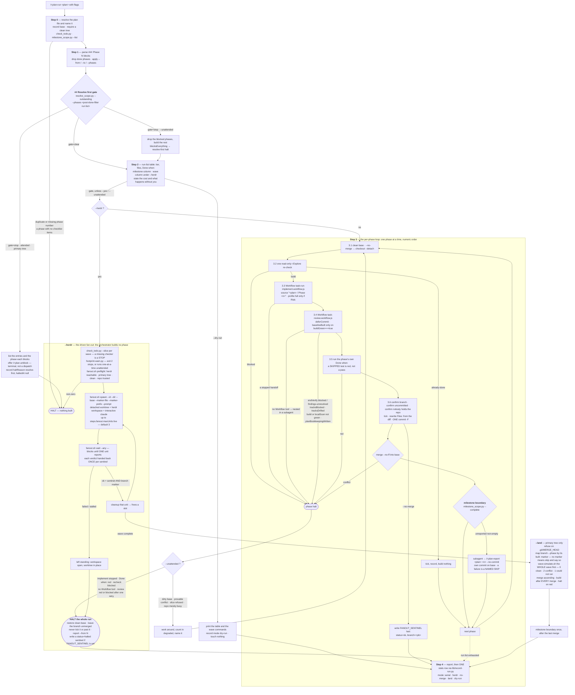

# `plan-run` — behaviour register

What `/r:plan-run` actually does, one atomic claim per entry. IDs are `SB-plan-run-NNN`, stable and
never reissued; see `README.md` beside this file for the format and the rules.

Sources this file was frozen from:

| file | what it holds |
|---|---|
| `skills/plan-run/SKILL.md` | the whole pipeline — Steps 0–4, every flag, the concurrency modes, the non-negotiables |
| `skills/plan-run/references/plan-format.md` | the phase block contract, what counts as done, the write-back |
| `skills/plan-run/references/concurrent-sessions.md` | the git mechanics of `--no-merge` / `--land` / `--herdr` |
| `skills/plan-run/references/stats-fields.md` | every field of the stats row and the question it answers |
| `skills/plan-run/scripts/fanout.sh` | the fan-out: preflight, spawn, wait, status, cleanup |
| `skills/plan-run/scripts/wave-simulate.sh` | the wave dry-merge `--land` runs before it merges anything |
| `skills/plan-run/scripts/footprint-warn.py` | the history check behind the slice preflight |
| `skills/plan-run/scripts/merge-resolve.py` | `--auto-resolve`'s additive-conflict rule |

The skill carries `disable-model-invocation: true`, so no prompt routes to it and its `evals.json`
owes a `behaviour` case rather than the two routing kinds.

## The flow

## Invocation and flags

- **SB-plan-run-001** — The invocation surface is
  `/r:plan-run [<plan>] [--from <n>] [--to <n>] [--phases <n,n>] [--herdr] [--no-merge] [--land]
  [--auto-resolve] [--unattended] [--ask <session>] [--no-reports] [--yes] [--dry-run]`; nothing
  else is a flag this skill honours.
  *States it:* `skills/plan-run/SKILL.md`
  *Enforced by:* —
  *Tested by:* —

- **SB-plan-run-002** — With no `<plan>` argument the file is looked for in a fixed order —
  `docs/*/todo.md` first (where `/r:spec-design` writes), then `todo.md`, `PLAN.md`,
  `IMPLEMENTATION.md` at the repo root — and whatever is found is **named before it is used**,
  because silently picking one of three markdown files is how a run builds against a document
  nobody meant to hand over.
  *States it:* `skills/plan-run/SKILL.md`
  *Enforced by:* —
  *Tested by:* —

- **SB-plan-run-003** — A leading `@` and any trailing `/` are stripped from the path, because
  Claude Code's `@todo.md` arrives verbatim.
  *States it:* `skills/plan-run/SKILL.md`
  *Enforced by:* —
  *Tested by:* —

- **SB-plan-run-004** — Nothing found, or two candidates with nothing to choose between them, is
  the one place an attended run stops for input that is not the gate; under `--unattended` a tie
  takes the first by the documented order and says which.
  *States it:* `skills/plan-run/SKILL.md`
  *Enforced by:* —
  *Tested by:* —

- **SB-plan-run-005** — `--from <n>` starts at that phase whatever the earlier checkboxes say. It
  overrides the ticks in **one direction only**: it may re-run a phase already marked done, and it
  never resurrects a phase before `n`. This is the resume string a halted run reports.
  *States it:* `skills/plan-run/SKILL.md`, `skills/plan-run/references/plan-format.md`
  *Enforced by:* —
  *Tested by:* —

- **SB-plan-run-006** — `--to <n>` stops after that phase, so a plan's `v1 (MVP)` block can be run
  and its `Advanced` block left for later.
  *States it:* `skills/plan-run/SKILL.md`
  *Enforced by:* —
  *Tested by:* —

- **SB-plan-run-007** — `--phases <n,n>` runs exactly those phases whatever their position, and is
  the primitive `--from`/`--to` are sugar over — it is how one session takes a single leaf out of a
  wave.
  *States it:* `skills/plan-run/SKILL.md`
  *Enforced by:* —
  *Tested by:* —

- **SB-plan-run-008** — `--herdr` builds every leaf in a session of its own — a detached worktree
  and a herdr workspace per leaf, each holding a real interactive `claude` session — and lands them
  from the primary tree. **Without it nothing about the skill changes**: the run is the serial loop
  and no worktree is created.
  *States it:* `skills/plan-run/SKILL.md`
  *Enforced by:* `skills/plan-run/scripts/fanout.sh`
  *Tested by:* `skills/plan-run/tests/fanout.test.sh`

- **SB-plan-run-009** — `--herdr` with `--no-merge` or `--land` is a contradiction, since those two
  *are* the halves it drives: refuse and name which one clashed.
  *States it:* `skills/plan-run/SKILL.md`
  *Enforced by:* —
  *Tested by:* —

- **SB-plan-run-010** — `--no-merge` builds, reviews, runs `Done when:`, ticks and commits on the
  phase branch, then stops with the branch unmerged. It changes nothing before the merge.
  *States it:* `skills/plan-run/SKILL.md`
  *Enforced by:* —
  *Tested by:* —

- **SB-plan-run-011** — `--land` merges the phase branches finished by concurrent sessions into the
  base in phase order, runs only from the primary working tree, and builds after each merge.
  *States it:* `skills/plan-run/SKILL.md`, `skills/plan-run/references/concurrent-sessions.md`
  *Enforced by:* —
  *Tested by:* —

- **SB-plan-run-012** — `--auto-resolve` is **off by default**: with `--land` it resolves the
  conflicts that are provably additive instead of stopping on them, then builds and runs the full
  test suite before accepting. Everything it cannot prove is still handed to the user.
  *States it:* `skills/plan-run/SKILL.md`
  *Enforced by:* `skills/plan-run/scripts/merge-resolve.py`
  *Tested by:* `skills/plan-run/tests/merge-resolve.test.sh`

- **SB-plan-run-013** — `--unattended` implies `--yes` and `--auto-resolve` and changes **only what
  counts as a reason to stop**; it does not loosen what counts as a real failure.
  *States it:* `skills/plan-run/SKILL.md`
  *Enforced by:* —
  *Tested by:* —

- **SB-plan-run-014** — `--ask <session>` names a pack-maintainer session watching the tooling;
  defects **in the pack** are reported there and the run continues unchanged. It is documented as
  something to pair with `--unattended`, which otherwise works around a pack defect and leaves
  nobody able to fix it any the wiser.
  *States it:* `skills/plan-run/SKILL.md`
  *Enforced by:* —
  *Tested by:* —

- **SB-plan-run-015** — `--no-reports` suppresses the milestone report only; the phases still
  build, still merge and still tick.
  *States it:* `skills/plan-run/SKILL.md`
  *Enforced by:* —
  *Tested by:* —

- **SB-plan-run-016** — `--yes` skips the approval gate and nothing else: a failed phase still
  halts the run.
  *States it:* `skills/plan-run/SKILL.md`
  *Enforced by:* —
  *Tested by:* —

- **SB-plan-run-017** — `--dry-run` reads the plan, runs the plan check, prints the run list and the
  wave table, records the row, and stops. It **never touches git and never edits a character of the
  plan file**.
  *States it:* `skills/plan-run/SKILL.md`, `skills/plan-run/references/plan-format.md`
  *Enforced by:* —
  *Tested by:* —

- **SB-plan-run-018** — Phase identifiers are numbers; a title is accepted but resolved to a number
  first, because the number is what the handoff string carries.
  *States it:* `skills/plan-run/SKILL.md`
  *Enforced by:* —
  *Tested by:* —

- **SB-plan-run-019** — A long plan is run in two passes — `--dry-run` first, then `--yes` — because
  reading the plan is cheap and a `--yes` run whose phases the user has read is a different thing
  from one nobody looked at.
  *States it:* `skills/plan-run/SKILL.md`
  *Enforced by:* —
  *Tested by:* —

## Step 0 — preconditions, the plan, the base

- **SB-plan-run-020** — Everything uses a **real tool**: a real read and write of the plan file, the
  two real Workflows, the plan's own `Done when:` command actually executed. A phase, a review or a
  done-check is never imitated with a prose summary; a required tool that cannot run stops the run
  and says so.
  *States it:* `skills/plan-run/SKILL.md`
  *Enforced by:* —
  *Tested by:* —

- **SB-plan-run-021** — The run is **not** gated on `gh`, a GitHub remote or the network: a plan is
  a local file and every phase is a local branch.
  *States it:* `skills/plan-run/SKILL.md`
  *Enforced by:* —
  *Tested by:* —

- **SB-plan-run-022** — The base branch is recorded at Step 0; every phase branches off it, merges
  back into it, and starts from that same clean base.
  *States it:* `skills/plan-run/SKILL.md`
  *Enforced by:* —
  *Tested by:* —

- **SB-plan-run-023** — A clean working tree (`git status --porcelain` empty) is required before
  anything runs, because the implement Workflow leaves work uncommitted until a single final commit
  — pre-existing changes would be swept into a phase's commit and into its reviewed diff, the plan
  file included.
  *States it:* `skills/plan-run/SKILL.md`
  *Enforced by:* —
  *Tested by:* —

- **SB-plan-run-024** — Step 0 runs `check_todo.py <plan>` from `/r:spec-design` and treats its
  output as **advisory**, shown at the gate: numbering gaps, missing `Done when:`, oversized phases,
  vague tasks, files referenced before they are created, work that produces a decision rather than a
  diff.
  *States it:* `skills/plan-run/SKILL.md`
  *Enforced by:* `skills/spec-design/scripts/check_todo.py`
  *Tested by:* `skills/spec-design/tests/check_todo.test.sh`

- **SB-plan-run-025** — Two of the checker's findings are **hard stops**: *duplicate or missing
  phase numbers*, because `"<plan> / Phase N"` is the handoff string and an ambiguous `N` sends the
  implementer at the wrong block; and *a phase with no `- [ ]` items at all*, because the checklist
  is where the acceptance criteria come from.
  *States it:* `skills/plan-run/SKILL.md`, `skills/plan-run/references/plan-format.md`
  *Enforced by:* —
  *Tested by:* —

- **SB-plan-run-026** — A **missing** `check_todo.py` at Step 0 is a named skip, not a stop — unlike
  the `--slice` preflight, where a missing checker stops the run outright.
  *States it:* `skills/plan-run/SKILL.md`
  *Enforced by:* —
  *Tested by:* —

- **SB-plan-run-027** — Step 0 also runs `milestone_scope.py <plan> --list`, so the run knows where
  its reports fall before it builds anything. A plan with no `## Milestone N` headings
  (`hasMilestones: false`) gets none, and that is named **once, at the gate**, where the user can
  still change the plan — not discovered per phase after they have walked away.
  *States it:* `skills/plan-run/SKILL.md`
  *Enforced by:* `skills/plan-report/scripts/milestone_scope.py`
  *Tested by:* `skills/plan-report/tests/milestone_scope.test.sh`

- **SB-plan-run-028** — Unmilestoned phases are **never grouped into milestones by the run itself**:
  a grouping nobody authored would be reported as though the plan had asserted it.
  *States it:* `skills/plan-run/SKILL.md`
  *Enforced by:* —
  *Tested by:* —

## Step 1 — the plan, and the `## Resolve first` gate

- **SB-plan-run-029** — The plan file is read **once** and parsed into
  `{ n, title, implements, files[], risk, dependsOn, items[], doneWhen, done }` per `### Phase N`
  block, taken in numeric order.
  *States it:* `skills/plan-run/SKILL.md`
  *Enforced by:* —
  *Tested by:* —

- **SB-plan-run-030** — A phase is `done` only when **every** `- [ ]` item in the block is ticked; a
  partly-ticked phase is not done and goes back in the run list.
  *States it:* `skills/plan-run/SKILL.md`, `skills/plan-run/references/plan-format.md`
  *Enforced by:* —
  *Tested by:* —

- **SB-plan-run-031** — A ticked phase *heading* is respected, but the **items decide**: a heading
  marked done over unticked items is a disagreement, and the run trusts the items and says so in the
  report.
  *States it:* `skills/plan-run/references/plan-format.md`
  *Enforced by:* —
  *Tested by:* —

- **SB-plan-run-032** — Only a `### Phase N` heading makes something buildable. An unnumbered entry
  is **never promoted** into the run list and never numbered by the run.
  *States it:* `skills/plan-run/references/plan-format.md`, `skills/plan-run/SKILL.md`
  *Enforced by:* —
  *Tested by:* —

- **SB-plan-run-033** — `## v1 (MVP)` and `## Advanced` are readability headings, not scopes:
  numbering runs continuously across them, so `--to` is what stops at the v1 line and nothing is
  ever renumbered or restarted at a heading.
  *States it:* `skills/plan-run/references/plan-format.md`
  *Enforced by:* —
  *Tested by:* —

- **SB-plan-run-034** — A `- [ ]` **outside** a `### Phase N` block is not an item this skill ticks:
  `## Resolve first` entries carry identical-looking checkboxes, and they are closed by a person
  through `/r:plan-unblock`. Items are located verbatim *within the phase block*, never by scanning
  the document.
  *States it:* `skills/plan-run/references/plan-format.md`
  *Enforced by:* —
  *Tested by:* —

- **SB-plan-run-035** — The Resolve-first gate is answered by
  `resolve_scope.py <plan> --outstanding --phases <run list>`, and `gate` (`"stop"` | `"clear"`) is
  the whole answer — never an eyeball read of which entries are open, what they block, or whether
  the run may proceed, because all three wrong answers are confident and silent.
  *States it:* `skills/plan-run/SKILL.md`
  *Enforced by:* `skills/plan-unblock/scripts/resolve_scope.py`
  *Tested by:* `skills/plan-unblock/tests/resolve_scope.test.sh`

- **SB-plan-run-036** — The list handed to `--phases` is the **post-done-filter** run list — the
  phases this run will actually build — because that is exactly the carve-out: an entry blocking a
  phase nobody is building today does not stop today's run.
  *States it:* `skills/plan-run/SKILL.md`
  *Enforced by:* `skills/plan-unblock/scripts/resolve_scope.py`
  *Tested by:* `skills/plan-unblock/tests/resolve_scope.test.sh`

- **SB-plan-run-037** — An entry with **no checkbox is unresolved**, because it cannot be ticked and
  plans written before that shape carry no checkbox at all.
  *States it:* `skills/plan-run/SKILL.md`
  *Enforced by:* `skills/plan-unblock/scripts/resolve_scope.py`
  *Tested by:* `skills/plan-unblock/tests/resolve_scope.test.sh`

- **SB-plan-run-038** — An entry whose `Blocks:` is missing or names no phase blocks the **entire**
  run list, because nothing can tell what it was guarding.
  *States it:* `skills/plan-run/SKILL.md`
  *Enforced by:* `skills/plan-unblock/scripts/resolve_scope.py`
  *Tested by:* `skills/plan-unblock/tests/resolve_scope.test.sh`

- **SB-plan-run-039** — A blocked phase that is **already built** comes back in
  `blockedPhasesBuilt` and drops out, so a stale blocker is moot rather than a permanent trap.
  *States it:* `skills/plan-run/SKILL.md`
  *Enforced by:* `skills/plan-unblock/scripts/resolve_scope.py`
  *Tested by:* `skills/plan-unblock/tests/resolve_scope.test.sh`

- **SB-plan-run-040** — On `gate: "stop"` the run lists every outstanding entry **with the phase it
  blocks and its owner**, stops, and offers `/r:plan-unblock <plan>` — a bare halt would leave the
  user hand-editing a plan file.
  *States it:* `skills/plan-run/SKILL.md`
  *Enforced by:* —
  *Tested by:* —

- **SB-plan-run-041** — A Resolve-first stop is recorded with `haltReason: "resolve-first"` and
  `haltedAt: null` — no phase was reached, and a gate stop recorded with no reason reads exactly
  like a clean finish.
  *States it:* `skills/plan-run/SKILL.md`, `skills/plan-run/references/stats-fields.md`
  *Enforced by:* —
  *Tested by:* —

- **SB-plan-run-042** — The `/r:plan-unblock` offer is **terminal, not a dispatch**: Step 1 parsed
  the plan once, and resuming after the entries were closed would build from a run list that
  predates them.
  *States it:* `skills/plan-run/SKILL.md`
  *Enforced by:* —
  *Tested by:* —

- **SB-plan-run-043** — The offer is made **only** from an attended run in the primary tree — never
  under `--unattended`, `--no-merge` or `--dry-run` — because `/r:plan-unblock` closes entries by
  asking a person, and a `--herdr` unit reaching this gate would interview an empty room and write
  the answers into the plan as settled.
  *States it:* `skills/plan-run/SKILL.md`
  *Enforced by:* —
  *Tested by:* —

- **SB-plan-run-044** — Under `--unattended` the blocked phases are dropped from the run list and
  the rest are built, with both halves named in the report: one unresolved question stops one phase,
  not the night.
  *States it:* `skills/plan-run/SKILL.md`
  *Enforced by:* —
  *Tested by:* —

- **SB-plan-run-045** — `blocksEverything` is the case `--unattended` cannot work around: an entry
  naming no phase blocks all of them, so there is nothing left to build and it is the same
  `resolve-first` halt.
  *States it:* `skills/plan-run/SKILL.md`
  *Enforced by:* —
  *Tested by:* —

- **SB-plan-run-046** — An empty run list stops the run with the reason stated — "every phase is
  ticked", "`--from 9` is past the last phase" — rather than a silent no-op.
  *States it:* `skills/plan-run/SKILL.md`
  *Enforced by:* —
  *Tested by:* —

## Step 2 — the run list and the approval gate

- **SB-plan-run-047** — Step 2 prints the run list as a table naming the plan file in its heading,
  one row per phase: number, title, tier, the plan's own `Files:`, and its `Done when:`.
  *States it:* `skills/plan-run/SKILL.md`
  *Enforced by:* —
  *Tested by:* —

- **SB-plan-run-048** — The **Tier** column reads `full` where the phase carries a `**Risk:**` line
  and is **blank** otherwise — blank means *classified by the implement Workflow*, never *low*.
  *States it:* `skills/plan-run/SKILL.md`
  *Enforced by:* —
  *Tested by:* —

- **SB-plan-run-049** — Under `--dry-run` the table is printed, the stats row is recorded with
  `mode: "dry-run"` and `phasesInPlan` set with every other count zero, and the run stops: no
  branch, no commit, and not a character of the plan file.
  *States it:* `skills/plan-run/SKILL.md`, `skills/plan-run/references/stats-fields.md`
  *Enforced by:* —
  *Tested by:* —

- **SB-plan-run-050** — Otherwise the run **pauses for approval** unless `--yes` or `--unattended`
  was passed — the cheap moment to drop phases off either end or fix the plan, since every checker
  note is about a phase nobody has started.
  *States it:* `skills/plan-run/SKILL.md`
  *Enforced by:* —
  *Tested by:* —

- **SB-plan-run-051** — The gate **states the cost plainly** — "5 phases, 5 implement + 5 review
  passes" — because this is the only place the user can change it and the review is the slow half.
  *States it:* `skills/plan-run/SKILL.md`
  *Enforced by:* —
  *Tested by:* —

- **SB-plan-run-052** — The gate says both halves of what happens next: Step 3 runs to the end with
  no further questions, **and** it stops at the first phase that fails and reports the `--from N`
  that resumes. Saying both is what makes it safe for the user to walk away.
  *States it:* `skills/plan-run/SKILL.md`
  *Enforced by:* —
  *Tested by:* —

- **SB-plan-run-053** — Under `--unattended` the gate instead prints, in one sentence, what will and
  will not fetch the user back — the halt column of the unattended table.
  *States it:* `skills/plan-run/SKILL.md`
  *Enforced by:* —
  *Tested by:* —

- **SB-plan-run-054** — When the plan has milestones the gate adds a milestone column and says which
  of them this run would finish, or that none completes in this range — that is where a report will
  be written, and the gate is where `--no-reports` can still be asked for.
  *States it:* `skills/plan-run/SKILL.md`
  *Enforced by:* —
  *Tested by:* —

- **SB-plan-run-055** — Under `--herdr` the gate adds the wave as a column (from the Step 0
  `check_todo.py` run, nothing newly computed) and says plainly that **every** leaf gets a
  workspace, a wave of one included — a user reading "wave 1" beside every row would otherwise
  expect no fan-out at all.
  *States it:* `skills/plan-run/SKILL.md`
  *Enforced by:* —
  *Tested by:* —

## Step 3 — the per-phase loop

- **SB-plan-run-056** — Within a session the run list is worked **one phase at a time, in numeric
  order, never in parallel and never reordered**: Phase 5 is written to build on what Phase 4
  produced, so a plan is the one backlog shape where "fix the cheap ones first" is wrong.
  *States it:* `skills/plan-run/SKILL.md`
  *Enforced by:* —
  *Tested by:* —

- **SB-plan-run-057** — Phases are **never merged or folded together**. Grouping two phases into one
  change — the thing `/r:issues-fix` exists to do — is here a commit that cannot be reverted by
  halves, against premises nobody checked.
  *States it:* `skills/plan-run/SKILL.md`
  *Enforced by:* —
  *Tested by:* —

- **SB-plan-run-058** — Both Workflow calls and the finish run in the **main thread**. Subagents
  have no `Agent` tool; only the main thread and a `Workflow` script can spawn. This is checked, not
  assumed (`ToolSearch` cannot answer it), and a context that can reach neither `Workflow` nor
  `Agent` is nested inside a subagent: stop and tell the user to re-run from a top-level session.
  **Never re-run the fan-out inline and report success.**
  *States it:* `skills/plan-run/SKILL.md`
  *Enforced by:* —
  *Tested by:* —

- **SB-plan-run-059** — Each phase starts from a clean checkout of the recorded base
  (`git checkout <base>`, `git status --porcelain` empty). A tree left dirty by a previous phase is
  a **halt**, not something to clean up and carry on through.
  *States it:* `skills/plan-run/SKILL.md`
  *Enforced by:* —
  *Tested by:* —

- **SB-plan-run-060** — Under `--no-merge` Step 3.1 is `git checkout --detach <base>` instead,
  because a linked worktree cannot claim `<base>` by name while the primary tree holds it. The tree
  must still be clean.
  *States it:* `skills/plan-run/SKILL.md`, `skills/plan-run/references/concurrent-sessions.md`
  *Enforced by:* —
  *Tested by:* —

- **SB-plan-run-061** — Step 3.2 spawns **one** read-only `r:Explore` agent per phase with the phase
  block, returning `{ status: "build" | "already-done" | "blocked", note, filesActual[] }`.
  *States it:* `skills/plan-run/SKILL.md`
  *Enforced by:* —
  *Tested by:* —

- **SB-plan-run-062** — `already-done` ticks the phase's boxes through the Step 3.6 write-back,
  marker and all, records it as *already done*, and moves on **without building anything**.
  *States it:* `skills/plan-run/SKILL.md`
  *Enforced by:* —
  *Tested by:* —

- **SB-plan-run-063** — `blocked` — the phase's premise is gone — is a **halt**: a moved premise
  needs a person or a re-plan, not a guessing implementer.
  *States it:* `skills/plan-run/SKILL.md`
  *Enforced by:* —
  *Tested by:* —

- **SB-plan-run-064** — `build` carries `note` and `filesActual` forward as context. Paths drifting
  is normal and is **not** `blocked`, because `/r:spec-design` writes `Files:` before the code
  exists.
  *States it:* `skills/plan-run/SKILL.md`
  *Enforced by:* —
  *Tested by:* —

- **SB-plan-run-065** — The re-check belongs **per phase, immediately before it runs**, and cannot
  be hoisted into one parallel sweep at the start: Phase 5's premises do not exist until Phase 4 has
  landed.
  *States it:* `skills/plan-run/SKILL.md`
  *Enforced by:* —
  *Tested by:* —

- **SB-plan-run-066** — Step 3.3 implements through
  `Workflow({ scriptPath: "${CLAUDE_PLUGIN_ROOT}/skills/task-run/task-run-implement.workflow.js",
  args: { packRoot, source, base, profile } })` — no review yet.
  *States it:* `skills/plan-run/SKILL.md`
  *Enforced by:* `skills/task-run/task-run-implement.workflow.js`
  *Tested by:* `skills/task-run/tests/control-flow.test.mjs`

- **SB-plan-run-067** — The source string is the **todo-phase shape** `"<plan> / Phase <n>"`, with
  the literal word `Phase`. The workflow re-reads the plan, locates the block, lifts its checklist
  into `criteria[]` and its heading into the task intent, and branches `phase-<slug>`.
  *States it:* `skills/plan-run/SKILL.md`, `skills/plan-run/references/plan-format.md`
  *Enforced by:* `skills/task-run/task-run-implement.workflow.js`
  *Tested by:* `skills/task-run/tests/control-flow.test.mjs`

- **SB-plan-run-068** — **Hand it the reference, never the body.** A phase body pasted in as free
  text is read as `kind: "text"`, whose entire contract is that criteria are left empty for the
  planner to derive — so everything the plan author wrote down is lost.
  *States it:* `skills/plan-run/SKILL.md`, `skills/plan-run/references/plan-format.md`
  *Enforced by:* —
  *Tested by:* —

- **SB-plan-run-069** — `profile: "full"` is passed **when and only when** the phase carries a
  `**Risk:**` line. `/r:spec-design` writes that line only for auth, money, persistence, concurrency
  and security and omits it rather than writing "Risk: low", so a phase without one is one the
  planner made **no** claim about — forcing a tier there overrides a classifier that has read the
  code with a silence that has not.
  *States it:* `skills/plan-run/SKILL.md`, `skills/plan-run/references/plan-format.md`
  *Enforced by:* —
  *Tested by:* —

- **SB-plan-run-070** — The implement handoff is read as
  `{ branch, base, profile, profileReason, profileForced, uiTouched, uiVisualChange, designIntent,
  taskIntent, criteria, planPath, buildGreen, planReview: { ran, passes, raised, applied, dropped } }`,
  with the uncommitted diff left on the branch.
  *States it:* `skills/plan-run/SKILL.md`
  *Enforced by:* `skills/task-run/task-run-implement.workflow.js`
  *Tested by:* `skills/task-run/tests/control-flow.test.mjs`

- **SB-plan-run-071** — A handoff of `{ stopped: <reason>, … }` is a **halt** — the workflow saying
  it cannot honestly continue.
  *States it:* `skills/plan-run/SKILL.md`
  *Enforced by:* —
  *Tested by:* —

- **SB-plan-run-072** — Neither half may be handed to a subagent, and `/r:task-run` must not be
  invoked through the Skill tool as a substitute: nested in a subagent the pipeline cannot reach its
  own explorers, designer, planner, Codex reviewer, implementers or build runner, collapses to a
  single context and still reports success — and the Skill route would load a whole run into the
  caller's context, which by the fourth phase would be compacting.
  *States it:* `skills/plan-run/SKILL.md`
  *Enforced by:* —
  *Tested by:* —

- **SB-plan-run-073** — Step 3.4 reviews through
  `Workflow({ scriptPath: "${CLAUDE_PLUGIN_ROOT}/skills/task-review/task-review.workflow.js",
  args: { packRoot, deferCommit: true, taskIntent, baselineBuilt } })`, with `deferCommit` so the
  review's fixes fold into the single final commit.
  *States it:* `skills/plan-run/SKILL.md`
  *Enforced by:* `skills/task-review/task-review.workflow.js`
  *Tested by:* `skills/task-review/tests/control-flow.test.mjs`

- **SB-plan-run-074** — `taskIntent` comes from the handoff, and a non-empty `designIntent` is
  appended as one clause (`… Design intent: <designIntent>`) so the UI verifier judges the pages
  against the design phase's bar rather than generic taste.
  *States it:* `skills/plan-run/SKILL.md`
  *Enforced by:* —
  *Tested by:* —

- **SB-plan-run-075** — `baselineBuilt: true` is passed **only** when the handoff says
  `buildGreen: true`, never on `"n/a"` or `false`. The implement half has just run a clean green
  build on this branch in this tree; without the flag the review repeats it — the most expensive
  step in the loop on a multi-module JVM project, paid once per phase — while `"n/a"` means no build
  ran at all, so passing it there would skip the run's only clean build.
  *States it:* `skills/plan-run/SKILL.md`
  *Enforced by:* —
  *Tested by:* —

- **SB-plan-run-076** — `profile` and `uiTouched` are passed **only** when the handoff says
  `profileForced: true`; otherwise both are left out so the review classifies from the diff it is
  about to read — better evidence than a `Risk:` line written before the code existed.
  *States it:* `skills/plan-run/SKILL.md`
  *Enforced by:* —
  *Tested by:* —

- **SB-plan-run-077** — The review **must** have run as the Workflow: a real run returns a Run ID
  (`wf_…`), and that id is recorded as proof. If the `Workflow` tool is unavailable here the whole
  `/r:plan-run` is nested inside a subagent and `/r:task-review` would silently degrade to prose —
  **halt and warn loudly**. Never merge a phase whose review could not run as the Workflow.
  *States it:* `skills/plan-run/SKILL.md`
  *Enforced by:* —
  *Tested by:* —

- **SB-plan-run-078** — **A Workflow that returns is not a review that passed.** The `wf_…` proves
  the pipeline ran, not what it found, so the result is read before the merge.
  *States it:* `skills/plan-run/SKILL.md`
  *Enforced by:* —
  *Tested by:* —

- **SB-plan-run-079** — `endVerify: "blocked"` blocks the merge: the mandatory Codex pass over the
  **final** diff did not run, so everything the review's own fixers changed is unreviewed.
  *States it:* `skills/plan-run/SKILL.md`
  *Enforced by:* —
  *Tested by:* —

- **SB-plan-run-080** — `endVerify: "findings-unresolved"` blocks the merge too: outstanding is
  outstanding whether or not anyone attempted it, and a gate that reads only `blocked` merges the
  one state the pipeline went out of its way to distinguish from a pass.
  *States it:* `skills/plan-run/SKILL.md`
  *Enforced by:* —
  *Tested by:* —

- **SB-plan-run-081** — A non-empty `tracksBlocked` blocks the merge: a track died, so whatever it
  covers had no reader.
  *States it:* `skills/plan-run/SKILL.md`
  *Enforced by:* —
  *Tested by:* —

- **SB-plan-run-082** — A non-empty `tracksDrifted` blocks the merge: a track ran and read a
  *different* changeset, so its clean report is about a diff that is not this one.
  *States it:* `skills/plan-run/SKILL.md`
  *Enforced by:* —
  *Tested by:* —

- **SB-plan-run-083** — `build` or `localScan` **not green** blocks the merge, and `"n/a"` is not
  green — it means no build ran at all. The gate is phrased as "not green" rather than "red" because
  on a project whose build tool the review does not detect nothing is ever red: measured, **33
  recorded reviews returned `build: "n/a"`, 31 of them over Go worktrees carrying 42k added lines
  reviewed without a single compile or test**.
  *States it:* `skills/plan-run/SKILL.md`
  *Enforced by:* —
  *Tested by:* —

- **SB-plan-run-084** — A non-empty `planBookkeepingWritten` blocks the merge: the diff already
  ticks a checkbox or writes a `built:` marker, which is a claim nothing has passed — Step 3.6 ticks
  *after* this gate, from criteria the review verified, and the `built:` marker is what `--land`
  keys on. The review reports it and cannot repair it, because only the caller knows which edits in
  that file were its own: revert exactly those files (`git checkout -- <paths>`) and re-read the
  verdict.
  *States it:* `skills/plan-run/SKILL.md`
  *Enforced by:* `skills/task-review/task-review.workflow.js`
  *Tested by:* `skills/task-review/tests/control-flow.test.mjs`

- **SB-plan-run-085** — Any of those verdict states means part of the change had no reader or
  carries a claim nothing checked: **do not merge** — re-run the blocked step until it genuinely
  runs, fix what is outstanding, or halt.
  *States it:* `skills/plan-run/SKILL.md`
  *Enforced by:* —
  *Tested by:* —

- **SB-plan-run-086** — Step 3.5 runs the phase's own `Done when:` command and records its output.
  *States it:* `skills/plan-run/SKILL.md`
  *Enforced by:* —
  *Tested by:* —

- **SB-plan-run-087** — **A green review is not a green `Done when:`.** The review certifies the
  *diff*; `Done when:` is the plan author's claim about what the phase was *for*, and the only check
  that catches a phase implemented cleanly that still did not deliver. A failing `Done when:` after
  a passing review is a **halt**, and both results are reported, because "review green, done-when
  red" tells the user the phase's criteria and its plan disagree.
  *States it:* `skills/plan-run/SKILL.md`
  *Enforced by:* —
  *Tested by:* —

- **SB-plan-run-088** — `Done when:` that is prose with no runnable command is recorded as **merged,
  done-check skipped** — a named skip, never a silent pass.
  *States it:* `skills/plan-run/SKILL.md`, `skills/plan-run/references/plan-format.md`
  *Enforced by:* —
  *Tested by:* —

- **SB-plan-run-089** — **An exit code is not a result when the command runs tests: a SKIPPED test
  exits 0.** A `Done when:` naming tests is green only when those tests **ran and passed** — run it
  verbosely (`go test -v`, `pytest -v`) and treat `--- SKIP:`, `SKIPPED`, `@Disabled` or an empty
  result set as a **red** done-check. This is the recorded backstop for a review fixer that answered
  "this test is vacuous" by inserting `t.Skip("env view render not yet implemented")` above the
  unchanged body, leaving the phase's own gate green over a feature that did not exist.
  *States it:* `skills/plan-run/SKILL.md`
  *Enforced by:* —
  *Tested by:* —

- **SB-plan-run-090** — Step 3.6 confirms HEAD is on the phase branch `<pb>` and never `<base>`
  (`git rev-parse --abbrev-ref HEAD`) — the check that stops a whole phase landing on `main`.
  *States it:* `skills/plan-run/SKILL.md`
  *Enforced by:* —
  *Tested by:* —

- **SB-plan-run-091** — `--abbrev-ref` prints the literal word `HEAD` on a detached checkout, so the
  comparison passes on a unit that is on no branch at all — which under `--no-merge` is the shape
  Step 3.1 *mandates*. `git symbolic-ref -q --short HEAD` is the question that distinguishes them,
  and a detached HEAD is put back on `<pb>` **before** merging, because merging `<pb>` while it
  points at the old base merges nothing and reports success.
  *States it:* `skills/plan-run/SKILL.md`
  *Enforced by:* —
  *Tested by:* —

- **SB-plan-run-092** — The work is confirmed **still uncommitted** (`git status --porcelain`
  non-empty): the implement half's contract is that it leaves the diff uncommitted so the reviewer
  reads it, and a clean tree with HEAD off `<base>` means something inside the run committed — the
  review then reads only the caller's later edits and certifies a change it never saw. The handoff
  names this as `treeCommitted: true` alongside `headDetached`, and `git reset --soft <base>` on the
  intended branch restores the documented shape with nothing lost.
  *States it:* `skills/plan-run/SKILL.md`
  *Enforced by:* —
  *Tested by:* —

- **SB-plan-run-093** — Before the merge, the run confirms nobody else is holding the repo:
  `.git/MERGE_HEAD` present is an unfinished merge, and `<base>` at a different commit than Step 0
  read is another session that landed something meanwhile. Either is a **halt** — merging over it
  sweeps another run's work into this phase's commit or resolves against a base nobody reviewed —
  and `<pb>` is left in place for `--land`.
  *States it:* `skills/plan-run/SKILL.md`
  *Enforced by:* —
  *Tested by:* —

- **SB-plan-run-094** — The phase is ticked **after the review and the done-check and before
  staging**: after the review so the reviewer's diff is code and not a bookkeeping edit its
  doc-consistency hunter has to rule on, before the commit so "built" and "ticked" land together and
  revert together.
  *States it:* `skills/plan-run/SKILL.md`, `skills/plan-run/references/plan-format.md`
  *Enforced by:* —
  *Tested by:* —

- **SB-plan-run-095** — Only items **actually implemented and verified** are flipped `- [ ]` →
  `- [x]`; a partial phase leaves partial ticks, which is an honest record rather than a defect, and
  no item is ever ticked to make a phase look finished.
  *States it:* `skills/plan-run/SKILL.md`, `skills/plan-run/references/plan-format.md`
  *Enforced by:* —
  *Tested by:* —

- **SB-plan-run-096** — Every item is re-located by its **verbatim text**, never by a line number
  read at parse time — the number stops being true the moment anything edits the file. If the text
  is gone the file is left alone and the phase is reported **built-but-unticked**, by name.
  *States it:* `skills/plan-run/references/plan-format.md`, `skills/plan-run/SKILL.md`
  *Enforced by:* —
  *Tested by:* —

- **SB-plan-run-097** — When every item is ticked the heading is marked too and carries the branch
  as `<!-- built: phase-<slug> -->`. That marker is what `--land` maps a branch back to a phase by,
  since branches are named `phase-<slug>` and not `phase-<n>`.
  *States it:* `skills/plan-run/references/plan-format.md`, `skills/plan-run/SKILL.md`
  *Enforced by:* `skills/plan-run/scripts/fanout.sh`
  *Tested by:* `skills/plan-run/tests/fanout.test.sh`

- **SB-plan-run-098** — The phase's `Files:` line is **rewritten from the diff** in the same edit as
  the ticks, from `git diff --name-only <base>...<pb>` minus generated artefacts (anything under
  `.claude/`, a `testdata/` segment, any `.golden` file). It overwrites rather than appends because
  it is a measurement replacing a guess: the line is written before the code exists, so it names
  what a feature *carries* and never what it must touch to be wired in — **one phase declared three
  files and changed eleven**, and the eight it did not declare were the hub files every other phase
  in that package also reached. Nothing else can correct it, and `check_todo.py --slice` reads it.
  *States it:* `skills/plan-run/references/plan-format.md`, `skills/plan-run/SKILL.md`
  *Enforced by:* —
  *Tested by:* —

- **SB-plan-run-099** — The write-back is **idempotent** — an item already ticked or a heading
  already carrying the marker is left exactly as it is — with `Files:` the one exception, rewritten
  from the diff every time the phase commits. A phase whose plan carried no `Files:` line gains one;
  **a halted phase writes nothing**, because a partial footprint is worse than none, reading as
  measured.
  *States it:* `skills/plan-run/references/plan-format.md`
  *Enforced by:* —
  *Tested by:* —

- **SB-plan-run-100** — The document is **never restructured**: no reflowing, no moving a phase under
  a different heading, no renumbering, no tidying a hand-written checklist.
  *States it:* `skills/plan-run/references/plan-format.md`
  *Enforced by:* —
  *Tested by:* —

- **SB-plan-run-101** — Everything lands as **one commit** on `<pb>` — implementation, the review's
  fixes, the ticks — and the message is written to a file and committed with `git commit -F <file>`,
  **never inline `-m`**: these messages carry phase titles, backticks and quotes straight from the
  plan, and a single stray double-quote breaks the shell mid-commit.
  *States it:* `skills/plan-run/SKILL.md`
  *Enforced by:* —
  *Tested by:* —

- **SB-plan-run-102** — The merge into base is idempotent: `git merge-base --is-ancestor <pb> <base>`
  means already merged, so skip; otherwise `git checkout <base> && git merge --no-ff <pb>`, then
  delete the branch. **A conflicting merge is a halt — surface it, never force it.**
  *States it:* `skills/plan-run/SKILL.md`
  *Enforced by:* —
  *Tested by:* —

- **SB-plan-run-103** — Under `--no-merge` Step 3.6 stops after the commit — no merge, no branch
  deletion — and reports the branch name. Nothing earlier changes: the phase is still reviewed,
  still done-checked, still ticked, still one commit. **A concurrent session is not a lesser run.**
  *States it:* `skills/plan-run/SKILL.md`, `skills/plan-run/references/concurrent-sessions.md`
  *Enforced by:* —
  *Tested by:* —

- **SB-plan-run-104** — If `FANOUT_SENTINEL` is set, the outcome is written there as the **very last
  action** — `status=ok` and `branch=<pb>`. An interactive session never exits and yields no status,
  so this file is the only way the orchestrator learns the run ended rather than stalled; last,
  because a sentinel written before the commit would announce work not yet on the branch.
  *States it:* `skills/plan-run/SKILL.md`, `skills/plan-run/references/concurrent-sessions.md`
  *Enforced by:* `skills/plan-run/scripts/fanout.sh`
  *Tested by:* `skills/plan-run/tests/fanout.test.sh`

- **SB-plan-run-105** — A plan file **outside the repo or untracked** has no commit to ride in: it is
  ticked anyway and that is said in the report, because reverting the phase would otherwise leave
  the plan still claiming the work.
  *States it:* `skills/plan-run/SKILL.md`, `skills/plan-run/references/plan-format.md`
  *Enforced by:* —
  *Tested by:* —

- **SB-plan-run-106** — Eight things halt the whole run: `{ stopped: … }` from the implement half, an
  unavailable `Workflow` tool, a blocked or not-green review, a failed `Done when:`, a merge
  conflict, a dirty base, a `blocked` re-check, and a refused `--slice` preflight.
  *States it:* `skills/plan-run/SKILL.md`
  *Enforced by:* —
  *Tested by:* —

- **SB-plan-run-107** — A halt restores a clean base branch and leaves the failed phase's branch in
  place, unmerged and named in the report.
  *States it:* `skills/plan-run/SKILL.md`
  *Enforced by:* —
  *Tested by:* —

- **SB-plan-run-108** — **Never tick a phase that halted, and never tick past it.**
  *States it:* `skills/plan-run/SKILL.md`
  *Enforced by:* —
  *Tested by:* —

- **SB-plan-run-109** — A halt reports which phase stopped it, why, and the exact resume command
  `/r:plan-run <plan> --from <n>`.
  *States it:* `skills/plan-run/SKILL.md`
  *Enforced by:* —
  *Tested by:* —

- **SB-plan-run-110** — On a halt with `FANOUT_SENTINEL` set, a **failure sentinel** is written —
  `status=halted`, the branch if there is one, and `reason=<the halt>` — because a halt that writes
  nothing is indistinguishable from a session still thinking and the orchestrator would sit on it
  until the timeout.
  *States it:* `skills/plan-run/SKILL.md`
  *Enforced by:* `skills/plan-run/scripts/fanout.sh`
  *Tested by:* `skills/plan-run/tests/fanout.test.sh`

- **SB-plan-run-111** — A halt still goes to Step 4 and records the run: a halted run that records
  nothing is how the store comes to hold only successes.
  *States it:* `skills/plan-run/SKILL.md`
  *Enforced by:* —
  *Tested by:* —

- **SB-plan-run-112** — Halting the whole run is **deliberately the opposite of `/r:issues-fix`**,
  where items are independent and one failure is one item's. Here carrying on past a failure builds
  real code on a premise that is not true — silently, because everything after the break still
  compiles and merges.
  *States it:* `skills/plan-run/SKILL.md`
  *Enforced by:* —
  *Tested by:* —

## The milestone boundary

- **SB-plan-run-113** — When the last unticked leaf of a `## Milestone N — name` lands, **one report
  per milestone** is written by `/r:plan-report` — the real skill, never a summary written inline.
  *States it:* `skills/plan-run/SKILL.md`
  *Enforced by:* —
  *Tested by:* —

- **SB-plan-run-114** — The report's slot is forced, not chosen: **on base, after the merge, as its
  own commit.** It describes *merged* code so it cannot be written before the merge; the phase's
  commit is sealed one step earlier so "built" and "ticked" revert together; and a report written
  onto a phase branch would work serially and be impossible concurrently, where a unit's wave-mates
  land later from another tree. It takes the slot the reuse-index refresh already occupies.
  *States it:* `skills/plan-run/SKILL.md`, `skills/plan-run/references/concurrent-sessions.md`
  *Enforced by:* —
  *Tested by:* —

- **SB-plan-run-115** — The whole boundary is skipped under `--no-reports` or `--dry-run`, on a plan
  with no milestone headings, and in a `--no-merge` unit — which never merges and cannot see its
  wave-mates.
  *States it:* `skills/plan-run/SKILL.md`
  *Enforced by:* —
  *Tested by:* —

- **SB-plan-run-116** — **Ask, don't count.** `milestone_scope.py <plan> --complete` returns
  `unreported` — milestones whose every leaf is ticked and which have no report on disk — and
  reading the markdown and counting checkboxes instead is the one thing this step must not do: a
  milestone called complete one phase early still produces a document that reads as authoritative.
  Deriving it from disk is also what makes the step idempotent across a resumed run.
  *States it:* `skills/plan-run/SKILL.md`
  *Enforced by:* `skills/plan-report/scripts/milestone_scope.py`
  *Tested by:* `skills/plan-report/tests/milestone_scope.test.sh`

- **SB-plan-run-117** — The report is dispatched as a **subagent**, one per milestone in ascending
  order, whose whole brief is to invoke `/r:plan-report <plan> <n> --no-commit` through the Skill
  tool and return `{ written, path, diagrams, snippets, blocked }`. A subagent rather than inline
  because a report is a multi-thousand-line HTML document that would be re-read as context on every
  phase that follows.
  *States it:* `skills/plan-run/SKILL.md`
  *Enforced by:* —
  *Tested by:* —

- **SB-plan-run-118** — The subagent reaches the real skill because `/r:plan-report` carries no
  `disable-model-invocation` flag; that the Skill tool actually loaded it is checked, and a subagent
  that summarised the milestone in prose instead is a **failed** report, not a written one.
  *States it:* `skills/plan-run/SKILL.md`
  *Enforced by:* —
  *Tested by:* —

- **SB-plan-run-119** — **The caller owns git; the subagent does not.** It returns a path; that one
  file is staged and committed alone on base as `docs: milestone <n> report`, and the tree is
  confirmed clean before the next phase starts. `--no-commit` is what keeps the two from both
  reaching for the index.
  *States it:* `skills/plan-run/SKILL.md`
  *Enforced by:* —
  *Tested by:* —

- **SB-plan-run-120** — **A report that cannot be written is a named SKIP, never a halt** — recorded
  as *milestone N — report skipped: <reason>*, counted, and the run continues. Nothing downstream
  reads the report, and halting a green plan over a document would throw away work already merged.
  The terminal-UI exception to "real tools, or a named skip" does not apply, because nothing in the
  plan *declared* a report the way a `/test-app` declares a terminal surface.
  *States it:* `skills/plan-run/SKILL.md`
  *Enforced by:* —
  *Tested by:* —

- **SB-plan-run-121** — Under `--herdr` and `--land` the boundary check runs **once, after the wave**
  rather than per phase — a milestone can straddle waves, so a per-unit check would fire on a
  milestone whose remaining leaves are still being built elsewhere. It sits after the last merge and
  its green build, and **before** the stats row.
  *States it:* `skills/plan-run/SKILL.md`, `skills/plan-run/references/concurrent-sessions.md`
  *Enforced by:* —
  *Tested by:* —

## Running phases concurrently

- **SB-plan-run-122** — Leaves in the same derived **wave** have no dependency between them and share
  no file, so they can be built at the same time, one `/r:plan-run` session each.
  `references/concurrent-sessions.md` is the mechanics and **must be read before running either
  `--no-merge` or `--land`**.
  *States it:* `skills/plan-run/SKILL.md`, `skills/plan-run/references/concurrent-sessions.md`
  *Enforced by:* —
  *Tested by:* —

- **SB-plan-run-123** — The git fact that decides the shape: a linked worktree cannot check out
  `<base>` by name while the primary tree holds it, so Step 3.6's
  `git checkout <base> && git merge --no-ff` cannot run from a concurrent session at all.
  `git worktree add --detach <path> <base>` gives a clean tree at base without claiming the ref.
  **Concurrent sessions build and commit; they never merge, and a separate `--land` pass merges from
  the primary tree.**
  *States it:* `skills/plan-run/references/concurrent-sessions.md`, `skills/plan-run/SKILL.md`
  *Enforced by:* —
  *Tested by:* —

- **SB-plan-run-124** — **One session, one worktree, always.** Two sessions in one working directory
  destroy each other — each leaves an uncommitted tree the other is about to stage — and because it
  is the first thing anyone will try, it is a preflight **refusal** rather than a warning.
  *States it:* `skills/plan-run/SKILL.md`
  *Enforced by:* —
  *Tested by:* —

- **SB-plan-run-125** — Which tree a session is in is decided by
  `[ "$(git rev-parse --git-dir)" != "$(git rev-parse --git-common-dir)" ]`; `--no-merge` requires a
  linked worktree and `--land` the primary one, and both refuse otherwise because both failures are
  quiet.
  *States it:* `skills/plan-run/references/concurrent-sessions.md`
  *Enforced by:* `skills/plan-run/scripts/fanout.sh`
  *Tested by:* `skills/plan-run/tests/fanout.test.sh`

- **SB-plan-run-126** — Preflight step 1: a `--no-merge` run **from the primary working tree is
  refused**, because it would strand the user's own checkout on a phase branch with a finished
  commit and no merge. The `git worktree add --detach` command is printed instead.
  *States it:* `skills/plan-run/SKILL.md`
  *Enforced by:* —
  *Tested by:* —

- **SB-plan-run-127** — Preflight step 2: `check_todo.py --slice <n,n>` verifies the slice against
  the graph and answers only the concurrency question — a dependency not built yet, a dependency
  inside the same slice, two members sharing a file — staying deliberately quiet about plan quality,
  since refusing to start over a missing `Implements:` line would be noise at the worst moment.
  *States it:* `skills/plan-run/SKILL.md`, `skills/plan-run/references/concurrent-sessions.md`
  *Enforced by:* `skills/spec-design/scripts/check_todo.py`
  *Tested by:* `skills/spec-design/tests/check_todo.test.sh`

- **SB-plan-run-128** — A non-zero `--slice` exit is a **stop**, and a **missing checker is a stop
  too** — the one place in this pack where a missing tool is not a named skip, because nothing else
  verifies the slice and the failure it prevents is two agents writing the same file at once.
  *States it:* `skills/plan-run/SKILL.md`, `skills/plan-run/references/concurrent-sessions.md`
  *Enforced by:* —
  *Tested by:* —

- **SB-plan-run-129** — Under `--unattended` a slice **refusal** degrades instead of stopping: that
  wave's leaves run **one unit at a time**, in numeric order, landed before the next is cut, and the
  refusal is named in the report. What degrades is the schedule, never where the work happens. A
  **missing** checker is still a stop, unattended or not — not knowing whether the slice is safe is a
  different thing from knowing it is not.
  *States it:* `skills/plan-run/SKILL.md`
  *Enforced by:* —
  *Tested by:* —

- **SB-plan-run-130** — Preflight step 3: `footprint-warn.py <plan> --slice <n,n> --base <base>` asks
  what the plan cannot know — in the packages these leaves land in, what has every earlier phase
  *actually* touched — off git history rather than a prediction, so it needs no model and runs
  unasked.
  *States it:* `skills/plan-run/SKILL.md`, `skills/plan-run/references/concurrent-sessions.md`
  *Enforced by:* `skills/plan-run/scripts/footprint-warn.py`
  *Tested by:* `skills/plan-run/tests/footprint-warn.test.sh`

- **SB-plan-run-131** — `footprint-warn` **exit 2 is a risk, not an error**, and the response depends
  on the mode: serially, print it and carry on, since the cost of being wrong is one merge conflict;
  under `--herdr`, **stop**, since the cost is a whole wave built over hours; under
  `--herdr --unattended`, run that wave one unit at a time, landed between, and name it.
  *States it:* `skills/plan-run/SKILL.md`, `skills/plan-run/references/concurrent-sessions.md`
  *Enforced by:* —
  *Tested by:* —

- **SB-plan-run-132** — `footprint-warn` exit 0 covers both "looks clean" and "not enough history to
  judge" **and says which**; exit 1 is usage or git trouble and is a named skip, because this check
  improves the preflight rather than being it.
  *States it:* `skills/plan-run/SKILL.md`, `skills/plan-run/references/concurrent-sessions.md`
  *Enforced by:* `skills/plan-run/scripts/footprint-warn.py`
  *Tested by:* `skills/plan-run/tests/footprint-warn.test.sh`

- **SB-plan-run-133** — A package is only named when it is claimed by two running leaves **and** has
  established hub files: a file must appear in at least `HUB_MIN = 3` of the package's commits and
  at least `HUB_SHARE = 0.25` of its most-touched file's count. Generated artefacts are excluded via
  the checker's own `comparable()`, so a captured frame is never named as a hub file.
  *States it:* `skills/plan-run/scripts/footprint-warn.py`
  *Enforced by:* `skills/plan-run/scripts/footprint-warn.py`
  *Tested by:* `skills/plan-run/tests/footprint-warn.test.sh`

- **SB-plan-run-134** — `footprint-warn` shares **one** plan parser with `check_todo.py` by loading
  it, rather than keeping a private copy: two parsers disagreeing about which files a phase declares
  would be a worse failure than either being wrong, because the warning would be about a phase the
  checker never saw. It sets `sys.dont_write_bytecode` so a read-only preflight leaves no
  `__pycache__` in the installed pack.
  *States it:* `skills/plan-run/scripts/footprint-warn.py`
  *Enforced by:* `skills/plan-run/scripts/footprint-warn.py`
  *Tested by:* —

- **SB-plan-run-135** — The two answers to a footprint risk are both put in the report: run one leaf
  per package at a time, or correct the `Files:` lines from the code that now exists and re-run.
  Step 3.6 does the second for every phase from here on, so the warning shrinks as the plan builds
  out.
  *States it:* `skills/plan-run/SKILL.md`, `skills/plan-run/references/concurrent-sessions.md`
  *Enforced by:* —
  *Tested by:* —

- **SB-plan-run-136** — Under `--no-merge` exactly **two** steps of the loop change — 3.1 detaches
  and 3.6 stops after the commit. The re-check, both Workflows, the `Done when:` check, the tick and
  the single commit are unchanged.
  *States it:* `skills/plan-run/SKILL.md`
  *Enforced by:* —
  *Tested by:* —

- **SB-plan-run-137** — `--dry-run` prints the worktree/`--no-merge`/`--land` command block **only
  for a wave with more than one unbuilt leaf**: the block is a recipe for a human to run by hand in
  a second terminal, and a table of hopeful commands over single-leaf waves buries the waves where
  it pays.
  *States it:* `skills/plan-run/SKILL.md`
  *Enforced by:* —
  *Tested by:* —

- **SB-plan-run-138** — Under `--dry-run --herdr` the same block is printed as the `spawn` calls that
  would be made, **one for every wave including single-leaf ones** — under the flag those are
  spawned too, so leaving them out would show a run smaller than the one about to happen — and then
  the run stops: no worktree, no workspace, nothing on screen.
  *States it:* `skills/plan-run/SKILL.md`
  *Enforced by:* —
  *Tested by:* —

- **SB-plan-run-139** — The plan file is **excluded from the wave collision check**, because every
  phase ticks it. Git merges ticks in separate regions cleanly, and where two phases sit adjacent
  enough to conflict the resolution is always **both sides' ticks** — each branch ticked what it
  genuinely built, and taking one side wholesale silently un-ticks finished work so the next run
  offers that phase again.
  *States it:* `skills/plan-run/SKILL.md`, `skills/plan-run/references/concurrent-sessions.md`
  *Enforced by:* `skills/plan-run/scripts/merge-resolve.py`
  *Tested by:* `skills/plan-run/tests/merge-resolve.test.sh`

- **SB-plan-run-140** — The **reuse index** is refreshed after the wave and never inside it: no unit
  writes it (`/r:task-review` skips its refresh in a linked worktree), and one `/r:reuse-index` runs
  from the primary tree after the last merge as its own commit, skipped silently when the project
  has no index. Unlike the plan file, a union is wrong here — the index is *derived* from the whole
  `.task-plans/` corpus, so two derivations each computed against a partial corpus are only correct
  by accident and the count column is not even defined under such a union.
  *States it:* `skills/plan-run/references/concurrent-sessions.md`
  *Enforced by:* —
  *Tested by:* —

## `--herdr` — the driven form

- **SB-plan-run-141** — `--herdr` runs the concurrency block instead of printing it, and everything
  that makes concurrency *safe* is unchanged: the waves, the `--slice` preflight, `--no-merge` in a
  detached worktree, `--land` from the primary tree.
  *States it:* `skills/plan-run/SKILL.md`
  *Enforced by:* —
  *Tested by:* —

- **SB-plan-run-142** — Each leaf gets a **full interactive `claude` session**, never `claude -p` —
  the point of routing through herdr: the work is visible in a workspace the user can open, answer a
  question in, or take over.
  *States it:* `skills/plan-run/SKILL.md`, `skills/plan-run/references/concurrent-sessions.md`
  *Enforced by:* `skills/plan-run/scripts/fanout.sh`
  *Tested by:* `skills/plan-run/tests/fanout.test.sh`

- **SB-plan-run-143** — The orchestrator **builds no phase itself** — not merely none while a wave is
  in flight. It holds the primary tree at `<base>` for the whole run, the only tree that can check
  out `<base>` to land what the units produce, and keeps it clean throughout so `preflight`'s
  clean-tree check holds for the run rather than only between waves.
  *States it:* `skills/plan-run/SKILL.md`
  *Enforced by:* —
  *Tested by:* —

- **SB-plan-run-144** — The mechanics live in `skills/plan-run/scripts/fanout.sh` rather than prose
  because it decides two things a model must never decide by reading a screen — whether the tooling
  is there, and whether a unit is finished — and both fail by returning a confident wrong answer.
  The same script is reached by `/r:issues-fix`: one protocol, one script.
  *States it:* `skills/plan-run/SKILL.md`
  *Enforced by:* `skills/plan-run/scripts/fanout.sh`
  *Tested by:* `skills/plan-run/tests/fanout.test.sh`

- **SB-plan-run-145** — **Every leaf is spawned, including a wave of one.** There is no inline path
  under this flag: a solo leaf gets the same detached worktree and the same workspace as a leaf with
  three siblings. What it buys is that every unit is reported the same way whatever its schedule (a
  sentinel **and** a marker), every unit is watchable and take-overable, and the orchestrator's
  context never holds an implement+review.
  *States it:* `skills/plan-run/SKILL.md`, `skills/plan-run/references/concurrent-sessions.md`
  *Enforced by:* —
  *Tested by:* —

- **SB-plan-run-146** — **A solo wave lands before the next one spawns.**
  `git worktree add --detach <base>` pins a unit's tree to whatever `<base>` pointed at when the
  worktree was made, so a queue of solo spawns with no merge between them is a concurrent wave
  wearing a queue — exactly the collision the `--slice` preflight exists to refuse. Serial under
  this flag means *one live unit, landed before the next is created*, never *spawned in order*, and
  the landing step then runs per unit rather than per wave.
  *States it:* `skills/plan-run/SKILL.md`, `skills/plan-run/references/concurrent-sessions.md`
  *Enforced by:* —
  *Tested by:* —

- **SB-plan-run-147** — `fanout.sh preflight` checks four things — herdr reachable, this is the
  primary tree, the tree is clean, and **the repo has been trusted in Claude Code** — and a non-zero
  exit is a **stop**: elsewhere a missing tool is a named skip, but `--herdr` was typed on purpose
  and quietly running serially would hand back something other than what was asked for. Say what was
  missing and offer the serial run as the user's choice.
  *States it:* `skills/plan-run/SKILL.md`, `skills/plan-run/references/concurrent-sessions.md`
  *Enforced by:* `skills/plan-run/scripts/fanout.sh`
  *Tested by:* `skills/plan-run/tests/fanout.test.sh`

- **SB-plan-run-148** — One `spawn` per leaf, shaped
  `fanout.sh spawn --id "phase-<n>" --dir "../<repo>-p<n>" --base "<base>" --marker-file "<plan>"
  --marker-prefix 'built: ' --prompt "/r:plan-run <plan> --phases <n> --no-merge --yes [--ask
  <session>]"`. The `--marker-*` pair lets `wait` check the branch itself rather than trusting the
  session's own account.
  *States it:* `skills/plan-run/SKILL.md`, `skills/plan-run/references/concurrent-sessions.md`
  *Enforced by:* `skills/plan-run/scripts/fanout.sh`
  *Tested by:* `skills/plan-run/tests/fanout.test.sh`

- **SB-plan-run-149** — The window is rolled with **`wait --any`, then `cleanup` that unit, then
  `spawn` the next — a loop, not one call.** A bare `wait` blocks until *every* unit in the set has
  reported, holding all three slots until the slowest finishes while a queued leaf waits behind a
  unit that came back an hour ago: batches, not a window.
  *States it:* `skills/plan-run/SKILL.md`, `skills/plan-run/references/concurrent-sessions.md`
  *Enforced by:* `skills/plan-run/scripts/fanout.sh`
  *Tested by:* `skills/plan-run/tests/fanout.test.sh`

- **SB-plan-run-150** — `cleanup` runs **the moment a unit comes back ok**: a stale worktree is what
  the next `spawn` collides with, a finished workspace looks like a working one in the sidebar, and
  the freed slot is what admits the next queued leaf.
  *States it:* `skills/plan-run/SKILL.md`, `skills/plan-run/references/concurrent-sessions.md`
  *Enforced by:* `skills/plan-run/scripts/fanout.sh`
  *Tested by:* `skills/plan-run/tests/fanout.test.sh`

- **SB-plan-run-151** — **A verdict is handed back once — per sentinel.** A failed unit is required
  to be left standing, so it keeps its slot and stays live; without the once-only rule every later
  `--any` would re-report that failure while its wave-mates finished unseen. A failed unit resumed
  in place writes a fresh sentinel that is handed back like any other, so its **old sentinel must be
  deleted first** (the `sentinel=` line of the spawn output) — with the old one on disk `--any` has
  nothing to wait for and answers "no unreported units". **Never `cleanup` a live unit to re-arm the
  wait**: that removes the worktree the resumed run is working in.
  *States it:* `skills/plan-run/SKILL.md`, `skills/plan-run/references/concurrent-sessions.md`
  *Enforced by:* `skills/plan-run/scripts/fanout.sh`
  *Tested by:* `skills/plan-run/tests/fanout.test.sh`

- **SB-plan-run-247** — A resumed unit's implement half **picks up from the ledger in its plan
  file**: slices it already finished are not redone, and a tree holding changes no ledger line
  claims stops it as `resume-unclaimed-tree` for a person to keep or discard. Re-running a finished
  slice rewrites work the unit already committed on the branch `--land` is waiting for, and
  unclaimed changes are either somebody's work or unverified output — only the user knows which, so
  nothing is built on top of them.
  *States it:* `skills/plan-run/SKILL.md`
  *Enforced by:* `skills/task-run/task-run-implement.workflow.js`
  *Tested by:* `skills/task-run/tests/control-flow.test.mjs`

- **SB-plan-run-152** — **Do not poll `status` in place of `--any`.** `status` reports everything
  regardless and is how a caller that lost its place picks it up again, but deciding "is it done
  yet" by re-reading a report on a timer is exactly the judgement the script exists to take off the
  caller.
  *States it:* `skills/plan-run/SKILL.md`, `skills/plan-run/references/concurrent-sessions.md`
  *Enforced by:* —
  *Tested by:* —

- **SB-plan-run-153** — A unit that failed or stalled is **left standing** — workspace open, worktree
  in place, both named in the report. A stall is usually a question waiting for a human, and that
  state is the only evidence of what went wrong.
  *States it:* `skills/plan-run/SKILL.md`, `skills/plan-run/references/concurrent-sessions.md`
  *Enforced by:* `skills/plan-run/scripts/fanout.sh`
  *Tested by:* `skills/plan-run/tests/fanout.test.sh`

- **SB-plan-run-154** — A wave is landed in **ascending phase order** with the `--land` logic, once
  every leaf is in; order comes from the plan, never from which unit finished first.
  *States it:* `skills/plan-run/SKILL.md`
  *Enforced by:* —
  *Tested by:* —

- **SB-plan-run-155** — A leaf that fails, **or lands a branch carrying no `<!-- built: … -->`
  marker**, is a halt with the usual semantics: the branch stays unmerged, nothing is ticked past
  it, and the report names the wave and the `--from N` that resumes — later waves depend on this one
  by construction.
  *States it:* `skills/plan-run/SKILL.md`
  *Enforced by:* `skills/plan-run/scripts/fanout.sh`
  *Tested by:* `skills/plan-run/tests/fanout.test.sh`

- **SB-plan-run-156** — **Three units at a time by default, and the cap lives in the config** —
  `steps.fanout.maxUnits`, resolved by the script rather than by either SKILL.md, so a caller cannot
  forget it and there is one place to change it for both skills that drive the script. Three full
  implement+review pipelines is already the machine's limit — `implement` alone measures **20.9M
  tokens and 1022s per agent** — so the cap is raised as a measurement rather than a guess, and a
  wave that spawned eight would thrash rather than finish sooner.
  *States it:* `skills/plan-run/SKILL.md`
  *Enforced by:* `skills/plan-run/scripts/fanout.sh`, `lib/read-config.py`
  *Tested by:* `skills/plan-run/tests/fanout.test.sh`, `lib/tests/config.test.sh`

### The alarm channel

- **SB-plan-run-157** — The orchestrator gets its own session name from `ListAgents` and passes it to
  every `spawn` as `--orchestrator <name>`; each unit then holds `FANOUT_ORCHESTRATOR` and can
  `SendMessage` **up**. Only that direction is wired, because only it needs no discovery — a unit
  knows who spawned it, while finding a unit from above means prefix-matching an unpredictable
  session name against every session on the machine.
  *States it:* `skills/plan-run/SKILL.md`, `skills/plan-run/references/concurrent-sessions.md`
  *Enforced by:* `skills/plan-run/scripts/fanout.sh`
  *Tested by:* `skills/plan-run/tests/fanout.test.sh`

- **SB-plan-run-158** — The orchestrator **holds the union of what the units report**, because it is
  the only one who can: a unit sees its own worktree, the orchestrator sees the wave. The set of
  claimed files and the phase that claimed each is the wave's real footprint, accumulating while it
  is still cheap to act on.
  *States it:* `skills/plan-run/SKILL.md`, `skills/plan-run/references/concurrent-sessions.md`
  *Enforced by:* —
  *Tested by:* —

- **SB-plan-run-159** — **A message never closes a unit.** `wait` blocks on the sentinel and landing
  needs the marker; a unit saying it is done is a *claim*, and this pipeline lands *evidence* — a
  session can go idle having declined its work, which completion-by-message would bank as success.
  *States it:* `skills/plan-run/SKILL.md`, `skills/plan-run/references/concurrent-sessions.md`
  *Enforced by:* `skills/plan-run/scripts/fanout.sh`
  *Tested by:* `skills/plan-run/tests/fanout.test.sh`

- **SB-plan-run-160** — **Ask, never drive.** A message that changes what a unit builds makes its run
  something other than the `--no-merge` loop everything downstream assumes it ran. And **don't
  poll** — that is what `wait` is for, and every message costs the receiving session a whole turn.
  *States it:* `skills/plan-run/SKILL.md`, `skills/plan-run/references/concurrent-sessions.md`
  *Enforced by:* —
  *Tested by:* —

- **SB-plan-run-161** — An **undeclared** file is recorded and the unit told to continue; the *same*
  file arriving from a **second** unit is the collision the preflight exists to prevent and halts the
  wave — stop spawning, let the units in flight finish or stop them, and fix the plan's edges before
  re-running. They arrive as the same message and need opposite answers.
  *States it:* `skills/plan-run/SKILL.md`, `skills/plan-run/references/concurrent-sessions.md`
  *Enforced by:* —
  *Tested by:* —

- **SB-plan-run-162** — A unit is reachable **only after it has spoken**, because `SendMessage`
  addresses a session by Claude Code's own name for it — unrelated to the `--id` and to every handle
  herdr owns. Its first upward message carries its own `ListAgents` name, and from then a downward
  message carries either **stop** or the answer to a question that unit asked: never work, and never
  a correction to what it is building, because a message from the orchestrator reads as authority.
  *States it:* `skills/plan-run/SKILL.md`, `skills/plan-run/references/concurrent-sessions.md`
  *Enforced by:* —
  *Tested by:* —

- **SB-plan-run-163** — A unit that has **not** spoken is reachable by a person and nobody else, so a
  collision it needs to hear about is a **stop**, not a message: stop spawning, name the unit and
  the `workspace=` id that `status` prints beside it, and open it with `herdr workspace focus <id>`.
  *States it:* `skills/plan-run/SKILL.md`, `skills/plan-run/references/concurrent-sessions.md`
  *Enforced by:* —
  *Tested by:* —

### Being a unit

- **SB-plan-run-164** — A session is a unit when `FANOUT_ORCHESTRATOR` is set, and it messages
  upwards immediately in exactly four cases: an undeclared file, a question the plan can answer, a
  failing test it did not write, and a halt. That is the whole list — progress reports and requests
  for reassurance turn a fan-out into a chat room and cost every other session a turn.
  *States it:* `skills/plan-run/SKILL.md`
  *Enforced by:* —
  *Tested by:* —

- **SB-plan-run-165** — On a file its `Files:` line does not name, the unit sends the path and
  **keeps working**. The trigger is the file, not the unit's judgement about it: a unit that weighs
  "am I still in scope?" answers yes, says nothing, and silently takes a hub file two other units are
  also taking. Being in scope and being in the declaration are different things.
  *States it:* `skills/plan-run/SKILL.md`
  *Enforced by:* —
  *Tested by:* —

- **SB-plan-run-166** — **A failing test the unit did not write is sent upwards and the unit stops.**
  If the failing test's file is not in its diff the test is not its own: it encodes a decision made
  in the spec or an ADR, and a change that disagrees with it is the specification's to settle, by a
  person. Never edit it and never experiment against it — that experiment is work the phase does not
  name.
  *States it:* `skills/plan-run/SKILL.md`
  *Enforced by:* —
  *Tested by:* —

- **SB-plan-run-167** — On halting, the unit sends the reason **as well as** writing the failure
  sentinel: the sentinel is what the wave *acts* on, the message is what stops the other units
  burning an hour first.
  *States it:* `skills/plan-run/SKILL.md`
  *Enforced by:* —
  *Tested by:* —

- **SB-plan-run-168** — A unit **never messages about something it can simply do, and never takes an
  instruction that changes what it builds** — its phase is its prompt, not its inbox. A message
  asking it to work outside its `Files:` is refused and said so.
  *States it:* `skills/plan-run/SKILL.md`
  *Enforced by:* —
  *Tested by:* —

## `fanout.sh` — the fan-out mechanics

- **SB-plan-run-169** — The script's subcommands are `preflight`, `spawn`, `wait`, `status` and
  `cleanup`, with exit codes 0 fine · 1 a unit failed · 2 usage/git/cleanup refused · 3 timeout · 4
  preflight refused · 127 a required binary missing.
  *States it:* `skills/plan-run/scripts/fanout.sh`
  *Enforced by:* `skills/plan-run/scripts/fanout.sh`
  *Tested by:* `skills/plan-run/tests/fanout.test.sh`

- **SB-plan-run-170** — Completion rests on **two independent signals and never one**: the sentinel
  the child writes at `FANOUT_SENTINEL`, and the `built: <branch>` marker on the branch it built. A
  sentinel can be written by a run that then failed to commit, and a missing marker can just mean
  the unit is not done yet.
  *States it:* `skills/plan-run/references/concurrent-sessions.md`, `skills/plan-run/scripts/fanout.sh`
  *Enforced by:* `skills/plan-run/scripts/fanout.sh`
  *Tested by:* `skills/plan-run/tests/fanout.test.sh`

- **SB-plan-run-171** — `unit_verdict` reports `live` with no sentinel, `failed` on any status other
  than `ok`, `failed no-branch` when a success sentinel names no branch, `failed no-marker` when the
  branch carries no `<prefix><branch>` in the marker file, and `ok <branch>` only when all of it
  agrees.
  *States it:* `skills/plan-run/scripts/fanout.sh`
  *Enforced by:* `skills/plan-run/scripts/fanout.sh`
  *Tested by:* `skills/plan-run/tests/fanout.test.sh`

- **SB-plan-run-172** — A marker file git cannot read at `<base>` is a gate that can never pass, so
  `spawn` **drops the marker and says so out loud**: that unit is then verified by its sentinel and
  branch alone. A gate that quietly weakened itself is indistinguishable from one that held.
  *States it:* `skills/plan-run/scripts/fanout.sh`
  *Enforced by:* `skills/plan-run/scripts/fanout.sh`
  *Tested by:* `skills/plan-run/tests/fanout.test.sh`

- **SB-plan-run-173** — The cap is resolved by `lib/read-config.py --step fanout --field maxUnits`,
  its stderr is **not** swallowed so every substitution the reader made is printed, and an empty or
  non-numeric value falls back to **3** — the comparison is `-ge`, so a blank cap would let every
  spawn through, which is no cap.
  *States it:* `skills/plan-run/scripts/fanout.sh`
  *Enforced by:* `skills/plan-run/scripts/fanout.sh`
  *Tested by:* `skills/plan-run/tests/fanout.test.sh`

- **SB-plan-run-174** — **A unit is live from `spawn` until `cleanup`, not until its sentinel
  lands**: a failed unit still holds a worktree on disk and a workspace on screen, so it still holds
  a slot. That is what makes `cleanup` the thing that frees one.
  *States it:* `skills/plan-run/scripts/fanout.sh`
  *Enforced by:* `skills/plan-run/scripts/fanout.sh`
  *Tested by:* `skills/plan-run/tests/fanout.test.sh`

- **SB-plan-run-175** — `spawn` refuses, by name: a duplicate `--id`, an `--id` outside
  `[A-Za-z0-9._-]`, a `--dir` that already exists, a `--dir` whose parent does not exist, a derived
  herdr agent name that is already live or does not match `[a-z][a-z0-9_-]{0,31}`, and a spawn past
  the cap. Silently taking over a live session is the worst outcome available here.
  *States it:* `skills/plan-run/scripts/fanout.sh`
  *Enforced by:* `skills/plan-run/scripts/fanout.sh`
  *Tested by:* `skills/plan-run/tests/fanout.test.sh`

- **SB-plan-run-176** — `--dir` is canonicalised to an absolute path **once, before anything consumes
  it**, because its three consumers resolve a relative path against three different directories:
  `git worktree add` and the trust write against the script's cwd, herdr's `workspace create --cwd`
  against the *server's*. A relative value otherwise builds the worktree in one place and opens the
  workspace in another, where the session lands on the trust dialog and every diagnostic upstream
  reads healthy.
  *States it:* `skills/plan-run/scripts/fanout.sh`
  *Enforced by:* `skills/plan-run/scripts/fanout.sh`
  *Tested by:* `skills/plan-run/tests/fanout.test.sh`

- **SB-plan-run-177** — `spawn` refuses when the **installed** pack does not name `FANOUT_SENTINEL`,
  and names `./install.sh` as the fix: a spawner and a `SKILL.md` that disagree about the sentinel
  variable produce a wave of units that never report and a `wait` that reads every one as live until
  the four-hour timeout.
  *States it:* `skills/plan-run/scripts/fanout.sh`
  *Enforced by:* `skills/plan-run/scripts/fanout.sh`
  *Tested by:* —

- **SB-plan-run-178** — The unit's `claude` is given **both spellings of the pack root** via
  `--add-dir` — as called and as resolved — because the `Workflow` tool re-checks `scriptPath`
  after resolving symlinks; without them every unit reaches its implement step, is refused the
  canonical pipeline, and halts with a clean worktree.
  *States it:* `skills/plan-run/scripts/fanout.sh`
  *Enforced by:* `skills/plan-run/scripts/fanout.sh`
  *Tested by:* `skills/plan-run/tests/fanout.test.sh`

- **SB-plan-run-179** — **Workspace trust is per path and a worktree is a new path**, so `spawn`
  copies the repo's own `hasTrustDialogAccepted` onto the worktree it just made — under both the
  typed and the resolved spelling, since a session is trusted under whichever one it was launched
  with — and `preflight` refuses a repo that carries no such decision: a fan-out may inherit a
  judgement the user already made, never invent one. herdr's `--trust-repository` is *git* trust and
  does not touch this.
  *States it:* `skills/plan-run/references/concurrent-sessions.md`, `skills/plan-run/scripts/fanout.sh`
  *Enforced by:* `skills/plan-run/scripts/fanout.sh`
  *Tested by:* `skills/plan-run/tests/fanout.test.sh`

- **SB-plan-run-180** — `spawn` copies the generated `/test-app` skill's **gitignored inputs** into
  the unit tree — `git worktree add` checks out tracked files only — but only those whose basename
  is named by one of the skill directory's **tracked** files. Everything else under that directory
  is the skill's own accumulated output (169 of 172 files on the project this was found on), and
  copying a predecessor's captured screen would hand the unit someone else's evidence. Every file is
  named out loud, copied or not.
  *States it:* `skills/plan-run/scripts/fanout.sh`
  *Enforced by:* `skills/plan-run/scripts/fanout.sh`
  *Tested by:* `skills/plan-run/tests/fanout.test.sh`

- **SB-plan-run-181** — The Codex companion keeps one broker per workspace **path** and closing a
  workspace does not take it down, so `fanout.sh` runs the plugin's own `SessionEnd` hook against
  the unit's path **twice**: at `spawn`, before the worktree is cut, and at `cleanup`, while the
  worktree still exists. Otherwise the next unit cut at the same path hands every Codex job to a
  broker whose cwd is deleted, each dies with "failed to load configuration", and the plan review
  halts a phase over a healthy tree.
  *States it:* `skills/plan-run/scripts/fanout.sh`
  *Enforced by:* `skills/plan-run/scripts/fanout.sh`
  *Tested by:* `skills/plan-run/tests/fanout.test.sh`

- **SB-plan-run-182** — The broker teardown scrubs `CODEX_COMPANION_*` from the environment and sets
  `CLAUDE_PLUGIN_DATA` explicitly, because the hook falls back to the broker the environment names
  when the path has none of its own — which would take down **the orchestrator's** broker mid-wave.
  A shutdown that fails is named and never holds a slot: what is left behind is a stale process, not
  work.
  *States it:* `skills/plan-run/scripts/fanout.sh`
  *Enforced by:* `skills/plan-run/scripts/fanout.sh`
  *Tested by:* `skills/plan-run/tests/fanout.test.sh`

- **SB-plan-run-183** — **The prompt never reaches a command line.** `agent start` brings `claude` up
  with flags only and `agent prompt` types the prompt into the running agent, so no shell ever
  parses it — there is no quoter to get wrong, and an observed spawn whose prompt contained `<port>`
  sat at a `quote>` continuation prompt forever while `status` read live. It must not be passed
  after `--`.
  *States it:* `skills/plan-run/scripts/fanout.sh`
  *Enforced by:* `skills/plan-run/scripts/fanout.sh`
  *Tested by:* `skills/plan-run/tests/fanout.test.sh`

- **SB-plan-run-184** — The prompt is **never retried**: herdr documents that a timeout or
  `agent_prompt_stalled` does not prove the prompt was undelivered, so a retry can double-send into
  a session that already has the work. There is no `--wait` either — completion is the sentinel and
  the marker, and waiting on an observed state would put a screen-derived judgement back in the path.
  *States it:* `skills/plan-run/scripts/fanout.sh`
  *Enforced by:* `skills/plan-run/scripts/fanout.sh`
  *Tested by:* `skills/plan-run/tests/fanout.test.sh`

- **SB-plan-run-185** — Before anything is sent, `spawn` waits up to 15s for evidence that the pane
  is a shell that runs commands — a shell pid with nothing but that shell in the foreground
  (measured at 85ms on herdr 0.9.0) — and then sends **one** handshake, never a retry loop: a second
  `pane run` issued because the first looked lost arrives late and is typed into the agent that
  started in between.
  *States it:* `skills/plan-run/scripts/fanout.sh`
  *Enforced by:* `skills/plan-run/scripts/fanout.sh`
  *Tested by:* `skills/plan-run/tests/fanout.test.sh`

- **SB-plan-run-186** — Every `spawn` failure after the worktree exists **rolls back**: the workspace
  is closed and the worktree force-removed, and **no unit record is written**, so a pane that is live
  but useless is never reported as a spawned unit.
  *States it:* `skills/plan-run/scripts/fanout.sh`
  *Enforced by:* `skills/plan-run/scripts/fanout.sh`
  *Tested by:* `skills/plan-run/tests/fanout.test.sh`

- **SB-plan-run-187** — After `agent start`, a pane whose foreground holds no `claude` process is
  **named, not enforced** — herdr's readiness contract reads a terminal while a foreground process
  called claude is a fact about the machine, so a shim is not proof of failure but silence about the
  disagreement would be. The check reads `argv0`, not `name`, because Claude Code sets the process
  title to its bare version string.
  *States it:* `skills/plan-run/scripts/fanout.sh`
  *Enforced by:* `skills/plan-run/scripts/fanout.sh`
  *Tested by:* `skills/plan-run/tests/fanout.test.sh`

- **SB-plan-run-188** — Liveness says **"gone" only on evidence**: `pane_not_found` (a closed pane id
  is never reused) or `agent_not_found` over a live pane (an agent name is released when its agent
  exits, which catches claude dying and leaving the shell standing). Everything else — the server
  down, an unparseable answer, an unknown code — is "cannot tell", because declaring a whole wave
  dead because herdr hiccuped is the confident wrong answer the script exists to refuse.
  *States it:* `skills/plan-run/scripts/fanout.sh`
  *Enforced by:* `skills/plan-run/scripts/fanout.sh`
  *Tested by:* `skills/plan-run/tests/fanout.test.sh`

- **SB-plan-run-189** — `wait` defaults to `FANOUT_TIMEOUT=14400` seconds and `FANOUT_POLL=10`. A
  timeout is a **stop naming the stalled units** with their workspaces left open (a stall is usually
  a question waiting for a human), exit 3; a session that died with no sentinel fails fast with exit
  1 and its worktree left in place holding whatever it committed. Neither is ever "assume done".
  *States it:* `skills/plan-run/scripts/fanout.sh`
  *Enforced by:* `skills/plan-run/scripts/fanout.sh`
  *Tested by:* `skills/plan-run/tests/fanout.test.sh`

- **SB-plan-run-190** — `cleanup` **refuses a worktree with uncommitted changes** — a unit that
  reported success and left a dirty tree did not finish, and removing it would remove the evidence —
  and closes the workspace **first**, stopping there on failure, because a slot that could not be
  freed must not be reported as freed. It never passes `--group`, which would take the orchestrator's
  own window and the unit's wave-mates with it.
  *States it:* `skills/plan-run/scripts/fanout.sh`
  *Enforced by:* `skills/plan-run/scripts/fanout.sh`
  *Tested by:* `skills/plan-run/tests/fanout.test.sh`

- **SB-plan-run-191** — A `TMPDIR` containing anything outside `[A-Za-z0-9._/-]` is **refused out
  loud** rather than escaped around: the state path is interpolated into a shell command line sent
  to the unit's pane, and every other part of it is constrained.
  *States it:* `skills/plan-run/scripts/fanout.sh`
  *Enforced by:* `skills/plan-run/scripts/fanout.sh`
  *Tested by:* `skills/plan-run/tests/fanout.test.sh`

- **SB-plan-run-192** — The unit registry is keyed on the repo's **common** git dir, so every unit of
  one repo shares one registry however many worktrees are open and two repos never see each other's
  units; herdr agent names are scoped by a repo tag for the same reason and **recorded** in the
  unit's record rather than recomputed later.
  *States it:* `skills/plan-run/scripts/fanout.sh`
  *Enforced by:* `skills/plan-run/scripts/fanout.sh`
  *Tested by:* `skills/plan-run/tests/fanout.test.sh`

- **SB-plan-run-193** — `preflight` probes herdr with `workspace list`, **not** `herdr status`, which
  exits 0 with no server running — gating on it would pass here and fail at every spawn instead.
  `HERDR_ENV=1` is deliberately not required, because an orchestrator legitimately runs from a plain
  terminal while the server is up.
  *States it:* `skills/plan-run/scripts/fanout.sh`
  *Enforced by:* `skills/plan-run/scripts/fanout.sh`
  *Tested by:* `skills/plan-run/tests/fanout.test.sh`

- **SB-plan-run-194** — A missing herdr **claude integration** is a named skip, never a refusal: it
  costs the sidebar's per-unit agent state and nothing else, since completion is decided by the
  sentinel and the branch marker. The check is matched from a captured here-string rather than piped
  into `grep -q`, which under `pipefail` fires the false alarm on every healthy run.
  *States it:* `skills/plan-run/scripts/fanout.sh`
  *Enforced by:* `skills/plan-run/scripts/fanout.sh`
  *Tested by:* `skills/plan-run/tests/fanout.test.sh`

- **SB-plan-run-248** — `unit_verdict` **captures `git show "<branch>:<file>"` and matches the
  marker from a here-string with `grep -qF`**, never piping git into `grep -q`. Piped under
  `pipefail`, grep exits at the match and git dies of SIGPIPE writing the rest, so a plan larger
  than the pipe buffer makes a **marked** branch read as unmarked — at a 1 MB plan that is every
  run rather than a flake, and the unit it loses is one that built, reviewed and committed cleanly.
  *States it:* `skills/plan-run/scripts/fanout.sh`
  *Enforced by:* `skills/plan-run/scripts/fanout.sh`
  *Tested by:* `skills/plan-run/tests/fanout.test.sh`

- **SB-plan-run-249** — **The read is checked on its own, so `failed marker-unreadable` and `failed
  no-marker` are two verdicts rather than one.** A branch or marker file git cannot read at all is
  `marker-unreadable`, carrying git's own first error line; only a file git read that holds no
  `<prefix><branch>` is `no-marker`, and `wait`'s usage block names both. Behind a pipe git's exit
  status is unreadable and the two collapse into each other, yet they need opposite fixes — a
  `no-marker` unit has a phase it did not finish, a `marker-unreadable` one has a branch or a path
  that does not exist.
  *States it:* `skills/plan-run/scripts/fanout.sh`
  *Enforced by:* `skills/plan-run/scripts/fanout.sh`
  *Tested by:* `skills/plan-run/tests/fanout.test.sh`

## `--land` — merging what the concurrent sessions built

- **SB-plan-run-195** — `--land` runs **from the primary working tree only** and refuses from a
  linked worktree, since base cannot be checked out there.
  *States it:* `skills/plan-run/SKILL.md`, `skills/plan-run/references/concurrent-sessions.md`
  *Enforced by:* —
  *Tested by:* —

- **SB-plan-run-196** — Step 0 of `--land` refuses a repo somebody else is holding: `.git/MERGE_HEAD`
  present is an unfinished merge, and landing on top of it resolves against a base nobody reviewed.
  *States it:* `skills/plan-run/SKILL.md`
  *Enforced by:* —
  *Tested by:* —

- **SB-plan-run-197** — The finished branches are the `phase-*` branches not yet ancestors of base,
  and each is mapped to its phase by the `built:` marker read **off the branch without checking
  anything out** (`git show "<branch>:<plan>"`) — the primary tree is holding base and must keep
  holding it.
  *States it:* `skills/plan-run/SKILL.md`, `skills/plan-run/references/concurrent-sessions.md`
  *Enforced by:* —
  *Tested by:* —

- **SB-plan-run-198** — **A branch with no marker is not a finished phase — skip it and say so.** It
  is a halted run or someone else's branch matching the glob, and guessing which phase it built
  would merge unreviewed work.
  *States it:* `skills/plan-run/SKILL.md`, `skills/plan-run/references/concurrent-sessions.md`
  *Enforced by:* —
  *Tested by:* —

- **SB-plan-run-199** — The whole wave is **dry-merged first and nothing is merged until it passes**:
  `git merge-tree --write-tree --name-only "$base" "$branch"` in ascending order, each simulation
  carried forward onto the tree the last one produced, so it models the real sequence rather than a
  set of pairs. It writes no working tree and no index, so it costs seconds; a conflict there stops
  the pass with nothing merged, because merging until one is hit leaves a wave half-landed and a
  base that differs from the one every remaining branch was built on.
  *States it:* `skills/plan-run/SKILL.md`, `skills/plan-run/references/concurrent-sessions.md`
  *Enforced by:* —
  *Tested by:* —

- **SB-plan-run-250** — The dry-merge is **one bundled script rather than a loop written out at the
  call site**: `"${CLAUDE_PLUGIN_ROOT}/skills/plan-run/scripts/wave-simulate.sh" "$base" <branches
  in ascending phase order>`, invoked by `SKILL.md` and by `references/concurrent-sessions.md`
  alike, neither of which restates it. Both of its wrong answers are confident ones — a false
  conflict stops a clean wave with nothing merged, a false clean merges half a wave onto a base the
  rest never cleared — so there is one encoding of the decision and one suite over that encoding.
  *States it:* `skills/plan-run/SKILL.md`, `skills/plan-run/references/concurrent-sessions.md`
  *Enforced by:* `skills/plan-run/scripts/wave-simulate.sh`
  *Tested by:* `skills/plan-run/tests/wave-simulate.test.sh`

- **SB-plan-run-251** — Its **exit code is the verdict**: `0` the whole wave merges clean, printing
  `clean: <n> branches onto <base>`; `2` one branch conflicts, printing `CONFLICT <branch>:` and the
  conflicted file names on stdout; `1` the simulation could not run, printing git's error on
  stderr. Only `0` goes on to the merge.
  *States it:* `skills/plan-run/SKILL.md`, `skills/plan-run/references/concurrent-sessions.md`,
  `skills/plan-run/scripts/wave-simulate.sh`
  *Enforced by:* `skills/plan-run/scripts/wave-simulate.sh`
  *Tested by:* `skills/plan-run/tests/wave-simulate.test.sh`

- **SB-plan-run-252** — **`git merge-tree`'s own exit status is not the verdict**, because it exits 1
  both on a conflict and when it could not run at all. A conflict is exit 1 **with conflicted file
  names** — read from its output past the tree oid on line 1 and stopping at the first blank line —
  and every other failure is an error, reported as one and never as a conflict.
  *States it:* `skills/plan-run/scripts/wave-simulate.sh`,
  `skills/plan-run/references/concurrent-sessions.md`
  *Enforced by:* `skills/plan-run/scripts/wave-simulate.sh`
  *Tested by:* `skills/plan-run/tests/wave-simulate.test.sh`

- **SB-plan-run-253** — What carries forward from one branch to the next is a **commit with both
  parents** (`git commit-tree <tree> -p <sim> -p <branch>`), never the tree oid `merge-tree` prints:
  the next `merge-tree` needs a commit to find a merge base and refuses a tree, and the second
  parent is what models the real `--no-ff` merge, so a branch cut from its wave-mate simulates the
  way it will actually land rather than as a conflict against work already in its own history.
  *States it:* `skills/plan-run/references/concurrent-sessions.md`,
  `skills/plan-run/scripts/wave-simulate.sh`
  *Enforced by:* `skills/plan-run/scripts/wave-simulate.sh`
  *Tested by:* `skills/plan-run/tests/wave-simulate.test.sh`

- **SB-plan-run-254** — The simulation **writes only unreachable objects — no ref, index, working
  tree or `MERGE_HEAD`** — which is what lets a whole wave be cleared in seconds with nothing
  merged, and what keeps a failed simulation from leaving the primary tree in the state `--land`'s
  own Step 0 refuses to start from.
  *States it:* `skills/plan-run/SKILL.md`, `skills/plan-run/scripts/wave-simulate.sh`
  *Enforced by:* `skills/plan-run/scripts/wave-simulate.sh`
  *Tested by:* `skills/plan-run/tests/wave-simulate.test.sh`

- **SB-plan-run-255** — Fewer than two arguments, and a `<base>` that does not resolve to a commit
  (`git rev-parse --verify -q "$base^{commit}"`), are both named and refused with **exit 1**, the
  could-not-run code, never 2. A mistyped base reported as a conflict would stop a wave that merges
  perfectly well.
  *States it:* `skills/plan-run/scripts/wave-simulate.sh`
  *Enforced by:* `skills/plan-run/scripts/wave-simulate.sh`
  *Tested by:* `skills/plan-run/tests/wave-simulate.test.sh`

- **SB-plan-run-256** — It exports its own author and committer identity
  (`wave-simulate <wave-simulate@localhost>`) for the simulation commits, so a repo with no
  `user.name`/`user.email` configured simulates instead of failing `commit-tree` — a failure that
  would be reported as "the simulation could not run" over a wave with nothing wrong with it.
  *States it:* `skills/plan-run/scripts/wave-simulate.sh`
  *Enforced by:* `skills/plan-run/scripts/wave-simulate.sh`
  *Tested by:* —

- **SB-plan-run-257** — **Exit 1 is read as neither a conflict nor a clean wave**: the pass stops and
  names git's error. Read as a conflict it stops a wave that merges perfectly well, with nothing
  merged and a report naming no files; read as clean it merges a wave the simulation never cleared,
  which is the failure the dry-merge exists to prevent.
  *States it:* `skills/plan-run/SKILL.md`, `skills/plan-run/references/concurrent-sessions.md`
  *Enforced by:* —
  *Tested by:* —

- **SB-plan-run-200** — Branches merge in **ascending phase order**, one at a time, then the branch is
  deleted. Ascending order is a valid dependency order because the plan's numbering is a topological
  sort of the graph, which `/r:spec-design` enforces by refusing a leaf that depends on a
  higher-numbered one.
  *States it:* `skills/plan-run/SKILL.md`, `skills/plan-run/references/concurrent-sessions.md`
  *Enforced by:* —
  *Tested by:* —

- **SB-plan-run-201** — **The project's build runs after every merge and red halts before the next
  branch lands.** A clean merge is not a compiling tree: two phases can each add the same
  package-level symbol in different files, so no file collides, both branches build alone, and the
  merged tree does not compile. The checker reasons about files; the language reasons about
  packages, and only this build sees the difference.
  *States it:* `skills/plan-run/SKILL.md`, `skills/plan-run/references/concurrent-sessions.md`
  *Enforced by:* —
  *Tested by:* —

- **SB-plan-run-202** — A conflict stops the landing and is surfaced, never forced: report which
  branch, leave it unmerged, name the ones already landed. The merge is idempotent, so re-running
  after a manual resolution is safe.
  *States it:* `skills/plan-run/SKILL.md`
  *Enforced by:* —
  *Tested by:* —

- **SB-plan-run-203** — A landing pass checks the milestone boundary **before the stats row** and
  writes one report per milestone it finished, in ascending order — a `--herdr` or hand-driven wave's
  milestones actually complete here, so skipping it means they are never reported at all.
  *States it:* `skills/plan-run/SKILL.md`
  *Enforced by:* —
  *Tested by:* —

- **SB-plan-run-204** — A landing pass records `mode: "land"` with `landed` set to what merged and
  `phasesInRun: 0`, since it builds nothing; a conflict that stopped it is
  `haltReason: "merge-conflict"` with the phase in `haltedAt`.
  *States it:* `skills/plan-run/SKILL.md`, `skills/plan-run/references/stats-fields.md`
  *Enforced by:* —
  *Tested by:* —

## `--auto-resolve`

- **SB-plan-run-205** — `--auto-resolve` runs
  `python3 "${CLAUDE_PLUGIN_ROOT}/skills/plan-run/scripts/merge-resolve.py" --plan <plan>
  [--dry-run]` while `git merge` has left the tree conflicted; it stages what it resolves and leaves
  the rest unmerged for a person.
  *States it:* `skills/plan-run/SKILL.md`
  *Enforced by:* `skills/plan-run/scripts/merge-resolve.py`
  *Tested by:* `skills/plan-run/tests/merge-resolve.test.sh`

- **SB-plan-run-206** — Each conflict is re-materialised with its merge **base** visible
  (`git checkout --merge --conflict=zdiff3`) and asked one question: *does every base line still
  exist on both sides, ignoring whitespace?* Yes means neither side removed anything, so both sides
  are kept; no means a side rewrote shared code and that file is left unmerged with the base still
  showing. **The base is the whole trick** — without it "they added a field" and "they deleted a
  field" are the same picture — and whitespace matters as much, because a formatter realigns a block
  when a longer name arrives. Measured on one real four-file conflict: **6 of 7 hunks resolve**, and
  the single refusal is the hunk where both sides rewrote one line, which resolved by picking a side
  drops a callback, compiles clean, and fails only in the tests.
  *States it:* `skills/plan-run/SKILL.md`, `skills/plan-run/scripts/merge-resolve.py`
  *Enforced by:* `skills/plan-run/scripts/merge-resolve.py`
  *Tested by:* `skills/plan-run/tests/merge-resolve.test.sh`

- **SB-plan-run-207** — **Never pick a side.** `-X ours` / `-X theirs` is the failure this exists to
  prevent, not a fallback for when the rule refuses, and the refusal report says so.
  *States it:* `skills/plan-run/scripts/merge-resolve.py`
  *Enforced by:* `skills/plan-run/scripts/merge-resolve.py`
  *Tested by:* `skills/plan-run/tests/merge-resolve.test.sh`

- **SB-plan-run-208** — **Never touch a generated artefact** — a `.golden` file, anything under a
  `testdata/` segment or `.claude/` — because two runs' captures have no merge and a union of two
  screenshots is nonsense.
  *States it:* `skills/plan-run/scripts/merge-resolve.py`
  *Enforced by:* `skills/plan-run/scripts/merge-resolve.py`
  *Tested by:* `skills/plan-run/tests/merge-resolve.test.sh`

- **SB-plan-run-209** — The plan file is the one written exception, applied **only to the plan the
  caller named**: its conflicts are ticks, so both sides' ticks are kept, and a `built:` marker
  either side put on a heading rides along — a heading that lost it is a phase `--land` will decline
  to merge.
  *States it:* `skills/plan-run/scripts/merge-resolve.py`
  *Enforced by:* `skills/plan-run/scripts/merge-resolve.py`
  *Tested by:* `skills/plan-run/tests/merge-resolve.test.sh`

- **SB-plan-run-210** — **The verification is part of the resolution**: format, build, run the
  **full** test suite. Green commits the merge; red runs `git merge --abort` and hands the whole
  thing over — never patch up an auto-resolved merge, because the failure is the evidence that the
  rule was wrong here. The residual risk the rule cannot see is ordering: two sides adding statements
  at one point produce a union in some order, and only for declarations is that order certainly
  irrelevant. That is why the test run is not optional and why the flag is off by default.
  *States it:* `skills/plan-run/SKILL.md`, `skills/plan-run/scripts/merge-resolve.py`
  *Enforced by:* —
  *Tested by:* —

- **SB-plan-run-211** — **Both halves are reported, always** — every file resolved and every file
  handed over, by name. Silent auto-resolution is indistinguishable from a merge nobody had to think
  about.
  *States it:* `skills/plan-run/SKILL.md`
  *Enforced by:* `skills/plan-run/scripts/merge-resolve.py`
  *Tested by:* `skills/plan-run/tests/merge-resolve.test.sh`

- **SB-plan-run-212** — `merge-resolve.py` exits 0 when every conflict was resolved, 2 when at least
  one was handed over, and 1 on usage trouble or no merge in progress. `--dry-run` reports the same
  verdicts and leaves the tree **byte-identical**, putting the original bytes back after
  re-materialising — a mode that reports without deciding must not have already done half the thing
  it was asked not to do.
  *States it:* `skills/plan-run/scripts/merge-resolve.py`
  *Enforced by:* `skills/plan-run/scripts/merge-resolve.py`
  *Tested by:* `skills/plan-run/tests/merge-resolve.test.sh`

- **SB-plan-run-213** — `rerere` is turned on alongside it (`git config rerere.enabled true`): the
  conflicts this refuses are in the hub files every wave touches, so a resolution made once replays
  in the next wave.
  *States it:* `skills/plan-run/SKILL.md`
  *Enforced by:* —
  *Tested by:* —

## Running unattended

- **SB-plan-run-214** — `--unattended` changes one thing only — **what counts as a reason to stop** —
  and does not touch what counts as a reason to fail. Autonomy means not stopping over a premise that
  is fine, never building on one that is not true.
  *States it:* `skills/plan-run/SKILL.md`
  *Enforced by:* —
  *Tested by:* —

- **SB-plan-run-215** — Four things remain **halts** under `--unattended` because they mean the next
  phase's premise is untrue: implement returning `{ stopped: … }`, a failed `Done when:`, a
  `blocked` per-phase re-check, and an unavailable `Workflow` tool (nothing can run at all).
  *States it:* `skills/plan-run/SKILL.md`
  *Enforced by:* —
  *Tested by:* —

- **SB-plan-run-216** — A review that came back **red**, and a review that came back **blocked** with
  a track that did not run, each get **one retry and then halt**. A blocked review is **never banked
  as clean**.
  *States it:* `skills/plan-run/SKILL.md`
  *Enforced by:* —
  *Tested by:* —

- **SB-plan-run-217** — Four things are **worked around** instead: a merge conflict (`--auto-resolve`,
  then build + full tests, halting on what it refuses); a dirty base tree (snapshot to
  `refs/wip/pre-phase-<n>`, clean, continue); `.git/MERGE_HEAD` (wait one poll, retry, then halt);
  and a `--slice` refusal or a `footprint-warn` exit 2 under `--herdr` (run that wave one unit at a
  time, landed between). The last two are the ones that pay for the flag: both are facts about
  *scheduling* with an obvious local response, and stopping a four-hour run over one is the pipeline
  refusing to do what a person would have done in a second.
  *States it:* `skills/plan-run/SKILL.md`
  *Enforced by:* —
  *Tested by:* —

- **SB-plan-run-218** — **A question is not a halt.** Where an attended run stops for input, an
  unattended one collects the question, builds everything that does not depend on the answer, and
  reports the queue at the end — Resolve-first blockers, two candidate plans with nothing to choose
  between them, an ambiguous item mid-run.
  *States it:* `skills/plan-run/SKILL.md`
  *Enforced by:* —
  *Tested by:* —

- **SB-plan-run-219** — **`/r:plan-unblock` is never dispatched under `--unattended`**: it closes
  entries by asking a person, and there is nobody here to ask.
  *States it:* `skills/plan-run/SKILL.md`
  *Enforced by:* —
  *Tested by:* —

- **SB-plan-run-220** — `PushNotification` fires on exactly three things — the run stopped and cannot
  continue (phase, reason, `--from N`), a person is needed (a spec-pinned test failed, or a decision
  nothing in the plan can settle), and the run finished. One line, under 200 characters, leading with
  what the user would act on. **Nothing else notifies** — not a phase completing, a wave landing, a
  conflict auto-resolved or a degrade to one-at-a-time; those are the report.
  *States it:* `skills/plan-run/SKILL.md`
  *Enforced by:* —
  *Tested by:* —

- **SB-plan-run-221** — **Every workaround is named**: one report line per degrade, plus `degraded`
  and `questionsQueued` in the stats row. A degrade nobody hears about is indistinguishable from
  nothing having gone wrong.
  *States it:* `skills/plan-run/SKILL.md`, `skills/plan-run/references/stats-fields.md`
  *Enforced by:* —
  *Tested by:* —

- **SB-plan-run-222** — **Unattended never softens the bar**: a blocked review is not a pass, an
  auto-resolved merge still runs the full test suite and is discarded on red, and a halted phase is
  never ticked and never merged.
  *States it:* `skills/plan-run/SKILL.md`
  *Enforced by:* —
  *Tested by:* —

## `--ask <session>`

- **SB-plan-run-223** — Three addresses carry three different things, and mixing them makes each
  useless: a bug in the code the plan is producing goes to the plan or the project's backlog; a
  question about the *work* goes to the **orchestrator**; a step of the *pipeline* that is wrong goes
  to `--ask`.
  *States it:* `skills/plan-run/SKILL.md`
  *Enforced by:* —
  *Tested by:* —

- **SB-plan-run-224** — **A report is never a halt and never a question**: send it and carry on with
  the same run. Never wait for a reply, never poll for one, and apply a reply only where it changes
  *how a pack step is run* — never what this run builds — naming it like any other workaround.
  *States it:* `skills/plan-run/SKILL.md`
  *Enforced by:* —
  *Tested by:* —

- **SB-plan-run-225** — **Never work around a pack defect silently**: the workaround goes in this
  run's own report to the user as well, in the words of what was done instead. A workaround nobody
  hears about is how a defect survives twenty runs.
  *States it:* `skills/plan-run/SKILL.md`
  *Enforced by:* —
  *Tested by:* —

- **SB-plan-run-226** — **Send evidence, not a conclusion** — the exact error string, the run id,
  `file:line`, what was ruled out, what was done instead, and which parts were observed versus
  inferred. The maintainer verifies every claim against the pack, so a verdict with nothing under it
  costs more to check than the defect costs to find.
  *States it:* `skills/plan-run/SKILL.md`
  *Enforced by:* —
  *Tested by:* —

- **SB-plan-run-227** — **An expectation the pack contradicts is a report too**: "this looked like a
  malfunction and was not" is a real finding about the tooling's legibility, and it is cheap to
  answer.
  *States it:* `skills/plan-run/SKILL.md`
  *Enforced by:* —
  *Tested by:* —

- **SB-plan-run-228** — **The maintainer does not touch this repo**: it replies with how to get past
  the defect, files major ones for its own user, and changes the pack only when that user says so —
  so nothing about `--ask` can change this run's diff.
  *States it:* `skills/plan-run/SKILL.md`
  *Enforced by:* —
  *Tested by:* —

- **SB-plan-run-229** — Under `--herdr`, `--ask <session>` is passed through **verbatim to every
  unit's own command line**: the unit is the first thing that touches the pipeline, so it is where a
  pack defect is seen first, and a report relayed through the orchestrator loses the detail that made
  it actionable. `fanout.sh` needs no change and no new environment variable — the address rides in
  the child's command line, which is also why it works on serial runs, and `FANOUT_ORCHESTRATOR`
  stays a different address for a different kind of message.
  *States it:* `skills/plan-run/SKILL.md`
  *Enforced by:* —
  *Tested by:* —

## Step 4 — the report and the stats row

- **SB-plan-run-230** — The run closes with a summary naming every phase built and which branch
  merged into base, every phase the re-check found already done, the phase that halted and why, the
  phases never reached, and the resume command.
  *States it:* `skills/plan-run/SKILL.md`
  *Enforced by:* —
  *Tested by:* —

- **SB-plan-run-231** — Each phase's **review tier** — the `profile` the review Workflow returned —
  is in the report, because both Workflows log their tier only to the `/workflows` view and it
  reaches the user nowhere else.
  *States it:* `skills/plan-run/SKILL.md`
  *Enforced by:* —
  *Tested by:* —

- **SB-plan-run-232** — The report **says plainly what was written back and what was not**: a phase
  merged with no tick is one the next run will offer again.
  *States it:* `skills/plan-run/SKILL.md`
  *Enforced by:* —
  *Tested by:* —

- **SB-plan-run-233** — The **milestone section is printed whenever the plan has milestones**, even
  when nothing completed — "no milestone finished in this run" is information, and its absence reads
  the same as not looking. A report that was *skipped* is named there with its reason, never left
  out. The section is omitted only for a plan with no milestone headings, which Step 0 already said
  once.
  *States it:* `skills/plan-run/SKILL.md`
  *Enforced by:* —
  *Tested by:* —

- **SB-plan-run-234** — An unattended run adds **two** sections — *Worked around* and *Needs you* —
  and prints both **even when empty**, because the user was not there and the report is the only
  place any of it exists.
  *States it:* `skills/plan-run/SKILL.md`
  *Enforced by:* —
  *Tested by:* —

- **SB-plan-run-235** — Exactly one row is recorded per run through
  `python3 "${CLAUDE_PLUGIN_ROOT}/lib/record-run.py"`, carrying
  `skill, mode, phasesInPlan, phasesInRun, merged, landed, alreadyDone, doneCheckRan,
  doneCheckFailed, haltedAt, haltReason, unattended, degraded, questionsQueued,
  resolveFirstOutstanding, milestonesInPlan, milestoneReports, reportsSkipped` — **counts only,
  never phase titles or plan paths**.
  *States it:* `skills/plan-run/SKILL.md`
  *Enforced by:* `lib/record-run.py`
  *Tested by:* `lib/tests/stats.test.sh`

- **SB-plan-run-236** — **Every run records, including a halt, a `--dry-run` and a `--land`.**
  *States it:* `skills/plan-run/SKILL.md`
  *Enforced by:* —
  *Tested by:* —

- **SB-plan-run-237** — **`mode` is what makes every other number readable** and is one of
  `serial` | `herdr` | `no-merge` | `land` | `dry-run`. Without it a `--no-merge` session's
  `merged: 0` — it is *supposed* not to merge — is indistinguishable from a run whose merge failed;
  absence of an action is not a failed action, and only the row itself can say which this was.
  *States it:* `skills/plan-run/SKILL.md`, `skills/plan-run/references/stats-fields.md`
  *Enforced by:* —
  *Tested by:* —

- **SB-plan-run-238** — A row **counts what this run actually did and leaves the rest at zero**: a
  `no-merge` session sets `phasesInRun` and `merged: 0`; a `land` pass sets `landed` and leaves
  `phasesInRun: 0`; a `dry-run` sets `phasesInPlan` and nothing else.
  *States it:* `skills/plan-run/references/stats-fields.md`
  *Enforced by:* —
  *Tested by:* —

- **SB-plan-run-239** — **The concurrent flow is read across rows, never within one.** A wave built
  in three sessions and landed from the primary tree is four rows — three `no-merge` and one `land`
  — and no single one holds both halves. A `herdr` row is the same shape from the orchestrator: it
  sets `landed` and leaves `phasesInRun` at zero while the units write their own `no-merge` rows, so
  counting the orchestrator's wave *and* its units would double every phase in it.
  *States it:* `skills/plan-run/references/stats-fields.md`
  *Enforced by:* —
  *Tested by:* —

- **SB-plan-run-240** — `haltReason` is a **closed vocabulary** so it can be counted:
  `implement-stopped` | `review-blocked` | `tracks-blocked` | `build-red` | `done-when-failed` |
  `merge-conflict` | `dirty-base` | `recheck-blocked` | `slice-refused` | `workflow-unavailable` |
  `resolve-first`. `review-blocked` is the one worth separating — a review that ran and left part of
  the diff unread is a different failure from a red build, and the one that would otherwise have
  merged. `resolve-first` is the one halt with no phase, so `haltedAt` stays null.
  *States it:* `skills/plan-run/references/stats-fields.md`
  *Enforced by:* —
  *Tested by:* —

- **SB-plan-run-241** — `degraded` and `questionsQueued` are what `--unattended` costs, and the
  `unattended` boolean is what makes the pair readable — zero means "nothing to work around" in an
  unattended run and "the flag was never passed" in every other one. A degrade is never a halt, so
  `haltReason` stays null when the run finished.
  *States it:* `skills/plan-run/references/stats-fields.md`
  *Enforced by:* —
  *Tested by:* —

- **SB-plan-run-242** — `doneCheckRan` says the command executed; only **`doneCheckFailed`** records
  the case the step exists for — a phase whose review passed and whose own check did not. Zero
  across many runs would mean the check costs a command per phase and catches nothing. `alreadyDone`
  justifies the per-phase re-check the same way.
  *States it:* `skills/plan-run/references/stats-fields.md`
  *Enforced by:* —
  *Tested by:* —

- **SB-plan-run-243** — `milestonesInPlan`, `milestoneReports` and `reportsSkipped` are **three
  numbers because a missing report has three causes needing opposite fixes**: `milestonesInPlan: 0`
  is a plan that owed none, a non-zero `milestonesInPlan` with `milestoneReports: 0` is a run that
  finished no milestone, and only `reportsSkipped` is a failure. `reportsSkipped` tracking
  `milestoneReports` one-for-one over many runs means the boundary is firing into something that
  cannot run at all — indistinguishable from the outside from a pack full of milestone-less plans,
  which is exactly why `milestonesInPlan` is recorded rather than inferred.
  *States it:* `skills/plan-run/references/stats-fields.md`
  *Enforced by:* —
  *Tested by:* —

- **SB-plan-run-244** — A `no-merge` unit leaves all three milestone counts at zero because it never
  merges and so never reaches the boundary; a `herdr` or `land` row is where a concurrent wave's
  reports appear, for the same reason `landed` does.
  *States it:* `skills/plan-run/references/stats-fields.md`,
  `skills/plan-run/references/concurrent-sessions.md`
  *Enforced by:* —
  *Tested by:* —

- **SB-plan-run-245** — `resolveFirstOutstanding` counts the unresolved `## Resolve first` entries
  the script found, whatever the run then did about them, and is read **against `haltReason`, never
  against `phasesInRun`** — a `herdr` or `land` row leaves `phasesInRun` at zero whatever it built,
  so read against it every carve-out on those modes looks like a plan that never started.
  *States it:* `skills/plan-run/references/stats-fields.md`
  *Enforced by:* —
  *Tested by:* —

- **SB-plan-run-246** — `record-run.py` always exits 0 — a lost row is never a failed run and must
  never change what was merged, landed or ticked — and it is **never retried**.
  *States it:* `skills/plan-run/SKILL.md`
  *Enforced by:* `lib/record-run.py`
  *Tested by:* `lib/tests/stats.test.sh`

## What the skill's own text does not settle

Recorded here, not fixed — each needs a decision this register cannot make.

- **The reuse-index refresh is mandated by a reference and absent from `SKILL.md`.**
  `references/concurrent-sessions.md` requires one `/r:reuse-index` from the primary tree after the
  last merge, as its own commit (SB-plan-run-140). `SKILL.md`'s `--land` section says it "builds
  after every merge, and nothing else" and its step list never mentions the refresh; the only trace
  is the aside at the milestone boundary that the report "takes the slot the reuse-index refresh
  already occupies". A reader following `SKILL.md` alone never runs it.

- **`Step 2` states the fan-out cap as a flat three.** "how many at a time (the cap is three)" reads
  as a constant, while the `--herdr` section and `fanout.sh` both make it
  `steps.fanout.maxUnits`, config-resolved, defaulting to 3 (SB-plan-run-156, SB-plan-run-173). On a
  project that raised it, the gate would print a number the run does not use.

- **A `footprint-warn` stop under `--herdr` has no `haltReason` value.** `SKILL.md` makes exit 2 a
  stop under the flag (SB-plan-run-131) and Step 3.7 lists the preflight among the halts, but
  `stats-fields.md`'s closed vocabulary offers only `slice-refused`, which names the *other*
  preflight. The row either misreports the cause or leaves it null.

- **The uncommitted-tree check is stated in Step 3.6 but scoped to Step 3.4.** "Confirm the work is
  still UNCOMMITTED **before Step 3.4's review**, not just before the merge" sits inside Step 3.6,
  which runs after the review — so as written the check is described at a point where it can no
  longer do what the sentence asks of it (SB-plan-run-092).

- **The `--herdr` spawn recipe omits `--orchestrator`.** The command block in `SKILL.md` step 4 and
  the one in `references/concurrent-sessions.md` show `--id/--dir/--base/--marker-*/--prompt` only,
  while the alarm channel requires `--orchestrator <name>` on **every** spawn (SB-plan-run-157). A
  run that copies the block gets no upward channel at all.

- **Two comments name one verdict where the code reports two.** `fanout.sh`'s own `spawn` comment
  says an unreadable marker file "returns `no-marker` for a unit that fixed, reviewed and committed
  its group cleanly", and `issues-fix`'s untracked-backlog note says it in the same words;
  `unit_verdict` reports that case as `marker-unreadable` (SB-plan-run-249). Both passages argue for
  dropping the marker at `spawn`, which the code does, so each conclusion holds and only the verdict
  named under it is wrong.

Against `skills/issues-fix/SKILL.md`, which drives the same `fanout.sh`, no contradiction was
found on the shared `--herdr` / `--ask` / `--land` material — the `--ask` five rules, the preflight's
four checks, the sentinel-and-marker rule, the `wait --any` window, the cap-in-config rule and the
primary-tree requirement are stated the same way in both, and both take the marker read from the
same `fanout.sh`. Three **divergences** that are deliberate rather than contradictory: `plan-run`
documents the once-per-sentinel rule and the resumed-unit sentinel (SB-plan-run-151) and
`issues-fix` does not; `plan-run`'s "Being a unit" has four message cases to `issues-fix`'s three,
the extra one being the spec-pinned test (SB-plan-run-166), which has no counterpart in a flat
backlog; and **the wave dry-merge is `plan-run`'s alone** — `issues-fix`'s `--land` merges its
branches one at a time and records a conflicting group as failed, so it accepts a half-landed wave
where `plan-run` clears the whole one first (SB-plan-run-250) and merges nothing until it passes.
The script lives under `skills/plan-run/scripts/`, which `issues-fix` reaches for `fanout.sh` and
not for this.

## Prose-only behaviours

175 of this file's 257 entries have neither an *Enforced by:* nor a *Tested by:* — nothing fails if
they quietly stop being true, which makes them exactly the class a rewrite can lose in silence.
That is 68% of the skill, and it is the expected shape: `plan-run` is an orchestration skill whose
code (`fanout.sh`, `wave-simulate.sh`, `merge-resolve.py`, `footprint-warn.py`, and the three
sibling scripts it calls) covers the fan-out, the wave dry-merge and the two conflict decisions,
while the pipeline itself — the step order, the gates, the halts, the handoff fields, the report —
is held up entirely by its own wording.

All of them, by ID:

> `SB-plan-run-` 001–007, 009–011, 013–023, 025–026, 028–034, 040–065, 068–069, 071–072, 074–083,
> 085–096, 098–103, 105–109, 111–115, 117–124, 126, 128–129, 131, 135–138, 140–141, 143, 145–146,
> 152, 154, 158, 160–168, 195–204, 210, 213–234, 236–245, 257

The ones whose loss would be silent **and** expensive, called out because a compaction pass is most
tempted by them — each reads as a caveat rather than a rule:

| ID | what goes wrong if the sentence goes |
|---|---|
| 025 | duplicate phase numbers stop being a hard stop, and `"<plan> / Phase N"` sends the implementer at the wrong block |
| 043 | a `--herdr` unit offers `/r:plan-unblock` to an empty room and writes the answers into the plan as settled |
| 058 | the fan-out is re-run inline inside a subagent and reports success |
| 068 | the phase body is pasted as free text, arrives as `kind: "text"`, and every written criterion is lost |
| 069 | a missing `Risk:` line is read as "low" and the tier is forced over a classifier that read the code |
| 075 | `baselineBuilt` is passed on `"n/a"` and the run's only clean build is skipped |
| 077 | a prose fallback review is merged as though the Workflow ran |
| 079–085 | a returned Workflow is read as a passed review, and a diff with no reader is merged |
| 089 | a `Done when:` naming tests goes green over a `t.Skip` the review's own fixer inserted |
| 091 | `<pb>` is merged while pointing at the old base — the merge does nothing and reports success |
| 094–096 | ticks land before the review, or by line number, and "built" and "ticked" stop reverting together |
| 098 | `Files:` keeps a planner's guess, and `--slice` clears a wave that will not merge |
| 101 | a phase title's stray double-quote breaks the shell mid-commit |
| 108 | a halted phase is ticked, and the next run never offers it again |
| 120 | a milestone report that cannot be written halts a plan whose code is already merged |
| 128 | a missing slice checker becomes a named skip, and two agents write the same file at once |
| 131 | a `footprint-warn` exit 2 is carried through a `--herdr` wave and costs the whole wave |
| 146 | solo `--herdr` spawns queue without landing between, which is a concurrent wave wearing a queue |
| 152 | `status` is polled on a timer in place of `wait --any` |
| 159–163 | a unit is closed on its own say-so, driven by message, or silently loses a collision |
| 199 | branches are merged until the first conflict, leaving a wave half-landed |
| 201 | a clean merge is trusted as a compiling tree across a package-level symbol collision |
| 210 | an auto-resolved merge is patched up instead of aborted, and the dropped line fails only in tests |
| 216 | a blocked review is banked as clean by an unattended run |
| 257 | a simulation that could not run is read as a conflict and stops a clean wave, or as clean and lands a wave nothing cleared |
| 236–245 | the stats row stops being readable: a halt records nothing, or `mode` goes missing and every other number becomes ambiguous |
