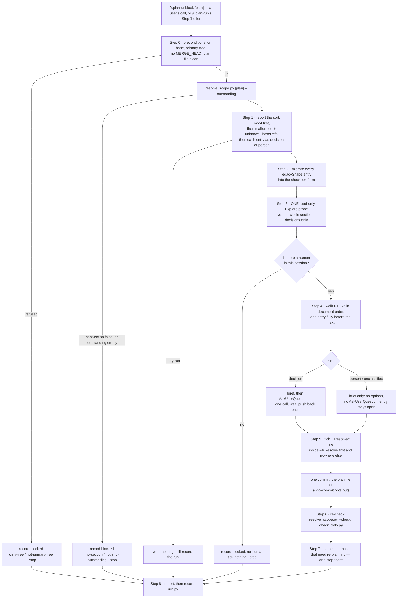

# `plan-unblock` — behaviour register

What `/r:plan-unblock` does, one claim per entry. Format and ID rules: [README.md](README.md).

`## Resolve first` is written by `/r:spec-design`, gated on by `/r:plan-run`, closed by this skill
and frozen by `check_todo.py --against`. This file covers the closing half.

## Step flow

## Invocation and reach

- **SB-plan-unblock-001** — The skill never fires on its own. It runs from a user's
  `/r:plan-unblock`, or from `/r:plan-run`'s Step 1 gate offering it — not after a code change, not
  because a plan happens to carry an open entry, not at the end of a session. It writes into the one
  section of a plan an agent is forbidden to touch, and it does that by asking a person; a run
  nobody asked for has nobody to ask.
  *States it:* `skills/plan-unblock/SKILL.md`
  *Enforced by:* —
  *Tested by:* —

- **SB-plan-unblock-002** — It carries **no** `disable-model-invocation` flag, for one reason: the
  flag blocks the Skill tool outright and cannot tell an auto-load from a deliberate call, so it
  would also block the gate that most needs to reach this skill. The rule lives in the description
  and the non-negotiables instead — the same trade as `/r:task-review` and `/r:plan-report`.
  *States it:* `skills/plan-unblock/SKILL.md`
  *Enforced by:* —
  *Tested by:* —

- **SB-plan-unblock-003** — It is the only thing in the pack that writes into `## Resolve first`,
  because it is the only one that can put the question to a person. `/r:spec-design` writes the
  section; `/r:task-run` is forbidden by name from adding a bullet to it.
  *States it:* `skills/plan-unblock/SKILL.md`
  *Enforced by:* —
  *Tested by:* —

- **SB-plan-unblock-004** — The invocation is
  `/r:plan-unblock [<plan>] [--entry <n>] [--no-commit] [--dry-run] [--yes]`. `--entry` works one
  entry by the `R<n>` label the report gave it (`--entry 3` or `--entry R3`) and leaves everything
  else alone; `--no-commit` writes the file and touches no git state, for a caller that owns the
  index.
  *States it:* `skills/plan-unblock/SKILL.md`
  *Enforced by:* —
  *Tested by:* —

- **SB-plan-unblock-005** — With no `<plan>` argument the plan is discovered in this order: one
  named in the conversation, else `docs/*/todo.md`, else a root `todo.md`. Several candidates and no
  steer → list them and ask; never pick one silently, because the wrong plan gets edited **and
  committed**.
  *States it:* `skills/plan-unblock/SKILL.md`
  *Enforced by:* —
  *Tested by:* —

- **SB-plan-unblock-006** — `--yes` takes the recommendation on every `decision` rather than asking,
  and **does not reach a `person` entry**. Nothing closes one of those but a person saying so.
  *States it:* `skills/plan-unblock/SKILL.md`
  *Enforced by:* —
  *Tested by:* —

- **SB-plan-unblock-007** — `--dry-run` reports the sort and stops. It writes nothing, ever, and
  still records the run.
  *States it:* `skills/plan-unblock/SKILL.md`
  *Enforced by:* —
  *Tested by:* —

## Step 0 — preconditions, then the script

- **SB-plan-unblock-008** — The skill writes to the plan and commits it, so it runs only where that
  is safe: **on base, in the primary tree**. It refuses, naming which one, when `.git/MERGE_HEAD`
  exists, when the plan file is already dirty, or when this is a linked worktree
  (`git rev-parse --git-common-dir` differs from `--git-dir`) — recording `blocked` and stopping.
  *States it:* `skills/plan-unblock/SKILL.md`
  *Enforced by:* —
  *Tested by:* —

- **SB-plan-unblock-009** — The sort is asked of
  `python3 "${CLAUDE_SKILL_DIR}/scripts/resolve_scope.py" <plan> --outstanding`, never read out of
  the markdown. Which entries are open, what each blocks and who may close it are three judgements
  that fail by returning a confident wrong answer, at the last point between an unresolved blocker
  and a build that assumes it was settled.
  *States it:* `skills/plan-unblock/SKILL.md`
  *Enforced by:* `skills/plan-unblock/scripts/resolve_scope.py`
  *Tested by:* `skills/plan-unblock/tests/resolve_scope.test.sh`

- **SB-plan-unblock-010** — `hasSection: false`, or an empty `outstanding`, is an **answer, not a
  failure**: say so, record the run (`no-section` / `nothing-outstanding`) and stop.
  *States it:* `skills/plan-unblock/SKILL.md`
  *Enforced by:* `skills/plan-unblock/scripts/resolve_scope.py`
  *Tested by:* `skills/plan-unblock/tests/resolve_scope.test.sh`

## The four rules that fail closed

- **SB-plan-unblock-011** — **An entry with no checkbox is OUTSTANDING.** Plans written before the
  checkbox shape carry a plain `- **Name** — …` bullet with nothing to tick, and `/r:plan-run` has
  always gated on "anything unticked". Reading an untickable bullet as settled would close every
  pre-existing entry in every plan at once, silently, on the first run.
  *States it:* `skills/plan-unblock/references/resolution-format.md`
  *Enforced by:* `skills/plan-unblock/scripts/resolve_scope.py`
  *Tested by:* `skills/plan-unblock/tests/resolve_scope.test.sh`

- **SB-plan-unblock-012** — **An entry whose `Blocks:` line is missing, or names no phase, blocks
  the ENTIRE run list** (`blocksEverything: true`, `gate: "stop"`). Nothing has ever validated that
  line, so entries in the wild carry prose or nothing; parsing that to "blocks no phases" would put
  the entry outside every `--phases` narrowing and let a run sail past a blocker the script itself
  could see was broken.
  *States it:* `skills/plan-unblock/references/resolution-format.md`
  *Enforced by:* `skills/plan-unblock/scripts/resolve_scope.py`
  *Tested by:* `skills/plan-unblock/tests/resolve_scope.test.sh`

- **SB-plan-unblock-013** — Such an entry stops the run while naming **no** phase:
  `blockedPhases` stays empty. A gate that halted while listing phases the author never blocked
  would read as a specific, checked answer rather than the fail-closed reason it is.
  *States it:* `skills/plan-unblock/scripts/resolve_scope.py`
  *Enforced by:* `skills/plan-unblock/scripts/resolve_scope.py`
  *Tested by:* `skills/plan-unblock/tests/resolve_scope.test.sh`

- **SB-plan-unblock-014** — **A tick with no `Resolved:` line counts as closed for gating and is
  reported** (`tickedWithoutResolution`). Somebody clearly closed it, so it does not hold up a
  build; but the plan now records that a decision happened and nothing about what it was, which is
  worth saying out loud rather than silently accepting.
  *States it:* `skills/plan-unblock/references/resolution-format.md`
  *Enforced by:* `skills/plan-unblock/scripts/resolve_scope.py`
  *Tested by:* `skills/plan-unblock/tests/resolve_scope.test.sh`

- **SB-plan-unblock-015** — **An entry the script cannot classify is a PERSON's job, not a
  decision.** The cost of the two mistakes is not symmetric: a decision misfiled as paperwork waits
  for a human who says "just decide it", while paperwork misfiled as a decision gets closed by an
  interview and the plan then claims a contract exists.
  *States it:* `skills/plan-unblock/references/resolution-format.md`
  *Enforced by:* `skills/plan-unblock/scripts/resolve_scope.py`
  *Tested by:* `skills/plan-unblock/tests/resolve_scope.test.sh`

- **SB-plan-unblock-016** — The `PERSON` patterns are tested **before** the `DECISION` ones, and
  that ordering is itself the fail-closed direction: "decide whether to sign the DPA" is a signature
  wearing a decision's grammar, and only one of the two readings can be closed by asking a model.
  *States it:* `skills/plan-unblock/scripts/resolve_scope.py`
  *Enforced by:* `skills/plan-unblock/scripts/resolve_scope.py`
  *Tested by:* `skills/plan-unblock/tests/resolve_scope.test.sh`

- **SB-plan-unblock-017** — An `Owner:` naming legal, finance, procurement, HR, people, compliance
  or a security council makes the entry a `person`'s before any subject pattern runs. An owner is
  weak evidence on its own — "platform" says nothing about who may close an entry — but those four
  functions do not write code, so the entry is not a decision an engineer can take by reading the
  repo.
  *States it:* `skills/plan-unblock/scripts/resolve_scope.py`
  *Enforced by:* `skills/plan-unblock/scripts/resolve_scope.py`
  *Tested by:* —

- **SB-plan-unblock-018** — The classifier's patterns are `check_todo.py`'s `NOT_BUILDABLE` rows,
  read one document later: there the table keeps this work out of a numbered phase, here the same
  split says who may close it. Rows 1–3 produce a `decision`, rows 4–6 need a `person`. The sort is
  **derived, not judged** — a model re-sorting the section every run would produce numbers nobody
  can average and a fence nobody can trust.
  *States it:* `skills/plan-unblock/SKILL.md`
  *Enforced by:* `skills/plan-unblock/scripts/resolve_scope.py`
  *Tested by:* `skills/plan-unblock/tests/resolve_scope.test.sh`

## The rule that goes the other way

- **SB-plan-unblock-019** — **An open entry blocking a phase that is already built is moot, not
  enforced.** It comes back in `blockedPhasesBuilt`, drops out of `blockedInScope`, and the gate
  clears. Enforcing it the other way would make a stale blocker a permanent trap that nothing could
  ever close.
  *States it:* `skills/plan-unblock/SKILL.md`
  *Enforced by:* `skills/plan-unblock/scripts/resolve_scope.py`
  *Tested by:* `skills/plan-unblock/tests/resolve_scope.test.sh`

- **SB-plan-unblock-020** — A moot entry is **reported, never silently ticked**: Step 1 leads with
  it and offers to close it on that basis. The script names it; the user closes it.
  *States it:* `skills/plan-unblock/SKILL.md`
  *Enforced by:* —
  *Tested by:* —

- **SB-plan-unblock-021** — "Built" is the rule `/r:plan-run` uses to skip a phase and
  `check_todo.py`'s `done_of`: the leaf has ticks and nothing left open. A phase with no checkboxes
  at all is **not** built.
  *States it:* `skills/plan-unblock/scripts/resolve_scope.py`
  *Enforced by:* `skills/plan-unblock/scripts/resolve_scope.py`
  *Tested by:* `skills/plan-unblock/tests/resolve_scope.test.sh`

## The parser's contract

- **SB-plan-unblock-022** — An entry has five parts read by name: the checkbox, the bold subject and
  its question, `Owner:`, `Blocks:`, `Timebox:` and `Output:`. An entry with no owner is one nobody
  will close, which is why `--check` reports it.
  *States it:* `skills/plan-unblock/references/resolution-format.md`
  *Enforced by:* `skills/plan-unblock/scripts/resolve_scope.py`
  *Tested by:* `skills/plan-unblock/tests/resolve_scope.test.sh`

- **SB-plan-unblock-023** — **`Blocks:` is the only edge.** A phase number in the subject line is
  part of the subject; nothing else in the entry makes an edge.
  *States it:* `skills/plan-unblock/references/resolution-format.md`
  *Enforced by:* `skills/plan-unblock/scripts/resolve_scope.py`
  *Tested by:* `skills/plan-unblock/tests/resolve_scope.test.sh`

- **SB-plan-unblock-024** — A field ends at the **next label-shaped token**, not at the next label
  this contract knows about, and an unknown label is named in `malformed` rather than folded into
  its neighbour. Observed: `Blocks: nothing. Informs: Phases 32 and 33.` ran the `Blocks:` slice to
  the end of the entry, and the phase regex harvested 32 and 33 out of the *Informs* clause —
  reporting the entry as blocking exactly the phases its author had listed as merely informed, in
  the one value `/r:plan-run` is told to obey without second-guessing.
  *States it:* `skills/plan-unblock/scripts/resolve_scope.py`
  *Enforced by:* `skills/plan-unblock/scripts/resolve_scope.py`
  *Tested by:* `skills/plan-unblock/tests/resolve_scope.test.sh`

- **SB-plan-unblock-025** — The section runs from `## Resolve first` to the **next heading of any
  level**, not to the next `## `. A plan whose section is followed straight by `### Phase 1` would
  otherwise run to end of file and read every phase's checkboxes as entries.
  *States it:* `skills/plan-unblock/scripts/resolve_scope.py`
  *Enforced by:* `skills/plan-unblock/scripts/resolve_scope.py`
  *Tested by:* `skills/plan-unblock/tests/resolve_scope.test.sh`

- **SB-plan-unblock-026** — The heading match is case-insensitive, and a phase heading may use
  either dash spelling. A heading one tool locates and another does not is a blocker that silently
  belongs to nothing.
  *States it:* `skills/plan-unblock/scripts/resolve_scope.py`
  *Enforced by:* `skills/plan-unblock/scripts/resolve_scope.py`
  *Tested by:* `skills/plan-unblock/tests/resolve_scope.test.sh`

- **SB-plan-unblock-027** — The phase heading and tick regexes are **copied** from `check_todo.py`,
  never imported: that script belongs to another skill, and a cross-skill import breaks the moment
  either one is installed alone. What is duplicated is two short lines, asserted in both suites,
  whose drift shows up as a phase this script cannot see rather than as a wrong answer about one it
  can.
  *States it:* `skills/plan-unblock/scripts/resolve_scope.py`
  *Enforced by:* —
  *Tested by:* `skills/plan-unblock/tests/resolve_scope.test.sh`

- **SB-plan-unblock-028** — `--outstanding` always prints one JSON object and exits `0`: it is the
  gate's half and must never fail its caller over plan quality. `--check` is the gate half that
  **can** fail — exit 1 on any finding — because `/r:spec-design`'s Step 7 is a fix-and-re-run loop
  against `check_todo.py`, and a check that cannot fail is a report.
  *States it:* `skills/plan-unblock/scripts/resolve_scope.py`
  *Enforced by:* `skills/plan-unblock/scripts/resolve_scope.py`
  *Tested by:* `skills/plan-unblock/tests/resolve_scope.test.sh`

- **SB-plan-unblock-029** — Exit 1 otherwise only for a question the script could not answer at all:
  no such file, no mode given, `--phases` with nothing after it. A usage error is never a silent
  pass.
  *States it:* `skills/plan-unblock/scripts/resolve_scope.py`
  *Enforced by:* `skills/plan-unblock/scripts/resolve_scope.py`
  *Tested by:* `skills/plan-unblock/tests/resolve_scope.test.sh`

- **SB-plan-unblock-030** — `--phases` narrows the gate to the run list, which is the carve-out an
  entry blocking a phase nobody is building today gets. `blockedPhases` still names what was left
  out of scope.
  *States it:* `skills/plan-unblock/scripts/resolve_scope.py`
  *Enforced by:* `skills/plan-unblock/scripts/resolve_scope.py`
  *Tested by:* `skills/plan-unblock/tests/resolve_scope.test.sh`

- **SB-plan-unblock-031** — **A stop names its remedy.** `problems()` says a legacy entry is one
  `/r:plan-unblock` migrates and closes in the same edit, and never that it "can never be closed" —
  two sessions read that older wording, concluded the plan carried a permanent unclearable stop, and
  an orchestrator issued a standing instruction to proceed past the gate, which is the worst thing a
  gate can teach. The message also says that **editing the plan to satisfy this parser is not the
  fix**, because an agent is forbidden by name from writing in this section. Naming the remedy does
  not soften the gate: it still stops.
  *States it:* `skills/plan-unblock/scripts/resolve_scope.py`
  *Enforced by:* `skills/plan-unblock/scripts/resolve_scope.py`
  *Tested by:* `skills/plan-unblock/tests/resolve_scope.test.sh`

## Step 1 — report the sort before acting on it

- **SB-plan-unblock-032** — The report leads with the two things that need no work: the moot
  entries, then `malformed` and `unknownPhaseRefs` — an entry with no readable `Blocks:` stops the
  whole run list, and one naming a phase the plan does not have guards nothing. Both need the user's
  eye before anything else.
  *States it:* `skills/plan-unblock/SKILL.md`
  *Enforced by:* —
  *Tested by:* —

- **SB-plan-unblock-033** — Then the entries themselves, each as `decision` or `person`, with the
  phase it blocks and its timebox. `unclassified` is listed **as a person's** and said out loud, so
  the user can correct a real decision that no pattern matched.
  *States it:* `skills/plan-unblock/SKILL.md`
  *Enforced by:* —
  *Tested by:* —

## Step 2 — migrate the legacy shape

- **SB-plan-unblock-034** — Every entry in `legacyShape` is rewritten into the checkbox form in the
  same edit that resolves anything else, **including entries this run does not resolve**, and the
  count is reported. The migration is one change — add `[ ] ` after the marker — and it changes
  nothing else about the line. This is the one change the skill makes to entries it did not resolve,
  and it is what makes the section closable at all.
  *States it:* `skills/plan-unblock/references/resolution-format.md`
  *Enforced by:* —
  *Tested by:* —

## Step 3 — probe, where a probe helps

- **SB-plan-unblock-035** — **One** read-only `Explore` agent is sent over the **whole section**,
  briefed with each entry's question and its own `Timebox:`. A realistic block is one to three
  entries, so one agent per entry buys nothing. It returns, per entry, what it found, what it could
  not settle, and a recommendation.
  *States it:* `skills/plan-unblock/SKILL.md`
  *Enforced by:* —
  *Tested by:* —

- **SB-plan-unblock-036** — The probe never decides and never edits, and a probe that blocks or
  comes back empty is **named**, with its entry asked cold. A question you could not narrow is still
  a question — and the brief must never imply a read that did not happen.
  *States it:* `skills/plan-unblock/SKILL.md`
  *Enforced by:* —
  *Tested by:* —

- **SB-plan-unblock-037** — `person` entries are not probed at all. No amount of reading tells you
  whether a contract was signed. A timeboxed read is a **prefix** to a decision, never an outcome of
  its own.
  *States it:* `skills/plan-unblock/SKILL.md`
  *Enforced by:* —
  *Tested by:* —

## Step 4 — the walk

- **SB-plan-unblock-038** — Entries are worked **one at a time, fully, in document order**, labelled
  `R1`, `R2`, … by position — never one message carrying every question. Five blockers in one
  message forces the user to hold five contexts and answer them as a list, which is how the cheap
  ones get a real answer and the expensive one gets a shrug; sequential also lets an answer moot or
  reshape the next, which you can only see from inside the walk. The labels are what `--entry` names.
  *States it:* `skills/plan-unblock/SKILL.md`
  *Enforced by:* —
  *Tested by:* —

- **SB-plan-unblock-039** — Every entry opens with a brief — **why this blocks, then what the
  options are** — before anything is asked about it. "Why this blocks" is **read from the blocked
  phase's** items, `Files:` and `Done when:`, and names what cannot be built or verified; asserting
  that something is blocked is not a reason. If no such reason can be written, the entry may block
  nothing, and that is worth saying.
  *States it:* `skills/plan-unblock/references/resolution-format.md`
  *Enforced by:* —
  *Tested by:* —

- **SB-plan-unblock-040** — The brief is written in ASD-STE100 Simplified Technical English and in
  **the plan's own nouns** — the class, entity and phase names the phase block, `tech-design.md` and
  the spec already use. A noun you invent is one the reader has to map back to something real.
  *States it:* `skills/plan-unblock/references/resolution-format.md`
  *Enforced by:* —
  *Tested by:* —

- **SB-plan-unblock-041** — **Shorter and clearer, never shorter and blunter.** The brief supplies
  the premise the reader is missing; what gets cut is the part that repeats the entry and the part
  that shows your work.
  *States it:* `skills/plan-unblock/references/resolution-format.md`
  *Enforced by:* —
  *Tested by:* —

- **SB-plan-unblock-042** — A `decision` is put through the **`AskUserQuestion` tool**, one call per
  entry, and the run waits. Never in prose: a selectable option is answered in a click, and a
  paragraph ending in a question mark is answered with "whatever you think". The brief carries the
  reasoning; the tool carries the choice.
  *States it:* `skills/plan-unblock/SKILL.md`
  *Enforced by:* —
  *Tested by:* —

- **SB-plan-unblock-043** — The mapping onto the tool is fixed: the recommendation goes **first**
  and is labelled `(Recommended)`; each option's `description` is that option's **cost**; `header`
  is the entry's label plus one word (`R1 Debezium`) inside twelve characters; `multiSelect` is
  false, because an entry is one decision. **No "Other" option is authored** — the tool always
  offers one, and that is where a different answer or an "I don't know" arrives.
  *States it:* `skills/plan-unblock/references/resolution-format.md`
  *Enforced by:* —
  *Tested by:* —

- **SB-plan-unblock-044** — **Two to four options.** An entry with one real option is a default, not
  a decision: say so and skip the call. More than four means the entry is really two entries, or the
  tail is noise — cut to what a reasonable engineer would weigh, and say what you cut.
  *States it:* `skills/plan-unblock/references/resolution-format.md`
  *Enforced by:* —
  *Tested by:* —

- **SB-plan-unblock-045** — Where the options are different *shapes* of code or config rather than
  different values, a few lines of each go in that option's `preview` — the one case a table of
  costs cannot settle.
  *States it:* `skills/plan-unblock/references/resolution-format.md`
  *Enforced by:* —
  *Tested by:* —

- **SB-plan-unblock-046** — Question style follows reversibility (`interview.md` §1 Rule 2):
  genuinely open where the answer reshapes the plan, a forced trade-off where every option sounds
  free, propose-then-correct where a section gets rewritten, default-and-veto where it is one line
  to change later.
  *States it:* `skills/plan-unblock/SKILL.md`
  *Enforced by:* —
  *Tested by:* —

- **SB-plan-unblock-047** — Push back **once** on an answer that is expensive to reverse, using
  `interview.md` §8's four beats — name the mechanism, the alternative with its cost, the
  reversibility, then hand it back. Never twice, and a second `AskUserQuestion` on a decision they
  already made is exactly that, in a form they cannot ignore.
  *States it:* `skills/plan-unblock/SKILL.md`
  *Enforced by:* —
  *Tested by:* —

- **SB-plan-unblock-048** — **"I don't know" is an answer.** Take the recommendation, record it as
  the resolution with the alternative beside it, and move on. Never re-ask, never block.
  *States it:* `skills/plan-unblock/SKILL.md`
  *Enforced by:* —
  *Tested by:* —

- **SB-plan-unblock-049** — A `person` entry is briefed in its place in the walk and then plainly
  declared unclosable here. **No `AskUserQuestion`**, no options, no recommendation, no probe: a
  list of options implies this session could settle it. `unclassified` is treated as one of these.
  *States it:* `skills/plan-unblock/SKILL.md`
  *Enforced by:* —
  *Tested by:* —

- **SB-plan-unblock-050** — Under `--yes` every brief is still printed and the recommendation taken,
  with **no `AskUserQuestion` at all**. The briefs are the record of what was decided on the user's
  behalf.
  *States it:* `skills/plan-unblock/SKILL.md`
  *Enforced by:* —
  *Tested by:* —

- **SB-plan-unblock-051** — **Silence is not an answer.** With no human in the session to answer —
  an unattended run, a container, a piped prompt — the run records `blocked: "no-human"`, ticks
  nothing and stops. A default taken on nobody's behalf and written into the plan as settled is
  exactly the lie this section exists to prevent.
  *States it:* `skills/plan-unblock/SKILL.md`
  *Enforced by:* —
  *Tested by:* —

- **SB-plan-unblock-052** — When an answer moots or reshapes a later entry, say so when you reach
  it rather than asking a question that no longer stands.
  *States it:* `skills/plan-unblock/SKILL.md`
  *Enforced by:* —
  *Tested by:* —

## Step 5 — the stamp, and what is written

- **SB-plan-unblock-053** — A resolved entry is ticked and given a `Resolved:` line: an ISO date,
  the decision in one clause, and **the force that settled it**. "Polling fallback" alone is an
  outcome nobody can check later; "Debezium needs a superuser role RDS won't grant" is the reason a
  reader needs when the question comes back. `Alternative:` records what else was live, optional
  only when there genuinely was nothing else. `Outstanding:` is present only when the entry's
  `Output:` still owes somebody a write.
  *States it:* `skills/plan-unblock/references/resolution-format.md`
  *Enforced by:* —
  *Tested by:* —

- **SB-plan-unblock-054** — **A resolution that names no force is not a resolution.** If you cannot
  write why, the entry is not resolved yet.
  *States it:* `skills/plan-unblock/references/resolution-format.md`
  *Enforced by:* —
  *Tested by:* —

- **SB-plan-unblock-055** — A `person` entry's stamp records that the user said it was done, rather
  than something anyone worked out — `Resolved: <date> — countersigned, confirmed by the user.
  Owner: legal.`
  *States it:* `skills/plan-unblock/references/resolution-format.md`
  *Enforced by:* —
  *Tested by:* —

- **SB-plan-unblock-056** — Three shapes of decision arrive, and all three are decisions: the probe
  answered it and the user agreed (the force is what the probe found, cited); the user chose against
  the recommendation (their reason is the force, the recommendation the alternative); the user said
  "I don't know" (the stamp says `(recommended; not contested)`, because a default recorded as a
  decision reads as more agreement than there was).
  *States it:* `skills/plan-unblock/references/resolution-format.md`
  *Enforced by:* —
  *Tested by:* —

- **SB-plan-unblock-057** — **The stamp is the single record.** It is never duplicated into
  `tech-design.md`, which a `/r:spec-design` rewrite replaces wholesale — and that rewrite is
  exactly the follow-up a resolution triggers. `check_todo.py --against` is what makes the stamp
  durable instead: a closed entry dropped from a rewrite is reported.
  *States it:* `skills/plan-unblock/references/resolution-format.md`
  *Enforced by:* `skills/spec-design/scripts/check_todo.py`
  *Tested by:* `skills/spec-design/tests/check_todo.test.sh`

- **SB-plan-unblock-058** — **Never edit a file the entry's `Output:` names.** "A line in the spec's
  Risks" belongs to `/r:spec-brainstorm`, whose `ADR-<n>` ids are a shared space; an unrequested
  edit to `spec.html` is a second writer of a document with one. Name it as outstanding instead.
  *States it:* `skills/plan-unblock/SKILL.md`
  *Enforced by:* —
  *Tested by:* —

- **SB-plan-unblock-059** — **Nothing outside `## Resolve first` is touched.** Not a `### Phase N`
  block, not a phase item, not `## Waves`, not the numbering. A `- [ ]` outside the section belongs
  to `/r:plan-run`, which ticks it after a review that verified it.
  *States it:* `skills/plan-unblock/SKILL.md`
  *Enforced by:* —
  *Tested by:* —

- **SB-plan-unblock-060** — **The skill closes entries; it never opens one.** Work that turns up
  while resolving goes in the report, and into the plan only through `/r:spec-design`.
  *States it:* `skills/plan-unblock/references/resolution-format.md`
  *Enforced by:* —
  *Tested by:* —

- **SB-plan-unblock-061** — One commit, the plan file alone — `docs: resolve <n> plan blockers` — on
  base, in the primary tree. Left uncommitted it breaks both ways: an attended `/r:plan-run` halts
  on the dirty tree, and an unattended one snapshots it to `refs/wip/` and cleans it, reverting the
  answers while the gate it already passed says everything is settled. `--no-commit` opts out;
  `--dry-run` writes nothing.
  *States it:* `skills/plan-unblock/SKILL.md`
  *Enforced by:* —
  *Tested by:* —

## Steps 6–8 — re-check, re-plan, record

- **SB-plan-unblock-062** — Step 6 re-runs `resolve_scope.py <plan> --check` and
  `${CLAUDE_PLUGIN_ROOT}/skills/spec-design/scripts/check_todo.py <plan>` and reports what they say.
  `--check` exits 1 on any finding, which is the point of it.
  *States it:* `skills/plan-unblock/SKILL.md`
  *Enforced by:* `skills/plan-unblock/scripts/resolve_scope.py`
  *Tested by:* `skills/plan-unblock/tests/resolve_scope.test.sh`

- **SB-plan-unblock-063** — Step 7 **names** the phases whose shape the answers changed — a
  different approach, a different file, a criterion that no longer holds — and stops there. It does
  **not** re-plan, renumber, regenerate `## Waves` or re-match `Implements:`. That graph is
  `/r:spec-design`'s, and a second writer of it is a lockstep tax nobody is paying attention to.
  *States it:* `skills/plan-unblock/SKILL.md`
  *Enforced by:* —
  *Tested by:* —

- **SB-plan-unblock-064** — Where a rewrite is genuinely wanted, its cost is stated:
  `/r:spec-design <the documents>` replaces `todo.md` and `tech-design.md` together, with
  `--against` freezing what is already built.
  *States it:* `skills/plan-unblock/SKILL.md`
  *Enforced by:* —
  *Tested by:* —

- **SB-plan-unblock-065** — Step 8 writes one line into the pack-wide store via
  `${CLAUDE_PLUGIN_ROOT}/lib/record-run.py` — **counts only**, never an entry's text, a plan path or
  a decision. The payload is `skill`, `entries`, `outstandingBefore`, `resolvedNow`, `decisions`,
  `person`, `unclassified`, `probed`, `probesBlocked`, `legacyMigrated`, `declined`, `mootEntries`,
  `replanNeeded`, `checkerProblems`, `blocked`.
  *States it:* `skills/plan-unblock/SKILL.md`
  *Enforced by:* `lib/record-run.py`
  *Tested by:* `lib/tests/stats.test.sh`

- **SB-plan-unblock-066** — Every bucket comes from **what the file carries**, which is what makes
  the numbers comparable between runs. A model-judged sort would be recomputed differently each time
  and could not be averaged.
  *States it:* `skills/plan-unblock/SKILL.md`
  *Enforced by:* —
  *Tested by:* —

- **SB-plan-unblock-067** — **`probed` against `decisions` calibrates Step 3.** Probing every entry
  means the skill is answering things only the user could have; probing none means it is asking
  questions the repo already answers, which is the interview quitting early.
  *States it:* `skills/plan-unblock/SKILL.md`
  *Enforced by:* —
  *Tested by:* —

- **SB-plan-unblock-068** — **`unclassified` is the bucket to watch.** It is the fail-closed one,
  and a count that stays non-zero means the derivation is too narrow and real decisions are being
  filed as somebody's paperwork — a fence that over-fires stops being read.
  *States it:* `skills/plan-unblock/SKILL.md`
  *Enforced by:* —
  *Tested by:* —

- **SB-plan-unblock-069** — `blocked` is the reason nothing was written — `no-section`,
  `nothing-outstanding`, `no-human`, `dirty-tree`, `not-primary-tree` — and null on a run that
  resolved something. **A blocked run still records**: a stop is a result, and a store holding only
  the runs that wrote something cannot be asked how often this is reached.
  *States it:* `skills/plan-unblock/SKILL.md`
  *Enforced by:* —
  *Tested by:* —

- **SB-plan-unblock-070** — `record-run.py` always exits `0`; a lost row is never a failed run, and
  it is never retried.
  *States it:* `skills/plan-unblock/SKILL.md`
  *Enforced by:* `lib/record-run.py`
  *Tested by:* `lib/tests/stats.test.sh`

## Prose-only behaviours

Held up by wording alone — no *Enforced by:* and no *Tested by:*. Nothing fails if one of these
quietly stops being true, which is what makes them the class a rewrite can lose in silence.

`evals/evals.json` is **not** counted as a test here: `tools/run-evals.py` scores only the two
mechanical case kinds and skips `behaviour` cases, so a behaviour case names the rule without
failing on it. Entries citing it are one step better than prose-only, not tested.

- SB-plan-unblock-001 — never fires on its own
- SB-plan-unblock-002 — no `disable-model-invocation` flag, and why
- SB-plan-unblock-003 — the only writer of `## Resolve first`
- SB-plan-unblock-004 — the flag surface (`--entry`, `--no-commit`)
- SB-plan-unblock-005 — plan discovery order, and never picking silently
- SB-plan-unblock-007 — `--dry-run` writes nothing and still records
- SB-plan-unblock-008 — Step 0's three refusals (merge, dirty plan, linked worktree)
- SB-plan-unblock-032 — moot and malformed entries are reported first
- SB-plan-unblock-035 — one `Explore` probe over the whole section
- SB-plan-unblock-036 — a blocked or empty probe is named, its entry asked cold
- SB-plan-unblock-037 — `person` entries are never probed
- SB-plan-unblock-040 — the brief's register: STE, the plan's own nouns
- SB-plan-unblock-041 — shorter and clearer, never shorter and blunter
- SB-plan-unblock-044 — two to four options
- SB-plan-unblock-045 — `preview` for options that are shapes, not values
- SB-plan-unblock-046 — question style follows reversibility
- SB-plan-unblock-047 — push back once, never twice
- SB-plan-unblock-048 — "I don't know" takes the recommendation
- SB-plan-unblock-050 — `--yes` prints every brief and calls no tool
- SB-plan-unblock-052 — carry the walk forward
- SB-plan-unblock-053 — the `Resolved:` stamp's three fields
- SB-plan-unblock-054 — a resolution that names no force is not one
- SB-plan-unblock-055 — a `person` entry's stamp shape
- SB-plan-unblock-056 — the three shapes of decision
- SB-plan-unblock-058 — never edit the file `Output:` names
- SB-plan-unblock-060 — closes entries, never opens one
- SB-plan-unblock-064 — the cost of a `/r:spec-design` rewrite is stated
- SB-plan-unblock-066 — every bucket comes from the file
- SB-plan-unblock-067 — `probed` against `decisions`
- SB-plan-unblock-068 — `unclassified` is the bucket to watch
- SB-plan-unblock-069 — a blocked run still records

**31 of 70 entries are prose-only.**
