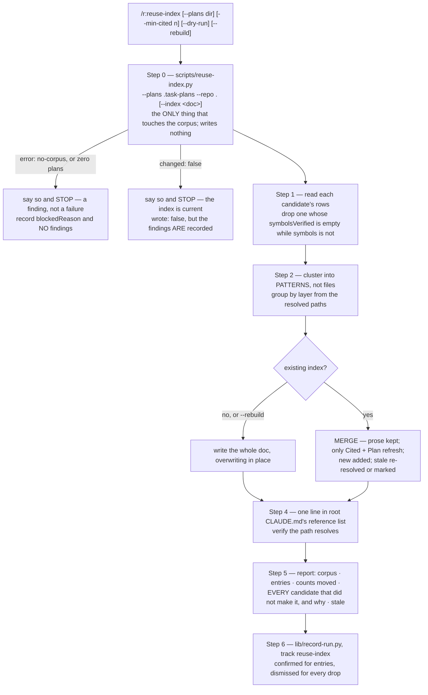

# `reuse-index` — behaviour register

What `/r:reuse-index` does, one entry per behaviour. Format contract: [README.md](README.md).

The skill is split in two and the split is the design: `scripts/reuse-index.py` decides corpus →
candidates → diff without a model, and the prose defers to it. Everything the script decides is
enforced and tested; everything the clustering and the doc's voice decide is prose. The roll-up at
the bottom says which is which.

## Flow

## Entries

- **SB-reuse-index-001** — The skill maintains **one tracked reference doc** per project naming the
  canonical example of each pattern the codebase already has, so a later task copies the existing
  shape instead of re-deriving it.
  *States it:* `skills/reuse-index/SKILL.md`, `skills/reuse-index/references/output-format.md`
  *Enforced by:* —
  *Tested by:* —

- **SB-reuse-index-002** — Its input is the plan corpus `/r:task-run` leaves in `.task-plans/`:
  every plan carries a **Reuse map** written by an agent that had just read the code for that one
  task, and discarded after it. The corpus is the most concentrated record of the codebase's
  conventions in the repo, and nothing else reads it.
  *States it:* `skills/reuse-index/SKILL.md`
  *Enforced by:* —
  *Tested by:* —

- **SB-reuse-index-003** — **The threshold is the whole idea.** One plan reaching for a file is a
  choice made under one task's pressure; two plans written weeks apart independently reaching for
  the same file is a convention. Only the second kind goes in the doc, and the threshold is evidence
  rather than a knob to reach for — below it the doc fills with one-off trivia and stops being worth
  reading.
  *States it:* `skills/reuse-index/SKILL.md`, `skills/reuse-index/references/output-format.md`
  *Enforced by:* `skills/reuse-index/scripts/reuse-index.py`
  *Tested by:* `skills/reuse-index/tests/reuse-index.test.sh`

- **SB-reuse-index-004** — `cited` counts **distinct plans, never rows**: one plan citing an
  exemplar twice is still one plan and does not reach the default threshold of 2.
  *States it:* `skills/reuse-index/SKILL.md`
  *Enforced by:* `skills/reuse-index/scripts/reuse-index.py`
  *Tested by:* `skills/reuse-index/tests/reuse-index.test.sh`

- **SB-reuse-index-005** — The flags are `--plans <dir>` (a corpus somewhere other than
  `.task-plans/`), `--min-cited <n>` (override the 2-plan threshold), `--dry-run` (report what would
  change, write nothing) and `--rebuild`.
  *States it:* `skills/reuse-index/SKILL.md`
  *Enforced by:* `skills/reuse-index/scripts/reuse-index.py`
  *Tested by:* `skills/reuse-index/tests/reuse-index.test.sh`

- **SB-reuse-index-006** — `--rebuild` is the merge's escape hatch and **overwrites**: a full
  clustering pass that discards any prose hand-written into the current doc. It exists for adopting
  a format change (a new column like `Plan`) or a doc that has drifted; a merge is the safe default
  and is reached for first.
  *States it:* `skills/reuse-index/SKILL.md`
  *Enforced by:* —
  *Tested by:* —

- **SB-reuse-index-007** — On `--rebuild` the script is run **without** `--index`: the run is
  regenerating, not diffing, and passing it would only surface a `changed: false` about to be
  ignored. The existing doc is still located so it is overwritten in place, every candidate is
  treated as a fresh entry, and neither of the two stops below applies.
  *States it:* `skills/reuse-index/SKILL.md`
  *Enforced by:* —
  *Tested by:* —

- **SB-reuse-index-008** — Step 0 runs the mechanical half —
  `python3 "${CLAUDE_SKILL_DIR}/scripts/reuse-index.py" --plans .task-plans --repo . --index <doc>`
  — and it is the only thing in the run that touches the corpus.
  *States it:* `skills/reuse-index/SKILL.md`
  *Enforced by:* `skills/reuse-index/scripts/reuse-index.py`
  *Tested by:* —

- **SB-reuse-index-009** — The split is deliberate and is about cost: the script is deterministic —
  extraction, counting, path resolution and the diff against an existing index — and reads nothing
  but the plan corpus, the repo file list and the index, writing nothing at all. The judgment half,
  deciding which rows describe the same pattern and writing the prose, is the skill's. A refresh
  runs the script every time and only needs a model when the diff says something actually changed.
  *States it:* `skills/reuse-index/SKILL.md`
  *Enforced by:* `skills/reuse-index/scripts/reuse-index.py`
  *Tested by:* —

- **SB-reuse-index-010** — The script prints JSON: `corpus`, `minCited`, `index`, `candidates` —
  each with `cited`, `citedBy`, the resolved `path`, `alsoAt`, `resolved`, `sharesName`, the
  `symbols` its rows named, which of them `symbolsVerified` in the file today, and the raw `rows` —
  plus `new`, `unresolved`, `countChanged`, `stale` and `changed`.
  *States it:* `skills/reuse-index/SKILL.md`
  *Enforced by:* `skills/reuse-index/scripts/reuse-index.py`
  *Tested by:* `skills/reuse-index/tests/reuse-index.test.sh`

- **SB-reuse-index-011** — `{"error": "no-corpus"}` or zero plans **stops the run**, said out loud.
  There is nothing to mine, and that is a finding rather than a failure. A missing plans directory is
  an error and never an empty-but-clean answer.
  *States it:* `skills/reuse-index/SKILL.md`
  *Enforced by:* `skills/reuse-index/scripts/reuse-index.py`
  *Tested by:* `skills/reuse-index/tests/reuse-index.test.sh`

- **SB-reuse-index-012** — `changed: false` **stops the run** too: the index is current and a file is
  not rewritten to no effect. (Never reported under `--rebuild`, which omits `--index`.)
  *States it:* `skills/reuse-index/SKILL.md`
  *Enforced by:* `skills/reuse-index/scripts/reuse-index.py`
  *Tested by:* `skills/reuse-index/tests/reuse-index.test.sh`

- **SB-reuse-index-013** — Reuse-map rows are read **positionally**, and the header row is
  identified structurally as the line before the `|---|` separator, because the corpus's column
  headings never settled: 30 different spellings across 37 tables in the reference corpus. Nothing
  downstream may depend on a heading's wording.
  *States it:* `skills/reuse-index/scripts/reuse-index.py`
  *Enforced by:* `skills/reuse-index/scripts/reuse-index.py`
  *Tested by:* `skills/reuse-index/tests/reuse-index.test.sh`

- **SB-reuse-index-014** — Both shapes a reuse map is written in are read and both count toward the
  threshold: a markdown table, and the 11 sections in the reference corpus written as bullet lists
  instead.
  *States it:* `skills/reuse-index/scripts/reuse-index.py`
  *Enforced by:* `skills/reuse-index/scripts/reuse-index.py`
  *Tested by:* `skills/reuse-index/tests/reuse-index.test.sh`

- **SB-reuse-index-015** — A reuse-map section is read level-aware — its body ends at the next
  heading of the same or higher level — because a reuse map may carry `###` subheadings.
  *States it:* `skills/reuse-index/scripts/reuse-index.py`
  *Enforced by:* `skills/reuse-index/scripts/reuse-index.py`
  *Tested by:* —

- **SB-reuse-index-016** — Exemplars join on **basename**, because elided anchors
  (`jpa-adapter/.../X.java`) are the norm in the corpus and the basename is the only key that
  reliably joins. An elided anchor resolves to a real repo path.
  *States it:* `skills/reuse-index/scripts/reuse-index.py`
  *Enforced by:* `skills/reuse-index/scripts/reuse-index.py`
  *Tested by:* `skills/reuse-index/tests/reuse-index.test.sh`

- **SB-reuse-index-017** — The basename join has a price and it is **disclosed, never corrected**:
  every plan citing any file of that name lands in one bucket, so `sharesName` above 1 makes `cited`
  an upper bound on the pattern's attestation rather than a measurement of it — `page.html` resolving
  to three templates counts the calculator's plans toward an admin fragment's entry. The doc writes
  the count `≤N` in that case. Nothing can disaggregate them, because the elision is what makes the
  join possible at all, and a bare `17` that is really "at most 17" is the doc asserting something it
  cannot support.
  *States it:* `skills/reuse-index/references/output-format.md`, `skills/reuse-index/SKILL.md`
  *Enforced by:* `skills/reuse-index/scripts/reuse-index.py`
  *Tested by:* `skills/reuse-index/tests/reuse-index.test.sh`

- **SB-reuse-index-018** — An unambiguous exemplar is **not** marked: a basename with exactly one
  file in the repo reports `sharesName: 1`, and one the repo does not hold at all reports `0` rather
  than a phantom file. A `≤` on every row is a `≤` on none.
  *States it:* `skills/reuse-index/references/output-format.md`
  *Enforced by:* `skills/reuse-index/scripts/reuse-index.py`
  *Tested by:* `skills/reuse-index/tests/reuse-index.test.sh`

- **SB-reuse-index-019** — The repo walk prunes `.git`, `target`, `node_modules`, `.idea`, `.gradle`
  and `.task-plans`, and anything starting `.claude` **at every depth** — a linked worktree under
  `.claude/worktrees/<u>/` holds a near-complete second copy of the repo, and indexing it would give
  almost every basename a twin and make every count read as an upper bound. That is a rule rather
  than a resolver preference winning on path length, because a tie broken by ordering breaks the
  other way on somebody else's tree. The cost — a project doc under `.claude/docs/` never resolving
  as an anchor — is correct here: docs are not reuse exemplars and are dismissed either way.
  *States it:* `skills/reuse-index/scripts/reuse-index.py`
  *Enforced by:* `skills/reuse-index/scripts/reuse-index.py`
  *Tested by:* —

- **SB-reuse-index-020** — `build`, `out` and `dist` are pruned **only at depth ≤ 1**, where build
  output actually lands. Skipping any directory *named* build/out/dist costs a hexagonal project its
  entire out-port package (`core/.../port/out/`), which is exactly the layer a reuse index is most
  wanted for.
  *States it:* `skills/reuse-index/scripts/reuse-index.py`
  *Enforced by:* `skills/reuse-index/scripts/reuse-index.py`
  *Tested by:* —

- **SB-reuse-index-021** — An exemplar no longer in the repo is still returned as a candidate with
  `resolved: false` and is named in `unresolved` — never dropped silently.
  *States it:* `skills/reuse-index/scripts/reuse-index.py`
  *Enforced by:* `skills/reuse-index/scripts/reuse-index.py`
  *Tested by:* `skills/reuse-index/tests/reuse-index.test.sh`

- **SB-reuse-index-022** — Symbols the rows name are verified against the resolved file's current
  contents: one present in the file appears in `symbolsVerified`, one the file does not contain does
  not.
  *States it:* `skills/reuse-index/scripts/reuse-index.py`
  *Enforced by:* `skills/reuse-index/scripts/reuse-index.py`
  *Tested by:* `skills/reuse-index/tests/reuse-index.test.sh`

- **SB-reuse-index-023** — Step 1 drops a candidate whose `symbolsVerified` is empty while `symbols`
  is not: its file survived but the pattern the plans described is gone from it. An entry whose file
  resolves but whose named symbol is nowhere in it does not go in the doc.
  *States it:* `skills/reuse-index/SKILL.md`, `skills/reuse-index/references/output-format.md`
  *Enforced by:* —
  *Tested by:* —

- **SB-reuse-index-024** — Step 1 reads each candidate's raw `rows` — the reuse-map cells from every
  citing plan, where the pattern is described in several plans' words. The script can count them;
  only the model can tell that four differently-worded rows are one pattern, or that one file carries
  three.
  *States it:* `skills/reuse-index/SKILL.md`
  *Enforced by:* —
  *Tested by:* —

- **SB-reuse-index-025** — **Entries are patterns, not files.** Each is named the way a reader would
  search for it — "Race-free native upsert", never "CurrencyRateJpaRepository". One file often
  carries several distinct shapes and is split; several plans describing the same thing in different
  words are one entry, worded once.
  *States it:* `skills/reuse-index/SKILL.md`, `skills/reuse-index/references/output-format.md`
  *Enforced by:* —
  *Tested by:* —

- **SB-reuse-index-026** — Sections group by where the exemplars live, **computed from the resolved
  paths rather than a fixed list** — a project without a web layer must not get an empty "Web layer"
  heading. Sections are ordered by entry count, densest first; entries within a section by `Cited`,
  then alphabetically by pattern.
  *States it:* `skills/reuse-index/references/output-format.md`
  *Enforced by:* —
  *Tested by:* —

- **SB-reuse-index-027** — The entry format is the five-column row
  `| Pattern | Canonical example | Reach for it when | Cited | Plan |`. **Canonical example** is the
  path, an em dash, then the symbol that carries the pattern; **Reach for it when** is the situation
  rather than a restatement of the pattern, and is the column a reader scans.
  *States it:* `skills/reuse-index/references/output-format.md`
  *Enforced by:* —
  *Tested by:* —

- **SB-reuse-index-028** — **No line numbers in an anchor**, and long middle segments are elided with
  `/.../`. In a reference corpus of 922 anchors, 95% of paths still resolved while the line numbers
  had drifted throughout, so a line number is a promise the doc cannot keep — paths survive
  refactors.
  *States it:* `skills/reuse-index/references/output-format.md`, `skills/reuse-index/SKILL.md`
  *Enforced by:* —
  *Tested by:* —

- **SB-reuse-index-029** — `Cited` and `Plan` are **derived, not authored** — rebuilt from the
  candidate's `citedBy` on every write and never hand-edited. `Plan` is `Cited` itemized, one
  markdown link per citing plan (`[<slug>](.task-plans/<slug>.md)`, comma-separated), so the two
  always agree, including under a `≤` where both are over-broad by exactly the same rows. The links
  are what let a reader check which plans really meant this file, and the trail back from a distilled
  convention to the full task context.
  *States it:* `skills/reuse-index/references/output-format.md`, `skills/reuse-index/SKILL.md`
  *Enforced by:* —
  *Tested by:* —

- **SB-reuse-index-030** — **A refresh merges and never regenerates.** Existing entries keep their
  prose — the pattern name, the "reach for it when", any hand-edited anchor — and only `Cited` and
  `Plan` refresh, together, from the same evidence. Prose in the doc may have been written by hand,
  so merging is the only safe operation on it.
  *States it:* `skills/reuse-index/SKILL.md`, `skills/reuse-index/references/output-format.md`
  *Enforced by:* —
  *Tested by:* —

- **SB-reuse-index-031** — `new` entries — the ones that crossed the threshold since the last pass —
  are added into their section. They are the only part that needs judgment, and on most refreshes the
  set is empty.
  *States it:* `skills/reuse-index/references/output-format.md`
  *Enforced by:* —
  *Tested by:* —

- **SB-reuse-index-032** — A stale anchor is re-resolved from the script's `candidates` list where
  that is unambiguous, and otherwise left in place, marked, and named in the report. **Never delete
  an entry silently**: a pattern that moved and a pattern that died need opposite responses, and only
  the reader can tell which happened.
  *States it:* `skills/reuse-index/SKILL.md`, `skills/reuse-index/references/output-format.md`
  *Enforced by:* `skills/reuse-index/scripts/reuse-index.py`
  *Tested by:* —

- **SB-reuse-index-033** — Doc anchors are resolved the same way candidates are — by basename, then
  filtered on the segments that survived the elision — because the doc prescribes elided,
  extensionless anchors that cannot be `isfile`-tested. This is what keeps a refresh **idempotent**:
  read them literally instead and every entry in a correctly-written index reads back as new, and
  every anchor as stale.
  *States it:* `skills/reuse-index/scripts/reuse-index.py`
  *Enforced by:* `skills/reuse-index/scripts/reuse-index.py`
  *Tested by:* `skills/reuse-index/tests/reuse-index.test.sh`

- **SB-reuse-index-034** — The anchor cell is split on its em dash and the two halves get **opposite
  treatment**, because a bare `RowCursor` and a bare `TestUsers` are syntactically identical and only
  position and resolvability tell them apart: before the dash, a token that will not resolve is a
  stale anchor; after it, one that resolves is a secondary exemplar and one that does not is a
  symbol. Read the whole cell one way and you either report live inner records as dead anchors, or
  report the secondary exemplars as new on every refresh, forever.
  *States it:* `skills/reuse-index/scripts/reuse-index.py`
  *Enforced by:* `skills/reuse-index/scripts/reuse-index.py`
  *Tested by:* —

- **SB-reuse-index-035** — An exemplar the doc merely **names** — in a "considered and not carried"
  note, say — counts as known and is not re-proposed. Counting only table anchors makes every
  deliberate omission read as a new candidate on every future refresh, so the same rejected exemplars
  get re-proposed forever and `changed` is never false again.
  *States it:* `skills/reuse-index/scripts/reuse-index.py`
  *Enforced by:* `skills/reuse-index/scripts/reuse-index.py`
  *Tested by:* `skills/reuse-index/tests/reuse-index.test.sh`

- **SB-reuse-index-036** — An entry naming several exemplars takes the **MAX** count across them,
  never the first one that happens to match: a pattern is as well attested as its best-attested
  exemplar, and picking arbitrarily makes the number depend on anchor order.
  *States it:* `skills/reuse-index/scripts/reuse-index.py`
  *Enforced by:* `skills/reuse-index/scripts/reuse-index.py`
  *Tested by:* —

- **SB-reuse-index-037** — A `countChanged` row carries `sharesName` **with** the move, because it is
  the only thing that explains a count going **down** while the corpus grew: the max is over buckets
  that each aggregate every file of their name, so which bucket wins can change without the pattern's
  own standing changing at all, and a reader watching a number fall cannot otherwise tell that from a
  convention dying.
  *States it:* `skills/reuse-index/scripts/reuse-index.py`, `skills/reuse-index/SKILL.md`
  *Enforced by:* `skills/reuse-index/scripts/reuse-index.py`
  *Tested by:* —

- **SB-reuse-index-038** — **The doc is its own state file.** The anchors and the `Cited` counts are
  all a refresh needs, so there is no marker file and nothing to fall out of sync.
  *States it:* `skills/reuse-index/references/output-format.md`
  *Enforced by:* `skills/reuse-index/scripts/reuse-index.py`
  *Tested by:* `skills/reuse-index/tests/reuse-index.test.sh`

- **SB-reuse-index-039** — The doc goes in a reference-doc directory the project already tracks and
  already points at from its root `CLAUDE.md`; `docs/` only when there is none. Never somewhere git
  ignores — an index nobody's teammates receive is a private note, not a project document.
  *States it:* `skills/reuse-index/SKILL.md`, `skills/reuse-index/references/output-format.md`
  *Enforced by:* —
  *Tested by:* —

- **SB-reuse-index-040** — Step 4 wires the doc in, because **an index nothing points at is a file
  nobody opens**: one line added to the root `CLAUDE.md` reference list, in that list's existing
  wording and position. `CLAUDE.md` is loaded on every turn, so the pointer earns its place only by
  staying a pointer.
  *States it:* `skills/reuse-index/SKILL.md`, `skills/reuse-index/references/output-format.md`
  *Enforced by:* —
  *Tested by:* —

- **SB-reuse-index-041** — A module-level `CLAUDE.md` that already carries a short "examples to copy"
  list is pointed at the full set in one sentence. Entries are **never copied into it** — a second
  copy drifts — and the module file's own inline examples stay where they are, because that file is
  read on its own.
  *States it:* `skills/reuse-index/SKILL.md`, `skills/reuse-index/references/output-format.md`
  *Enforced by:* —
  *Tested by:* —

- **SB-reuse-index-042** — If the file has no reference list to join, the report says so rather than
  inventing a section; and the path written is verified to resolve before the run finishes, because a
  broken pointer is worse than none.
  *States it:* `skills/reuse-index/SKILL.md`
  *Enforced by:* —
  *Tested by:* —

- **SB-reuse-index-043** — The doc describes **the codebase** and narrates no tooling: it never
  explains that it was mined from a corpus, never names the pipelines, never mentions this skill. The
  distinction is between a link and a story — a `Plan` cell pointing at `.task-plans/<slug>.md` is a
  reference to a tracked project artifact, like the code paths in the other columns; a sentence about
  how the index gets built is the tooling describing itself. Its own header says it is a
  hand-maintained reference and how to add an entry, in the register of the project's other reference
  docs.
  *States it:* `skills/reuse-index/references/output-format.md`, `skills/reuse-index/SKILL.md`
  *Enforced by:* —
  *Tested by:* —

- **SB-reuse-index-044** — What does not go in: an exemplar the threshold rejects; an entry whose
  file resolves but whose named symbol is gone from it; and trivia a grep answers faster than an
  index does, like where one icon glyph or one string constant lives. **An unverifiable entry does
  not go in** — a reader trusts this doc, so a wrong entry costs more than a missing one, and a
  reader who does not find their pattern only falls back to a normal search having lost a few
  seconds.
  *States it:* `skills/reuse-index/references/output-format.md`, `skills/reuse-index/SKILL.md`
  *Enforced by:* —
  *Tested by:* —

- **SB-reuse-index-045** — Step 5 reports corpus size, how many plans carried a reuse map, how many
  candidates met the threshold, entries written and merged, and `Cited` counts (with their `Plan`
  links) that moved — naming `sharesName` above 1 on a move, since that is the only thing explaining
  a falling count.
  *States it:* `skills/reuse-index/SKILL.md`
  *Enforced by:* —
  *Tested by:* —

- **SB-reuse-index-046** — The report names **every candidate that did not make it, and why** —
  below threshold, file gone, pattern gone, or folded into another entry — plus the stale anchors
  re-resolved and the ones needing a human. A silent drop is how an index starts lying about its
  coverage.
  *States it:* `skills/reuse-index/SKILL.md`
  *Enforced by:* —
  *Tested by:* —

- **SB-reuse-index-047** — Step 6 records one row: `{"skill":"r:reuse-index","corpus","plansWithMap",
  "minCited","candidates","entriesNew","entriesMerged","citedMoved","staleReresolved",
  "staleNeedingHuman","pointerAdded","wrote","dryRun","blockedReason","findings":[…]}`, with findings
  on the **`reuse-index`** track. It answers the question the skill exists to test: does a corpus of
  plans converge on shared patterns, or does every task reach for something new?
  *States it:* `skills/reuse-index/SKILL.md`
  *Enforced by:* —
  *Tested by:* —

- **SB-reuse-index-048** — One `findings` entry per candidate the script handed back:
  `verdict: "confirmed"` for the ones that became entries, `dismissed` for every one dropped — below
  threshold, file gone, pattern gone, folded into another entry — with the reason as the
  `description`. The dismissals are the more useful half: a corpus of noise and an empty corpus both
  write one line and no entries, and only the verdicts tell them apart.
  *States it:* `skills/reuse-index/SKILL.md`
  *Enforced by:* —
  *Tested by:* —

- **SB-reuse-index-049** — **A run that could not mine anything records `blockedReason` and NO
  findings.** `no-corpus`, zero plans, or a script that failed is an absence of judgement, not a
  judgement that nothing qualified — zero candidates would put "this project has no shared patterns"
  into the store on the strength of a directory that was never there.
  *States it:* `skills/reuse-index/SKILL.md`
  *Enforced by:* —
  *Tested by:* —

- **SB-reuse-index-050** — `changed: false` is the opposite case and a **real result**: the
  candidates were judged, the index already said so, and the row records `wrote: false` with its
  findings intact.
  *States it:* `skills/reuse-index/SKILL.md`
  *Enforced by:* —
  *Tested by:* —

- **SB-reuse-index-051** — Each finding `description` stays one line, because the payload travels in
  this step's prompt; and the write can never fail the run — the script always exits `0`, a lost
  record is a lost record rather than a failed run, and it is never retried.
  *States it:* `skills/reuse-index/SKILL.md`
  *Enforced by:* `lib/record-run.py`
  *Tested by:* `lib/tests/stats.test.sh`

- **SB-reuse-index-052** — **Write only on a real change**, so a refresh that finds nothing new
  leaves the file byte-identical and produces no diff and no commit noise.
  *States it:* `skills/reuse-index/SKILL.md`, `skills/reuse-index/references/output-format.md`
  *Enforced by:* `skills/reuse-index/scripts/reuse-index.py`
  *Tested by:* `skills/reuse-index/tests/reuse-index.test.sh`

- **SB-reuse-index-053** — The skill runs at `effort: high` and carries no
  `disable-model-invocation`, so its description stays in the router's listing budget and "what
  patterns do we already have?" can reach it without the slash command.
  *States it:* `skills/reuse-index/SKILL.md`
  *Enforced by:* `tools/validate.py`
  *Tested by:* —

## Prose-only behaviours

Held up by wording alone — nothing fails if they quietly stop being true. Everything the script
decides is enforced and most of it tested; what is left is the clustering, the doc's layout and
voice, the `CLAUDE.md` pointer, and the stats payload. 23 of 53 entries:

SB-reuse-index-001, -002, -006, -007, -024, -025, -026, -027, -028, -029, -030, -031, -039, -041,
-042, -043, -044, -045, -046, -047, -048, -049, -050.

SB-reuse-index-023 and -040 are held up by an eval case and nothing else, which is the thinnest
support in this file — the first is the rule that keeps a refactored-away pattern out of the doc, the
second is what stops the index being a file nobody opens.
