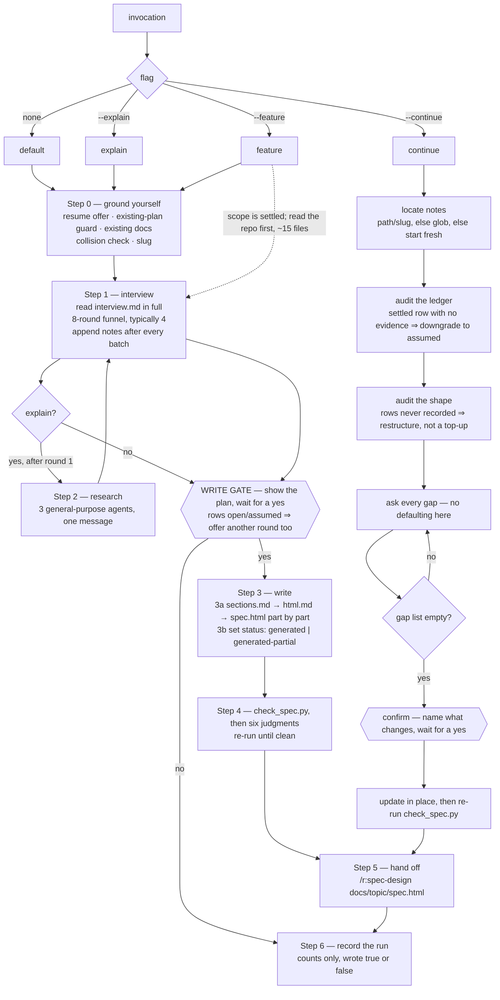

# `spec-brainstorm` — behaviour register

What `/r:spec-brainstorm` does, one atomic claim per entry. Format contract: `README.md` beside
this file.

The skill interviews a user about a business domain, decides the rest by default, and writes one
self-contained `docs/<topic>/spec.html` in seven top-down parts plus `interview-notes.md`, the
answer log. It writes nothing until the user says yes. `/r:spec-design` reads what it produced.

## The flow

---

## Identity, routing and cost

- **SB-spec-brainstorm-001** — The skill runs on `model: fable` at `effort: high`, named in its own
  frontmatter rather than inherited from the caller: the whole run is one long interview plus a
  several-thousand-word document, so the tier is a property of the work, not of whoever invoked it.
  *States it:* `skills/spec-brainstorm/SKILL.md`
  *Enforced by:* —
  *Tested by:* —

- **SB-spec-brainstorm-002** — It carries **no** `disable-model-invocation`, so a prompt can route
  to it and its description is billed against the pack's 16,000-character listing budget. It
  therefore owes both routing eval kinds — a `trigger` case and a `neighbour-exclusion` case — on
  top of its behaviour cases.
  *States it:* `skills/spec-brainstorm/SKILL.md`
  *Enforced by:* `tools/validate.py`
  *Tested by:* —

- **SB-spec-brainstorm-003** — The routing boundary is stated in the description itself: it takes
  *any* request to spec, design or architect a build — "brainstorm", "write a design doc / PRD /
  RFC", "how should I build X", "explain this domain to me" — and explicitly **not** the phased
  implementation plan, which is `/r:spec-design`. Without that exclusion the two skills answer the
  same prompt and the user gets a plan where they asked for a specification.
  *States it:* `skills/spec-brainstorm/SKILL.md`
  *Enforced by:* —
  *Tested by:* —

- **SB-spec-brainstorm-004** — Every eval case carries a **persona**, because the runner has no
  human to answer an `AskUserQuestion` call: the runner answers as the persona and logs the Q&A.
  Cases 0 and 1 are the same unfamiliar domain with and without `--explain`, so the pair isolates
  exactly what the flag adds — without it there must be no research and no teaching sections.
  *States it:* `skills/spec-brainstorm/evals/evals.json`
  *Enforced by:* —
  *Tested by:* —

## The write gate

- **SB-spec-brainstorm-005** — `spec.html` is never created or changed until the user says yes:
  state what is about to be written and stop for an answer, not "generating now" and not a summary
  after the fact. It binds the first write and **every later edit** — changing a document the user
  builds on, under them, destroys their trust in it. Go means write, wait means wait, silence means
  don't write.
  *States it:* `skills/spec-brainstorm/SKILL.md`
  *Enforced by:* —
  *Tested by:* —

- **SB-spec-brainstorm-006** — `interview-notes.md` is the single exception and is written
  continuously from the first answer batch with no gate: it is the working transcript, not a
  document the user is asked to accept. Gating it would mean asking permission to remember, and an
  interview interrupted before permission is granted is lost outright.
  *States it:* `skills/spec-brainstorm/SKILL.md`, `skills/spec-brainstorm/references/interview.md`
  *Enforced by:* —
  *Tested by:* —

- **SB-spec-brainstorm-007** — While any coverage row is `open` or `assumed`, the gate is **not** a
  yes/no: name those rows, say what each would be defaulted to, and offer a third option — another
  round on them. Offering only "apply?" makes the user notice the hole themselves, usually after
  the file exists.
  *States it:* `skills/spec-brainstorm/SKILL.md`, `skills/spec-brainstorm/references/interview.md`
  *Enforced by:* —
  *Tested by:* —

- **SB-spec-brainstorm-008** — The plan shown at the gate is specific: the sections under each of
  the seven parts, the diagrams, the decisions that will be written up as ADRs, and everything
  defaulted rather than asked.
  *States it:* `skills/spec-brainstorm/SKILL.md`
  *Enforced by:* —
  *Tested by:* —

## Outputs, paths and hand-off

- **SB-spec-brainstorm-009** — The deliverable is exactly two files in one folder:
  `docs/<topic>/spec.html` and `docs/<topic>/interview-notes.md`. There is no second HTML file and
  no companion page.
  *States it:* `skills/spec-brainstorm/SKILL.md`, `skills/spec-brainstorm/references/html.md`
  *Enforced by:* `skills/spec-brainstorm/scripts/check_spec.py`
  *Tested by:* `skills/spec-brainstorm/tests/check_spec.test.sh`

- **SB-spec-brainstorm-010** — The topic slug is 2–4 words, kebab-case, with no date and no `-spec`
  suffix.
  *States it:* `skills/spec-brainstorm/SKILL.md`
  *Enforced by:* —
  *Tested by:* —

- **SB-spec-brainstorm-011** — When `docs/<topic>/` already exists, read it, say so, and update in
  place. Never mint `<topic>-2`: a second folder gives the repo two answers to one question.
  *States it:* `skills/spec-brainstorm/SKILL.md`
  *Enforced by:* —
  *Tested by:* —

- **SB-spec-brainstorm-012** — Step 0 runs an **existing-plan guard**: if the repo already has a
  document that owns its plan — a root `PROJECT.md`, or a specification another tool maintains —
  say so and offer to extend that instead, because the stale one of two documents wins about half
  the time.
  *States it:* `skills/spec-brainstorm/SKILL.md`
  *Enforced by:* —
  *Tested by:* —

- **SB-spec-brainstorm-013** — Step 0 globs `docs/*/interview-notes.md` and, when one exists,
  offers to continue it, restart it, or start something else. `--continue` skips the offer.
  *States it:* `skills/spec-brainstorm/SKILL.md`
  *Enforced by:* —
  *Tested by:* —

- **SB-spec-brainstorm-014** — Step 0 reads `README`, `CLAUDE.md`, `docs/` and any ADRs before
  asking anything, and never re-derives a decision already written down.
  *States it:* `skills/spec-brainstorm/SKILL.md`
  *Enforced by:* —
  *Tested by:* —

- **SB-spec-brainstorm-015** — This skill never writes a `todo.md` and never writes build phases:
  that is `/r:spec-design`, which reads `spec.html` and writes the plan beside it. Two plans drift
  within a day.
  *States it:* `skills/spec-brainstorm/SKILL.md`, `skills/spec-brainstorm/references/sections.md`
  *Enforced by:* `skills/spec-brainstorm/scripts/check_spec.py`
  *Tested by:* —

- **SB-spec-brainstorm-016** — Step 5 hands off with the literal next command
  `/r:spec-design docs/<topic>/spec.html`, after summarising the folder, the mode, the sections and
  diagrams included, every row settled as `assumed` rather than asked, and anything left open — and
  offers to refine a section first, which is cheaper now than after a plan is built on it.
  *States it:* `skills/spec-brainstorm/SKILL.md`
  *Enforced by:* —
  *Tested by:* —

## The seven parts and the ceiling

- **SB-spec-brainstorm-017** — The document is seven parts in a fixed order: Business requirements
  → Domain → Architectural characteristics → Logical components → Architectural style → Decisions →
  Technical details, then a closing risks section. Each part summarises the one below it, so a
  reader can stop at any part boundary with a coarser but still true picture; any other order reads
  as a wall, because components make no sense before what the architecture is optimised for.
  *States it:* `skills/spec-brainstorm/references/sections.md`, `skills/spec-brainstorm/SKILL.md`
  *Enforced by:* `skills/spec-brainstorm/scripts/check_spec.py`
  *Tested by:* `skills/spec-brainstorm/tests/check_spec.test.sh`

- **SB-spec-brainstorm-018** — **A part is never dropped, only shortened** — a part with little to
  say is three sentences. A missing part reads exactly like a question nobody asked, so the reader
  cannot tell an answered-badly part from an unasked one.
  *States it:* `skills/spec-brainstorm/references/sections.md`, `skills/spec-brainstorm/SKILL.md`
  *Enforced by:* `skills/spec-brainstorm/scripts/check_spec.py`
  *Tested by:* `skills/spec-brainstorm/tests/check_spec.test.sh`

- **SB-spec-brainstorm-019** — The **sections inside** a part do not always exist: one with nothing
  real to say is deleted, not padded. That is what lets one shape fit a weekend tool and a work
  system without a depth question — a weekend tool has no integrations and no operations material,
  so those sections simply are not there.
  *States it:* `skills/spec-brainstorm/references/sections.md`, `skills/spec-brainstorm/SKILL.md`
  *Enforced by:* —
  *Tested by:* —

- **SB-spec-brainstorm-020** — There is **no depth question and no size flag**. How the project was
  read is stated in one line instead, so a wrong read costs one sentence of correction rather than
  a round trip.
  *States it:* `skills/spec-brainstorm/SKILL.md`, `skills/spec-brainstorm/references/sections.md`
  *Enforced by:* —
  *Tested by:* —

- **SB-spec-brainstorm-021** — Every part opens with a `
` of 2–4 sentences saying
  what that part settles, and the seven ledes are written **last**, from what the parts ended up
  saying. A lede that lists its sections instead of summarising them has failed, and so has a part
  whose lede could not be written.
  *States it:* `skills/spec-brainstorm/references/sections.md`, `skills/spec-brainstorm/references/html.md`
  *Enforced by:* —
  *Tested by:* —

- **SB-spec-brainstorm-022** — **The ceiling.** The document stops at components, the style, named
  technologies and the API. No column types, no indexes, no code, no build order, no step-by-step
  walkthrough — those belong to `/r:spec-design`'s design pass and to `/r:task-run`. A section
  specifying `VARCHAR(255)` is writing the design pass a day early, from less evidence and before
  the build order exists.
  *States it:* `skills/spec-brainstorm/references/sections.md`, `skills/spec-brainstorm/SKILL.md`
  *Enforced by:* `skills/spec-brainstorm/scripts/check_spec.py`
  *Tested by:* —

- **SB-spec-brainstorm-023** — Part 1 carries Problem/goals & non-goals (3–7 goals each with a
  metric, 3–8 non-goals each with a "revisit when"), Actors, User stories, and the v1 line. The v1
  line names **capabilities, not phases**, and says why the line falls where it does — writing
  phases here would create a second plan.
  *States it:* `skills/spec-brainstorm/references/sections.md`
  *Enforced by:* `skills/spec-brainstorm/scripts/check_spec.py`
  *Tested by:* `skills/spec-brainstorm/tests/check_spec.test.sh`

- **SB-spec-brainstorm-024** — A user story's name is its handle and in the HTML it is an `<h3>`:
  one per story inside the User stories section, nothing else at that level, unique in the
  document, carried verbatim by a plan's `Implements:` line. Both `check_spec.py` and
  `/r:spec-design` read that `<h3>` text.
  *States it:* `skills/spec-brainstorm/references/sections.md`, `skills/spec-brainstorm/references/html.md`
  *Enforced by:* `skills/spec-brainstorm/scripts/check_spec.py`
  *Tested by:* `skills/spec-brainstorm/tests/check_spec.test.sh`

- **SB-spec-brainstorm-025** — Every story carries Given/When/Then acceptance criteria and states a
  need rather than a solution. A story without criteria is a wish; "as a clerk I want a Kafka
  topic" is not a story. Deferred stories are still written — the v1 line is what separates them.
  *States it:* `skills/spec-brainstorm/references/sections.md`
  *Enforced by:* `skills/spec-brainstorm/scripts/check_spec.py`
  *Tested by:* `skills/spec-brainstorm/tests/check_spec.test.sh`

- **SB-spec-brainstorm-026** — Part 2's domain model states, per entity, **whether we own it or it
  is a copy of another system's record**, and what identifies it across systems. Ownership is the
  line that decides half the architecture, so it is stated explicitly rather than implied.
  *States it:* `skills/spec-brainstorm/references/sections.md`
  *Enforced by:* —
  *Tested by:* —

- **SB-spec-brainstorm-027** — Every core entity's lifecycle names its **terminal states** — an
  entity without one is a leak — and terminal states are coloured in the HTML (olive for success,
  grey otherwise) so a reader can find the leaks by looking.
  *States it:* `skills/spec-brainstorm/references/sections.md`, `skills/spec-brainstorm/references/html.md`
  *Enforced by:* —
  *Tested by:* —

- **SB-spec-brainstorm-028** — An invariant needs all five parts or it is not testable: **trigger ·
  condition · outcome with units · scope (per what) · behaviour on violation**, plus where it comes
  from and whether it is configurable. Any rule containing *appropriate, timely, valid, properly,
  reasonable, sufficient, as needed* is rejected unless a number or an enumerated list follows.
  Money is always minor units with an ISO 4217 code, said once, here.
  *States it:* `skills/spec-brainstorm/references/sections.md`
  *Enforced by:* —
  *Tested by:* —

- **SB-spec-brainstorm-029** — Key flows are 3–6 including **at least two failure paths**, and they
  live in Part 2 with the domain, not with the components: a flow is the process in the business's
  own words and has to be true before there are components to route it through — it is what Part
  4's cut is checked against. Only one is drawn as a sequence diagram, usually the one with a
  failure branch; the rest are step lists.
  *States it:* `skills/spec-brainstorm/references/sections.md`, `skills/spec-brainstorm/references/html.md`
  *Enforced by:* —
  *Tested by:* —

- **SB-spec-brainstorm-030** — Part 3 carries **at most three driving characteristics**, ranked, in
  rows marked `class="driving"` so they can be counted. Three is a ceiling, not a target: a list of
  eight says nothing and licenses everything, because every later decision can point at whichever
  one suits it.
  *States it:* `skills/spec-brainstorm/references/sections.md`, `skills/spec-brainstorm/references/html.md`
  *Enforced by:* `skills/spec-brainstorm/scripts/check_spec.py`
  *Tested by:* `skills/spec-brainstorm/tests/check_spec.test.sh`

- **SB-spec-brainstorm-031** — Every characteristic row is a number or an enumerated rule, with a
  fitness function and what it costs. This part's entire job is turning "fast" into *keystroke to
  repaint under 16 ms*, so an adjective sitting in a row with no number is a defect. Names come
  from the field's own vocabulary — availability, elasticity, deployability, startup latency — because
  the name carries a body of known trade-offs and an invented phrase carries none.
  *States it:* `skills/spec-brainstorm/references/sections.md`
  *Enforced by:* `skills/spec-brainstorm/scripts/check_spec.py`
  *Tested by:* `skills/spec-brainstorm/tests/check_spec.test.sh`

- **SB-spec-brainstorm-032** — Part 3 also lists **what we are not optimising for** — 2–4 named
  characteristics being deliberately spent, one clause each. It is the cheapest section in the
  document and stops more argument later than any other. Anything defaulted rather than asked is
  marked `Assumed — not confirmed` in the row itself.
  *States it:* `skills/spec-brainstorm/references/sections.md`
  *Enforced by:* —
  *Tested by:* —

- **SB-spec-brainstorm-033** — Part 3 sits **above** Parts 4–6 because it holds the forces that
  decide them. Printed after, the characteristics read as a footnote to decisions they caused and
  nobody can check whether the architecture answers them; printed before, every later part is
  checkable against three lines.
  *States it:* `skills/spec-brainstorm/references/sections.md`
  *Enforced by:* `skills/spec-brainstorm/scripts/check_spec.py`
  *Tested by:* `skills/spec-brainstorm/tests/check_spec.test.sh`

- **SB-spec-brainstorm-034** — In Part 4 a component is a **capability, not a deployable**, and
  `Owns` names the entities it writes in `<code>`, matching the Part 2 names character for
  character. **Ownership is exclusive** — two components writing one entity is the defect this part
  exists to prevent, and it is invisible on a read-through of a ten-row table.
  *States it:* `skills/spec-brainstorm/references/sections.md`, `skills/spec-brainstorm/references/html.md`
  *Enforced by:* `skills/spec-brainstorm/scripts/check_spec.py`
  *Tested by:* `skills/spec-brainstorm/tests/check_spec.test.sh`

- **SB-spec-brainstorm-035** — Every component's `Forced by` names the story or driving
  characteristic that requires it to exist. A component nothing forces is architecture for its own
  sake and is deleted rather than justified.
  *States it:* `skills/spec-brainstorm/references/sections.md`
  *Enforced by:* —
  *Tested by:* —

- **SB-spec-brainstorm-036** — Nothing in Part 4 says process, container, service, cluster or
  repository, and its diagram carries no deployment and no network. Whether these components are
  one deployable or nine is Part 5's question; answering it in Part 4 makes the two impossible to
  change independently, which is how a codebase ends up with a service boundary nobody can explain.
  *States it:* `skills/spec-brainstorm/references/sections.md`, `skills/spec-brainstorm/references/html.md`
  *Enforced by:* —
  *Tested by:* —

- **SB-spec-brainstorm-037** — Part 5 names the style by the field's own name (modular monolith,
  layered, microkernel, event-driven, pipeline, service-based, microservices, client with a local
  cache), gives one line per driving characteristic saying how the style serves it, and lists two
  or three **rejected** styles each with the characteristic that ruled it out. A driving
  characteristic with no line here means either the style is wrong or the characteristic is not
  really driving.
  *States it:* `skills/spec-brainstorm/references/sections.md`
  *Enforced by:* —
  *Tested by:* —

- **SB-spec-brainstorm-038** — Topology defaults to **modules inside one deployable**, with the
  reason stated: separate services buy independent deployment and scaling and cost a network, a
  contract and a distributed failure mode per boundary. Split only where a requirement forces it —
  a different scaling profile, release cadence or blast radius.
  *States it:* `skills/spec-brainstorm/references/sections.md`, `skills/spec-brainstorm/references/interview.md`
  *Enforced by:* —
  *Tested by:* —

- **SB-spec-brainstorm-039** — Part 5 states, per component pair, synchronous or asynchronous and
  why, and **names anything that must be transactional across a boundary** — that is either a merge
  signal or the hardest problem in the build, and it must never be discovered later.
  *States it:* `skills/spec-brainstorm/references/sections.md`
  *Enforced by:* —
  *Tested by:* —

- **SB-spec-brainstorm-040** — An ADR is an `<h3>` reading `ADR-<n> — <title>` with six fields:
  Status, Context, Decision, **Alternatives**, **Consequences**, Revisit when. Alternatives carries
  at least one option with what ruled it out; Consequences carries both halves, because an ADR
  listing only benefits is advocacy; Revisit when is a number or an event, **never a date**.
  *States it:* `skills/spec-brainstorm/references/sections.md`, `skills/spec-brainstorm/references/html.md`
  *Enforced by:* `skills/spec-brainstorm/scripts/check_spec.py`
  *Tested by:* `skills/spec-brainstorm/tests/check_spec.test.sh`

- **SB-spec-brainstorm-041** — A decision with no live alternative **was not a decision**: it
  belongs in the Technologies table with one clause of why, not in Part 6. A superseded ADR stays
  in the document — deleting it destroys the only record of why the earlier answer stopped working.
  Five to fifteen ADRs is normal.
  *States it:* `skills/spec-brainstorm/references/sections.md`
  *Enforced by:* `skills/spec-brainstorm/scripts/check_spec.py`
  *Tested by:* `skills/spec-brainstorm/tests/check_spec.test.sh`

- **SB-spec-brainstorm-042** — **Part 6 is assembled from the `## Decisions` log in
  `interview-notes.md`, never invented at write time.** An ADR reconstructed afterwards has a
  fabricated Alternatives field — the option you would now reject, not the one live at the time —
  and nothing in the finished document distinguishes the two, which devalues every genuine ADR
  beside it. A thin log makes a short Part 6, and that is the honest outcome.
  *States it:* `skills/spec-brainstorm/SKILL.md`, `skills/spec-brainstorm/references/sections.md`
  *Enforced by:* —
  *Tested by:* —

- **SB-spec-brainstorm-043** — Every technology in Part 7 carries a **version or a pricing tier** —
  `PostgreSQL 16`, never "a relational database" — and the last column is either one clause or a
  single ADR reference, never both: a choice made against a live alternative points at its ADR and
  says nothing else. A short line under the table records what the two or three constraining
  technologies **rule out later**.
  *States it:* `skills/spec-brainstorm/references/sections.md`, `skills/spec-brainstorm/references/html.md`
  *Enforced by:* `skills/spec-brainstorm/scripts/check_spec.py`
  *Tested by:* `skills/spec-brainstorm/tests/check_spec.test.sh`

- **SB-spec-brainstorm-044** — The API section is a sketch of whatever surface the system actually
  has — HTTP endpoints, CLI commands, screens or published events — never a pasted OpenAPI
  document. Field names matter, field types do not (that is below the ceiling). Authentication, the
  idempotency rule, the error contract and the pagination default are stated **once** above the
  table; per-row repetition is noise.
  *States it:* `skills/spec-brainstorm/references/sections.md`
  *Enforced by:* —
  *Tested by:* —

- **SB-spec-brainstorm-045** — A Rollout section is **mandatory whenever an existing system is
  touched**: expand → migrate → contract for schema, a feature flag with removal criteria, backfill
  runtime against real row counts, and the explicit rollback with its point of no return.
  *States it:* `skills/spec-brainstorm/references/sections.md`, `skills/spec-brainstorm/references/interview.md`
  *Enforced by:* `skills/spec-brainstorm/scripts/check_spec.py`
  *Tested by:* —

- **SB-spec-brainstorm-046** — The closing `Risks, assumptions and open questions` section is not a
  part, because it applies to all seven, and goes last. A risk accepted by overruling an objection
  **cites its ADR** rather than re-arguing it, and the risks table is given visual weight matching
  its importance rather than reading as an appendix.
  *States it:* `skills/spec-brainstorm/references/sections.md`, `skills/spec-brainstorm/references/html.md`
  *Enforced by:* —
  *Tested by:* —

- **SB-spec-brainstorm-047** — **A row states *what*; it points at an ADR for *why*.** Parts 4, 5
  and 7 carry decisions, not arguments. The reason is what the reader does with it: someone who
  trusts the *what* skims Parts 4–7 in two minutes, someone who doubts one row reads three hundred
  words of one ADR — inlining every reason forces both through the same eight thousand words, which
  is the single biggest reason a long specification reads as a wall.
  *States it:* `skills/spec-brainstorm/references/sections.md`
  *Enforced by:* —
  *Tested by:* —

- **SB-spec-brainstorm-048** — The **only** id scheme in the document is `ADR-<n>`. Story handles
  are their `<h3>` names, parts and sections are addressed by HTML `id` attributes, and there is
  deliberately no FR-, NFR-, BR-, R- or OQ- numbering: those buy a traceability matrix nobody
  maintains at this size and push the writer into one-line requirements that lose the reasoning
  this document exists to carry.
  *States it:* `skills/spec-brainstorm/references/sections.md`, `skills/spec-brainstorm/SKILL.md`
  *Enforced by:* —
  *Tested by:* —

## Modes

- **SB-spec-brainstorm-049** — Default mode is interview → document in the seven parts, with **no
  web research at all**. The running mode is announced in one line.
  *States it:* `skills/spec-brainstorm/SKILL.md`
  *Enforced by:* —
  *Tested by:* —

- **SB-spec-brainstorm-050** — `--explain` adds the layer that teaches the domain — domain
  narrative, full actors table, event timeline, glossary, a worked example, why the rules are what
  they are, and "how this is usually built" — plus the research that feeds it. Each section slots
  into an **existing** part rather than forming its own, and the narrative and glossary go *before*
  the domain model, because a reader who doesn't know the industry needs the words before the
  entities.
  *States it:* `skills/spec-brainstorm/references/sections.md`, `skills/spec-brainstorm/SKILL.md`
  *Enforced by:* —
  *Tested by:* —

- **SB-spec-brainstorm-051** — `--explain` is **off unless the flag is passed**, and is never turned
  on because the domain looks interesting. Without the flag none of its sections exist and research
  does not fire.
  *States it:* `skills/spec-brainstorm/SKILL.md`, `skills/spec-brainstorm/references/research.md`
  *Enforced by:* —
  *Tested by:* —

- **SB-spec-brainstorm-052** — `--feature` means the user has already settled the scope, so the
  scope is not re-asked: read the repo first — capped at ~15 files, in order: build files for real
  dependency *versions*, the migration folder for the real schema, the package layout, lint or
  architecture rules, `CLAUDE.md`, existing docs, and two existing tests to copy their style — then
  open with what was found.
  *States it:* `skills/spec-brainstorm/SKILL.md`, `skills/spec-brainstorm/references/interview.md`
  *Enforced by:* —
  *Tested by:* —

- **SB-spec-brainstorm-053** — On the `--feature` path **no claim about the existing system enters
  the document without a `path:line` citation**; anything uncited becomes an open question, not a
  fact. Its Round 1 is the delta (what is reused, what is new, what must **not** change — the
  regression contract, the user-visible surface) and Round 2 is rollout; rounds 3–7 then run minus
  everything the code already answered, which is usually most of round 6.
  *States it:* `skills/spec-brainstorm/references/interview.md`, `skills/spec-brainstorm/SKILL.md`
  *Enforced by:* `skills/spec-brainstorm/scripts/check_spec.py`
  *Tested by:* —

- **SB-spec-brainstorm-054** — On the `--feature` path **the repo is the research**, so the external
  fan-out stays off even under `--explain` unless a specific question survives reading the code — a
  library the repo doesn't have, a domain the codebase has never handled, or a user who explicitly
  asked how this is usually built. Which way it went is said in one line, so the user knows whether
  anything was searched.
  *States it:* `skills/spec-brainstorm/references/research.md`, `skills/spec-brainstorm/SKILL.md`
  *Enforced by:* —
  *Tested by:* —

- **SB-spec-brainstorm-055** — `--continue` resumes from a path or topic slug if given, otherwise
  globs `docs/*/interview-notes.md` and asks which when several exist. If none exists it says so
  and starts fresh rather than pretending to resume.
  *States it:* `skills/spec-brainstorm/SKILL.md`
  *Enforced by:* —
  *Tested by:* —

- **SB-spec-brainstorm-056** — **On `--continue` you ask.** "Decide by default" is for a first pass;
  resuming and then quietly deciding everything yourself makes the mode worthless. `status:
  generated` is treated as a claim to check, not proof there is nothing left — the user invoked
  `--continue` on it, so something made them think it wasn't finished.
  *States it:* `skills/spec-brainstorm/SKILL.md`
  *Enforced by:* —
  *Tested by:* —

- **SB-spec-brainstorm-057** — Before asking anything, `--continue` **audits the ledger**: for every
  settled row it looks for evidence — a quoted answer under `## Answers`, a `path:line` or URL
  citation, or a written `n/a` reason. A row with none was inferred, so it is downgraded to
  `assumed`, added to the gap list, and **the downgrade is said out loud**.
  *States it:* `skills/spec-brainstorm/SKILL.md`
  *Enforced by:* `skills/spec-brainstorm/scripts/check_spec.py`
  *Tested by:* —

- **SB-spec-brainstorm-058** — The gap list is: every `open` row · every `assumed` row · every row
  just downgraded · every `Assumed — not confirmed` line · every open question the user could answer
  in one sentence · every `defaulted` decision, which goes through the decision review rather than
  a question each. All of them are asked, batched, and an `assumed` row goes through
  `AskUserQuestion` with the assumption as the recommended option — a sweep of them is the one
  place `multiSelect` is right, since the rows are independent and objecting to two of seven is one
  answer, not two.
  *States it:* `skills/spec-brainstorm/SKILL.md`, `skills/spec-brainstorm/references/interview.md`
  *Enforced by:* —
  *Tested by:* —

- **SB-spec-brainstorm-164** — `--continue` also **audits `## Decisions`**: an entry with no settled
  marker whose wording says nobody answered — "accepted without objection", "no objection", "let
  stand", "not discussed" — is `defaulted`, and the count is said out loud. Silence is not
  evidence, so offering such a decision back is not re-asking a settled row. A decision the review
  reverses is named at the confirm gate by ADR number; the old ADR is marked `superseded by ADR-n`
  and stays, and the hand-off says a plan beside the spec was built on the old answer.
  *States it:* `skills/spec-brainstorm/SKILL.md`
  *Enforced by:* —
  *Tested by:* —

- **SB-spec-brainstorm-059** — `--continue` also **audits the shape**: a ledger missing
  `arch-characteristics`, `style-and-topology` or `decisions` is a document written before those
  parts existed — its rows are not `open`, they were never rows. `check_spec.py` reports this as
  *"coverage rows never recorded"*, the signal that the resume is a restructure as well as a top-up,
  and that is said in the same breath as the ledger audit.
  *States it:* `skills/spec-brainstorm/SKILL.md`
  *Enforced by:* `skills/spec-brainstorm/scripts/check_spec.py`
  *Tested by:* —

- **SB-spec-brainstorm-060** — **Most of a restructure is free, and saying which part isn't is the
  whole job.** Parts 1, 2 and 7 are a reorder of existing prose; Part 3 is usually an *extraction*
  (a goals table with real numbers is a characteristics table never called one); Parts 4 and 5 are
  a split of whatever the old document called modules. Genuinely missing, and needing the user: the
  ranking of which three characteristics are driving, the not-optimising-for list, and Part 6.
  *States it:* `skills/spec-brainstorm/SKILL.md`, `skills/spec-brainstorm/references/sections.md`
  *Enforced by:* —
  *Tested by:* —

- **SB-spec-brainstorm-061** — **A restructure moves prose; it does not rewrite it.** Same
  sentences, numbers and story names under a new part. What is rewritten is only what the new shape
  changes — the ranking, the module split, the sidebar, the ids, the seven ledes and Part 6 — and
  which is which is said at the gate, because the two carry different risk.
  *States it:* `skills/spec-brainstorm/SKILL.md`
  *Enforced by:* —
  *Tested by:* —

- **SB-spec-brainstorm-062** — **Story names are frozen across a resume.** A renamed story silently
  breaks every `Implements:` line in a plan `/r:spec-design` may already have built. New stories
  append; moving stories into Part 1 during a restructure is not a licence to retitle them.
  *States it:* `skills/spec-brainstorm/SKILL.md`, `skills/spec-brainstorm/references/sections.md`
  *Enforced by:* —
  *Tested by:* —

- **SB-spec-brainstorm-063** — On a resume, an ADR is written **only when the alternative is on the
  record** — named in the document, or recoverable from a quoted answer under `## Answers`. For
  every other decision there are exactly two allowed moves: ask for what else was on the table and
  write the answers into `## Decisions` as they land, or name them in Part 6 as *defaults nobody
  discussed*. Inventing the alternative is the one thing that is never allowed.
  *States it:* `skills/spec-brainstorm/SKILL.md`, `skills/spec-brainstorm/references/sections.md`
  *Enforced by:* —
  *Tested by:* —

- **SB-spec-brainstorm-064** — After each resume batch the gaps are **re-derived before any edit is
  proposed**, because answers open ground — a decision about how the thing installs raises where its
  binaries come from. Then three choices are offered: keep going on the named gaps, apply what
  exists and file the rest as assumptions, or stop. Never "apply?" alone while the gap list has
  anything on it.
  *States it:* `skills/spec-brainstorm/SKILL.md`
  *Enforced by:* —
  *Tested by:* —

- **SB-spec-brainstorm-065** — A resume stops when the gap list is empty, when the user stops it, or
  when a round produces **no new answers *and* no new gaps**.
  *States it:* `skills/spec-brainstorm/SKILL.md`
  *Enforced by:* —
  *Tested by:* —

- **SB-spec-brainstorm-066** — On a yes, a resume **updates in place**: rewrite only the sections
  the new answers touch, refresh the coverage ledger with its verdicts, set the status. Never
  regenerate from scratch, never mint a second folder, never rewrite a section no new answer
  affected. A restructure re-runs `check_spec.py` before the document is shown, because it moves
  the whole file at once and is the run most likely to leave a dead anchor or a part with no lede.
  *States it:* `skills/spec-brainstorm/SKILL.md`
  *Enforced by:* `skills/spec-brainstorm/scripts/check_spec.py`
  *Tested by:* `skills/spec-brainstorm/tests/check_spec.test.sh`

## The interview protocol

- **SB-spec-brainstorm-067** — `references/interview.md` is read **in full** before the first
  question, `research.md` before dispatching agents, and `sections.md` then `html.md` before
  writing. A skimmed reference produces output that looks right and is wrong in ways nobody catches
  until implementation.
  *States it:* `skills/spec-brainstorm/SKILL.md`
  *Enforced by:* —
  *Tested by:* —

- **SB-spec-brainstorm-068** — **Rule 1 — order by leverage, not by topic.** Scope reshapes the
  entity list; entities and characteristics reshape the components; components reshape the API.
  Asking about pagination while the scope is open produces a confident document about the wrong
  system, and feels productive while doing it.
  *States it:* `skills/spec-brainstorm/references/interview.md`, `skills/spec-brainstorm/SKILL.md`
  *Enforced by:* —
  *Tested by:* —

- **SB-spec-brainstorm-069** — **Rule 2 — style follows reversibility.** Expensive to get wrong
  (scope, users, the one case) → ask openly. Moderate (domain model, components, unhappy endings) →
  propose and let them correct. Cheap and conventional (API conventions, stack, error format) →
  assert the default and invite a veto. People correct far better than they compose: "what are your
  entities?" returns a vague list, while naming four and asking which are copies returns a precise
  correction in ten seconds.
  *States it:* `skills/spec-brainstorm/references/interview.md`, `skills/spec-brainstorm/SKILL.md`
  *Enforced by:* —
  *Tested by:* —

- **SB-spec-brainstorm-070** — **Architectural characteristics get a fourth style — a forced
  trade-off — because the other three all fail on them.** Asked openly, every adjective is free and
  the answer is always "very"; asserted as a default, nobody objects to a number they never had to
  trade for. Two things they want, on opposite sides of a scale, produce a *ranked* characteristic
  with a real cost attached.
  *States it:* `skills/spec-brainstorm/references/interview.md`, `skills/spec-brainstorm/SKILL.md`
  *Enforced by:* —
  *Tested by:* —

- **SB-spec-brainstorm-071** — **Rule 3 — two gates.** Could you decide it yourself? Decide it,
  record it as an assumption, move on. Can only they tell you? Ask. **A question that settles scope
  passes even when it is a business question**, because scope is what is most often got wrong and
  it is invisible in the code. What fails the gates is business-process detail with no consequence
  for the entities, the boundaries, the technology, a story, the API or a flow.
  *States it:* `skills/spec-brainstorm/references/interview.md`, `skills/spec-brainstorm/SKILL.md`
  *Enforced by:* —
  *Tested by:* —

- **SB-spec-brainstorm-072** — **A question with named options goes through `AskUserQuestion`, never
  as a numbered line in prose.** A selectable option is answered in a click; a paragraph ending in a
  question mark comes back as "whatever you think", or as a silence that has to be read as
  agreement — and that reading is the failure, because a veto invited in prose and not given is
  indistinguishable from a veto nobody noticed.
  *States it:* `skills/spec-brainstorm/references/interview.md`, `skills/spec-brainstorm/SKILL.md`
  *Enforced by:* —
  *Tested by:* —

- **SB-spec-brainstorm-073** — Prose keeps only what has no honest option list — the scope, the
  users, the one case, and a list to edit. Authoring an option list for an open question is scope
  inflation by question.
  *States it:* `skills/spec-brainstorm/references/interview.md`, `skills/spec-brainstorm/SKILL.md`
  *Enforced by:* —
  *Tested by:* —

- **SB-spec-brainstorm-074** — Tool-call mechanics, the same every time: the recommendation **first**
  and labelled `(Recommended)`; each option's `description` carries that option's **cost**, not a
  restatement of its label; `header` is the topic in twelve characters or fewer; `multiSelect` false
  unless the answers genuinely combine; **never author an "Other"** — the tool always offers one,
  and that is where "I don't know" and the unforeseen answer arrive. Where options are different
  *shapes* of a contract, a few lines of each go in `preview`.
  *States it:* `skills/spec-brainstorm/references/interview.md`
  *Enforced by:* —
  *Tested by:* —

- **SB-spec-brainstorm-075** — **The prose comes first, then one call for the round**, carrying at
  most four questions of two to four options. When more than four choices are live, take the four
  with the most leverage and let the rest ride as defaults recorded `assumed` — nothing is lost,
  because `--continue` offers every `assumed` row back, while a seventh question in the same breath
  is what makes people quit. A choice with one real option is a default, not a decision.
  *States it:* `skills/spec-brainstorm/references/interview.md`, `skills/spec-brainstorm/SKILL.md`
  *Enforced by:* —
  *Tested by:* —

- **SB-spec-brainstorm-076** — Questions are batched **3–6 per round under ~150 words**, because
  round trips, not question counts, make people quit. Only two things are asked alone: the scope in
  round 1 and the v1 cut in round 8. Inside a batch, what you most need comes first and the cheapest
  last, and optional prose questions are marked `(skip — I'll default to X)`.
  *States it:* `skills/spec-brainstorm/references/interview.md`
  *Enforced by:* —
  *Tested by:* —

- **SB-spec-brainstorm-077** — The funnel is **eight rounds on paper, typically four in practice, and
  rounds collapse.** Anything already answered by the opening message, the repo or an earlier round
  is stated as fact and never re-asked; a small project finishes early because the later rounds have
  nothing left to ask, not because a quota ran out.
  *States it:* `skills/spec-brainstorm/references/interview.md`
  *Enforced by:* —
  *Tested by:* —

- **SB-spec-brainstorm-078** — **Rounds 2 and 3 are the same subject twice** — the process in the
  business's words, then the model that has to hold it. Round 2's unhappy endings *are* round 3's
  states, which is what makes the model right the first time. They collapse into one round when the
  opening message already described the process clearly, and the collapse is said out loud rather
  than silently dropping the correction step.
  *States it:* `skills/spec-brainstorm/references/interview.md`
  *Enforced by:* —
  *Tested by:* —

- **SB-spec-brainstorm-079** — **Round 5 (what it is optimised for) comes before round 6
  (components and API)** because the characteristics are the forces behind the component cut, the
  style and half the ADRs. Asked after the boundaries they can only ratify a cut already made;
  asked before, they are what the cut is argued from. Characteristics *feel* like technical detail
  and are the most load-bearing business answer in the interview.
  *States it:* `skills/spec-brainstorm/references/interview.md`
  *Enforced by:* —
  *Tested by:* —

- **SB-spec-brainstorm-080** — The round bank is **a bank, not a script**: every question still
  passes the two gates, and any whose answer would not change *this* document is dropped. Reading
  the list out in order is how an interview turns into a form.
  *States it:* `skills/spec-brainstorm/references/interview.md`, `skills/spec-brainstorm/SKILL.md`
  *Enforced by:* —
  *Tested by:* —

- **SB-spec-brainstorm-081** — Round 1 offers an escape hatch and honours it instantly: *"say **'you
  decide'** and I'll write it with the defaults above and list every call I made."*
  *States it:* `skills/spec-brainstorm/references/interview.md`
  *Enforced by:* —
  *Tested by:* —

- **SB-spec-brainstorm-082** — Round 3's *"which word here means something different from everyday
  English?"* is the highest-yield question in the interview: it sounds like a business question and
  is a technical one, deciding class, table and endpoint names, and getting it wrong poisons the API
  for the life of the system. Every domain has such a word.
  *States it:* `skills/spec-brainstorm/references/interview.md`
  *Enforced by:* —
  *Tested by:* —

- **SB-spec-brainstorm-083** — Round 4 asks about **cuts, never additions** — the anti-scope list is
  seeded from what the user already described. "Want notifications, an admin panel, an API?" is
  scope inflation by question.
  *States it:* `skills/spec-brainstorm/references/interview.md`
  *Enforced by:* —
  *Tested by:* —

- **SB-spec-brainstorm-084** — Round 5 **never asks for an adjective and never offers a default**,
  and turns each trade-off answer into a number only at the end. If the user wants five driving
  characteristics, ask which two they would sacrifice: a list of five is a list of none. Everything
  they *didn't* pick is worth one line — that is Part 3's not-optimising-for list, and writing it
  down stops the argument being had again in month four.
  *States it:* `skills/spec-brainstorm/references/interview.md`
  *Enforced by:* `skills/spec-brainstorm/scripts/check_spec.py`
  *Tested by:* `skills/spec-brainstorm/tests/check_spec.test.sh`

- **SB-spec-brainstorm-085** — **Decide by default, and say that you guessed.** A wrong guess costs
  one sentence of correction, cheaper than asking almost every time. Every default names a real
  product, version, tier or number — `Clerk — free to ~10k MAU` beats "a hosted auth provider" — and
  carries at most two named options plus your pick.
  *States it:* `skills/spec-brainstorm/SKILL.md`, `skills/spec-brainstorm/references/interview.md`
  *Enforced by:* —
  *Tested by:* —

- **SB-spec-brainstorm-086** — **A decision you made is recorded `assumed`, never `answered`.** As an
  answer it is indistinguishable from something the user told you, and `--continue` — the one
  mechanism that would have caught it — will never raise it again. One lazy word makes resuming
  worthless.
  *States it:* `skills/spec-brainstorm/SKILL.md`, `skills/spec-brainstorm/references/interview.md`
  *Enforced by:* `skills/spec-brainstorm/scripts/check_spec.py`
  *Tested by:* —

- **SB-spec-brainstorm-087** — An area that doesn't apply is **settled as not applicable with a
  written reason** — never confirmed by asking. And nobody is handed a choice between options you
  could have chosen between: gate 1 deletes that question rather than dressing it up as a click.
  *States it:* `skills/spec-brainstorm/SKILL.md`
  *Enforced by:* —
  *Tested by:* —

- **SB-spec-brainstorm-088** — Each round ends by **playing back the running model** — entities,
  states, module cut, as a picture — rather than a paragraph. Correcting a picture is a reflex;
  correcting a paragraph is work, and the playback catches a wrong entity name before it reaches
  the glossary, the API and the schema.
  *States it:* `skills/spec-brainstorm/references/interview.md`, `skills/spec-brainstorm/SKILL.md`
  *Enforced by:* —
  *Tested by:* —

- **SB-spec-brainstorm-089** — Every round ends with a real choice that **names the default for each
  gap** and offers to generate or keep going. "Three rows still open" gives nothing to weigh; naming
  the default makes stopping a real choice rather than a blind one. Never generate without offering
  the choice, and never keep asking after the user takes it.
  *States it:* `skills/spec-brainstorm/references/interview.md`, `skills/spec-brainstorm/SKILL.md`
  *Enforced by:* —
  *Tested by:* —

- **SB-spec-brainstorm-090** — **Never accept an adjective as a requirement**: reflect it back as a
  number or an enumerated rule and name the fork that matters — "you said *secure*; I'll take that
  as audit log on every write, no PII in logs, secrets in a managed KMS, TLS everywhere; if you mean
  PCI DSS or HIPAA say so now, because that changes the hosting and the model". Failure to probe is
  the dominant real-world failure of AI interviewers.
  *States it:* `skills/spec-brainstorm/references/interview.md`, `skills/spec-brainstorm/SKILL.md`
  *Enforced by:* `skills/spec-brainstorm/scripts/check_spec.py`
  *Tested by:* `skills/spec-brainstorm/tests/check_spec.test.sh`

- **SB-spec-brainstorm-091** — **Never ask about availability targets, RPO, RTO or latency
  percentiles.** Default them, write them marked `Assumed — not confirmed`, and let the user correct
  one line if they care.
  *States it:* `skills/spec-brainstorm/references/interview.md`
  *Enforced by:* —
  *Tested by:* —

- **SB-spec-brainstorm-092** — A hard-to-reverse answer is challenged **once**, in one message, in
  four beats: name the mechanism (not a vibe), the alternative with its cost, the reversibility,
  then hand it back — "your call, I'll write it either way". Only for expensive-to-reverse
  decisions, never "are you sure?", never invoking a scale the user didn't claim, and stop
  challenging entirely once it reads as friction. The challenge-on-sight list is fixed: rolling own
  auth or crypto, a raw card PAN outside a PSP-hosted field, money on eventual consistency, a
  non-transactional ledger, services for fewer than about six engineers, a mutating public endpoint
  with no idempotency key, unbounded list endpoints, self-managed Kubernetes for a first version,
  secrets in a committed `.env`, PII in logs, an LLM in a synchronous critical path with no
  fallback, EU personal data in a US-only region, "we'll add tests later".
  *States it:* `skills/spec-brainstorm/references/interview.md`
  *Enforced by:* —
  *Tested by:* —

- **SB-spec-brainstorm-093** — **Concede the decision, keep the risk.** When overruled, retract the
  objection, not the warning: record it once in Risks with the accepted risk and a revisit trigger
  that is a number or an event, never a date. That overruled objection becomes an ADR whose
  Consequences carry the accepted risk.
  *States it:* `skills/spec-brainstorm/references/interview.md`, `skills/spec-brainstorm/references/sections.md`
  *Enforced by:* —
  *Tested by:* —

- **SB-spec-brainstorm-094** — When **the user** says they don't know: take the default, write it
  into Assumptions (assumption · why · what breaks if wrong · how to confirm), add an open question
  with a **default if unanswered**, and move on — all in the same message. Never re-ask, never
  block.
  *States it:* `skills/spec-brainstorm/references/interview.md`
  *Enforced by:* —
  *Tested by:* —

- **SB-spec-brainstorm-095** — An open question is for something **nobody in this conversation can
  answer today** — an absent decision-maker, an unmeasured number, a third party's answer. If the
  user could answer it in one sentence and it changes the document, it is a question, not an open
  question; filing those as open questions looks diligent and is the interview quitting early with
  extra steps. Ratio check before generating: more than about **one open question per three asked**
  means you under-interviewed.
  *States it:* `skills/spec-brainstorm/references/interview.md`
  *Enforced by:* `skills/spec-brainstorm/scripts/check_spec.py`
  *Tested by:* —

- **SB-spec-brainstorm-096** — Open questions use the same four fields everywhere they appear — in
  the notes and in the document — and never a third shape.
  *States it:* `skills/spec-brainstorm/references/interview.md`, `skills/spec-brainstorm/references/sections.md`
  *Enforced by:* —
  *Tested by:* —

- **SB-spec-brainstorm-097** — After every answer batch, append to `docs/<topic>/interview-notes.md`
  — frontmatter (`topic`, `scope`, `mode`, `status`), `## Coverage`, `## Answers`, `## Decisions`,
  `## Assumptions (not confirmed)`, `## Open questions`. A long interview gets interrupted, and
  losing it costs everything.
  *States it:* `skills/spec-brainstorm/references/interview.md`, `skills/spec-brainstorm/SKILL.md`
  *Enforced by:* `skills/spec-brainstorm/scripts/check_spec.py`
  *Tested by:* —

- **SB-spec-brainstorm-098** — **The `## Decisions` log is written the moment a decision lands, not
  at generate time.** Four things go in it: a propose→correct the user corrected (their correction
  is the decision, your proposal the alternative), a default→veto they vetoed or kept in a click
  after being told the cost, an objection you made and they overruled, and a default nobody
  answered. Each entry carries how it settled: `chosen`, `corrected`, `overruled` or `defaulted`. The **force** that settled it —
  the characteristic, story or constraint — is logged with the outcome; an ADR whose context names
  none of those is one nobody can check later. A decision recorded five rounds later has lost what
  made it worth recording.
  *States it:* `skills/spec-brainstorm/references/interview.md`, `skills/spec-brainstorm/references/sections.md`
  *Enforced by:* —
  *Tested by:* —

- **SB-spec-brainstorm-162** — **Silence is never a decision.** A proposal met with no reply is
  logged `defaulted`, and its ADR is written `Status proposed`; `accepted` is only for an entry
  marked `chosen`, `corrected` or `overruled`. While any entry is `defaulted` the `decisions`
  coverage row is `assumed`, and `check_spec.py` reports a `defaulted` entry or a `proposed` ADR
  under a `decisions` row that claims to be settled.
  *States it:* `skills/spec-brainstorm/references/interview.md`, `skills/spec-brainstorm/references/sections.md`, `skills/spec-brainstorm/SKILL.md`
  *Enforced by:* `skills/spec-brainstorm/scripts/check_spec.py`
  *Tested by:* `skills/spec-brainstorm/tests/check_spec.test.sh`

- **SB-spec-brainstorm-163** — **The decision review** runs whenever `## Decisions` holds a
  `defaulted` entry: before the Step 3 write gate, and inside `--continue`'s gap list. Entries are
  ranked by cost to reverse, triaged in one `multiSelect` call (up to four altitude groups of up to
  four decisions — "which do you want to decide yourself?"), and each picked one is asked
  single-select with the recommendation first. A picked one is logged `chosen` or `corrected`, one
  shown and left unticked `chosen` as "reviewed, kept", and one never shown because the user stopped
  stays `defaulted`.
  *States it:* `skills/spec-brainstorm/references/interview.md`, `skills/spec-brainstorm/SKILL.md`
  *Enforced by:* —
  *Tested by:* —

- **SB-spec-brainstorm-165** — **Every question is written in plain English at B2 level** — the
  tool's question text, labels and descriptions, and the prose questions: short sentences, common
  words, no idioms, a technical term explained once, real names, numbers and costs kept. Every
  question also **carries its own context**, because the prose before a tool call is often
  collapsed: no section name, coined term or ADR number unexplained; the question says what a tick
  does on a `multiSelect`; each description says what was assumed, where it is used and what
  changes if it is wrong.
  *States it:* `skills/spec-brainstorm/SKILL.md`, `skills/spec-brainstorm/references/interview.md`
  *Enforced by:* —
  *Tested by:* —

- **SB-spec-brainstorm-099** — The ledger records **how** a row was settled, with six verdicts:
  `answered (round n)` · `repo` · `research` · `n/a` · `assumed` · `open`. The first four owe an
  evidence clause after the dash; if you cannot write the evidence clause the verdict is `assumed`,
  and a row settled by several means takes the **weakest** of them.
  *States it:* `skills/spec-brainstorm/references/interview.md`
  *Enforced by:* `skills/spec-brainstorm/scripts/check_spec.py`
  *Tested by:* —

- **SB-spec-brainstorm-100** — **The coverage floor is fifteen rows** — `users-and-job`,
  `core-flow`, `process`, `domain-model`, `scale`, `anti-scope`, `arch-characteristics`,
  `boundaries`, `style-and-topology`, `api`, `stack-and-constraints`, `integrations`,
  `failure-behaviour`, `decisions`, `stories-and-v1` — plus `rollout` whenever anything already
  exists, plus `actors` and `vocabulary` under `--explain`. The keys are copied **verbatim**,
  because `check_spec.py` reads them and a row covered under an invented name reads to the script
  as a row that was skipped.
  *States it:* `skills/spec-brainstorm/references/interview.md`
  *Enforced by:* `skills/spec-brainstorm/scripts/check_spec.py`
  *Tested by:* —

- **SB-spec-brainstorm-101** — **Settled does not mean asked**: four of the five ways to settle a row
  involve no question, and each has its own verdict. "It didn't come up" is not "it doesn't apply",
  and a section written without its row is written from imagination.
  *States it:* `skills/spec-brainstorm/references/interview.md`
  *Enforced by:* —
  *Tested by:* —

- **SB-spec-brainstorm-102** — **`decisions` is settled differently from every other row**: by having
  *written* something, not by knowing something. A run reaching the write gate with an empty log has
  not skipped a question — it has thrown away the reasoning behind everything it is about to write,
  and Part 6 will be reconstructed from memory. Check it before generating, not after.
  *States it:* `skills/spec-brainstorm/references/interview.md`
  *Enforced by:* —
  *Tested by:* —

- **SB-spec-brainstorm-103** — **The interview ends exactly two ways: every coverage row carries a
  verdict, or the user stops it.** There is no question quota and no "feeling that you have enough".
  When the user stops it, generate immediately and open by naming every row defaulted and what it
  was defaulted to — silently skipping a row and silently defaulting it look identical in the
  finished document, and the difference is whether the reader knows.
  *States it:* `skills/spec-brainstorm/references/interview.md`, `skills/spec-brainstorm/SKILL.md`
  *Enforced by:* —
  *Tested by:* —

## Research (`--explain` only)

- **SB-spec-brainstorm-104** — Research fires **after round 1 and before round 2**, and only under
  `--explain`. Earlier, you don't yet know what to research and it produces a generic comparison
  nobody needed. Without the flag it does not fire at all and that is said in one line.
  *States it:* `skills/spec-brainstorm/references/research.md`, `skills/spec-brainstorm/SKILL.md`
  *Enforced by:* —
  *Tested by:* —

- **SB-spec-brainstorm-105** — Three `general-purpose` agents are dispatched **in a single message**
  so they run in parallel, the dispatch is announced in one line, and nothing is asked while
  waiting. A — how the industry models the problem (category name, canonical entities and
  lifecycles, terms of art and false friends, edge cases). B — the decomposition (4–6 real
  solutions, components present in ≥75%, the 2–3 genuine disagreements with the force that decides
  each). C — technology options (exactly two named current options per decision plus a
  recommendation, each with a version or pricing tier, one deciding number, and the downstream
  consequence).
  *States it:* `skills/spec-brainstorm/references/research.md`, `skills/spec-brainstorm/SKILL.md`
  *Enforced by:* —
  *Tested by:* —

- **SB-spec-brainstorm-106** — Each agent gets the same preamble — the round-1 problem statement, the
  known constraints, a **≤600-word return budget** and the honesty rules — and the whole fan-out is
  capped at **~8 vendor or documentation lookups**, stopping when two consecutive sources add no new
  component and no new evaluation axis. Searching past that is theatre.
  *States it:* `skills/spec-brainstorm/references/research.md`
  *Enforced by:* —
  *Tested by:* —

- **SB-spec-brainstorm-107** — Agent B's prompt enforces: **take the component decomposition, discard
  the scaling mechanism** unless our numbers are within 100× of theirs. Write down their scale, ours
  and the ratio rather than cargo-culting a hyperscaler architecture.
  *States it:* `skills/spec-brainstorm/references/research.md`
  *Enforced by:* —
  *Tested by:* —

- **SB-spec-brainstorm-108** — **Every claim about a third-party product, price, limit, version or
  regulation carries exactly one confidence tag** — `[verified: <url>, read <date>]`, `[likely:
  <the inference>]`, `[unverified]` or `[assumption]`. A bare URL is not a tag. Without these,
  research makes the document *worse*, because wrong facts arrive wearing confidence.
  *States it:* `skills/spec-brainstorm/references/research.md`
  *Enforced by:* `skills/spec-brainstorm/scripts/check_spec.py`
  *Tested by:* —

- **SB-spec-brainstorm-109** — Never state a price, rate limit, latency, quota, SLA or version you
  did not read this session — `≈$X/mo at 1M events [unverified]` beats a confident wrong number.
  Write "no documented support for X (docs searched `<date>`)", never "does not support X", because
  absence of evidence is not absence of feature. Don't paraphrase a feature into a stronger claim.
  Cite a regulation with its article and date or don't cite it.
  *States it:* `skills/spec-brainstorm/references/research.md`, `skills/spec-brainstorm/references/sections.md`
  *Enforced by:* —
  *Tested by:* —

- **SB-spec-brainstorm-110** — **Internal prior art outranks everything external.** If the repo or
  the interview reveals "we already have a service that does half of this", it is the most important
  thing found.
  *States it:* `skills/spec-brainstorm/references/research.md`
  *Enforced by:* —
  *Tested by:* —

- **SB-spec-brainstorm-111** — When research lands, **you talk first**: in ≤120 words name the
  problem category in the industry's own vocabulary, list the components that recurred, and say what
  you copy versus what you deliberately do differently. Then ask **only where prior art genuinely
  disagrees**, each as two named options with the force that decides it and your recommendation —
  everything the field agrees on is a statement, not a question.
  *States it:* `skills/spec-brainstorm/references/research.md`, `skills/spec-brainstorm/SKILL.md`
  *Enforced by:* —
  *Tested by:* —

- **SB-spec-brainstorm-112** — Findings re-enter through exactly three channels — your opening
  summary, the questions where the field disagrees, and named sections (A → glossary, narrative,
  entity list; B → components and "how this is usually built"; C → technologies). Research reaching
  none of them is deleted, and one honest line says what was searched and that nothing
  decision-relevant came back.
  *States it:* `skills/spec-brainstorm/references/research.md`
  *Enforced by:* —
  *Tested by:* —

- **SB-spec-brainstorm-113** — With no `Agent` tool — this skill running nested inside a subagent —
  degrade to serial `WebSearch`/`WebFetch` at **half** the lookup cap and **say so**. Never claim a
  parallel fan-out ran when it didn't, and never imitate a search with prose: a fabricated table of
  vendors is the worst possible output of this skill.
  *States it:* `skills/spec-brainstorm/references/research.md`, `skills/spec-brainstorm/SKILL.md`
  *Enforced by:* —
  *Tested by:* —

- **SB-spec-brainstorm-114** — "How this is usually built" sits at the end of Part 5 in a fixed
  order: the problem's name in the industry's vocabulary · the canonical decomposition · where the
  field genuinely disagrees (each an ADR in Part 6) · the edge cases everyone hits · three existing
  solutions each with **one named weakness** — a candidate with no named weakness means the research
  read only marketing · what we copy and what we deliberately do differently · dated sources. No
  scoring matrix, no must-have gates, no build-versus-buy ceremony: the point is understanding the
  field, not procuring from it.
  *States it:* `skills/spec-brainstorm/references/sections.md`, `skills/spec-brainstorm/references/research.md`
  *Enforced by:* —
  *Tested by:* —

## The HTML contract

- **SB-spec-brainstorm-115** — `spec.html` is a **self-contained, light-mode, static** document: all
  CSS inline, no external fonts, images or stylesheets, **no `<script>` at all**, no
  `localStorage`, no dark-mode block. Every `href` is an external `https:` URL or an in-page
  `#anchor`. One file survives being emailed, dropped in a ticket, opened from a USB stick two years
  later, and printed by someone who will annotate it in pen.
  *States it:* `skills/spec-brainstorm/references/html.md`
  *Enforced by:* `skills/spec-brainstorm/scripts/check_spec.py`
  *Tested by:* —

- **SB-spec-brainstorm-116** — The palette and type scale are fixed tokens on `:root` (ivory page,
  white surface, four greys, clay accent, olive for success-terminal states; serif headings, sans
  body, mono for code, state names and labels), and everything including the SVGs is driven from
  them — never hex scattered on individual shapes. `--clay` is the single accent, used sparingly or
  it stops meaning anything.
  *States it:* `skills/spec-brainstorm/references/html.md`
  *Enforced by:* —
  *Tested by:* —

- **SB-spec-brainstorm-117** — Three heading levels, each meaning exactly one thing: one `<h1>`
  title, `<h2 class="part" id="pN">` for each of the seven parts, plain `<h2 id="…">` for a section,
  and `<h3>` for **only** a user story or an ADR. Sub-headings anywhere else are `<h4>`.
  *States it:* `skills/spec-brainstorm/references/html.md`
  *Enforced by:* `skills/spec-brainstorm/scripts/check_spec.py`
  *Tested by:* `skills/spec-brainstorm/tests/check_spec.test.sh`

- **SB-spec-brainstorm-118** — Every `<h2>` carries a kebab-case `id`, **stable across a
  `--continue`**: a renamed id breaks every anchor pointing at it, and this document's only links
  are anchors.
  *States it:* `skills/spec-brainstorm/references/html.md`
  *Enforced by:* `skills/spec-brainstorm/scripts/check_spec.py`
  *Tested by:* `skills/spec-brainstorm/tests/check_spec.test.sh`

- **SB-spec-brainstorm-119** — Navigation is exactly two elements: one contents list in `<nav
  class="sidenav">` carrying `class="toc"` — the document's **only** contents list, two levels, every
  entry a link — and an "At a glance" card of six lines at the top. Someone who reads only that card
  and the seven part ledes should be able to describe the system correctly; that is the test for
  both. Nothing else is navigation — no sticky header, no back-to-top, no breadcrumb, each of which
  costs print fidelity.
  *States it:* `skills/spec-brainstorm/references/html.md`
  *Enforced by:* `skills/spec-brainstorm/scripts/check_spec.py`
  *Tested by:* `skills/spec-brainstorm/tests/check_spec.test.sh`

- **SB-spec-brainstorm-120** — The sidebar's mobile and print media blocks are what let it exist at
  all: un-stuck, the same markup is a contents page on paper and a contents block on a phone — one
  list in the file, correct in every medium, nothing to drift out of sync. There is **no
  active-section highlight**, because scroll-spy needs a script; `:target` is used only for one line
  of arrival feedback.
  *States it:* `skills/spec-brainstorm/references/html.md`
  *Enforced by:* —
  *Tested by:* —

- **SB-spec-brainstorm-121** — Three markup contracts exist so a prose rule becomes something a
  script can hold: `<tr class="driving">` on each driving characteristic row, a components-table
  header cell whose text contains `Owns` with the entities in `<code>`, and an ADR `id` of
  `adr-<n>` lowercase so `<a href="#adr-4">` resolves from anywhere.
  *States it:* `skills/spec-brainstorm/references/html.md`
  *Enforced by:* `skills/spec-brainstorm/scripts/check_spec.py`
  *Tested by:* `skills/spec-brainstorm/tests/check_spec.test.sh`

- **SB-spec-brainstorm-122** — Entity, state, component and API-path names are in `--mono`
  everywhere they appear, and must match character for character across the glossary's "maps to in
  code" column, Part 4's `Owns` column and the diagrams.
  *States it:* `skills/spec-brainstorm/references/html.md`
  *Enforced by:* —
  *Tested by:* —

- **SB-spec-brainstorm-123** — Diagrams are static inline `<svg>` styled through CSS classes bound to
  the palette, each wrapped in `<figure class="svg-figure">` with a `<figcaption>` saying what to
  notice rather than what it is. **Each diagram belongs to exactly one part** — ER in Part 2, one
  primary sequence in Part 2, components in Part 4, context/container in Part 5 (the only one where
  the network appears), plus the event timeline and entity lifecycles under `--explain`. Drawing the
  same thing twice at two altitudes is the most expensive mistake here.
  *States it:* `skills/spec-brainstorm/references/html.md`
  *Enforced by:* —
  *Tested by:* —

- **SB-spec-brainstorm-124** — SVG mechanics: use `viewBox` with no fixed `width`/`height`, define
  arrowhead markers once per `<svg>` in its own `<defs>` because ids do not reliably resolve across
  separate inline SVGs, label text at 13–14 units minimum. Omit any diagram whose subject doesn't
  exist — an empty box is worse than none. **Four figures is a normal document; seven is a lot.**
  *States it:* `skills/spec-brainstorm/references/html.md`
  *Enforced by:* —
  *Tested by:* —

- **SB-spec-brainstorm-125** — The document is written **part by part**, not in one `Write`: a single
  write at that size loses quality toward the end, and the confidence tags, the `--mono` naming
  convention and the `id` attributes go first. `Write` the shell, CSS, header, glance card, a
  sidebar with the seven part links and Part 1; then append one part at a time with `Edit`.
  *States it:* `skills/spec-brainstorm/references/html.md`, `skills/spec-brainstorm/SKILL.md`
  *Enforced by:* —
  *Tested by:* —

- **SB-spec-brainstorm-126** — Two things are written **last**, when the parts they describe exist:
  the section links nested under each part in the sidebar (you now know which sections survived, and
  a link to a cut section is a dead anchor), and the seven part ledes.
  *States it:* `skills/spec-brainstorm/references/html.md`, `skills/spec-brainstorm/SKILL.md`
  *Enforced by:* `skills/spec-brainstorm/scripts/check_spec.py`
  *Tested by:* `skills/spec-brainstorm/tests/check_spec.test.sh`

- **SB-spec-brainstorm-127** — `references/html-effectiveness/` is **vendored third-party material**;
  its `LICENSE`, `CODE_OF_CONDUCT.md` and `SECURITY.md` stay verbatim, and the gate fails if the
  LICENSE goes missing.
  *States it:* `skills/spec-brainstorm/references/html.md`
  *Enforced by:* `tools/validate.py`
  *Tested by:* —

- **SB-spec-brainstorm-128** — Only the example needed is opened from that gallery — it is 350 KB and
  scanning all of it is waste. The mapping is fixed: the two research explainers for overall feel
  (and the closest match for `--explain`), code-understanding for architecture write-ups,
  flowchart-diagram for SVG conventions, status-report for dense tables, incident-report for risk
  tables.
  *States it:* `skills/spec-brainstorm/references/html.md`
  *Enforced by:* —
  *Tested by:* —

## `check_spec.py` — the mechanical gate

- **SB-spec-brainstorm-129** — Step 4 runs `python3 "${CLAUDE_SKILL_DIR}/scripts/check_spec.py"
  docs/<topic>/`, fixes everything reported, and **re-runs until clean** — before showing the
  document, not after the user finds the gap. Mechanical checks are a script's job because every
  problem it reports is invisible on a read-through.
  *States it:* `skills/spec-brainstorm/SKILL.md`, `skills/spec-brainstorm/references/html.md`
  *Enforced by:* `skills/spec-brainstorm/scripts/check_spec.py`
  *Tested by:* `skills/spec-brainstorm/tests/check_spec.test.sh`

- **SB-spec-brainstorm-130** — Three exit codes, each meaning something different: **0** clean, **1**
  anything reported, **2** the argument is not a directory. A missing `spec.html` is a reported
  problem and exits 1, never a clean run.
  *States it:* `skills/spec-brainstorm/scripts/check_spec.py`
  *Enforced by:* `skills/spec-brainstorm/scripts/check_spec.py`
  *Tested by:* `skills/spec-brainstorm/tests/check_spec.test.sh`

- **SB-spec-brainstorm-131** — The script checks **only** what is mechanical; judgment calls — is
  this proportionate, does the domain model explain the domain — stay with the model. Over
  `spec.html` it reports: a missing or out-of-order part, a part heading with no id, a missing
  sidebar, a missing or unlinked contents list, an anchor resolving to no id, absent or more than
  three `driving` rows, a characteristic row with an adjective and no digit, a missing `Owns`
  column, an entity owned by two components, a Decisions part with no ADR, a duplicate ADR number,
  an `ADR-n` referenced but never written, an ADR with no Alternatives field, a missing User
  stories section, stories with no `<h3>` handle, a duplicate story name, a story with no
  Given/Then, a missing v1 section, a v1 line naming no story or naming something no story defines,
  a technology used twice and never versioned, a `<script>` or `localStorage`, placeholder text,
  filler words, below-ceiling DDL or build phases, and any local `href`.
  *States it:* `skills/spec-brainstorm/scripts/check_spec.py`, `skills/spec-brainstorm/SKILL.md`
  *Enforced by:* `skills/spec-brainstorm/scripts/check_spec.py`
  *Tested by:* `skills/spec-brainstorm/tests/check_spec.test.sh`

- **SB-spec-brainstorm-132** — Parts are matched on a **keyword**, not the full title, so a document
  may say "Domain model" or "The decisions" without failing: the **order** is what is actually being
  checked, because the order is what makes the document readable top-down.
  *States it:* `skills/spec-brainstorm/scripts/check_spec.py`
  *Enforced by:* `skills/spec-brainstorm/scripts/check_spec.py`
  *Tested by:* `skills/spec-brainstorm/tests/check_spec.test.sh`

- **SB-spec-brainstorm-133** — The adjective check fires **only inside Part 3 and only on a row with
  no digit at all**, and deliberately excludes the `-ility` nouns (availability, scalability) —
  those are characteristic *names* and belong in the first column. A row with a number beside the
  word is doing exactly what the part is for.
  *States it:* `skills/spec-brainstorm/scripts/check_spec.py`
  *Enforced by:* `skills/spec-brainstorm/scripts/check_spec.py`
  *Tested by:* `skills/spec-brainstorm/tests/check_spec.test.sh`

- **SB-spec-brainstorm-134** — The unversioned-technology check requires **two or more mentions**, so
  a technology named once as a rejected alternative is not flagged. `TODO` is matched
  case-sensitively and with `todo.md` excluded, because matching it case-insensitively would flag
  every mention of that filename.
  *States it:* `skills/spec-brainstorm/scripts/check_spec.py`
  *Enforced by:* `skills/spec-brainstorm/scripts/check_spec.py`
  *Tested by:* `skills/spec-brainstorm/tests/check_spec.test.sh`

- **SB-spec-brainstorm-135** — Over `interview-notes.md` the script reports: the file missing, no
  `## Coverage` block, coverage rows never recorded (the restructure signal), an unrecognised
  verdict, a row settled as `answered`/`repo`/`research`/`n/a` with no evidence on the row and
  nothing traceable under `## Answers`, rows still `open`/`assumed` while the status is not
  `generated-partial` or `interviewing`, and more open questions than roughly half the settled rows.
  *States it:* `skills/spec-brainstorm/scripts/check_spec.py`
  *Enforced by:* `skills/spec-brainstorm/scripts/check_spec.py`
  *Tested by:* —

- **SB-spec-brainstorm-136** — The expected row set is derived from the notes' own frontmatter:
  `mode: explain` adds `actors` and `vocabulary`, and any `scope` other than `new-service` adds
  `rollout`. `--explain` also switches on the confidence-tag checks over `spec.html`.
  *States it:* `skills/spec-brainstorm/scripts/check_spec.py`
  *Enforced by:* `skills/spec-brainstorm/scripts/check_spec.py`
  *Tested by:* —

- **SB-spec-brainstorm-137** — Under `--explain` the tag checks report: no tags at all, fewer than
  five tags in a document over 800 lines (the tagging almost certainly stopped partway), a
  `[verified …]` naming no source, a `[verified …]` with a URL but no read date, and a `[likely]`
  with no stated inference. Tags are a convention rather than a slot, so they degrade as the
  document grows — which is exactly why they are counted.
  *States it:* `skills/spec-brainstorm/scripts/check_spec.py`
  *Enforced by:* `skills/spec-brainstorm/scripts/check_spec.py`
  *Tested by:* —

- **SB-spec-brainstorm-138** — The `path:line` check fires only over a **"Codebase facts"** heading,
  and only when it cites at least four file-ish names with fewer than half carrying a line number.
  Nothing else in the skill instructs the writer to create such a heading, so on a `--feature` run
  that names the section differently the check is silently inert and the rule is carried by prose
  alone.
  *States it:* `skills/spec-brainstorm/scripts/check_spec.py`
  *Enforced by:* —
  *Tested by:* —

- **SB-spec-brainstorm-139** — `skills/spec-brainstorm/tests/check_spec.test.sh` is the **only** test
  this script gets, and `validate.sh` names it explicitly — a suite not in that list never runs and
  nothing complains. The checker is the only thing between a spec that reads well and a spec
  `/r:spec-design` cannot build phases against, and a checker that silently stops reporting one
  problem looks exactly like a clean document. There is no CI.
  *States it:* `skills/spec-brainstorm/tests/check_spec.test.sh`
  *Enforced by:* `validate.sh`
  *Tested by:* `skills/spec-brainstorm/tests/check_spec.test.sh`

- **SB-spec-brainstorm-140** — Each fixture is a **whole spec**, written out in full rather than
  patched from a base, except the structural cases where the defect under test *is* a one-line diff
  and a full document around it would hide the thing the case is about. KISS beats DRY in these
  tests. One fixture, `GOOD_SPEC`, is a real seven-part document that must come back completely
  clean; the notes fixture is held clean and constant so a spec case never reports two problems the
  test cannot tell apart.
  *States it:* `skills/spec-brainstorm/tests/check_spec.test.sh`
  *Enforced by:* —
  *Tested by:* —

## The six judgments a script cannot make

- **SB-spec-brainstorm-141** — After the script comes six judgments, made willing to delete your own
  work: **the ledes alone** (read the seven and nothing else — do they describe this system
  correctly?), **proportionality** (does any component, technology or section exist that no story
  and no characteristic forces? cut it), **substance** (does any section restate its heading or say
  "follow best practices"? delete rather than pad — an empty section beats a filled one that says
  nothing), **altitude** (has anything drifted below the ceiling, or has reasoning drifted upward
  into Parts 4, 5 or 7 that belongs in an ADR?), **honesty** (is any third-party claim stronger than
  what you read? does any ADR list an alternative that was never on the table?), and **domain**
  (would a developer new to this industry understand *why* the model is what it is?).
  *States it:* `skills/spec-brainstorm/SKILL.md`
  *Enforced by:* —
  *Tested by:* —

## Step 3b and the status flag

- **SB-spec-brainstorm-142** — Step 3b sets the notes' status: `generated` **only** if every coverage
  row is `answered`, `repo`, `research` or `n/a`; `generated-partial` if any row is `open` or
  `assumed`. That flag is how `--continue` finds unfinished work, so it is set honestly even when
  the file looks complete — a defaulted row is unfinished work no matter how good the default.
  *States it:* `skills/spec-brainstorm/SKILL.md`, `skills/spec-brainstorm/references/interview.md`
  *Enforced by:* `skills/spec-brainstorm/scripts/check_spec.py`
  *Tested by:* —

- **SB-spec-brainstorm-143** — The document must carry **user stories with stable `<h3>` names** and
  a stated **v1 line**, because `/r:spec-design` consumes both; without them no plan can trace back
  to anything.
  *States it:* `skills/spec-brainstorm/SKILL.md`, `skills/spec-design/SKILL.md`
  *Enforced by:* `skills/spec-brainstorm/scripts/check_spec.py`
  *Tested by:* `skills/spec-brainstorm/tests/check_spec.test.sh`

## Step 6 — recording the run

- **SB-spec-brainstorm-144** — Step 6 writes one row into the pack-wide store via
  `${CLAUDE_PLUGIN_ROOT}/lib/record-run.py`, **counts only** — never a topic, a section title or a
  question the user answered. The payload keys are `skill`, `mode`, `rounds`, `questionsAsked`,
  `rowsAsked`, `rowsAssumed`, `openQuestions`, `sections`, `diagrams`, `adrs`, `adrsFromLog`,
  `decisionsDefaulted`, `decisionsReviewed`, `decisionsChanged`, `drivingCharacteristics`, `restructured`, `researchRan`, `checkerProblems`, `wrote`,
  `blockedReason`.
  *States it:* `skills/spec-brainstorm/SKILL.md`
  *Enforced by:* `lib/record-run.py`
  *Tested by:* —

- **SB-spec-brainstorm-145** — **The row is written even when the user says no at the gate**, with
  `wrote: false`. A declined document is the most informative row this skill can write, and dropping
  it leaves a store in which every spec was one somebody wanted.
  *States it:* `skills/spec-brainstorm/SKILL.md`
  *Enforced by:* —
  *Tested by:* —

- **SB-spec-brainstorm-146** — `mode` is `full` | `explain` | `feature` | `continue`, and it is what
  keeps the other numbers comparable: an `--explain` run researches and a `--feature` run reads a
  codebase, so their question counts answer different questions.
  *States it:* `skills/spec-brainstorm/SKILL.md`
  *Enforced by:* —
  *Tested by:* —

- **SB-spec-brainstorm-147** — `restructured` is `true` when a resume re-shaped an old-layout
  document rather than topping up a current one. Both are `mode: continue` but are not the same unit
  of work — one rewrites a file and interviews for a ranking and alternatives, the other settles two
  rows — so averaging their `rounds` and `questionsAsked` would describe neither.
  *States it:* `skills/spec-brainstorm/SKILL.md`
  *Enforced by:* —
  *Tested by:* —

- **SB-spec-brainstorm-148** — **`rowsAsked` against `rowsAssumed` is the bar this skill is tuned
  on.** All-asked means the interview offloads decisions the skill should make; all-assumed means it
  guesses at things one question would have settled, and the guesses reach the plan and then the
  code.
  *States it:* `skills/spec-brainstorm/SKILL.md`
  *Enforced by:* —
  *Tested by:* —

- **SB-spec-brainstorm-149** — **`adrs` against `adrsFromLog` is the honesty check on Part 6.** Equal
  is the design working; `adrs` well above `adrsFromLog` means Part 6 is reconstructed at write
  time, which the finished file cannot show.
  *States it:* `skills/spec-brainstorm/SKILL.md`
  *Enforced by:* —
  *Tested by:* —

- **SB-spec-brainstorm-150** — **`drivingCharacteristics` should be 2 or 3.** One means round 5
  produced a single number and nothing was traded; more than three means the forced trade-off was
  asked and not enforced, and every decision below Part 3 can point at whichever characteristic
  suits it.
  *States it:* `skills/spec-brainstorm/SKILL.md`
  *Enforced by:* `skills/spec-brainstorm/scripts/check_spec.py`
  *Tested by:* `skills/spec-brainstorm/tests/check_spec.test.sh`

- **SB-spec-brainstorm-151** — **`checkerProblems` is what `check_spec.py` reported on the first run,
  before fixing.** Consistently zero means Step 4 is not earning its place; consistently high means
  this skill writes documents it already knows how to reject.
  *States it:* `skills/spec-brainstorm/SKILL.md`
  *Enforced by:* —
  *Tested by:* —

- **SB-spec-brainstorm-152** — **`wrote: false` with no `blockedReason` is a decline; with one it is
  a blockage.** They need opposite fixes — a declined document means the proposal was wrong, a
  blocked one means the skill could not run.
  *States it:* `skills/spec-brainstorm/SKILL.md`
  *Enforced by:* —
  *Tested by:* —

- **SB-spec-brainstorm-153** — The sink **always exits 0 and is never retried**: a lost row is a lost
  row, never a failed run, and it must never change what was written.
  *States it:* `skills/spec-brainstorm/SKILL.md`
  *Enforced by:* `lib/record-run.py`
  *Tested by:* `lib/tests/stats.test.sh`

- **SB-spec-brainstorm-154** — The run **count** does not come from this row: the hook writes an
  `invoke` row for the invocation, and the skill's own row is an `event=result` outcome. Counting
  both would double every number.
  *States it:* `lib/record-run.py`
  *Enforced by:* `hooks/record-skill-run.py`
  *Tested by:* `lib/tests/stats.test.sh`

## Standing prohibitions

- **SB-spec-brainstorm-155** — Never ask **how big or how serious** the project is. Read it from the
  answers and say how you read it.
  *States it:* `skills/spec-brainstorm/SKILL.md`
  *Enforced by:* —
  *Tested by:* —

- **SB-spec-brainstorm-156** — Never ask what a grep, a read or a fetch could answer; state what you
  found. Never open a question by quoting the answer you are about to re-ask — that reads as not
  listening, because it is.
  *States it:* `skills/spec-brainstorm/SKILL.md`, `skills/spec-brainstorm/references/interview.md`
  *Enforced by:* —
  *Tested by:* —

- **SB-spec-brainstorm-157** — Never introduce a component, service or technology that no story and
  no characteristic forces.
  *States it:* `skills/spec-brainstorm/SKILL.md`, `skills/spec-brainstorm/references/sections.md`
  *Enforced by:* —
  *Tested by:* —

- **SB-spec-brainstorm-158** — Never argue a decision inline in Parts 4, 5 or 7 — state the outcome
  and point at its ADR.
  *States it:* `skills/spec-brainstorm/SKILL.md`, `skills/spec-brainstorm/references/sections.md`
  *Enforced by:* —
  *Tested by:* —

- **SB-spec-brainstorm-159** — Never object twice to the same decision. Re-litigating is the most
  annoying thing an AI interviewer does, and a second prompt after an answer is re-litigation in a
  form the user cannot ignore.
  *States it:* `skills/spec-brainstorm/SKILL.md`, `skills/spec-brainstorm/references/interview.md`
  *Enforced by:* —
  *Tested by:* —

- **SB-spec-brainstorm-160** — Never claim research ran when it didn't, and never run it without
  `--explain`.
  *States it:* `skills/spec-brainstorm/SKILL.md`, `skills/spec-brainstorm/references/research.md`
  *Enforced by:* —
  *Tested by:* —

- **SB-spec-brainstorm-161** — Never reference a path outside this skill's directory. In practice the
  one crossing is Step 6's `${CLAUDE_PLUGIN_ROOT}/lib/record-run.py`, the pack-wide sink every skill
  writes to; nothing else reaches outside.
  *States it:* `skills/spec-brainstorm/SKILL.md`
  *Enforced by:* `tools/validate.py`
  *Tested by:* —

## Prose-only behaviours

Held up by wording alone — no enforcing code and no covering test. Nothing fails if one of these
quietly stops being true, which is the class a rewrite can lose in silence.

SB-spec-brainstorm-001, 004, 005, 006, 007, 008, 010, 011, 012, 013, 014, 016, 019, 020, 021, 026,
027, 028, 029, 032, 035, 036, 037, 038, 039, 042, 044, 046, 047, 048, 054, 058, 061, 062, 063, 064,
065, 067, 068, 069, 070, 071, 072, 073, 074, 075, 076, 077, 078, 079, 080, 081, 082, 083, 085, 087,
088, 089, 091, 092, 093, 094, 096, 098, 101, 102, 103, 105, 106, 107, 109, 110, 111, 112, 113, 114,
116, 120, 122, 123, 124, 125, 128, 138, 140, 141, 145, 146, 147, 148, 149, 151, 152, 155, 156, 157,
158, 159, 160, 163, 164, 165.

**102 of 165 entries.** The concentration is exactly where it would be expected: the interview
protocol and the research playbook are instructions to a model with no artifact to check them
against, while everything the document *renders* — the seven parts, the ownership rule, the ADR
fields, the story handles — is held by `check_spec.py` and its suite.
