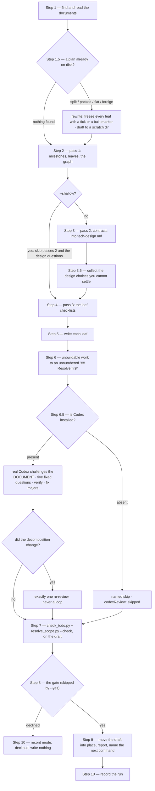

# spec-design — behaviour register

`/r:spec-design` turns written documentation into a three-level build plan: `## Milestone N` groups
the work, `tech-design.md` holds the contracts each milestone's leaves share, and `### Phase N` is
the leaf — the only addressable node and exactly one `/r:task-run`. It writes two files beside the
documents, `todo.md` and `tech-design.md`, and one counts-only row into the pack-wide store.

Its consumers are `/r:plan-run` (executes the plan, gates on `## Resolve first`, reads the graph for
concurrency), `/r:plan-unblock` (closes `## Resolve first` entries) and `/r:task-run` (builds one
leaf from its block alone). The shapes those three depend on are the ones marked load-bearing below.

Files: `skills/spec-design/SKILL.md`, `skills/spec-design/references/design-contracts.md`,
`skills/spec-design/references/stats-fields.md`, `skills/spec-design/scripts/check_todo.py`,
`skills/spec-design/tests/check_todo.test.sh`.

## The step flow

## Invocation and flags

- **SB-spec-design-001** — The skill carries `disable-model-invocation: true`: no prompt routes to
  it and nothing invokes it by inference. It rewrites a plan and can destroy the only record of what
  shipped, so it is invoked deliberately as `/r:spec-design` or not at all. Its description
  therefore costs the router nothing (it is not in the listing budget), and its own trigger and
  neighbour-exclusion eval cases are untestable by design — so the gate requires it to carry a
  behaviour case instead. The frontmatter flag is the enforcement, not a sentence in the body.
  *States it:* `skills/spec-design/SKILL.md`
  *Enforced by:* `tools/validate.py`
  *Tested by:* —

- **SB-spec-design-002** — It runs on `model: fable` at `effort: high`. Decomposing documents into a
  graph is the reasoning the whole plan is derived from, and every later skill inherits whatever
  this one got wrong.
  *States it:* `skills/spec-design/SKILL.md`
  *Enforced by:* `skills/spec-design/SKILL.md`
  *Tested by:* —

- **SB-spec-design-003** — The grammar is `/r:spec-design [<doc>...] ["<requirements>"] [--shallow]
  [--yes]`. Several documents is normal; omitted, they are discovered in Step 1.
  *States it:* `skills/spec-design/SKILL.md`
  *Enforced by:* —
  *Tested by:* —

- **SB-spec-design-004** — A plan among the `<doc>` paths is the plan to **rewrite**, not a document
  to plan from. There is no flag for this, because a plan on disk is found either way and
  overwriting one is never right.
  *States it:* `skills/spec-design/SKILL.md`
  *Enforced by:* —
  *Tested by:* —

- **SB-spec-design-005** — The free-text `"<requirements>"` argument carries **what the documents
  cannot say**: what matters most, what to defer, a deadline, a constraint, a part to leave alone.
  It **steers, it never adds** — ordering, the v1 line, how far to split are fair game; a
  requirement no document contains is not. Free text naming work no document describes goes to Open
  questions with a note that it needs a spec.
  *States it:* `skills/spec-design/SKILL.md`
  *Enforced by:* —
  *Tested by:* —

- **SB-spec-design-006** — Free text that contradicts the documents is an Open question, never a
  silent override. "Skip the admin UI" against a spec whose v1 line requires it is the disagreement
  a human has to settle; quietly deferring a v1 story is how a plan ships something nobody agreed
  to.
  *States it:* `skills/spec-design/SKILL.md`
  *Enforced by:* —
  *Tested by:* —

- **SB-spec-design-007** — `--shallow` stops after pass 1: milestones, leaves, `Depends on:` and the
  checklist, with no design pass. It skips Steps 3 and 3.5 and nothing else — it still checks,
  gates, hands off and records, with `mode: "shallow"`.
  *States it:* `skills/spec-design/SKILL.md`
  *Enforced by:* —
  *Tested by:* —

- **SB-spec-design-008** — `--shallow` writes **no** `tech-design.md` and says so rather than
  leaving a stale one beside a fresh plan. A contracts file beside a plan that never had contracts
  is worse than none, and `--tech-design` is omitted from the Step 7 check for the same reason.
  *States it:* `skills/spec-design/references/design-contracts.md`
  *Enforced by:* —
  *Tested by:* —

- **SB-spec-design-009** — `--yes` skips the Step 8 gate. It does **not** skip the Step 3.5
  questions: an unresolved design choice is recorded in Open questions with the option taken and
  why, so the decision stays visible when nobody was there to make it.
  *States it:* `skills/spec-design/SKILL.md`
  *Enforced by:* —
  *Tested by:* —

## Step 1 — find and read the documents

- **SB-spec-design-010** — Discovery order is: paths the user gave · `docs/<topic>/spec.html` ·
  `docs/*.md` (ask which, if several) · `spec.md`, `PROJECT.md`, `DESIGN.md`, `README.md` at the
  repo root.
  *States it:* `skills/spec-design/SKILL.md`
  *Enforced by:* —
  *Tested by:* —

- **SB-spec-design-011** — Where more than one document is offered, more than one is read, and the
  run says which documents it read and what it took from each. Reading only the tidiest is how half
  the requirements go missing.
  *States it:* `skills/spec-design/SKILL.md`
  *Enforced by:* —
  *Tested by:* —

- **SB-spec-design-012** — A root `DESIGN.md` carrying YAML token frontmatter (`colors:`,
  `typography:`, `spacing:`) is a visual identity written by `/r:ui-prototype`, not requirements. It
  is skipped, and the skip is noted — no product requirement can be derived from a colour palette.
  *States it:* `skills/spec-design/SKILL.md`
  *Enforced by:* —
  *Tested by:* —

- **SB-spec-design-013** — Two documents that disagree produce an Open question, never a silent
  pick. One of them is out of date and only the user knows which.
  *States it:* `skills/spec-design/SKILL.md`
  *Enforced by:* —
  *Tested by:* —

- **SB-spec-design-014** — With no documentation at all the run says so and points at
  `/r:spec-brainstorm`, rather than inventing a spec to plan against.
  *States it:* `skills/spec-design/SKILL.md`
  *Enforced by:* —
  *Tested by:* —

- **SB-spec-design-015** — Six things are pulled out of the documents: **user stories by name,
  verbatim** (the `<h3>` headings inside a `/r:spec-brainstorm` spec's User stories — the
  traceability spine); the components and the stack with versions, which are followed and never
  re-decided; the domain model, since every entity needs a migration somewhere; the API, since every
  endpoint, command or screen needs a leaf that builds it; risks whose mitigation is "investigate",
  which go to `## Resolve first`; and the v1 line.
  *States it:* `skills/spec-design/SKILL.md`
  *Enforced by:* `skills/spec-design/scripts/check_todo.py`
  *Tested by:* —

- **SB-spec-design-016** — A `/r:spec-brainstorm` spec's **Decisions** part is read before anything
  is ordered: each ADR's accepted consequence ("held payouts accumulate and need a queue") is a leaf
  somebody has to build, and re-opening a decision an ADR settled is the most expensive thing a plan
  can do.
  *States it:* `skills/spec-design/SKILL.md`
  *Enforced by:* —
  *Tested by:* —

- **SB-spec-design-017** — Its **Architectural characteristics** part holds at most three numbers
  the whole design is traded against, and a leaf that would miss one gets its own verification step
  rather than a note.
  *States it:* `skills/spec-design/SKILL.md`
  *Enforced by:* —
  *Tested by:* —

- **SB-spec-design-018** — In an existing codebase the code is read before anything is written:
  build files for real dependency versions, the migration folder for the real schema, the package
  layout, `CLAUDE.md`, and two existing tests to copy their style.
  *States it:* `skills/spec-design/SKILL.md`
  *Enforced by:* —
  *Tested by:* —

## Step 1.5 — an existing plan is an input, never a casualty

- **SB-spec-design-019** — Before pass 1 the run looks for a plan already on disk: the output path
  first, then where `/r:plan-run` looks — `docs/*/todo.md`, then `todo.md`, `PLAN.md`,
  `IMPLEMENTATION.md` at the root. Nothing found is a fresh run, and it goes straight to Step 2.
  *States it:* `skills/spec-design/SKILL.md`
  *Enforced by:* —
  *Tested by:* —

- **SB-spec-design-020** — A plan found is classified before it is touched, into one of four shapes,
  because what carries over differs: `split` (`## Milestone` + `**Depends on:**`, `tech-design.md`
  beside it — everything carries), `packed` (`## Milestone` with an inline `**Design**` — everything;
  the contracts move to `tech-design.md`), `flat` (`### Phase N` and `- [ ]`, no milestones or edges
  — the leaves carry, milestones and edges are derived), `foreign` (headings and checkboxes and
  little else — item text and tick state, nothing more).
  *States it:* `skills/spec-design/SKILL.md`
  *Enforced by:* —
  *Tested by:* —

- **SB-spec-design-021** — A `split` plan's contracts file may be `tech-design.md` or a `design.md`,
  and both are read the same way on input. Step 9 writes `tech-design.md` either way.
  *States it:* `skills/spec-design/SKILL.md`
  *Enforced by:* `skills/spec-design/scripts/check_todo.py`
  *Tested by:* `skills/spec-design/tests/check_todo.test.sh`

- **SB-spec-design-022** — **A leaf carrying at least one `- [x]` item, or a `<!-- built: … -->`
  marker on its heading, is frozen**: its number, title, tick state and every ticked item's wording
  come through the rewrite unchanged. Not only a fully-ticked leaf — a partly-ticked one has landed
  work too, and re-splitting it orphans those ticks. The number is what `--from N`, the branch and
  the PR body all name; the ticks are what stop `/r:plan-run` rebuilding what already shipped.
  *States it:* `skills/spec-design/SKILL.md`
  *Enforced by:* `skills/spec-design/scripts/check_todo.py`
  *Tested by:* `skills/spec-design/tests/check_todo.test.sh`

- **SB-spec-design-023** — An **unticked** item inside a frozen leaf may still be rewritten, and a
  frozen leaf may **gain** a missing `**Implements:**`, `**Depends on:**` or `**Done when:**` line.
  Those annotate what was built without changing it, and are how a `foreign` plan becomes conformant
  without falsifying its history.
  *States it:* `skills/spec-design/SKILL.md`
  *Enforced by:* —
  *Tested by:* —

- **SB-spec-design-024** — Everything unbuilt is free: re-split, re-scope, renumber, drop it, rewire
  the edges. New leaves are numbered **above the highest frozen one**, so numeric order stays a
  valid build order and no edge points backwards.
  *States it:* `skills/spec-design/SKILL.md`
  *Enforced by:* `skills/spec-design/scripts/check_todo.py`
  *Tested by:* `skills/spec-design/tests/check_todo.test.sh`

- **SB-spec-design-025** — A story the documents changed **after** a leaf shipped is new work, never
  an edit to the frozen leaf. The plan is the record of what was built, and rewriting it into the
  present tense destroys the only copy.
  *States it:* `skills/spec-design/SKILL.md`
  *Enforced by:* —
  *Tested by:* —

- **SB-spec-design-026** — Where a `flat` or `foreign` plan has no `### Phase N` numbering, numbers
  are assigned **in document order** — the honest reading of a list nobody ordered — and from that
  moment the numbers are identity.
  *States it:* `skills/spec-design/SKILL.md`
  *Enforced by:* —
  *Tested by:* —

- **SB-spec-design-027** — Every milestone grouping, edge and `Implements:` name no author wrote is
  **inferred**, and every one is named as inferred at the gate. An inferred edge reads exactly like
  an authored one — the same reason `file:LINE` references are banned from the contracts.
  *States it:* `skills/spec-design/SKILL.md`
  *Enforced by:* —
  *Tested by:* —

- **SB-spec-design-028** — `**Done when:**` is the one field never invented. It is derived from the
  build files read in Step 1, or the leaf is left without one and the checker reports it before the
  gate. Writing `mvn test` to quiet a check is worse than the check failing.
  *States it:* `skills/spec-design/SKILL.md`
  *Enforced by:* —
  *Tested by:* —

- **SB-spec-design-029** — The draft — `todo.md` **and** `tech-design.md` — is written to a scratch
  directory and checked and gated there. Nothing reaches the real paths until Step 9, so a declined
  rewrite leaves the original byte-identical.
  *States it:* `skills/spec-design/SKILL.md`
  *Enforced by:* —
  *Tested by:* —

## Step 2 — pass 1: milestones, leaves and the graph

- **SB-spec-design-030** — Pass 1 works backwards from the v1 line — the smallest run of leaves that
  delivers a usable end-to-end result — and then orders by dependency.
  *States it:* `skills/spec-design/SKILL.md`
  *Enforced by:* —
  *Tested by:* —

- **SB-spec-design-031** — Leaves are **vertical slices** that leave the project working and
  verifiable, never horizontal layers that don't run on their own. "Add the users table, the
  repository, the service and the endpoint, with a test that hits it" is a leaf; "add all the
  entities" is not.
  *States it:* `skills/spec-design/SKILL.md`
  *Enforced by:* —
  *Tested by:* —

- **SB-spec-design-032** — A leaf is sized to one focused session: **5–12 checklist items, roughly
  ≤400 lines of new code, one to three slices** — the size `/r:task-run` is built around. A deeper
  plan means richer items, not more of them; a leaf that sprawls across subsystems is split, and a
  trivial edit is folded into a neighbour.
  *States it:* `skills/spec-design/SKILL.md`
  *Enforced by:* `skills/spec-design/scripts/check_todo.py`
  *Tested by:* —

- **SB-spec-design-033** — The **story count** sets the plan's size, not a band picked in advance:
  roughly one to two leaves per story, plus what the stories don't cover — the first schema, the
  deployment, the seams between modules.
  *States it:* `skills/spec-design/SKILL.md`
  *Enforced by:* —
  *Tested by:* —

- **SB-spec-design-034** — Leaves are grouped under `## Milestone N — <name>`, a coherent area of
  the product, usually 3–8 leaves, and the header says which milestones deliver v1.
  *States it:* `skills/spec-design/SKILL.md`
  *Enforced by:* —
  *Tested by:* —

- **SB-spec-design-035** — Leaf numbering runs **continuously across every milestone and starts at
  1**. Restarting inside a milestone makes "Phase 3" ambiguous and gets the wrong boxes ticked.
  *States it:* `skills/spec-design/SKILL.md`
  *Enforced by:* `skills/spec-design/scripts/check_todo.py`
  *Tested by:* —

- **SB-spec-design-036** — **Every leaf declares `**Depends on:**`** — the leaves it builds on, or
  `—` when it has none. Not optional and not "only when the order isn't obvious": it *is* the graph,
  and the graph decides which leaves may be built at the same time. A missing line is a reported
  defect.
  *States it:* `skills/spec-design/SKILL.md`
  *Enforced by:* `skills/spec-design/scripts/check_todo.py`
  *Tested by:* `skills/spec-design/tests/check_todo.test.sh`

- **SB-spec-design-037** — Leaves are numbered so that **every dependency is lower-numbered**.
  Numeric order then *is* a valid build order, which is what lets `/r:plan-run` run the plan
  straight down the page and still respect every edge.
  *States it:* `skills/spec-design/SKILL.md`
  *Enforced by:* `skills/spec-design/scripts/check_todo.py`
  *Tested by:* `skills/spec-design/tests/check_todo.test.sh`

- **SB-spec-design-038** — Two leaves in one wave may not name the same file, and the fix is to
  **re-cut the two leaves before reaching for an edge** — a collision usually says the seam is in
  the wrong place. The edge is the fallback and costs a whole wave. **When in doubt, serialise**:
  a needless edge only costs wall-clock and someone can remove it later, while a missing one is
  silent and wrong — two sessions edit one file from two clean bases and whichever merges second
  quietly reverts the first. A wave is never bought back by dropping a true edge or by leaving a
  file out of `Files:`.
  *States it:* `skills/spec-design/references/design-contracts.md`
  *Enforced by:* `skills/spec-design/scripts/check_todo.py`
  *Tested by:* `skills/spec-design/tests/check_todo.test.sh`

## Step 3 — pass 2: the design contracts

- **SB-spec-design-039** — Each milestone's contracts go into `tech-design.md` beside the plan, one
  `## Milestone N — <name>` section each, holding the decisions its leaves **share** — and only
  after the leaves exist, because until then shared cannot be told from local.
  *States it:* `skills/spec-design/SKILL.md`
  *Enforced by:* `skills/spec-design/scripts/check_todo.py`
  *Tested by:* `skills/spec-design/tests/check_todo.test.sh`

- **SB-spec-design-040** — A contract is the detail that survives being written before the code
  exists: **schema** (column types, nullability, defaults, indexes, unique constraints, foreign
  keys), **API** (method, path, request and response shape, every status code including the error
  ones), **types** (signatures and the invariants that matter), **boundaries** (which module owns
  what and what may import what), and **tests** named with the case each one locks.
  *States it:* `skills/spec-design/references/design-contracts.md`
  *Enforced by:* —
  *Tested by:* —

- **SB-spec-design-041** — Only shared detail is written. A contract used by exactly one leaf
  belongs in that leaf's items — hoisting it adds a hop for the reader and reaches nobody extra.
  *States it:* `skills/spec-design/SKILL.md`
  *Enforced by:* —
  *Tested by:* —

- **SB-spec-design-042** — A milestone heading may carry **one** pointer line for the reader —
  `Contracts: tech-design.md#milestone-1-ledger`. It sits on the milestone and **never on a `- [ ]`
  line**: that is the difference between a signpost and a dangling pointer.
  *States it:* `skills/spec-design/SKILL.md`
  *Enforced by:* `skills/spec-design/scripts/check_todo.py`
  *Tested by:* `skills/spec-design/tests/check_todo.test.sh`

- **SB-spec-design-043** — **Never `file:LINE` references and never a reuse map.** For a leaf six
  weeks out those are imagined, and an imagined citation is worse than none because it reads exactly
  like a real one. `/r:task-run`'s planner writes both at execution time with the files open, and
  its reuse map is explicitly "the evidence you explored rather than imagined".
  *States it:* `skills/spec-design/SKILL.md`
  *Enforced by:* —
  *Tested by:* —

- **SB-spec-design-044** — Approach prose, algorithms, pseudocode and file-by-file change lists are
  out for the same reason: they are a diff plan against a codebase that does not exist yet. By the
  time leaf 9 runs, earlier leaves may have ruled the approach out, and an implementer following a
  stale one lands somewhere nobody chose.
  *States it:* `skills/spec-design/references/design-contracts.md`
  *Enforced by:* —
  *Tested by:* —

- **SB-spec-design-045** — The stack is never re-decided. The documents chose it.
  *States it:* `skills/spec-design/SKILL.md`
  *Enforced by:* —
  *Tested by:* —

## Step 3.5 — the design choices it cannot settle

- **SB-spec-design-046** — A choice is asked about only when **all three** hold: the documents do
  not settle it (read, and the answer is absent — not merely vague, and never a decision the spec
  already made); two or more options are defensible and reasonable engineers would disagree; and the
  choice changes the plan — the contracts, how leaves split, the graph, or the v1 line.
  *States it:* `skills/spec-design/SKILL.md`
  *Enforced by:* —
  *Tested by:* —

- **SB-spec-design-047** — Naming, column order, whether a helper is static, which test framework
  the repo already uses, anything the code or `CLAUDE.md` answers by looking, are **not** design
  questions. If it would not go in a design review it is not asked: six questions per plan and the
  user stops reading.
  *States it:* `skills/spec-design/SKILL.md`
  *Enforced by:* —
  *Tested by:* —

- **SB-spec-design-048** — The questions are carried to Step 8 and asked **together, once, at the
  gate**, alongside the decomposition — one interruption for both, because an answer that changes
  the contracts usually changes the split too.
  *States it:* `skills/spec-design/SKILL.md`
  *Enforced by:* —
  *Tested by:* —

- **SB-spec-design-049** — Each question states the decision, the options, what each costs, and
  **which one it would take and why**. A question with no lean makes the user redo the analysis the
  skill just did.
  *States it:* `skills/spec-design/SKILL.md`
  *Enforced by:* —
  *Tested by:* —

- **SB-spec-design-050** — An answer is never invented for a question that met the bar. Under
  `--yes`, or when the user declines to choose, the recommended option is taken, the plan is built on
  it, and Open questions records the decision, the alternative, and what would have to be true for
  the alternative to win. A design choice nobody made is fine; one nobody can *find* is not.
  *States it:* `skills/spec-design/SKILL.md`
  *Enforced by:* —
  *Tested by:* —

## Step 4 and Step 5 — the leaf

- **SB-spec-design-051** — Pass 3 turns each milestone's contracts into its leaves' `- [ ]` items —
  the slice each leaf realizes plus whatever is local to it. An item names the concrete thing: the
  DDL, the endpoint and its responses, the signature, the named test. "Add idempotency to the payout
  webhook" is unbuildable — the planner re-derives everything.
  *States it:* `skills/spec-design/SKILL.md`
  *Enforced by:* `skills/spec-design/scripts/check_todo.py`
  *Tested by:* —

- **SB-spec-design-052** — **Every item stands alone.** The part of the contract an item needs is
  repeated into it rather than pointed at, because the implementer never sees the milestone section.
  Repetition between a contracts section and the items derived from it is expected and correct, not
  duplication to factor out.
  *States it:* `skills/spec-design/SKILL.md`
  *Enforced by:* `skills/spec-design/scripts/check_todo.py`
  *Tested by:* `skills/spec-design/tests/check_todo.test.sh`

- **SB-spec-design-053** — A leaf is written as `### Phase N — title` with `**Implements:**`,
  `**Depends on:**`, `**Files:**`, an optional `**Risk:**`, the `- [ ]` checklist, and
  `**Done when:**`.
  *States it:* `skills/spec-design/SKILL.md`
  *Enforced by:* `skills/spec-design/scripts/check_todo.py`
  *Tested by:* `skills/spec-design/tests/check_todo.test.sh`

- **SB-spec-design-054** — `**Implements:**` is required and carries **story names verbatim**,
  separated by ` · `. `check_todo.py` matches them against the spec exactly, so a paraphrase reads
  as a story with no leaf. This keeps the documents and the plan one artefact rather than two that
  drift.
  *States it:* `skills/spec-design/SKILL.md`
  *Enforced by:* `skills/spec-design/scripts/check_todo.py`
  *Tested by:* —

- **SB-spec-design-055** — `**Done when:**` is required and is a runnable command or an observable
  response. "The feature works" is not a check; if no command can be written, the leaf is too vague
  to start.
  *States it:* `skills/spec-design/SKILL.md`
  *Enforced by:* `skills/spec-design/scripts/check_todo.py`
  *Tested by:* —

- **SB-spec-design-056** — `**Files:**` is required where the codebase exists, and it is what the
  same-wave collision check reads: two leaves in one wave naming the same file cannot run
  concurrently.
  *States it:* `skills/spec-design/SKILL.md`
  *Enforced by:* `skills/spec-design/scripts/check_todo.py`
  *Tested by:* `skills/spec-design/tests/check_todo.test.sh`

- **SB-spec-design-057** — `**Risk:**` is written **only** when the leaf touches auth, money,
  persistence, concurrency or security — the surfaces `/r:task-run` escalates on, and the line
  `/r:plan-run` reads to force the full review tier. It is omitted rather than written as "Risk:
  low": a missing line means *no claim*, and the classifier reading real code then decides, which it
  does better.
  *States it:* `skills/spec-design/SKILL.md`
  *Enforced by:* `skills/spec-design/scripts/check_todo.py`
  *Tested by:* —

## Step 6 — what is a leaf, and what isn't

- **SB-spec-design-058** — A numbered leaf is work a coding agent can build and verify — code,
  schema, config, infrastructure, with a check you can run. That is the entire numbered list,
  because `/r:task-run` executes one by branching, implementing test-first, building and opening a
  PR; hand it anything else and it will try to do all of that to a decision.
  *States it:* `skills/spec-design/SKILL.md`
  *Enforced by:* `skills/spec-design/scripts/check_todo.py`
  *Tested by:* —

- **SB-spec-design-059** — Two kinds of real work are never numbered: unknowns that need resolving
  before anyone builds ("can Debezium read our RDS instance?"), whose output is a decision rather
  than a diff; and work that isn't engineering — staffing a rota, signing a DPA, procuring a
  licence.
  *States it:* `skills/spec-design/SKILL.md`
  *Enforced by:* `skills/spec-design/scripts/check_todo.py`
  *Tested by:* —

- **SB-spec-design-060** — Both go under an **unnumbered `## Resolve first`** placed above the
  milestones. Unnumbered keeps them out of `/r:task-run`'s reach — it looks for `### Phase N` —
  while leaving them where the reader will see them.
  *States it:* `skills/spec-design/SKILL.md`
  *Enforced by:* `skills/plan-unblock/scripts/resolve_scope.py`
  *Tested by:* `skills/plan-unblock/tests/resolve_scope.test.sh`

- **SB-spec-design-061** — **Every `## Resolve first` entry is written as a `- [ ]` checkbox**, with
  `Owner:`, `Blocks:`, `Timebox:` and `Output:` on the line below. The checkbox is the only thing
  that can ever be flipped, and `/r:plan-run`'s gate reads exactly that; an entry written as a plain
  bullet stops the phases it names forever.
  *States it:* `skills/spec-design/SKILL.md`
  *Enforced by:* `skills/plan-unblock/scripts/resolve_scope.py`
  *Tested by:* `skills/spec-design/tests/check_todo.test.sh`

- **SB-spec-design-062** — **`Blocks:` is the only edge.** A phase number in the subject is part of
  the subject, and an entry whose `Blocks:` is missing or names no phase blocks the **entire run
  list**, because nothing can tell what it was guarding.
  *States it:* `skills/spec-design/references/design-contracts.md`
  *Enforced by:* `skills/plan-unblock/scripts/resolve_scope.py`
  *Tested by:* `skills/spec-design/tests/check_todo.test.sh`

- **SB-spec-design-063** — A closed entry keeps its `Resolved:` line — the date, the decision and
  the force that settled it — and that line is the **single record**. It is never copied into
  `tech-design.md`, because a rewrite replaces both files together and would destroy the copy in the
  very step a resolution usually triggers.
  *States it:* `skills/spec-design/references/design-contracts.md`
  *Enforced by:* `skills/spec-design/scripts/check_todo.py`
  *Tested by:* `skills/spec-design/tests/check_todo.test.sh`

- **SB-spec-design-064** — `/r:plan-unblock` is what closes these entries, and is the only thing
  that may write in the section: it probes what the repo can answer, puts the rest to a person, and
  stamps each entry with what settled it. `/r:task-run` is forbidden by name from adding a bullet
  there, because an agent-authored entry is a claim about who decided something.
  *States it:* `skills/spec-design/references/design-contracts.md`
  *Enforced by:* `skills/task-run/task-run-implement.workflow.js`
  *Tested by:* —

## Step 6.5 — Codex challenges the draft

- **SB-spec-design-065** — Before the user sees the decomposition and while nothing is on disk, the
  **real Codex** challenges the draft — a second reader with no stake in it.
  *States it:* `skills/spec-design/SKILL.md`
  *Enforced by:* —
  *Tested by:* —

- **SB-spec-design-066** — Codex is the pack's one optional prerequisite, so it is resolved first at
  two paths (`~/.claude/plugins/marketplaces/openai-codex/…/codex-companion.mjs`, then the versioned
  `plugins/cache` copy). Absent → the step is **skipped and named**, at the gate and in the report,
  with `codexReview: "skipped"`, and the run carries on. A skipped review reported as a review is
  worse than none.
  *States it:* `skills/spec-design/SKILL.md`
  *Enforced by:* —
  *Tested by:* —

- **SB-spec-design-067** — The review reads the plan **document**, not a diff, and runs through
  `/codex:rescue`. `/r:code-adversarial` and its `run.sh` are never used here: they review a git
  diff, there is no diff, and running one from a Codex-backed context makes Codex re-enter the
  wrapper that launches Codex.
  *States it:* `skills/spec-design/SKILL.md`
  *Enforced by:* —
  *Tested by:* —

- **SB-spec-design-068** — Where `/codex:rescue` cannot collect the run, the companion is called
  directly as `node "$C" task --background --write=false --effort medium "<rubric>"`. `--background`
  is not optional: it is the only flag that hands the run to a detached worker, and without it the
  CLI is killed with the Bash call that launched it about two minutes in, leaving a job record stuck
  at `"status":"running"` — the exact shape of a crash.
  *States it:* `skills/spec-design/SKILL.md`
  *Enforced by:* —
  *Tested by:* —

- **SB-spec-design-069** — The rubric is **five fixed questions**: coverage (does every story reach
  a leaf, does the v1 line ship something usable), the graph (a leaf buildable only after something
  numbered later; an edge claiming a dependency that isn't real), the contracts (sections that
  contradict each other, the documents or the code; a schema, endpoint or signature wrong for its
  job), self-containment (could an implementer build a randomly picked leaf from its own block
  alone), and buildability and size. A fixed list makes two runs comparable and stops the review
  wandering into prose style.
  *States it:* `skills/spec-design/SKILL.md`
  *Enforced by:* —
  *Tested by:* —

- **SB-spec-design-070** — Every finding is **verified before it is acted on** — Codex has read the
  plan, not always the project — and classified three ways: major + relevant is **fixed** now, while
  nothing is on disk, and whatever the fix touched is re-checked; minor or a matter of taste is
  **noted, never rewritten** (a plan churned over style costs a pass and changes nothing an
  implementer would notice); not real is **dismissed with the reason**.
  *States it:* `skills/spec-design/SKILL.md`
  *Enforced by:* —
  *Tested by:* —

- **SB-spec-design-071** — All three lists — raised, applied, dismissed — are carried into the gate
  and the report. Dropped, "Codex raised three majors and every one was dismissed" reads exactly
  like "Codex found nothing", which are opposite facts about the plan.
  *States it:* `skills/spec-design/SKILL.md`
  *Enforced by:* —
  *Tested by:* —

- **SB-spec-design-072** — The rubric stays at five on a rewrite. No sixth question about what was
  frozen: the freeze rule is checked mechanically by `check_todo.py --against` in Step 7, and a
  rubric that changes by mode stops two runs being comparable.
  *States it:* `skills/spec-design/SKILL.md`
  *Enforced by:* —
  *Tested by:* —

- **SB-spec-design-073** — Re-review happens **once, and only if the decomposition changed** — a
  leaf added, removed or re-split, or an edge moved — to catch a fix that opened a fresh hole. One
  bounded pass, never a loop until the plan is flawless; the gate follows, where a human reads it
  anyway.
  *States it:* `skills/spec-design/SKILL.md`
  *Enforced by:* —
  *Tested by:* —

## Step 7 — check it

- **SB-spec-design-074** — Both checkers run on the **draft**, where Step 1.5 put it, never on the
  real paths, which nothing has written to yet:
  `check_todo.py <draft>/todo.md --spec … --tech-design <draft>/tech-design.md --against <the plan
  being replaced>`, then `resolve_scope.py <draft>/todo.md --check`. Findings are fixed and the
  checkers re-run.
  *States it:* `skills/spec-design/SKILL.md`
  *Enforced by:* `skills/spec-design/scripts/check_todo.py`
  *Tested by:* `skills/spec-design/tests/check_todo.test.sh`

- **SB-spec-design-075** — The scripts are reached through the placeholders, never a hard-coded
  install path: `${CLAUDE_SKILL_DIR}/scripts/check_todo.py` for its own, and
  `${CLAUDE_PLUGIN_ROOT}/skills/plan-unblock/scripts/resolve_scope.py` for another skill's. A bare
  `scripts/…` would resolve against the user's project.
  *States it:* `skills/spec-design/SKILL.md`
  *Enforced by:* `tools/validate.py`
  *Tested by:* —

- **SB-spec-design-076** — The `resolve_scope.py --check` half runs **unconditionally**, including
  on a plan with no `## Resolve first` at all: deciding whether that section is empty is the parse
  it exists to do. It exits 1 on any finding — an entry with no checkbox, no `Owner:`, no readable
  `Blocks:`, a `Blocks:` naming a phase this plan does not have, or a tick with nothing recording
  what settled it.
  *States it:* `skills/spec-design/SKILL.md`
  *Enforced by:* `skills/plan-unblock/scripts/resolve_scope.py`
  *Tested by:* `skills/plan-unblock/tests/resolve_scope.test.sh`

- **SB-spec-design-077** — `--tech-design` checks that the plan and the contracts are one document
  in two files: a milestone whose contracts nobody can find, a contracts section for a milestone
  that doesn't exist, a name changed on one side only, and contracts left inline while
  `tech-design.md` sits beside them. Nothing else would ever notice, because no tool reads the
  contracts file. It is omitted on `--shallow`, which writes none.
  *States it:* `skills/spec-design/SKILL.md`
  *Enforced by:* `skills/spec-design/scripts/check_todo.py`
  *Tested by:* `skills/spec-design/tests/check_todo.test.sh`

- **SB-spec-design-078** — A contracts file named `design.md` does **not** satisfy `--tech-design`:
  the checker reports the file it was told to read as missing rather than falling back, because a
  quiet fallback would leave a project green forever on a file nothing else in the pack still names.
  *States it:* `skills/spec-design/scripts/check_todo.py`
  *Enforced by:* `skills/spec-design/scripts/check_todo.py`
  *Tested by:* `skills/spec-design/tests/check_todo.test.sh`

- **SB-spec-design-079** — `--against` is the mechanical guard on the freeze rule and is **not
  optional on a rewrite**. It reports a frozen leaf that vanished or was retitled (the same loss,
  and both are fixed by putting it back), one that was renumbered, a tick that was lost or
  un-ticked, a dropped `<!-- built: -->` marker, and a resolved `## Resolve first` entry that is
  gone. **A finding there is never fixed by loosening the check** — it means the rewrite took
  something it was not allowed to take.
  *States it:* `skills/spec-design/SKILL.md`
  *Enforced by:* `skills/spec-design/scripts/check_todo.py`
  *Tested by:* `skills/spec-design/tests/check_todo.test.sh`

- **SB-spec-design-080** — Against a previous plan with no `### Phase N` numbering, `--against`
  checks the one thing that plan did carry: that **every ticked item survived**, matched globally,
  since there was no numbering to preserve.
  *States it:* `skills/spec-design/SKILL.md`
  *Enforced by:* `skills/spec-design/scripts/check_todo.py`
  *Tested by:* `skills/spec-design/tests/check_todo.test.sh`

- **SB-spec-design-081** — An unbuilt leaf is invisible to `--against`: a re-split, a renumber or a
  drop of work nobody started is exactly the point of rewriting, so the check reads only the frozen
  set and says nothing about the rest.
  *States it:* `skills/spec-design/scripts/check_todo.py`
  *Enforced by:* `skills/spec-design/scripts/check_todo.py`
  *Tested by:* `skills/spec-design/tests/check_todo.test.sh`

- **SB-spec-design-082** — After the scripts, four judgments a script cannot make (five on a
  rewrite): order — could someone build leaf 3 with only 1 and 2 finished; slices — does each leaf
  leave the project working and demonstrable; honesty — is any "done when" a check you couldn't run
  today; self-containment — pick two leaves at random and read only their blocks, which is exactly
  what `/r:task-run` sees; and on a rewrite, does every frozen leaf still say what was actually
  built.
  *States it:* `skills/spec-design/SKILL.md`
  *Enforced by:* —
  *Tested by:* —

## `check_todo.py` — the checker this skill ships

- **SB-spec-design-083** — It exits **0 when clean, 1 when anything is reported**, which is what
  makes Step 7 a fix-and-re-run loop. Notes are informational and never count as problems — a note
  that counted would make "clean" unreachable and suppress everything printed on the clean path.
  *States it:* `skills/spec-design/scripts/check_todo.py`
  *Enforced by:* `skills/spec-design/scripts/check_todo.py`
  *Tested by:* `skills/spec-design/tests/check_todo.test.sh`

- **SB-spec-design-084** — Its four modes are the plain run, `--spec` (story coverage),
  `--tech-design` (the two files as one document), `--against` (the freeze rule) and `--slice`
  (the concurrency preflight). With no `--spec`, a `spec.html` sitting beside the plan is used.
  *States it:* `skills/spec-design/scripts/check_todo.py`
  *Enforced by:* `skills/spec-design/scripts/check_todo.py`
  *Tested by:* `skills/spec-design/tests/check_todo.test.sh`

- **SB-spec-design-085** — The structural contract `/r:task-run` depends on is checked first: at
  least one `### Phase N — title` heading (without one the checker stops, since nothing can locate a
  phase), numbering that starts at 1, and no gaps or repeats.
  *States it:* `skills/spec-design/scripts/check_todo.py`
  *Enforced by:* `skills/spec-design/scripts/check_todo.py`
  *Tested by:* —

- **SB-spec-design-086** — The "are there any `- [ ]` items" check is scoped to the **phase
  blocks**, never the whole file. `## Resolve first` entries carry checkboxes of their own, so a
  whole-file search would find one there and pass a plan whose leaves have no acceptance criteria at
  all — the only thing this check was ever about.
  *States it:* `skills/spec-design/scripts/check_todo.py`
  *Enforced by:* `skills/spec-design/scripts/check_todo.py`
  *Tested by:* `skills/spec-design/tests/check_todo.test.sh`

- **SB-spec-design-087** — Per leaf it reports: a missing `Depends on` line, an item that defers
  outside its own block, no checklist items, more than 12 open items, a missing or uncheckable `Done
  when`, a missing `Implements` line, vague task text, a title that is not buildable work, a file
  modified that nothing created, and a leaf touching a risk surface with no `Risk:` line.
  *States it:* `skills/spec-design/scripts/check_todo.py`
  *Enforced by:* `skills/spec-design/scripts/check_todo.py`
  *Tested by:* —

- **SB-spec-design-088** — A **fully ticked** leaf is a finished one, not a defective one: "no
  items" means no checkbox of either state. A plan under execution is a normal input, since
  `/r:plan-run` ticks as it lands each leaf and re-runs this on the way past.
  *States it:* `skills/spec-design/scripts/check_todo.py`
  *Enforced by:* `skills/spec-design/scripts/check_todo.py`
  *Tested by:* `skills/spec-design/tests/check_todo.test.sh`

- **SB-spec-design-089** — The graph rules it enforces: a dependency on a phase that does not exist,
  a self-dependency, a dependency on a **higher-numbered** leaf (numeric order has to *be* a
  topological order or the run builds on something it has not built yet), and a cycle.
  *States it:* `skills/spec-design/scripts/check_todo.py`
  *Enforced by:* `skills/spec-design/scripts/check_todo.py`
  *Tested by:* `skills/spec-design/tests/check_todo.test.sh`

- **SB-spec-design-090** — **Waves are derived, never authored**: `wave(p) = 0` with no dependency,
  else `1 + max(wave(d))` — longest-path layering, so a leaf never shares a wave with anything it
  depends on. A `## Waves` block in the document is a generated summary, recomputed and reported
  when it has drifted, and **never hand-edited**: a stale summary is worse than none, because it is
  the half a person reads when deciding what to run at once.
  *States it:* `skills/spec-design/references/design-contracts.md`
  *Enforced by:* `skills/spec-design/scripts/check_todo.py`
  *Tested by:* `skills/spec-design/tests/check_todo.test.sh`

- **SB-spec-design-091** — The wave table prints **either way**, clean or not. It is the graph, not
  a verdict on the plan, and a caller deciding what to run concurrently needs it just as much when
  the plan has warts. A wave of one is printed too — it says plainly that there is nothing to
  parallelise there, which is the answer most waves have.
  *States it:* `skills/spec-design/scripts/check_todo.py`
  *Enforced by:* `skills/spec-design/scripts/check_todo.py`
  *Tested by:* `skills/spec-design/tests/check_todo.test.sh`

- **SB-spec-design-092** — The plan file itself is excluded from the collision check: every leaf
  ticks it, so it is shared by construction, and git merges the ticks because separate leaves edit
  separate regions.
  *States it:* `skills/spec-design/references/design-contracts.md`
  *Enforced by:* `skills/spec-design/scripts/check_todo.py`
  *Tested by:* `skills/spec-design/tests/check_todo.test.sh`

- **SB-spec-design-093** — Generated artefacts are excluded from the collision check **by shape,
  never by a whitelist of source extensions**: anything ending `.golden`, anything under `testdata`,
  anything under `.claude`. A captured frame or a golden file is rewritten wholesale by whichever
  run touched it last, so sharing one is no conflict, and the volume buries the source files that
  are — one project carries 140 captures under `.claude/`, turning an 11-file phase into a 48-file
  one. A whitelist would silently drop a language nobody listed, and a dropped file is a collision
  this check does not report: it would fail open, the one direction a safety check may not fail.
  *States it:* `skills/spec-design/scripts/check_todo.py`
  *Enforced by:* `skills/spec-design/scripts/check_todo.py`
  *Tested by:* `skills/spec-design/tests/check_todo.test.sh`

- **SB-spec-design-094** — `--slice <n,n>` answers a different question — may these leaves run
  concurrently, right now — and is `/r:plan-run`'s preflight. It reports **only** what makes that
  unsafe: a phase that does not exist, one already done, a dependency not built yet, a dependency
  inside the same slice, and a shared file. Plan-quality findings are deliberately discarded:
  refusing concurrent work over a missing `Implements:` line would be noise at the worst moment.
  *States it:* `skills/spec-design/references/design-contracts.md`
  *Enforced by:* `skills/spec-design/scripts/check_todo.py`
  *Tested by:* `skills/spec-design/tests/check_todo.test.sh`

- **SB-spec-design-095** — Story coverage is matched **exactly** against the spec's `<h3>` names
  under its User stories section, and reports both directions: stories with no phase, and phases
  citing a story the spec does not define. A paraphrase is indistinguishable from a story nobody
  planned. No spec, or a spec with no such section, is a **note** rather than a problem.
  *States it:* `skills/spec-design/scripts/check_todo.py`
  *Enforced by:* `skills/spec-design/scripts/check_todo.py`
  *Tested by:* —

- **SB-spec-design-096** — The `## Resolve first` field contract is mirrored here as **notes, never
  problems**, so a defect is discovered at authoring time without rejecting a plan already on disk —
  an agent is forbidden by name from editing that section, and the same text was valid under an
  older shape of the contract. Observed: three entries carrying `Blocks: nothing. Informs: …` halted
  a fan-out on a plan authored nine days earlier.
  *States it:* `skills/spec-design/scripts/check_todo.py`
  *Enforced by:* `skills/spec-design/scripts/check_todo.py`
  *Tested by:* `skills/spec-design/tests/check_todo.test.sh`

- **SB-spec-design-097** — Each of those notes carries the **remedy** as well as the problem, in the
  run gate's own terms — a plain bullet is named together with "`/r:plan-unblock` migrates it to the
  checkbox form and closes it in the same edit", and it is never described as something that can
  never be ticked. Naming a problem without its remedy is what taught two sessions that a stop was
  permanent and an orchestrator to instruct units past the gate.
  *States it:* `skills/spec-design/scripts/check_todo.py`
  *Enforced by:* `skills/spec-design/scripts/check_todo.py`
  *Tested by:* `skills/spec-design/tests/check_todo.test.sh`

- **SB-spec-design-098** — A well-formed `## Resolve first` entry produces **no** note, or every
  plan carries noise and the notes stop being read.
  *States it:* `skills/spec-design/scripts/check_todo.py`
  *Enforced by:* `skills/spec-design/scripts/check_todo.py`
  *Tested by:* `skills/spec-design/tests/check_todo.test.sh`

- **SB-spec-design-099** — The field list `Owner, Blocks, Timebox, Output, Resolved, Alternative,
  Outstanding` is duplicated from `resolve_scope.py` on purpose: that script is the enforcer and
  this one is the author's mirror of it, and a runtime import across two skill directories is more
  fragile than two lists someone keeps in step. Change one, change the other.
  *States it:* `skills/spec-design/scripts/check_todo.py`
  *Enforced by:* —
  *Tested by:* `skills/spec-design/tests/check_todo.test.sh`

## Step 8 — the gate

- **SB-spec-design-100** — **Nothing is written to disk before the gate.** It shows the milestones,
  the leaf titles, the graph, the wave table, what Codex raised and what was done about it, and the
  open design choices from Step 3.5 — then stops for a yes.
  *States it:* `skills/spec-design/SKILL.md`
  *Enforced by:* —
  *Tested by:* —

- **SB-spec-design-101** — The gate says plainly when the Codex review was skipped for want of the
  plugin. An unreviewed plan and a reviewed-and-clean one must not look alike at the one moment a
  human is deciding.
  *States it:* `skills/spec-design/SKILL.md`
  *Enforced by:* —
  *Tested by:* —

- **SB-spec-design-102** — The decomposition and the design choices go in the **same interruption**,
  because they are one decision seen twice: a choice that changes the contracts usually changes
  which leaves exist. Discrete options are put through `AskUserQuestion`, each carrying the
  recommendation and what it costs.
  *States it:* `skills/spec-design/SKILL.md`
  *Enforced by:* —
  *Tested by:* —

- **SB-spec-design-103** — There is **one** gate and none after it. Every later pass hangs off the
  decomposition, and this is the cheapest moment to fix it: a re-split before writing costs one
  message, after writing the whole document.
  *States it:* `skills/spec-design/SKILL.md`
  *Enforced by:* —
  *Tested by:* —

- **SB-spec-design-104** — If the user declines, **nothing is written** and the run goes straight to
  Step 10 with `mode: "declined"` and the counts it had drafted. A rejected decomposition is the
  outcome this skill most needs to see later, and it is invisible if a declined run simply ends.
  *States it:* `skills/spec-design/SKILL.md`
  *Enforced by:* —
  *Tested by:* —

- **SB-spec-design-105** — On a rewrite the gate carries the **migration first**, before the
  decomposition, because that is the part that can destroy something: the shape found, and counts
  for frozen, re-split, added, dropped and inferred.
  *States it:* `skills/spec-design/SKILL.md`
  *Enforced by:* —
  *Tested by:* —

- **SB-spec-design-106** — The `inferred` and `dropped` lines are read out **item by item, not as a
  count**. Those are the claims nobody authored and the removals nobody may notice, and the gate is
  the only place a human can refuse one.
  *States it:* `skills/spec-design/SKILL.md`
  *Enforced by:* —
  *Tested by:* —

- **SB-spec-design-107** — `--shallow` gates the same way; `--yes` skips the gate entirely.
  *States it:* `skills/spec-design/SKILL.md`
  *Enforced by:* —
  *Tested by:* —

## Step 9 — hand off

- **SB-spec-design-108** — The draft is moved into place **beside the documents** —
  `docs/<topic>/todo.md` and `docs/<topic>/tech-design.md` when the spec is `docs/<topic>/spec.html`.
  A root `todo.md` is never written when the spec lives in `docs/`: a second plan with independent
  numbering is a trap.
  *States it:* `skills/spec-design/SKILL.md`
  *Enforced by:* —
  *Tested by:* —

- **SB-spec-design-109** — On a rewrite both files are replaced together, and a `design.md` that
  Step 1.5 read as the contracts file is **replaced** by `tech-design.md`, never left beside it. Two
  contracts documents beside one plan are free to disagree, and only one of them is the file
  anything still reads.
  *States it:* `skills/spec-design/SKILL.md`
  *Enforced by:* —
  *Tested by:* —

- **SB-spec-design-110** — Where the plan is tracked, the rewrite is left as a working-tree change
  and said to be one: `git diff`, the delete included, is the best record of what the rewrite moved.
  *States it:* `skills/spec-design/SKILL.md`
  *Enforced by:* —
  *Tested by:* —

- **SB-spec-design-111** — The report carries the leaf count, where the v1 line falls, the wave
  table, and anything that had to be assumed.
  *States it:* `skills/spec-design/SKILL.md`
  *Enforced by:* —
  *Tested by:* —

- **SB-spec-design-112** — It **leads with `## Resolve first` when that section is not empty**, and
  offers `/r:plan-unblock <plan>` beside `/r:plan-run`: those entries block real leaves and need a
  person, nothing else closes them, and `/r:plan-run` will stop on them.
  *States it:* `skills/spec-design/SKILL.md`
  *Enforced by:* —
  *Tested by:* —

- **SB-spec-design-113** — On a rewrite the report repeats the migration counts and says **which
  phase numbers moved**, since anyone holding an earlier `--from N` is holding a stale one.
  *States it:* `skills/spec-design/SKILL.md`
  *Enforced by:* —
  *Tested by:* —

- **SB-spec-design-114** — It names the next command both ways: `/r:plan-run docs/<topic>/todo.md`
  for the whole plan, or `/r:task-run "docs/<topic>/todo.md / Phase 1"` for one leaf.
  *States it:* `skills/spec-design/SKILL.md`
  *Enforced by:* —
  *Tested by:* —

- **SB-spec-design-115** — Where any wave holds more than one unbuilt leaf, the report says so and
  says they can be built concurrently, one `/r:plan-run` session each — the return on writing the
  edges — and points at `/r:plan-run --dry-run` for the exact commands.
  *States it:* `skills/spec-design/SKILL.md`
  *Enforced by:* `skills/spec-design/scripts/check_todo.py`
  *Tested by:* `skills/spec-design/tests/check_todo.test.sh`

## Step 10 — record the run

- **SB-spec-design-116** — One line goes into the pack-wide store through
  `${CLAUDE_PLUGIN_ROOT}/lib/record-run.py` — **counts only, never a document path, a milestone name
  or a leaf title**.
  *States it:* `skills/spec-design/SKILL.md`
  *Enforced by:* `lib/record-run.py`
  *Tested by:* `lib/tests/stats.test.sh`

- **SB-spec-design-117** — The row is written **even when the user declines at the gate**, with
  `mode: "declined"`. A rejected decomposition is the most informative row this skill can write, and
  dropping it leaves a store where every plan was a good one.
  *States it:* `skills/spec-design/SKILL.md`
  *Enforced by:* —
  *Tested by:* —

- **SB-spec-design-118** — The payload is `skill`, `mode`, `docsRead`, `hadRequirements`,
  `milestones`, `leaves`, `waves`, `maxWaveWidth`, `designChoicesAsked`, `designChoicesRecorded`,
  `checkerProblems`, `openQuestions`, `codexReview`, `codexRaised`, `codexApplied`,
  `codexDismissed`, `inputShape`, `leavesFrozen`, `leavesResplit`, `leavesAdded`, `leavesDropped`,
  `fieldsInferred`.
  *States it:* `skills/spec-design/SKILL.md`
  *Enforced by:* —
  *Tested by:* —

- **SB-spec-design-119** — `mode` is `full` | `shallow` | `rewrite` | `declined`, and it is what
  keeps the other numbers comparable: a `--shallow` plan has no design pass, so counting its zero
  `designChoicesAsked` alongside a full one's would report the bar as stricter than it is. A
  `rewrite` is a full run over an existing plan — every field a `full` run has, plus the migration
  counts.
  *States it:* `skills/spec-design/SKILL.md`
  *Enforced by:* —
  *Tested by:* —

- **SB-spec-design-120** — `inputShape` is `none` | `split` | `packed` | `flat` | `foreign`, and
  `none` on a fresh run is what separates "no plan was there" from "a plan was there and nothing was
  frozen". `leavesFrozen` against `leavesResplit` is the pair to read; `fieldsInferred` counts what
  the skill supplied that no author wrote, and is the only measure of how much of a `foreign` plan
  was guessed.
  *States it:* `skills/spec-design/references/stats-fields.md`
  *Enforced by:* —
  *Tested by:* —

- **SB-spec-design-121** — `maxWaveWidth` is the number that judges the graph. A `Depends on:` line
  on every leaf costs something on every plan and buys exactly one thing — leaves that can be built
  at the same time — so a widest wave of 1 across many plans means the edges are written and nothing
  uses them. `waves` beside it says whether that is a long chain or a wide one.
  *States it:* `skills/spec-design/references/stats-fields.md`
  *Enforced by:* —
  *Tested by:* —

- **SB-spec-design-122** — `designChoicesAsked` calibrates the Step 3.5 bar, which is meant to be
  narrow: several questions per plan means the bar is too low, zero across many plans means it is
  too high and choices a human would have wanted are being made silently.
  `designChoicesRecorded` counts the ones that went to Open questions instead of being answered.
  *States it:* `skills/spec-design/references/stats-fields.md`
  *Enforced by:* —
  *Tested by:* —

- **SB-spec-design-123** — `codexReview` is `ran` | `skipped` | `blocked`, and it is the field that
  stops a missing plugin reading as a clean plan: `skipped` means Codex is not installed, `blocked`
  means it is and the review still produced no critique — a different problem with a different fix,
  and averaging them hides both. `codexRaised` against `codexApplied` says whether the step earns
  its cost.
  *States it:* `skills/spec-design/references/stats-fields.md`
  *Enforced by:* —
  *Tested by:* —

- **SB-spec-design-124** — `checkerProblems` is what `check_todo.py` reported on the **first** run,
  before anything was fixed. Consistently zero means the checker is not earning its place in Step 7;
  consistently high means the skill is producing plans it already knows how to check.
  *States it:* `skills/spec-design/references/stats-fields.md`
  *Enforced by:* —
  *Tested by:* —

- **SB-spec-design-125** — The cross-skill pair is `leaves` here against `phasesInPlan` in
  `/r:plan-run`'s rows — the only way to see whether plans get written and then executed. A store
  full of plans with no runs is the failure neither skill can detect on its own.
  *States it:* `skills/spec-design/references/stats-fields.md`
  *Enforced by:* —
  *Tested by:* —

- **SB-spec-design-126** — The recorder always exits `0` and is **never retried**: a lost row is a
  lost row, never a failed run, and it must never change what was written.
  *States it:* `skills/spec-design/SKILL.md`
  *Enforced by:* `lib/record-run.py`
  *Tested by:* `lib/tests/stats.test.sh`

## The downstream contract

- **SB-spec-design-127** — Three things are load-bearing for `/r:task-run` and `/r:plan-run` and
  must not drift: GitHub-flavoured `- [ ]` checkboxes and nothing else marking a task; stable
  `### Phase N — title` headings starting at 1, gap-free, with no repeats — **this is the leaf**,
  and its heading shape is what both tools locate; and **only buildable work carrying a `### Phase`
  heading**. A milestone is `##`, never `###` — as `###` it becomes something an agent will try to
  build.
  *States it:* `skills/spec-design/SKILL.md`
  *Enforced by:* `skills/spec-design/scripts/check_todo.py`
  *Tested by:* `skills/spec-design/tests/check_todo.test.sh`

- **SB-spec-design-128** — Everything else in the two files is for the human and the implementer's
  head start, not for a parser. `tech-design.md` is read by **no tool**, which is what makes moving
  the contracts there safe and makes the `--tech-design` check the only thing that will ever notice
  it drifting.
  *States it:* `skills/spec-design/SKILL.md`
  *Enforced by:* `skills/spec-design/scripts/check_todo.py`
  *Tested by:* `skills/spec-design/tests/check_todo.test.sh`

- **SB-spec-design-129** — **The contracts never reach the implementer.** `/r:task-run` resolves
  `"todo.md / Phase 7"` by locating *that block* and lifting *its* checklist into its acceptance
  criteria; it does not read the milestone above it and follows no links out. So the contracts exist
  for the human and for pass 3 — what the leaf items are derived *from*, never a place the items may
  point *at*. An item reading "build the endpoint per the milestone design" arrives at the planner
  as a dangling pointer.
  *States it:* `skills/spec-design/SKILL.md`
  *Enforced by:* `skills/spec-design/scripts/check_todo.py`
  *Tested by:* `skills/spec-design/tests/check_todo.test.sh`

## Prose-only behaviours

Held up by wording alone — no *Enforced by:* and no *Tested by:* — so nothing fails if one quietly
stops being true. **71 of 129 entries**, and they cluster: the three steps where a person is in the
loop (the Codex challenge, the gate, the hand-off) are prose-only end to end.

- **Invocation and flags** — 003, 004, 005, 006, 007, 008, 009. Nothing reads the flags but the
  model, so `--shallow` writing a `tech-design.md` anyway, or `--yes` swallowing the Step 3.5
  questions along with the gate, would leave no trace.
- **Step 1, the documents** — 010, 011, 012, 013, 014, 016, 017, 018.
- **Step 1.5, the rewrite** — 019, 020, 023, 025, 026, 027, 028, 029. The *freeze* half is enforced
  (022, 024, 079–081); what is not is the draft staying in a scratch directory, the shape
  classification, and every inferred field being named as inferred.
- **Step 2, sizing and grouping** — 030, 031, 033, 034.
- **Step 3, what a contract is** — 040, 041, 043, 044, 045. `check_todo.py` never reads the
  contracts file's *content*, so a `file:LINE` reference, a reuse map or a page of pseudocode inside
  `tech-design.md` passes every check in the pack.
- **Step 3.5, the design questions** — 046, 047, 048, 049, 050. Whether the bar was applied is
  visible only as `designChoicesAsked` in a row the same run writes about itself.
- **Step 6.5, the Codex challenge — the whole step** — 065, 066, 067, 068, 069, 070, 071, 072, 073.
  Nothing verifies that the review ran, that `--background` was passed, that the rubric stayed at
  five, that findings were verified before being applied, or that a skip was reported as a skip.
- **Step 7's human judgments** — 082.
- **Step 8, the gate — the whole step** — 100, 101, 102, 103, 104, 105, 106, 107. Nothing enforces
  that the draft stays off the real paths until a yes, and a run that wrote first and asked after
  would look identical afterwards.
- **Step 9, the hand-off** — 108, 109, 110, 111, 112, 113, 114.
- **Step 10's field meanings** — 117, 118, 119, 120, 121, 122, 123, 124, 125. The sink accepts any
  payload, so only the write itself and the exit-0 rule (116, 126) are enforced; what each number
  *means* is prose.
