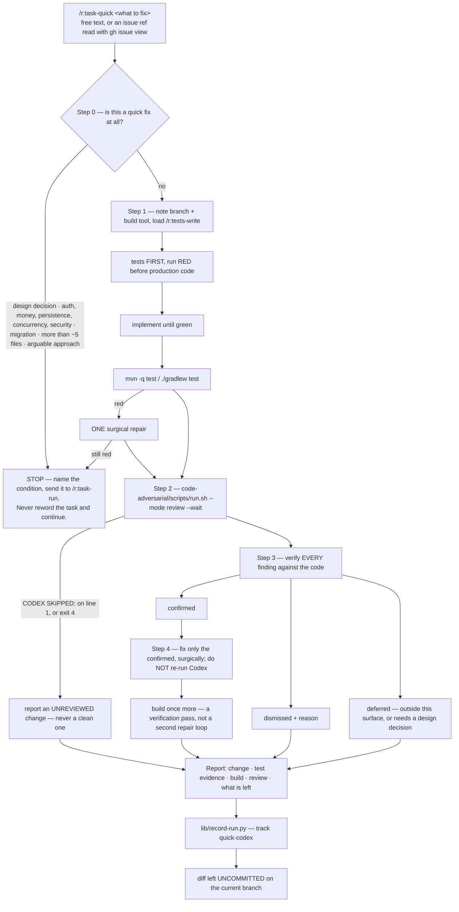

# `task-quick` — behaviour register

What `/r:task-quick` does, one entry per behaviour. Format contract: [README.md](README.md).

`task-quick` is the pack's third pipeline and the one deliberately **not** written as code: it runs
inline in the main thread, so it owns no workflow script and no control-flow suite. Two things carry
its whole weight — the review is the REAL Codex reviewer, and every finding is verified against the
code before anything is fixed. Everything else it does is a subtraction from `/r:task-run`.

## Flow

## Entries

- **SB-task-quick-001** — The pipeline is four steps in a fixed order — implement → review → verify
  → fix — behind a scope check that runs before any code is written.
  *States it:* `skills/task-quick/SKILL.md`
  *Enforced by:* —
  *Tested by:* —

- **SB-task-quick-002** — Every step runs in this one thread: no `Workflow`, no subagents, no
  background dispatch. There is no fan-out to lose, so spawning would buy nothing and cost a round
  trip and a context re-read per step; running inline also keeps the whole run visible to the user,
  which is what they chose over `/r:task-run`.
  *States it:* `skills/task-quick/SKILL.md`
  *Enforced by:* —
  *Tested by:* —

- **SB-task-quick-003** — Because it spawns nothing, it runs correctly anywhere, **including inside
  a subagent**, where `/r:task-run` and `/r:task-review` cannot run at all: a subagent has no
  `Agent` tool and no `Workflow` tool, so their fan-out would silently collapse to one context and
  still report success. Every step here is Bash, edits and the run's own reading, so nothing
  collapses.
  *States it:* `skills/task-quick/SKILL.md`
  *Enforced by:* —
  *Tested by:* —

- **SB-task-quick-004** — Everything read stays in the caller's context, so the reading is targeted:
  grep for the symbol, read the file that owns it, read its test.
  *States it:* `skills/task-quick/SKILL.md`
  *Enforced by:* —
  *Tested by:* —

- **SB-task-quick-005** — It carries `disable-model-invocation: true`: it mutates the repo, so it is
  invoked deliberately or not at all. Its description therefore leaves the router's listing budget,
  no prompt can route to it, and its `trigger` and `neighbour-exclusion` eval cases are untestable
  by design — which is why it owes `behaviour` cases instead.
  *States it:* `skills/task-quick/SKILL.md`
  *Enforced by:* `tools/validate.py`
  *Tested by:* —

- **SB-task-quick-006** — Invocation is `/r:task-quick <what to fix>`: free text ("the export button
  posts twice on a double click") or a GitHub issue ref (`#42`, an issue URL) read with
  `gh issue view`.
  *States it:* `skills/task-quick/SKILL.md`
  *Enforced by:* —
  *Tested by:* —

- **SB-task-quick-007** — Step 0 asks one question before anything is touched: does this task need a
  design decision about what the user sees, touch auth, money, persistence, concurrency or security,
  need a migration, span more than roughly five files, or rest on an approach worth arguing about?
  *States it:* `skills/task-quick/SKILL.md`
  *Enforced by:* —
  *Tested by:* —

- **SB-task-quick-008** — If the answer is yes the run **stops and says so**, names which condition
  it hit, and tells the user the task wants `/r:task-run` — its explorers, its Codex-reviewed plan
  and the full `/r:task-review` afterwards. The task is never reworded so the run can continue.
  *States it:* `skills/task-quick/SKILL.md`
  *Enforced by:* —
  *Tested by:* —

- **SB-task-quick-009** — Step 0 is a check, not a planning phase: a couple of greps and the reading
  Step 1 needs anyway.
  *States it:* `skills/task-quick/SKILL.md`
  *Enforced by:* —
  *Tested by:* —

- **SB-task-quick-010** — Step 1 opens by noting the branch (`git rev-parse --abbrev-ref HEAD`) and
  the build tool: `pom.xml` → Maven, `build.gradle[.kts]` → Gradle, neither → none.
  *States it:* `skills/task-quick/SKILL.md`
  *Enforced by:* —
  *Tested by:* —

- **SB-task-quick-011** — The work happens on the branch the repo is already on. No branch is ever
  created. If that branch is `main`/`master` the run says so once — the user may want to branch
  first — and carries on if they do not object.
  *States it:* `skills/task-quick/SKILL.md`
  *Enforced by:* —
  *Tested by:* —

- **SB-task-quick-012** — `/r:tests-write` is loaded before any test is written, so the tests match
  house style.
  *States it:* `skills/task-quick/SKILL.md`
  *Enforced by:* —
  *Tested by:* —

- **SB-task-quick-013** — The tests are written first and **run before production code is touched**,
  with one line recorded per test: `<test> — before: RED (<the assertion that failed>) — after:
  GREEN`. Red-before-green is observed, never assumed.
  *States it:* `skills/task-quick/SKILL.md`
  *Enforced by:* —
  *Tested by:* —

- **SB-task-quick-014** — A test expected to fail that passes on unmodified code is a signal, not a
  win: usually it is too weak to reach the bug and is strengthened; occasionally the behaviour
  already exists, which is said out loud and the test kept as a guard.
  *States it:* `skills/task-quick/SKILL.md`
  *Enforced by:* —
  *Tested by:* —

- **SB-task-quick-015** — The implementation reuses what the project already has — the existing
  helper, pattern or sibling test — rather than inventing a second shape for it, matches the
  surrounding code (no new comments or Javadocs, `@Builder` on data classes with more than three
  fields), and stays inside what was asked. No scope creep.
  *States it:* `skills/task-quick/SKILL.md`
  *Enforced by:* —
  *Tested by:* —

- **SB-task-quick-016** — The build is tests only — `mvn -q test` or `./gradlew test` — not the
  clean packaging build `/r:task-run` runs, which is most of what makes that pipeline slow. Tests
  certify a change of this size. A project with neither build file gets its own test command if it
  has one, and if nothing runs at all the run says so rather than implying a build that never
  happened.
  *States it:* `skills/task-quick/SKILL.md`
  *Enforced by:* —
  *Tested by:* —

- **SB-task-quick-017** — A red build gets **one** surgical repair, then the run stops. The failures
  are split first: failures in code this run changed are its own, failures that were already there
  are not — an unrelated test is never weakened or "fixed" to get green, and pre-existing breakage
  is surfaced to the user. Still red after that one repair means the task was misjudged: hand it
  back and suggest `/r:task-run`.
  *States it:* `skills/task-quick/SKILL.md`
  *Enforced by:* —
  *Tested by:* —

- **SB-task-quick-018** — Everything is left uncommitted. This pipeline never commits, and no test
  is weakened to make a build or a finding go away.
  *States it:* `skills/task-quick/SKILL.md`
  *Enforced by:* —
  *Tested by:* —

- **SB-task-quick-019** — Step 2 is the REAL reviewer, invoked as
  `"${CLAUDE_PLUGIN_ROOT}/skills/code-adversarial/scripts/run.sh" --mode review --wait` — Codex's
  built-in reviewer over the working tree, which takes no focus text. Never an LLM imitation, never
  a summary of "what a reviewer would say".
  *States it:* `skills/task-quick/SKILL.md`
  *Enforced by:* `skills/code-adversarial/scripts/run.sh`
  *Tested by:* `skills/code-adversarial/tests/run.test.sh`

- **SB-task-quick-020** — The review runs for minutes and is waited for: it is never backgrounded
  and never given up on early.
  *States it:* `skills/task-quick/SKILL.md`
  *Enforced by:* —
  *Tested by:* —

- **SB-task-quick-021** — The wrapper's outcome is read from the **marker, never the exit code**:
  `0` with a first stdout line of `CODEX SKIPPED:` means the Codex plugin is not installed, and a
  skip exits `0` exactly like a clean review does. Exit `4` means Codex could not inspect the diff
  after three attempts, which is not a clean review either.
  *States it:* `skills/task-quick/SKILL.md`
  *Enforced by:* `skills/code-adversarial/scripts/run.sh`
  *Tested by:* `skills/code-adversarial/tests/run.test.sh`

- **SB-task-quick-022** — **A review that did not run is reported as a gap, never as a clean
  review.** The run's own reading of the diff is not a substitute: it wrote the code, so its opinion
  carries no independent information. It says plainly that the change is **unreviewed**, tells the
  user how to install the plugin (`/plugin install codex@openai-codex`), and finishes.
  *States it:* `skills/task-quick/SKILL.md`
  *Enforced by:* —
  *Tested by:* —

- **SB-task-quick-023** — The reviewer's trailing provenance block — what Codex examined, whether
  the diff was embedded — is provenance, not findings, and is left out of the report.
  *States it:* `skills/task-quick/SKILL.md`
  *Enforced by:* —
  *Tested by:* —

- **SB-task-quick-024** — **Step 3 verifies every finding against the code before anything is
  touched**: open the file and lines it cites, work out whether the failure it describes can happen,
  and give it one verdict with a one-line reason defensible to the user. Codex is a strong reviewer
  and is sometimes wrong.
  *States it:* `skills/task-quick/SKILL.md`
  *Enforced by:* —
  *Tested by:* —

- **SB-task-quick-025** — `confirmed` means the defect is real **and** belongs to this change: code
  this run wrote or touched, or behaviour this change altered.
  *States it:* `skills/task-quick/SKILL.md`
  *Enforced by:* —
  *Tested by:* —

- **SB-task-quick-026** — `dismissed` means the finding misreads the code, the behaviour is
  deliberate, it is a style preference, it asks for work beyond what was asked, or it is about code
  this change never touched.
  *States it:* `skills/task-quick/SKILL.md`
  *Enforced by:* —
  *Tested by:* —

- **SB-task-quick-027** — Both failure modes are named, because they are symmetrical: rubber-stamping
  the whole list turns a quick fix into an unplanned refactor of somebody else's code, and dismissing
  whatever is inconvenient turns the review into theatre. The test for a dismissal is whether the
  reason survives being read out loud — "Codex misread the null check, `orderId` is validated at
  line 41" survives; "seems minor" does not.
  *States it:* `skills/task-quick/SKILL.md`
  *Enforced by:* —
  *Tested by:* —

- **SB-task-quick-028** — Two cases resolve to neither verdict and are **deferred**: a confirmed
  defect whose fix lands outside this change's surface, and one whose fix needs a design decision.
  They are reported with the finding intact rather than fixed — a quick fix that quietly rewrites a
  neighbouring module is exactly what the user opted out of.
  *States it:* `skills/task-quick/SKILL.md`
  *Enforced by:* —
  *Tested by:* —

- **SB-task-quick-029** — Step 4 fixes **only** what was confirmed, surgically, fixing the cause
  rather than the messenger — no suppression comments, no weakened assertions, no test deleted to
  make a finding go away — and changes nothing else.
  *States it:* `skills/task-quick/SKILL.md`
  *Enforced by:* —
  *Tested by:* —

- **SB-task-quick-030** — Codex is not re-run after the fixes: this pipeline reviews once, and the
  next reader is the user.
  *States it:* `skills/task-quick/SKILL.md`
  *Enforced by:* —
  *Tested by:* —

- **SB-task-quick-031** — If anything was fixed and there is a build tool, the build runs once more.
  That is a verification pass, not a second repair loop: if it goes red it is reported plainly and
  the diff left for the user.
  *States it:* `skills/task-quick/SKILL.md`
  *Enforced by:* —
  *Tested by:* —

- **SB-task-quick-032** — The report has a fixed order: what changed and which files; the
  before/after line per test as observed, saying which tests are regression guards and which prove
  the fix; the build — green, red or no build tool, never implying a build that did not run; the
  review — whether Codex ran, how many findings, what was fixed, what was **dismissed and why**, and
  anything deferred; and what is left, namely the uncommitted diff on `<branch>`.
  *States it:* `skills/task-quick/SKILL.md`
  *Enforced by:* —
  *Tested by:* —

- **SB-task-quick-033** — The dismissals matter most in that report: they are the user's to
  overrule, which they cannot do unseen.
  *States it:* `skills/task-quick/SKILL.md`
  *Enforced by:* —
  *Tested by:* —

- **SB-task-quick-034** — The report closes by offering `/r:git-commit`, or `/r:task-review` over
  the same diff if the user wants it reviewed harder before it lands.
  *States it:* `skills/task-quick/SKILL.md`
  *Enforced by:* —
  *Tested by:* —

- **SB-task-quick-035** — One row is recorded from the repo root with the payload
  `{"skill":"r:task-quick","kind":"quick","buildTool":"maven|gradle|none","buildGreen","reviewRan",
  "reviewSkipped","blockedReason","raised","deferred","findings":[…]}`, each finding carrying
  `track`, `severity` (`blocker|critical|major|minor`), `file`, `line`, `verdict`, `fixed` and a
  one-line `description`.
  *States it:* `skills/task-quick/SKILL.md`
  *Enforced by:* —
  *Tested by:* —

- **SB-task-quick-036** — `verdict` is the Step 3 judgement rather than Codex's claim: a reviewer
  whose findings never survive verification scores the same as one that finds nothing until the
  dismissals are recorded too.
  *States it:* `skills/task-quick/SKILL.md`
  *Enforced by:* —
  *Tested by:* —

- **SB-task-quick-037** — `fixed` is true only for findings actually fixed, so a deferred one is
  recorded as `confirmed` with `fixed: false`.
  *States it:* `skills/task-quick/SKILL.md`
  *Enforced by:* —
  *Tested by:* —

- **SB-task-quick-038** — Findings live under their own **`quick-codex`** track: the same tool as
  `/r:task-review`'s `codex` track, but a different mode and a much smaller change under it. Merged,
  neither would be readable.
  *States it:* `skills/task-quick/SKILL.md`
  *Enforced by:* —
  *Tested by:* —

- **SB-task-quick-039** — A review that never ran records `reviewRan: false` and **no findings at
  all**: a blockage is not a finding, and writing one in makes a tool that could not run look like
  one that found something.
  *States it:* `skills/task-quick/SKILL.md`
  *Enforced by:* —
  *Tested by:* —

- **SB-task-quick-040** — The bookkeeping line can never fail the run: if it errors it is mentioned
  and the run moves on, and it is never retried.
  *States it:* `skills/task-quick/SKILL.md`
  *Enforced by:* `lib/record-run.py`
  *Tested by:* `lib/tests/stats.test.sh`

- **SB-task-quick-041** — Scope holds to the end: no hunters, no static analysis, no UI
  verification, no plan file, no refactor beyond the findings. A run that seems to need those needed
  `/r:task-run`.
  *States it:* `skills/task-quick/SKILL.md`
  *Enforced by:* —
  *Tested by:* —

- **SB-task-quick-042** — The skill runs at `effort: high`.
  *States it:* `skills/task-quick/SKILL.md`
  *Enforced by:* —
  *Tested by:* —

## Prose-only behaviours

Held up by wording alone — nothing fails if they quietly stop being true. `task-quick` is inline by
design, so it has no workflow script and no control-flow suite to hold any of this up; 33 of 42
entries are prose-only:

SB-task-quick-001, -002, -003, -004, -006, -009, -010, -011, -012, -013, -014, -015, -016, -017,
-018, -020, -023, -025, -026, -027, -028, -029, -030, -031, -032, -033, -034, -035, -036, -037,
-038, -039, -042.

The two that carry the skill's weight are *not* in that list, and that is the point:
SB-task-quick-019 and -021 are held up by `skills/code-adversarial/scripts/run.sh` and its suite.
SB-task-quick-022 and -024 — report an unreviewed change as unreviewed, and verify before fixing —
are held up by an eval case and nothing else, which is the thinnest support in this file.
