# `task-review` — behaviour register

What `/r:task-review` actually does, stated once per behaviour, with an ID. The target covers both
halves of the skill: `skills/task-review/SKILL.md` (the prose the model reads) and
`skills/task-review/task-review.workflow.js` (the single encoding of the graph, ~43% comments),
plus the two bundled executables `scripts/worktree-deploy.sh` and the suites that lock them.

ID scheme, entry shape and the prose-only rule are defined in `README.md` beside this file.

## The pipeline

```mermaid
flowchart TD
  START(["Workflow({ scriptPath: task-review.workflow.js,<br/>args: { packRoot } })"])
  START --> PACK{"packRoot usable?<br/>(read off the tolerant opts,<br/>placeholder counts as absent)"}
  PACK -- no --> H0["STOP · stopped: 'no-pack-root'"]

  PACK -- yes --> P0

  subgraph P0["phase('Triage')"]
    TRI["agent triage<br/>GP · effort medium<br/>schema TRIAGE"]
    TRI --> TRIQ{"blocked(triage)?"}
    TRIQ -- yes --> H1["STOP · stopped: 'triage-blocked'<br/>(a halt, never a skip)"]
    TRIQ -- no --> RNQ{"reviewNeeded?"}
    RNQ -- no --> SK["return { skipped: true, reason }<br/>doc/config-only diff"]
    RNQ -- yes --> CFG["agent config<br/>GP · haiku/low · schema CONFIG_OUT<br/>lib/read-config.py --step fix<br/>parsed by parseCfg('fix', out)"]
    CFG --> PW["agent ui-prewarm (fire-and-forget)<br/>GP · haiku/low<br/>iff uiTouched && hasTestApp && surface not tui/cli"]
    PW --> DP["agent diff-pack<br/>GP · haiku/low<br/>iff profile != light && scope != all"]
  end

  DP --> TIER{"profile"}

  TIER -- "light" --> LOG1["skip Phases 1-3 entirely"]
  TIER -- "standard / full" --> P1

  subgraph P1["phase('Review') — parallel"]
    CX["agent codex<br/>GP · haiku/medium<br/>run.sh --wait<br/>full: adversarial (or --mode review if planReviewed)<br/>standard: --mode review"]
    HUN["hunterFanOut (full only) — parallel, reliable() per hunter<br/>agent find-bugs:logic · r:bug-hunter-pattern · high<br/>agent find-bugs:runtime-and-failures · same<br/>(dropped when triage.runtimeSurface === false)"]
    CQ["agent code-quality (full only)<br/>GP · inherited effort"]
  end

  P1 --> P2

  subgraph P2["phase('Fix-triage') — parallel"]
    FT["agent fix-triage · Explore (read-only)<br/>schema CORRECTNESS_LIST"]
    FTR["agent fix-triage-readability · Explore<br/>full only · schema READABILITY_LIST"]
  end

  P2 --> FTQ{"blocked(correctnessList)?"}
  FTQ -- "yes, findings exist" --> H2["STOP · stopped: 'fix-triage-blocked'<br/>+ rawFindings"]
  FTQ -- "yes, no findings" --> P3G
  FTQ -- no --> P3G
  P3G{"nothingToFix?"}
  P3G -- yes --> P4
  P3G -- no --> P3

  subgraph P3["phase('Fix') — SERIAL, never parallel"]
    FCX["agent fix-correctness<br/>persona or GP-on-codex · steps.fix row"]
    FCX --> FRX["agent fix-readability → /r:code-refactor<br/>GP · inherited"]
  end

  LOG1 --> P4
  P3 --> P4

  subgraph P4["phase('Build') — iff buildTool != 'none'"]
    B1["agent build#i · runnerAgent or GP · sonnet/medium<br/>i=1: cleanCmd (fastCmd if baselineBuilt); i>1: fastCmd"]
    B1 --> BQ{"green?"}
    BQ -- no --> BSC{"inScopeFailures?"}
    BSC -- no --> H3["STOP · stopped: 'build-red-preexisting'"]
    BSC -- yes --> BFX["agent build-fix#i (i<3)<br/>buildFixAgent()"]
    BFX --> B1
    BQ -- "no, after 3" --> H4["STOP · stopped: 'build-red'"]
  end

  P4 --> ISJVM{"isJvm?"}
  ISJVM -- no --> LS0["localScan = 'n/a'"]
  ISJVM -- yes --> P5

  subgraph P5["phase('Local-scan') — mandatory in every tier"]
    LS["agent local-scan · GP · inherited<br/>computes its OWN branch-wide class list"]
    LS --> LSQ{"status"}
    LSQ -- "blocked / error" --> LSB["localScan = 'blocked' — NOT clean"]
    LSQ -- "skipped" --> LSS["localScan = 'skipped'"]
    LSQ -- "ok, changed no code" --> LSO["localScan = 'ok'"]
    LSQ -- "ok, changed code" --> RB["agent rebuild#i · sonnet/medium"]
    RB --> RBQ{"green?"}
    RBQ -- "no, names a failure" --> RBF["agent rebuild-fix#i (i<3)"]
    RBF --> RB
    RBQ -- "no, names nothing / dead" --> RB
    RBQ -- "no, after 3" --> H5["STOP · stopped: 'rebuild-red'"]
  end

  LS0 --> BAR
  P5 --> BAR
  LSB --> BAR
  LSS --> BAR
  LSO --> BAR

  BAR["parallel([ endVerifyTrack, uiTrack ]) — inside try { } finally { }"]

  BAR --> EV
  BAR --> UIT

  subgraph EV["phase('End-verify') — ≤ 2 passes"]
    EVG{"endVerifyWanted?<br/>full: fix phase or scan changed code<br/>light/standard: always"}
    EVG -- no --> EVS["endVerify = 'skipped'"]
    EVG -- yes --> EV1["agent end-verify#pass · GP · haiku/medium<br/>run.sh --mode review --wait"]
    EV1 --> EVR{"ran === false?"}
    EVR -- yes --> EVRT["agent end-verify#pass.retry — exactly once"]
    EVRT --> EVB
    EVR -- no --> EVB{"blocked?"}
    EVB -- yes --> EVBL["endVerify = 'blocked' — the diff is UNVERIFIED"]
    EVB -- no --> EVF{"real findings?<br/>(real !== false counts)"}
    EVF -- no --> EVC["clear remainder — unless priorPass.fixed === false"]
    EVF -- yes --> EVSZ{"fixSize"}
    EVSZ -- "!== 'minor'" --> EVM["endVerifyMajor — surfaced, NEVER applied"]
    EVSZ -- "'minor', pass 1" --> EVFX["agent end-verify-pre/post (hashes)<br/>agent end-verify-fix#1 · steps.fix row"]
    EVSZ -- "'minor', pass 2" --> EV2R["REPORTED, not fixed — the loop is capped here"]
    EVFX --> EV1
  end

  subgraph UIT["phase('UI') — iff uiTouched && triage.hasTestApp"]
    D["agent ui-deploy · GP · sonnet/medium<br/>0. re-test SKILL.md on disk · 0b. re-read the surface marker"]
    D --> DQ{"outcome"}
    DQ -- "missing: true" --> DSK["SKIP — not a blocked track"]
    DQ -- "!ok / no handle / redeployed === false" --> DBL["BLOCKED track + blockedReason"]
    DQ -- "ok, web" --> WH["parallel: agent ui-functional || agent ui-visual<br/>r:bug-hunter-ui · effort high"]
    DQ -- "ok, tui" --> TH["parallel: agent tui-functional || agent tui-visual<br/>one tmux session each"]
    DQ -- "ok, cli" --> CH["agent cli-functional — ONE half, no visual pass"]
  end

  EV --> JOIN
  UIT --> JOIN
  JOIN["join"] --> REV{"ui.ran && an end-verify fix<br/>landed in a frontend file?"}
  REV -- yes --> UIT2["await uiTrack() — re-deploy + re-verify ONCE"]
  REV -- no --> POST
  UIT2 --> POST

  subgraph POST["after the barrier — everything that WRITES"]
    UFX["agent ui-fix-pre/post (hashes)<br/>agent ui-fix-minor · steps.fix row"]
    UFX --> UFL["agent ui-file-major → issues/ui-review-&lt;date&gt;.md<br/>GP · sonnet/low"]
    UFL --> PFR{"buildGreen && hasBuild &&<br/>(endVerifyFixed > 0 || minorFixed)?"}
    PFR -- yes --> PFRB["agent post-fix-rebuild · sonnet/medium<br/>REPORTS only — no fixer after the last writer"]
  end

  POST --> TD
  TD["finally: agent ui-teardown (reliable, 3 attempts)<br/>tui → tui-session.sh stop · web → worktree-deploy.sh teardown · cli → none"]

  TD --> BK["agent bookkeeping-check · GP · haiku/low"]
  BK --> CITE["agent end-verify-cite · GP · haiku/low<br/>only when findings are outstanding · FAILS OPEN"]
  CITE --> ST["agent stats · GP · haiku/low → lib/record-run.py"]
  ST --> RI["agent reuse-index · GP · sonnet/low<br/>try/catch, never reliable()"]
  RI --> RET(["return { reviewed: true, … , step9: 'main-agent' }"])
```

Every branch drawn above is asserted somewhere in `skills/task-review/tests/control-flow.test.mjs`;
nothing is drawn that the suite contradicts. Two shapes worth reading off the graph: **every halt is
a `return { stopped: … }`**, never a throw, and **every agent that writes to the tree sits below the
barrier**, so the teardown in the `finally` is reached from every exit path including a dead half.

---

## Invocation, identity and immutability

- **SB-task-review-001** — The routine never fires on its own. It runs on an explicit
  `/r:task-review`, or when `/r:task-run` reaches its review step and invokes it through the Skill
  tool; it does not run because a coding turn ended, a build went green or a diff looked reviewable.
  *States it:* `skills/task-review/SKILL.md`
  *Enforced by:* —
  *Tested by:* —

- **SB-task-review-002** — That rule lives in the description and the non-negotiables and **never in
  frontmatter**: `disable-model-invocation: true` cannot tell an auto-load from a deliberate call, so
  it would also block `/r:task-run`'s mandatory Step 5. The flag must not be added back.
  *States it:* `skills/task-review/SKILL.md`
  *Enforced by:* —
  *Tested by:* —

- **SB-task-review-003** — The workflow's `meta.name` is **`post-task-review`**, not `task-review`,
  and it is deliberately left at the pre-rename name. `hooks/guard-workflow.py` holds
  `GUARDED = ("post-task-review", "run-task-implement")` and `hooks/record-skill-run.py` holds
  `WORKFLOW_NAME_SKILL = {"post-task-review": "r:task-review", …}`; both match that exact string.
  Renaming it to match the directory disarms the immutability guard and drops the pipeline's
  primary stats route, and nothing downstream notices.
  *States it:* `skills/task-review/SKILL.md`
  *Enforced by:* `hooks/guard-workflow.py`
  *Tested by:* `hooks/tests/guard.test.sh`

- **SB-task-review-004** — The pipeline is immutable: a fork cannot be run or written, whether as a
  `scriptPath`, an inline `script`, or a `Write`/`Edit` creating one. Editing the canonical file is
  allowed, because that is where install-time maintenance happens.
  *States it:* `skills/task-review/SKILL.md`
  *Enforced by:* `hooks/guard-workflow.py`
  *Tested by:* `hooks/tests/guard.test.sh`

- **SB-task-review-005** — The guard also **approves** a `Workflow` call on the canonical
  `scriptPath`. That approval is load-bearing: the permission dialog must display a script before it
  can approve it, this pipeline is over 200,000 characters, and past that the dialog offers only
  "No" — so without the hook's approval the pipeline cannot start without a blanket `Workflow` allow
  rule, and an unattended unit has nobody to answer the prompt.
  *States it:* `hooks/guard-workflow.py`
  *Enforced by:* `hooks/guard-workflow.py`
  *Tested by:* `hooks/tests/guard.test.sh`

- **SB-task-review-006** — The graph is the **single** encoding and runs only as a `Workflow`. There
  is deliberately no prose fallback engine: the store recorded 65 workflow invocations of this review
  against 0 prose runs, and a second encoding of a 3,000-line graph is a lockstep tax paid on every
  edit for an engine nothing chose.
  *States it:* `skills/task-review/SKILL.md`
  *Enforced by:* `skills/task-review/task-review.workflow.js`
  *Tested by:* —

- **SB-task-review-007** — A context that cannot reach the `Workflow` tool **stops and says so**.
  The tool exists only in the main thread; no subagent has it, not even a `*`-tools
  `general-purpose` one, so a review nested inside a subagent reaches no engine at all. Improvising
  a single-context skim and reporting it as a review is forbidden.
  *States it:* `skills/task-review/SKILL.md`
  *Enforced by:* —
  *Tested by:* —

- **SB-task-review-008** — `packRoot` must arrive from the caller, because `${CLAUDE_PLUGIN_ROOT}`
  is substituted in skill markdown and nowhere else. It is read off the tolerant `opts`, never the
  raw `args`; a value still containing the literal placeholder counts as **absent**; and no usable
  root is a halt (`stopped: 'no-pack-root'`) rather than a run whose seven tool paths all resolve
  under `/`.
  *States it:* `skills/task-review/task-review.workflow.js`
  *Enforced by:* `skills/task-review/task-review.workflow.js`
  *Tested by:* `skills/task-review/tests/control-flow.test.mjs`

- **SB-task-review-009** — `args` is parsed defensively: a JSON **string** (0 object args against 39
  string ones across the stored history) is parsed, and anything else resolves to `{}` and runs with
  defaults. A malformed arg never takes the review down, and `deferCommit` is never silently lost.
  *States it:* `skills/task-review/task-review.workflow.js`
  *Enforced by:* `skills/task-review/task-review.workflow.js`
  *Tested by:* `skills/task-review/tests/control-flow.test.mjs`

- **SB-task-review-010** — `reliable(label, phase, run)` is the subagent-flow contract in code: a
  subagent's returned value **is** its completion signal, nothing is polled, and a step that
  produced nothing — `null`/`undefined` **or a thrown promise** — is re-dispatched up to 2 extra
  times (3 total) and then surfaced as a `{ blocked: true }` sentinel. A throw is trapped because
  `parallel()` converts a thrown thunk to `null` one level above, which would otherwise cost the
  step all three attempts at once.
  *States it:* `skills/task-review/SKILL.md`
  *Enforced by:* `skills/task-review/task-review.workflow.js`
  *Tested by:* `skills/task-review/tests/control-flow.test.mjs`

- **SB-task-review-011** — `blocked(x)` counts three things as blocked: the agent died
  (`null`/`undefined`), `reliable()` gave up, or the subagent reported `ran === false`. The null
  case is the one that leaks if written as `!!(x && …)` — a dead end-verify would have no findings
  and "converge", a dead triage would skip the whole review.
  *States it:* `skills/task-review/task-review.workflow.js`
  *Enforced by:* `skills/task-review/task-review.workflow.js`
  *Tested by:* `skills/task-review/tests/control-flow.test.mjs`

- **SB-task-review-012** — `skipped(x)` is a distinct third state (`coverage` starting with the
  literal word `SKIPPED`): an optional prerequisite that is simply absent, neither blocked nor
  clean. Collapsing the three is how a step nobody ran gets reported as a step that passed.
  *States it:* `skills/task-review/task-review.workflow.js`
  *Enforced by:* `skills/task-review/task-review.workflow.js`
  *Tested by:* `skills/task-review/tests/control-flow.test.mjs`

- **SB-task-review-013** — An empty findings list is a **claim, not a safe default**. Every
  report-only track carries `RAN_CLAUSE` and must set `ran=true` only when the real tool ran and
  produced a usable report; `ran=false` counts as blocked, exactly like a dead track.
  *States it:* `skills/task-review/SKILL.md`
  *Enforced by:* `skills/task-review/task-review.workflow.js`
  *Tested by:* `skills/task-review/tests/control-flow.test.mjs`

- **SB-task-review-014** — Real tools only. Every step named after a tool runs that actual tool —
  `gh` is never one of them, the Codex CLI, the build runners, `/r:code-scan`, `/test-app`,
  `agent-browser`, `tmux` are. An LLM prompt imitating a scanner, reviewer or build is never
  substituted; a genuinely absent prerequisite is a STOP or a named skip.
  *States it:* `skills/task-review/SKILL.md`
  *Enforced by:* —
  *Tested by:* —

## Arguments

- **SB-task-review-015** — `{ scope: "all" }` reviews the whole project rather than the diff; it
  also disables the shared diff capture, since there is no diff to capture.
  *States it:* `skills/task-review/SKILL.md`
  *Enforced by:* `skills/task-review/task-review.workflow.js`
  *Tested by:* `skills/task-review/tests/control-flow.test.mjs`

- **SB-task-review-016** — `{ taskIntent }` is threaded into every fix and triage subagent as
  `intentBlock`, so a fixer does not "fix" (undo) something the change did on purpose. When the
  caller omits it, triage infers it from the diff, any `.task-plans/*.md` plan file and the last
  five commit messages.
  *States it:* `skills/task-review/SKILL.md`
  *Enforced by:* `skills/task-review/task-review.workflow.js`
  *Tested by:* —

- **SB-task-review-017** — `{ deferCommit: true }` makes the readability refactor land in the
  working tree instead of as its own commit, so a `/r:task-run` that commits once at the end is not
  interrupted mid-task. It is also the only signal the run has for `invokedBy`.
  *States it:* `skills/task-review/SKILL.md`
  *Enforced by:* `skills/task-review/task-review.workflow.js`
  *Tested by:* `skills/task-review/tests/control-flow.test.mjs`

- **SB-task-review-018** — `{ baselineBuilt: true }` skips only the run's own **clean** build and
  starts incremental. It is honoured only as `=== true` and only when a build tool exists, and may
  be passed only from a handoff reading `buildGreen: true` — `'n/a'` means no build ran at all, and
  reading that as a baseline would skip the run's only clean build entirely. It never weakens the
  green bar and never removes the deleted-or-renamed escape hatch.
  *States it:* `skills/task-review/SKILL.md`
  *Enforced by:* `skills/task-review/task-review.workflow.js`
  *Tested by:* `skills/task-review/tests/control-flow.test.mjs`

- **SB-task-review-019** — `{ planReviewed: true }` drops the full tier's up-front Codex pass from
  adversarial to `--mode review`, because `/r:task-run` already challenged the approach at plan
  time. It is **fail-open**: anything but an explicit `true` keeps the adversarial pass, and every
  other full-tier track is unchanged.
  *States it:* `skills/task-review/SKILL.md`
  *Enforced by:* `skills/task-review/task-review.workflow.js`
  *Tested by:* `skills/task-review/tests/control-flow.test.mjs`

- **SB-task-review-020** — `{ profile }` and `{ uiTouched }` force the tier and the UI gate. A
  caller should leave `profile` out unless the user forced it: Phase 0 classifies from the diff,
  which is better evidence than anything a caller can supply before the code exists.
  *States it:* `skills/task-review/SKILL.md`
  *Enforced by:* `skills/task-review/task-review.workflow.js`
  *Tested by:* `skills/task-review/tests/control-flow.test.mjs`

## Phase 0 — Triage

- **SB-task-review-021** — Triage runs on **every** invocation; there is no "skip the review for
  small diffs". The cheap exit is inside the graph, not in front of it.
  *States it:* `skills/task-review/SKILL.md`
  *Enforced by:* `skills/task-review/task-review.workflow.js`
  *Tested by:* `skills/task-review/tests/control-flow.test.mjs`

- **SB-task-review-022** — Triage runs `git add -N` (intent-to-add) on untracked changed source
  files before anything reads the diff. Without it every diff-scoped track — the hunters, Codex,
  `/r:code-scan` — silently sees nothing for a brand-new file, which is exactly where a new endpoint
  lands. It stages no content and is reversible with `git reset`.
  *States it:* `skills/task-review/task-review.workflow.js`
  *Enforced by:* —
  *Tested by:* —

- **SB-task-review-023** — `reviewNeeded` is false **only** when every changed file is doc/config
  only (`*.md`, `*.txt`, `docs/**`, `LICENSE`, `.gitignore`, images). Any source, build or
  runtime-config file makes it true, and a comment- or format-only edit inside source still does.
  That returns `{ skipped: true, reason }`.
  *States it:* `skills/task-review/SKILL.md`
  *Enforced by:* `skills/task-review/task-review.workflow.js`
  *Tested by:* `skills/task-review/tests/control-flow.test.mjs`

- **SB-task-review-024** — A **dead** triage halts (`stopped: 'triage-blocked'`) and is never
  reported as a skip. The two used to return the same `{ skipped: true }`, which let an unattended
  caller such as `/r:issues-fix` read "reviewed, nothing owed" and merge on a review that never
  started.
  *States it:* `skills/task-review/task-review.workflow.js`
  *Enforced by:* `skills/task-review/task-review.workflow.js`
  *Tested by:* `skills/task-review/tests/control-flow.test.mjs`

- **SB-task-review-025** — The tier is classified from the diff by three questions in order:
  (a) can the change alter behaviour for any real input? no → `light`; (b) does it carry a design
  decision, or touch auth/permissions, money/pricing/tax math, persistence, concurrency/locking or
  security-sensitive code? no → `standard`; (c) otherwise `full`.
  *States it:* `skills/task-review/SKILL.md`
  *Enforced by:* `skills/task-review/task-review.workflow.js`
  *Tested by:* —

- **SB-task-review-026** — The persistence arm is read **narrowly** — schema, migration, index,
  locking; what a revert cannot undo. An ordinary read-only query or a repository method over an
  existing table is `standard`. Counting every query sent every feature in a JPA/ORM diff to `full`:
  measured over 52 real runs, `standard` was chosen zero times.
  *States it:* `skills/task-review/SKILL.md`
  *Enforced by:* —
  *Tested by:* —

- **SB-task-review-027** — When the classifier is unsure the answer is `standard`, which keeps a
  real Codex read of the diff, static analysis and build+tests and gives up only the pattern hunters
  and the up-front adversarial and readability passes. Scary wording alone does not force `full`;
  "small" alone does not earn `light`.
  *States it:* `skills/task-review/SKILL.md`
  *Enforced by:* —
  *Tested by:* —

- **SB-task-review-028** — A caller-supplied `profile` overrides the classifier, but a value that is
  **not a tier at all** falls back to `full`, not to `standard`. The two defaults are different on
  purpose: `standard` is where an unsure classifier lands, `full` is where a garbled or absent
  answer lands, because nothing classified that diff.
  *States it:* `skills/task-review/task-review.workflow.js`
  *Enforced by:* `skills/task-review/task-review.workflow.js`
  *Tested by:* `skills/task-review/tests/control-flow.test.mjs`

- **SB-task-review-029** — Triage returns `profileReason`: one line naming what actually decided the
  tier, evidence rather than verdict. Deliberately not required by the schema — an unanswered note
  is a gap in the record, never a reason to fail a triage that answered everything else.
  *States it:* `skills/task-review/task-review.workflow.js`
  *Enforced by:* `skills/task-review/task-review.workflow.js`
  *Tested by:* —

- **SB-task-review-030** — `buildTool` is one of `maven | gradle | generic | none`, and `generic` is
  a separate value from `none` on purpose: `none` means there is nothing to run, `generic` means
  there is but no bundled runner knows it. Folding Go into `none` made the build gate vacuous — 33
  recorded reviews returned build `n/a`, 31 of them over Go worktrees carrying 42k added lines
  reviewed with no compile and no test.
  *States it:* `skills/task-review/task-review.workflow.js`
  *Enforced by:* `skills/task-review/task-review.workflow.js`
  *Tested by:* `skills/task-review/tests/control-flow.test.mjs`

- **SB-task-review-031** — Triage returns **both** build commands: `buildCmd` (clean, certifying)
  and `buildCmdFast` (incremental). On `generic` both are the project's own documented command and
  `runnerAgent` is empty. No parallelism flag (`-T`, `--parallel`, `--build-cache`) is ever added — a
  non-thread-safe plugin would turn one into a flaky false red, which halts the whole routine.
  *States it:* `skills/task-review/task-review.workflow.js`
  *Enforced by:* `skills/task-review/task-review.workflow.js`
  *Tested by:* `skills/task-review/tests/control-flow.test.mjs`

- **SB-task-review-032** — `hasTestApp` is answered by one `test -f` against
  `.claude/skills/test-app/SKILL.md` on disk right now. Whether git tracks it on this branch is
  irrelevant — a locally scaffolded, gitignored `/test-app` counts.
  *States it:* `skills/task-review/task-review.workflow.js`
  *Enforced by:* `skills/task-review/task-review.workflow.js`
  *Tested by:* —

- **SB-task-review-033** — `testAppSurface` (`web | tui | cli | unknown`) is **read** off that
  skill's own `test-app-surface:` marker line with one `grep`, never inferred from this repo's file
  extensions and never forced by a caller. With no marker: `web` when the file names a `BASE_URL`,
  `unknown` otherwise.
  *States it:* `skills/task-review/SKILL.md`
  *Enforced by:* `skills/task-review/task-review.workflow.js`
  *Tested by:* `skills/task-review/tests/control-flow.test.mjs`

- **SB-task-review-034** — The definition of `uiTouched` depends on that surface. On `web`/`unknown`
  it is any changed frontend file; on `tui`/`cli` it is a changed file that **draws or drives the
  terminal interface** — the view/render/widget layer, key bindings, the event loop, printed output,
  flag parsing and help text — and never the data, storage, network or parsing layers, even in a
  single-binary repo. "It is a terminal app, so everything renders" would turn the pipeline's most
  expensive gate permanently on.
  *States it:* `skills/task-review/task-review.workflow.js`
  *Enforced by:* `skills/task-review/task-review.workflow.js`
  *Tested by:* `skills/task-review/tests/control-flow.test.mjs`

- **SB-task-review-035** — `runtimeSurface` is a per-diff gate on the runtime hunter: true if the
  diff touches threads, shared mutable state, locking/transactions, a read-modify-write, caches or
  pools, file/network/stream IO, a query or a loop over one, error handling/retries/timeouts, or
  serialization/date/numeric traps. Read as `!== false`, so an unanswered field runs the hunter — a
  missing field must never be the reason a hunt was skipped.
  *States it:* `skills/task-review/SKILL.md`
  *Enforced by:* `skills/task-review/task-review.workflow.js`
  *Tested by:* `skills/task-review/tests/control-flow.test.mjs`

- **SB-task-review-036** — Triage itself runs at `effort: medium` (`TRIAGE_RUN`) on a
  general-purpose agent: it reads the diff into a schema plus one real judgement, and the tier is
  the most recoverable decision in the pipeline — an under-rated diff still gets the build,
  `/r:code-scan` and a Codex end-verify.
  *States it:* `skills/task-review/SKILL.md`
  *Enforced by:* `skills/task-review/task-review.workflow.js`
  *Tested by:* `skills/task-review/tests/control-flow.test.mjs`

## The fixers' settings

- **SB-task-review-037** — The three fixers (`fix-correctness`, `end-verify-fix`, `ui-fix-minor`)
  take their provider, model and effort from `steps.fix`, resolved by a haiku/low agent running
  `lib/read-config.py --step fix`. The read happens **inside the workflow**, after the
  `reviewNeeded` gate — inside so `/r:issues-fix` and `/r:plan-run`, which come in by `scriptPath`
  and never load the markdown, cannot skip it; after the gate so a doc-only turn pays nothing.
  *States it:* `skills/task-review/SKILL.md`
  *Enforced by:* `skills/task-review/task-review.workflow.js`
  *Tested by:* `skills/task-review/tests/control-flow.test.mjs`

- **SB-task-review-037a** — The row comes back as **one opaque `stdout` string** (`CONFIG_OUT`)
  and is parsed by the script (`parseCfg`), never as a row with a field per setting — the same
  shape and the same reason as `SB-task-run-030`, because the reader is one script and both
  pipelines read it the same way. Asked for `{provider, model, effort}` the ECHO-tier reader
  answered with its own tier and parked `read-config.py`'s real JSON in the spare `step` field,
  while the log still said the row came from the file, so `steps.fix` silently stopped reaching the
  fixers. The `step` the reader printed is what proves the string is the script's rather than the
  agent's; a rejected answer and a dead agent both fall back to `FIX_RUN` and are named apart in
  the log.
  *States it:* `skills/task-review/task-review.workflow.js`
  *Enforced by:* `skills/task-review/task-review.workflow.js`
  *Tested by:* `skills/task-review/tests/control-flow.test.mjs`

- **SB-task-review-038** — Every `note` the config reader returns is logged. A config that quietly
  does nothing is indistinguishable from one that works, which is the whole failure a settings file
  invites.
  *States it:* `skills/task-review/task-review.workflow.js`
  *Enforced by:* `skills/task-review/task-review.workflow.js`
  *Tested by:* `lib/tests/config.test.sh`

- **SB-task-review-039** — `FIX_RUN` (claude/`opus`/`medium`) is the fallback when the config agent
  could not be reached at all — not the pin. A config that cannot be read falls back and says so
  rather than halting the review.
  *States it:* `skills/task-review/task-review.workflow.js`
  *Enforced by:* `skills/task-review/task-review.workflow.js`
  *Tested by:* `skills/task-review/tests/control-flow.test.mjs`

- **SB-task-review-040** — On `provider: codex` the configured `model`/`effort` go to the **Codex
  CLI**, and the dispatched subagent is the **wrapper**, configured separately from
  `wrapperModel`/`wrapperEffort` with `FIX_CODEX_RUN` (haiku/`medium`) as its fallback. A cheap
  writer writes worse code, which the review catches; a cheap wrapper halts the run over a fix
  Codex actually applied, which nothing catches.
  *States it:* `skills/task-review/SKILL.md`
  *Enforced by:* `skills/task-review/task-review.workflow.js`
  *Tested by:* `skills/task-review/tests/control-flow.test.mjs`

- **SB-task-review-041** — A fixer must never run **deeper** than the implementer whose code it
  patches. Nothing enforces it — this pipeline does not read `steps.implement`, and a silent clamp
  would override a value the user can see in their own file — so it is a rule for whoever edits the
  two rows.
  *States it:* `skills/task-review/SKILL.md`
  *Enforced by:* —
  *Tested by:* —

- **SB-task-review-042** — On `provider: codex` the fixer subagent **does not write the patch**. It
  calls `codex-companion.mjs task --background --model … --effort … --write` directly with Bash
  (never the adversarial-review skill or its `run.sh`, which would re-enter the wrapper), passes the
  entire brief through verbatim, and reports from `git status --porcelain` and `git diff` rather
  than from Codex's summary. If Codex never ran it says so — it does not quietly apply the fixes
  itself.
  *States it:* `skills/task-review/task-review.workflow.js`
  *Enforced by:* `skills/task-review/task-review.workflow.js`
  *Tested by:* `skills/task-review/tests/control-flow.test.mjs`

- **SB-task-review-043** — `--background` is REQUIRED on every Codex dispatch. The companion
  branches on that one flag: with it the run goes to a `detached: true` + `unref()`ed worker that
  outlives its parent; without it the CLI is awaited in-process and **nothing migrates it to the
  background**. The Bash tool's default timeout is 120000ms (600000 is the most a caller may
  *request*, never what an unset timeout gets), so a foreground run dies about two minutes in and
  leaves a job record stuck at `"status":"running"` with no `rendered` field — the exact shape of a
  crash.
  *States it:* `skills/task-review/task-review.workflow.js`
  *Enforced by:* `skills/task-review/task-review.workflow.js`
  *Tested by:* `skills/task-review/tests/control-flow.test.mjs`

- **SB-task-review-044** — The collect is **one blocking shell call**, never a poll per turn:
  57 × `sleep 10` on the worker PID inside a Bash call whose timeout is set to 590000ms. Every poll
  is another moment at which the model gets to decide a live PID looks stuck, and a shell loop has
  no opinion. The bound sits inside the loop and below the requested timeout, because a call the
  harness kills comes back as a tool error, and that error is what talks a wrapper into giving up.
  *States it:* `skills/task-review/task-review.workflow.js`
  *Enforced by:* `skills/task-review/task-review.workflow.js`
  *Tested by:* `skills/task-review/tests/control-flow.test.mjs`

- **SB-task-review-045** — In the collect protocol an **empty PID** means the launch never detached
  (a job that failed to start, reported as such), and a **dead PID over a record with no `rendered`
  field** means the job died — reported immediately. `"status"` is never evidence of life: a killed
  worker never writes a terminal status, so re-reading it is not waiting.
  *States it:* `skills/task-review/task-review.workflow.js`
  *Enforced by:* `skills/task-review/task-review.workflow.js`
  *Tested by:* `skills/task-review/tests/control-flow.test.mjs`

## The docker pre-warm and the shared diff capture

- **SB-task-review-046** — The docker image pre-warm is dispatched at **Triage**, not alongside the
  end-verify, so it overlaps the review, the fix phase, the build and the static scan rather than
  one phase. It is build-only — nothing starts, so it cannot serve stale code — always exits 0, and
  Phase 7 never reads its result, so a failed pre-warm costs a cold build and nothing else.
  *States it:* `skills/task-review/SKILL.md`
  *Enforced by:* `skills/task-review/task-review.workflow.js`
  *Tested by:* `skills/task-review/tests/control-flow.test.mjs`

- **SB-task-review-047** — No pre-warm is dispatched on a terminal surface. A terminal app has no
  image to warm, and `worktree-deploy.sh` `require_bin`s docker before it reads its subcommand, so
  `prewarm` there exits 127 rather than no-opping. The condition is written as a negative
  (`!terminalSurface(...)`) so a web project whose triage omitted the field behaves exactly as
  before the field existed.
  *States it:* `skills/task-review/task-review.workflow.js`
  *Enforced by:* `skills/task-review/task-review.workflow.js`
  *Tested by:* `skills/task-review/tests/control-flow.test.mjs`

- **SB-task-review-048** — The pre-warm promise is awaited **before** the deploy, so the build it
  started cannot still be running against the same docker daemon when the deploy asks for the same
  layers.
  *States it:* `skills/task-review/task-review.workflow.js`
  *Enforced by:* `skills/task-review/task-review.workflow.js`
  *Tested by:* —

- **SB-task-review-049** — The diff is captured **once**, to a file, after triage, and every hunter
  is pointed at that path. Left to themselves the hunters each derive the change (10–17 shell calls
  apiece) and do not converge — one stored review has hunters on `git diff HEAD`, `git diff` and
  `git diff origin/main..HEAD`, three different changesets. The capture is a path plus counts, never
  the diff text in a schema field, because a model asked to re-emit 40k characters paraphrases them.
  *States it:* `skills/task-review/SKILL.md`
  *Enforced by:* `skills/task-review/task-review.workflow.js`
  *Tested by:* `skills/task-review/tests/control-flow.test.mjs`

- **SB-task-review-050** — The capture runs **after** triage specifically because triage's
  `git add -N` is what makes untracked new files visible to `git diff` at all.
  *States it:* `skills/task-review/task-review.workflow.js`
  *Enforced by:* `skills/task-review/task-review.workflow.js`
  *Tested by:* `skills/task-review/tests/control-flow.test.mjs`

- **SB-task-review-051** — The capture is **fail-open by construction**: one attempt, no
  `reliable()`, and a failure (or a dead agent) simply leaves `diffClause` as the fetch-it-yourself
  instruction. It is skipped entirely when there is no diff to capture (`scope: 'all'`) or nothing
  to hand it to (the light tier dispatches no hunters).
  *States it:* `skills/task-review/task-review.workflow.js`
  *Enforced by:* `skills/task-review/task-review.workflow.js`
  *Tested by:* `skills/task-review/tests/control-flow.test.mjs`

## The three tiers

- **SB-task-review-052** — The tier scales **depth, never integrity**. No tier drops build+tests,
  `/r:code-scan`, or a real Codex read of the final diff. Routing a risky change to a cheap tier is
  the failure that matters; routing an ordinary one to `full` is how a tier system stops meaning
  anything.
  *States it:* `skills/task-review/SKILL.md`
  *Enforced by:* `skills/task-review/task-review.workflow.js`
  *Tested by:* `skills/task-review/tests/control-flow.test.mjs`

- **SB-task-review-053** — **light** skips Phases 1–3 entirely: no up-front Codex, no hunters, no
  `/r:code-quality`, no fix-triage and no fix phase. A single Codex `--mode review` pass over the
  final diff is the review; build+tests and `/r:code-scan` still run.
  *States it:* `skills/task-review/SKILL.md`
  *Enforced by:* `skills/task-review/task-review.workflow.js`
  *Tested by:* `skills/task-review/tests/control-flow.test.mjs`

- **SB-task-review-054** — **standard** runs a real Codex `--mode review` over the pre-fix diff and
  **no pattern hunter and no code-quality pass**. What it trades away is named in the log and in the
  end-verify's own framing, so a clean standard run can be read for what nobody looked at — the
  performance-at-scale lens especially.
  *States it:* `skills/task-review/SKILL.md`
  *Enforced by:* `skills/task-review/task-review.workflow.js`
  *Tested by:* `skills/task-review/tests/control-flow.test.mjs`

- **SB-task-review-055** — **full** runs the strict **adversarial** Codex review plus both pattern
  hunters plus `/r:code-quality`, so triage sees the whole field. Its end-verify is framed
  regression-only.
  *States it:* `skills/task-review/SKILL.md`
  *Enforced by:* `skills/task-review/task-review.workflow.js`
  *Tested by:* `skills/task-review/tests/control-flow.test.mjs`

- **SB-task-review-056** — The two Codex modes are different machines, not two settings of one dial.
  `r:code-adversarial` is a prompt-driven session that challenges design choices;
  `--mode review` calls Codex's native reviewer API, which fetches its **own** diff and
  **hard-errors on trailing focus text**. Focus text is never passed with the latter.
  *States it:* `skills/task-review/SKILL.md`
  *Enforced by:* `skills/task-review/task-review.workflow.js`
  *Tested by:* `skills/task-review/tests/control-flow.test.mjs`

## Phase 1 — the review fan-out

- **SB-task-review-057** — The hunters are spawned **by this script**, not beneath one "run
  /r:code-bugs" subagent. Workflow-spawned agents have no `Agent` tool — 0 of 1158 stored workflow
  agents ever called it — so a nested fan-out silently collapses to a single-context skim that still
  reports a completed scan.
  *States it:* `skills/task-review/SKILL.md`
  *Enforced by:* `skills/task-review/task-review.workflow.js`
  *Tested by:* `skills/task-review/tests/control-flow.test.mjs`

- **SB-task-review-058** — There are exactly **two** hunters: `logic` (reading
  `logic-and-flow.md` **and** `security.md`) and `runtime-and-failures` (reading
  `concurrency-data-and-performance.md` **and** `silent-failures-and-java.md`). Merging pays the
  diff-reading cost once: apart the two runtime files cost 2.15M and 2.86M cache-read tokens per
  run, together 4.23M — ~15%, not the ~50% an agent count suggests, because a merged hunter takes
  more turns (41/47 → 57).
  *States it:* `skills/task-review/SKILL.md`
  *Enforced by:* `skills/task-review/task-review.workflow.js`
  *Tested by:* `skills/task-review/tests/control-flow.test.mjs`

- **SB-task-review-059** — **Security has no hunter of its own.** A separate security hunter
  measured 3 fixes over 79 dispatches (0.04 fixes/run, 43% precision on the 7 findings that reached
  triage) and owned both recorded scope drifts, for a pattern file `logic-and-flow.md` already
  overlaps at every boundary-validation hunk. Reinstating it re-opens the hole rather than closing
  one.
  *States it:* `skills/task-review/SKILL.md`
  *Enforced by:* `skills/task-review/task-review.workflow.js`
  *Tested by:* `skills/task-review/tests/control-flow.test.mjs`

- **SB-task-review-060** — The `logic` hunter's `coverage` must name what it did **not** look for:
  the security half is newly-introduced, high-confidence-exploitable issues only, and denial of
  service, resource exhaustion, capacity rate limiting, missing hardening and dependency CVEs are
  out of scope there. An empty findings list from that hunt is not a clean bill of health and has
  been read as one.
  *States it:* `skills/task-review/task-review.workflow.js`
  *Enforced by:* `skills/task-review/task-review.workflow.js`
  *Tested by:* `skills/task-review/tests/control-flow.test.mjs`

- **SB-task-review-061** — **No `docs` hunter runs at any tier.** Measured over 59 dispatches
  `r:bug-hunter-docs` cost 150.7M tokens and produced 35 findings with 0 confirmed, 0 dismissed and
  35 unresolved — doc drift resolves to a user decision this pipeline never makes, 12 of the 35 were
  `todo.md` bookkeeping the plan skills own and 6 more CLAUDE.md drift Step 9 already covers. It is
  retired from **this** pipeline only; `/r:code-bugs` still dispatches it.
  *States it:* `skills/task-review/task-review.workflow.js`
  *Enforced by:* `skills/task-review/task-review.workflow.js`
  *Tested by:* `skills/task-review/tests/control-flow.test.mjs`

- **SB-task-review-062** — Both hunters run on `r:bug-hunter-pattern`, the four-tool sweep agent,
  never on `r:bug-hunter`. The investigator's reproduce-first persona wins for the first dozen turns:
  measured over 151 stored `logic` runs, the median hunt read twelve whole source files before it
  ever ran `git diff` and reached the diff around turn 31 of 49.
  *States it:* `skills/task-review/SKILL.md`
  *Enforced by:* `skills/task-review/task-review.workflow.js`
  *Tested by:* `skills/task-review/tests/control-flow.test.mjs`

- **SB-task-review-063** — Every hunter's brief orders the hunt and budgets it: read the change
  first, judge each hunk from the diff, open source only for a candidate that cannot be settled from
  the hunk, with a ~12 tool-call budget it must **report** overrunning or falling short of. A
  candidate left unconfirmed is named in `coverage` — an honest short answer beats a silent drop or
  a padded report.
  *States it:* `skills/task-review/SKILL.md`
  *Enforced by:* `skills/task-review/task-review.workflow.js`
  *Tested by:* `skills/task-review/tests/control-flow.test.mjs`

- **SB-task-review-064** — Both pattern hunters are **pinned** at `effort: high` (`PATTERN_HUNT`),
  not left to inherit. The pin is load-bearing even where the number matches the agent's own
  frontmatter: unpinned they take the *session's* effort whenever the skill is entered by
  `scriptPath` rather than the Skill tool, which `/r:issues-fix` does for every group.
  *States it:* `skills/task-review/SKILL.md`
  *Enforced by:* `skills/task-review/task-review.workflow.js`
  *Tested by:* `skills/task-review/tests/control-flow.test.mjs`

- **SB-task-review-065** — `reliable()` sits **inside** the fan-out, per hunter, so a single dead
  hunter is re-dispatched on its own rather than re-running the whole set.
  *States it:* `skills/task-review/task-review.workflow.js`
  *Enforced by:* `skills/task-review/task-review.workflow.js`
  *Tested by:* `skills/task-review/tests/control-flow.test.mjs`

- **SB-task-review-066** — The merged track reports `ran: true` only when **every hunter this tier
  dispatched** came back and none drifted. A blocked hunter marks the track incomplete while the
  survivors' findings still flow into triage — degrade to fewer hunters, never silently to a claim
  of full coverage.
  *States it:* `skills/task-review/SKILL.md`
  *Enforced by:* `skills/task-review/task-review.workflow.js`
  *Tested by:* `skills/task-review/tests/control-flow.test.mjs`

- **SB-task-review-067** — `scopeMatched` catches a hunter that came back **alive and having read
  the wrong changeset**. It is read as `!== false`, so an unanswered field invents no mismatch; a
  `false` puts the hunter in `driftedHunters` with its own log line, because a blocked tool has to
  be made to run while a drifted one has to be made to read the right thing.
  *States it:* `skills/task-review/task-review.workflow.js`
  *Enforced by:* `skills/task-review/task-review.workflow.js`
  *Tested by:* `skills/task-review/tests/control-flow.test.mjs`

- **SB-task-review-068** — Findings are de-duplicated on `file:line:what[0..60]` and stamped with
  the **hunter that found them** at the merge, the only point that still knows. First hunter to
  report a line wins the attribution.
  *States it:* `skills/task-review/task-review.workflow.js`
  *Enforced by:* `skills/task-review/task-review.workflow.js`
  *Tested by:* `skills/task-review/tests/control-flow.test.mjs`

- **SB-task-review-069** — Every hunter's `coverage` note survives the merge, and a drifted or dead
  hunter gets a synthesised note in its place. Dropping them turns "I could not confirm the N+1 at
  OrderRepo:88" into silence, and silence from a finding track reads as "looked, found nothing".
  *States it:* `skills/task-review/task-review.workflow.js`
  *Enforced by:* `skills/task-review/task-review.workflow.js`
  *Tested by:* `skills/task-review/tests/control-flow.test.mjs`

- **SB-task-review-070** — The `runtime-and-failures` hunter is dropped from `HUNTER_SET` when
  `runtimeSurface === false`, and that skip is **logged as a skip, not a clean bill** and appended
  by hand to `tracksSkipped`, because the stats report derives a track's denominator from the tier.
  *States it:* `skills/task-review/SKILL.md`
  *Enforced by:* `skills/task-review/task-review.workflow.js`
  *Tested by:* `skills/task-review/tests/control-flow.test.mjs`

- **SB-task-review-071** — The Codex track runs the real wrapper
  (`skills/code-adversarial/scripts/run.sh … --wait`) and is told **not to review the diff itself**:
  no project source, no `git show`/`cat`/`grep` through the change, no checking the script's
  directory. One `git diff --stat` is enough; its own reading is measured at ~30k characters of tool
  output per run for no extra finding.
  *States it:* `skills/task-review/task-review.workflow.js`
  *Enforced by:* `skills/task-review/task-review.workflow.js`
  *Tested by:* `skills/task-review/tests/control-flow.test.mjs`

- **SB-task-review-072** — The Codex exit-code contract: `0` with a first stdout line starting
  `CODEX SKIPPED:` → the plugin is not installed, `ran=false` and a `coverage` starting with the
  literal word `SKIPPED`; `0` otherwise → it ran; `3` → CLI missing, blocked; `4`/timeout → not-run,
  and the "Review blocked" text is **not** a finding; any other non-zero → the wrapper itself failed
  and its stdout is not findings.
  *States it:* `skills/task-review/SKILL.md`
  *Enforced by:* `skills/task-review/task-review.workflow.js`
  *Tested by:* `skills/task-review/tests/control-flow.test.mjs`

- **SB-task-review-073** — Both Codex tracks (`codex`, every `end-verify` pass) are pinned at
  `CODEX_RUN` = haiku/`medium`. Unnamed, the tier is whatever the caller happens to be running: 188
  end-verify and 143 codex dispatches and ~247M tokens sat under these two, mostly opus, for agents
  that review nothing. `medium` is not negotiable alongside the cheap model — these agents own the
  background-collect protocol, whose failures surface as false "the review could not run" blocks.
  *States it:* `skills/task-review/SKILL.md`
  *Enforced by:* `skills/task-review/task-review.workflow.js`
  *Tested by:* `skills/task-review/tests/control-flow.test.mjs`

- **SB-task-review-074** — The risk specific to the review wrappers is that the critique **is** the
  artifact: they have no working tree to check their answer against, and the job is marshalling a
  long free-text report into `FINDINGS` without dropping or merging findings. A degradation reads as
  *fewer findings from a track that still reports `ran: true`* — visible only as the `codex` (0.70
  fixes/run over 77) and `end-verify` (0.88 over 83) rows falling.
  *States it:* `skills/task-review/task-review.workflow.js`
  *Enforced by:* —
  *Tested by:* —

- **SB-task-review-075** — `/r:code-quality` inherits the session's effort rather than being pinned:
  it forms an opinion nothing downstream re-forms. The same is true of the fix-triage that decides
  what is a false positive, `/r:code-scan`'s own triage, and the readability refactor.
  *States it:* `skills/task-review/SKILL.md`
  *Enforced by:* `skills/task-review/task-review.workflow.js`
  *Tested by:* `skills/task-review/tests/control-flow.test.mjs`

- **SB-task-review-076** — Only a track this tier actually **dispatched** can be logged blocked or
  skipped. A track the tier never ran is a tier decision, and naming it would read as a tool failure.
  *States it:* `skills/task-review/task-review.workflow.js`
  *Enforced by:* `skills/task-review/task-review.workflow.js`
  *Tested by:* `skills/task-review/tests/control-flow.test.mjs`

## Phase 2 — fix-triage

- **SB-task-review-077** — Triage is **split by bucket**, one agent per bucket in parallel, because
  the two share no input: correctness reads the hunter and codex reports, readability reads only
  `code-quality`. Both run on the `Explore` agent type, which is read-only (no Edit/Write).
  *States it:* `skills/task-review/task-review.workflow.js`
  *Enforced by:* `skills/task-review/task-review.workflow.js`
  *Tested by:* `skills/task-review/tests/control-flow.test.mjs`

- **SB-task-review-078** — Every rejected finding is recorded in `dismissed`, in the same shape as a
  kept one, and never dropped silently. A track whose findings triage all rejects scores the same
  zero in `fixedBySource` as a track that finds nothing, and only the rejections tell them apart.
  *States it:* `skills/task-review/task-review.workflow.js`
  *Enforced by:* `skills/task-review/task-review.workflow.js`
  *Tested by:* `skills/task-review/tests/control-flow.test.mjs`

- **SB-task-review-079** — A **blocked** triage records no verdicts at all. Absence of a judgement
  is not a judgement of zero, so `dismissedCorrectness`/`dismissedReadability` stay empty rather
  than claiming nothing was rejected.
  *States it:* `skills/task-review/task-review.workflow.js`
  *Enforced by:* `skills/task-review/task-review.workflow.js`
  *Tested by:* `skills/task-review/tests/control-flow.test.mjs`

- **SB-task-review-080** — A blocked **correctness** triage with findings on the table halts
  (`stopped: 'fix-triage-blocked'`, carrying `rawFindings`); with no findings anywhere nothing was
  lost, so the run continues with an empty fix-list. A blocked **readability** triage never halts —
  it costs polish, not soundness.
  *States it:* `skills/task-review/task-review.workflow.js`
  *Enforced by:* `skills/task-review/task-review.workflow.js`
  *Tested by:* `skills/task-review/tests/control-flow.test.mjs`

- **SB-task-review-081** — A correctness item is `{item, source}` with `source` from the closed enum
  `codex | logic | runtime-and-failures` — copied from the finding, never re-derived, and attributed
  to the first track listed when two report the same defect. A wrong label is worse than a missing
  item. A degraded response handing back bare strings is normalised to `source: 'unattributed'`
  rather than crashing the fix phase.
  *States it:* `skills/task-review/task-review.workflow.js`
  *Enforced by:* `skills/task-review/task-review.workflow.js`
  *Tested by:* `skills/task-review/tests/control-flow.test.mjs`

- **SB-task-review-082** — The fixer is shown `item` alone. Knowing which track flagged a finding
  must not bias how it gets fixed, and `dismissed` never reaches a fixer or the user-facing report —
  it goes only to the stats row.
  *States it:* `skills/task-review/task-review.workflow.js`
  *Enforced by:* `skills/task-review/task-review.workflow.js`
  *Tested by:* `skills/task-review/tests/control-flow.test.mjs`

- **SB-task-review-083** — Doc-drift items are kept out of the correctness bucket outright, so
  nobody "fixes" a doc mismatch by changing the code; a behaviour-changing item is kept out of the
  readability bucket, because `/r:code-refactor`'s behaviour-lock gate would refuse it anyway.
  *States it:* `skills/task-review/task-review.workflow.js`
  *Enforced by:* `skills/task-review/task-review.workflow.js`
  *Tested by:* —

## Phase 3 — the one fix phase

- **SB-task-review-084** — The two fixers run **serially**, correctness first, never in parallel.
  They are scoped to the same files by construction, and two agents editing one file has a silent
  third outcome: the refactorer writes from a read taken before the correctness fix landed, the fix
  disappears, the build stays green, and the run reports a `fixed.correctness` that is no longer in
  the tree. No prompt-level "stay in your lane" clause makes concurrent writes to one file safe.
  *States it:* `skills/task-review/task-review.workflow.js`
  *Enforced by:* `skills/task-review/task-review.workflow.js`
  *Tested by:* `skills/task-review/tests/control-flow.test.mjs`

- **SB-task-review-085** — The correctness fixer is the surgical persona for the stack:
  `r:htmx-thymeleaf-dev` when the diff is frontend-only, otherwise `r:java-backend-developer`; on
  `provider: codex` it is a plain `general-purpose` agent driving the CLI, because the domain
  personas describe an agent that edits directly.
  *States it:* `skills/task-review/task-review.workflow.js`
  *Enforced by:* `skills/task-review/task-review.workflow.js`
  *Tested by:* `skills/task-review/tests/control-flow.test.mjs`

- **SB-task-review-086** — Fixers are dispatched with `.catch(() => null)` and **deliberately not**
  `reliable()`. A fixer that died has usually already written part of its diff, and re-dispatching
  it onto its own half-applied edits is worse than saying so. A throw must not end a run that still
  has the build, the scan and the end-verify to do.
  *States it:* `skills/task-review/task-review.workflow.js`
  *Enforced by:* `skills/task-review/task-review.workflow.js`
  *Tested by:* `skills/task-review/tests/control-flow.test.mjs`

- **SB-task-review-087** — A dead correctness fixer credits **nothing** to `fixedBySource` and sets
  `fixApplied.correctness = false`, so `fixed.correctness` reports what got done rather than what
  someone was asked to do. The items stay visible in the log either way. A dead readability refactor
  costs polish only.
  *States it:* `skills/task-review/task-review.workflow.js`
  *Enforced by:* `skills/task-review/task-review.workflow.js`
  *Tested by:* `skills/task-review/tests/control-flow.test.mjs`

- **SB-task-review-088** — Correctness fixes are test-first where behavioural: write the test, run
  it and **see it fail** on the current code, then fix until it passes, and say what the failure
  was. A test that passes before the fix has not reproduced the finding.
  *States it:* `skills/task-review/task-review.workflow.js`
  *Enforced by:* `skills/task-review/task-review.workflow.js`
  *Tested by:* —

- **SB-task-review-089** — Every fixer carries `NO_WEAKENING`: it may not skip, disable, delete,
  rename-out, comment out, loosen or narrow **any** test or assertion to resolve a finding — not a
  pre-existing one and not the very test the finding is about. A skipped test exits 0 in every
  runner this pack drives, so a gate reading exit codes sees green; this is the one edit that turns
  "not implemented" into "verified" with nothing downstream able to catch it. The rule also says
  what to do instead: leave the test as it is, apply nothing, and say so.
  *States it:* `skills/task-review/task-review.workflow.js`
  *Enforced by:* `skills/task-review/task-review.workflow.js`
  *Tested by:* `skills/task-review/tests/control-flow.test.mjs`

- **SB-task-review-090** — Every fixer carries `NOT_YOUR_BOOKKEEPING`: no ticking a checkbox in any
  plan, backlog, todo or spec document, no writing or editing a `built:` marker or any completion
  stamp. That is the caller's step and it happens after this review returns. The marker names a
  **branch** no agent in here knows, and it is what the merge step keys on to treat a branch as a
  finished phase.
  *States it:* `skills/task-review/task-review.workflow.js`
  *Enforced by:* `skills/task-review/task-review.workflow.js`
  *Tested by:* `skills/task-review/tests/control-flow.test.mjs`

- **SB-task-review-091** — Every fixer's self-check **names the cheap compile command** for the
  detected toolchain and forbids the full build or the whole suite, because the pipeline runs it
  immediately after the fixer returns. No `-o`/offline flag: fixers run before the run's first
  build, so an uncached dependency on a fresh clone would fail hard.
  *States it:* `skills/task-review/task-review.workflow.js`
  *Enforced by:* `skills/task-review/task-review.workflow.js`
  *Tested by:* —

- **SB-task-review-092** — The readability half invokes `/r:code-refactor` and is **not** one of the
  configured fixers on either provider — it has nothing to hand a CLI. Its commit behaviour comes
  from `deferCommit`: a behaviour-locked separate commit by default, the working tree when the
  caller commits once at the end.
  *States it:* `skills/task-review/SKILL.md`
  *Enforced by:* `skills/task-review/task-review.workflow.js`
  *Tested by:* `skills/task-review/tests/control-flow.test.mjs`

## Phase 4 — build with tests

- **SB-task-review-093** — The build invariant is **GREEN and never relaxed**: `green=true` only on
  a fully clean success with zero failures. The build→fix loop fixes only failures this turn's
  change caused, and no out-of-scope test is ever touched to force a pass.
  *States it:* `skills/task-review/SKILL.md`
  *Enforced by:* `skills/task-review/task-review.workflow.js`
  *Tested by:* `skills/task-review/tests/control-flow.test.mjs`

- **SB-task-review-094** — A red build whose failures are **all pre-existing** stops the routine
  (`stopped: 'build-red-preexisting'`) and is surfaced. It is never fixed, never tolerated and never
  a reason to edit the pipeline — a red baseline is the user's to fix or quarantine on main.
  *States it:* `skills/task-review/SKILL.md`
  *Enforced by:* `skills/task-review/task-review.workflow.js`
  *Tested by:* `skills/task-review/tests/control-flow.test.mjs`

- **SB-task-review-095** — The loop is a literal `for (i = 1; i <= 3)`, not "loop until green": a
  fixer runs on attempts 1 and 2 only, and still-red after three halts with `stopped: 'build-red'`.
  *States it:* `skills/task-review/SKILL.md`
  *Enforced by:* `skills/task-review/task-review.workflow.js`
  *Tested by:* `skills/task-review/tests/control-flow.test.mjs`

- **SB-task-review-096** — **One clean build per run.** The first build is the clean, certifying one
  (it starts from a known state and gives `/r:code-scan` trustworthy bytecode); every build after
  it — retry, post-scan rebuild, post-fix rebuild — is incremental over that same run's output.
  *States it:* `skills/task-review/task-review.workflow.js`
  *Enforced by:* `skills/task-review/task-review.workflow.js`
  *Tested by:* `skills/task-review/tests/control-flow.test.mjs`

- **SB-task-review-097** — Every incremental build prompt carries the **deleted-or-renamed escape
  hatch**: a removed source can leave a stale `.class` behind that lets a broken build pass, so a
  deletion or rename since the last build forces the clean command.
  *States it:* `skills/task-review/task-review.workflow.js`
  *Enforced by:* `skills/task-review/task-review.workflow.js`
  *Tested by:* `skills/task-review/tests/control-flow.test.mjs`

- **SB-task-review-098** — Every build prompt carries `exitCodeRule`: **judge green from the process
  exit code, never from the log text.** The fast commands are `-q`, so a green build prints no
  `BUILD SUCCESS` line at all and does print `[ERROR]` lines — failure-path tests, and Surefire's
  "going to kill self fork JVM" shutdown notice. A green build read as red halts the run and strands
  a finished diff, with no tier above the call to disagree.
  *States it:* `skills/task-review/SKILL.md`
  *Enforced by:* `skills/task-review/task-review.workflow.js`
  *Tested by:* `skills/task-review/tests/control-flow.test.mjs`

- **SB-task-review-099** — The **classifying** build call runs at `BUILD_RUN` = sonnet/medium, over
  the runner agents' own haiku tier, because on a red build it splits failures into in-scope and
  pre-existing and that split is load-bearing both ways: wrongly "pre-existing" halts the run,
  wrongly "in-scope" sends a fixer to edit somebody else's failing test.
  *States it:* `skills/task-review/SKILL.md`
  *Enforced by:* `skills/task-review/task-review.workflow.js`
  *Tested by:* `skills/task-review/tests/control-flow.test.mjs`

- **SB-task-review-100** — `hasBuild` and `isJvm` are different questions and every branch asks the
  right one. `hasBuild` (`buildTool !== 'none'`) gates the Build phase; `isJvm` (maven or gradle)
  gates `/r:code-scan` and every bundled-persona choice. A Go repo answers yes to the first and no
  to the second.
  *States it:* `skills/task-review/task-review.workflow.js`
  *Enforced by:* `skills/task-review/task-review.workflow.js`
  *Tested by:* `skills/task-review/tests/control-flow.test.mjs`

- **SB-task-review-101** — On a `generic` project the build runs through a `general-purpose` agent
  executing the detected command, and every build fixer goes to a `general-purpose` agent too. The
  bundled fixers are Spring/JPA- and Thymeleaf-shaped; pointed at Go or Rust they are a persona for
  a stack that is not there.
  *States it:* `skills/task-review/task-review.workflow.js`
  *Enforced by:* `skills/task-review/task-review.workflow.js`
  *Tested by:* `skills/task-review/tests/control-flow.test.mjs`

## Phase 5 — `/r:code-scan`

- **SB-task-review-102** — `/r:code-scan` is **mandatory in every tier** — no trivial-skip, no
  tier drops it. It is gated only on `isJvm`, because two of its three analyzers (PMD, SpotBugs) are
  JVM bytecode tools; off the JVM `localScan` is the honest `'n/a'`, and merge gates read "not
  green" rather than "red" so an `n/a` is not mistaken for a pass.
  *States it:* `skills/task-review/SKILL.md`
  *Enforced by:* `skills/task-review/task-review.workflow.js`
  *Tested by:* `skills/task-review/tests/control-flow.test.mjs`

- **SB-task-review-103** — The scan agent computes its **own, branch-wide** class list at scan time
  (`merge-base` against `origin/HEAD`/`origin/main`, plus the working-tree and staged diffs) and is
  explicitly told not to use any list it was handed. The Phase 0 list is the diff as it looked
  *before* the fix phase, so a new test class or a second file pulled into a fix would never be
  scanned.
  *States it:* `skills/task-review/task-review.workflow.js`
  *Enforced by:* `skills/task-review/task-review.workflow.js`
  *Tested by:* `skills/task-review/tests/control-flow.test.mjs`

- **SB-task-review-104** — An empty class list returns `status: 'skipped'` — a natural no-op, not a
  failure. That is what makes "mandatory" cost nothing on a frontend-only change.
  *States it:* `skills/task-review/task-review.workflow.js`
  *Enforced by:* `skills/task-review/task-review.workflow.js`
  *Tested by:* `skills/task-review/tests/control-flow.test.mjs`

- **SB-task-review-105** — The scan is **fail-closed**: a dead agent and `status: 'error'` are the
  same thing — `localScan = 'blocked'`, the changed classes are **not** statically scanned, and the
  uncovered tools are named. Neither falls through unlogged into a run that still reports clean.
  *States it:* `skills/task-review/SKILL.md`
  *Enforced by:* `skills/task-review/task-review.workflow.js`
  *Tested by:* `skills/task-review/tests/control-flow.test.mjs`

- **SB-task-review-106** — When the scan applied its own fixes, a bounded rebuild loop of 3 follows
  at `REBUILD_RUN` = sonnet/medium. Any failure there is in-scope **by construction** (the tree was
  fully green before the scan ran), so the prompt says so and no classification is asked for.
  *States it:* `skills/task-review/task-review.workflow.js`
  *Enforced by:* `skills/task-review/task-review.workflow.js`
  *Tested by:* `skills/task-review/tests/control-flow.test.mjs`

- **SB-task-review-107** — A rebuild that comes back red but **names no failure** (or whose agent
  died) re-runs the build rather than dispatching a fixer. A nameless red is the exact shape a
  misread log takes, and sending a fixer after failures nobody listed is how a green tree gets
  edited.
  *States it:* `skills/task-review/task-review.workflow.js`
  *Enforced by:* `skills/task-review/task-review.workflow.js`
  *Tested by:* `skills/task-review/tests/control-flow.test.mjs`

- **SB-task-review-108** — Still red after three attempts halts with `stopped: 'rebuild-red'`, and
  the log says the fix is to **re-run the review on the branch**, not to resume: `resumeFromRunId`
  replays the cached red verdict rather than rebuilding, and the guard forbids editing the script to
  force a re-run.
  *States it:* `skills/task-review/task-review.workflow.js`
  *Enforced by:* `skills/task-review/task-review.workflow.js`
  *Tested by:* `skills/task-review/tests/control-flow.test.mjs`

## Phase 6 — the end-verify, and its two fences

- **SB-task-review-109** — Every tier's end-verify uses the **same** reviewer mode, Codex's built-in
  `--mode review`; only the framing differs. On `light` nothing has read the change, so the pass
  reviews the whole change; on `standard` a pre-fix pass already ran, so this one spends itself on
  what the later changes introduced and on the lenses standard has no reader for; on `full` it is
  regression-only and does not re-challenge the approach.
  *States it:* `skills/task-review/SKILL.md`
  *Enforced by:* `skills/task-review/task-review.workflow.js`
  *Tested by:* `skills/task-review/tests/control-flow.test.mjs`

- **SB-task-review-110** — On `full` the end-verify fires only when Phases 3–5 changed code — the
  fix phase wrote something **or** `/r:code-scan` applied its own fixes. Gating on the fix-list
  alone would skip it on a run whose only machine-written code came from the scan, which is
  precisely the code the gate exists to read. On `light` and `standard` it always fires.
  *States it:* `skills/task-review/task-review.workflow.js`
  *Enforced by:* `skills/task-review/task-review.workflow.js`
  *Tested by:* `skills/task-review/tests/control-flow.test.mjs`

- **SB-task-review-111** — The loop is hard-capped at **2 passes**.
  *States it:* `skills/task-review/SKILL.md`
  *Enforced by:* `skills/task-review/task-review.workflow.js`
  *Tested by:* `skills/task-review/tests/control-flow.test.mjs`

- **SB-task-review-112** — **Fence 1: only `fixSize: minor` findings are applied.** The size is by
  the **size and risk of the fix, never by severity** — a one-line fix for a serious bug is minor;
  anything reshaping a design decision the change made on purpose, moving logic between components,
  or touching code the diff did not, is major. The test is `!== 'minor'`, so an **untagged finding
  is treated as major** — an unsized change must not become the last write to the diff. Making
  `fixSize` required would be worse: an agent that omitted it would fail the whole result and cost
  the run its last read of the diff.
  *States it:* `skills/task-review/SKILL.md`
  *Enforced by:* `skills/task-review/task-review.workflow.js`
  *Tested by:* `skills/task-review/tests/control-flow.test.mjs`

- **SB-task-review-113** — **Fence 2: pass 2 reports, it does not fix.** The loop caps there, so a
  pass-2 fixer writes code no pass re-reads and does not move the verdict — `findings-unresolved`
  either way. It measured ~4.01M tokens and 424s per fixer over the 14 runs that reached it, for no
  caller-visible signal.
  *States it:* `skills/task-review/SKILL.md`
  *Enforced by:* `skills/task-review/task-review.workflow.js`
  *Tested by:* `skills/task-review/tests/control-flow.test.mjs`

- **SB-task-review-114** — Both fences exist because this is the only correctness track whose
  findings reach a fixer with **no independent triage between them** — every other one is
  adjudicated by Phase 2, this one adjudicates itself — while being simultaneously the **last write
  to the diff**, which nothing downstream re-reads.
  *States it:* `skills/task-review/SKILL.md`
  *Enforced by:* `skills/task-review/task-review.workflow.js`
  *Tested by:* —

- **SB-task-review-115** — `real` is read as `!== false`: an **unmarked finding counts as REAL** and
  goes to a fixer. Only an explicit `real: false` drops one, and the prompt asks for the flag on
  every finding, so a dropped finding is always somebody's decision and never a missing field.
  *States it:* `skills/task-review/SKILL.md`
  *Enforced by:* `skills/task-review/task-review.workflow.js`
  *Tested by:* `skills/task-review/tests/control-flow.test.mjs`

- **SB-task-review-116** — A pass reporting `ran: false` is **re-dispatched exactly once** before
  the diff is called unverified. That is a live agent saying the tool did not run, which
  `reliable()` cannot see; it means the wrapper burned its own three Codex attempts, and one more
  dispatch is worth far more than declaring the final diff unverified. A second `ran: false` blocks.
  *States it:* `skills/task-review/task-review.workflow.js`
  *Enforced by:* `skills/task-review/task-review.workflow.js`
  *Tested by:* `skills/task-review/tests/control-flow.test.mjs`

- **SB-task-review-117** — A blocked end-verify is `endVerify: 'blocked'` and the final diff is
  **UNVERIFIED** — never "converged", never `'passed'`. A blocked pass returns no findings, which
  the "no findings ⇒ converged" test would otherwise read as a pass.
  *States it:* `skills/task-review/task-review.workflow.js`
  *Enforced by:* `skills/task-review/task-review.workflow.js`
  *Tested by:* `skills/task-review/tests/control-flow.test.mjs`

- **SB-task-review-118** — Pass 2 is handed pass 1's **minor** findings and whether a fixer actually
  edited the code, framed as "verify the fix" rather than "here is the answer". Each pass shells out
  to a fresh, ephemeral Codex thread, so pass 2 has literally no memory of pass 1; without the
  carry-over it re-read the diff cold with no idea which lines had just been rewritten in response
  to it. Major findings are **not** carried — nothing was applied, so re-reporting them is correct.
  *States it:* `skills/task-review/task-review.workflow.js`
  *Enforced by:* `skills/task-review/task-review.workflow.js`
  *Tested by:* `skills/task-review/tests/control-flow.test.mjs`

- **SB-task-review-119** — A clean pass clears the remainder **only if the fix it is reading
  actually landed** (`priorPass.fixed`, which is the tree's answer). When the previous fixer
  returned without changing a byte, pass 2 re-reads the same code and agrees with itself, and
  clearing on that turns "the fixer did nothing" into `endVerify: passed`.
  *States it:* `skills/task-review/task-review.workflow.js`
  *Enforced by:* `skills/task-review/task-review.workflow.js`
  *Tested by:* `skills/task-review/tests/control-flow.test.mjs`

- **SB-task-review-120** — Whether a finding was fixed is decided by **hashing the cited files
  either side of the fixer** (`hashCited` → `movedFiles`), never by the fixer's summary. A file
  whose hash did not move was not fixed; a hash read that **failed** leaves the answer unknown, and
  unknown is recorded as unfixed, which keeps the verdict off `'passed'`. An empty hash means the
  file does not exist — a real answer, since a fixer creating a missing test is a fix.
  *States it:* `skills/task-review/task-review.workflow.js`
  *Enforced by:* `skills/task-review/task-review.workflow.js`
  *Tested by:* `skills/task-review/tests/control-flow.test.mjs`

- **SB-task-review-121** — A finding recorded as fixed can never also be listed unresolved: only
  what actually landed leaves `endVerifyUnresolved`, and only landed findings increment
  `endVerifyFixed` and `fixedBySource['end-verify']`.
  *States it:* `skills/task-review/task-review.workflow.js`
  *Enforced by:* `skills/task-review/task-review.workflow.js`
  *Tested by:* `skills/task-review/tests/control-flow.test.mjs`

- **SB-task-review-122** — `endVerifyMajor` accumulates across passes and is **never cleared** by a
  later clean pass: no fixer touched those findings, so there was nothing to re-read. They keep the
  verdict off `'passed'` — outstanding is outstanding whether or not anyone attempted it.
  *States it:* `skills/task-review/SKILL.md`
  *Enforced by:* `skills/task-review/task-review.workflow.js`
  *Tested by:* `skills/task-review/tests/control-flow.test.mjs`

- **SB-task-review-123** — **Both sides of this track's own adjudication are recorded**:
  `endVerifyRecorded` carries `dismissed` rows for what a pass rejected and `confirmed` rows (with
  `fixed` true or false, and `severity: 'major'` for withheld ones) for what it kept. Recording only
  the remainder is what made the track read as never wrong — 18 rows, every one confirmed — while
  the same wrapper under triage runs 29 confirmed against 24 dismissed.
  *States it:* `skills/task-review/task-review.workflow.js`
  *Enforced by:* `skills/task-review/task-review.workflow.js`
  *Tested by:* `skills/task-review/tests/control-flow.test.mjs`

- **SB-task-review-124** — Every outstanding finding is checked against **the file it cites** before
  it is reported (`end-verify-cite`, haiku/low). It is a lookup, not a review — does the file still
  contain what the finding describes — and it **fails open in every direction**: a dead agent, a
  missing verdict, an unreadable file, a vague claim or an unsure answer all leave the finding
  standing. Only an explicit `present: false` drops one, into `endVerifyStale`, which is reported
  and never gated on. A clean end-verify pays nothing for the check.
  *States it:* `skills/task-review/task-review.workflow.js`
  *Enforced by:* `skills/task-review/task-review.workflow.js`
  *Tested by:* `skills/task-review/tests/control-flow.test.mjs`

- **SB-task-review-125** — The verdict is `skipped` (nothing to re-read), `blocked` (Codex did not
  run — the diff is unverified), `findings-unresolved` (a pass raised findings no later pass read
  clean, **or** the size gate withheld one), or `passed`. `passed` requires a Codex pass that came
  back with nothing outstanding: it is the word a caller merges on, so it must be unreachable with
  findings still on the table.
  *States it:* `skills/task-review/task-review.workflow.js`
  *Enforced by:* `skills/task-review/task-review.workflow.js`
  *Tested by:* `skills/task-review/tests/control-flow.test.mjs`

- **SB-task-review-126** — The end-verify fixer's agent choice is narrower than the UI fixer's: the
  Thymeleaf persona only when the change is frontend-**only**, `general-purpose` on any non-JVM
  project, otherwise the Java persona.
  *States it:* `skills/task-review/task-review.workflow.js`
  *Enforced by:* `skills/task-review/task-review.workflow.js`
  *Tested by:* `skills/task-review/tests/control-flow.test.mjs`

## Phase 7 — UI / runtime verification

- **SB-task-review-127** — The UI gate is `uiTouched && triage.hasTestApp` in **every** tier, full
  included — never `full || uiTouched`. What routes a change to `full` is auth, money, persistence
  or concurrency, none of which implies a rendered page changed; gated on the tier, a backend-only
  full run boots the whole stack and grades pages the diff never touched. Measured at a median of
  542s (p90 1150s), it is the single most expensive step in the pipeline.
  *States it:* `skills/task-review/SKILL.md`
  *Enforced by:* `skills/task-review/task-review.workflow.js`
  *Tested by:* `skills/task-review/tests/control-flow.test.mjs`

- **SB-task-review-128** — The step is **three steps, not one**: 7a deploy → 7b two halves in
  parallel → 7c teardown. `/test-app` is designed to split its work across parallel subagents and
  cannot, because subagents have no `Agent` tool — 0 of 59 stored runs ever spawned one — so the
  fan-out happens here, exactly as Phase 1 does for the hunters.
  *States it:* `skills/task-review/task-review.workflow.js`
  *Enforced by:* `skills/task-review/task-review.workflow.js`
  *Tested by:* `skills/task-review/tests/control-flow.test.mjs`

- **SB-task-review-129** — The deploy step **re-checks `/test-app` on disk itself** before spending
  anything, and an absent `SKILL.md` there is a **SKIP**, not a blocked track. A `test-app`
  *directory* is not evidence of a `test-app` *skill*: the gitignored e2e scripts, screenshots and
  credentials beside the definition stay when the definition does not, and one triage in four
  answers `hasTestApp` true over that residue — paying a pre-warm, an 86s docker deploy and both
  halves before they report the file gone.
  *States it:* `skills/task-review/task-review.workflow.js`
  *Enforced by:* `skills/task-review/task-review.workflow.js`
  *Tested by:* `skills/task-review/tests/control-flow.test.mjs`

- **SB-task-review-130** — The deploy re-reads the **surface marker** at step 0b and its answer
  overrides triage's, in both directions; a disagreement is named in `reason`. A skill that predates
  the marker and names no base URL is an **unresolvable surface** — `ok=false, missing=true`, a
  named skip pointing at `/r:test-app-create`, and nothing is started to find out.
  *States it:* `skills/task-review/SKILL.md`
  *Enforced by:* `skills/task-review/task-review.workflow.js`
  *Tested by:* `skills/task-review/tests/control-flow.test.mjs`

- **SB-task-review-131** — On the **web** surface the deploy goes only through
  `scripts/worktree-deploy.sh deploy` / `base-url`, never the raw redeploy command, and it runs the
  deploy **even if something already answers at that URL**. A live URL proves a stack exists and
  says nothing about which build is in it — an agent that curls a 200 and reports `ok=true` sends
  both halves to read yesterday's app.
  *States it:* `skills/task-review/SKILL.md`
  *Enforced by:* `skills/task-review/task-review.workflow.js`
  *Tested by:* `skills/task-review/tests/control-flow.test.mjs`

- **SB-task-review-132** — An explicit `redeployed: false` on the web path **blocks** the UI track,
  however healthy the app is. Only an explicit `false` — an absent field is a deploy that predates
  the flag, and treating silence as staleness would block every run that never had one.
  *States it:* `skills/task-review/task-review.workflow.js`
  *Enforced by:* `skills/task-review/task-review.workflow.js`
  *Tested by:* `skills/task-review/tests/control-flow.test.mjs`

- **SB-task-review-133** — A failed deploy is a **blocked track**, never a clean UI pass and never
  a test against whatever is already running; the reason is written into `uiReasons` so a reader can
  find it without the transcript. In a linked worktree, a missing or non-executable helper is
  itself `ok=false` — deploying on the project's default port from a worktree would collide with the
  main stack.
  *States it:* `skills/task-review/task-review.workflow.js`
  *Enforced by:* `skills/task-review/task-review.workflow.js`
  *Tested by:* `skills/task-review/tests/control-flow.test.mjs`

- **SB-task-review-134** — On a **tui** surface the deploy builds first, then starts **two** tmux
  sessions through `${CLAUDE_PLUGIN_ROOT}/skills/test-app-create/scripts/tui-session.sh` — one per
  half, never one shared session, because the functional half's keystrokes and the visual half's
  captures would land on the same stateful frame — and confirms both are drawing with `wait-for`
  before returning. Never bare tmux. `worktree-deploy.sh` is not involved at all.
  *States it:* `skills/task-review/SKILL.md`
  *Enforced by:* `skills/task-review/task-review.workflow.js`
  *Tested by:* `skills/task-review/tests/control-flow.test.mjs`

- **SB-task-review-135** — An absent `tmux` on a project whose `/test-app` **declared** a terminal
  surface is a **BLOCKED track, not a skip** — that declaration is the project opting in, so the
  terminal is the instrument its verification needs, exactly as docker is on the web path. The
  driver's exit codes are the contract: 127 tmux missing, 3 the app already exited, 4 no such
  session, 5 an EMPTY capture (a pane that painted nothing is not a clean screen), 6 a wait-for
  deadline, 7 a resize not applied. A non-zero code is never read as "passed anyway".
  *States it:* `skills/task-review/task-review.workflow.js`
  *Enforced by:* `skills/task-review/task-review.workflow.js`
  *Tested by:* `skills/task-review/tests/control-flow.test.mjs`

- **SB-task-review-136** — A **cli** surface builds and stops there — nothing runs, so there is
  nothing to health-check — and dispatches **one** half. There is no visual pass on a surface that
  renders nothing, and an empty second half would spend a whole agent to produce "nothing to check".
  *States it:* `skills/task-review/task-review.workflow.js`
  *Enforced by:* `skills/task-review/task-review.workflow.js`
  *Tested by:* `skills/task-review/tests/control-flow.test.mjs`

- **SB-task-review-137** — A terminal build that fails is `ok=false` with the build output, and
  nothing is started: an unbuilt binary is silently the previous commit, and every check downstream
  would then pass against code this review never saw.
  *States it:* `skills/task-review/task-review.workflow.js`
  *Enforced by:* `skills/task-review/task-review.workflow.js`
  *Tested by:* —

- **SB-task-review-138** — A non-web surface reports its handle in `handle` and leaves `url` empty.
  A session name or a binary path in a field called `url` becomes
  `export TEST_APP_BASE_URL=ta-a1b2c3` and a verifier that curls it.
  *States it:* `skills/task-review/task-review.workflow.js`
  *Enforced by:* `skills/task-review/task-review.workflow.js`
  *Tested by:* `skills/task-review/tests/control-flow.test.mjs`

- **SB-task-review-139** — **Neither half may deploy, redeploy, restart or tear down anything** —
  the orchestrator owns the stack, the sessions and the binary — and neither starts or stops a
  session. Each is told the app is already up and given its handle to export.
  *States it:* `skills/task-review/task-review.workflow.js`
  *Enforced by:* `skills/task-review/task-review.workflow.js`
  *Tested by:* `skills/task-review/tests/control-flow.test.mjs`

- **SB-task-review-140** — Both halves invoke the **REAL `/test-app`** on their own focused scope,
  and never a hand-rolled substitute: no hand-rolled `curl` checks on the web, no ad-hoc tmux or
  `expect` wrapper on a terminal — an ad-hoc wrapper fails open everywhere the driver fails closed.
  On `cli`, the binary is invoked directly, never through `cargo run`/`go run`, which write their
  own stderr and return their own exit code.
  *States it:* `skills/task-review/SKILL.md`
  *Enforced by:* `skills/task-review/task-review.workflow.js`
  *Tested by:* `skills/task-review/tests/control-flow.test.mjs`

- **SB-task-review-141** — The two web halves drive **isolated browser sessions**
  (`AGENT_BROWSER_SESSION=ptr-func` / `ptr-visual`), so two live browsers never share a page or a
  viewport.
  *States it:* `skills/task-review/task-review.workflow.js`
  *Enforced by:* `skills/task-review/task-review.workflow.js`
  *Tested by:* `skills/task-review/tests/control-flow.test.mjs`

- **SB-task-review-142** — The web visual half carries a **6-screenshot budget** — the two pages the
  diff changed most, each at desktop 1280×800, tablet 768×1024 and mobile (iPhone 14) — with the
  viewport switch and the capture batched into one call, a responsive checklist, and the viewport
  tagged on every responsive finding. Past runs took a median of 7 and up to 35, and every extra
  shot is an image the agent must then read back.
  *States it:* `skills/task-review/task-review.workflow.js`
  *Enforced by:* `skills/task-review/task-review.workflow.js`
  *Tested by:* `skills/task-review/tests/control-flow.test.mjs`

- **SB-task-review-143** — The web visual half **must** load the `frontend-design` skill and judge
  its screenshots against that rubric. It is half of why the agent exists and was measured running
  in only 11 of 59 past UI verifications.
  *States it:* `skills/task-review/task-review.workflow.js`
  *Enforced by:* `skills/task-review/task-review.workflow.js`
  *Tested by:* `skills/task-review/tests/control-flow.test.mjs`

- **SB-task-review-144** — The terminal visual half runs a **geometry sweep** (160×50, the app's own
  default, and 80×24 — the size every terminal guarantees and where a layout that assumes width
  falls apart), caps at 6 captures for scope discipline rather than cost, and judges against its own
  six-point rubric: it fits the box, columns and borders line up, colour is never the only signal,
  focus and affordance, empty and error states, clean redraw after a resize. It must **not** load
  `frontend-design` — asked to grade an 80×24 text frame it produces findings that are not about
  anything.
  *States it:* `skills/task-review/task-review.workflow.js`
  *Enforced by:* `skills/task-review/task-review.workflow.js`
  *Tested by:* `skills/task-review/tests/control-flow.test.mjs`

- **SB-task-review-145** — **A blockage is never a finding.** A half that could not run sets
  `ran=false`, puts the reason in `blockedReason` and returns `findings: []`. Everything in
  `findings` is dispatched to a fixer as work and stored as an adjudicated result — a
  "VERIFICATION TRACK BLOCKED, /test-app is not installed" entry arrived tagged `fixSize=minor`, was
  dispatched to the UI fixer, counted in `minorFixed` and stored as `confirmed`/`fixed=true`. It is
  the store's only `ui-functional` row, which makes a blocked track read as a 100%-precision one.
  *States it:* `skills/task-review/task-review.workflow.js`
  *Enforced by:* `skills/task-review/task-review.workflow.js`
  *Tested by:* `skills/task-review/tests/control-flow.test.mjs`

- **SB-task-review-146** — `ui.ran` is true only when **both** halves reported. Reading the survivor
  as a full pass is the same phantom-clean failure the hunter fan-out guards against; the dead
  halves are named in `blockedHalves` and their reasons in `blockedReasons`, because a dead visual
  half and a dead functional half mean very different coverage.
  *States it:* `skills/task-review/task-review.workflow.js`
  *Enforced by:* `skills/task-review/task-review.workflow.js`
  *Tested by:* `skills/task-review/tests/control-flow.test.mjs`

- **SB-task-review-147** — Every finding is stamped with the half that found it, taking the label's
  **last** segment as the lens — a naive `replace('ui-', '')` turns `tui-functional` into
  `tfunctional`, because the first `ui-` it finds is inside `tui`.
  *States it:* `skills/task-review/task-review.workflow.js`
  *Enforced by:* `skills/task-review/task-review.workflow.js`
  *Tested by:* `skills/task-review/tests/control-flow.test.mjs`

- **SB-task-review-148** — UI verification **auto-resolves without asking**, by fix size: minor
  findings are fixed inline and re-verified once; ones needing their own development cycle are
  appended to `issues/ui-review-<YYYY-MM-DD>.md` as unticked `- [ ]` backlog items that
  `/r:issues-fix`'s file adapter parses directly, with screenshots copied into `issues/assets/<slug>/`
  and linked relatively so the file still reads after an ephemeral worktree is gone. The write
  **appends** under a new `## <HH:MM>` heading, never overwrites.
  *States it:* `skills/task-review/SKILL.md`
  *Enforced by:* `skills/task-review/task-review.workflow.js`
  *Tested by:* `skills/task-review/tests/control-flow.test.mjs`

- **SB-task-review-149** — That filing is a **local write, never `gh`** and nothing outside the
  repo. An agent told to publish tickets under the user's identity is stopped by the safety
  classifier before its first tool call, and the finding is lost.
  *States it:* `skills/task-review/SKILL.md`
  *Enforced by:* `skills/task-review/task-review.workflow.js`
  *Tested by:* `skills/task-review/tests/control-flow.test.mjs`

- **SB-task-review-150** — A filer that never returned is an **unfiled gap**, recorded as
  `majorUnfiled` and logged as "file them by hand" — not a filing. A summary still reporting them
  filed sends the reader to a backlog entry that does not exist.
  *States it:* `skills/task-review/task-review.workflow.js`
  *Enforced by:* `skills/task-review/task-review.workflow.js`
  *Tested by:* `skills/task-review/tests/control-flow.test.mjs`

- **SB-task-review-151** — `minorFixed` means **the tree changed**, not that the agent came back:
  the cited files are hashed either side of the UI fixer. Only findings whose `where` looks like a
  path can be checked — a route-only finding is recorded on the fixer's word, and the log says so
  rather than letting an unverifiable claim look verified.
  *States it:* `skills/task-review/task-review.workflow.js`
  *Enforced by:* `skills/task-review/task-review.workflow.js`
  *Tested by:* `skills/task-review/tests/control-flow.test.mjs`

- **SB-task-review-152** — The UI halves are `r:bug-hunter-ui` pinned at `effort: high` (`VERIFY`)
  and are **report-only** — they never fix. They are deliberately not dropped lower: 66% of their
  wall time is model time over a median of 86 turns, most of them driving a browser rather than
  adjudicating, and `high` is what keeps the one judgement they make — "is this a real problem or an
  intentional design choice".
  *States it:* `skills/task-review/SKILL.md`
  *Enforced by:* `skills/task-review/task-review.workflow.js`
  *Tested by:* `skills/task-review/tests/control-flow.test.mjs`

- **SB-task-review-153** — The teardown runs in a **`finally` outside the barrier**, retried via
  `reliable()`, and is dispatched with the instrument the resolved surface needs:
  `tui-session.sh stop` per session on `tui`, `worktree-deploy.sh teardown` on `web`, nothing at all
  on `cli`. The defaults are hoisted from **triage**, so a deploy that died before returning is
  still torn down with the right tool — `stop` on a session that was never started is a no-op by
  contract, while `worktree-deploy.sh teardown` on a machine without docker is exit 127 and three
  retries.
  *States it:* `skills/task-review/SKILL.md`
  *Enforced by:* `skills/task-review/task-review.workflow.js`
  *Tested by:* `skills/task-review/tests/control-flow.test.mjs`

- **SB-task-review-154** — An unconfirmed teardown is surfaced with the right recovery for the
  surface — a leaked tmux session is invisible to `docker ps` (list it with `tmux ls`; the driver's
  TTL reaps it within the hour), a leaked worktree stack needs `worktree-deploy.sh teardown` by
  hand. It is never swallowed: the next run in that worktree would collide with the stack this one
  left behind.
  *States it:* `skills/task-review/task-review.workflow.js`
  *Enforced by:* `skills/task-review/task-review.workflow.js`
  *Tested by:* `skills/task-review/tests/control-flow.test.mjs`

## The barrier and the post-fix rebuild

- **SB-task-review-155** — The end-verify and the UI track run **together** under
  `parallel([endVerifyTrack, uiTrack])`. They are the two longest blocks and read different things —
  one the git diff, the other a browser against a deployed image — and share nothing until their
  fixes land. Everything that **writes** waits for the join: the UI fixes, the issue filing, the
  post-fix rebuild and the teardown all happen below it.
  *States it:* `skills/task-review/SKILL.md`
  *Enforced by:* `skills/task-review/task-review.workflow.js`
  *Tested by:* `skills/task-review/tests/control-flow.test.mjs`

- **SB-task-review-156** — The honesty cost of that overlap is paid by one guard: when an end-verify
  fixer landed in a **frontend** file and the UI halves ran, the UI track runs **once more** — what
  it looked at is stale. On a terminal surface any end-verify fix counts, because `FRONTEND_FILE`
  can never match a `.go`/`.rs`/`.py` view and a restart costs seconds rather than an 86s docker
  deploy. A dead fixer changed nothing and cannot trigger it.
  *States it:* `skills/task-review/SKILL.md`
  *Enforced by:* `skills/task-review/task-review.workflow.js`
  *Tested by:* `skills/task-review/tests/control-flow.test.mjs`

- **SB-task-review-157** — When a fix landed **after** the green build (`endVerifyFixed > 0` or
  `minorFixed`), the build verdict is **re-established, not carried**. Observed: `build: "green"`
  and `endVerify: "passed"` over a tree where `mvn clean package` failed 1 of 959 tests, because an
  end-verify fix put a checkbox group back into a shared fragment and broke a sibling page's pinned
  test.
  *States it:* `skills/task-review/task-review.workflow.js`
  *Enforced by:* `skills/task-review/task-review.workflow.js`
  *Tested by:* `skills/task-review/tests/control-flow.test.mjs`

- **SB-task-review-158** — That rebuild **reports and never repairs** — no fixer is dispatched after
  it, because the end-verify is deliberately the last write to the diff and adding a writer after
  the last writer is how a run certifies code that arrived after its final read. A red flips
  `buildGreen` and fills `buildRedAfterFix`; a **dead runner** is neither green nor red and says the
  verdict is stale; a run that wrote nothing after the build pays for no rebuild at all.
  *States it:* `skills/task-review/task-review.workflow.js`
  *Enforced by:* `skills/task-review/task-review.workflow.js`
  *Tested by:* `skills/task-review/tests/control-flow.test.mjs`

## Consolidation, recording and handoff

- **SB-task-review-159** — The run **observes** whether its own diff writes plan bookkeeping: a
  `- [ ]` flipped to `- [x]`, or an added `built:`/completion stamp in any markdown file. It is
  reported, never repaired — the fix is `git checkout -- <file>` and only the caller knows which
  edits in that file were its own — and a dead check is reported as a gap, not as a clean answer.
  Every fixer already carries the prohibition; this reads the diff, because the tick is at least as
  likely to have arrived already written.
  *States it:* `skills/task-review/task-review.workflow.js`
  *Enforced by:* `skills/task-review/task-review.workflow.js`
  *Tested by:* `skills/task-review/tests/control-flow.test.mjs`

- **SB-task-review-160** — A track fails to certify in two ways and they are reported apart.
  `tracksBlocked` is a tool that did not run; `tracksDrifted` is a tool that ran, returned a real
  report and read a **different changeset**, named with the hunter (`find-bugs (logic)`) because
  that is the whole diagnosis. Equally disqualifying — `/r:issues-fix`'s merge gate reads both — but
  a blocked tool has to be made to run while a drifted one has to be made to read the right thing,
  and re-running a drifted track unchanged reproduces the same clean report about the same wrong
  diff. A track with no hunter fan-out (codex, code-quality) keeps landing in `tracksBlocked`.
  *States it:* `skills/task-review/task-review.workflow.js`
  *Enforced by:* `skills/task-review/task-review.workflow.js`
  *Tested by:* `skills/task-review/tests/control-flow.test.mjs`

- **SB-task-review-161** — `tracksSkipped` is named separately from both: an absent optional
  prerequisite is nobody's fault, where a blocked one is.
  *States it:* `skills/task-review/task-review.workflow.js`
  *Enforced by:* `skills/task-review/task-review.workflow.js`
  *Tested by:* `skills/task-review/tests/control-flow.test.mjs`

- **SB-task-review-162** — The stats sink **cannot fail the run**: no `reliable()`, no `blocked()`
  check, no halt. A dead sink loses one row, silently — bookkeeping about a review must never be
  able to sink the review.
  *States it:* `skills/task-review/task-review.workflow.js`
  *Enforced by:* `skills/task-review/task-review.workflow.js`
  *Tested by:* `skills/task-review/tests/control-flow.test.mjs`

- **SB-task-review-163** — Findings in the row are **titles, never bodies**, capped at 200
  characters. The whole payload travels inside the sink agent's prompt, so an uncapped finding is
  paid for twice — once in the prompt that carries it and once in every future read of the row.
  *States it:* `skills/task-review/task-review.workflow.js`
  *Enforced by:* `skills/task-review/task-review.workflow.js`
  *Tested by:* `skills/task-review/tests/control-flow.test.mjs`

- **SB-task-review-164** — The row is written by one `python3 lib/record-run.py <<'PTR_STATS_JSON'`
  heredoc, quoted so nothing in the JSON is expanded, with `JSON.stringify` emitting one line so the
  delimiter cannot collide with the payload.
  *States it:* `skills/task-review/task-review.workflow.js`
  *Enforced by:* `skills/task-review/task-review.workflow.js`
  *Tested by:* `lib/tests/stats.test.sh`

- **SB-task-review-165** — The row's payload keys are exactly: `kind: 'review'`, `profile`,
  `profileForced`, `profileReason`, `invokedBy`, `codexMode`, `uiTouched`, `scope`, `tracksBlocked`,
  `tracksDrifted`, `tracksSkipped`, `planBookkeepingWritten`, `fixedBySource`, `fixedCorrectness`,
  `fixedReadability`, `endVerify`, `endVerifyCount`, `endVerifyMajor`, `localScan`,
  `scanChangedCode`, `build`, `buildRedAfterFix`, `fixProvider`, `fixModel`, `fixEffort`,
  `fixWrapperModel`/`fixWrapperEffort` (codex only), `ui`, `findings`.
  *States it:* `skills/task-review/task-review.workflow.js`
  *Enforced by:* `skills/task-review/task-review.workflow.js`
  *Tested by:* `skills/task-review/tests/control-flow.test.mjs`

- **SB-task-review-166** — `profileForced` records whether the tier was **set by the caller or
  classified**. Without it the tier distribution silently becomes "what the user typed" rather than
  "what the classifier decided" — the exact question it looks like it answers.
  *States it:* `skills/task-review/task-review.workflow.js`
  *Enforced by:* `skills/task-review/task-review.workflow.js`
  *Tested by:* `skills/task-review/tests/control-flow.test.mjs`

- **SB-task-review-167** — `invokedBy` is **inferred** from `deferCommit`: `/r:task-run` Step 5 is
  the only caller that passes it, so its absence means a human invoked this directly — often a
  *re-review* of a diff already reviewed and fixed once, whose findings are not comparable to a
  first pass.
  *States it:* `skills/task-review/task-review.workflow.js`
  *Enforced by:* `skills/task-review/task-review.workflow.js`
  *Tested by:* `skills/task-review/tests/control-flow.test.mjs`

- **SB-task-review-168** — `scanChangedCode` has **three** states: `true`/`false` only when a scan
  actually completed, `null` when it did not (`n/a`, blocked, skipped), and the key absent on rows
  written before the field existed. Collapsing either of the last two into `false` invents a quiet
  scan that never ran. It is also the only yield signal that track can produce, since `/r:code-scan`
  applies its own fixes and can never appear in `fixedBySource`.
  *States it:* `skills/task-review/task-review.workflow.js`
  *Enforced by:* `skills/task-review/task-review.workflow.js`
  *Tested by:* `skills/task-review/tests/control-flow.test.mjs`

- **SB-task-review-169** — The resolved fixer row (`fixProvider`/`fixModel`/`fixEffort`, plus the
  wrapper pair on codex only) is recorded on **every** run, including ones where no fixer was
  dispatched: "this run's fixers would have been codex" is what makes a zero-fix row readable. The
  wrapper pair is omitted on `claude`, where a value would read as a wrapper that ran.
  *States it:* `skills/task-review/task-review.workflow.js`
  *Enforced by:* `skills/task-review/task-review.workflow.js`
  *Tested by:* `skills/task-review/tests/control-flow.test.mjs`

- **SB-task-review-170** — UI findings are recorded under **surface-specific track names** —
  `ui-functional`/`ui-visual` for the browser, `tui-*`/`cli-*` for a terminal — and never merged. It
  is not even the same tool: a captured frame against `agent-browser`, a written rubric against
  `frontend-design`. The browser rows' 11/0 and 6/0 numbers must not be borrowable by a TUI, so the
  terminal tracks start at zero.
  *States it:* `skills/task-review/task-review.workflow.js`
  *Enforced by:* `skills/task-review/task-review.workflow.js`
  *Tested by:* `skills/task-review/tests/control-flow.test.mjs`

- **SB-task-review-171** — A UI finding's `fixed` comes from the **fixer's outcome**, never from the
  `fixSize` tag; a major finding is filed, not fixed, so it is false by construction.
  *States it:* `skills/task-review/task-review.workflow.js`
  *Enforced by:* `skills/task-review/task-review.workflow.js`
  *Tested by:* `skills/task-review/tests/control-flow.test.mjs`

- **SB-task-review-172** — The reuse-index refresh runs **here**, at the end of the review, at
  sonnet/low: `/r:issues-fix` drives both pipelines by `scriptPath` and never loads `task-run`'s
  markdown, so only a step inside a workflow is on every route; the implement half stops at Build,
  before the fix phase has finished changing the code; and this pipeline always runs under
  `deferCommit`, so what it writes lands in the task's single commit.
  *States it:* `skills/task-review/task-review.workflow.js`
  *Enforced by:* `skills/task-review/task-review.workflow.js`
  *Tested by:* `skills/task-review/tests/control-flow.test.mjs`

- **SB-task-review-173** — The refresh is a **MERGE, never a rebuild**, and no-ops unless an index
  already exists — the first build is a deliberate `/r:reuse-index` by hand. Existing entries keep
  their prose, moved anchors are re-resolved, nothing is deleted silently.
  *States it:* `skills/task-review/task-review.workflow.js`
  *Enforced by:* `skills/task-review/task-review.workflow.js`
  *Tested by:* `skills/task-review/tests/control-flow.test.mjs`

- **SB-task-review-174** — The refresh writes **nothing in a linked worktree** and says so. The
  index is derived from the whole plan corpus, so a fan-out unit would regenerate it from a base
  missing every wave-mate's plan, and a union of two derivations each computed against a partial
  corpus is only correct by accident. The test is the tree itself, never a flag the caller passes,
  so every driver gets it and none can forget it.
  *States it:* `skills/task-review/task-review.workflow.js`
  *Enforced by:* `skills/task-review/task-review.workflow.js`
  *Tested by:* `skills/task-review/tests/control-flow.test.mjs`

- **SB-task-review-175** — The refresh is wrapped in `try/catch`, **not** `reliable()`, because
  `reliable()` retries and this must not: it is the last thing the script does before handing back
  its summary, and an untrapped throw there would discard a completed review. It is not a track and
  never appears in the stats row.
  *States it:* `skills/task-review/task-review.workflow.js`
  *Enforced by:* `skills/task-review/task-review.workflow.js`
  *Tested by:* `skills/task-review/tests/control-flow.test.mjs`

- **SB-task-review-176** — `appliedFindings` reuses the same per-finding objects as the stats row
  **minus the dismissed ones** — a dismissed finding was judged not real and never touched the code
  — so the caller can write a "## Post-review changes" section into the plan file recording what the
  review changed rather than only what was planned.
  *States it:* `skills/task-review/task-review.workflow.js`
  *Enforced by:* `skills/task-review/task-review.workflow.js`
  *Tested by:* `skills/task-review/tests/control-flow.test.mjs`

- **SB-task-review-177** — Step 9 is deliberately **not** a workflow phase. 9a (record learnings
  into CLAUDE.md) needs this session's reasoning about what was learned, and 9b must run after it
  because its gate keys off whether CLAUDE.md changed this turn. Both run in the **main agent** once
  the script returns; `step9: 'main-agent'` is the explicit handoff signal, not an omission. 9c (the
  stats row) is the exception and runs inside the script, because a caller that forgot it would
  silently lose the run.
  *States it:* `skills/task-review/SKILL.md`
  *Enforced by:* `skills/task-review/task-review.workflow.js`
  *Tested by:* —

- **SB-task-review-178** — `/r:claudemd-compact --auto` is unattended but **evidence-gated**: it
  runs with no confirmation, but only when CLAUDE.md changed this turn **and** its root exceeds ~200
  lines, and it may only delete a rule the codebase proves stale.
  *States it:* `skills/task-review/SKILL.md`
  *Enforced by:* —
  *Tested by:* —

- **SB-task-review-179** — The returned summary carries `reviewed`, `profile`, `uiTouched`,
  `tracksBlocked`, `tracksDrifted`, `tracksSkipped`, `planBookkeepingWritten`, `fixedBySource`,
  `fixed: {correctness, readability}`, `build`, `buildRedAfterFix`, `localScan`, `scanChangedCode`,
  `endVerify`, `endVerifyFindings`, `endVerifyStale`, `endVerifyMajorFindings`, `appliedFindings`,
  `ui` and `step9`. `fixed.correctness` is the triaged list **plus** everything the end-verify
  handed to a live fixer — without the second half a run that finds and fixes a defect at the end
  still reports `correctness: 0`.
  *States it:* `skills/task-review/task-review.workflow.js`
  *Enforced by:* `skills/task-review/task-review.workflow.js`
  *Tested by:* `skills/task-review/tests/control-flow.test.mjs`

## `scripts/worktree-deploy.sh`

- **SB-task-review-180** — The script's behaviour is decided purely by **where** it runs, never by
  who calls it: `git_dir === common_dir` is the main tree, anything else is a linked worktree. A
  worktree misread as main deploys onto the main stack's port with the main stack's container names,
  and the UI step then verifies the wrong application while reporting success.
  *States it:* `skills/task-review/scripts/worktree-deploy.sh`
  *Enforced by:* `skills/task-review/scripts/worktree-deploy.sh`
  *Tested by:* `skills/task-review/tests/worktree-deploy.test.sh`

- **SB-task-review-181** — In the **main** tree `deploy` runs the caller's command verbatim,
  `base-url` echoes the default URL and `teardown` is a no-op exiting 0 — today's behaviour,
  unchanged. Outside a git repo it exits 2 rather than guessing a mode, and an unknown subcommand
  exits 64 with usage.
  *States it:* `skills/task-review/scripts/worktree-deploy.sh`
  *Enforced by:* `skills/task-review/scripts/worktree-deploy.sh`
  *Tested by:* `skills/task-review/tests/worktree-deploy.test.sh`

- **SB-task-review-182** — In a **worktree** the stack is fully isolated under a per-tree id
  (`wt-<sha of the checkout root, 8 chars>`): its own compose project name, its own container names,
  its own image tags, its own volumes and an ephemeral host port.
  *States it:* `skills/task-review/scripts/worktree-deploy.sh`
  *Enforced by:* `skills/task-review/scripts/worktree-deploy.sh`
  *Tested by:* `skills/task-review/tests/worktree-deploy.test.sh`

- **SB-task-review-183** — The app port is republished as `"0"` so **Docker assigns it atomically on
  `up -d`** and the script reads it back. There is no check-then-use race, so two worktrees can
  never pick the same free port. Every supporting service's fixed host port is dropped entirely.
  *States it:* `skills/task-review/scripts/worktree-deploy.sh`
  *Enforced by:* `skills/task-review/scripts/worktree-deploy.sh`
  *Tested by:* `skills/task-review/tests/worktree-deploy.test.sh`

- **SB-task-review-184** — Every `container_name` is suffixed with the worktree id, and a
  **locally-built** service with an explicit image tag gets its own tag; a **pulled** image is left
  alone, because it is not this worktree's to retag. The compose `name` key is dropped so the
  caller's `-p` wins.
  *States it:* `skills/task-review/scripts/worktree-deploy.sh`
  *Enforced by:* `skills/task-review/scripts/worktree-deploy.sh`
  *Tested by:* `skills/task-review/tests/worktree-deploy.test.sh`

- **SB-task-review-185** — **External volumes are recorded** at rewrite time so `teardown` drops the
  `-v`: `down -v` would otherwise wipe a volume the main stack is also using.
  *States it:* `skills/task-review/scripts/worktree-deploy.sh`
  *Enforced by:* `skills/task-review/scripts/worktree-deploy.sh`
  *Tested by:* `skills/task-review/tests/worktree-deploy.test.sh`

- **SB-task-review-186** — An undetectable app service or container port exits **3** and names the
  knob to set (`APP_SERVICE`, `APP_CONTAINER_PORT`) rather than guessing one.
  *States it:* `skills/task-review/scripts/worktree-deploy.sh`
  *Enforced by:* `skills/task-review/scripts/worktree-deploy.sh`
  *Tested by:* `skills/task-review/tests/worktree-deploy.test.sh`

- **SB-task-review-187** — `deploy` waits for the published port to accept a TCP connection within a
  bounded deadline (`WTD_READY_TIMEOUT`, default 90s) and **tears the partial stack down** on
  timeout or an unresolvable port. A successful deploy leaves the stack up — teardown is a separate
  command. The `ERR` trap covers implicit failures; the explicit-failure branches call the teardown
  directly, because an explicit `exit` does not fire an `ERR` trap.
  *States it:* `skills/task-review/scripts/worktree-deploy.sh`
  *Enforced by:* `skills/task-review/scripts/worktree-deploy.sh`
  *Tested by:* —

- **SB-task-review-188** — `prewarm` is **best-effort by design**: every failure path exits 0,
  because a cold cache is slow, not wrong, and this must never fail a review. In a worktree it
  builds that worktree's **own** image tag — a bare `docker compose build` there would rebuild the
  shared tag with this worktree's code, the exact cross-worktree bleed the rest of the script
  prevents.
  *States it:* `skills/task-review/scripts/worktree-deploy.sh`
  *Enforced by:* `skills/task-review/scripts/worktree-deploy.sh`
  *Tested by:* —

- **SB-task-review-189** — `require_bin` runs `git`, `python3`, `lsof`, `docker` and
  `docker compose` at load time, **before** any subcommand branches, exiting 127 when one is
  missing. That is why `prewarm` on a machine without docker exits 127 rather than no-opping, which
  is the reason the terminal path never calls this script at all.
  *States it:* `skills/task-review/scripts/worktree-deploy.sh`
  *Enforced by:* `skills/task-review/scripts/worktree-deploy.sh`
  *Tested by:* `skills/task-review/tests/worktree-deploy.test.sh`

## The resume ledger under `.task-plans/`

- **SB-task-review-190** — The bookkeeping check is told to **ignore files under `.task-plans/`**.
  That directory is `/r:task-run`'s own resume ledger, stamped with `reviewed:`, `slice …: done` and
  `build: green` on every run by design, so a ledger line arriving in the diff is the pipeline
  working, not an agent ticking somebody's plan. Read as ordinary bookkeeping it is a false positive
  on every single run the ledger exists for.
  *States it:* `skills/task-review/task-review.workflow.js`
  *Enforced by:* `skills/task-review/task-review.workflow.js`
  *Tested by:* `skills/task-review/tests/control-flow.test.mjs`

- **SB-task-review-191** — The prompt's exclusion is not trusted on its own: the returned list is
  filtered against `/(^|\/)\.task-plans\//` before anything is logged. A prohibition in a prompt is
  obeyed by a model, and the consequence of one being missed here is destructive rather than noisy —
  the remedy this check hands the caller is `git checkout -- <file>`, which on a plan file discards
  the ledger the next resume reads and every plan-review edit sitting beside it.
  *States it:* `skills/task-review/task-review.workflow.js`
  *Enforced by:* `skills/task-review/task-review.workflow.js`
  *Tested by:* `skills/task-review/tests/control-flow.test.mjs`

- **SB-task-review-192** — The filter is per **file**, never per answer. A diff that stamps the
  ledger and also flips a `- [ ]` in `docs/…/todo.md` still reports the todo file and names only it
  in the `git checkout --` line. Dropping the whole report because one entry was the ledger would
  hide exactly the tick this check exists to catch.
  *States it:* `skills/task-review/task-review.workflow.js`
  *Enforced by:* `skills/task-review/task-review.workflow.js`
  *Tested by:* `skills/task-review/tests/control-flow.test.mjs`

- **SB-task-review-193** — Liveness is decided on the **answer**, not on the filtered list: the gap
  report fires on `!bookkeeping` alone, so a check that ran and found only ledger files reports
  nothing rather than "could not check whether the diff writes plan bookkeeping". A dead check and a
  clean one must stay distinguishable (SB-task-review-159), and a list that filtered to empty is a
  clean one.
  *States it:* `skills/task-review/task-review.workflow.js`
  *Enforced by:* `skills/task-review/task-review.workflow.js`
  *Tested by:* `skills/task-review/tests/control-flow.test.mjs`

## The codex model name

- **SB-task-review-194** — The shipped `steps.fix` row names the Codex slug **`gpt-5.6-sol`** — the
  hyphen after `gpt` is part of the name. The suite asserts that exact string on the
  `codex-companion.mjs` command line and in the log line the fixers print, because the slug is data
  the CLI matches literally rather than a label anyone reads.
  *States it:* `.config/defaults.yaml`
  *Enforced by:* `lib/read-config.py`, `tools/validate.py`
  *Tested by:* `skills/task-review/tests/control-flow.test.mjs`, `lib/tests/config.test.sh`

- **SB-task-review-195** — A codex `model` is checked against the list the **installed Codex CLI
  keeps for itself** — `models_cache.json` under `$CODEX_HOME`, else `~/.codex` — and never against
  a list pinned in the reader, which would go stale the week the CLI's line-up changes.
  *States it:* `lib/read-config.py`
  *Enforced by:* `lib/read-config.py`
  *Tested by:* `lib/tests/config.test.sh`

- **SB-task-review-196** — A name outside that list falls the **whole row** back to
  claude/`opus`/`medium`, the same substitution a missing Codex plugin gets and for the same reason,
  and the note quotes the rejected value beside the slugs the CLI does offer. Honoured, the name is
  rejected by the API with a 400 on every job, so the fix phase burns its slot having written
  nothing; a named Claude row that runs beats a codex row that 400s. A one-character slip —
  `gpt5.6-sol` for `gpt-5.6-sol` — reads correctly to anyone reviewing the file, which is why a
  person is not the check.
  *States it:* `lib/read-config.py`
  *Enforced by:* `lib/read-config.py`
  *Tested by:* `lib/tests/config.test.sh`

- **SB-task-review-197** — An absent or unreadable `models_cache.json` yields an empty list and the
  name is **not judged at all**. A CLI that has never run has no list to offer, and refusing every
  codex row on such a machine would be a guess in the other direction — the reader substitutes only
  where it knows, never where it cannot see.
  *States it:* `lib/read-config.py`
  *Enforced by:* `lib/read-config.py`
  *Tested by:* `lib/tests/config.test.sh`

- **SB-task-review-198** — `--check` applies the same test and is the one mode that exits non-zero,
  so the gate cannot ship a `.config/defaults.yaml` whose codex model this reader would reject at run
  time. On a machine with no model list it exits 0 rather than failing the gate over something it
  cannot see.
  *States it:* `lib/read-config.py`
  *Enforced by:* `lib/read-config.py`, `tools/validate.py`
  *Tested by:* `lib/tests/config.test.sh`

## Prose-only behaviours

Held up by wording alone — no *Enforced by:* and no *Tested by:*. Nothing fails if one quietly stops
being true, which makes these the entries a rewrite can lose in silence.

| id | one line |
|---|---|
| SB-task-review-001 | the routine never fires on its own — only an explicit call or `/r:task-run`'s review step |
| SB-task-review-002 | the no-self-trigger rule lives in the description and the non-negotiables, never in frontmatter |
| SB-task-review-007 | a context with no `Workflow` tool stops and says so rather than improvising a skim |
| SB-task-review-014 | real tools only — never an LLM imitation of a scanner, reviewer or build |
| SB-task-review-022 | triage runs `git add -N` so untracked new files reach every diff-scoped track |
| SB-task-review-026 | the persistence arm of the tier tree is read narrowly |
| SB-task-review-027 | an unsure classifier answers `standard` |
| SB-task-review-041 | a fixer must never run deeper than the implementer whose code it patches |
| SB-task-review-074 | a degraded Codex review wrapper reads as fewer findings, never as an error |
| SB-task-review-178 | `/r:claudemd-compact --auto` is unattended but evidence-gated |

**10 prose-only** of **198 entries**.
