# Behaviour register — `task-run`

`/r:task-run` takes one unit of work from a blank slate to a reviewed, tested, shipped change.
It is **two prose files, one pipeline and one script**:

| file | owns |
|---|---|
| `skills/task-run/SKILL.md` | the front door, Step 5 (`/r:task-review`), Step 6 (finish), resume & concurrency |
| `skills/task-run/task-run-implement.workflow.js` | Steps 0–4 — source, explore, design, plan, plan review, implement, build |
| `skills/task-run/scripts/plan-ledger.py` | the resume ledger in the plan's header — what a stopped run finished, and whether the tree still holds it |
| `skills/task-run/tests/control-flow.test.mjs` | the branches of that script, with `agent()`/`parallel()` stubbed |
| `skills/task-run/tests/plan-ledger.test.sh` | the ledger's match, claim and lock — the judgements that fail by being confidently wrong |

The script is the single encoding of Steps 0–4. `SKILL.md` delegates to it and must not restate
the graph; there is no prose fallback engine, because a context with no `Workflow` tool has no
`Agent` tool either and so has nothing to orchestrate.

## What must not be "cleaned up" here

- **`meta.name` is `run-task-implement`, not `task-run-implement`.** See `SB-task-run-001`. The
  file moved to `skills/task-run/`; the *identifier* deliberately did not.
- **`IMPL_RUN` does not mirror `.config/defaults.yaml`.** See `SB-task-run-027`. The fallback is
  Claude-shaped by construction and the shipped row is codex; making them "agree" is not possible.
- **`JUDGE_RUN` does not mirror the shipped `judgeModel` either.** See `SB-task-run-031`. The gap
  is what makes a run that never reached the config distinguishable from one that read it.

---

## The pipeline

Every `phase()` and every `agent()` dispatch in `task-run-implement.workflow.js`, with the branch
conditions the control-flow suite asserts. Labels are the literal `label:` values — they are what
`lib/skill-stats.py` recovers steps from.

```mermaid
flowchart TD
  START([Workflow call<br/>args: packRoot, source, profile?, base?]) --> ARGS{args parsed<br/>object / JSON string / bare string}
  ARGS --> PACK{packRoot usable?<br/>empty or literal placeholder = absent}
  PACK -- no --> XPACK[/stopped: no-pack-root<br/>before any agent/]
  PACK -- yes --> SRCARG{args.source?}
  SRCARG -- missing --> XSRC[/stopped: no-source/]

  SRCARG -- present --> P0

  subgraph P0S["phase('Source')"]
    P0["agent label: source<br/>GP · inherited model · effort medium<br/>schema SOURCE"]
    P0 --> CFG["parallel:<br/>agent label: config (schema CONFIG)<br/>agent label: config-plan (schema PLAN_CONFIG)<br/>both GP · haiku/low"]
  end

  P0 --> SB{blocked?}
  SB -- yes --> XSU[/stopped: source-unresolved/]
  P0 --> SBR{src.blockedReason?<br/>gh missing/unauth, unreadable file,<br/>contentless task, ambiguous locator}
  SBR -- yes --> XSB[/stopped: source-blocked/]
  SBR -- no --> BHB{"branchExists and<br/>branchHasBase !== true?"}
  BHB -- yes --> XBB[/stopped: branch-behind-base<br/>before any agent is spent<br/>an unreported answer counts as NO/]

  CFG --> P1

  subgraph P1S["phase('Explore')"]
    P1["parallel · 1-3 aspects<br/>agent label: explore#N:&lt;aspect&gt;<br/>agentType Explore · exploreRun<br/>NO schema — reply IS the brief<br/>reliable(): 3 attempts each"]
  end

  P1 --> EB{any usable brief?<br/>brief &ge; 400 chars}
  EB -- none --> XEB[/stopped: explore-blocked/]
  EB -- some --> GATE

  GATE["RISKFLAGS gate<br/>5 surfaces · where looks like a path · why asserts<br/>quorum 2 explorers (1 when only one ran)"] --> ESC{"carried surface<br/>and profile is not full?"}
  ESC -- yes --> FULL[profile = full<br/>profileEscalated = true<br/>overrides an explicit --flag, logged]
  ESC -- no --> UIG
  FULL --> UIG
  UIG["UIFILES gate<br/>uiTouched false -> TRUE only<br/>uiVisualChange = uiTouched &amp;&amp; src.uiVisualChange<br/>uiEscalated forces uiVisualChange TRUE"]

  UIG --> CO{classifyOnly?}
  CO -- yes --> XCO[/returns the tier decision<br/>nothing written/]
  CO -- no --> BRANCHP

  BRANCHP["branch dispatched, NOT awaited<br/>agent label: branch -> branch-retry<br/>GP · sonnet/low · schema BRANCH<br/>up to 2 attempts, each reliable() x3<br/>skipped entirely when no usable name"]

  BRANCHP --> D{uiVisualChange<br/>and not resuming?}

  subgraph DS["phase('Design')"]
    D1["agent label: ui-design<br/>GP · opus/high · NO schema<br/>section &ge; 600 chars + DESIGN-INTENT trailer"]
  end
  D -- yes --> D1
  D -- no --> LEDG
  D1 --> DDEAD{blocked or no section?}
  DDEAD -- yes --> DFALL["log: the planner takes the<br/>frontend-design pass back<br/>NOT a halt"]
  DDEAD -- no --> DOK[designSection + designIntent]
  DFALL --> LEDG
  DOK --> LEDG

  LEDG{"resuming AND a branch<br/>was dispatched?"}
  LEDG -- no --> P2
  LEDG -- yes --> LAW[await the branch HERE<br/>the ledger is read on the feature branch]
  LAW --> LON{"on a branch, and not base?"}
  LON -- no --> P2
  LON -- yes --> LRD["agent label: ledger-read<br/>GP · haiku/low · schema LEDGER_READ<br/>plan-ledger.py read --plan --base<br/>reliable(): 3 attempts · relays, never judges"]
  LRD --> LERR{dead, or error?}
  LERR -- yes --> XRLU[/stopped: resume-ledger-unread/]
  LERR -- no --> LSTAT{"planStatus implementing/done<br/>in THIS tree?"}
  LSTAT -- no --> XRLU
  LSTAT -- yes --> LUNC{any unclaimed files?}
  LUNC -- yes --> XRUT[/stopped: resume-unclaimed-tree<br/>names the files — a person keeps or discards/]
  LUNC -- no --> P2

  subgraph P2S["phase('Plan')"]
    P2{"planStatus implementing/done?"}
    P2 -- yes, resume --> ADOPT[adopt the plan on disk<br/>never re-planned at any tier]
    P2 -- no --> TIER{profile}
    TIER -- light --> PL["agent label: plan-light<br/>GP · fable/medium · NO schema"]
    TIER -- standard/full --> PF["agent label: planner<br/>agentType Plan · planRun · NO schema<br/>read-only by construction"]
    PL --> PW
    PF --> PW
    PW["designSection prepended<br/>agent label: plan-write<br/>GP · sonnet/medium · schema WROTE<br/>quoted heredoc + tail -1 check"]
  end

  PF --> PBLK{blocked or empty?}
  PL --> PBLK
  PBLK -- yes --> XPB[/stopped: planner-blocked/]

  PW --> WOK{written?}
  WOK -- no --> PCHK["agent label: plan-check<br/>GP · haiku/low · schema PLAN_ON_DISK"]
  PCHK --> INTACT{"last line == the planner's last line?"}
  INTACT -- yes --> P3G
  INTACT -- no --> XPNW[/stopped: plan-not-written/]
  WOK -- yes --> P3G
  ADOPT --> P3G

  P3G{"profile == full AND<br/>(not resuming OR no reviewed: stamp)?"}
  P3G -- no --> P4
  P3G -- yes --> P3

  subgraph P3S["phase('Plan-review')"]
    P3["agent label: codex-plan-review#1<br/>GP · haiku/medium · schema REVIEW<br/>codex-companion task --background --write=false --effort medium<br/>collect(): one blocking wait on the worker PID<br/>reliable(): 3 attempts"]
    P3 --> CB{ran false?}
    CB -- job-died / still-running --> P3
    CB -- missing-cli / unset cause --> TERM[terminal, no retry]
    CB -- ran --> TRIAGE
    TRIAGE{findings?}
    TRIAGE -- none --> FLIP
    TRIAGE -- yes --> LANES["batch by cited FILE, chunk 5<br/>lane = citation iff rubric in<br/>grounding/test-adequacy/ui-design<br/>AND where looks like evidence"]
    LANES --> W1["parallel wave<br/>agent label: cite#pass.n:key (haiku/low)<br/>agent label: judge#pass.n:key (judgeRun)<br/>schema VERDICTS"]
    W1 --> ESCL{any escalate=true<br/>from the citation lane?}
    ESCL -- yes --> W2["second wave, same pass<br/>agent label: judge#pass.n:key"]
    ESCL -- no --> VERD
    W2 --> VERD
    VERD["accepted / rejected / UNJUDGED<br/>(a dead or partial batch is unresolved,<br/>never dismissed)"]
    VERD --> FIX{accepted or unjudged?}
    FIX -- yes --> PFIX["agent label: plan-fix#pass<br/>GP · effort medium · schema PLANFIX<br/>also flips status -> implementing"]
    FIX -- no --> FLIP
    PFIX --> RR
    RR{"approachChanged OR dismissedAll<br/>OR dismissedMajor? and pass == 1"}
    RR -- yes --> P32["agent label: codex-plan-review#2<br/>handed pass 1's findings + applied + dropped"]
    RR -- no --> FLIP
    P32 --> TRIAGE
    FLIP{any editor ran?}
    FLIP -- no --> PS["agent label: plan-status<br/>GP · sonnet/medium · schema WROTE"]
  end

  TERM --> XCPR[/stopped: codex-plan-review-unavailable<br/>no stand-in reviewer/]
  P3 -.-> |3 dead attempts| XCPR
  PS --> MRV
  FLIP -- yes --> MRV
  MRV["agent label: ledger-mark:reviewed<br/>codex · N passes · R raised · A applied · D dropped<br/>written only here, before any code"]
  MRV --> P4

  subgraph P4S["phase('Implement')"]
    P4{branch promise exists?}
    P4 -- no --> XBNM[/stopped: branch-name-missing/]
    P4 -- yes --> BAW[await the branch dispatched above]
    BAW --> BB{blocked or no onBranch?}
    BB -- yes --> XBF[/stopped: branch-failed/]
    BB -- no --> BEQ{"onBranch == base?"}
    BEQ -- yes --> XBNC[/stopped: branch-not-created/]
    BEQ -- no --> ROUTE
    ROUTE{"buildTool maven/gradle?"}
    ROUTE -- no --> ONE["one area: general<br/>agentType general-purpose"]
    ROUTE -- yes --> TWO["backend: r:java-backend-developer<br/>frontend: r:htmx-thymeleaf-dev<br/>by hasBackend / hasFrontend<br/>neither -> general-purpose"]
    ONE --> IMP
    TWO --> IMP
    IMP["parallel, one per area<br/>agent label: implement:&lt;area&gt;<br/>implRun · schema IMPL<br/>(codex provider: agentType forced to general-purpose)<br/>a slice recorded done whose files still match<br/>is NOT dispatched; one whose files moved is"]
    IMP --> MSL["agent label: ledger-mark:slice:&lt;area&gt;<br/>the moment THAT slice returns clean<br/>a blocked slice is never marked"]
  end

  MSL --> STUCK{any blockedOn,<br/>or every slice blocked?}
  STUCK -- yes --> PROBE["agent label: halt-tree<br/>GP · sonnet/low · schema TREE<br/>git status --porcelain + git diff --name-only base"]
  PROBE --> XIB[/stopped: implement-blocked<br/>carries filesChanged from the TREE<br/>treeRead says whether anyone looked/]
  STUCK -- no --> P5

  subgraph P5S["phase('Build')"]
    P5{"buildTool == none?"}
    P5 -- yes --> NA["buildGreen = n/a"]
    P5 -- no --> VCH{"nothing re-dispatched AND<br/>build: or review: matches this tree?"}
    VCH -- yes --> SKIPB["buildGreen = true<br/>resume.buildSkipped = true<br/>not built again"]
    VCH -- no --> BL
    BL["loop i = 1..3<br/>agent label: build#i<br/>agentType runnerAgent or general-purpose<br/>sonnet/medium · schema BUILD<br/>i=1 clean + unscoped; i&gt;1 fast + module-scoped"]
    BL --> GREEN{green?}
    GREEN -- yes --> OK[buildGreen = true]
    GREEN -- no --> INS{inScopeGreen?}
    INS -- true --> XBRP[/stopped: build-red-preexisting/]
    INS -- false --> BFIX["agent label: build-fix#i<br/>agentType = the first area's · implRun<br/>i &lt; 3 only"]
    BFIX --> BL
    OK --> MBD["agent label: ledger-mark:build<br/>build: green over the whole tree"]
  end

  BL -.-> |still red after 3| XBR[/stopped: build-red<br/>carries inScope + preExisting + buildLog/]

  NA --> RDONE
  MBD --> RDONE
  SKIPB --> RDONE
  RDONE["resume.reviewDone = nothing re-dispatched<br/>AND a review: line matches this tree<br/>a build: line does NOT produce it"]
  RDONE --> HEAD
  HEAD["agent label: head-check<br/>GP · haiku/low · schema BRANCH<br/>re-reads HEAD, never halts on it"]
  HEAD --> STATS["agent label: stats<br/>GP · haiku/low · best effort, never retried"]
  STATS --> HANDOFF([handoff to the caller<br/>Steps 5 and 6])

  XPACK -.-> NOSTAT[no stats row — the sink<br/>needs packRoot]
  XSRC -.-> NOSTAT
  XSU -.-> NOSTAT
  XSB -.-> NOSTAT
  XBB -.-> NOSTAT
  XEB -.-> NOSTAT
  XRLU --> STATS2
  XRUT --> STATS2
  XPB --> STATS2[/every stop from the resume check down<br/>records a stats row tagged with the reason<br/>and carries planReview out with it/]
  XPNW --> STATS2
  XCPR --> STATS2
  XBNM --> STATS2
  XBF --> STATS2
  XBNC --> STATS2
  XIB --> STATS2
  XBRP --> STATS2
  XBR --> STATS2
```

Two things the graph deliberately does **not** claim, because the suite contradicts them:

- The plan re-review is **not** a loop. `pass === 2` breaks unconditionally, so a re-review that
  re-raises findings sends them through triage once and stops (`a dismissed major still buys only
  ONE re-review, never a loop`).
- A blocked `plan-fix` does **not** halt. It logs and proceeds on the unrevised plan.

---

## Entries

### Identity and the front door

- **SB-task-run-001** — The pipeline's `meta.name` is **`run-task-implement`**, not
  `task-run-implement`, and it stays that way: `hooks/guard-workflow.py` holds
  `GUARDED = ("post-task-review", "run-task-implement")` and matches workflow scripts on that
  exact string. Renaming it to match the directory disarms the immutability guard — a fork of the
  pipeline becomes runnable and writable, and the guard's *approval* of a canonical run stops
  firing, which alone makes both pipelines unstartable without a `Workflow` allow rule (the
  permission dialog cannot display a 200,000-character script, so past that it offers only "No").
  Nothing downstream notices either half.
  *States it:* `skills/task-run/task-run-implement.workflow.js`
  *Enforced by:* `hooks/guard-workflow.py`
  *Tested by:* `hooks/tests/guard.test.sh` — the guard's mechanism only; its fixtures use the
  sibling pipeline, so the literal `run-task-implement` string is unasserted.

- **SB-task-run-002** — `task-run` carries `disable-model-invocation: true`: no prompt can route
  to it, its description is not in the router's listing budget, and it is invoked deliberately or
  not at all. It mutates a repo — branch, plan file, code, commit, PR — on a scale nobody wants
  arrived at by inference. The consequence that is easy to forget: its `trigger` and
  `neighbour-exclusion` eval cases are untestable by design, so it owes a `behaviour` case, and
  `validate.py` fails it for carrying only the two routing kinds.
  *States it:* `skills/task-run/SKILL.md`
  *Enforced by:* `tools/validate.py`
  *Tested by:* —

- **SB-task-run-003** — The task source is one of four things, detected **in this order**: GitHub
  issue(s); a todo phase (markdown path + phase id, or "next phase"); list item(s) (markdown path,
  ` / `, one or more locators joined by ` | `); free text. Free text is the fallback — an argument
  that is none of the first three is the task description whole. `todo` vs `item` is decided by
  what is actually in the file (a section containing a checklist is a phase; a single line of one
  is an item), never by the file's name.
  *States it:* `skills/task-run/SKILL.md`
  *Enforced by:* `skills/task-run/task-run-implement.workflow.js`
  *Tested by:* `skills/task-run/tests/control-flow.test.mjs`

- **SB-task-run-004** — Several issue refs (`#42 #61`) or several item locators are **one grouped
  task**: every member is fetched, their criteria merge into one `criteria[]` each prefixed with
  its identity, and the branch is `issues-42-61-<slug>` / `items-<slug>`. The fix is done only when
  every member's criteria are met, and the caller closes all of them.
  *States it:* `skills/task-run/SKILL.md`
  *Enforced by:* `skills/task-run/task-run-implement.workflow.js`
  *Tested by:* `skills/task-run/tests/control-flow.test.mjs`

- **SB-task-run-005** — An **item** is never downgraded to free text. The one difference that
  matters is that an item has written criteria to lift, where free text has none and the planner
  derives them. A locator that matches no item, or more than one, sets `blockedReason` rather than
  guessing: the wrong item fixed is worse than a stop.
  *States it:* `skills/task-run/task-run-implement.workflow.js`
  *Enforced by:* `skills/task-run/task-run-implement.workflow.js`
  *Tested by:* `skills/task-run/tests/control-flow.test.mjs`

- **SB-task-run-006** — **One judgement stays with the caller, before the Workflow call**: whether
  there is a real task at all. Contentless or ambiguous input ("run the next thing", no file, no
  issue, no described work) means *ask the user first*. It has to live in the markdown because
  workflow agents cannot reach `AskUserQuestion`, and it is the only point in the whole run that
  stops for input. Once a real task is identified the source is handed over verbatim and the run
  proceeds end-to-end with no further confirmation.
  *States it:* `skills/task-run/SKILL.md`
  *Enforced by:* —
  *Tested by:* —

- **SB-task-run-007** — Steps 0–4 are **one `Workflow` call made from the caller's main thread**,
  never a fan-out the caller drives. Subagents have no `Agent` tool, so a task-run nested inside
  one collapses to a single context and still reports success; a `Workflow` script runs in the main
  thread and spawns every agent itself, so the fan-out survives while the caller's context sees
  only the handoff. If neither `Workflow` nor `Agent` is reachable, the run **stops and tells the
  user** to re-run from a top-level session — it never re-does the work inline.
  *States it:* `skills/task-run/SKILL.md`
  *Enforced by:* `skills/task-run/task-run-implement.workflow.js`
  *Tested by:* —

- **SB-task-run-008** — `SKILL.md` **delegates** to the script and never restates the graph. There
  is no prose fallback engine and must not be one: a context with no `Workflow` tool has no `Agent`
  tool either, so there is nothing a prose fallback could orchestrate. The pipeline is changed in
  the script, deliberately, via `skill-creator`.
  *States it:* `skills/task-run/SKILL.md`
  *Enforced by:* —
  *Tested by:* —

- **SB-task-run-009** — `packRoot` comes from the caller as `args.packRoot` and is **not
  optional**: `${CLAUDE_PLUGIN_ROOT}` is substituted in skill markdown and nowhere else — not
  inside a workflow script, and not in a subagent's shell where it expands to the empty string. It
  is read off the parsed `opts`, never the raw `args` (callers pass a JSON *string* almost every
  time). An unsubstituted placeholder counts as **absent**, not as a path. Missing, the run returns
  `{ stopped: 'no-pack-root' }` before any agent — running on tool paths that resolve under `/`
  fails silently in the one step that is best-effort by design.
  *States it:* `skills/task-run/task-run-implement.workflow.js`
  *Enforced by:* `skills/task-run/task-run-implement.workflow.js`
  *Tested by:* `skills/task-run/tests/control-flow.test.mjs`

- **SB-task-run-010** — `args` is parsed tolerantly and never takes the run down: a valid JSON
  object is used as-is; an array or scalar resolves to `{}`; a string that is not JSON at all is
  recovered as the **task source**, since `source` is the only required arg. A JSON string is
  parsed rather than read back as `undefined` for every option.
  *States it:* `skills/task-run/task-run-implement.workflow.js`
  *Enforced by:* `skills/task-run/task-run-implement.workflow.js`
  *Tested by:* `skills/task-run/tests/control-flow.test.mjs`

- **SB-task-run-011** — `--stop-after-implement` runs Steps 0–4 only and **stops before Step 5 and
  Step 6**, leaving the uncommitted diff on the feature branch and returning the handoff. A
  standalone `/r:task-run` never passes it. A caller that wants only the implement half is better
  served calling `task-run-implement.workflow.js` by `scriptPath` — same handoff, without loading
  this skill's text.
  *States it:* `skills/task-run/SKILL.md`
  *Enforced by:* —
  *Tested by:* —

- **SB-task-run-012** — `--skip-pr` changes **only** the finish step: merge the branch back into
  base instead of opening a PR. It skips no review.
  *States it:* `skills/task-run/SKILL.md`
  *Enforced by:* —
  *Tested by:* —

- **SB-task-run-013** — `classifyOnly` is a dry run: Phases 0 and 1 only, returning the settled
  tier beside Phase 0's guess (`profileFromDescription`, `uiFromDescription`, `riskFlags`,
  `riskFlagsShortOfQuorum`, `riskFlagsIgnored`) and **writing nothing** — it returns before the
  scribe that creates `.task-plans/`. `repo` and `sourceModel` are honoured **only** under it: the
  later phases assume the process cwd is the repo root, so a `repo` applied to a real run would
  scatter half the work into the wrong tree, and a real run that classified on a different model
  would make the tier reasoning unfalsifiable.
  *States it:* `skills/task-run/task-run-implement.workflow.js`
  *Enforced by:* `skills/task-run/task-run-implement.workflow.js`
  *Tested by:* `skills/task-run/tests/control-flow.test.mjs`

### Phase 0 — source, tier, build tool

- **SB-task-run-014** — Phase 0 is **one agent** (`label: source`, schema `SOURCE`) resolving the
  source, the acceptance criteria, `taskIntent`, the tier, `uiTouched`/`uiVisualChange`,
  `hasBackend`/`hasFrontend`, the build tool and both build commands, `base`, `sourceDoc`, the
  resume state (`planStatus`, `branchExists`) and `exploreAspects`. One agent because these are
  cheap repo reads that share context — reading the issue tells you the risk surface, which decides
  the tier, which decides how many explorers Phase 1 spawns.
  *States it:* `skills/task-run/task-run-implement.workflow.js`
  *Enforced by:* `skills/task-run/task-run-implement.workflow.js`
  *Tested by:* `skills/task-run/tests/control-flow.test.mjs`

- **SB-task-run-015** — For a GitHub source, `gh` is checked (`command -v gh` + `gh auth status`)
  **before** anything is fetched; missing or unauthenticated sets `blockedReason` and the run stops
  with `source-blocked`. A fallback source is **never** scraped.
  *States it:* `skills/task-run/SKILL.md`
  *Enforced by:* `skills/task-run/task-run-implement.workflow.js`
  *Tested by:* —

- **SB-task-run-016** — A Phase 0 agent that dies stops the run with `source-unresolved`, which is
  a different halt from `source-blocked` (the agent ran and reported why it could not start).
  *States it:* `skills/task-run/task-run-implement.workflow.js`
  *Enforced by:* `skills/task-run/task-run-implement.workflow.js`
  *Tested by:* —

- **SB-task-run-017** — The tier is a **three-question tree over what the change does**, not over
  the subsystem it lives in: *can it alter behavior for any real input?* (no → `light`); *does it
  need a design decision, span several seams, or add or alter auth / money / persistence /
  concurrency / security?* (no → `standard`); otherwise `full`. Unsure answers **standard**, which
  still buys a real Codex read of the diff, static analysis, build + tests and a Codex read of the
  final diff. The one case that answers `full` as a shrug is a task whose lines you cannot name at
  all — that is unscoped, and it says so in `profileReason`.
  *States it:* `skills/task-run/SKILL.md`
  *Enforced by:* `skills/task-run/task-run-implement.workflow.js`
  *Tested by:* `skills/task-run/tests/control-flow.test.mjs`

- **SB-task-run-018** — **The persistence arm is narrow**: a schema change, a migration, an index,
  or locking/transaction semantics — the things a `git revert` does not undo. An ordinary read-only
  query, a repository or port method over an existing table, or a field plus its mapping is
  `standard`. Read broadly it swallows the tier system: in a JPA/ORM codebase almost every feature
  touches a query, and measured over 52 real runs of this pipeline `standard` had been chosen
  **zero** times.
  *States it:* `skills/task-run/SKILL.md`
  *Enforced by:* `skills/task-run/task-run-implement.workflow.js`
  *Tested by:* —

- **SB-task-run-019** — Every tier decision carries a one-sentence `profileReason` naming the
  deciding factor, and naming the precedent it checked where the approach follows an existing
  feature. It is logged and carried to the caller, so a wrong tier is traceable to a wrong claim
  instead of re-guessed.
  *States it:* `skills/task-run/task-run-implement.workflow.js`
  *Enforced by:* `skills/task-run/task-run-implement.workflow.js`
  *Tested by:* —

- **SB-task-run-020** — `exploreAspects` scales to the surface, not to confidence: exactly **1**
  for light, **2** for standard, **2–3** for full, and never more than 3 — beyond that the
  explorers overlap and return the same files twice. The script slices to 3 regardless, and falls
  back to one generic aspect when Phase 0 returns none.
  *States it:* `skills/task-run/SKILL.md`
  *Enforced by:* `skills/task-run/task-run-implement.workflow.js`
  *Tested by:* `skills/task-run/tests/control-flow.test.mjs`

- **SB-task-run-021** — The build tool is one of `maven | gradle | generic | none`, and Phase 0
  returns **both** commands: `buildCmd`, the clean certifying build used exactly once, and
  `buildCmdFast` for every rebuild after it. `generic` is separate from `none` on purpose — `none`
  means there is nothing to run, `generic` means there is but no bundled runner agent knows it, and
  folding Go into `none` is what let this half hand on `buildGreen: 'n/a'` for a project that
  builds and tests perfectly well. The JVM command is `package`, never `install`: a multi-module
  reactor resolves inter-module dependencies within the session, and `/r:task-review` certifies the
  same tree with `package`.
  *States it:* `skills/task-run/task-run-implement.workflow.js`
  *Enforced by:* `skills/task-run/task-run-implement.workflow.js`
  *Tested by:* `skills/task-run/tests/control-flow.test.mjs`

- **SB-task-run-022** — The **source document is read-only for this whole half**. Phase 0 reports
  `sourceDoc` (it is the step that resolved it; deriving it downstream by splitting on ` / ` returns
  nothing for a bare path, which is exactly where a whole-file task makes ticking most tempting),
  and every agent that writes — the implementers, the plan editor, the build fixer — carries an
  explicit *do not tick, mark, reword or reorder it* rule. The caller ticks, after the review passes
  and before the commit. An implementer once ticked all five of a phase's criteria and stamped a
  `built:` marker before any review ran, and a plan-review agent added a bullet to `## Resolve
  first`, which is `/r:spec-design`'s section for work that needs a person.
  *States it:* `skills/task-run/task-run-implement.workflow.js`
  *Enforced by:* `skills/task-run/task-run-implement.workflow.js`
  *Tested by:* `skills/task-run/tests/control-flow.test.mjs`

- **SB-task-run-023** — On the codex provider the source-document rule must be **copied into the
  Codex brief word for word**, not merely obeyed by the wrapper. The wrapper edits nothing, so a
  rule it keeps to itself reaches no one; the brief has to name the file to say which item the work
  resolves, so Codex learns the path either way and ticks the checkbox without the prohibition.
  *States it:* `skills/task-run/task-run-implement.workflow.js`
  *Enforced by:* `skills/task-run/task-run-implement.workflow.js`
  *Tested by:* `skills/task-run/tests/control-flow.test.mjs`

- **SB-task-run-024** — `SOURCE_RUN` keeps the **inherited model** and drops the inherited depth.
  The tier is a three-way tree decided on calibration examples and needs real discrimination, and
  an unsure answer lands on `standard`, so a weak classifier errs in both directions — the
  expensive one being under-rating, which ships an unchallenged approach.
  *States it:* `skills/task-run/task-run-implement.workflow.js`
  *Enforced by:* `skills/task-run/task-run-implement.workflow.js`
  *Tested by:* `skills/task-run/tests/control-flow.test.mjs`

### Configuration

- **SB-task-run-025** — The config is read **inside the script**, not in `SKILL.md`, because
  `/r:issues-fix` and `/r:plan-run` come in by `scriptPath` and a markdown read would skip them.
  Workflow scripts have no filesystem access, so two haiku/low agents (`config`, `config-plan`) run
  `lib/read-config.py` in one parallel wave and hand back its JSON under a schema. Two agents, not
  one reading twice: each schema describes one resolved row, and a combined shape would have to be
  nullable in halves — a half that came back empty would be indistinguishable from one that
  resolved to the built-ins.
  *States it:* `skills/task-run/task-run-implement.workflow.js`
  *Enforced by:* `skills/task-run/task-run-implement.workflow.js`
  *Tested by:* `skills/task-run/tests/control-flow.test.mjs`

- **SB-task-run-026** — **Every `notes` line the reader returns is logged.** The reader never fails
  its caller — a missing file, a malformed line, an unknown key or a value outside its enum all
  resolve to the built-in and add a note — so without logging them a typo'd setting is
  indistinguishable from a working one, which is the whole failure a settings file invites. A dead
  config agent is also named in the log, with the fallback row it falls back to.
  *States it:* `skills/task-run/task-run-implement.workflow.js`
  *Enforced by:* `lib/read-config.py`
  *Tested by:* `skills/task-run/tests/control-flow.test.mjs`, `lib/tests/config.test.sh`

- **SB-task-run-027** — The implementers' **provider, model and effort come from
  `steps.implement`** — `<project>/.config/skill-pack.yaml`, then the pack's
  `.config/defaults.yaml`, then the built-in row — and are never inherited from the session. They
  are not flags. `IMPL_RUN` (claude / `opus` / `medium`) is the fallback for a run that could not
  reach the config **at all**, and it cannot mirror the shipped row: the shipped row is
  codex/`gpt-5.6-sol`/`medium`, and a fallback path has no provider to set. The two therefore
  disagree by construction, and what keeps that honest is the log — a run that could not read the
  file says so by name.
  *States it:* `skills/task-run/SKILL.md`, `.config/defaults.yaml`
  *Enforced by:* `skills/task-run/task-run-implement.workflow.js`
  *Tested by:* `skills/task-run/tests/control-flow.test.mjs`

- **SB-task-run-028** — Under `provider: codex` the **writer and the wrapper are separate
  settings**. `model`/`effort` are passed to the Codex CLI; `wrapperModel`/`wrapperEffort`
  (fallback `IMPL_CODEX_RUN`, haiku/medium) dispatch the Claude subagent that drives it. They fail
  differently: a cheap writer writes worse code, which the review catches; a cheap wrapper gives up
  on the collect and halts the run over work Codex actually finished, which nothing catches.
  `IMPL_CODEX_RUN` is its own constant rather than `CODEX_RUN` so tuning the wrapper cannot re-tier
  the plan reviewer.
  *States it:* `skills/task-run/task-run-implement.workflow.js`, `.config/defaults.yaml`
  *Enforced by:* `skills/task-run/task-run-implement.workflow.js`
  *Tested by:* `skills/task-run/tests/control-flow.test.mjs`

- **SB-task-run-029** — `steps.plan` is **three tiers in one row** — the planner, the explorers
  that map the code for it, and the judges that triage the plan review — resolved independently
  (`planRun`, `exploreRun`, `judgeRun`), each falling back to its own constant. Raising the planner
  must not drag the judges up with it. The row has no `provider` key: the planner returns markdown
  the pipeline copies to disk verbatim and the explorers and judges return schema'd objects it
  branches on, so nothing here survives a hand-off to a CLI.
  *States it:* `.config/defaults.yaml`
  *Enforced by:* `skills/task-run/task-run-implement.workflow.js`
  *Tested by:* `skills/task-run/tests/control-flow.test.mjs`

- **SB-task-run-030** — The plan row is read under its **own schema** (`PLAN_CONFIG`), never
  `CONFIG`: that one requires `provider` and has no slot for the explorer and judge keys, so an
  agent returning a plan row into it drops four settings and invents the rest — one returned its
  own haiku/low as the planning row and the planner ran on it. The model enums are what stop an
  invented model id from reaching `agent()`.
  *States it:* `skills/task-run/task-run-implement.workflow.js`
  *Enforced by:* `skills/task-run/task-run-implement.workflow.js`
  *Tested by:* `skills/task-run/tests/control-flow.test.mjs`

- **SB-task-run-031** — **The judges must never run deeper than the planner whose plan they
  check** — documented and not clamped, because a silent clamp would override a value the user can
  see in their own file. `JUDGE_RUN` stays opus/high while the shipped `judgeModel` is `sonnet`, so
  a run that never reached the config is distinguishable from one that read the file; `plan depth`
  and the per-lane precision split in `lib/skill-stats.py` are where the experiment is read.
  *States it:* `.config/defaults.yaml`
  *Enforced by:* —
  *Tested by:* `skills/task-run/tests/control-flow.test.mjs` (independence of the three tiers only)

### Phase 1 — explore

- **SB-task-run-032** — The Explore fan-out is **unconditional, in every tier**. A planner that has
  not opened the code anchors its plan to file:line references it inferred, and everything
  downstream inherits the mistake — the reuse map points at utilities that do not do what it
  claims, and Codex burns its review on corrections instead of on the approach.
  *States it:* `skills/task-run/SKILL.md`
  *Enforced by:* `skills/task-run/task-run-implement.workflow.js`
  *Tested by:* `skills/task-run/tests/control-flow.test.mjs`

- **SB-task-run-033** — Explorers are dispatched with **no schema**: the reply *is* the brief. A
  6–9k-char markdown document plus a second structured parameter serialises malformed often enough
  to matter — the parser folds the closing tags and the whole `riskFlags` parameter into `brief`,
  validation rejects it, and the explorer rebuilds the same payload until the StructuredOutput
  retry cap throws. Worse than the throw: one explorer escaped the cap by probing with
  `{"brief":"test","riskFlags":[]}`, which validates — the planner was handed the word "test" as
  one of its three code maps and that empty `riskFlags` counted as a real "no risk here" vote.
  *States it:* `skills/task-run/task-run-implement.workflow.js`
  *Enforced by:* `skills/task-run/task-run-implement.workflow.js`
  *Tested by:* `skills/task-run/tests/control-flow.test.mjs`

- **SB-task-run-034** — A brief under **400 characters is a failed explorer, not a short one** —
  it is the shape an agent returns once it has given up. `parseExplore` returns null, which routes
  it back through `reliable()`'s re-dispatch (3 attempts). Briefs are also held to 200 lines,
  because each one is carried whole into the planner and, on a UI task, the design agent too — every
  line of padding is paid twice at the most expensive tier in the run.
  *States it:* `skills/task-run/task-run-implement.workflow.js`
  *Enforced by:* `skills/task-run/task-run-implement.workflow.js`
  *Tested by:* `skills/task-run/tests/control-flow.test.mjs`

- **SB-task-run-035** — The two structured signals ride out on **trailer lines**, `UIFILES:` and
  `RISKFLAGS:`, parsed by the script. Each trailer's JSON is bounded by the other when that one
  comes later, so the two parse correctly **in either order**. The brief is cut at the *first*
  trailer present. A missing or unparsable trailer costs the flags, never the brief — and an array
  that is present but does not parse is reported as a **lost signal**, not as "no risk here", while
  `RISKFLAGS: none` is a legitimate empty answer and is not reported as a lost vote.
  *States it:* `skills/task-run/task-run-implement.workflow.js`
  *Enforced by:* `skills/task-run/task-run-implement.workflow.js`
  *Tested by:* `skills/task-run/tests/control-flow.test.mjs`

- **SB-task-run-036** — **Every explorer dead stops the run** with `explore-blocked` — a plan built
  now would be anchored to imagined files. A *partial* map is not a halt but is logged, naming the
  slices that came back unusable, and explorers that returned no parsable `RISKFLAGS`/`UIFILES`
  line are logged as votes that were never cast.
  *States it:* `skills/task-run/SKILL.md`
  *Enforced by:* `skills/task-run/task-run-implement.workflow.js`
  *Tested by:* `skills/task-run/tests/control-flow.test.mjs`

- **SB-task-run-037** — A risk flag counts only when **all three hold**: its `surface` is one of
  the five the tier tree names (`auth`, `money`, `persistence`, `concurrency`, `security`), its
  `where` looks like evidence (≥6 chars containing a `/` or an extension), and its `why`
  **asserts** rather than hedges (`if|may|might|could|likely|possibly|potentially|perhaps|
  probably|suspect|assuming` disqualifies it). `required` in a schema forces fields to exist, not
  to contain evidence — an explorer once returned `{surface:"security", where:"a", why:"b"}`, which
  would have bought a full Codex plan review on its own. Everything the gate ignores is logged.
  *States it:* `skills/task-run/SKILL.md`
  *Enforced by:* `skills/task-run/task-run-implement.workflow.js`
  *Tested by:* `skills/task-run/tests/control-flow.test.mjs`

- **SB-task-run-038** — A surface must be raised by **two distinct explorers** to move the tier —
  distinct readers, never two flags from one. An explorer asked "does this touch any of five
  surfaces?" will find a yes for anything non-trivial, so no wording makes a lone flag trustworthy:
  issue #73 (a read-only admin page correctly classified `standard`) escalated on four consecutive
  runs, each on a different rationale, and each fix removed one and the next appeared. The
  objection that explorers get disjoint slices is real and the gate discriminates anyway — real
  risk shows up from several angles, the opportunistic flag shows up once. Well-formed flags short
  of quorum are returned as `riskFlagsShortOfQuorum` and logged, so a quiet gate can be told apart
  from an unwitnessed one.
  *States it:* `skills/task-run/SKILL.md`
  *Enforced by:* `skills/task-run/task-run-implement.workflow.js`
  *Tested by:* `skills/task-run/tests/control-flow.test.mjs`

- **SB-task-run-039** — **The light tier runs one explorer, where a quorum of two is unreachable,
  and there a single flag still escalates.** That is the tier where a miss costs most — a change
  that read as trivial and turns out to touch auth — and with one reader there is no second opinion
  to be had.
  *States it:* `skills/task-run/SKILL.md`
  *Enforced by:* `skills/task-run/task-run-implement.workflow.js`
  *Tested by:* `skills/task-run/tests/control-flow.test.mjs`

- **SB-task-run-040** — **The tier only ever moves up.** An escalation overrides an explicit
  `--light`/`--standard` too, because the flag was typed with the same information Phase 0 had and
  the explorer has strictly more — and it is **logged plainly**, since silently ignoring someone's
  flag is worse than overruling it out loud. The handoff carries `profileEscalated`, and the caller
  must name the risk when it is true.
  *States it:* `skills/task-run/SKILL.md`
  *Enforced by:* `skills/task-run/task-run-implement.workflow.js`
  *Tested by:* `skills/task-run/tests/control-flow.test.mjs`

- **SB-task-run-041** — `uiTouched` is decided **separately from the tier** and the explorers can
  only turn it **on**, never off — an explorer maps its own slice, so "my slice has no templates"
  is not evidence that the change touches none, while a false positive is already corrected
  downstream by `/r:task-review` re-classifying from the real diff. A vote counts only when the
  path matches `FRONTEND_PATH`; others are logged and ignored. There is deliberately **no quorum**
  here: this asks for a file path, which either is a frontend file or is not, and the filter checks
  that rather than trusting the claim. It never moves the tier — UI is not one of the five
  surfaces, and routing every template change to `full` would empty out `standard`.
  *States it:* `skills/task-run/SKILL.md`
  *Enforced by:* `skills/task-run/task-run-implement.workflow.js`
  *Tested by:* `skills/task-run/tests/control-flow.test.mjs`

- **SB-task-run-042** — `uiVisualChange` is **a different question** from `uiTouched` and is the
  design phase's own gate: does anything **render differently**? Self-hosting a font, a CSP header,
  a class rename, a build-pipeline change all edit `.html`/`.css` and decide nothing, and an
  acceptance criterion reading *"the appearance does not change"* is the giveaway. Issue #123 of a
  real repo bought a full Opus design phase that opened with "this change is visually invisible by
  design" and then filled eight subsections saying so. It cannot be true when `uiTouched` is false.
  *States it:* `skills/task-run/SKILL.md`
  *Enforced by:* `skills/task-run/task-run-implement.workflow.js`
  *Tested by:* `skills/task-run/tests/control-flow.test.mjs`

- **SB-task-run-043** — **One exception, and it is the case the gate was built for:** when the
  *explorers* turned `uiTouched` on, Phase 0 never knew the task had a frontend, so its
  `uiVisualChange` answer is not a judgement about the visuals but a consequence of having missed
  them. That counts as unanswered, and `uiVisualChange` is forced true so the design phase runs.
  *States it:* `skills/task-run/SKILL.md`
  *Enforced by:* `skills/task-run/task-run-implement.workflow.js`
  *Tested by:* `skills/task-run/tests/control-flow.test.mjs`

- **SB-task-run-044** — Dispatches to **built-in** agent types (`Explore`, `Plan`,
  `general-purpose`) carry the batching clause in their prompt, because the bundled agents under
  `agents/` carry that rule in their own definition and the built-ins have no file to carry it.
  Cost in a subagent is turns × context — every turn re-reads a median ~77k tokens — and `explore`
  is the pack's most-dispatched step, with 22% of its shell calls returning under 200 characters.
  *States it:* `skills/task-run/task-run-implement.workflow.js`
  *Enforced by:* `skills/task-run/task-run-implement.workflow.js`
  *Tested by:* —

### The feature branch

- **SB-task-run-045** — The feature branch is created **alongside planning**, dispatched before
  Phase 1b and collected at the top of Phase 4. It depends on nothing the plan or its review
  produces, and it overlaps only the plan scribe — safe in both directions, since `git checkout -b
  <new> <base>` moves HEAD to the same commit and does not touch the working tree. On a resume the
  checkout is a real one, but a resume skips planning entirely, so nothing runs alongside it.
  Creating it is the explicit opt-in that overrides the global "never create a branch unless asked"
  rule.
  *States it:* `skills/task-run/SKILL.md`
  *Enforced by:* `skills/task-run/task-run-implement.workflow.js`
  *Tested by:* `skills/task-run/tests/control-flow.test.mjs`

- **SB-task-run-046** — **`branch === base` is a failed step, not a degraded success.** Three
  guards close it: a branch name that is missing or equal to base never reaches the agent (it is
  rebuilt from the slug with a kind-derived prefix — `issue` / `issues` / `phase` / `item` /
  `items` / `task`); a result equal to base is retried once (`branch-retry`, told the previous
  attempt ended on base) and then **stops** the run with `branch-not-created`; and with no slug to
  build a name from, the branch is never dispatched at all and Phase 4 stops with
  `branch-name-missing`. Issue #90 handed back `{branch:'main', base:'main'}` with `buildGreen:
  true` because `onBranch` is a plain string and an agent that honestly reported "main" passed the
  only test there was.
  *States it:* `skills/task-run/SKILL.md`
  *Enforced by:* `skills/task-run/task-run-implement.workflow.js`
  *Tested by:* `skills/task-run/tests/control-flow.test.mjs`

- **SB-task-run-047** — The branch agent reports the branch **git is really on** (`git rev-parse
  --abbrev-ref HEAD`, verbatim), never the name it intended to create, and detects a detached HEAD
  from `git symbolic-ref -q --short HEAD` printing nothing — `--abbrev-ref` prints the literal word
  `HEAD` on a detached checkout, which reads like a branch name and compares equal to nothing
  useful. `/r:plan-run --no-merge` mandates `git checkout --detach`, so this is the *ordinary* shape
  of a fan-out unit. It runs at the mechanical tier (sonnet/low), not the echo tier: a model
  likelier to echo its own intent leans on the equality guard harder than it should.
  *States it:* `skills/task-run/task-run-implement.workflow.js`
  *Enforced by:* `skills/task-run/task-run-implement.workflow.js`
  *Tested by:* `skills/task-run/tests/control-flow.test.mjs`

- **SB-task-run-048** — On a resume (`branchExists`) the branch is **checked out and left alone** —
  any work on it is kept, and it is never reset or rebased. The branch-exists check and Step 6's
  idempotent merge are the two deterministic backstops that stop a resumed or re-invoked run
  double-branching or double-merging.
  *States it:* `skills/task-run/SKILL.md`
  *Enforced by:* `skills/task-run/task-run-implement.workflow.js`
  *Tested by:* —

### Phase 1b — the UI/UX design

- **SB-task-run-049** — The design phase is **its own agent** (opus/high), not a paragraph in the
  planner's prompt. As a paragraph it competed with the planner's nine sections and what came back
  was a plan with markup in it and no stated visual intent — so the implementer decided the visuals
  while writing templates and the review's visual half graded the result against generic taste. It
  runs in **every tier**, because the tier says how risky the change is, not whether a page changed:
  a light-tier cosmetic template change is precisely where design judgement *is* the work.
  *States it:* `skills/task-run/SKILL.md`
  *Enforced by:* `skills/task-run/task-run-implement.workflow.js`
  *Tested by:* `skills/task-run/tests/control-flow.test.mjs`

- **SB-task-run-050** — It is gated on `uiVisualChange && !resuming` — **not** on `uiTouched`.
  Editing a template is not the same as deciding what a page should be, and on a resume the section
  is already in the plan file on disk.
  *States it:* `skills/task-run/SKILL.md`
  *Enforced by:* `skills/task-run/task-run-implement.workflow.js`
  *Tested by:* `skills/task-run/tests/control-flow.test.mjs`

- **SB-task-run-051** — The design agent reads **only the briefs whose explorer named frontend
  files**, falling back to every brief when none did. It is told to stay in its lane — what the user
  sees, never how the code is structured — so a brief mapping a service layer is context it has no
  use for, arriving at Opus rates. The fallback is not padding: `uiVisualChange` can be decided in
  Phase 0 before any explorer voted, and a design agent with no code map invents against a system it
  never read.
  *States it:* `skills/task-run/task-run-implement.workflow.js`
  *Enforced by:* `skills/task-run/task-run-implement.workflow.js`
  *Tested by:* `skills/task-run/tests/control-flow.test.mjs`

- **SB-task-run-052** — It loads the **`frontend-design` skill first** and designs against its
  rubric — the same rubric the review's visual half judges the finished pages against — then finds
  the design system the app already has and builds on it. It returns one `## UI/UX design` section
  with eight named subsections (screens & routes, states, layout & hierarchy, reuse map with
  file:LINE and a "do NOT invent" list, responsive, accessibility, copy, decisions & rejected
  alternatives), and it is **read-only**: the section reaches disk through the same scribe that
  writes the plan, so there is exactly one artifact and one verbatim-copy check.
  *States it:* `skills/task-run/task-run-implement.workflow.js`
  *Enforced by:* `skills/task-run/task-run-implement.workflow.js`
  *Tested by:* `skills/task-run/tests/control-flow.test.mjs`

- **SB-task-run-053** — The section is schema-less and ends with a `DESIGN-INTENT:` trailer of at
  most two sentences, which becomes the handoff's `designIntent`. A section under **600
  characters** is a failed agent and is re-dispatched; a **missing trailer costs the intent, never
  the section** — the document is the expensive artifact and it is already on the page, so the loss
  is logged rather than re-running the agent for one sentence.
  *States it:* `skills/task-run/task-run-implement.workflow.js`
  *Enforced by:* `skills/task-run/task-run-implement.workflow.js`
  *Tested by:* `skills/task-run/tests/control-flow.test.mjs`

- **SB-task-run-054** — **A dead design agent costs depth, not the run** — deliberately unlike the
  Codex plan review's hard stop. There is a real fallback one line below: the planner is told to
  load `frontend-design` itself and set the visual direction. That fallback keys on `designWanted`,
  not `uiTouched`, so a task with no visual decision is not dragged through a design rubric it will
  not write against.
  *States it:* `skills/task-run/task-run-implement.workflow.js`
  *Enforced by:* `skills/task-run/task-run-implement.workflow.js`
  *Tested by:* `skills/task-run/tests/control-flow.test.mjs`

### Phase 2 — the plan

- **SB-task-run-055** — **SUPERSEDED 2026-09-16 by `d09180f`, kept in place because ids are
  references.** The `reviewed:` stamp now records whether an earlier run's Codex review settled, so
  "whether an earlier one reviewed it" IS knowable here and a full-tier resume of an unstamped plan
  reviews it. Current behaviour is SB-task-run-154 and SB-task-run-156. As written:
  A plan file already at `status: implementing` or `done` is **adopted**:
  planning and the plan review are skipped entirely. The log does not guess what that means — a
  Workflow script is not told whether the runtime resumed it, so "this is a resume" and "a plan file
  from an earlier attempt is lying on disk" are indistinguishable from inside, and a fresh run once
  adopted an abandoned attempt's plan and reported it as a resume. So the report says a plan was
  adopted at status X, that **the Codex challenge did not run in this run**, and that whether an
  earlier one reviewed it is not knowable here. Deleting the plan file is the one lever that forces
  a fresh plan and review.
  *States it:* `skills/task-run/SKILL.md`
  *Enforced by:* `skills/task-run/task-run-implement.workflow.js`
  *Tested by:* `skills/task-run/tests/control-flow.test.mjs`

- **SB-task-run-056** — The **full planner runs for `standard` as well as `full`**. What `standard`
  gives up is the Codex *review* of the plan, not the thinking that produces it — a cheap plan would
  just push the cost into the implementers. `light` gets `plan-light` on `general-purpose` at the
  same model and depth; the split is the **contract** in the prompt (a brief for a change that by
  the tier's own definition cannot alter behavior), not the tier.
  *States it:* `skills/task-run/SKILL.md`
  *Enforced by:* `skills/task-run/task-run-implement.workflow.js`
  *Tested by:* `skills/task-run/tests/control-flow.test.mjs`

- **SB-task-run-057** — Both planners are dispatched with **no schema**: the entire final message
  *is* the plan. A schema means one field wrapping a ~250-line markdown document — the largest
  structured payload in the run and the one most likely to fail escaping; observed on a real run,
  the planner blew the StructuredOutput retry cap and the **throw killed the whole workflow before
  anything was written**. A schema-less agent returns its text verbatim, so the document never
  round-trips through JSON. A blocked, non-string or whitespace-only reply is `planner-blocked`.
  *States it:* `skills/task-run/task-run-implement.workflow.js`
  *Enforced by:* `skills/task-run/task-run-implement.workflow.js`
  *Tested by:* `skills/task-run/tests/control-flow.test.mjs`

- **SB-task-run-058** — The full planner runs on the **read-only `Plan` agent type and cannot write
  its own file**; a separate sandboxed scribe puts it on disk. `Plan` has no Edit/Write tool and its
  built-in system prompt bans redirects and heredocs outright, so pointing it at `cat > … <<'EOF'`
  would set its system prompt against its task prompt. Moving the planner to a `*`-tools type would
  trade a **structural** guarantee for a sentence: at full tier the entire premise is that Codex
  challenges the plan before any code exists, and nothing downstream could catch a violation — the
  review reads the plan file, not the working tree.
  *States it:* `skills/task-run/SKILL.md`
  *Enforced by:* `skills/task-run/task-run-implement.workflow.js`
  *Tested by:* `skills/task-run/tests/control-flow.test.mjs`

- **SB-task-run-059** — The planner **deepens once before returning**: re-open the 3–5 files most
  critical to the chosen approach and pressure-test the draft against the real code, then revise.
  Codex should see a plan that already survived one honest second look. It plans **this project's
  source only** — never unpacking a dependency to read its internals.
  *States it:* `skills/task-run/SKILL.md`
  *Enforced by:* `skills/task-run/task-run-implement.workflow.js`
  *Tested by:* `skills/task-run/tests/control-flow.test.mjs`

- **SB-task-run-060** — Every planned test is **tagged `[RED]` or `[GREEN]` by what the current,
  unmodified code does**, and the plan carries a **coverage contract**: one row per acceptance
  criterion → where it is implemented → the test that proves it → the verification step. A
  criterion with no test behind it is not covered, and must say so explicitly.
  *States it:* `skills/task-run/task-run-implement.workflow.js`
  *Enforced by:* `skills/task-run/task-run-implement.workflow.js`
  *Tested by:* `skills/task-run/tests/control-flow.test.mjs`

- **SB-task-run-061** — The design section rides into the plan file **ahead of the plan, as one
  document with one scribe** — not a second file. The plan path is what Codex reviews, what the
  implementers read and what a resume picks up from; a design kept beside it would be the one
  artifact nobody downstream opens. Verbatim, because the point of deciding the design in its own
  phase is that the words survive to the implementer.
  *States it:* `skills/task-run/task-run-implement.workflow.js`
  *Enforced by:* `skills/task-run/task-run-implement.workflow.js`
  *Tested by:* `skills/task-run/tests/control-flow.test.mjs`

- **SB-task-run-062** — The scribe writes `.task-plans/<slug>.md` with a header carrying `status:`
  (`reviewing` at full tier, `implementing` otherwise), `tier:`, `source:` and `base:`, copies the
  body **byte for byte** through a **quoted** heredoc (the plan is full of backticks, `$` and
  file:LINE refs an unquoted one would execute), and verifies with **one command — `tail -1`**. A
  line count is deliberately not part of the check: counting across the header boundary comes out
  short on an intact file, so it raises false alarms and catches nothing truncation does not already
  move. The scribe is sonnet/medium, not the echo tier, because a paraphrased or truncated plan
  silently degrades the Codex review and every implementer that reads it.
  *States it:* `skills/task-run/task-run-implement.workflow.js`
  *Enforced by:* `skills/task-run/task-run-implement.workflow.js`
  *Tested by:* `skills/task-run/tests/control-flow.test.mjs`

- **SB-task-run-063** — **`.task-plans/` is tracked, not gitignored.** The scribe must not add it to
  `.gitignore` and must remove that line if a prior run added one — the plan is committed with the
  task at finish and the reuse-index links back to it, so a gitignored plan is a dead link for
  everyone but the author, and while such a line is present the repo's existing plans stay
  untracked.
  *States it:* `skills/task-run/SKILL.md`
  *Enforced by:* `skills/task-run/task-run-implement.workflow.js`
  *Tested by:* `skills/task-run/tests/control-flow.test.mjs`

- **SB-task-run-064** — **A self-reported write failure is a claim about the disk, not the disk
  itself.** When `plan-write` reports failure the script dispatches a cheap `plan-check` reading
  `tail -1`; if the file ends on the planner's last line the plan is intact and the run continues.
  Only a genuinely missing or truncated file stops it with `plan-not-written`. Without this, a
  scribe that wrote a complete plan and then misjudged its own work cost the run the most expensive
  agent in it — twice, because a resume replays the cached verdict.
  *States it:* `skills/task-run/SKILL.md`
  *Enforced by:* `skills/task-run/task-run-implement.workflow.js`
  *Tested by:* `skills/task-run/tests/control-flow.test.mjs`

### Phase 3 — the Codex plan review

- **SB-task-run-065** — **PARTLY SUPERSEDED 2026-09-16 by `d09180f`, kept in place because ids are
  references.** It now also runs on a full-tier resume whose plan carries no `reviewed:` stamp;
  SB-task-run-156 states the current gate. Everything below about WHICH agent type runs it, and why,
  still holds. As written:
  The Codex plan review runs at **`full` tier only and never on a resume**,
  and it reviews the **plan document**, not a diff — there is no diff yet, and the
  adversarial-review `run.sh` reviews a diff and is the wrong tool. It runs on `general-purpose`,
  **not** `codex:codex-rescue`: that type auto-loads `codex-cli-runtime`, which makes it a one-shot
  forwarder forbidden from `status`/`result`, so it physically cannot obey the collect instruction
  and returns `ran=false` on every review it cannot sit and wait for (observed on issues #82 and
  #55).
  *States it:* `skills/task-run/SKILL.md`
  *Enforced by:* `skills/task-run/task-run-implement.workflow.js`
  *Tested by:* `skills/task-run/tests/control-flow.test.mjs`

- **SB-task-run-066** — The wrapper calls `codex-companion.mjs task` **directly with Bash**, with
  `--background --write=false --effort medium`. `--background` is **required**: it is the only flag
  that hands the run to a detached, `unref()`ed worker, and nothing migrates a foreground run to the
  background. The Bash tool's default timeout is 120000ms (600000 is the most a caller may
  *request*, never what an unset timeout gets), so a foreground Codex run is killed about two
  minutes in with its last sub-command exiting 0 and its job record stuck at `"status":"running"`
  with no `rendered` — the exact shape of a crash. Two plan reviews died that way at 110.2s and
  110.9s, 0.7s apart, and a wall does not repeat to within a second. `--effort medium` is pinned
  because the rubric is a fixed checklist against a document; at high this step routinely ran 16–26
  minutes for the same critique.
  *States it:* `skills/task-run/SKILL.md`
  *Enforced by:* `skills/task-run/task-run-implement.workflow.js`
  *Tested by:* `skills/task-run/tests/control-flow.test.mjs`

- **SB-task-run-067** — The collect is **one blocking shell loop**, bounded below the 590000ms
  timeout it asks for, waiting on the **worker PID** read out of the job record — never a check per
  turn. Every poll re-reads the whole context and is another moment at which the agent can decide a
  live run looks stuck; a shell loop has no opinion. An **empty PID means the launch never
  detached** — a job that failed to start, reported as such, never read as a finished run. **A dead
  PID over a record with no `rendered` means the job died**, reported immediately: a killed worker
  never writes a terminal status, so `status` is not a liveness check and polling it burns the whole
  window on a field that will never change. Output-size stability is never a done signal — the log
  goes quiet for minutes mid-reasoning.
  *States it:* `skills/task-run/SKILL.md`
  *Enforced by:* `skills/task-run/task-run-implement.workflow.js`
  *Tested by:* `skills/task-run/tests/control-flow.test.mjs`

- **SB-task-run-068** — `ran: false` carries a `blockedCause` **enum**, and the script branches on
  it: `job-died` and `still-running` are **re-dispatched** (a transient child-process death once
  halted the implement half before a line was written, discarding 11 agents, 667k tokens and 23
  minutes); `missing-cli` is **terminal**, because three dispatches cannot make a binary appear; and
  an **unset** cause is treated as terminal too, the direction every unmarked field in this pack
  fails toward. A re-dispatch runs Codex again and never substitutes a stand-in reviewer.
  *States it:* `skills/task-run/task-run-implement.workflow.js`
  *Enforced by:* `skills/task-run/task-run-implement.workflow.js`
  *Tested by:* `skills/task-run/tests/control-flow.test.mjs`

- **SB-task-run-069** — **There is no fallback reviewer.** A Codex that cannot produce a critique
  stops the run with `codex-plan-review-unavailable`; no stand-in model is acceptable, and a false
  "clean" is worse than an honest failure. The halt names the number of dispatches **actually
  made**, not the retry bound — a terminal cause is dispatched once, and "3 attempts" over a single
  dispatch sends the reader looking for flakiness in a failure that reproduces every time — and it
  rewrites `planReview.reason` to say the review was *dispatched and could not complete*, never
  "stopped before the plan review".
  *States it:* `skills/task-run/SKILL.md`
  *Enforced by:* `skills/task-run/task-run-implement.workflow.js`
  *Tested by:* `skills/task-run/tests/control-flow.test.mjs`

- **SB-task-run-070** — The review works a **fixed rubric** and every finding carries **exactly one
  rubric from a closed enum** — `coverage | grounding | test-adequacy | simplicity | risk`, plus
  `ui-design` **only when the plan actually carries a design section**. Left open, the reviewer
  writes composites (`coverage / test-adequacy`) and each spelling lands in the stats store as a
  track of its own, so one rubric's findings sit in three rows nothing can add back together — and
  it splits the batching, which groups by this value precisely so the code behind a group is read
  once. An enum is enforced at the tool-call layer, so a composite comes back as a retry rather than
  as a row. Item 6 is withheld when there is no section because a rubric item with nothing to apply
  it to does not come back empty — it comes back with invented findings, each costing a judge.
  *States it:* `skills/task-run/task-run-implement.workflow.js`
  *Enforced by:* `skills/task-run/task-run-implement.workflow.js`
  *Tested by:* `skills/task-run/tests/control-flow.test.mjs`

- **SB-task-run-071** — Every finding carries a `where` — **the one line it is about**, in the code
  or in the plan — and **empty is a legitimate answer** for a finding about a whole section, an
  absence or the shape of the approach. An invented citation is worse than none; an empty or
  malformed one simply routes the finding to a deeper reader, so the failure direction is depth,
  never a lookup against a line that does not exist.
  *States it:* `skills/task-run/task-run-implement.workflow.js`
  *Enforced by:* `skills/task-run/task-run-implement.workflow.js`
  *Tested by:* `skills/task-run/tests/control-flow.test.mjs`

- **SB-task-run-072** — Triage is a **fan-out, never one agent**. One agent at the inherited tier
  that judges every finding and rewrites the plan measures 11 minutes and 122k tokens on a real run
  — more than the Codex review it is triaging — most of it re-deriving a code map the explorers
  already produced. Two things answer that and compose: each reader gets the **explorer briefs**, so
  it starts from the map instead of rebuilding it, and the readers run in **parallel**, so the cost
  is the slowest finding rather than their sum.
  *States it:* `skills/task-run/SKILL.md`
  *Enforced by:* `skills/task-run/task-run-implement.workflow.js`
  *Tested by:* `skills/task-run/tests/control-flow.test.mjs`

- **SB-task-run-073** — **Two lanes, and the rubric plus the citation decide which.** A finding goes
  to the cheap **citation** lane (haiku/low) only when **both** hold: its rubric is one of
  `grounding`, `test-adequacy`, `ui-design` — the three the store measures at ~91% precision
  (test-adequacy 95%, grounding 89%, ui-design 89%, against coverage 76%, risk 79%, simplicity 62%
  over 435 judged findings on 28 runs) — and its `where` passes the same evidence gate the risk
  flags use. Everything else goes to a **full judge**. Those three rubrics are 252 of the 435, and
  what they need is a lookup, not a judgement; the judges are the most expensive step in the
  planning half at 11.0M tokens a run, 7.5× the Codex review they triage.
  *States it:* `skills/task-run/SKILL.md`
  *Enforced by:* `skills/task-run/task-run-implement.workflow.js`
  *Tested by:* `skills/task-run/tests/control-flow.test.mjs`

- **SB-task-run-074** — **The citation lane fails closed in three directions**: no well-formed
  citation means no lane; a reader that cannot resolve the reference sets `escalate` and the finding
  goes to a judge **in the same pass** (its verdict discarded, because an escalation is the reader
  saying it has no answer and a half-answer left in the map would be read as one); and a dead
  citation reader leaves its findings **unjudged**, exactly as a dead judge does. Silence must never
  read as agreement.
  *States it:* `skills/task-run/task-run-implement.workflow.js`
  *Enforced by:* `skills/task-run/task-run-implement.workflow.js`
  *Tested by:* `skills/task-run/tests/control-flow.test.mjs`

- **SB-task-run-075** — **The citation lane can never buy a second Codex review.** `changesApproach`
  is forced to `false` on every citation verdict in the script rather than trusted from the prompt:
  a cheap reader that never worked out the fix has no evidence for a flag that costs a second full
  Codex pass.
  *States it:* `skills/task-run/task-run-implement.workflow.js`
  *Enforced by:* `skills/task-run/task-run-implement.workflow.js`
  *Tested by:* `skills/task-run/tests/control-flow.test.mjs`

- **SB-task-run-076** — Findings are batched **by the file they cite**, not by rubric, capped at
  **5 per batch**, with the rubric as the fallback key for a finding that cites no file. The unit of
  work is the code: grouping by rubric made a rubric with one minor finding buy a whole batch
  (measured 8.0 batches a run for ~15.5 findings), and a file with more findings than one reader can
  hold is **split**, never allowed to swallow the pass. The batch is the unit of **dispatch, never
  of judgement** — every finding gets its own verdict, evidence and `changesApproach`.
  *States it:* `skills/task-run/task-run-implement.workflow.js`
  *Enforced by:* `skills/task-run/task-run-implement.workflow.js`
  *Tested by:* `skills/task-run/tests/control-flow.test.mjs`

- **SB-task-run-077** — **A reader that dies leaves its findings `unresolved`, never dismissed** —
  and so does a batch that answers only some of its findings, since a verdict is keyed back by `n`.
  `unresolved` says nobody decided; `dismissed` says someone decided against it. Unjudged findings
  go to the editor as an explicit *decide on the plan text alone*.
  *States it:* `skills/task-run/SKILL.md`
  *Enforced by:* `skills/task-run/task-run-implement.workflow.js`
  *Tested by:* `skills/task-run/tests/control-flow.test.mjs`

- **SB-task-run-078** — `planReview.judged` carries **one entry per adjudicated finding** —
  `{ what, rubric, severity, verdict, by }` — and it is the only place a finding's rubric and
  severity survive. `by` names the lane that answered (`citation` or `judge`), because the two cost
  two orders of magnitude apart and one precision number over both describes neither. `dropped`
  stays a flat string list because the PR body prints it.
  *States it:* `skills/task-run/SKILL.md`
  *Enforced by:* `skills/task-run/task-run-implement.workflow.js`
  *Tested by:* `skills/task-run/tests/control-flow.test.mjs`

- **SB-task-run-079** — The **editor decides nothing**: it applies fixes the judges already wrote,
  edits **only** the plan file, and **flips the `status:` header to `implementing` in the same
  edit** — it is already writing that file, and a separate agent round-trip for one line is pure
  latency. A blocked editor is **logged and the run proceeds on the unrevised plan**, never halted.
  The gap between findings sent and fixes recorded as applied is logged rather than inferred from
  two numbers nobody prints.
  *States it:* `skills/task-run/task-run-implement.workflow.js`
  *Enforced by:* `skills/task-run/task-run-implement.workflow.js`
  *Tested by:* `skills/task-run/tests/control-flow.test.mjs`

- **SB-task-run-080** — **Exactly one re-review, bought by three things and nothing else**:
  `approachChanged` (a judge says its accepted fix sent the plan down a different route),
  `dismissedAll` (the judges kept nothing, so the plan is untouched and the review has been
  overruled by the party it was reviewing), or `dismissedMajor` (the same overruling, one finding at
  a time). `pass === 2` breaks unconditionally — this catches a rewrite that opened a fresh hole, it
  does not loop until the plan is flawless, and there is no approval gate.
  *States it:* `skills/task-run/SKILL.md`
  *Enforced by:* `skills/task-run/task-run-implement.workflow.js`
  *Tested by:* `skills/task-run/tests/control-flow.test.mjs`

- **SB-task-run-081** — **Severity gates the dismissal branch; the judge's own flag gates the
  accepted one**, and the two only look contradictory. Where a judge accepted a finding it wrote a
  fix, and its read of that fix is better informed than Codex's guess about the finding — so
  `changesApproach` wins there. A *dismissed* finding has no fix: the judge produced a reason and
  nothing else, and Codex's `major` tag is then the only ranking signal in existence. Ranking
  matters because re-reviewing on any dismissal at all buys a second Codex pass on most full-tier
  runs (58 dismissals across 26 implement runs, ~2.2 a run, against 360 findings folded in).
  *States it:* `skills/task-run/task-run-implement.workflow.js`
  *Enforced by:* `skills/task-run/task-run-implement.workflow.js`
  *Tested by:* `skills/task-run/tests/control-flow.test.mjs`

- **SB-task-run-082** — **Pass 2 is not a cold re-read.** It is handed pass 1's findings, what was
  applied and what was dismissed with its reason, and told which of the two situations it is in — an
  unchanged plan when the triage kept nothing (describing that as "revised in response" invites it
  to hunt for edits that do not exist) or a revised one. It checks that accepted fixes actually
  landed and addressed the finding rather than its symptom, and adjudicates each dismissal on its
  merits — letting a fair one go and re-raising an unfair one at its original severity. The triage is
  the only judgement in this run with nothing reviewing it.
  *States it:* `skills/task-run/SKILL.md`
  *Enforced by:* `skills/task-run/task-run-implement.workflow.js`
  *Tested by:* `skills/task-run/tests/control-flow.test.mjs`

- **SB-task-run-083** — A re-review that **cannot run** is logged and the run proceeds on the
  revised plan — it was already reviewed once. Only the *first* pass failing is a halt.
  *States it:* `skills/task-run/task-run-implement.workflow.js`
  *Enforced by:* `skills/task-run/task-run-implement.workflow.js`
  *Tested by:* —

- **SB-task-run-084** — A separate `plan-status` scribe flips the header **only when no editor
  ran** — Codex raised nothing, the judges dismissed everything, or the editor was blocked. It is a
  sonnet scribe rather than an editor agent spawned with an empty worklist.
  *States it:* `skills/task-run/task-run-implement.workflow.js`
  *Enforced by:* `skills/task-run/task-run-implement.workflow.js`
  *Tested by:* `skills/task-run/tests/control-flow.test.mjs`

- **SB-task-run-085** — **A triage that kept nothing is called out by name in the log.** It may well
  be right — Codex does raise false positives — but it leaves the plan exactly as the planner wrote
  it while still counting as reviewed, so it is visible rather than inferred. The caller is told to
  read `dropped` before accepting the run for the same reason.
  *States it:* `skills/task-run/SKILL.md`
  *Enforced by:* `skills/task-run/task-run-implement.workflow.js`
  *Tested by:* `skills/task-run/tests/control-flow.test.mjs`

- **SB-task-run-086** — `planReview` is declared **above Phase 2**, so **every stop from the planner
  onwards carries it**, and it carries a `reason` saying why it did not run — below full, a resume,
  or dispatched-and-failed. `ran: false` means the tier was below full or this was a resume, **not**
  that Codex came back clean; a blocked Codex stops the run outright. `reason` is deleted the moment
  `ran` is true, so it cannot read as a caveat on a review that happened. The caller must read the
  block rather than its absence: on a stop the stats sink never runs, so the handoff is the only
  place those verdicts survive.
  *States it:* `skills/task-run/SKILL.md`
  *Enforced by:* `skills/task-run/task-run-implement.workflow.js`
  *Tested by:* `skills/task-run/tests/control-flow.test.mjs`

### Phase 4 — implement

- **SB-task-run-087** — **`isJvm` and `hasBuild` are two different questions and conflating them is
  the bug the pair exists to prevent.** `hasBuild` (`buildTool !== 'none'`) gates the Build phase;
  `isJvm` (maven or gradle) gates the agent choice. A Go repo answers yes to the first and no to the
  second. On a non-JVM project the routing collapses to **one `general-purpose` implementer whatever
  `hasBackend`/`hasFrontend` say**: the two bundled personas name `*.java`/`*.kt` and Thymeleaf
  templates literally, so without the guard the frontend persona is handed "the templates, HTMX
  wiring and frontend assets" in a Go repo, correctly reports `blockedOn`, and one `blockedOn` stops
  the run even when the other implementer did the whole job — three phases of one Go project stopped
  exactly that way with the work already complete on disk.
  *States it:* `skills/task-run/task-run-implement.workflow.js`
  *Enforced by:* `skills/task-run/task-run-implement.workflow.js`
  *Tested by:* `skills/task-run/tests/control-flow.test.mjs`

- **SB-task-run-088** — On a JVM project the work routes to `r:java-backend-developer` and/or
  `r:htmx-thymeleaf-dev` by `hasBackend`/`hasFrontend`, falling back to `general-purpose` when
  neither is set. On `provider: codex` the **slices stay but the personas do not** — the agent
  drives the CLI rather than editing, and the Claude implementer types carry their own model and
  prompts describing an agent that edits directly.
  *States it:* `skills/task-run/task-run-implement.workflow.js`
  *Enforced by:* `skills/task-run/task-run-implement.workflow.js`
  *Tested by:* `skills/task-run/tests/control-flow.test.mjs`

- **SB-task-run-089** — On a split run, **ownership is by file type, never by plan item**. The plan
  divides the work by item; this run divides it by file, and where the two cross the **file**
  decides — a `*.java` test asserting on rendered template output belongs to the backend slice
  whichever item it serves. A file both slices believe is the other's gets written by neither, and
  neither agent is doing anything wrong when that happens. Expected values come from the plan's
  acceptance criteria, not from what the other slice has produced so far, which is exactly what lets
  the two run at the same time.
  *States it:* `skills/task-run/task-run-implement.workflow.js`
  *Enforced by:* `skills/task-run/task-run-implement.workflow.js`
  *Tested by:* `skills/task-run/tests/control-flow.test.mjs`

- **SB-task-run-090** — On a split run the **coverage contract is a deliverable, not a description
  of one**: every row whose test file falls in a slice must exist when that slice returns, including
  a test class the plan names that is not on disk yet. The two failure directions are not
  symmetrical — a stale assertion turns the build red and the build phase fixes it, while a test
  nobody wrote fails nothing, so no later phase in this pipeline can notice it is missing. A
  single-slice run carries no tie-breaker, because there is no other slice.
  *States it:* `skills/task-run/task-run-implement.workflow.js`
  *Enforced by:* `skills/task-run/task-run-implement.workflow.js`
  *Tested by:* `skills/task-run/tests/control-flow.test.mjs`

- **SB-task-run-091** — Implementation is **test-first**: write the tests per the plan's TDD plan
  (loading the `write-tests` skill for house style), **run each one before writing any production
  code**, and record what was **observed** in `testEvidence` — one line per test, before and after.
  Red-before-green is observed, not promised: a plan is free to be wrong about what the current code
  does. A `[RED]` test that passes on unmodified code is a signal — usually a test too weak to reach
  the bug, sometimes behaviour that already exists — and is re-tagged and said out loud, never left
  silently labelled RED.
  *States it:* `skills/task-run/SKILL.md`
  *Enforced by:* `skills/task-run/task-run-implement.workflow.js`
  *Tested by:* `skills/task-run/tests/control-flow.test.mjs`

- **SB-task-run-092** — **No check may be made to stop asking.** No implementer and no build fixer
  may skip, disable, delete, comment out, loosen or narrow any test or assertion to reach green —
  not a pre-existing one, and **not the test it is there to fix**. A skipped test exits 0 in every
  runner this pack drives, so every downstream gate reads it as green: it is the one edit that turns
  "not implemented" into "verified" with nothing able to catch it. Observed in the review half — a
  fixer handed "this test is vacuous" answered with a `t.Skip` above the same unchanged body.
  *States it:* `skills/task-run/task-run-implement.workflow.js`
  *Enforced by:* `skills/task-run/task-run-implement.workflow.js`
  *Tested by:* `skills/task-run/tests/control-flow.test.mjs`

- **SB-task-run-093** — An implementer **self-checks by compiling, not by building**
  (`mvn -q test-compile` / `./gradlew -q testClasses`, plus its own tests; the project's own command
  narrowly scoped on `generic`; a syntax check on `none`) and is told **not** to run the full build
  or suite. Phase 5 builds everything the moment it returns, and duplicating it here is the most
  expensive place in either pipeline to do so — the implementers are the priciest agents in the run
  (across 46 of them: 117 turns and 40 shell calls each, ~1.7 of them Maven invocations, at ~1.8
  implementers per run).
  *States it:* `skills/task-run/task-run-implement.workflow.js`
  *Enforced by:* `skills/task-run/task-run-implement.workflow.js`
  *Tested by:* `skills/task-run/tests/control-flow.test.mjs`

- **SB-task-run-094** — Implementers leave **everything uncommitted** in the working tree. The whole
  task lands as one commit at the very end, after the review, so the reviewer reads the work before
  any of it is committed.
  *States it:* `skills/task-run/SKILL.md`
  *Enforced by:* `skills/task-run/task-run-implement.workflow.js`
  *Tested by:* —

- **SB-task-run-095** — An implementer that finds the plan wrong or blocked **sets `blockedOn` and
  stops**, rather than silently deviating — a subagent quietly improving on the plan is how a run
  ends up contradicting its own intent. Any `blockedOn`, or every slice blocked/dead, halts the run
  with `implement-blocked`.
  *States it:* `skills/task-run/SKILL.md`
  *Enforced by:* `skills/task-run/task-run-implement.workflow.js`
  *Tested by:* `skills/task-run/tests/control-flow.test.mjs`

- **SB-task-run-096** — **What a halt says about the tree is read from the tree**, never assembled
  from the agents that halted. A `halt-tree` probe runs `git status --porcelain` and `git diff
  --name-only <base>` and its paths become `filesChanged`; `treeRead` says whether anyone actually
  looked, so **"nothing was written" and "nobody looked" stay apart** and an unread tree is never
  reported as empty. On `wf_9c4f981b-d68` every implementer reported blocked while its Codex was
  still writing, the handoff said `filesChanged: []`, and `git diff --stat` in that same tree at that
  same moment showed 8 files — and `/r:issues-fix` restores a clean base over that field. The probe
  is read-only and runs at the mechanical tier, not the echo tier, because it decides whether the
  caller believes any work exists.
  *States it:* `skills/task-run/SKILL.md`
  *Enforced by:* `skills/task-run/task-run-implement.workflow.js`
  *Tested by:* `skills/task-run/tests/control-flow.test.mjs`

- **SB-task-run-097** — On the codex provider the wrapper is told, at length, that **a live worker
  PID is never a block**: `blockedOn` is the field the pipeline halts on, it stops the run for every
  other slice too, and writing "still running" into it while explaining in prose that it is not a
  real block does not work — nothing downstream reads the prose. The only three blocks are Codex
  never ran, the CLI is missing, or a run whose worker PID is **gone** could not be collected. When
  Codex finishes, the wrapper **verifies against the working tree** (`git status --porcelain`,
  `git diff`) rather than trusting Codex's summary — a fabricated success is worse than an honest
  halt, because the review that follows would certify code nobody wrote.
  *States it:* `skills/task-run/task-run-implement.workflow.js`
  *Enforced by:* `skills/task-run/task-run-implement.workflow.js`
  *Tested by:* `skills/task-run/tests/control-flow.test.mjs`

### Phase 5 — the build

- **SB-task-run-098** — `buildGreen` is **`true | false | 'n/a'`, never a silent `true`**. It
  initialises to `'n/a'` and only a project with a real build tool can move it: initialising to true
  meant a non-JVM project handed back a handoff claiming a green build that never ran, and the PR
  body reported it as passing. `/r:task-review` reports `'n/a'` for the same case, so the two agree.
  A `generic` build tool produces a **real** `buildGreen`, and `none` still produces `'n/a'`.
  *States it:* `skills/task-run/SKILL.md`
  *Enforced by:* `skills/task-run/task-run-implement.workflow.js`
  *Tested by:* `skills/task-run/tests/control-flow.test.mjs`

- **SB-task-run-099** — The build loop is **bounded at 3 attempts** — "loop until green" is
  unbounded and an unfixable build would grind forever. Attempt 1 is the run's **one clean,
  full-reactor, never-scoped** build: it is the baseline the run certifies against and what the
  caller hands on as `baselineBuilt`. Every retry uses the fast command, is told to re-run the clean
  command if a source was deleted or renamed (a removed source can leave a stale `.class` that lets a
  broken build pass), and is **scoped to the modules holding the changed files** (`-pl … -am`, or
  `:<module>:build`) — except on `generic`, where there is no module graph to narrow to and
  **unscoped is the correct instruction, not a degraded one**. What a scoped retry cannot see is a
  downstream module the change broke, and that is caught by the review's own full build before
  anything merges.
  *States it:* `skills/task-run/task-run-implement.workflow.js`
  *Enforced by:* `skills/task-run/task-run-implement.workflow.js`
  *Tested by:* `skills/task-run/tests/control-flow.test.mjs`

- **SB-task-run-100** — On a red build the runner **classifies every failure** into in-scope and
  pre-existing, and **the branch is the `inScopeGreen` boolean, never the prose beside it**.
  Emptiness is not a usable signal: an agent asked to classify answers `"None."` as readily as `""`,
  and a non-empty string meaning *none* inverts the test — `wf_b1da7de4-36a` wrote
  `inScopeFailures: "None. All modules/tests related to the change set compiled and passed."`, so a
  red-on-base build dispatched three fixers at a failure nobody owned and then stopped as
  `build-red`, telling the caller the change broke the build. Matching English words would just move
  the guess. The emptiness test survives **only** as the fallback for a runner that did not answer at
  all, and a flag that disagrees with its own prose is believed, with the disagreement logged. The
  build agent steps up over the runner agent's own haiku tier because this classification decides
  whether the run fixes or halts.
  *States it:* `skills/task-run/task-run-implement.workflow.js`
  *Enforced by:* `skills/task-run/task-run-implement.workflow.js`
  *Tested by:* `skills/task-run/tests/control-flow.test.mjs`

- **SB-task-run-101** — A build red **only** from pre-existing failures stops with
  `build-red-preexisting` and they are **surfaced, never fixed and never weakened** — they are not
  this run's to touch. A build still red in-scope after 3 attempts stops with `build-red` **carrying
  its triage** (`inScope`, `preExisting`, `buildLog`): a caller acts hard on `build-red` — `issues-fix`
  records the group as failed and restores a clean base — and "this change broke the build" is a very
  different thing to hand a user than "these three tests still fail, and these others were already
  red on base".
  *States it:* `skills/task-run/SKILL.md`
  *Enforced by:* `skills/task-run/task-run-implement.workflow.js`
  *Tested by:* `skills/task-run/tests/control-flow.test.mjs`

- **SB-task-run-102** — The build fixer runs at **the implementers' resolved settings on the
  implementers' agent type** — the **one-writer rule**: a codex run whose red build is repaired by a
  Claude agent has two writers on one change, which is the thing the slices exist to prevent. Left
  unpinned it took its depth from the entry point. It fixes **only** the named in-scope failures,
  surgically, and does not run the full suite — the loop rebuilds the moment it returns, and that is
  what proves the failures are gone.
  *States it:* `skills/task-run/task-run-implement.workflow.js`
  *Enforced by:* `skills/task-run/task-run-implement.workflow.js`
  *Tested by:* `skills/task-run/tests/control-flow.test.mjs`

### The handoff

- **SB-task-run-103** — **The branch is re-read at the handoff, never remembered.** `onBranch` was
  settled at the top of Phase 4 and is hundreds of agent-minutes old, and the diff is uncommitted the
  whole way — so the feature branch and its base hold identical trees and any `git checkout <base>`
  in between succeeds and carries the working tree across. Both callers act on the name: `/r:plan-run`
  Step 3.6 merges it, and `--skip-pr` runs `git checkout <base> && git merge --no-ff <branch>`, which
  on a stale name is base merged into itself. A drifted HEAD is **reported, not halted** —
  `branchDrifted: true`, because the work exists and `stop()` would drop `implemented` and
  `testEvidence`, the run's only record of what it did. A re-read that **cannot run** keeps the
  claimed name and says so: `branchDrifted: false` therefore also covers "the re-read could not run",
  an admitted gap rather than a guarantee.
  *States it:* `skills/task-run/SKILL.md`
  *Enforced by:* `skills/task-run/task-run-implement.workflow.js`
  *Tested by:* `skills/task-run/tests/control-flow.test.mjs`

- **SB-task-run-104** — A **detached HEAD** is reported as the SHA, marked `headDetached` and
  `branchDrifted`, never as the literal branch name `HEAD` — reporting `HEAD` as a branch is how a
  caller comes to merge a name that does not resolve.
  *States it:* `skills/task-run/task-run-implement.workflow.js`
  *Enforced by:* `skills/task-run/task-run-implement.workflow.js`
  *Tested by:* `skills/task-run/tests/control-flow.test.mjs`

- **SB-task-run-105** — **A clean tree with HEAD off the base means an agent committed**, which this
  half never does, and it is reported as `treeCommitted` with the repair named
  (`git reset --soft <base>`). Observed on a detached fan-out unit: the work was committed, `git
  status` came back empty, and the review would have read a diff of only the caller's later edits and
  certified 668 lines it never saw — while the feature branch never advanced, so merging the branch
  the handoff named would have merged nothing. A **dirty** detached tree is detached but not reported
  as committed.
  *States it:* `skills/task-run/task-run-implement.workflow.js`
  *Enforced by:* `skills/task-run/task-run-implement.workflow.js`
  *Tested by:* `skills/task-run/tests/control-flow.test.mjs`

- **SB-task-run-106** — The handoff is `{ branch, branchDrifted, headDetached, treeCommitted, base,
  profile, profileReason, profileForced, profileEscalated, uiTouched, designIntent, uiVisualChange,
  taskIntent, planPath, criteria, buildGreen, planReview, implemented, testEvidence }`, or
  `{ stopped: <reason>, planPath, planReview, … }`. `designIntent` is `''` when nothing renders
  differently, when the design agent died, **and** on a resume — so it is read rather than assumed
  from a UI task. `testEvidence` is what the implementers **observed**, not the plan's claim about
  it: a test that was already green is a regression guard, not proof the fix works.
  *States it:* `skills/task-run/SKILL.md`
  *Enforced by:* `skills/task-run/task-run-implement.workflow.js`
  *Tested by:* `skills/task-run/tests/control-flow.test.mjs`

### The stats row

- **SB-task-run-107** — **One row per run, recorded whether the run finishes or stops**, through the
  single `stop()` wrapper so no halt site can forget it. A stop is the outcome most worth measuring —
  it spent explorers, a planner and possibly a Codex plan review and produced no diff — and while the
  sink sat below the handoff every one of them was invisible: one Go project showed 7 implement rows
  against 10 real runs, and the three missing ones were exactly the pathology worth finding.
  `stopped` is `''` on the happy path, so the store can tell a halt from a finish rather than
  inferring it from a missing `buildGreen`.
  *States it:* `skills/task-run/task-run-implement.workflow.js`
  *Enforced by:* `skills/task-run/task-run-implement.workflow.js`
  *Tested by:* `skills/task-run/tests/control-flow.test.mjs`

- **SB-task-run-108** — The row carries `kind: 'implement'`, `stopped`, `source`, `branch`, `base`,
  `branchDrifted`, `profile`, `profileForced`, `profileEscalated`, `profileReason`, `explorers`,
  `uiTouched`, `uiEscalated`, `uiVisualChange`, `designRan`, `buildGreen`, the resolved implementer
  row (`implProvider`, `implModel`, `implEffort`, plus `implWrapperModel`/`implWrapperEffort`
  **only** under codex, where a value on Claude would read as a wrapper that ran), the resolved
  planning row (`planModel`, `planEffort`, `exploreModel`, `exploreEffort`, `judgeModel`,
  `judgeEffort`), `planReviewRan`, `planApplied`, `planDropped`, and one `findings` entry per judged
  plan finding (`track` = rubric, `category` = lane, `severity`, `verdict`, `fixed`, `description`).
  *States it:* `skills/task-run/task-run-implement.workflow.js`
  *Enforced by:* `lib/record-run.py`
  *Tested by:* `skills/task-run/tests/control-flow.test.mjs`, `lib/tests/stats.test.sh`

- **SB-task-run-109** — **The resolved rows are recorded, never mined off the items.** A subagent
  reports the tier it *resolved to*, not the one it was dispatched with — which is why the planner's
  items read `xhigh` under a row that asks for `high` — and the mined effort on codex is the
  *driver's* rather than the writer's, so the items cannot tell a codex run from a claude one.
  `plan depth` and `implement depth` in `lib/skill-stats.py` bucket on what is written here, so a run
  is bucketed by the setting somebody chose.
  *States it:* `skills/task-run/task-run-implement.workflow.js`
  *Enforced by:* `skills/task-run/task-run-implement.workflow.js`
  *Tested by:* `skills/task-run/tests/control-flow.test.mjs`

- **SB-task-run-110** — The sink is **best effort in both directions**: it can never fail the run
  (the agent is caught, and so is anything thrown while building the row) and it is **never
  retried**. Bookkeeping is not worth losing a green run — or a stop's reason — over. `branchOn` and
  `branchDrifted` are plain `let`s declared above the recorder rather than read off a Phase 4 const,
  because a const in its temporal dead zone would throw inside the very try/catch that exists to keep
  bookkeeping from costing a result, silently losing the whole row.
  *States it:* `skills/task-run/task-run-implement.workflow.js`
  *Enforced by:* `skills/task-run/task-run-implement.workflow.js`
  *Tested by:* `skills/task-run/tests/control-flow.test.mjs`

### Reliability

- **SB-task-run-111** — `reliable()` is the subagent-flow contract in code: a null/undefined return
  **or a throw** means the step produced nothing, and it is re-dispatched **up to 3 attempts** before
  a blocked sentinel is handed back. A throw is the same event as a null return — a StructuredOutput
  retry cap and an exhausted token budget both surface as a rejected promise, and untrapped one of
  them ended a 6-agent workflow with `TelemetrySafeError` before anything was written. It also
  restores retries for `reliable()` calls nested inside `parallel()`, which converts a thrown thunk
  to null one level above. **Nothing is ever polled.**
  *States it:* `skills/task-run/task-run-implement.workflow.js`
  *Enforced by:* `skills/task-run/task-run-implement.workflow.js`
  *Tested by:* `skills/task-run/tests/control-flow.test.mjs`

- **SB-task-run-112** — `blocked(x)` treats **three things as one**: the agent died, the runner gave
  up (the `reliable()` sentinel), or the subagent reported its tool never ran (`ran === false`). The
  null case matters even though most calls go through `reliable()`, because `parallel()` resolves a
  thrown thunk to null — without it `impls.every(blocked)` is false when every implementer died and
  the run goes on to build code nobody wrote.
  *States it:* `skills/task-run/task-run-implement.workflow.js`
  *Enforced by:* `skills/task-run/task-run-implement.workflow.js`
  *Tested by:* `skills/task-run/tests/control-flow.test.mjs`

- **SB-task-run-113** — **No agent spawned from this script can fan out beneath itself** — every
  type it dispatches has Skill/Bash/Read/Write/Edit but not `Agent`. Every fan-out in the pipeline is
  therefore expressed *here*, as `parallel()` and loops.
  *States it:* `skills/task-run/task-run-implement.workflow.js`
  *Enforced by:* `skills/task-run/task-run-implement.workflow.js`
  *Tested by:* —

- **SB-task-run-114** — Every workflow edit needs its control-flow test.
  `skills/task-run/tests/control-flow.test.mjs` executes the script with
  `agent()`/`parallel()`/`phase()`/`log()` stubbed and asserts the branches — what stops the run,
  what is retried, what reaches the handoff — modelling **both** agent-death shapes: `agent()`
  resolving to `null`, and `agent()` throwing.
  *States it:* `skills/task-run/task-run-implement.workflow.js`
  *Enforced by:* `validate.sh`
  *Tested by:* `skills/task-run/tests/control-flow.test.mjs`

### Step 5 — the post-task review (markdown only)

- **SB-task-run-115** — **Step 5 is mandatory and runs to completion.** `/r:task-review` is invoked
  through the **Skill tool** over the uncommitted working-tree diff. It lives in the markdown rather
  than the script for a structural reason: the workflow **stops after the build** and Steps 5 and 6
  are the caller's, and `/r:task-review`'s own canonical engine is a `Workflow` — a `Workflow` call
  nested inside this script's agents would not be reachable. The review is invokable at all only
  because it carries **no `disable-model-invocation` flag**: that flag blocks the Skill tool outright
  and cannot tell an auto-load from a deliberate call, so setting it would block this very step. The
  rule that the review must not self-trigger lives in its description and non-negotiables instead —
  and must not be "fixed" back into a flag.
  *States it:* `skills/task-run/SKILL.md`, `skills/task-review/SKILL.md`
  *Enforced by:* —
  *Tested by:* —

- **SB-task-run-116** — The review is invoked with `{ packRoot, deferCommit: true, taskIntent,
  baselineBuilt, planReviewed }`. **`packRoot` is not boilerplate** — seven of the review's tool
  paths hang off it (both Codex tracks, the deploy and teardown helpers, the hunters' reference files
  and the stats sink), and without it every one resolves under `/` and the review halts with
  `stopped: 'no-pack-root'`. `deferCommit: true` folds the readability refactor into the single final
  commit. `taskIntent` is threaded into every fixer and is what stops one reverting work the task did
  on purpose.
  *States it:* `skills/task-run/SKILL.md`
  *Enforced by:* `skills/task-review/task-review.workflow.js`
  *Tested by:* —

- **SB-task-run-117** — When `designIntent` is non-empty it is **appended to that `taskIntent`
  string** as one clause, so the review's UI verifier judges the finished pages against the bar the
  design phase set instead of generic taste. It is kept to the handoff's two sentences: the same
  string goes to every fixer as "don't undo this", and a whole design spec pasted there drowns that
  signal.
  *States it:* `skills/task-run/SKILL.md`
  *Enforced by:* —
  *Tested by:* —

- **SB-task-run-118** — **`baselineBuilt` goes in only on `buildGreen === true`** — never on
  `'n/a'` or `false`. It tells the review a clean, fully green build already happened on this branch
  in this tree, so it can open incrementally instead of rebuilding from an empty `target/`. The green
  bar is unchanged, and a deleted or renamed source still forces a clean build.
  *States it:* `skills/task-run/SKILL.md`
  *Enforced by:* —
  *Tested by:* —

- **SB-task-run-119** — **`planReviewed` goes in only on `planReview.ran === true`.** It lets a
  `full` review open with Codex's `--mode review` over the diff instead of a second adversarial
  session, because the approach was already challenged before the code existed. It changes **only**
  that one pass — every hunter, the static analysis, the build and the Codex read of the final diff
  are untouched. Never pass it on `ran: false`: below full there was no plan review, and the
  adversarial pass is then the only thing questioning the approach at all.
  *States it:* `skills/task-run/SKILL.md`
  *Enforced by:* —
  *Tested by:* —

- **SB-task-run-120** — **Whether `profile` travels depends on `profileForced`.** Forced (the user
  typed a flag, or an explorer escalated to full) → pass `profile` and `uiTouched` through, it is the
  user's word. Classified → **omit both**, because the review classifies from the diff it is about to
  review, which is strictly better evidence than a guess about work that had not happened yet: a task
  that sounded risky but landed as four lines gets reviewed as four lines.
  *States it:* `skills/task-run/SKILL.md`
  *Enforced by:* —
  *Tested by:* —

- **SB-task-run-121** — **Both tiers are said out loud**, each the moment its call returns: the
  implement tier as `tier: <profile> — <forced|classified>: "<profileReason>"`, and the review tier
  as `review tier: <profile> — <passed through|classified from the diff>`. The workflow's own tier log
  goes to the `/workflows` progress view, not the conversation, so unless the caller reports it the
  user never learns how deeply their task was reviewed, and a run that says nothing reads as if it ran
  at full depth. When the two differ, the divergence is stated in that line **and again in the PR
  body** — it is informative, not an error to smooth over. Mid-run the settled, post-escalation tier
  is on disk in the plan file's `tier:` header.
  *States it:* `skills/task-run/SKILL.md`
  *Enforced by:* —
  *Tested by:* —

- **SB-task-run-122** — **A halted or degraded review stops the run.** A missing or erroring tool, a
  failed build or test, a UI verifier that cannot deploy — report it and **do not advance to Step 6**.
  Within the chosen tier these tracks are not skippable, and no tier ever gives up build + tests,
  mandatory `/r:code-scan`, or a real Codex read of the final diff.
  *States it:* `skills/task-run/SKILL.md`
  *Enforced by:* —
  *Tested by:* —

- **SB-task-run-123** — **The review is written back into the plan at the end of Step 5, before Step
  6 commits it.** `appliedFindings` becomes a `## Post-review changes` section, one bullet each —
  `- [<track>] <description> (fixed|unresolved)` — and **in the same edit the `status:` header flips
  to `done`**. The flip happens here, never in Step 6: the plan is tracked and lands in Step 6's
  single commit, and it must be final before it is staged. An empty `appliedFindings` omits the
  section but still flips the status.
  *States it:* `skills/task-run/SKILL.md`
  *Enforced by:* —
  *Tested by:* —

### Step 6 — finish (markdown only)

- **SB-task-run-124** — **Todo-phase source only:** flip only the tasks that were actually
  implemented *and* verified from `- [ ]` to `- [x]` (and the phase heading when the whole phase is
  done). A partial run leaves an honest record — never tick something that did not pass verification.
  GH-issue, item and free-text sources have nothing to tick here.
  *States it:* `skills/task-run/SKILL.md`
  *Enforced by:* —
  *Tested by:* —

- **SB-task-run-125** — **One commit, the only commit of the run**, made now: the implementation,
  Step 5's review/fix changes, the plan file (tracked, carrying `status: done` and its
  `## Post-review changes`), and the checkbox ticks. Nothing was committed before this point, so the
  whole task lands as one commit *after* the review. On a resume where an interrupted run already
  created a commit, the remaining changes are folded in with a normal commit rather than a history
  rewrite — honest history beats a cosmetically perfect single commit.
  *States it:* `skills/task-run/SKILL.md`
  *Enforced by:* —
  *Tested by:* —

- **SB-task-run-126** — **Default finish: open a PR.** The body carries a summary, the test plan,
  the **review tier** (naming both when implement and review differed, and why), the **plan-review
  outcome** from `planReview` — the auditable record of an approach that changed mid-plan — and **UI
  changes described in words, no screenshots**, led by `designIntent` where there is one and naming
  any `ui-design` findings the plan review raised. For a GH issue add **one `Closes #<n>` line per
  issue** in the group, so merging closes them all; a todo phase references the phase; free text gets
  neither. Return the PR URL.
  *States it:* `skills/task-run/SKILL.md`
  *Enforced by:* —
  *Tested by:* —

- **SB-task-run-127** — **No usable GitHub remote — merge instead, and say so.** No GitHub remote, or
  `gh` missing or unauthenticated, takes the `--skip-pr` merge path and reports that no PR was opened
  and why. That is a **named fallback, not a failure**: GitHub is one source and one finish among
  several, and a reviewed branch left unmerged because a PR could not be opened is the one outcome
  this step must not produce.
  *States it:* `skills/task-run/SKILL.md`
  *Enforced by:* —
  *Tested by:* —

- **SB-task-run-128** — **`--skip-pr` merges, behind an idempotency guard.** If base already contains
  the branch tip (`git merge-base --is-ancestor`, or `git branch --merged` lists it) the merge
  already happened — skip it, do not re-merge and do not error. Otherwise `git checkout <base> && git
  merge --no-ff <branch>`, then delete the branch. **A conflicted merge is surfaced, never forced.**
  For GH issues, `gh issue close` is called **once per issue** — it accepts exactly one and errors on
  two.
  *States it:* `skills/task-run/SKILL.md`
  *Enforced by:* —
  *Tested by:* —

- **SB-task-run-129** — **Every run ends on base — by a PR, or by the merge that stands in for one.**
  All sources run on a feature branch and open a PR by default; exactly two things replace the PR
  with a `--no-ff` merge and nothing else does: `--skip-pr`, and a repo with no usable GitHub remote.
  *States it:* `skills/task-run/SKILL.md`
  *Enforced by:* —
  *Tested by:* —

### Reading completion, resume and concurrency (markdown only)

- **SB-task-run-130** — **There is nothing to poll.** Steps 0–4 are one `Workflow` call and Step 5 is
  another, the caller spawns no subagents of its own, and an awaited Workflow's returned value *is*
  its completion signal: no `.done` marker, no output file, no `Monitor`, no watching an mtime.
  Inventing such a protocol makes an orchestrator hang for minutes on work that already finished. A
  `Workflow` call that comes back without a usable result is a halt, reported — never re-run inline.
  *States it:* `skills/task-run/SKILL.md`
  *Enforced by:* —
  *Tested by:* —

- **SB-task-run-131** — **The one trap that survives is the detached shell job.** A background Codex
  process is not an Agent child, so it **never sends a completion notification, ever**. A "came to
  rest / no live children" signal proves no child *agent* is running and says nothing about a
  detached shell job — so an agent quietly waiting on one is progressing, not dead.
  *States it:* `skills/task-run/SKILL.md`
  *Enforced by:* —
  *Tested by:* —

- **SB-task-run-132** — **One agent per branch.** A task-run run owns one feature branch and ends by
  merging it into base; two runs on the same branch collide at the merge. The trap that causes it is
  treating a transient failure as a death — an API/connection error, or a `killed`/`completed`-with-
  error status, does not prove permanent death, and an agent may auto-resume when the API recovers.
  **Never launch a parallel agent to resume.** Only if the original keeps coming to rest with
  *nothing named in flight* is the bounded resolution applied: resume the **same** agent once for a
  final report, then verify read-only.
  *States it:* `skills/task-run/SKILL.md`
  *Enforced by:* —
  *Tested by:* —

- **SB-task-run-133** — **Never stop or kill a subagent to resolve a stall.** Recovery is read-only —
  `git status`/`git diff`, the target files, the last test output — then either let a progressing
  agent finish or resume it in place. Stopping discards the transcript, turning a recoverable async
  wait into a dead run that cannot be resumed. The branch-race danger is a *second, parallel* agent,
  and that is never a reason to kill the single in-flight one: there is no second agent for it to
  race.
  *States it:* `skills/task-run/SKILL.md`
  *Enforced by:* —
  *Tested by:* —

- **SB-task-run-134** — **Resume is single-agent, in place.** The partial work lives uncommitted on
  the feature branch (commits are deferred to Step 6, and git keeps the working tree across the
  interruption) and the plan persists at `.task-plans/<slug>.md` with a `status:` header
  (`reviewing → implementing → done`). To resume: check out the existing branch and continue from the
  recorded status — re-plan only at `reviewing`; otherwise pick up at implement/review/finish. Never
  re-create the branch, never spawn a duplicate.
  *States it:* `skills/task-run/SKILL.md`
  *Enforced by:* `skills/task-run/task-run-implement.workflow.js`
  *Tested by:* `skills/task-run/tests/control-flow.test.mjs`

- **SB-task-run-135** — **Real tools, or stop.** `gh`, the real Codex review, the real
  `/r:task-review`, real build runners, `/r:code-scan`, the UI verifier — never an LLM imitation, a
  prose "review" or a fake summary. If a required tool cannot run, stop and tell the user.
  *States it:* `skills/task-run/SKILL.md`
  *Enforced by:* —
  *Tested by:* —

- **SB-task-run-136** — **A `stopped` result is a real halt, not a hint to carry on by hand.** The
  reason is reported and the run stops; the work is **never re-run inline** to get past one — a
  single-context redo of the pipeline is the exact failure this skill exists to prevent. The named
  reasons are `no-pack-root`, `no-source`, `source-unresolved`, `source-blocked`, `explore-blocked`,
  `planner-blocked`, `plan-not-written`, `codex-plan-review-unavailable`, `branch-name-missing`,
  `branch-failed`, `branch-not-created`, `implement-blocked`, `build-red-preexisting`, `build-red`.
  *States it:* `skills/task-run/SKILL.md`
  *Enforced by:* `skills/task-run/task-run-implement.workflow.js`
  *Tested by:* `skills/task-run/tests/control-flow.test.mjs`

### The resume ledger

- **SB-task-run-137** — The resume ledger lives in the plan file's **own header**, beside `status:`,
  and nowhere else. The plan is the one artifact that travels with the work: it moves with the
  branch, it is deleted with the worktree, and deleting it is already how a user forces a fresh
  plan. A record kept anywhere else — the stats store above all — outlives the tree it describes
  and answers for the next one cut at the same path, and the sink is best-effort by design.
  *States it:* `skills/task-run/scripts/plan-ledger.py`
  *Enforced by:* `skills/task-run/scripts/plan-ledger.py`
  *Tested by:* `skills/task-run/tests/plan-ledger.test.sh`

- **SB-task-run-138** — Four line shapes, one per thing a run can finish: `reviewed: <note> ·
  <UTC minute>`, `slice <label>: done sha256=<16 hex> files=[…]`, `build: green sha256=…`,
  `review: done sha256=…`. A slice's hash covers **the files it claimed**; a build or review hash
  covers **the whole tree against base**. What each line vouches for is the difference between a
  step that may be skipped and one that may not, so the two hash scopes are not interchangeable.
  *States it:* `skills/task-run/scripts/plan-ledger.py`
  *Enforced by:* `skills/task-run/scripts/plan-ledger.py`
  *Tested by:* `skills/task-run/tests/plan-ledger.test.sh`

- **SB-task-run-139** — A ledger line is a **header** line: the header is every leading line matching
  `^[A-Za-z][A-Za-z0-9 _.-]*:` up to the first blank one, a mark lands inside it, `status:` stays the
  first line, and the plan body comes back byte-for-byte. The plan is a document a person reads and
  a later commit ships; bookkeeping that reflowed it would be visible in every diff of the work.
  *States it:* `skills/task-run/scripts/plan-ledger.py`
  *Enforced by:* `skills/task-run/scripts/plan-ledger.py`
  *Tested by:* `skills/task-run/tests/plan-ledger.test.sh`

- **SB-task-run-140** — `.task-plans/` is excluded from the tree the hashes cover, so the plan's own
  edits — this ledger among them, and the `## Post-review changes` section Step 5 appends — never
  break a match. Without it every mark would invalidate the line it just wrote.
  *States it:* `skills/task-run/scripts/plan-ledger.py`
  *Enforced by:* `skills/task-run/scripts/plan-ledger.py`
  *Tested by:* `skills/task-run/tests/plan-ledger.test.sh`

- **SB-task-run-141** — The tree a resume has to account for is `git diff --name-only <base>` **plus**
  untracked files that are not ignored. Both halves are needed: the work is uncommitted until Step 6,
  and a change already committed on the feature branch still counts against base. An unknown base is
  reported as an `error`, never as an empty tree — an empty tree is the answer that says everything
  is accounted for.
  *States it:* `skills/task-run/scripts/plan-ledger.py`
  *Enforced by:* `skills/task-run/scripts/plan-ledger.py`
  *Tested by:* `skills/task-run/tests/plan-ledger.test.sh`

- **SB-task-run-142** — A slice matches only while every file it claimed is byte-identical to what it
  left. A file that no longer exists hashes differently from one that is empty, so a claimed file
  **deleted** after its slice finished breaks the match rather than reading as unchanged — the
  direction that matters, since a deletion is exactly the edit that makes the rest of the plan wrong.
  *States it:* `skills/task-run/scripts/plan-ledger.py`
  *Enforced by:* `skills/task-run/scripts/plan-ledger.py`
  *Tested by:* `skills/task-run/tests/plan-ledger.test.sh`

- **SB-task-run-143** — A slice **claims its files whether or not they still match**. A mismatched
  slice is re-run, and those files are its own work to redo — not somebody else's to stop the run
  over. Counting them as unclaimed would turn every ordinary "the tree moved on" resume into a
  question for the user.
  *States it:* `skills/task-run/scripts/plan-ledger.py`
  *Enforced by:* `skills/task-run/scripts/plan-ledger.py`
  *Tested by:* `skills/task-run/tests/plan-ledger.test.sh`

- **SB-task-run-144** — A `build:` or `review:` line that **still matches claims the whole tree**,
  not just what the slices named. The build fixer and the review's own fixers edit files no slice
  ever claimed, and those edits were built or reviewed with everything else; without this rule every
  run that reached a green build would come back holding unclaimed files.
  *States it:* `skills/task-run/scripts/plan-ledger.py`
  *Enforced by:* `skills/task-run/scripts/plan-ledger.py`
  *Tested by:* `skills/task-run/tests/plan-ledger.test.sh`

- **SB-task-run-145** — A claim is **resolved before it is recorded**, because implementers report
  the files they changed in whatever form they saw them — a repo path, an absolute path, sometimes a
  bare file name. A name that resolves to exactly one path in the tree is recorded as that path; one
  that resolves to two or more is **kept as given**. A claim naming no real path claims nothing, and
  the file it meant then reads as unclaimed on the resume; guessing between two files is the other
  wrong answer, and this script exists to give neither.
  *States it:* `skills/task-run/scripts/plan-ledger.py`
  *Enforced by:* `skills/task-run/scripts/plan-ledger.py`
  *Tested by:* `skills/task-run/tests/plan-ledger.test.sh`

- **SB-task-run-146** — An absolute claim is brought inside the repo through **`realpath`, never
  `abspath`**. `git rev-parse --show-toplevel` hands back a path with every symlink resolved and a
  caller reports whatever it was handed, so on macOS a repo under `TMPDIR` is `/var/…` to the caller
  and `/private/var/…` to git. Compared unresolved the two share no common root, the claim stays
  absolute, it matches nothing, the slice reads as having claimed no files, and every one of them
  resurfaces as unclaimed. That is the **fail-open** direction — a resume redoing work a slice
  already finished — which is why the comparison is made on resolved paths on both sides.
  *States it:* `skills/task-run/scripts/plan-ledger.py`
  *Enforced by:* `skills/task-run/scripts/plan-ledger.py`
  *Tested by:* `skills/task-run/tests/plan-ledger.test.sh`

- **SB-task-run-147** — A mark **replaces the line with its own prefix rather than stacking**: one
  `reviewed:`, one line per slice label, one `build:`, one `review:`. A step that ran twice is one
  fact with a newer hash, and two lines claiming the same key would leave the reader picking.
  *States it:* `skills/task-run/scripts/plan-ledger.py`
  *Enforced by:* `skills/task-run/scripts/plan-ledger.py`
  *Tested by:* `skills/task-run/tests/plan-ledger.test.sh`

- **SB-task-run-148** — The read-modify-write is **locked** (`fcntl.flock`). Slices finish in
  parallel and each marks its own line; without the lock two marks landing together keep only the
  one that wrote last, and the slice that lost its line is re-dispatched by the next resume.
  *States it:* `skills/task-run/scripts/plan-ledger.py`
  *Enforced by:* `skills/task-run/scripts/plan-ledger.py`
  *Tested by:* `skills/task-run/tests/plan-ledger.test.sh`

- **SB-task-run-149** — **Every mode exits 0 and reports failure in its JSON**, because bookkeeping
  must never fail the run that calls it: a missing plan file, a tree git cannot answer for, a repo
  that is not one, a refused label — all come back `written: false` with an `error`, and the caller
  loses a shortcut rather than a run. The one exception is a usage error (a `--key` outside
  `reviewed` / `build` / `review` / `slice:<label>`), which exits 2 — that is a caller bug, and
  failing it silently would leave a step recording nothing at all.
  *States it:* `skills/task-run/scripts/plan-ledger.py`
  *Enforced by:* `skills/task-run/scripts/plan-ledger.py`
  *Tested by:* `skills/task-run/tests/plan-ledger.test.sh`

- **SB-task-run-150** — A slice label outside `[A-Za-z0-9_.-]+` is **refused**, not sanitised. The
  label is written into a line a regex reads back, so a label carrying a space or a bracket writes a
  line the reader cannot parse — a slice silently recorded as nothing.
  *States it:* `skills/task-run/scripts/plan-ledger.py`
  *Enforced by:* `skills/task-run/scripts/plan-ledger.py`
  *Tested by:* `skills/task-run/tests/plan-ledger.test.sh`

- **SB-task-run-151** — A plan file that is absent reads as `planStatus: "none"` with nothing
  recorded, and cannot be marked. A missing plan is not a clean one: the workflow turns exactly this
  answer into a stop rather than into permission to adopt a plan that is not on disk (`SB-task-run-160`).
  *States it:* `skills/task-run/scripts/plan-ledger.py`
  *Enforced by:* `skills/task-run/scripts/plan-ledger.py`
  *Tested by:* `skills/task-run/tests/plan-ledger.test.sh`

- **SB-task-run-152** — Phase 0's resume state carries two more facts than the plan's `status:`:
  `planReviewed`, the text after `reviewed:` in that header **verbatim** (`''` when the file or the
  line is absent), and `branchHasBase` from `git merge-base --is-ancestor <base> <branch>` — `true`
  **only** on exit 0, `false` on any other exit, and `true` when the branch does not exist. Phase 0
  creates neither the branch nor the plan file; it only reports what is there.
  *States it:* `skills/task-run/task-run-implement.workflow.js`
  *Enforced by:* `skills/task-run/task-run-implement.workflow.js`
  *Tested by:* `skills/task-run/tests/control-flow.test.mjs`

- **SB-task-run-153** — **An existing branch that does not contain base stops the run**
  (`branch-behind-base`) before an agent is spent, before the explorers, and before the checkout.
  An existing branch is checked out and kept exactly as it is (`SB-task-run-048`), so a branch cut
  before a later commit on base takes the tree back to that older commit — the recorded case is a
  phase branch cut before the commit that preserved this task's plan, where the checkout deleted the
  plan, the ledger read over the missing file came back clean, and the run adopted a plan that was
  not on disk while building on the old commit. Resetting, rebasing or discarding its own commits
  decides the fate of work, which is a person's call. An **unreported** `branchHasBase` counts as
  "does not hold base": nothing else stands between that branch and the checkout.
  *States it:* `skills/task-run/SKILL.md`
  *Enforced by:* `skills/task-run/task-run-implement.workflow.js`
  *Tested by:* `skills/task-run/tests/control-flow.test.mjs`

- **SB-task-run-154** — **A plan file's presence is not evidence its review ran; the `reviewed:`
  stamp is.** An adopted `full`-tier plan carrying no stamp is challenged by Codex again, before any
  code is written — the challenge is one of the two things separating this pipeline from a
  single-context run, and a plan left by an attempt that halted inside the review looks identical
  from here to one left by an attempt that was interrupted after it. A stamped plan is not
  re-reviewed: re-running a review that really did happen over an unchanged plan buys nothing.
  *States it:* `skills/task-run/SKILL.md`
  *Enforced by:* `skills/task-run/task-run-implement.workflow.js`
  *Tested by:* `skills/task-run/tests/control-flow.test.mjs`

- **SB-task-run-155** — The stamp is written **only after a real Codex review completed and its
  triage settled**, at the end of Phase 3 and before a line of code is written. A blocked Codex stops
  the run at full tier and stamps nothing, so a stamp can only exist where a critique existed. Its
  note records what that review did — `codex · N pass(es) · R raised · A applied · D dropped` — plus
  a UTC minute, so a reader can weigh the review a later run is standing on instead of trusting a
  bare flag.
  *States it:* `skills/task-run/task-run-implement.workflow.js`
  *Enforced by:* `skills/task-run/task-run-implement.workflow.js`
  *Tested by:* `skills/task-run/tests/control-flow.test.mjs`

- **SB-task-run-156** — An adopted plan is **never re-planned**, at any tier — the planner does not
  run on it and the log says the plan was adopted at status X. Below `full` no plan review runs
  either, stamp or not: the tier decides that, and a resume does not change it.
  *States it:* `skills/task-run/task-run-implement.workflow.js`
  *Enforced by:* `skills/task-run/task-run-implement.workflow.js`
  *Tested by:* `skills/task-run/tests/control-flow.test.mjs`

- **SB-task-run-157** — `planReview.adoptedPlan` is `true` on **every** resume, whether or not the
  review re-ran, and when the review is skipped the `reason` **names the stamp it is standing on**
  (or says the tier runs no review at all). The caller needs a field rather than prose, and a reason
  that names the earlier review is what lets a reader disagree with the decision to skip it.
  *States it:* `skills/task-run/task-run-implement.workflow.js`
  *Enforced by:* `skills/task-run/task-run-implement.workflow.js`
  *Tested by:* `skills/task-run/tests/control-flow.test.mjs`

- **SB-task-run-158** — The ledger is read **on the feature branch**, so the branch promise
  dispatched alongside planning is awaited early on a resume rather than at the top of Phase 4.
  Changes already committed on the branch count against base, and the tree on base is not the tree
  the ledger describes. A checkout that failed or stayed on base reads **nothing** — Phase 4's
  branch stops end the run before any code is written anyway, so there is nothing to protect there.
  *States it:* `skills/task-run/task-run-implement.workflow.js`
  *Enforced by:* `skills/task-run/task-run-implement.workflow.js`
  *Tested by:* `skills/task-run/tests/control-flow.test.mjs`

- **SB-task-run-159** — The tree is checked against the ledger **before** the Codex review an
  unstamped plan gets, and before anything is dispatched into the tree. Both resume stops are
  decidable from the ledger alone, and reviewing first would spend the most expensive step on the
  adopted-plan path for a verdict the stop throws away.
  *States it:* `skills/task-run/task-run-implement.workflow.js`
  *Enforced by:* `skills/task-run/task-run-implement.workflow.js`
  *Tested by:* `skills/task-run/tests/control-flow.test.mjs`

- **SB-task-run-160** — **A ledger that cannot be read stops the run** (`resume-ledger-unread`) —
  a dead or throwing reader, a reader that reports an `error`, and a plan on the branch whose status
  is outside `implementing`/`done` where base read one of them. All three fail **closed**: without
  the ledger there is no way to tell finished work from stray work, and the missing-plan case is the
  dangerous one, because a plan that is gone reads back as a clean ledger with nothing claimed —
  exactly the answer that would let a run adopt a plan that is not in this tree.
  *States it:* `skills/task-run/SKILL.md`
  *Enforced by:* `skills/task-run/task-run-implement.workflow.js`
  *Tested by:* `skills/task-run/tests/control-flow.test.mjs`

- **SB-task-run-161** — **Changed files that no ledger line claims stop the run**
  (`resume-unclaimed-tree`), with the files named. They are work no step of this pipeline recorded
  writing — the recorded case is a Codex job that kept running after the run was stopped and left a
  whole backend nobody had reviewed or compiled. Dispatching the implementers over it builds the task
  on code nothing wrote, reviewed or compiled; deleting it destroys what may be somebody's work. Only
  a person can say which, so the run stops, and the caller **asks** rather than deleting or re-running
  over them.
  *States it:* `skills/task-run/SKILL.md`
  *Enforced by:* `skills/task-run/task-run-implement.workflow.js`
  *Tested by:* `skills/task-run/tests/control-flow.test.mjs`

- **SB-task-run-162** — A slice is skipped **only when the ledger says it finished and its files are
  unchanged since**; one whose files moved is dispatched again, because what it recorded is no longer
  what the tree holds. A skipped slice still appears in the handoff's `implemented` and carries its
  recorded `filesChanged`, so the run accounts for the whole plan rather than reporting half of it.
  *States it:* `skills/task-run/SKILL.md`
  *Enforced by:* `skills/task-run/task-run-implement.workflow.js`
  *Tested by:* `skills/task-run/tests/control-flow.test.mjs`

- **SB-task-run-163** — Each slice is marked **the moment it returns clean**, not once every slice is
  back. When one slice halts, or the session dies while the other is still writing, the half that
  finished is exactly what a resume must not redo. A blocked slice is never marked, and a run that
  halts at `implement-blocked` still leaves the finished half recorded.
  *States it:* `skills/task-run/task-run-implement.workflow.js`
  *Enforced by:* `skills/task-run/task-run-implement.workflow.js`
  *Tested by:* `skills/task-run/tests/control-flow.test.mjs`

- **SB-task-run-164** — `build: green` is marked only after the bounded build loop reached green, and
  a resume **skips the build only when nothing was re-dispatched and a matching `build:` or `review:`
  line covers exactly this tree** — the review runs its own full build, so either line vouches. Then
  `buildGreen` is `true` and `resume.buildSkipped` says so. A single re-dispatched slice makes the
  tree new and the build runs.
  *States it:* `skills/task-run/SKILL.md`
  *Enforced by:* `skills/task-run/task-run-implement.workflow.js`
  *Tested by:* `skills/task-run/tests/control-flow.test.mjs`

- **SB-task-run-165** — `resume.reviewDone` is `true` **only** when nothing was re-dispatched and a
  `review: done` line matches this exact tree. It is the one signal that skips Step 5, and a
  `build:` line does not produce it: a green build is not a review.
  *States it:* `skills/task-run/task-run-implement.workflow.js`
  *Enforced by:* `skills/task-run/task-run-implement.workflow.js`
  *Tested by:* `skills/task-run/tests/control-flow.test.mjs`

- **SB-task-run-166** — **A mark that fails costs the record, never the run.** A dead, throwing or
  `written: false` mark is logged by name — saying that a resume will redo that step rather than skip
  it — and the run continues to its handoff. A mark is written the moment a step finishes rather than
  at the end, because a run killed midway is exactly the run that needs it.
  *States it:* `skills/task-run/task-run-implement.workflow.js`
  *Enforced by:* `skills/task-run/task-run-implement.workflow.js`
  *Tested by:* `skills/task-run/tests/control-flow.test.mjs`

- **SB-task-run-167** — `resume` is a handoff key and a stats-row field alike —
  `{ adopted, reviewedEarlier, slicesSkipped, slicesRerun, buildSkipped, reviewDone }` — declared
  above every stop so the sink can read it on a halted run too. The caller acts on `reviewDone`; the
  lists are how the store can eventually say how much a resume actually saved, which is a question no
  other row can be asked.
  *States it:* `skills/task-run/task-run-implement.workflow.js`
  *Enforced by:* `skills/task-run/task-run-implement.workflow.js`
  *Tested by:* `skills/task-run/tests/control-flow.test.mjs`

- **SB-task-run-168** — The ledger agents **only relay**. `ledger-read` and `ledger-mark:<key>` run
  the script and return its JSON unchanged under a schema; every judgement in it — whether a slice's
  files still match, which files nothing claimed — is made by the script from hashes. A model reading
  a tree to decide what is finished is the confident-wrong-answer shape this whole mechanism exists
  to avoid.
  *States it:* `skills/task-run/task-run-implement.workflow.js`
  *Enforced by:* `skills/task-run/scripts/plan-ledger.py`
  *Tested by:* `skills/task-run/tests/plan-ledger.test.sh`

- **SB-task-run-169** — **Step 5 records `review: done` in the ledger as its last act**, and only
  after a review that passed. The line tells a later run that this exact tree was reviewed, so a run
  stopped between the review and the commit resumes straight to Step 6 instead of reviewing the same
  diff again. A mark that fails costs that shortcut and nothing else — say so and continue.
  *States it:* `skills/task-run/SKILL.md`
  *Enforced by:* —
  *Tested by:* —

- **SB-task-run-170** — **Step 5 is skipped when `handoff.resume.reviewDone` is true**, and the
  report says the review was carried over from an earlier run; the plan already carries `status:
  done` and its `## Post-review changes`. On anything weaker — `reviewDone` false or absent — the
  review runs in full. The review is the pipeline's last read of the diff, so the bar for skipping it
  is a recorded pass over this exact tree and nothing less.
  *States it:* `skills/task-run/SKILL.md`
  *Enforced by:* —
  *Tested by:* —

- **SB-task-run-171** — Three stop reasons extend the list in `SB-task-run-136`:
  `branch-behind-base`, `resume-ledger-unread` and `resume-unclaimed-tree`. The first is returned
  from Phase 0, before the stats sink exists, so it records **no** row — like `no-pack-root` and
  `source-blocked`; the two resume stops go through the ordinary `stop()` and record a row carrying
  `planReview` and `resume`. Each names what the user has to decide, because none of the three is
  something the run may resolve on its own.
  *States it:* `skills/task-run/SKILL.md`
  *Enforced by:* `skills/task-run/task-run-implement.workflow.js`
  *Tested by:* `skills/task-run/tests/control-flow.test.mjs`

- **SB-task-run-172** — The shipped Codex model slug is **`gpt-5.6-sol`**, in `steps.implement` and
  `steps.fix` alike. The hyphen is load-bearing and unreadable: `gpt5.6-sol` reads correctly to
  anyone reviewing the file, and the API rejects it with a 400 on every job, so a run stops at
  implement with nothing written.
  *States it:* `.config/defaults.yaml`
  *Enforced by:* `tools/validate.py`
  *Tested by:* —

- **SB-task-run-173** — A `codex` model name is checked against **the list the installed Codex CLI
  keeps for itself** (`models_cache.json` under `$CODEX_HOME`, else `~/.codex`), never a list pinned
  in the reader — a pinned list goes stale the week the models change. A name the CLI does not offer
  falls back **the whole row** to the built-in claude row, the same as a missing plugin and for the
  same reason: a named Claude row that runs beats a codex row that 400s every job, and the
  substitution is named in `notes`. An unreadable or absent cache returns nothing and the name is
  **not judged at all** — a CLI that has never run has no list, and refusing every codex row on such
  a machine is a guess in the other direction. `--check` applies the same test, so the gate cannot
  ship a defaults file this reader would reject.
  *States it:* `lib/read-config.py`
  *Enforced by:* `lib/read-config.py`
  *Tested by:* `lib/tests/config.test.sh`

---

## Prose-only behaviours

**25 of 173.** Held up by wording alone — no *Enforced by:* and no *Tested by:*. Nothing fails if
any of these quietly stops being true, which makes them exactly the class a rewrite can lose in
silence. All but one live in `SKILL.md`'s Steps 5–6 and its concurrency rules, which is expected:
the workflow stops at the build, so everything after it is prose by construction.

| id | behaviour |
|---|---|
| SB-task-run-006 | the contentless-input question is the run's only stop for input, and must live in the markdown |
| SB-task-run-008 | `SKILL.md` delegates and never restates the graph; there is no prose fallback engine |
| SB-task-run-011 | `--stop-after-implement` runs Steps 0–4 only; a standalone run never passes it |
| SB-task-run-012 | `--skip-pr` changes only the finish step |
| SB-task-run-115 | Step 5 is mandatory, via the Skill tool, and is in the markdown because Steps 5–6 are the caller's |
| SB-task-run-117 | `designIntent` is appended to `taskIntent` as one clause, kept to two sentences |
| SB-task-run-118 | `baselineBuilt` only on `buildGreen === true` |
| SB-task-run-119 | `planReviewed` only on `planReview.ran === true`, and it changes one pass |
| SB-task-run-120 | `profile`/`uiTouched` travel only when `profileForced` |
| SB-task-run-121 | both tiers are reported out loud, and a divergence is stated twice |
| SB-task-run-122 | a halted or degraded review stops the run before Step 6 |
| SB-task-run-123 | `## Post-review changes` + `status: done` are written at the end of Step 5 |
| SB-task-run-124 | only verified todo tasks are ticked |
| SB-task-run-125 | one commit, the only commit, after the review |
| SB-task-run-126 | the PR body's required contents, and one `Closes #N` per grouped issue |
| SB-task-run-127 | no usable GitHub remote is a named merge fallback, not a failure |
| SB-task-run-128 | `--skip-pr`'s idempotency guard, no forced merge, one `gh issue close` per issue |
| SB-task-run-129 | every run ends on base, by a PR or the merge that stands in for one |
| SB-task-run-130 | an awaited Workflow's return is its completion signal; there is nothing to poll |
| SB-task-run-131 | a background Codex job never sends a completion notification |
| SB-task-run-132 | one agent per branch; never spawn a parallel resumer |
| SB-task-run-133 | never stop or kill a subagent to resolve a stall |
| SB-task-run-135 | real tools, or stop |
| SB-task-run-169 | Step 5 records `review: done` in the ledger as its last act, only after a review that passed |
| SB-task-run-170 | Step 5 is skipped on `handoff.resume.reviewDone`, and on nothing weaker |

Three further entries are *partly* covered and are **not** counted above, but are worth naming
because the uncovered half is the load-bearing one:

- `SB-task-run-001` — the guard's mechanism is tested; the literal `run-task-implement` string is
  not asserted anywhere. A rename would pass `hooks/tests/guard.test.sh`.
- `SB-task-run-031` — the judges-never-deeper-than-the-planner rule is documented and deliberately
  not clamped. Only the *independence* of the three tiers is tested.
- `SB-task-run-113` — that no dispatched agent type carries `Agent` is a property of the harness,
  not of anything in this repo.

## Where the prose and the script disagree

Recorded, not fixed — each is a real divergence a reader would otherwise resolve the wrong way:

1. **The planner's model.** `SKILL.md` says the plan is written by "Opus, deepened once" and its
   tier table reads "full Opus plan"; the script's own header says "plan it on Opus at high" and the
   `IMPL_RUN` comment reasons about "a plan built at opus/high". The shipped and fallback value is
   **`fable`/`medium`** (`steps.plan.model`, `PLAN_RUN`), and `meta.phases` already says "Fable
   planner". The markdown and three comments are stale.
2. **`IMPL_RUN`'s claim to mirror the config.** Its comment says "The shipped default is this row
   exactly — claude/opus/medium — so the file and this fallback agree". `.config/defaults.yaml`
   ships `provider: codex` / `gpt-5.6-sol` / `medium` and states explicitly that the two "deliberately
   disagree". The defaults file is right; the comment is stale.
3. **`JUDGE_RUN`'s claim to be the shipped row.** Its comment says "the shipped one is the measured
   status quo, and dropping the judges to sonnet becomes a change someone makes". The shipped
   `judgeModel` **is** `sonnet`. The same paragraph also says the three plan constants are the
   fallback so that "File and fallback agree", which holds for the planner and the explorers and not
   for the judges.
4. **`source-unresolved` is missing from `SKILL.md`'s stop table.** The table lists `no-source` /
   `source-blocked`; the script also returns `source-unresolved` when the Phase 0 agent itself dies.
5. **The handoff key list in `SKILL.md` is short by four.** It omits `headDetached`,
   `treeCommitted`, `implemented` and `resume`, all of which the script returns — the first two of
   which `SKILL.md` elsewhere tells the caller to act on, and `resume` is the key its own Step 5
   branches on.
6. **`classifyOnly` is undocumented in `SKILL.md`.** Not a contradiction, but the dry-run mode, its
   `repo`/`sourceModel` options and its return shape exist only in the script.
7. **`SKILL.md` still says `planReview.ran: false` "means the tier was below full or this was a
   resume".** A `full`-tier resume of a plan carrying no `reviewed:` stamp now runs the review and
   returns `ran: true`, and a resume with a stamp returns `ran: false` for a third reason the
   sentence does not list. `planReview.adoptedPlan` and the `reason` string are what actually say
   which case it is.
8. **The build skip and the review skip are described as one condition and are not.** `SKILL.md`
   says the build is skipped when "a green build or passed review was recorded over this exact
   tree, and `resume.reviewDone` skips Step 5 on the same condition". The script accepts either a
   `build:` or a `review:` line for the build, and **only** a matching `review:` line for
   `reviewDone` — a green build is not a review, and the narrower rule is the one in the code.
9. **The stamp the review decision stands on is not read through the ledger script.** `SKILL.md`
   says the plan's header is "a ledger the implement workflow reads back through
   `scripts/plan-ledger.py`". The `reviewed:` stamp is read by the Phase 0 agent straight out of the
   header — on **base**, before the checkout — and that is the value `reviewAgain` tests; the
   script's own `reviewed` field, read on the feature branch, is returned and never looked at. The
   two can disagree whenever the plan on the branch is not the plan on base.
