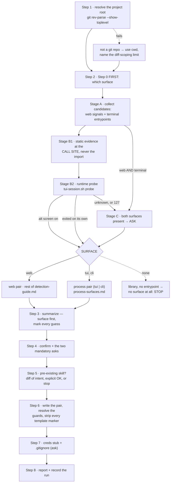

# `test-app-create` — behaviour register

`/r:test-app-create`: detect the current project's surface — a web app, a full-screen terminal UI,
or a command-line tool — then its stack, and write a tailored `.claude/skills/test-app/SKILL.md`
plus `references/subagent-prompt.md`. It **generates** the test skill; it never runs one. It also
ships the terminal driver the surfaces with no HTTP are verified through.

Format, ID scheme and the meaning of the three trailing fields: [`README.md`](README.md).

*Tested by:* cites an `evals.json` only where `tools/run-evals.py` scores the case mechanically —
a `trigger` or `neighbour-exclusion` case. A `behaviour` case needs a fixture *and* a judge, so
the runner names it as a skip rather than a failure; citing one would overstate exactly the
coverage this register exists to measure.

## Flow

## What the skill is, and what it writes

- **SB-test-app-create-001** — The skill GENERATES a project-local `/test-app` skill and never
  runs one. "Test the app" now is the generated skill's job; routing this one there writes a
  large unasked-for scaffold in place of a test run.
  *States it:* `skills/test-app-create/SKILL.md`
  *Enforced by:* —
  *Tested by:* `skills/test-app-create/evals/evals.json`

- **SB-test-app-create-002** — It writes exactly four things under the project root:
  `.claude/skills/test-app/SKILL.md`, `.claude/skills/test-app/references/subagent-prompt.md`,
  `.claude/skills/test-app/test_creds.txt` (only when absent), and `.claude/skills/test-app/e2e/`
  (created on the generated skill's first run).
  *States it:* `skills/test-app-create/SKILL.md`
  *Enforced by:* —
  *Tested by:* —

- **SB-test-app-create-003** — Everything the generated skill owns lives **under its own
  directory**, so generated artifacts never collide with the project's real `scripts/` (an
  existing `scripts/api.py`) or a repo-root creds file. The generated skill refers to them by the
  project-root-relative path `.claude/skills/test-app/…`.
  *States it:* `skills/test-app-create/SKILL.md`
  *Enforced by:* —
  *Tested by:* —

- **SB-test-app-create-004** — `{{CREDS_PATH}}` is always
  `.claude/skills/test-app/test_creds.txt` and `{{E2E_DIR}}` is always
  `.claude/skills/test-app/e2e` — constants, not detected values, because their whole purpose is
  being conflict-free.
  *States it:* `skills/test-app-create/SKILL.md`
  *Enforced by:* —
  *Tested by:* —

- **SB-test-app-create-005** — Step 1 resolves the root with `git rev-parse --show-toplevel`. When
  that fails the current working directory is the root, and the run **names the consequence**: the
  generated skill's no-argument git-diff scoping is limited and leans on conversation history
  instead.
  *States it:* `skills/test-app-create/SKILL.md`
  *Enforced by:* —
  *Tested by:* —

## Step 0 — the surface, which runs before everything else

- **SB-test-app-create-006** — `{{SURFACE}}` is resolved **first**, before any other detection,
  because it picks the template pair every other value is filled into. It is also the one
  detection whose failure is invisible: a wrong base URL produces a skill that obviously does not
  work, a wrong surface produces a plausible skill that asks the wrong questions of the right
  program.
  *States it:* `skills/test-app-create/references/detection-guide.md`
  *Enforced by:* —
  *Tested by:* —

- **SB-test-app-create-007** — There are exactly three surfaces — `web`, `tui`, `cli` — and two
  template pairs. `web` takes `assets/test-app.SKILL.md.template` +
  `assets/subagent-prompt.md.template`; `tui` and `cli` take the **process** pair,
  `assets/test-app.SKILL.md.process.template` + `assets/subagent-prompt.md.process.template`.
  *States it:* `skills/test-app-create/SKILL.md`
  *Enforced by:* —
  *Tested by:* —

- **SB-test-app-create-008** — TUI and CLI share one pair because they share a spine — build the
  binary, run it, assert on what came out, isolate its state — and differ only in how they are
  driven, which the `{{#IF_TUI}}` / `{{#IF_CLI}}` guards cover. They do **not** share the web
  pair: its base URL, login, HTTP security and browser material is most of its body and none of it
  applies to a program with no server.
  *States it:* `skills/test-app-create/SKILL.md`
  *Enforced by:* —
  *Tested by:* —

- **SB-test-app-create-009** — Stage A collects **candidates, never answers**: web signals (a
  compose file, a server framework, `templates/`/`static/`, a published port, a `deploy` skill)
  and terminal signals (an executable entrypoint plus a framework from the tables in
  `process-surfaces.md`). A hit here is a candidate.
  *States it:* `skills/test-app-create/references/detection-guide.md`
  *Enforced by:* —
  *Tested by:* —

- **SB-test-app-create-010** — **A dependency is not a surface.** Stage B1 reads static evidence
  at the **call site**, never the import: `?1049h`/`smcup` first because it owes nothing to a
  language, then the per-framework calls that make a program full-screen. `ratatui` sits in
  `[dev-dependencies]`, `rich` prints coloured tables from a plain CLI, `bubbles` gets vendored
  for one spinner, and `prompt_toolkit`'s default `PromptSession` is a readline replacement.
  *States it:* `skills/test-app-create/references/detection-guide.md`
  *Enforced by:* —
  *Tested by:* —

- **SB-test-app-create-011** — Stage B2 settles it by **running the program**:
  `${CLAUDE_SKILL_DIR}/scripts/tui-session.sh probe --timeout 8 -- <launch command>` prints one
  word — `tui`, `cli` or `unknown` — and always tears down its own session.
  *States it:* `skills/test-app-create/references/detection-guide.md`
  *Enforced by:* `skills/test-app-create/scripts/tui-session.sh`
  *Tested by:* `skills/test-app-create/tests/tui-session.test.sh`

- **SB-test-app-create-012** — The probe runs the **real entrypoint, never `--help`**. No TUI
  enters the alternate screen to print its help, so probing `--help` reports `cli` for every
  program.
  *States it:* `skills/test-app-create/references/detection-guide.md`
  *Enforced by:* —
  *Tested by:* —

- **SB-test-app-create-013** — The probe ladder is five rungs, first hit wins: (1) tmux reports
  the pane on the alternate screen → `tui`, definitive and framework-agnostic; (2) the program
  exited inside the deadline with a status recorded → `cli`, definitive the other way; (3) alive
  with no alternate screen, one harmless key sent and the frame re-read — **changed with no line
  appended** → `tui`, an inline TUI repainting in place; (4) alive, frame unchanged, a prompt on
  the last line → `cli`, a REPL being a CLI wearing a loop; (5) anything else → `unknown`, exit
  `9`. It never guesses.
  *States it:* `skills/test-app-create/references/detection-guide.md`
  *Enforced by:* `skills/test-app-create/scripts/tui-session.sh`
  *Tested by:* `skills/test-app-create/tests/tui-session.test.sh`

- **SB-test-app-create-014** — Driver exit `127` means tmux is absent and the ladder degrades to
  B1 alone. When B1 is not unanimous, **ask the user**. Never fall back to `web`: a repo with a
  `Cargo.toml`, no compose file and no HTTP framework is not a web app with a missing base URL,
  and the web pair for it is a skill whose every placeholder is a guess.
  *States it:* `skills/test-app-create/references/detection-guide.md`
  *Enforced by:* —
  *Tested by:* —

- **SB-test-app-create-015** — Stage C: when Stage A finds a web signal **and** a terminal
  entrypoint that Stage B classifies, they are two products with two verifications and nothing in
  the tree says which one the user wants tested. List surface → entrypoint → framework → how it
  launches → what it looks like it is for, and **ask** — never auto-pick. The common shape is a
  server binary plus an admin CLI in one repo; the answer is usually the server, and only the user
  knows.
  *States it:* `skills/test-app-create/references/detection-guide.md`
  *Enforced by:* —
  *Tested by:* —

- **SB-test-app-create-016** — `surfaceDetectedBy` is recorded as `static` when B1 was unanimous,
  `probe` when B2 decided, and `asked` when Stage C or a non-unanimous B1 sent the run to the
  user; `surfaceCandidates` is how many surfaces Stage A found.
  *States it:* `skills/test-app-create/references/detection-guide.md`
  *Enforced by:* —
  *Tested by:* —

## Web-pair detection

- **SB-test-app-create-017** — **The base URL is the one value that must not be guessed.** A
  compose file can publish `8080:8080` and still be tested through a tunnel, so a published port
  is a candidate, not an answer. When the URL or run model is ambiguous, ask; when the user does
  not know, write `BASE_URL: TODO` with a prominent "set this before the first run" note rather
  than inventing a public URL.
  *States it:* `skills/test-app-create/SKILL.md`
  *Enforced by:* `skills/test-app-create/assets/test-app.SKILL.md.template`
  *Tested by:* —

- **SB-test-app-create-018** — **Several compose files → ask, never auto-pick.**
  `docker-compose.yml` plus a `.dev.yml`/`.prod.yml`/`.override.yml` are different deployments
  with different URLs and `compose -f` invocations. List file → app URL/port → what it looks like
  it is for, ask which deployment `/test-app` targets, and bake the answer into `{{BASE_URL}}`,
  `{{RUN_MODEL}}`, `{{COMPOSE_FILE}}` and the `{{HEALTH_CHECK_CMD}}`/`{{LOGS_CMD}}`/
  `{{REDEPLOY_CMD}}` commands.
  *States it:* `skills/test-app-create/references/detection-guide.md`
  *Enforced by:* —
  *Tested by:* —

- **SB-test-app-create-019** — A stable public/tunnel URL wins over the localhost candidate **only
  when there is a single compose file**; with several, the tunnel folds into the ask, because it
  usually belongs to one specific deployment.
  *States it:* `skills/test-app-create/references/detection-guide.md`
  *Enforced by:* —
  *Tested by:* —

- **SB-test-app-create-020** — When a `.claude/skills/deploy` skill exists, the generated skill
  says containers are managed via `/deploy` and that it never starts or stops them — if they are
  down, tell the user.
  *States it:* `skills/test-app-create/references/detection-guide.md`
  *Enforced by:* —
  *Tested by:* —

- **SB-test-app-create-021** — `{{APP_CONTAINER_PORT}}` is the **container-side** port (the
  `target` of the mapping, or `server.port` inside the container), never the host port — `8080`
  even where the host publishes `8088:8080`. The helper republishes the service on an ephemeral
  host port, so a host port here defeats the isolation it feeds.
  *States it:* `skills/test-app-create/references/detection-guide.md`
  *Enforced by:* —
  *Tested by:* —

- **SB-test-app-create-022** — `{{IF_COMPOSE}}` is `true` for a docker compose run model
  *including* `tunnel over compose`, and `false` for plain dev servers and non-web projects, where
  the whole worktree-isolation block is dropped and the generated skill keeps single-target
  behaviour.
  *States it:* `skills/test-app-create/references/detection-guide.md`
  *Enforced by:* —
  *Tested by:* —

- **SB-test-app-create-023** — `{{UI_IN_SCOPE}}` is a **web-pair placeholder only**. It gates the
  `/agent-browser` blocks and nothing else, and means "there is a browser UI worth driving", not
  "this app has a user interface". A TUI has a user interface and never sets it; unifying the two
  produces a skill that tells a subagent to open a URL against a program with no HTTP server.
  *States it:* `skills/test-app-create/SKILL.md`
  *Enforced by:* —
  *Tested by:* —

- **SB-test-app-create-024** — `{{HTTP_TOOL_BLOCK}}` holds **probes only**. The login flow lives
  once, in `{{LOGIN_EXAMPLE}}`, so the generated prompt never shows the same login snippet twice.
  *States it:* `skills/test-app-create/references/detection-guide.md`
  *Enforced by:* `skills/test-app-create/assets/subagent-prompt.md.template`
  *Tested by:* —

- **SB-test-app-create-025** — The auth model is classified by **what carries the credential on
  each request**, not by whether a helper auto-loads creds: a session cookie plus CSRF is session
  auth even when `.env` supplies the username, and nothing is called JWT without `Bearer` on the
  wire.
  *States it:* `skills/test-app-create/references/detection-guide.md`
  *Enforced by:* —
  *Tested by:* —

- **SB-test-app-create-026** — `{{IF_RATELIMIT}}` needs more than a dependency match: the limiter
  must be registered on the chain and apply to **login**. Otherwise it stays off rather than
  testing a disabled feature.
  *States it:* `skills/test-app-create/references/detection-guide.md`
  *Enforced by:* —
  *Tested by:* —

- **SB-test-app-create-027** — Every conditional-flag probe is scoped to `*/src/main` and excludes
  `worktrees`, `.claude` and test trees, so test-only code and duplicated trees cannot flip a flag
  on.
  *States it:* `skills/test-app-create/references/detection-guide.md`
  *Enforced by:* —
  *Tested by:* —

- **SB-test-app-create-028** — The project's own in-repo helpers are used **in place** and never
  modified; newly generated e2e scripts go under `{{E2E_DIR}}`, never into the project's
  `scripts/`.
  *States it:* `skills/test-app-create/references/detection-guide.md`
  *Enforced by:* —
  *Tested by:* —

## Process-pair detection (`tui` and `cli`)

- **SB-test-app-create-029** — `references/process-surfaces.md` is read **only** when Step 0
  resolved `tui` or `cli`. It is a separate file so the common compose-backed scaffold does not
  pay to read two hundred lines of ratatui signatures.
  *States it:* `skills/test-app-create/references/process-surfaces.md`
  *Enforced by:* —
  *Tested by:* —

- **SB-test-app-create-030** — `{{LAUNCH_CMD}}` and `{{BIN_PATH}}` are **two values and stay
  separate**. `{{LAUNCH_CMD}}` starts the app from the root with no arguments; `{{BIN_PATH}}` is
  the built executable, and every exit-code, stdout/stderr and piping check invokes it. A source
  runner writes its own lines to stderr and returns its own exit code, so a check that ran `cargo
  run -- --bad-flag` and saw exit 101 learned something about cargo, not the app. Folded into one,
  the whole CLI catalog silently tests the wrong program.
  *States it:* `skills/test-app-create/references/process-surfaces.md`
  *Enforced by:* `skills/test-app-create/assets/subagent-prompt.md.process.template`
  *Tested by:* —

- **SB-test-app-create-031** — When the source runs directly with no build step, `{{BUILD_CMD}}`
  is the literal no-op `true`, not an empty string, so the generated skill's shell block still
  parses.
  *States it:* `skills/test-app-create/references/process-surfaces.md`
  *Enforced by:* —
  *Tested by:* —

- **SB-test-app-create-032** — Isolation on this surface is a **state directory, never a port**,
  which is why the generated skill has no "refuse to run from a worktree" case: two worktrees
  running a terminal program cannot collide over a port they do not open, but they will corrupt
  each other's config, history or embedded database.
  *States it:* `skills/test-app-create/references/process-surfaces.md`
  *Enforced by:* `skills/test-app-create/scripts/tui-session.sh`
  *Tested by:* `skills/test-app-create/tests/tui-session.test.sh`

- **SB-test-app-create-033** — `{{STATE_ISOLATION_BLOCK}}` prefers the app's own env knob
  (`APP_HOME`, `<APP>_CONFIG`) over XDG, and a `--config` flag over both. **Overriding `HOME` is
  never the blanket answer**: it also hides the toolchain's caches from the build, and the build
  failure that follows reads as an app failure. With nothing found, `{{STATE_DIR}}` is
  `~/.config/<app>` as a *stated* guess, marked as guessed in the summary.
  *States it:* `skills/test-app-create/references/process-surfaces.md`
  *Enforced by:* `skills/test-app-create/scripts/tui-session.sh`
  *Tested by:* —

- **SB-test-app-create-034** — `{{KEYMAP_BLOCK}}` is the TUI's analogue of the web pair's routes
  and is read from the binding table **in code** first, the help screen second, the README last.
  Without it a subagent guesses `q`, gets nothing, and reports the app unresponsive — the
  commonest false finding on this surface. Screen-specific bindings are marked as such: a key that
  quits from the list and closes a modal from inside it is two behaviours.
  *States it:* `skills/test-app-create/references/process-surfaces.md`
  *Enforced by:* —
  *Tested by:* —

- **SB-test-app-create-035** — `{{CLI_INVOCATION_BLOCK}}` is read from the **parser definition,
  never `--help`**. `--help` accuracy is itself a catalog item, so taking it as the specification
  means a wrong help text can never be found — the check would compare the app against itself and
  always pass.
  *States it:* `skills/test-app-create/references/process-surfaces.md`
  *Enforced by:* `skills/test-app-create/assets/subagent-prompt.md.process.template`
  *Tested by:* —

- **SB-test-app-create-036** — With no documented exit codes, `{{IF_EXIT_CODES}}` stays false and
  the catalog item degrades to "0 on success, and a **distinct** non-zero per failure class",
  which still catches the real defect — an error path that prints a message and then returns
  success.
  *States it:* `skills/test-app-create/references/process-surfaces.md`
  *Enforced by:* `skills/test-app-create/assets/test-app.SKILL.md.process.template`
  *Tested by:* —

- **SB-test-app-create-037** — `{{NATIVE_HARNESS_BLOCK}}` **never carries the baseline-updating
  flag** — not `--snapshot-update`, not `-update`. Those rewrite the golden file to match whatever
  the code now does, turning a regression into a pass: the one way a snapshot harness can hide the
  defect it exists to catch.
  *States it:* `skills/test-app-create/references/process-surfaces.md`
  *Enforced by:* —
  *Tested by:* —

- **SB-test-app-create-038** — A native harness **never replaces the terminal track**, and the
  generated skill says so. It renders into a fake backend, so it cannot observe the alternate
  screen left on at exit, the terminal not restored after a panic, or behaviour under a real TTY
  versus a pipe. Both run.
  *States it:* `skills/test-app-create/references/process-surfaces.md`
  *Enforced by:* `skills/test-app-create/assets/subagent-prompt.md.process.template`
  *Tested by:* —

- **SB-test-app-create-039** — `{{TERM_GEOMETRY}}` defaults to `120x40`, and `{{GEOMETRY_SWEEP}}`
  is always three sizes: something wide (`160x50`), `{{TERM_GEOMETRY}}`, and **`80x24`**. The last
  one survives any trimming — it is the size every terminal guarantees and where a layout that
  quietly assumes width falls apart, the mobile viewport of the web pair for the same reason.
  *States it:* `skills/test-app-create/references/process-surfaces.md`
  *Enforced by:* —
  *Tested by:* —

- **SB-test-app-create-040** — `{{IF_MOUSE}}` is written as *covered by the harness or recorded as
  not covered*. A mouse report cannot be honestly synthesized into a pane, and a check that cannot
  fail is worse than an admitted gap.
  *States it:* `skills/test-app-create/references/process-surfaces.md`
  *Enforced by:* `skills/test-app-create/assets/test-app.SKILL.md.process.template`
  *Tested by:* —

- **SB-test-app-create-041** — **`{{LOGS_CMD}}` is almost never stdout.** On a TUI stdout *is* the
  UI, so a log line printed there corrupts the frame; the value is a logfile, a `--log-file` flag,
  a redirected `RUST_LOG`/`DEBUG` channel or a journal unit. An app with no log channel is named
  in the summary rather than pointed at stdout — the generated skill would otherwise tell a
  subagent to grep the rendered screen for stack traces, which is a different check that quietly
  always passes.
  *States it:* `skills/test-app-create/references/process-surfaces.md`
  *Enforced by:* —
  *Tested by:* —

## Confirm, upgrade, write

- **SB-test-app-create-042** — Step 3's summary puts **surface in the first row**, with how it was
  decided — read statically, settled by the runtime probe, or asked — because everything else
  hangs off it and its error is invisible in the result. Anything guessed is explicitly marked,
  the base URL and the surface above all.
  *States it:* `skills/test-app-create/SKILL.md`
  *Enforced by:* —
  *Tested by:* —

- **SB-test-app-create-043** — Two asks are **mandatory** and are the same rule twice — several
  plausible targets, no way to rank them from the code, a wrong pick invisible until somebody
  reads the generated skill: *several compose files exist* (which deployment) and *both a web
  signal and a terminal entrypoint exist* (which surface). Other gaps are batched into one round
  of questions.
  *States it:* `skills/test-app-create/SKILL.md`
  *Enforced by:* —
  *Tested by:* —

- **SB-test-app-create-044** — An existing `.claude/skills/test-app/` is **never overwritten
  silently**: show a short diff of intent, overwrite only on explicit confirmation, and stop if
  the user declines.
  *States it:* `skills/test-app-create/SKILL.md`
  *Enforced by:* —
  *Tested by:* —

- **SB-test-app-create-045** — **The marker upgrade case:** a skill with no `<!-- test-app-surface:
  … -->` comment. Without it `/r:task-review` infers the surface from whether a base URL appears
  in the file — right only for web skills, wrong for terminal ones. Re-running fixes it in one
  line, and re-detects while there: a project that grew a CLI since the skill was written has a
  second surface nobody asked about.
  *States it:* `skills/test-app-create/SKILL.md`
  *Enforced by:* `skills/task-review/task-review.workflow.js`
  *Tested by:* —

- **SB-test-app-create-046** — **The worktree upgrade case:** a compose-based skill with no *Where
  the app runs* section. Its **manual** `/test-app` runs hit the fixed default port and collide
  across worktrees; the automated path is safe regardless, because `/r:task-review` deploys
  through the shared helper whatever the skill contains. The upgrade is offered, re-detects the
  compose knobs, and leaves the user's own tailoring intact.
  *States it:* `skills/test-app-create/SKILL.md`
  *Enforced by:* —
  *Tested by:* —

- **SB-test-app-create-047** — Step 6 resolves the section guards: a `{{#IF_X}} … {{/IF_X}}` block
  is kept **verbatim** when its flag is true and **deleted entirely** when false, and every
  `{{#IF_*}}`/`{{/IF_*}}` marker is stripped. The generated files contain no template syntax.
  *States it:* `skills/test-app-create/SKILL.md`
  *Enforced by:* —
  *Tested by:* —

- **SB-test-app-create-048** — **Both pairs carry the surface marker** — `<!-- test-app-surface:
  web|tui|cli -->` as an HTML comment under the H1, on every generated skill including the web
  ones. Absent, "a skill without one" and "a web skill" are indistinguishable and the pipeline
  falls back to inferring from whether a base URL appears in the file.
  *States it:* `skills/test-app-create/SKILL.md`
  *Enforced by:* `skills/test-app-create/assets/test-app.SKILL.md.process.template`
  *Tested by:* —

- **SB-test-app-create-049** — The marker is a **comment rather than a frontmatter key**
  deliberately: an unknown frontmatter key on a project-local skill risks the loader rejecting the
  block, and a skill that silently stops routing is a worse failure than the one this marker
  fixes.
  *States it:* `skills/test-app-create/SKILL.md`
  *Enforced by:* —
  *Tested by:* —

- **SB-test-app-create-050** — `/r:task-review` Step 8 greps that line to decide what to start and
  what handle to give its verifier, which is why the generated skill tells the reader to re-run
  `/r:test-app-create` rather than edit the line — the rest of the file would still describe the
  old surface.
  *States it:* `skills/test-app-create/assets/test-app.SKILL.md.template`
  *Enforced by:* `skills/task-review/task-review.workflow.js`
  *Tested by:* `skills/task-review/tests/control-flow.test.mjs`

- **SB-test-app-create-051** — Step 7 writes the creds stub only when absent, adds it to
  `.gitignore` **after asking** (it holds secrets), and tells the user to fill in real accounts.
  Real secrets are never copied into the skill files — they only reference the path. An existing
  project creds file is noted and may seed the new one with the user's OK, but the skill still
  standardizes on the skill-dir file.
  *States it:* `skills/test-app-create/SKILL.md`
  *Enforced by:* `skills/test-app-create/assets/test_creds.txt.template`
  *Tested by:* —

- **SB-test-app-create-052** — `{{WTD_PATH}}` and `{{TUI_DRIVER_PATH}}` are substituted
  **literally** as `${CLAUDE_PLUGIN_ROOT}/skills/task-review/scripts/worktree-deploy.sh` and
  `${CLAUDE_PLUGIN_ROOT}/skills/test-app-create/scripts/tui-session.sh`. The generated skill is
  project-local and cannot resolve a placeholder of its own.
  *States it:* `skills/test-app-create/SKILL.md`
  *Enforced by:* —
  *Tested by:* —

## What the generated skill contains

- **SB-test-app-create-053** — The generated skill is named `test-app` and its body is the same
  seven steps on both pairs: decide what to test (argument, else conversation history → `git
  status`/`git diff` → `git diff HEAD~1 --stat`), build the subagent prompt from
  `references/subagent-prompt.md`, scan the real contract into persisted e2e scripts, run the
  catalog, resolve credentials, spawn subagents, report.
  *States it:* `skills/test-app-create/assets/test-app.SKILL.md.template`
  *Enforced by:* `skills/test-app-create/assets/test-app.SKILL.md.process.template`
  *Tested by:* —

- **SB-test-app-create-054** — Subagents are spawned with `subagent_type: general-purpose`, one
  per focused area, in parallel in one message when areas are independent, and **foreground** —
  the parent needs the results to report back.
  *States it:* `skills/test-app-create/assets/test-app.SKILL.md.template`
  *Enforced by:* —
  *Tested by:* —

- **SB-test-app-create-055** — The web skill resolves its base URL **once, before testing**, in
  four cases in priority order: (1) a caller-supplied `TEST_APP_BASE_URL` is tested against and
  nothing is deployed or torn down; (2) the main working tree uses `{{BASE_URL}}` and never starts
  or stops the stack; (3) a linked worktree with the helper brings up an isolated ephemeral stack
  on a free port with throwaway volumes; (4) a linked worktree **without** the helper **stops** —
  never falling back to the default port, which would clash with the main stack.
  *States it:* `skills/test-app-create/assets/test-app.SKILL.md.template`
  *Enforced by:* `skills/task-review/scripts/worktree-deploy.sh`
  *Tested by:* `skills/task-review/tests/worktree-deploy.test.sh`

- **SB-test-app-create-056** — A `{{BASE_URL}}` still carrying the `TODO` sentinel **stops the
  run** with a message, rather than testing whatever that string resolves to.
  *States it:* `skills/test-app-create/assets/test-app.SKILL.md.template`
  *Enforced by:* —
  *Tested by:* —

- **SB-test-app-create-057** — In case 3 the teardown is set up as `trap … EXIT` **immediately
  after the deploy succeeds**, so the stack is removed on any exit path — a failed assertion, an
  error, an aborted run — and readiness is a **bounded** poll with a hard 90s deadline that STOPs
  rather than waiting forever.
  *States it:* `skills/test-app-create/assets/test-app.SKILL.md.template`
  *Enforced by:* —
  *Tested by:* —

- **SB-test-app-create-058** — The process skill's four cases are: (1) a caller-supplied
  `TEST_APP_SESSION`/`TEST_APP_BIN` is used as-is and nothing is built, started or stopped — a
  second instance of a program that owns a config file or a lock is a collision, not a spare; (2)
  anywhere else, run `{{BUILD_CMD}}` first, because an unbuilt binary is silently the previous
  commit and every check then passes against code nobody changed; (3) a linked worktree needs
  nothing extra, there being no port to collide over; (4) surface-specific — on `tui` a missing
  tmux means those checks **did not run**, on `cli` a missing `{{BIN_PATH}}` after the build stops
  the run.
  *States it:* `skills/test-app-create/assets/test-app.SKILL.md.process.template`
  *Enforced by:* —
  *Tested by:* —

- **SB-test-app-create-059** — On a TUI the generated skill sets `trap '"$TUI" stop "$H"' EXIT`
  the moment a start succeeds. A leaked tmux session is worse than a leaked container in one
  specific way: nothing lists it where you would look. The driver's TTL is a backstop for a killed
  run, never a substitute for the trap.
  *States it:* `skills/test-app-create/assets/test-app.SKILL.md.process.template`
  *Enforced by:* `skills/test-app-create/scripts/tui-session.sh`
  *Tested by:* —

- **SB-test-app-create-060** — Each TUI subagent is given a **distinct `TUI_SESSION_SUFFIX`**. Two
  subagents driving one pane interleave their keystrokes and both report nonsense; the driver
  isolates by suffix, but only if they are actually different.
  *States it:* `skills/test-app-create/assets/test-app.SKILL.md.process.template`
  *Enforced by:* `skills/test-app-create/scripts/tui-session.sh`
  *Tested by:* `skills/test-app-create/tests/tui-session.test.sh`

- **SB-test-app-create-061** — The process subagent prompt **forbids** `agent-browser` (no
  browser, no page to open) and **forbids a hand-rolled pty or `expect` wrapper** in place of the
  driver — an ad-hoc wrapper fails open everywhere the driver fails closed, which is the whole
  reason the driver exists.
  *States it:* `skills/test-app-create/assets/subagent-prompt.md.process.template`
  *Enforced by:* —
  *Tested by:* —

- **SB-test-app-create-062** — The process prompt carries the driver's exit-code table (1, 3, 4,
  5, 6, 7, 8, 127) and the rule that **a non-zero exit is never "the check passed anyway"** —
  each code is a statement about what could not be observed.
  *States it:* `skills/test-app-create/assets/subagent-prompt.md.process.template`
  *Enforced by:* `skills/test-app-create/scripts/tui-session.sh`
  *Tested by:* `skills/test-app-create/tests/tui-session.test.sh`

- **SB-test-app-create-063** — The TUI geometry sweep has a **budget of at most 6 captures** — the
  two screens the diff changed most, each at three sizes. A capture is text and cheap to read, so
  the cap is scope discipline, not cost; a capture of a screen the diff never touched is not
  pasted.
  *States it:* `skills/test-app-create/assets/subagent-prompt.md.process.template`
  *Enforced by:* —
  *Tested by:* —

- **SB-test-app-create-064** — The process security pass keeps the parts that survive from a web
  app and **names what it drops and why**: no CSRF and no security headers (there is no request to
  forge), no wrong-role session (a local process runs as the invoking user and the OS *is* the
  authorization boundary), no rate limiting (a server property). It keeps secrets-on-disk mode
  `600`, secrets in argv and logs, shell-out injection including a **leading `-`** the inner tool
  re-reads as a flag, and path traversal.
  *States it:* `skills/test-app-create/assets/subagent-prompt.md.process.template`
  *Enforced by:* —
  *Tested by:* —

- **SB-test-app-create-065** — **Escape-sequence injection from untrusted data is the direct
  analogue of XSS** and the most under-tested class on a terminal surface: seed a record whose
  name or description carries `\033[2J\033[H`, an OSC title sequence or a bare `\r`, render it,
  `capture --ansi`, and confirm the bytes were neutralised rather than executed. `send -H` injects
  the exact bytes.
  *States it:* `skills/test-app-create/assets/subagent-prompt.md.process.template`
  *Enforced by:* `skills/test-app-create/scripts/tui-session.sh`
  *Tested by:* —

- **SB-test-app-create-066** — The process skill reports `N passed, M failed, K skipped`, and **a
  check that could not run is reported as skipped and named, never folded into the pass count**. A
  check is skipped — never passed — when the tool it needed was absent, and the report says which
  and why.
  *States it:* `skills/test-app-create/assets/test-app.SKILL.md.process.template`
  *Enforced by:* `skills/test-app-create/assets/subagent-prompt.md.process.template`
  *Tested by:* —

## The terminal driver — `scripts/tui-session.sh`

- **SB-test-app-create-067** — Behaviour is decided by **where it runs, never by who calls it**:
  the session id and the throwaway state dir are derived from the checkout root (hashed), so two
  worktrees testing one app never share a pane, a config file or a history — the same rule
  `worktree-deploy.sh` applies to ports and compose projects.
  *States it:* `skills/test-app-create/scripts/tui-session.sh`
  *Enforced by:* `skills/test-app-create/scripts/tui-session.sh`
  *Tested by:* `skills/test-app-create/tests/tui-session.test.sh`

- **SB-test-app-create-068** — Every tmux call goes through a **private server** (`-L`) with the
  user's config ignored (`-f /dev/null`). Both are load-bearing rather than hygiene: a shared
  server lets the script resize or kill the user's own sessions, and an unignored `~/.tmux.conf`
  changes what the pane shows and what keys do, which makes every captured frame machine-specific
  and every comparison between two of them worthless.
  *States it:* `skills/test-app-create/scripts/tui-session.sh`
  *Enforced by:* `skills/test-app-create/scripts/tui-session.sh`
  *Tested by:* `skills/test-app-create/tests/tui-session.test.sh`

- **SB-test-app-create-069** — **The exit codes are the whole contract**, each existing because
  the failure it names otherwise returns a confident wrong answer: `0` ok · `1` failed to start or
  died before drawing · `2` not inside a git repo · `3` the app has exited · `4` no such session ·
  `5` the capture is empty · `6` `wait-for` deadline exceeded · `7` geometry not applied · `8`
  unclean exit · `9` probe inconclusive · `64` usage · `127` tmux is missing.
  *States it:* `skills/test-app-create/scripts/tui-session.sh`
  *Enforced by:* `skills/test-app-create/scripts/tui-session.sh`
  *Tested by:* `skills/test-app-create/tests/tui-session.test.sh`

- **SB-test-app-create-070** — **`127` is reserved for tmux alone**, because a caller reads it as
  "record the checks as NOT RUN and name the reason". A missing `git` is not that — it is a broken
  machine, and exits `2`. The `127` message names tmux, names how to install it, and says
  explicitly never to report a TUI as verified without it.
  *States it:* `skills/test-app-create/scripts/tui-session.sh`
  *Enforced by:* `skills/test-app-create/scripts/tui-session.sh`
  *Tested by:* `skills/test-app-create/tests/tui-session.test.sh`

- **SB-test-app-create-071** — tmux is required **per subcommand, not once at load**: `mode`
  answers from git alone and keeps answering without tmux, while everything that touches a pane
  fails closed. The failure this locks out is `worktree-deploy.sh`'s — a `require_bin` ahead of
  the subcommand makes a machine without the tool unable to say even where it is, and a caller
  retrying that burns agents on a no-op.
  *States it:* `skills/test-app-create/scripts/tui-session.sh`
  *Enforced by:* `skills/test-app-create/scripts/tui-session.sh`
  *Tested by:* `skills/test-app-create/tests/tui-session.test.sh`

- **SB-test-app-create-072** — The subcommand name is validated **before** tmux is: a typo is a
  usage error (`64`) on any machine, and answering it with `127` would tell the caller to install
  tmux to fix a misspelling.
  *States it:* `skills/test-app-create/scripts/tui-session.sh`
  *Enforced by:* `skills/test-app-create/scripts/tui-session.sh`
  *Tested by:* `skills/test-app-create/tests/tui-session.test.sh`

- **SB-test-app-create-073** — A handle is deliberately narrow — `^[A-Za-z0-9_-]+$`, no `:` (tmux
  target syntax), no `.` (pane syntax), no metacharacters — because callers interpolate it into
  shell commands.
  *States it:* `skills/test-app-create/scripts/tui-session.sh`
  *Enforced by:* `skills/test-app-create/scripts/tui-session.sh`
  *Tested by:* `skills/test-app-create/tests/tui-session.test.sh`

- **SB-test-app-create-074** — Session lookup uses `has-session -t "=$ID"`; the `=` forces an
  exact match. Without it `ta-abc` matches `ta-abcdef` and the driver reads **another worktree's
  pane** while reporting success.
  *States it:* `skills/test-app-create/scripts/tui-session.sh`
  *Enforced by:* `skills/test-app-create/scripts/tui-session.sh`
  *Tested by:* `skills/test-app-create/tests/tui-session.test.sh`

- **SB-test-app-create-075** — `start` prints **exactly one line on stdout, and it is the
  handle**; everything else goes to stderr. The caller captures stdout *as* the handle, so one
  stray line becomes part of it and every later `-t` lookup fails in a way indistinguishable from
  "the session is gone".
  *States it:* `skills/test-app-create/scripts/tui-session.sh`
  *Enforced by:* `skills/test-app-create/scripts/tui-session.sh`
  *Tested by:* `skills/test-app-create/tests/tui-session.test.sh`

- **SB-test-app-create-076** — `start` **reclaims rather than fails**: a previous run killed
  mid-flight leaves a session behind, and failing there would make every subsequent run in that
  worktree fail too.
  *States it:* `skills/test-app-create/scripts/tui-session.sh`
  *Enforced by:* `skills/test-app-create/scripts/tui-session.sh`
  *Tested by:* —

- **SB-test-app-create-077** — `status off` and `history-limit` are set on the server **before**
  `new-session`, because the status bar steals a ROW: a pane asked for 40 rows would be 39 and
  every cramped-geometry check would test the wrong size forever. Both apply at pane creation.
  *States it:* `skills/test-app-create/scripts/tui-session.sh`
  *Enforced by:* `skills/test-app-create/scripts/tui-session.sh`
  *Tested by:* `skills/test-app-create/tests/tui-session.test.sh`

- **SB-test-app-create-078** — `window-size manual` is set on the new session, or a resize with no
  client attached is silently ignored and the geometry sweep measures one size three times while
  reporting three.
  *States it:* `skills/test-app-create/scripts/tui-session.sh`
  *Enforced by:* `skills/test-app-create/scripts/tui-session.sh`
  *Tested by:* `skills/test-app-create/tests/tui-session.test.sh`

- **SB-test-app-create-079** — `start` **verifies the geometry it got** against the geometry it
  asked for and exits `7` on a mismatch, tearing the session down first: it refuses to test a size
  nobody chose.
  *States it:* `skills/test-app-create/scripts/tui-session.sh`
  *Enforced by:* `skills/test-app-create/scripts/tui-session.sh`
  *Tested by:* `skills/test-app-create/tests/tui-session.test.sh`

- **SB-test-app-create-080** — The launch command runs through a **shim file**, not an inline `sh
  -c`: that makes the pane's survival independent of `remain-on-exit` (whose option scope has
  moved across the tmux 3.x line) and turns the app's exit status into a file rather than a format
  string that has to be read before the pane is reused. Pane liveness therefore answers a
  different question than "has the app finished", and the exitcode file answers the second.
  *States it:* `skills/test-app-create/scripts/tui-session.sh`
  *Enforced by:* `skills/test-app-create/scripts/tui-session.sh`
  *Tested by:* `skills/test-app-create/tests/tui-session.test.sh`

- **SB-test-app-create-081** — The shim exports the four XDG variables at the throwaway state dir
  and **does not override `HOME`** — that would hide `~/.cargo`, `~/.npm` and `~/go` from the
  launch command, and the build failure that follows reads as an app failure. `TUI_ISOLATE_HOME=1`
  opts in for an app that writes straight to `$HOME`.
  *States it:* `skills/test-app-create/scripts/tui-session.sh`
  *Enforced by:* `skills/test-app-create/scripts/tui-session.sh`
  *Tested by:* `skills/test-app-create/tests/tui-session.test.sh`

- **SB-test-app-create-082** — `start` waits until the pane has painted something or the app has
  exited, and exits `1` if neither happens within `TUI_START_TIMEOUT` (20s): handing back a handle
  to a pane with nothing on it would give the caller a session to assert against.
  *States it:* `skills/test-app-create/scripts/tui-session.sh`
  *Enforced by:* `skills/test-app-create/scripts/tui-session.sh`
  *Tested by:* `skills/test-app-create/tests/tui-session.test.sh`

- **SB-test-app-create-083** — An app that exits non-zero before it could be tested fails `start`
  with its last five lines on stderr — **unless `TUI_ALLOW_EXIT=1`**, which `probe` and `run-tty`
  set because for them the app finishing IS the result. On the verification path it is not:
  handing back a handle to a program that already exited gives the caller a session that will
  never draw again.
  *States it:* `skills/test-app-create/scripts/tui-session.sh`
  *Enforced by:* `skills/test-app-create/scripts/tui-session.sh`
  *Tested by:* —

- **SB-test-app-create-084** — Every `start` arms a **detached watchdog** (`TUI_TTL`, default
  3600s) that kills the server and removes the state dir. If the whole review is SIGKILLed no trap
  and no `finally` runs, and a tmux session is worse than a container about it — invisible, and
  one per abandoned run. This is the only backstop for that, so the TTL is not optional.
  *States it:* `skills/test-app-create/scripts/tui-session.sh`
  *Enforced by:* `skills/test-app-create/scripts/tui-session.sh`
  *Tested by:* —

- **SB-test-app-create-085** — `send` **refuses once the app has exited**, with exit `3`.
  `send-keys` into a finished app succeeds in tmux; the next capture then returns the last painted
  frame and the reader concludes the app is running and ignoring input.
  *States it:* `skills/test-app-create/scripts/tui-session.sh`
  *Enforced by:* `skills/test-app-create/scripts/tui-session.sh`
  *Tested by:* `skills/test-app-create/tests/tui-session.test.sh`

- **SB-test-app-create-086** — **An empty capture exits `5`**, never an empty string with exit 0.
  It is the most dangerous success-shaped failure on this surface: a reader handed `""` concludes
  "no error text on screen" and passes the render check.
  *States it:* `skills/test-app-create/scripts/tui-session.sh`
  *Enforced by:* `skills/test-app-create/scripts/tui-session.sh`
  *Tested by:* `skills/test-app-create/tests/tui-session.test.sh`

- **SB-test-app-create-087** — `capture` writes the frame to a **file** and prints its path,
  numbering frames per session; `--ansi` keeps the colour sequences and `--scrollback N` reads
  back.
  *States it:* `skills/test-app-create/scripts/tui-session.sh`
  *Enforced by:* `skills/test-app-create/scripts/tui-session.sh`
  *Tested by:* `skills/test-app-create/tests/tui-session.test.sh`

- **SB-test-app-create-088** — `wait-for` is **capped at 120s and there is no flag that removes
  the cap**. The UI track is already the review's longest serial block, and a driver that can
  block forever can hang the review.
  *States it:* `skills/test-app-create/scripts/tui-session.sh`
  *Enforced by:* `skills/test-app-create/scripts/tui-session.sh`
  *Tested by:* `skills/test-app-create/tests/tui-session.test.sh`

- **SB-test-app-create-089** — A **dead app is not "still loading"**: `wait-for` against an exited
  app exits `3`, not `6`. Conflating them turns a crash into a timeout report and sends the reader
  looking for a slow start that never happened. A real deadline miss exits `6` and prints the
  final frame to stderr.
  *States it:* `skills/test-app-create/scripts/tui-session.sh`
  *Enforced by:* `skills/test-app-create/scripts/tui-session.sh`
  *Tested by:* `skills/test-app-create/tests/tui-session.test.sh`

- **SB-test-app-create-090** — `resize` **verifies the resize took**, polling for up to 3s and
  exiting `7` if the pane never reports the new size — otherwise a three-size sweep is one size
  measured thrice.
  *States it:* `skills/test-app-create/scripts/tui-session.sh`
  *Enforced by:* `skills/test-app-create/scripts/tui-session.sh`
  *Tested by:* `skills/test-app-create/tests/tui-session.test.sh`

- **SB-test-app-create-091** — `status` prints one line — `running|exited|absent exit=N geom=WxH
  alt=0|1` — and a handle nobody started reads as `absent`, not as an empty session that is fine.
  *States it:* `skills/test-app-create/scripts/tui-session.sh`
  *Enforced by:* `skills/test-app-create/scripts/tui-session.sh`
  *Tested by:* `skills/test-app-create/tests/tui-session.test.sh`

- **SB-test-app-create-092** — `stop` is **idempotent by contract**, which is what lets a caller's
  teardown run on every exit path — including one where the deploy died before it started
  anything. It kills the watchdog, the session and the private server, and removes the state dir
  unless `TUI_KEEP_STATE=1`.
  *States it:* `skills/test-app-create/scripts/tui-session.sh`
  *Enforced by:* `skills/test-app-create/scripts/tui-session.sh`
  *Tested by:* `skills/test-app-create/tests/tui-session.test.sh`

- **SB-test-app-create-093** — `stop --expect-exited` is **the terminal-restoration check** and
  exits `8` with the reason named for each of its three failures: still running, exited with the
  alternate screen still on, or a non-zero status. An app that quits but leaves the alternate
  screen on is the defect users actually report, and no in-process harness can see it.
  *States it:* `skills/test-app-create/scripts/tui-session.sh`
  *Enforced by:* `skills/test-app-create/scripts/tui-session.sh`
  *Tested by:* `skills/test-app-create/tests/tui-session.test.sh`

- **SB-test-app-create-094** — `probe` runs with `TUI_ALLOW_EXIT=1` and `TUI_KEEP_STATE=1` so the
  exitcode the program left behind survives to be the evidence, and a **program that exits
  non-zero on its own with no arguments is still `cli`** — `start` refuses it, and refusing to
  answer there would send the caller to the web template for a binary that plainly is not a web
  app.
  *States it:* `skills/test-app-create/scripts/tui-session.sh`
  *Enforced by:* `skills/test-app-create/scripts/tui-session.sh`
  *Tested by:* `skills/test-app-create/tests/tui-session.test.sh`

- **SB-test-app-create-095** — `run-tty` returns **the command's own exit code**, not its own, and
  copies the captured pty output to a path that survives the session — the caller needs the file
  after teardown. A wrapper that swallowed the status would make every exit-code assertion in the
  CLI catalog an assertion about the wrapper.
  *States it:* `skills/test-app-create/scripts/tui-session.sh`
  *Enforced by:* `skills/test-app-create/scripts/tui-session.sh`
  *Tested by:* `skills/test-app-create/tests/tui-session.test.sh`

- **SB-test-app-create-096** — `run-tty` is **the only place the CLI catalog touches tmux**, which
  is why a missing tmux costs two CLI checks rather than the CLI track: argv, exit codes,
  stdout/stderr separation, piping and signals are plain shell and deterministic without it. Only
  `--help` wrapping and the isatty branch need a real terminal.
  *States it:* `skills/test-app-create/scripts/tui-session.sh`
  *Enforced by:* `skills/test-app-create/scripts/tui-session.sh`
  *Tested by:* —

- **SB-test-app-create-097** — `mode` prints `main` or `worktree` from `git rev-parse --git-dir`
  against `--git-common-dir`, and exits `2` outside a git repo rather than guessing.
  *States it:* `skills/test-app-create/scripts/tui-session.sh`
  *Enforced by:* `skills/test-app-create/scripts/tui-session.sh`
  *Tested by:* `skills/test-app-create/tests/tui-session.test.sh`

- **SB-test-app-create-098** — The suite **skips and counts** the live cases when tmux is absent
  and still exits 0: `validate.sh` has no tmux mandate and must not start failing on a machine
  that never had one. The skip count is on the summary line because that is the only line
  `validate.sh` prints, and a skip nobody can see is the same instrument-never-fired failure as a
  green sweep over nothing.
  *States it:* `skills/test-app-create/tests/tui-session.test.sh`
  *Enforced by:* `skills/test-app-create/tests/tui-session.test.sh`
  *Tested by:* `skills/test-app-create/tests/tui-session.test.sh`

## Record the run

- **SB-test-app-create-099** — One row into the pack-wide store via `lib/record-run.py`, carrying
  **counts and detection outcomes only** — never a credential, a base URL, a hostname, or anything
  read out of the project's config. The keys are `skill`, `buildTool`, `surface`,
  `surfaceDetectedBy`, `surfaceCandidates`, `tuiFramework`, `nativeHarness`, `tmuxAvailable`,
  `authModel`, `detectedFromCode`, `askedTheUser`, `httpHelpersFound`, `credentialsFound`,
  `filesWritten`, `overwroteExisting`, `blockedReason`.
  *States it:* `skills/test-app-create/SKILL.md`
  *Enforced by:* `lib/record-run.py`
  *Tested by:* `lib/tests/stats.test.sh`

- **SB-test-app-create-100** — **`detectedFromCode` against `askedTheUser` is what this skill is
  tuned on.** Detection is the whole point: a scaffolder that asks the user for the base URL, the
  build command and the login route has only rephrased the questions. Read per `buildTool` and
  `surface`, a stack that always falls back to asking is a detection gap with a name.
  *States it:* `skills/test-app-create/SKILL.md`
  *Enforced by:* —
  *Tested by:* —

- **SB-test-app-create-101** — `surface` is `web|tui|cli` and `surfaceDetectedBy` is
  `static|probe|asked` — the same detected-versus-asked reading at the point where a wrong answer
  costs the most. A framework that always ends up `asked` is a discriminator gap with a name, and
  `surfaceCandidates ≥ 2` means the hybrid ask fired, which shows whether that ask is over- or
  under-triggering.
  *States it:* `skills/test-app-create/SKILL.md`
  *Enforced by:* —
  *Tested by:* —

- **SB-test-app-create-102** — `tmuxAvailable` makes "the terminal checks did not run"
  **countable rather than inferred**, so a run of them on one machine is visible instead of a
  quiet pass.
  *States it:* `skills/test-app-create/SKILL.md`
  *Enforced by:* —
  *Tested by:* —

- **SB-test-app-create-103** — **`credentialsFound: false` is a normal outcome, never a
  blockage.** The generated skill works without test credentials; it cannot log in. Recording it
  as a block would put a scaffold that succeeded into the same bucket as one that never ran.
  *States it:* `skills/test-app-create/SKILL.md`
  *Enforced by:* —
  *Tested by:* —

- **SB-test-app-create-104** — `record-run.py` always exits `0`, is never retried, and must never
  change what was written — a lost row is a lost row, never a failed run.
  *States it:* `skills/test-app-create/SKILL.md`
  *Enforced by:* `lib/record-run.py`
  *Tested by:* `lib/tests/stats.test.sh`

## Edge cases

- **SB-test-app-create-105** — **A library with no executable entrypoint has no surface at all:
  stop and say so**, rather than emitting a web skeleton full of `TODO`s. A `/test-app` that wraps
  `mvn test` or `cargo test` is a rename, not a skill. Name what was looked for and what would
  change the answer — a `[[bin]]`, a `cmd/*/main.go`, a console script.
  *States it:* `skills/test-app-create/SKILL.md`
  *Enforced by:* —
  *Tested by:* —

- **SB-test-app-create-106** — **tmux absent on a `tui` project: write the skill anyway** and say
  plainly what it will and will not do — the terminal checks are recorded as not run and named,
  the rest still run. Do not fall back to the web pair or to `cli`: **the surface is a fact about
  the app, not about this machine.**
  *States it:* `skills/test-app-create/SKILL.md`
  *Enforced by:* —
  *Tested by:* `skills/test-app-create/tests/tui-session.test.sh`

- **SB-test-app-create-107** — Downstream, **an absent tmux on a project whose generated
  `/test-app` DECLARED a terminal surface is a BLOCKED track, never a skip** — exactly as an
  absent docker is on the web path. That declaration is the project opting in, so the terminal is
  the instrument its verification needs, and a skip there would let a merge gate read "nothing was
  owed" about a TUI nobody looked at.
  *States it:* `skills/task-review/task-review.workflow.js`
  *Enforced by:* —
  *Tested by:* —

- **SB-test-app-create-108** — **A pure JSON API is still `{{SURFACE}}=web`**, with
  `{{UI_IN_SCOPE}}=false`: the UI/UX checks degrade to API response-shape validation, and
  `agent-browser` is kept only where an admin or docs UI (Swagger) exists.
  *States it:* `skills/test-app-create/SKILL.md`
  *Enforced by:* —
  *Tested by:* —

- **SB-test-app-create-109** — With no docker, the rebuild/compose-logs material is dropped:
  `{{LOGS_CMD}}` becomes the app's logfile or stdout and `{{HEALTH_CHECK_CMD}}` a health curl or
  process check.
  *States it:* `skills/test-app-create/SKILL.md`
  *Enforced by:* —
  *Tested by:* —

- **SB-test-app-create-110** — **Worktrees need the generated skill on their branch.** It is
  loaded at session start from the checkout's own `.claude/skills/`, so a worktree branched off a
  commit from before the skill landed silently will not load it. The run tells the user to commit
  the skill and to base or rebase worktrees on a commit that includes it; `/r:task-review` Step 8
  detects that stale-worktree case and says so rather than reporting "no skill configured".
  *States it:* `skills/test-app-create/SKILL.md`
  *Enforced by:* `skills/task-review/task-review.workflow.js`
  *Tested by:* —

## Prose-only behaviours

Held up by wording alone — no *Enforced by:* and no *Tested by:*. Nothing fails if one quietly
stops being true, which is exactly the class a rewrite can lose in silence: **51 of 110** entries.

SB-test-app-create-002, -003, -004, -005, -006, -007, -008, -009, -010, -012, -014, -015, -016,
-018, -019, -020, -021, -022, -023, -025, -026, -027, -028, -029, -031, -034, -037, -039, -041,
-042, -043, -044, -046, -047, -049, -052, -054, -056, -057, -058, -061, -063, -064, -100, -101,
-102, -103, -105, -107, -108, -109

They cluster in three places. **Detection is almost entirely prose** (-006 through -029, -031,
-034, -037, -039, -041): the driver decides `tui` versus `cli` at the probe and its suite proves
that, but everything upstream and downstream of the probe — what counts as a candidate, that a
dependency is not a surface, that the base URL is never guessed, that a non-unanimous B1 goes to
the user rather than to `web` — is read by a model from a reference file and nothing checks the
answer. **The generated skill's own rules are prose twice over** (-047, -049, -054, -056, -057,
-058, -061, -063, -064): they are written into a template, copied into the user's repo, and never
executed here, so a template edit that drops the `TODO` sentinel stop or the "skipped, never
passed" rule leaves every suite green. And the **stats semantics** (-100 through -103) are
interpretation: the row is written and validated, but what `credentialsFound: false` means and
what `detectedFromCode` is for exist only in this prose.

**The two to watch are -107 and -010.** -107 is the rule that an absent tmux on a declared
terminal surface is a *blockage*, not a skip — it lives in one prompt string inside
`task-review.workflow.js`, and softening it produces a merge gate that reads "nothing was owed"
about a TUI nobody looked at. -010 is "a dependency is not a surface", the single sentence that
stands between a `[dev-dependencies]` ratatui and the wrong template pair for an entire generated
skill; the eval fixture encodes the answer, but `run-evals.py` scores it only with a judge.
