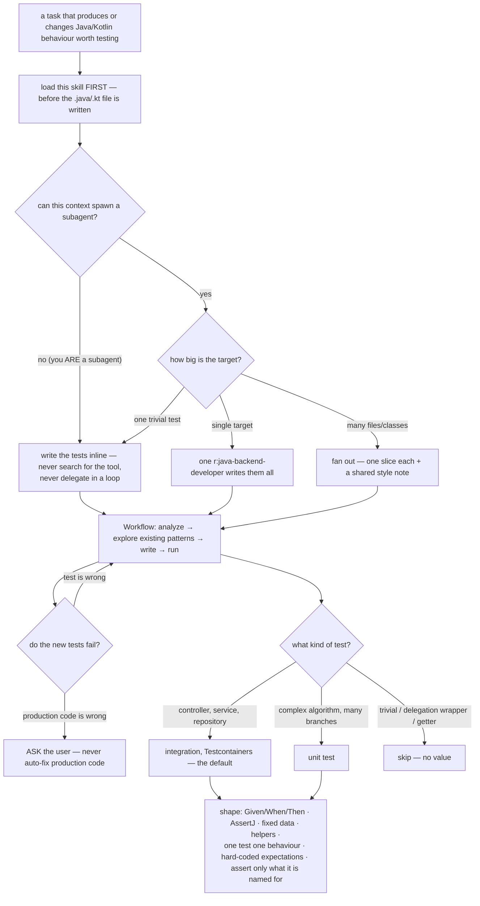

# `tests-write` — behaviour register

`/r:tests-write`: the pack's Java/Kotlin test-writing policy — Given/When/Then, AssertJ, JUnit 5,
integration by default, self-contained tests with hard-coded expectations. It is loaded *before* test
code is written and shapes what someone else's task produces; it owns no pipeline and writes no
outcome of its own.

Format, ID scheme and the meaning of the three trailing fields: [`README.md`](README.md).

## What it decides

## Entries

- **SB-tests-write-001** — The skill is **consulted inside someone else's task** — it shapes tests
  another skill or agent is writing — and therefore **writes no `result` row** through
  `lib/record-run.py`. That is correct rather than a gap to close: it has no boundary to report an
  outcome at, and whatever it influenced belongs to the run that loaded it. Giving it a fabricated
  outcome row would put a number in the store that no question can be asked of, which is worse than
  the gap. The hook still counts its **invocations**, which is the honest measure available and makes
  it one of the most-invoked skills in the pack.
  *States it:* `CLAUDE.md`
  *Enforced by:* `hooks/record-skill-run.py`
  *Tested by:* `lib/tests/stats.test.sh`

- **SB-tests-write-002** — It carries **no** `disable-model-invocation` flag, and the description
  pushes the opposite way: **consult it automatically and proactively, no explicit request needed**,
  for any task that produces or changes Java/Kotlin behaviour worth testing — not just tasks that
  name "tests". **Bias strongly toward triggering.** So it sits in the router's listing budget and
  owes the gate a `trigger` case and a `neighbour-exclusion` case.
  *States it:* `skills/tests-write/SKILL.md`
  *Enforced by:* `skills/tests-write/evals/evals.json`
  *Tested by:* `tools/validate.py`

- **SB-tests-write-003** — The trigger surface is named explicitly: writing, generating or modifying
  test code of any kind (unit, integration, bug-reproduction, refactor, added coverage);
  implementation that should come with tests — a service method, a controller or endpoint, a
  repository, validation, a mapper, business logic; reproducing or fixing a reported bug (**write the
  failing test first**); and refactoring production code that needs a safety-net test.
  *States it:* `skills/tests-write/SKILL.md`
  *Enforced by:* —
  *Tested by:* —

- **SB-tests-write-004** — **It is loaded FIRST** — before writing or editing a `.java`/`.kt` file
  that carries logic, or when asked to implement, build, add, fix or change such code — and it shapes
  the tests from there. Loading it after the code is written is loading it too late to do what it is
  for.
  *States it:* `skills/tests-write/SKILL.md`
  *Enforced by:* —
  *Tested by:* —

- **SB-tests-write-005** — **NOT for:** pure read/explain questions, build/dependency/config-only
  edits, or non-JVM languages. Restructuring existing code behind a behaviour-locking test is
  `code-refactor`'s job — this skill may inform that safety-net test, but the request must not route
  here.
  *States it:* `skills/tests-write/SKILL.md`
  *Enforced by:* `skills/tests-write/evals/evals.json`
  *Tested by:* —

- **SB-tests-write-006** — **The writing is delegated to a dedicated `r:java-backend-developer`
  subagent where that is possible.** Writing tests is context-heavy work — exploring existing
  patterns, reading the code under test, drafting many methods, running them, reading failures — and
  doing it inline crowds out the larger task the tests belong to.
  *States it:* `skills/tests-write/SKILL.md`
  *Enforced by:* —
  *Tested by:* —

- **SB-tests-write-007** — **The delegation gate is asked first, and it is what prevents delegating
  in a loop.** A subagent can only be spawned from a context that has an Agent/Task tool, and a
  subagent cannot spawn another; a context that is itself a subagent — including one spawned to write
  these very tests — has no such tool, **does not go looking for one**, and skips straight to the
  Workflow and writes the tests inline.
  *States it:* `skills/tests-write/SKILL.md`
  *Enforced by:* —
  *Tested by:* —

- **SB-tests-write-008** — Delegation starts with a **light scope pass**: what the target is (a git
  diff, named files, or a bug report) and how many files or classes need tests.
  *States it:* `skills/tests-write/SKILL.md`
  *Enforced by:* —
  *Tested by:* —

- **SB-tests-write-009** — **One subagent by default**; a large target **fans out** — several
  `r:java-backend-developer` subagents in parallel, each owning one slice (one service plus its
  tests), with a shared one-line style note ("match the existing test conventions in `<module>`") so
  the slices stay consistent with each other.
  *States it:* `skills/tests-write/SKILL.md`
  *Enforced by:* —
  *Tested by:* —

- **SB-tests-write-010** — **Every subagent prompt carries three things**: the exact target (files,
  classes or bug to cover); the instruction *"Load the `/r:tests-write` skill and follow it. You are
  the dedicated test-writing subagent — write the tests yourself, do NOT delegate further"*; and any
  project context the caller already knows — base test classes, Testcontainers setup, module path —
  so the subagent does not re-discover it.
  *States it:* `skills/tests-write/SKILL.md`
  *Enforced by:* —
  *Tested by:* —

- **SB-tests-write-011** — When the subagents report back, the caller **relays the result**: which
  tests were added, pass/fail, and any production bug they surfaced.
  *States it:* `skills/tests-write/SKILL.md`
  *Enforced by:* —
  *Tested by:* —

- **SB-tests-write-012** — **For a single trivial test the tests are written inline** — delegating
  would cost more than the work.
  *States it:* `skills/tests-write/SKILL.md`
  *Enforced by:* —
  *Tested by:* —

- **SB-tests-write-013** — The workflow is the same whether delegated or inline: analyze the code to
  test (git diff, specified files, or bug report) → **explore the project's existing test patterns,
  libraries and base classes** → write the tests following these practices *and* the project's
  conventions → run them.
  *States it:* `skills/tests-write/SKILL.md`
  *Enforced by:* —
  *Tested by:* —

- **SB-tests-write-014** — **When a test fails because the production code is incorrect, the user is
  asked whether they want the bug fixed. Production code is never auto-fixed without approval.** The
  task that loaded this skill was about tests; a silent production change is a different task nobody
  asked for.
  *States it:* `skills/tests-write/SKILL.md`
  *Enforced by:* —
  *Tested by:* —

- **SB-tests-write-015** — **Test type is selected from the code type**: REST controllers/endpoints,
  the service layer and the repository layer get **integration** tests (MockMvc/WebTestClient,
  Testcontainers, a real database); complex business logic gets a **unit** test, reserved for
  complicated algorithms with many edge cases; simple or straightforward code is **skipped**, because
  there is no value in testing trivial logic.
  *States it:* `skills/tests-write/SKILL.md`
  *Enforced by:* —
  *Tested by:* —

- **SB-tests-write-016** — **Integration is the default, and complete vertical slices (HTTP →
  business logic → database) are preferred over isolating each class with mocks** — that tests
  behaviour rather than implementation, and survives refactoring.
  *States it:* `skills/tests-write/SKILL.md`
  *Enforced by:* —
  *Tested by:* —

- **SB-tests-write-017** — **Don't mock the integration.** A full Spring context and a real database
  with `@MockitoBean` over every interesting collaborator is a unit test wearing an integration-test
  costume: it passes when the orchestration is broken. **Mock only at true I/O boundaries** —
  third-party HTTP APIs, real LLM calls, the system clock — never internal collaborators between the
  project's own services.
  *States it:* `skills/tests-write/SKILL.md`
  *Enforced by:* —
  *Tested by:* —

- **SB-tests-write-018** — Where a collaborator that **produces persistent state** must be mocked,
  the mock is made a **side-effecting fake** (a `doAnswer` that writes the row the real one would), so
  downstream assertions stay observable and the test can assert on the table state after the action
  rather than only on whether the mock was called.
  *States it:* `skills/tests-write/SKILL.md`
  *Enforced by:* —
  *Tested by:* —

- **SB-tests-write-019** — **Every test has three blocks separated by blank lines: `// given`, `//
  when`, `// then`**, each kept as short as possible by using helper functions.
  *States it:* `skills/tests-write/SKILL.md`
  *Enforced by:* —
  *Tested by:* —

- **SB-tests-write-020** — Variables in equality assertions use the **`actual*` / `expected*`
  prefixes** — it prevents mix-ups between the two sides.
  *States it:* `skills/tests-write/SKILL.md`
  *Enforced by:* —
  *Tested by:* —

- **SB-tests-write-021** — **Fixed data, never random.** Random UUIDs, timestamps or amounts make
  failures hard to reproduce, so values are deterministic and written out
  (`Instant.ofEpochSecond(1550000001)`, a literal UUID).
  *States it:* `skills/tests-write/SKILL.md`
  *Enforced by:* —
  *Tested by:* —

- **SB-tests-write-022** — **Helper functions are used heavily** — they are the primary mechanism for
  keeping tests concise. Everything relevant to the test is parameterized, non-critical values get
  reasonable defaults, and varargs are used for inserting multiple items.
  *States it:* `skills/tests-write/SKILL.md`
  *Enforced by:* —
  *Tested by:* —

- **SB-tests-write-023** — **KISS > DRY.** Values used once or twice are not extracted into
  variables: inline values are shorter and easier to trace in a failure message.
  *States it:* `skills/tests-write/SKILL.md`
  *Enforced by:* —
  *Tested by:* —

- **SB-tests-write-024** — **One test, one behaviour. An existing test is never extended to cover an
  additional case** — a separate, descriptively named method is created instead, so each documents one
  behaviour and a failure is easy to diagnose.
  *States it:* `skills/tests-write/SKILL.md`
  *Enforced by:* —
  *Tested by:* —

- **SB-tests-write-025** — **Assert only what is relevant.** Each test checks only the behaviour it is
  named for and skips assertions already verified elsewhere: one mapping test asserts all fields;
  filtering tests check only IDs; an edge-case test checks only the specific calculated value.
  *States it:* `skills/tests-write/SKILL.md`
  *Enforced by:* —
  *Tested by:* —

- **SB-tests-write-026** — **Tests are self-contained, and helpers reveal all the parameters that
  matter** — `createProduct("1", "Office")` beside `requestProductsByCategory("Office")` — so a reader
  never has to jump to a helper definition to see the relationship between the data and the query.
  *States it:* `skills/tests-write/SKILL.md`
  *Enforced by:* —
  *Tested by:* —

- **SB-tests-write-027** — **No shared setup for test data.** All test data stays in the test method;
  insertions are not moved to `@Before`/`@BeforeEach`. Helpers make that setup a concise one-liner
  instead.
  *States it:* `skills/tests-write/SKILL.md`
  *Enforced by:* —
  *Tested by:* —

- **SB-tests-write-028** — **Composition over inheritance for fixtures.** No deep test class
  hierarchies; small fixture components (a database fixture, a `MockWebServer`) are composed in the
  test class instead.
  *States it:* `skills/tests-write/SKILL.md`
  *Enforced by:* —
  *Tested by:* —

- **SB-tests-write-029** — **Never reuse production code to compute an expectation.** Output is
  compared against a hard-coded expected value, because reused production mapping logic cannot catch
  its own bugs.
  *States it:* `skills/tests-write/SKILL.md`
  *Enforced by:* —
  *Tested by:* —

- **SB-tests-write-030** — **Minimize test logic.** A test is an input/output comparison: no loops,
  no conditionals, no complex assertion chains — AssertJ's rich API carries that weight instead.
  *States it:* `skills/tests-write/SKILL.md`
  *Enforced by:* —
  *Tested by:* —

- **SB-tests-write-031** — **AssertJ over JUnit assertions, and `assertTrue`/`assertFalse` are never
  used** — they produce cryptic output, where `assertThat(list).contains(x)` and `.hasSize(5)` name
  what failed.
  *States it:* `skills/tests-write/SKILL.md`
  *Enforced by:* —
  *Tested by:* —

- **SB-tests-write-032** — **Assertions on the same subject are chained**, not repeated one
  `assertThat(x)` per line: the failure messages stay as clear, and the test reads as one statement
  about one thing.
  *States it:* `skills/tests-write/SKILL.md`
  *Enforced by:* —
  *Tested by:* —

- **SB-tests-write-033** — `references/assertj-patterns.md` is the comprehensive catalog the skill
  defers to for the patterns themselves — object equality, collections, field extraction, element
  assertions, ignoring fields, strings, exceptions (`assertThatThrownBy` / `assertThatCode`),
  `Optional` and `Map`.
  *States it:* `skills/tests-write/references/assertj-patterns.md`
  *Enforced by:* —
  *Tested by:* —

- **SB-tests-write-034** — JUnit 5 features are used where they earn it: **`@Nested`** to group tests
  by the operation under test, **`@ParameterizedTest`** with `@CsvSource` for variations of one
  behaviour, and **`@DisplayName`** for readability.
  *States it:* `skills/tests-write/SKILL.md`
  *Enforced by:* —
  *Tested by:* —

- **SB-tests-write-035** — HTTP dependencies are mocked with **MockWebServer or WireMock**, enqueuing
  the response the test needs rather than stubbing the client.
  *States it:* `skills/tests-write/SKILL.md`
  *Enforced by:* —
  *Tested by:* —

- **SB-tests-write-036** — **`Thread.sleep()` is never used for async testing. Awaitility is** —
  `await().atMost(...).pollInterval(...).untilAsserted(...)` — so the test waits for the condition
  rather than for a guessed duration.
  *States it:* `skills/tests-write/SKILL.md`
  *Enforced by:* —
  *Tested by:* —

- **SB-tests-write-037** — **Mockito verifies behaviour, not just calls.** The verify-only test —
  stub, call, `verify(mock).something()`, stop — passes even if the method becomes a no-op in
  production, because it never checks what the user or the next layer sees, and it breaks on every
  refactor because it asserts *how* the code works rather than *what* it does. Assertions go on
  observable outcomes: return values, persisted rows, exceptions thrown, messages sent.
  *States it:* `skills/tests-write/SKILL.md`
  *Enforced by:* —
  *Tested by:* —

- **SB-tests-write-038** — **`verify` is used only where the side effect *is* the behaviour** (a
  notification dispatch), and then combined with `assertThat` on state and return values — verify-and-
  assert, never verify-only.
  *States it:* `skills/tests-write/SKILL.md`
  *Enforced by:* —
  *Tested by:* —

- **SB-tests-write-039** — **Capture, don't `any()`.** Where `verify` is needed, an `ArgumentCaptor`
  is preferred: capturing documents what the production code did, where `any()` passes even when the
  wrong object was forwarded.
  *States it:* `skills/tests-write/SKILL.md`
  *Enforced by:* —
  *Tested by:* —

- **SB-tests-write-040** — **A "did nothing" test must verify the *full* set of side effects did not
  occur**, not one of them — otherwise a future bug that swaps which side effect fires still passes.
  *States it:* `skills/tests-write/SKILL.md`
  *Enforced by:* —
  *Tested by:* —

- **SB-tests-write-041** — Matchers are used only when at least one argument is a matcher: concrete
  values are **not** wrapped in `eq(...)` where nothing requires it.
  *States it:* `skills/tests-write/SKILL.md`
  *Enforced by:* —
  *Tested by:* —

- **SB-tests-write-042** — **What NOT to test:** every possible input combination; trivial
  getters/setters; framework behaviour (Spring, JPA internals); third-party library internals; and
  **pure delegation wrappers** — a one-line `delegate.x()` with no observable side effect has nothing
  meaningful to verify, so either the wrapper is deleted (often dead code or a port-fulfillment
  vestige) or, if it is load-bearing, an integration test against the real delegate proves the
  end-to-end behaviour. A test asserting `verify(delegate).x()` only proves the wrapper compiles.
  *States it:* `skills/tests-write/SKILL.md`
  *Enforced by:* —
  *Tested by:* —

- **SB-tests-write-043** — **Reflection in tests is a smell.** A test reaching for
  `ReflectionTestUtils.setField(...)` or a custom reflection helper means the entity is missing a
  test-friendly factory or builder — the fix goes in the entity (`@Builder`, `@Setter`, a
  `withId(...)` helper), not in the test. Reflection couples tests to internal field names, and a
  rename breaks them silently.
  *States it:* `skills/tests-write/SKILL.md`
  *Enforced by:* —
  *Tested by:* —

- **SB-tests-write-044** — **Test count is kept minimal — quality over quantity**: the happy path, one
  or two important edge cases, and error handling for critical failures only.
  *States it:* `skills/tests-write/SKILL.md`
  *Enforced by:* —
  *Tested by:* —

## Prose-only behaviours

Held up by wording alone, which is all but two entries. The skill ships **no script and no test suite
of its own** — correctly, since it produces no artifact to check — so the delegation gate, the
"never auto-fix production code" rule and every test-shape rule below it survive exactly as long as
the prose keeps saying them. The two that are not prose-only are about the skill's place in the pack:
the deliberately absent `result` row, and the routing the eval cases pin.

41 of 44: SB-tests-write-003, SB-tests-write-004, and SB-tests-write-006 through SB-tests-write-044
inclusive — every entry except SB-tests-write-001, SB-tests-write-002 and SB-tests-write-005, the
last of which is pinned by its neighbour-exclusion eval case.

**41 of 44 entries are prose-only.**
