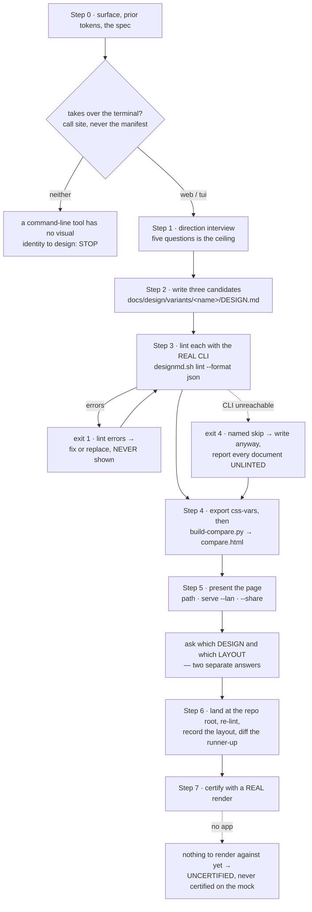

# `ui-prototype` — behaviour register

`/r:ui-prototype`: propose three candidate visual identities as real `DESIGN.md` files, lint each
with the REAL CLI, build ONE prototype page where a layout picker and a design picker are
independent choices, land the pick as the project's root `DESIGN.md`, and certify it with a REAL
render. It covers a web GUI and a terminal UI. The deliverable is a **linted document**, not a
picture: the picture exists so a person can choose, and is thrown away.

Format, ID scheme and the meaning of the three trailing fields: [`README.md`](README.md).

*Tested by:* cites an `evals.json` only where `tools/run-evals.py` scores the case mechanically —
a `trigger` or `neighbour-exclusion` case. Every case this skill owns is a `behaviour` case (it
sets `disable-model-invocation`, so no prompt can route to it), and the runner names those as
skips rather than failures; citing one would overstate exactly the coverage this register exists
to measure.

## Flow

## What the skill is, and what it is not

- **SB-ui-prototype-001** — The skill carries `disable-model-invocation: true` and **never
  self-triggers**. It writes a root `DESIGN.md` and a directory of rejected candidates, and
  neither is something anyone wants arrived at by inference: it is invoked deliberately or not at
  all.
  *States it:* `skills/ui-prototype/SKILL.md`
  *Enforced by:* `skills/ui-prototype/SKILL.md`
  *Tested by:* `tools/validate.py`

- **SB-ui-prototype-002** — **The deliverable is a linted document, not a picture.** The
  comparison page exists so a person can choose between the three, and is thrown away afterwards.
  *States it:* `skills/ui-prototype/SKILL.md`
  *Enforced by:* —
  *Tested by:* —

- **SB-ui-prototype-003** — Three files look alike and share nothing, and confusing them is the
  failure this skill is most likely to cause: root `DESIGN.md` is the **visual identity** and is
  written here; `docs/<topic>/tech-design.md` is the **build contracts** and is written by
  `/r:spec-design`; `ui-design.md` is the project's own design-system write-up. **Never merge
  them, and never cite one as evidence about another.** `/r:spec-design` Step 1 reads a root
  `DESIGN.md` as a requirements document, and a token file is not that.
  *States it:* `skills/ui-prototype/SKILL.md`
  *Enforced by:* —
  *Tested by:* —

- **SB-ui-prototype-004** — It writes no application code, never restyles existing components and
  never edits the project's CSS. Building against the document is `/r:task-run`'s job.
  *States it:* `skills/ui-prototype/SKILL.md`
  *Enforced by:* —
  *Tested by:* —

- **SB-ui-prototype-005** — It generates no test skill and performs no deploys. It **borrows**
  `/r:test-app-create`'s detection guide and terminal driver as instruments.
  *States it:* `skills/ui-prototype/SKILL.md`
  *Enforced by:* —
  *Tested by:* —

- **SB-ui-prototype-006** — It is not the bundled `design` canvas skill (multi-artboard `.dc.html`
  with a visual editor) and not the user's `ui-design-doc` skill, which documents a design system
  that already exists in code — opposite directions. `--share` publishes a plain page, never a
  canvas.
  *States it:* `skills/ui-prototype/SKILL.md`
  *Enforced by:* —
  *Tested by:* —

## Step 0 — surface and prior art

- **SB-ui-prototype-007** — **`web` or `tui` is decided before anything else.** The discriminator
  is whether the program takes over the terminal — `?1049h`, `EnterAlternateScreen`,
  `curses.wrapper(`, `full_screen=True`, `tea.WithAltScreen()` — at the **call site**, never a
  dependency in the manifest: `ratatui` sits in dev-dependencies, `rich` prints coloured tables
  from a plain CLI, `prompt_toolkit`'s default `PromptSession` is a readline replacement.
  *States it:* `skills/ui-prototype/SKILL.md`
  *Enforced by:* —
  *Tested by:* —

- **SB-ui-prototype-008** — The full probe ladder is **read from**
  `${CLAUDE_PLUGIN_ROOT}/skills/test-app-create/references/detection-guide.md` Stage B rather than
  copied here, so the two cannot drift.
  *States it:* `skills/ui-prototype/SKILL.md`
  *Enforced by:* `skills/test-app-create/references/detection-guide.md`
  *Tested by:* —

- **SB-ui-prototype-009** — **A command-line tool with no full-screen UI has no visual identity to
  design: say so and stop.** It does not invent a palette for a program that renders no screen.
  *States it:* `skills/ui-prototype/SKILL.md`
  *Enforced by:* —
  *Tested by:* —

- **SB-ui-prototype-010** — Tokens the project already has — CSS custom properties, a `theme.*`
  file, a Tailwind config, an existing `ui-design.md` — make **one of the three candidates what
  the project already has, made explicit**. Often the right answer, and never the one a generator
  proposes unprompted.
  *States it:* `skills/ui-prototype/SKILL.md`
  *Enforced by:* —
  *Tested by:* —

- **SB-ui-prototype-011** — Where `docs/<topic>/spec.html` exists, the audience and architectural
  characteristics are **derived from it rather than re-asked**: two interviews produce two answers
  to one question and nothing reconciles them.
  *States it:* `skills/ui-prototype/SKILL.md`
  *Enforced by:* —
  *Tested by:* —

## Step 1 — the direction interview

- **SB-ui-prototype-012** — The interview is **short and stays short** — five questions is the
  ceiling, three is common — and must never grow toward `/r:spec-brainstorm`, which interviews to
  decide what to build and takes as long as that needs.
  *States it:* `skills/ui-prototype/references/interview-questions.md`
  *Enforced by:* —
  *Tested by:* —

- **SB-ui-prototype-013** — The five questions and where their answers land: what it is and who
  opens it → **Overview**, near-verbatim in the user's own words; what it should feel like (push
  for a pair of adjectives and a thing it should *not* feel like) → **Overview**; anything fixed
  (brand colour, licensed typeface, accessibility floor) → token values and a line in **Do's and
  Don'ts**; dense or spacious → **Layout** and the type scale; and, **terminal only**, which
  terminals must it work in → `terminal.colorDepth` and a constraint on **Colors**.
  *States it:* `skills/ui-prototype/references/interview-questions.md`
  *Enforced by:* —
  *Tested by:* —

- **SB-ui-prototype-014** — Four things are **never asked**: which colours they want (they name
  one and three candidates become one candidate in three shades — ask for the feeling, propose the
  colour); anything already in the spec; anything already in the code; and permission to proceed —
  write the three, then show them.
  *States it:* `skills/ui-prototype/references/interview-questions.md`
  *Enforced by:* —
  *Tested by:* —

- **SB-ui-prototype-015** — The colour-depth question asks for the **least capable target**, not
  the one they develop in. It is the one question with a wrong answer that ruins the rest:
  authored at truecolor and run at 16, a certified contrast ratio stops being true.
  *States it:* `skills/ui-prototype/references/interview-questions.md`
  *Enforced by:* `skills/ui-prototype/scripts/build-compare.py`
  *Tested by:* `skills/ui-prototype/tests/build-compare.test.sh`

- **SB-ui-prototype-016** — "No opinion" is an answer: say you are choosing, make the three
  genuinely different so the choice is a real one, and let the comparison page do the asking.
  *States it:* `skills/ui-prototype/references/interview-questions.md`
  *Enforced by:* —
  *Tested by:* —

## Step 2 — the three candidates

- **SB-ui-prototype-017** — Three candidates, one directory each under `docs/design/variants/`,
  each holding a full `DESIGN.md`.
  *States it:* `skills/ui-prototype/SKILL.md`
  *Enforced by:* —
  *Tested by:* —

- **SB-ui-prototype-018** — The section order is **fixed and all `##`**: Overview, Colors,
  Typography, Layout, Elevation & Depth, Shapes, Components, Do's and Don'ts. A section that does
  not apply goes in `omitted:` rather than being silently dropped; a **duplicate section heading
  rejects the file**.
  *States it:* `skills/ui-prototype/references/format-spec.md`
  *Enforced by:* `skills/ui-prototype/scripts/designmd.sh`
  *Tested by:* —

- **SB-ui-prototype-019** — At minimum a `primary` colour must exist — `missing-primary` is one of
  the linter's rules.
  *States it:* `skills/ui-prototype/SKILL.md`
  *Enforced by:* `skills/ui-prototype/scripts/designmd.sh`
  *Tested by:* —

- **SB-ui-prototype-020** — **Make them genuinely different.** Three variations on one hue is not
  a choice: vary the register the Overview section is about, and let colour follow from it.
  *States it:* `skills/ui-prototype/SKILL.md`
  *Enforced by:* —
  *Tested by:* —

- **SB-ui-prototype-021** — **Layout is never written into a `DESIGN.md`.** The format has no key
  for how a screen is arranged and inventing one trips the linter's `unknown-key` rule.
  Arrangement is the comparison page's *other* axis: a candidate says what the app looks like, a
  skeleton says how it is laid out, and the person picking chooses one of each.
  *States it:* `skills/ui-prototype/SKILL.md`
  *Enforced by:* —
  *Tested by:* —

- **SB-ui-prototype-022** — `references/format-spec.md` is the **offline fallback, not the source
  of truth** — `designmd.sh spec` prints the real specification. It exists because `spec` needs
  the CLI too, and the moment the schema is most needed (writing the three candidates, before any
  lint call) is exactly the moment it may be unavailable.
  *States it:* `skills/ui-prototype/references/format-spec.md`
  *Enforced by:* —
  *Tested by:* —

- **SB-ui-prototype-023** — The tokens are **normative and the prose is context**. Evocative names
  are allowed in prose as long as they map onto the systematic token names.
  *States it:* `skills/ui-prototype/references/format-spec.md`
  *Enforced by:* —
  *Tested by:* —

- **SB-ui-prototype-024** — Custom top-level keys are allowed: `unknown-key` only warns within
  edit distance 2 of a schema key — i.e. when a key looks like a typo of one — so an unrelated
  extension key such as `terminal` is silent.
  *States it:* `skills/ui-prototype/references/format-spec.md`
  *Enforced by:* `skills/ui-prototype/scripts/designmd.sh`
  *Tested by:* —

## The terminal mapping

- **SB-ui-prototype-025** — On a terminal surface `references/tui-mapping.md` is read **first**.
  Every accommodation in it is something the format already supports, forced by the surface rather
  than chosen.
  *States it:* `skills/ui-prototype/SKILL.md`
  *Enforced by:* —
  *Tested by:* —

- **SB-ui-prototype-026** — **Typography and rounding are declared `omitted:` with real reasons** —
  the terminal owns the font, cells have no radius. Declared rather than left out, because an
  absent section and a section that does not apply look identical on disk and the linter warns
  about the first; the reason is what tells the next reader that nobody forgot. Weight, inverse,
  dim and underline are still ours and go in the Typography prose or in `components`.
  *States it:* `skills/ui-prototype/references/tui-mapping.md`
  *Enforced by:* `skills/ui-prototype/scripts/designmd.sh`
  *Tested by:* —

- **SB-ui-prototype-027** — **Spacing is in cells** — bare numbers, which the schema admits. Never
  `16px`: a pixel value in a terminal document is a number nothing can act on, and it invites a
  renderer to divide by a cell width nobody declared.
  *States it:* `skills/ui-prototype/references/tui-mapping.md`
  *Enforced by:* —
  *Tested by:* —

- **SB-ui-prototype-028** — **`terminal.colorDepth` (`16 | 256 | truecolor`) is required and
  machine-readable**, not prose, because `build-compare.py` reads it to decide what to paint. It
  cannot be optional: the linter computes WCAG contrast on the values as written, and a truecolor
  pair certified at 4.5:1 is painted as the nearest of the 16 system colours on a terminal that
  has only those — where the nearest of 16 to two nearly-identical hexes is frequently *the same
  colour*.
  *States it:* `skills/ui-prototype/references/tui-mapping.md`
  *Enforced by:* `skills/ui-prototype/scripts/build-compare.py`
  *Tested by:* `skills/ui-prototype/tests/build-compare.test.sh`

- **SB-ui-prototype-029** — On `16`, hue must not carry meaning alone: there are eight usable
  colours and their bright variants, so state (selected, error, disabled) is carried by inverse,
  bold and dim at least as much as by colour.
  *States it:* `skills/ui-prototype/references/tui-mapping.md`
  *Enforced by:* —
  *Tested by:* —

- **SB-ui-prototype-030** — A terminal component has no padding-and-radius to specify; it has
  **states**, which map onto the format's component-variant convention (`row`, `row-selected`,
  `row-error`, `border`). The box-drawing set is named in `## Shapes` prose — the terminal's
  answer to a corner radius.
  *States it:* `skills/ui-prototype/references/tui-mapping.md`
  *Enforced by:* —
  *Tested by:* —

## Step 3 — lint with the REAL CLI

- **SB-ui-prototype-031** — Every candidate is linted through
  `${CLAUDE_SKILL_DIR}/scripts/designmd.sh lint <file> --format json` — the REAL `@google/design.md`
  CLI, which is what makes a proposed identity real rather than asserted. **Nothing here may be
  substituted by a prose imitation:** the linter computes WCAG contrast ratios and checks a
  missing primary palette, section order, broken token references and orphaned tokens, and a model
  cannot do either by reading its own output.
  *States it:* `skills/ui-prototype/SKILL.md`
  *Enforced by:* `skills/ui-prototype/scripts/designmd.sh`
  *Tested by:* `skills/ui-prototype/tests/designmd.test.sh`

- **SB-ui-prototype-032** — **A candidate with lint errors is never shown.** Fix it or replace it.
  *States it:* `skills/ui-prototype/SKILL.md`
  *Enforced by:* —
  *Tested by:* —

- **SB-ui-prototype-033** — **Warnings are surfaced with the candidate, never hidden** — a
  contrast warning is exactly what a person choosing a palette needs to see. A warning does not
  change the CLI's exit code, so `summary` is read rather than the code alone.
  *States it:* `skills/ui-prototype/references/format-spec.md`
  *Enforced by:* `skills/ui-prototype/scripts/designmd.sh`
  *Tested by:* `skills/ui-prototype/tests/designmd.test.sh`

- **SB-ui-prototype-034** — The wrapper's exit codes are its contract: `0` ran clean · `1` the
  file has lint **errors**, a real result passed through · `2` unreadable, the CLI's own code
  passed through · `4` the CLI could not run, with `DESIGNMD SKIPPED:` as the first stdout line ·
  `64` usage · anything else is the wrapper itself failing, and its stdout is **not** a report.
  *States it:* `skills/ui-prototype/SKILL.md`
  *Enforced by:* `skills/ui-prototype/scripts/designmd.sh`
  *Tested by:* `skills/ui-prototype/tests/designmd.test.sh`

- **SB-ui-prototype-035** — **Exit `3` is RESERVED and never returned**, so a caller that branches
  on it fails loud instead of mistaking a skip for something else.
  *States it:* `skills/ui-prototype/scripts/designmd.sh`
  *Enforced by:* `skills/ui-prototype/scripts/designmd.sh`
  *Tested by:* —

- **SB-ui-prototype-036** — **Exit `4` is a named skip and does not stop the run**: the documents
  are written anyway, and every one of them is reported as **UNLINTED** with the reason. None is
  called clean. The model does not substitute its own read of the tokens for the linter's —
  contrast ratios are computed, not judged.
  *States it:* `skills/ui-prototype/SKILL.md`
  *Enforced by:* `skills/ui-prototype/scripts/designmd.sh`
  *Tested by:* `skills/ui-prototype/tests/designmd.test.sh`

- **SB-ui-prototype-037** — **The skip exits non-zero, unlike the Codex wrapper's skip.** Codex is
  an optional reviewer, so a missing plugin must not read as a hard error; this tool is not
  optional and there is no degraded path that continues "just less thoroughly". A caller must be
  UNABLE to walk past the skip without noticing.
  *States it:* `skills/ui-prototype/scripts/designmd.sh`
  *Enforced by:* `skills/ui-prototype/scripts/designmd.sh`
  *Tested by:* `skills/ui-prototype/tests/designmd.test.sh`

- **SB-ui-prototype-038** — The `DESIGNMD SKIPPED:` marker line stays the detection mechanism
  regardless of the code, because "npx could not fetch" and "the CLI rejected the file" are
  different failures an exit code alone cannot tell apart. It is the **first stdout line**.
  *States it:* `skills/ui-prototype/scripts/designmd.sh`
  *Enforced by:* `skills/ui-prototype/scripts/designmd.sh`
  *Tested by:* `skills/ui-prototype/tests/designmd.test.sh`

- **SB-ui-prototype-039** — The wrapper demands **positive evidence, never the absence of an
  error**: `lint --format json` must produce JSON carrying a `summary` object, `lint --format
  text` non-empty output, `export --format css-vars` at least one `--…:` custom-property
  declaration, and `diff`/`spec` non-empty output. Anything else exits `5`. An empty response
  under a zero exit is the shape of "no findings" — an invalid `DESIGN.md` banked as clean, then
  rendered, picked and committed — and an empty export becomes a blank `<style>` block that
  renders every candidate identically.
  *States it:* `skills/ui-prototype/scripts/designmd.sh`
  *Enforced by:* `skills/ui-prototype/scripts/designmd.sh`
  *Tested by:* `skills/ui-prototype/tests/designmd.test.sh`

- **SB-ui-prototype-040** — The package is **pinned** at `@google/design.md@0.4.0`. The format
  declares version "alpha" and the CLI is 0.x, so an unpinned `npx` picks up a breaking minor and
  changes what lints clean — which reads as "the palette got worse", never as "the tool changed".
  *States it:* `skills/ui-prototype/scripts/designmd.sh`
  *Enforced by:* `skills/ui-prototype/scripts/designmd.sh`
  *Tested by:* `skills/ui-prototype/tests/designmd.test.sh`

- **SB-ui-prototype-041** — Resolution order is a project-local `./node_modules/.bin/design.md`,
  then a global `design.md`, then `designmd`, then `npx` (which needs `node` too). The first two
  make a project that vendored the CLI work offline; npx is the fallback that needs the network
  once.
  *States it:* `skills/ui-prototype/scripts/designmd.sh`
  *Enforced by:* `skills/ui-prototype/scripts/designmd.sh`
  *Tested by:* `skills/ui-prototype/tests/designmd.test.sh`

- **SB-ui-prototype-042** — An npx resolution or fetch failure is detected by **the stderr text**
  (`ENOTFOUND`, `ETIMEDOUT`, `registry`, `npm error`, …) with nothing usable on stdout, and
  becomes a SKIP rather than a verdict on the file — the two are the same shape otherwise.
  *States it:* `skills/ui-prototype/scripts/designmd.sh`
  *Enforced by:* `skills/ui-prototype/scripts/designmd.sh`
  *Tested by:* `skills/ui-prototype/tests/designmd.test.sh`

- **SB-ui-prototype-043** — `-h`/`--help`/`help` is handled **before anything resolves**, so
  probing the wrapper never starts a package fetch; an unknown subcommand exits `64` and never
  reaches the CLI. Only `lint`, `export`, `diff` and `spec` pass through.
  *States it:* `skills/ui-prototype/scripts/designmd.sh`
  *Enforced by:* `skills/ui-prototype/scripts/designmd.sh`
  *Tested by:* `skills/ui-prototype/tests/designmd.test.sh`

- **SB-ui-prototype-044** — **No retry loop.** The Codex wrapper retries because it has a
  documented transient class; this is a synchronous local CLI invocation with none, and a retry
  would only turn a real "no network" into an intermittent one.
  *States it:* `skills/ui-prototype/scripts/designmd.sh`
  *Enforced by:* `skills/ui-prototype/scripts/designmd.sh`
  *Tested by:* —

## Step 4 — the one prototype page

- **SB-ui-prototype-045** — Each candidate is exported with `designmd.sh export … --format
  css-vars` to `docs/design/variants/<name>/vars.css`, and `build-compare.py` is then given one
  `--variant "<Name>=<vars.css>"` per candidate plus `--out docs/design/variants/compare.html` and
  `--surface web|tui`.
  *States it:* `skills/ui-prototype/SKILL.md`
  *Enforced by:* `skills/ui-prototype/scripts/build-compare.py`
  *Tested by:* `skills/ui-prototype/tests/build-compare.test.sh`

- **SB-ui-prototype-046** — **One page, two independent choices.** A layout picker and a design
  picker sit above a single stage; every pair of the two axes is reachable without a reload,
  because they are independent selectors over one stage rather than pre-rendered panels.
  *States it:* `skills/ui-prototype/SKILL.md`
  *Enforced by:* `skills/ui-prototype/scripts/build-compare.py`
  *Tested by:* `skills/ui-prototype/tests/build-compare.test.sh`

- **SB-ui-prototype-047** — **Switching is CSS only** — `:has()` over two radio groups — and the
  page carries **no `<script>` at all**. The page has to survive `file://` and a published
  artifact, and a comparison with behaviour in it is a comparison that can break.
  *States it:* `skills/ui-prototype/scripts/build-compare.py`
  *Enforced by:* `skills/ui-prototype/scripts/build-compare.py`
  *Tested by:* `skills/ui-prototype/tests/build-compare.test.sh`

- **SB-ui-prototype-048** — **The CSS is generated, never hand-written.** A design on the page is
  nothing but that candidate's `export --format css-vars` output applied to the stage, which is
  what makes the page and the documents unable to disagree — one IS the other. A mock styled by
  hand drifts from the tokens the moment either is edited, and nothing downstream re-reads the
  page to catch it.
  *States it:* `skills/ui-prototype/SKILL.md`
  *Enforced by:* `skills/ui-prototype/scripts/build-compare.py`
  *Tested by:* `skills/ui-prototype/tests/build-compare.test.sh`

- **SB-ui-prototype-049** — Three skeletons ship per surface and come in by default — web:
  sidebar, top nav, split master-detail; terminal: single pane, sidebar, three pane — and
  `--layout "<Name>=<path>"` (repeatable) **replaces** that set when a project's real screens are
  worth drawing instead.
  *States it:* `skills/ui-prototype/SKILL.md`
  *Enforced by:* `skills/ui-prototype/scripts/build-compare.py`
  *Tested by:* `skills/ui-prototype/tests/build-compare.test.sh`

- **SB-ui-prototype-050** — **A skeleton names no colour, size or font of its own.** Everything it
  paints with comes from the selected design through the `--_*` aliases the script guarantees —
  `--_surface`, `--_text`, `--_primary`, `--_on-primary`, `--_border`, `--_radius`, `--_gap`,
  `--_pad`. **A fallback IS a hardcoded colour**, and specifically the one the design picker
  cannot override, so the resolution happens once in the script and every alias is always emitted.
  *States it:* `skills/ui-prototype/SKILL.md`
  *Enforced by:* `skills/ui-prototype/scripts/build-compare.py`
  *Tested by:* `skills/ui-prototype/tests/build-compare.test.sh`

- **SB-ui-prototype-051** — A layout that hardcodes a colour anyway is **named on the page and on
  stderr**, never silently shipped.
  *States it:* `skills/ui-prototype/SKILL.md`
  *Enforced by:* `skills/ui-prototype/scripts/build-compare.py`
  *Tested by:* `skills/ui-prototype/tests/build-compare.test.sh`

- **SB-ui-prototype-052** — **A variant whose token file is missing, empty, or carries no custom
  properties is an ERROR (exit `2`), never a dropped column.** Three candidates asked for and two
  rendered, presented as the answer, is a comparison nobody can see the hole in; and an empty
  token set renders that candidate identically to every other one, which is a page showing three
  of the same thing and calling them choices.
  *States it:* `skills/ui-prototype/scripts/build-compare.py`
  *Enforced by:* `skills/ui-prototype/scripts/build-compare.py`
  *Tested by:* `skills/ui-prototype/tests/build-compare.test.sh`

- **SB-ui-prototype-053** — **A layout skeleton that is missing, empty, or carries CSS but no
  markup is the same error for the same reason** — a silently dropped option is a choice nobody
  was offered.
  *States it:* `skills/ui-prototype/scripts/build-compare.py`
  *Enforced by:* `skills/ui-prototype/scripts/build-compare.py`
  *Tested by:* `skills/ui-prototype/tests/build-compare.test.sh`

- **SB-ui-prototype-054** — Both surfaces render as HTML here: a terminal frame is a grid of
  styled cells in a `<pre>`, so **choosing needs no tmux and no browser**.
  *States it:* `skills/ui-prototype/SKILL.md`
  *Enforced by:* `skills/ui-prototype/scripts/build-compare.py`
  *Tested by:* `skills/ui-prototype/tests/build-compare.test.sh`

- **SB-ui-prototype-055** — In a terminal frame `@` toggles the accent span, so a highlight can
  cover one pane of a line rather than the whole row — what a selected item in a sidebar actually
  looks like. **An unpaired `@` on a line is an error (exit `2`)**, because it would paint the
  rest of the frame as selected.
  *States it:* `skills/ui-prototype/SKILL.md`
  *Enforced by:* `skills/ui-prototype/scripts/build-compare.py`
  *Tested by:* `skills/ui-prototype/tests/build-compare.test.sh`

- **SB-ui-prototype-056** — On a terminal surface `--depth` is passed matching the document's
  `terminal.colorDepth`, and **every colour is quantized to it before it reaches the page** —
  against the real xterm ramp (16 system colours, the 6×6×6 cube, the 24-step grey ramp), not an
  approximation, because the whole point is showing what the terminal will actually paint.
  Showing the authored value would sell a palette that cannot exist on the target.
  *States it:* `skills/ui-prototype/SKILL.md`
  *Enforced by:* `skills/ui-prototype/scripts/build-compare.py`
  *Tested by:* `skills/ui-prototype/tests/build-compare.test.sh`

- **SB-ui-prototype-057** — **A web page is never quantized** — the browser has the full range —
  so `--depth` is ignored on `--surface web`.
  *States it:* `skills/ui-prototype/scripts/build-compare.py`
  *Enforced by:* `skills/ui-prototype/scripts/build-compare.py`
  *Tested by:* `skills/ui-prototype/tests/build-compare.test.sh`

- **SB-ui-prototype-058** — **Only hex is reduced.** A colour written as `oklch()`, `color-mix()`
  or a keyword reaches the page unreduced — a wrong quantization is worse than an unquantized one,
  because it claims to be what the terminal shows — and the build **names it on the page and on
  stderr as unquantized** rather than claiming a depth it did not apply to everything. An all-hex
  palette carries no such warning.
  *States it:* `skills/ui-prototype/SKILL.md`
  *Enforced by:* `skills/ui-prototype/scripts/build-compare.py`
  *Tested by:* `skills/ui-prototype/tests/build-compare.test.sh`

- **SB-ui-prototype-059** — The derived `--_border` is built from the **quantized** accent, not
  the authored one. Alpha-hex is not itself reducible, so deriving it first would smuggle an
  unquantized colour onto a page that says every colour on it is one the terminal can paint.
  *States it:* `skills/ui-prototype/scripts/build-compare.py`
  *Enforced by:* `skills/ui-prototype/scripts/build-compare.py`
  *Tested by:* `skills/ui-prototype/tests/build-compare.test.sh`

- **SB-ui-prototype-060** — `pick_dim` **never falls back to a colour** the way `pick` does: a
  terminal candidate writes spacing in cells — bare numbers — which is not a CSS length, so those
  fall to the default rather than being pasted into a padding rule where `2` would silently mean
  nothing at all.
  *States it:* `skills/ui-prototype/scripts/build-compare.py`
  *Enforced by:* `skills/ui-prototype/scripts/build-compare.py`
  *Tested by:* —

- **SB-ui-prototype-061** — **The page is self-contained** — inlined CSS, no `<link>`, no
  `@import`, no external font or image, no fetch. One property with two reasons rather than two
  rules: it has to survive being opened from `file://`, and a published artifact cannot load
  external resources anyway.
  *States it:* `skills/ui-prototype/scripts/build-compare.py`
  *Enforced by:* `skills/ui-prototype/scripts/build-compare.py`
  *Tested by:* `skills/ui-prototype/tests/build-compare.test.sh`

- **SB-ui-prototype-062** — The page's own chrome uses **the pack's document palette, never a
  candidate's**: styled in one of the palettes it is showing, the frame would compete with the
  thing being judged.
  *States it:* `skills/ui-prototype/scripts/build-compare.py`
  *Enforced by:* `skills/ui-prototype/scripts/build-compare.py`
  *Tested by:* —

- **SB-ui-prototype-063** — The readout names each design's own `DESIGN.md` path and token count
  beside its palette swatches — a page that shows a palette without naming its document leaves
  Step 6 guessing which candidate won.
  *States it:* `skills/ui-prototype/scripts/build-compare.py`
  *Enforced by:* `skills/ui-prototype/scripts/build-compare.py`
  *Tested by:* `skills/ui-prototype/tests/build-compare.test.sh`

- **SB-ui-prototype-064** — `pre.tui` is rendered at `line-height:1`, because a terminal's cells
  are flush and anything above 1 opens gaps between the vertical rules of a box-drawn frame, which
  reads as a broken frame rather than as a mock.
  *States it:* `skills/ui-prototype/scripts/build-compare.py`
  *Enforced by:* `skills/ui-prototype/scripts/build-compare.py`
  *Tested by:* —

- **SB-ui-prototype-065** — `build-compare.py` exit codes: `0` the page was written · `2` a
  variant's token file or a layout skeleton is missing, unreadable or unusable · `64` usage (a
  `--variant`/`--layout` without `Name=path`, an unknown `--surface`, an unknown `--depth`, a
  missing `--out`, or no variants at all).
  *States it:* `skills/ui-prototype/scripts/build-compare.py`
  *Enforced by:* `skills/ui-prototype/scripts/build-compare.py`
  *Tested by:* `skills/ui-prototype/tests/build-compare.test.sh`

- **SB-ui-prototype-066** — The comparison mock is **good enough to choose with and is not
  proof**: it can tell three palettes apart, catch an unreadable one, and show whether a palette
  survives being cut into panes. It cannot tell you the frame fits at 80 columns, that the app's
  renderer emits those attributes, or that the box-drawing characters align in the user's font.
  *States it:* `skills/ui-prototype/references/tui-mapping.md`
  *Enforced by:* —
  *Tested by:* —

## Step 5 — present, serve, share

- **SB-ui-prototype-067** — The page lands at **`docs/design/variants/compare.html`** and the run
  reports that path. It opens from `file://` with no network, and **nothing has left the
  machine**: no publish, no URL, and no offer of one.
  *States it:* `skills/ui-prototype/SKILL.md`
  *Enforced by:* —
  *Tested by:* —

- **SB-ui-prototype-068** — To open it on a phone or a second screen the page is **served on the
  LAN rather than copied around**, through
  `${CLAUDE_PLUGIN_ROOT}/skills/page-serve/scripts/serve.sh start … --lan` — reached as a script
  because `/r:page-serve` sets `disable-model-invocation` and cannot be called through the Skill
  tool. `--lan` puts the socket on the local network, which is said in one line **before** running
  it; leaving it off gives a `127.0.0.1`-only server. Either way the URL lands on the clipboard.
  *States it:* `skills/ui-prototype/SKILL.md`
  *Enforced by:* `skills/page-serve/scripts/serve.sh`
  *Tested by:* —

- **SB-ui-prototype-069** — **`--share` publishes that same file as a private Artifact.** The page
  is built once and published **as-is, never regenerated for the shared path** — the published
  bytes are the file on disk.
  *States it:* `skills/ui-prototype/SKILL.md`
  *Enforced by:* —
  *Tested by:* —

- **SB-ui-prototype-070** — The share id lives in the page's own `<!-- ui-prototype:share id=… -->`
  marker, is **read back from the file being overwritten and carried forward**, and a later
  `--share` therefore **updates that Artifact instead of minting a second link**. It travels
  inside the page rather than in a sidecar, because a sidecar recording which URL a page belongs
  to can fall out of sync with the page it describes.
  *States it:* `skills/ui-prototype/SKILL.md`
  *Enforced by:* `skills/ui-prototype/scripts/build-compare.py`
  *Tested by:* `skills/ui-prototype/tests/build-compare.test.sh`

- **SB-ui-prototype-071** — **The flag is the consent.** With `--share`, state as a fact, in one
  line before publishing, that the content is going to claude.ai — then publish. Do not ask a
  question the user already answered by typing the flag.
  *States it:* `skills/ui-prototype/SKILL.md`
  *Enforced by:* —
  *Tested by:* —

- **SB-ui-prototype-072** — Bare `/r:ui-prototype --share` with a `compare.html` already on disk
  is a **republish-only run**: it republishes that page and skips Steps 0–4 rather than
  re-interviewing and regenerating.
  *States it:* `skills/ui-prototype/SKILL.md`
  *Enforced by:* —
  *Tested by:* —

- **SB-ui-prototype-073** — **Which design and which layout are two separate questions**, asked as
  two — someone can want the sidebar with the third palette. A blend of two designs is taken as a
  **fourth candidate through the same gate**, never a hand-merge of two winners.
  *States it:* `skills/ui-prototype/SKILL.md`
  *Enforced by:* —
  *Tested by:* —

## Step 6 — land the pick

- **SB-ui-prototype-074** — The winner is copied to the repo root as `DESIGN.md` and **linted once
  more** there.
  *States it:* `skills/ui-prototype/SKILL.md`
  *Enforced by:* `skills/ui-prototype/scripts/designmd.sh`
  *Tested by:* —

- **SB-ui-prototype-075** — The losers stay in `docs/design/variants/` — they are the record of
  what was turned down.
  *States it:* `skills/ui-prototype/SKILL.md`
  *Enforced by:* —
  *Tested by:* —

- **SB-ui-prototype-076** — **The chosen layout is recorded as one sentence in the Overview
  section**, naming the skeleton. The format has no key for arrangement and inventing one fails
  the linter, so prose is where it goes — and a decision nobody wrote down is one the first build
  re-litigates from scratch.
  *States it:* `skills/ui-prototype/SKILL.md`
  *Enforced by:* —
  *Tested by:* —

- **SB-ui-prototype-077** — `designmd.sh diff DESIGN.md <runner-up>` is run and **the delta is
  reported**: a decision recorded as a difference outlives one recorded as a preference.
  *States it:* `skills/ui-prototype/SKILL.md`
  *Enforced by:* `skills/ui-prototype/scripts/designmd.sh`
  *Tested by:* —

## Step 7 — certify with a REAL render

- **SB-ui-prototype-078** — **The HTML comparison decided the direction and cannot certify it** —
  it is a simulation, and it looks right whether or not the real thing does. **What must never
  happen is the comparison mock being described as the certifying render.**
  *States it:* `skills/ui-prototype/SKILL.md`
  *Enforced by:* —
  *Tested by:* —

- **SB-ui-prototype-079** — On `web`, certification is the `agent-browser` skill against the
  running app or a static render of the page, at **three viewports**.
  *States it:* `skills/ui-prototype/SKILL.md`
  *Enforced by:* —
  *Tested by:* —

- **SB-ui-prototype-080** — On `tui`, certification is
  `${CLAUDE_PLUGIN_ROOT}/skills/test-app-create/scripts/tui-session.sh` at **three real
  geometries** — `start --geometry`, `capture --ansi`, `resize`, `stop`.
  *States it:* `skills/ui-prototype/SKILL.md`
  *Enforced by:* `skills/test-app-create/scripts/tui-session.sh`
  *Tested by:* `skills/test-app-create/tests/tui-session.test.sh`

- **SB-ui-prototype-081** — **Driver exit `5` (empty capture) and exit `7` (geometry not applied)
  FAIL the certification.** An empty frame reads as a clean screen, and one geometry measured
  three times reads as a passing sweep.
  *States it:* `skills/ui-prototype/SKILL.md`
  *Enforced by:* `skills/test-app-create/scripts/tui-session.sh`
  *Tested by:* `skills/test-app-create/tests/tui-session.test.sh`

- **SB-ui-prototype-082** — Exit `127` is tmux missing: **recorded as not run, and named** — never
  as a pass.
  *States it:* `skills/ui-prototype/SKILL.md`
  *Enforced by:* `skills/test-app-create/scripts/tui-session.sh`
  *Tested by:* `skills/test-app-create/tests/tui-session.test.sh`

- **SB-ui-prototype-083** — **A pick with nothing to render against yet** — a greenfield project
  with no app — is reported as **UNCERTIFIED**, which is honest and expected.
  *States it:* `skills/ui-prototype/SKILL.md`
  *Enforced by:* —
  *Tested by:* —

## Record the run

- **SB-ui-prototype-084** — One row into the pack-wide store via `lib/record-run.py` with the keys
  `skill`, `outcome`, `surface`, `candidates`, `layouts`, `layout`, `linted`, `certified`,
  `shared`.
  *States it:* `skills/ui-prototype/SKILL.md`
  *Enforced by:* `lib/record-run.py`
  *Tested by:* `lib/tests/stats.test.sh`

- **SB-ui-prototype-085** — **`outcome` (`picked | unlinted | uncertified | skipped | blocked`) is
  what makes the store readable later**: a run that landed a linted, certified pick and one that
  landed the same document with no linter available both produce a root `DESIGN.md`, and only this
  tells them apart.
  *States it:* `skills/ui-prototype/SKILL.md`
  *Enforced by:* —
  *Tested by:* —

## Prose-only behaviours

Held up by wording alone — no *Enforced by:* and no *Tested by:*. Nothing fails if one quietly
stops being true, which is exactly the class a rewrite can lose in silence: **35 of 85** entries.

SB-ui-prototype-002, -003, -004, -005, -006, -007, -009, -010, -011, -012, -013, -014, -016,
-017, -020, -021, -022, -023, -025, -027, -029, -030, -032, -066, -067, -069, -071, -072, -073,
-075, -076, -078, -079, -083, -085

The split is clean and worth knowing. **The two scripts carry almost everything mechanical** —
`designmd.sh` decides whether the linter ran and `build-compare.py` decides what the page shows
and what colour a terminal paints, and both have suites that fail on every one of those. What is
left over is the half a model performs: **Steps 0–2** (the discriminator, the existing-tokens
candidate, the interview, "make them genuinely different", "layout is never written into a
`DESIGN.md`"), **Step 5's sharing etiquette** (-069, -071, -072 — the flag is the consent, the
page is published as-is, a bare `--share` skips Steps 0–4), and **Steps 6–7's honesty rules**
(-076, -078, -079, -083).

**The two to watch are -032 and -078.** -032 — *a candidate with lint errors is never shown* — is
the whole point of Step 3, and `designmd.sh` proves the errors were *found* while nothing stops
the run putting that candidate on the page anyway. -078 — *the comparison mock is never described
as the certifying render* — is the last sentence standing between a simulation and a certified
identity, and the run that breaks it still produces a linted document, a page, and a confident
report.
